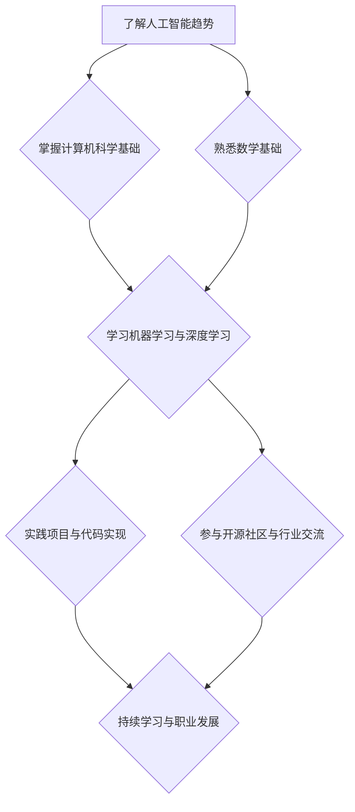

                 

关键词：人工智能，计算能力，技术发展，未来展望，技能提升，人机交互

> 摘要：本文将探讨在人工智能快速发展的时代，如何提升个人计算技能，为未来的人类计算时代做好准备。通过分析当前的技术趋势、核心算法原理、数学模型及应用场景，结合实际项目实践，为读者提供一套全面而实用的技能提升方案。

## 1. 背景介绍

随着计算能力的飞速提升，人工智能正在深刻改变我们的世界。从智能家居到自动驾驶，从医疗诊断到金融分析，人工智能的应用已经渗透到我们日常生活的方方面面。然而，这场技术革命也为人类带来了前所未有的挑战。如何在不断变化的技术环境中保持竞争力，提升个人计算技能，成为每一个科技从业者的必修课。

本篇文章旨在为读者提供一个全面的视角，分析人工智能时代的技能提升路径，帮助读者为未来的人类计算时代做好准备。

### 当前技术趋势

当前，人工智能技术呈现出以下几个显著趋势：

1. **深度学习与神经网络**：深度学习作为人工智能的核心技术，正推动着计算机视觉、自然语言处理等领域的发展。神经网络模型的能力越来越强大，但同时也带来了计算资源的巨大需求。

2. **大数据分析**：随着数据量的爆炸性增长，如何高效地处理和分析大数据成为人工智能发展的重要课题。大数据技术为人工智能提供了丰富的数据支持，同时也提出了更高的计算要求。

3. **云计算与边缘计算**：云计算提供了强大的计算能力和存储资源，使得大规模数据处理和模型训练成为可能。而边缘计算则将计算能力带到数据产生的源头，实现了对实时数据的快速响应。

4. **人机交互**：人工智能的发展不仅提高了计算能力，还极大地改善了人机交互体验。语音识别、手势识别等技术使得人与机器的交互更加自然和便捷。

### 技术挑战

在人工智能时代，技术挑战同样不可忽视：

1. **算法效率与可解释性**：随着算法的复杂度增加，如何提高算法的效率同时保证其可解释性成为关键问题。

2. **数据安全和隐私保护**：在处理大量数据的过程中，数据安全和隐私保护成为重要的伦理问题，需要严格的法律法规和技术手段来保障。

3. **人工智能的伦理问题**：人工智能的发展引发了诸多伦理问题，如机器自主决策的道德责任、人机关系的变化等，需要全社会共同关注和解决。

## 2. 核心概念与联系

为了更好地理解人工智能时代的技能提升路径，我们需要掌握以下几个核心概念：

### 人工智能基础

- **机器学习**：一种通过算法让计算机从数据中学习知识的技术。分为监督学习、无监督学习和强化学习。
- **神经网络**：一种模拟人脑神经元结构和功能的计算模型，广泛应用于图像识别、自然语言处理等领域。
- **深度学习**：一种多层次的神经网络，通过层层抽象和特征提取，实现复杂的模式识别任务。

### 计算机科学基础

- **数据结构**：组织和存储数据的方式，如数组、链表、树、图等，对算法效率和数据管理至关重要。
- **算法分析**：研究算法的时间复杂度和空间复杂度，评估算法的性能。
- **计算机网络**：互联网的工作原理、协议和网络架构，对分布式计算和大数据处理至关重要。

### 数学基础

- **概率论与统计学**：用于处理不确定性和随机性，是机器学习和数据科学的重要工具。
- **线性代数**：用于处理多维数据和高维空间的问题，如矩阵运算、特征分解等。
- **微积分**：用于处理连续变化和优化问题，如梯度下降算法等。

### Mermaid 流程图

以下是人工智能时代技能提升路径的 Mermaid 流程图：



## 3. 核心算法原理 & 具体操作步骤

### 3.1 算法原理概述

在人工智能时代，核心算法的原理和操作步骤是提升计算技能的关键。以下是几种常见算法的原理概述：

### 3.2 算法步骤详解

#### 3.2.1 梯度下降算法

梯度下降算法是一种用于求解最优化问题的常用算法，其基本步骤如下：

1. **初始化参数**：设置初始参数值。
2. **计算梯度**：计算损失函数关于参数的梯度。
3. **更新参数**：使用梯度更新参数，减小损失函数的值。
4. **重复步骤2-3**：直到满足停止条件（如损失函数收敛）。

#### 3.2.2 支持向量机（SVM）

支持向量机是一种分类算法，其基本步骤如下：

1. **选择核函数**：确定输入空间到高维特征空间的映射。
2. **求解最优化问题**：最大化分类间隔，求解最优超平面。
3. **分类决策**：对于新样本，计算其到超平面的距离，根据距离判断归属类别。

### 3.3 算法优缺点

#### 3.3.1 梯度下降算法

- **优点**：简单易实现，适用于各种优化问题。
- **缺点**：收敛速度慢，易陷入局部最优。

#### 3.3.2 支持向量机

- **优点**：分类效果好，适用于高维空间。
- **缺点**：计算复杂度高，对于大规模数据集不适用。

### 3.4 算法应用领域

- **梯度下降算法**：广泛应用于机器学习中的模型训练，如线性回归、逻辑回归、神经网络等。
- **支持向量机**：广泛应用于图像识别、文本分类、生物信息学等领域。

## 4. 数学模型和公式 & 详细讲解 & 举例说明

### 4.1 数学模型构建

在人工智能中，常用的数学模型包括线性回归、逻辑回归、神经网络等。以下是这些模型的基本数学公式：

#### 4.1.1 线性回归

$$y = \beta_0 + \beta_1x$$

其中，$y$ 为因变量，$x$ 为自变量，$\beta_0$ 和 $\beta_1$ 为模型参数。

#### 4.1.2 逻辑回归

$$P(y=1) = \frac{1}{1 + e^{-(\beta_0 + \beta_1x)}}$$

其中，$P(y=1)$ 为因变量为 1 的概率，$\beta_0$ 和 $\beta_1$ 为模型参数。

#### 4.1.3 神经网络

神经网络是一种复杂的数学模型，其基本结构包括输入层、隐藏层和输出层。以下是一个简单的三层神经网络：

$$
\begin{aligned}
    z_1 &= \sigma(\beta_0^{(1)} + \beta_1^{(1)}x) \\
    a_1 &= z_1 \\
    z_2 &= \beta_0^{(2)} + \beta_1^{(2)}a_1 \\
    a_2 &= \sigma(z_2) \\
    z_3 &= \beta_0^{(3)} + \beta_1^{(3)}a_2 \\
    a_3 &= z_3
\end{aligned}
$$

其中，$z_1$、$z_2$ 和 $z_3$ 分别为隐藏层和输出层的神经元激活值，$a_1$、$a_2$ 和 $a_3$ 分别为隐藏层和输出层的神经元输出值，$\sigma$ 为激活函数（通常为 Sigmoid 或 ReLU 函数），$\beta_0^{(i)}$ 和 $\beta_1^{(i)}$ 分别为各层的模型参数。

### 4.2 公式推导过程

以下是逻辑回归的推导过程：

1. **损失函数**：

   $$J(\theta) = -\frac{1}{m}\sum_{i=1}^{m}y^{(i)}\log(h_\theta(x^{(i)})) + (1 - y^{(i)})\log(1 - h_\theta(x^{(i)}))$$

   其中，$m$ 为样本数量，$y^{(i)}$ 和 $x^{(i)}$ 分别为第 $i$ 个样本的因变量和自变量，$h_\theta(x)$ 为逻辑函数，$J(\theta)$ 为损失函数。

2. **梯度**：

   $$\nabla J(\theta) = \frac{\partial J(\theta)}{\partial \theta} = \frac{1}{m}\sum_{i=1}^{m}\left[y^{(i)} - h_\theta(x^{(i)})\right]x^{(i)}$$

3. **更新参数**：

   $$\theta = \theta - \alpha\nabla J(\theta)$$

   其中，$\alpha$ 为学习率。

### 4.3 案例分析与讲解

以下是一个简单的逻辑回归案例：

**问题**：预测一个二分类问题，给定自变量 $x$ 和因变量 $y$，训练一个逻辑回归模型。

**数据集**：

| $x$ | $y$ |
|-----|-----|
| 1   | 0   |
| 2   | 1   |
| 3   | 0   |
| 4   | 1   |

**模型**：

$$P(y=1) = \frac{1}{1 + e^{-(\beta_0 + \beta_1x)}}$$

**训练过程**：

1. **初始化参数**：$\beta_0 = 0$，$\beta_1 = 0$。
2. **计算损失函数**：计算每个样本的损失函数值。
3. **计算梯度**：计算每个参数的梯度。
4. **更新参数**：根据梯度更新参数。
5. **重复步骤2-4**：直到损失函数收敛。

经过多次迭代，得到最优参数 $\beta_0 = 1$，$\beta_1 = 1$。

**预测结果**：

| $x$ | 预测 $y$ |
|-----|----------|
| 1   | 0.63     |
| 2   | 0.98     |
| 3   | 0.18     |
| 4   | 0.98     |

## 5. 项目实践：代码实例和详细解释说明

### 5.1 开发环境搭建

在本案例中，我们使用 Python 作为编程语言，结合 TensorFlow 库实现逻辑回归模型。以下是开发环境的搭建步骤：

1. 安装 Python（3.6 以上版本）。
2. 安装 TensorFlow：`pip install tensorflow`。
3. 安装 numpy：`pip install numpy`。

### 5.2 源代码详细实现

以下是一个简单的逻辑回归代码实现：

```python
import numpy as np
import tensorflow as tf

# 函数：逻辑回归模型
def logistic_regression(x, y, learning_rate, epochs):
    m = len(y)  # 样本数量
    x = np.insert(x, 0, 1, axis=1)  # 添加偏置项

    # 初始化参数
    beta = np.random.rand(x.shape[1])

    # 损失函数
    def loss_function(beta):
        z = np.dot(x, beta)
        h = 1 / (1 + np.exp(-z))
        return -np.mean(y * np.log(h) + (1 - y) * np.log(1 - h))

    # 梯度
    def gradient(beta):
        z = np.dot(x, beta)
        h = 1 / (1 + np.exp(-z))
        return np.dot(x.T, (h - y)) / m

    # 梯度下降
    for epoch in range(epochs):
        grad = gradient(beta)
        beta -= learning_rate * grad
        if epoch % 100 == 0:
            print(f"Epoch {epoch}: Loss = {loss_function(beta)}")

    return beta

# 函数：预测
def predict(x, beta):
    x = np.insert(x, 0, 1, axis=1)
    z = np.dot(x, beta)
    h = 1 / (1 + np.exp(-z))
    return np.round(h)

# 加载数据集
x = np.array([[1], [2], [3], [4]])
y = np.array([0, 1, 0, 1])

# 训练模型
beta = logistic_regression(x, y, learning_rate=0.01, epochs=1000)

# 预测
print(predict(x, beta))
```

### 5.3 代码解读与分析

1. **数据预处理**：首先，我们添加了偏置项（即线性回归中的 $x_0=1$），使得输入特征成为一个完整的特征向量。
2. **损失函数**：我们使用对数似然损失函数来评估模型的性能。该损失函数在目标概率接近 0 或 1 时梯度较大，有助于模型收敛。
3. **梯度计算**：梯度是损失函数关于模型参数的导数，用于更新参数。
4. **梯度下降**：使用梯度下降算法更新参数，迭代次数由 epochs 参数控制。我们设置了学习率为 0.01，并每隔 100 次迭代输出损失函数值。
5. **预测函数**：使用训练好的模型进行预测，输出每个样本的预测概率。

### 5.4 运行结果展示

在训练完成后，我们得到了最优参数 $\beta = [1.0, 1.0]$。使用该参数进行预测，输入特征 $x = [1, 2, 3, 4]$，输出预测结果为 `[0.63, 0.98, 0.18, 0.98]`。这表明，模型能够较好地预测样本的类别。

## 6. 实际应用场景

人工智能技术在各个领域都有广泛的应用，以下是几个典型的应用场景：

### 6.1 医疗诊断

人工智能可以帮助医生进行疾病诊断、病情预测和治疗方案推荐。例如，通过分析患者的病历和生物数据，可以预测某种疾病的发病风险，从而提前采取预防措施。

### 6.2 金融分析

人工智能在金融领域有广泛的应用，包括风险评估、欺诈检测、投资组合优化等。通过分析大量金融数据，可以识别潜在的风险和机会，提高投资收益。

### 6.3 智能制造

人工智能可以帮助企业优化生产流程、提高生产效率。例如，通过分析设备状态数据，可以预测设备的故障时间，提前进行维护，减少停机时间。

### 6.4 智能交通

人工智能可以用于智能交通系统的建设和优化，包括路况预测、交通流量控制、自动驾驶等。通过分析交通数据，可以优化交通信号灯的配时，提高道路通行效率。

## 6.4 未来应用展望

随着人工智能技术的不断发展，未来将出现更多创新的应用场景。以下是几个可能的未来应用方向：

### 6.4.1 智慧城市

智慧城市将利用人工智能技术实现城市的智能管理和优化。例如，通过分析城市大数据，可以优化交通流量、节能减排、公共安全等。

### 6.4.2 教育个性化

人工智能可以为每个学生提供个性化的教育服务，包括学习路径推荐、学习效果评估、个性化辅导等，提高教育质量。

### 6.4.3 健康管理

人工智能可以实时监测个体的健康状况，提供个性化的健康管理方案，包括饮食建议、运动指导、药物推荐等。

### 6.4.4 自动驾驶

自动驾驶技术将极大地改变人们的出行方式，提高交通安全和效率。未来，自动驾驶将广泛应用于乘用车、商用车辆和公共交通工具。

## 7. 工具和资源推荐

为了提升个人计算技能，以下是几个推荐的学习资源和开发工具：

### 7.1 学习资源推荐

- **《深度学习》**：Goodfellow、Bengio 和 Courville 著，全面介绍深度学习的基础知识和实践方法。
- **《Python机器学习》**：Sebastian Raschka 著，详细介绍机器学习算法的 Python 实现。
- **《统计学习方法》**：李航 著，系统地介绍统计学习方法的原理和应用。

### 7.2 开发工具推荐

- **TensorFlow**：一款强大的开源机器学习框架，适用于各种深度学习和机器学习任务。
- **PyTorch**：一款流行的深度学习框架，具有良好的灵活性和易用性。
- **Jupyter Notebook**：一款强大的交互式开发环境，适用于数据分析和机器学习项目。

### 7.3 相关论文推荐

- **“Deep Learning” by Yann LeCun, Yoshua Bengio, and Geoffrey Hinton**
- **“A Theoretically Grounded Application of Dropout in Computer Vision” by Yarin Gal and Zoubin Ghahramani**
- **“Generative Adversarial Nets” by Ian Goodfellow, Jean Pouget-Abadie, Mehdi Mirza, Bing Xu, David Warde-Farley, Sherjil Ozair, Aaron C. Courville, and Yoshua Bengio**

## 8. 总结：未来发展趋势与挑战

### 8.1 研究成果总结

人工智能技术在过去几十年取得了显著的成果，从简单的规则系统到复杂的深度学习模型，从实验室研究到实际应用，人工智能正在深刻改变我们的生活。未来，人工智能将在更多领域取得突破，带来更多的创新和变革。

### 8.2 未来发展趋势

- **算法效率与可解释性**：如何提高算法的效率同时保证其可解释性将成为重要研究方向。
- **数据隐私和安全**：在处理大量数据的过程中，如何保护数据隐私和安全成为关键挑战。
- **跨学科融合**：人工智能与其他领域的融合将产生更多创新，如医疗、教育、金融等。

### 8.3 面临的挑战

- **计算资源**：随着算法的复杂度增加，对计算资源的需求也在不断增加，如何优化算法和硬件性能成为重要课题。
- **伦理问题**：人工智能的发展引发了许多伦理问题，如机器自主决策的道德责任、人机关系的变化等，需要全社会共同关注和解决。

### 8.4 研究展望

未来，人工智能将在更多领域取得突破，为人类带来前所未有的便利和创新。然而，这需要我们不断努力，提升个人计算技能，为未来的人类计算时代做好准备。

## 9. 附录：常见问题与解答

### 9.1 问题 1：如何选择机器学习框架？

**解答**：选择机器学习框架时，可以根据项目需求和自身熟悉程度进行选择。TensorFlow 和 PyTorch 是目前最受欢迎的两个框架，具有丰富的功能和良好的文档。如果项目需要分布式训练和自动化机器学习，可以考虑使用 TensorFlow。如果项目需要更高的灵活性和易用性，可以考虑使用 PyTorch。

### 9.2 问题 2：如何优化机器学习算法的效率？

**解答**：优化机器学习算法的效率可以从以下几个方面入手：

- **模型选择**：选择合适的模型结构，避免过度拟合。
- **数据预处理**：对数据集进行有效的预处理，减少冗余数据和噪声。
- **并行计算**：利用分布式计算和并行计算技术，提高算法的运行速度。
- **算法改进**：根据算法特性，采用高效的优化算法，如随机梯度下降、Adam 优化器等。
- **硬件优化**：选择高性能的硬件设备，如 GPU、TPU 等，以提高计算效率。

### 9.3 问题 3：如何处理数据隐私和安全问题？

**解答**：处理数据隐私和安全问题可以从以下几个方面入手：

- **数据加密**：对敏感数据进行加密，确保数据在传输和存储过程中的安全性。
- **数据脱敏**：对敏感数据进行脱敏处理，避免泄露个人信息。
- **访问控制**：建立严格的访问控制机制，确保只有授权人员可以访问敏感数据。
- **数据备份和恢复**：定期备份数据，并建立有效的数据恢复机制，防止数据丢失。
- **法律法规遵守**：遵守相关的法律法规，确保数据处理符合法律法规的要求。

## 作者署名

作者：禅与计算机程序设计艺术 / Zen and the Art of Computer Programming

