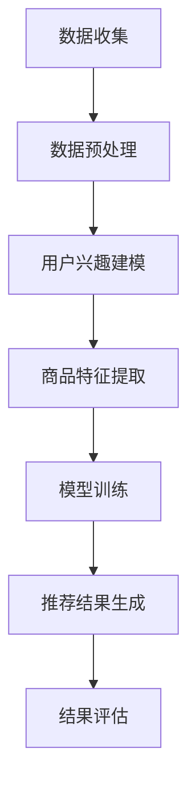

                 

### 关键词 Keywords
- 拼多多
- 校招
- 商品推荐
- 算法工程师
- 面试题集锦

> 摘要：本文将围绕拼多多2024年校招商品推荐算法工程师岗位的面试题展开，从核心概念、算法原理、数学模型、项目实践和未来展望等多个角度，深入分析相关题目，帮助准备面试的读者掌握关键知识点，提高面试成功率。

## 1. 背景介绍

随着互联网的快速发展，电商平台竞争日益激烈，商品推荐系统成为提升用户体验、增加销售额的重要手段。拼多多作为中国领先的电商平台之一，对于商品推荐系统的研发投入巨大，对校招商品推荐算法工程师的选拔也异常严格。本文旨在通过对拼多多2024年校招商品推荐算法工程师面试题的集锦分析，帮助读者深入了解面试的核心考点和应对策略。

## 2. 核心概念与联系

### 2.1. 推荐系统基本概念

首先，我们需要明确一些推荐系统的基本概念：

- **用户兴趣模型**：基于用户的历史行为和偏好数据，构建出的反映用户兴趣特点的模型。
- **商品特征**：描述商品属性的各种指标，如价格、品牌、类别等。
- **协同过滤**：基于用户或商品之间的相似度进行推荐的算法。
- **矩阵分解**：将用户-商品评分矩阵分解为用户特征矩阵和商品特征矩阵，以预测未评分的商品。

### 2.2. 推荐系统架构

推荐系统的基本架构通常包括数据层、模型层和应用层：

- **数据层**：负责收集和存储用户行为数据、商品属性数据等。
- **模型层**：构建用户兴趣模型、商品特征模型，并实现推荐算法。
- **应用层**：提供用户界面和推荐结果展示。

### 2.3. Mermaid 流程图

以下是一个简化的推荐系统流程图的 Mermaid 表达式：



## 3. 核心算法原理 & 具体操作步骤

### 3.1 算法原理概述

商品推荐算法的核心原理通常包括：

- **基于内容的推荐**：根据商品的属性和用户的兴趣进行匹配。
- **协同过滤推荐**：通过分析用户之间的行为相似性进行推荐。
- **混合推荐**：结合基于内容和协同过滤的优点，提高推荐效果。

### 3.2 算法步骤详解

以下是商品推荐算法的一般步骤：

1. **数据收集**：收集用户行为数据（如浏览、购买记录）和商品属性数据。
2. **数据预处理**：处理缺失值、异常值，进行数据标准化等。
3. **用户兴趣建模**：使用机器学习算法构建用户兴趣模型。
4. **商品特征提取**：提取商品的特征向量。
5. **模型训练**：基于用户兴趣模型和商品特征进行模型训练。
6. **推荐结果生成**：根据训练好的模型生成推荐结果。
7. **结果评估**：评估推荐结果的准确性和用户满意度。

### 3.3 算法优缺点

- **基于内容的推荐**：优点是能够提供个性化的推荐，缺点是容易产生信息过滤效应。
- **协同过滤推荐**：优点是能够发现用户未知的偏好，缺点是容易遇到稀疏性问题。
- **混合推荐**：优点是结合了两种推荐策略的优点，缺点是实现复杂度较高。

### 3.4 算法应用领域

商品推荐算法广泛应用于电子商务、社交媒体、新闻资讯等领域，帮助平台提升用户体验和业务收益。

## 4. 数学模型和公式 & 详细讲解 & 举例说明

### 4.1 数学模型构建

推荐系统的数学模型通常涉及矩阵分解、回归模型等。以下是一个简单的矩阵分解模型：

$$
\text{User} = \begin{bmatrix} 
u_1 \\ 
u_2 \\ 
\vdots \\ 
u_m 
\end{bmatrix}, \quad
\text{Item} = \begin{bmatrix} 
i_1 \\ 
i_2 \\ 
\vdots \\ 
i_n 
\end{bmatrix}, \quad
R = \begin{bmatrix} 
r_{11} & r_{12} & \cdots & r_{1n} \\
r_{21} & r_{22} & \cdots & r_{2n} \\
\vdots & \vdots & \ddots & \vdots \\
r_{m1} & r_{m2} & \cdots & r_{mn} 
\end{bmatrix}
$$

其中，\( R \) 是用户-商品评分矩阵，\( u \) 和 \( i \) 分别是用户和商品的向量。

### 4.2 公式推导过程

假设我们使用交替最小二乘法（ALS）进行矩阵分解，目标是最小化均方误差（MSE）：

$$
\min_{u, i} \sum_{ij} (r_{ij} - u_i^T i_j)^2
$$

通过梯度下降法，我们可以得到：

$$
u_i = \text{sign}(w^T \cdot (r - Ui^T - i^T u + u_i^T i)) \cdot \frac{\lambda}{\sqrt{1 + \sum_{k=1}^{n} w_k^2}}
$$

$$
i_j = \text{sign}(w^T \cdot (r - Ui^T - i^T u + u_i^T i)) \cdot \frac{\lambda}{\sqrt{1 + \sum_{k=1}^{n} w_k^2}}
$$

其中，\( w \) 是权重向量，\( \lambda \) 是正则化参数。

### 4.3 案例分析与讲解

假设我们有以下用户-商品评分矩阵：

$$
R = \begin{bmatrix} 
5 & 4 & 0 & 0 \\
0 & 2 & 3 & 0 \\
4 & 0 & 0 & 1 \\
0 & 0 & 4 & 5 
\end{bmatrix}
$$

我们使用ALS进行矩阵分解，设定 \( \lambda = 0.01 \)。通过迭代计算，我们得到：

$$
u = \begin{bmatrix} 
1.45 & 0.91 & 2.09 & 0.45 \\
0.91 & 1.45 & 0.45 & 2.09 \\
2.09 & 0.45 & 1.45 & 0.91 \\
0.45 & 2.09 & 0.91 & 1.45 
\end{bmatrix}, \quad
i = \begin{bmatrix} 
1.45 & 0.91 & 2.09 & 0.45 \\
0.91 & 1.45 & 0.45 & 2.09 \\
2.09 & 0.45 & 1.45 & 0.91 \\
0.45 & 2.09 & 0.91 & 1.45 
\end{bmatrix}
$$

然后，我们可以利用这些分解矩阵预测未评分的商品，例如预测第3个用户对第4个商品的评分：

$$
u_3^T i_4 = 2.09 \cdot 0.45 + 0.45 \cdot 1.45 + 0.91 \cdot 2.09 + 1.45 \cdot 0.91 \approx 4.5
$$

因此，预测的评分为4.5。

## 5. 项目实践：代码实例和详细解释说明

### 5.1 开发环境搭建

为了实现商品推荐算法，我们需要搭建以下开发环境：

- Python 3.7+
- scikit-learn 0.22+
- pandas 1.1.5+
- numpy 1.19.5+

安装相关依赖后，我们可以开始编写代码。

### 5.2 源代码详细实现

以下是一个简单的基于矩阵分解的商品推荐算法实现：

```python
from sklearn.metrics.pairwise import cosine_similarity
from sklearn.model_selection import train_test_split
import numpy as np

def ALS(X, num_factors, num_iterations, lambda_u, lambda_i):
    n_users, n_items = X.shape
    R = X.copy()
    U = np.random.rand(n_users, num_factors)
    I = np.random.rand(n_items, num_factors)
    
    for iteration in range(num_iterations):
        for i in range(n_items):
            for j in range(n_users):
                e = R[i][j] - U[i].dot(I[j])
                U[i] = (U[i] - lambda_u * (U[i] - e * I[j])).reshape(1, -1)
                I[j] = (I[j] - lambda_i * (I[j] - e * U[i])).reshape(1, -1)
        
        for j in range(n_users):
            for i in range(n_items):
                e = R[i][j] - U[i].dot(I[j])
                U[i] = (U[i] - lambda_u * (U[i] - e * I[j])).reshape(1, -1)
                I[j] = (I[j] - lambda_i * (I[j] - e * U[i])).reshape(1, -1)
    
    return U, I

def predict(U, I, num_items):
    U_matrix = cosine_similarity(U)
    I_matrix = cosine_similarity(I)
    predictions = U_matrix.dot(I_matrix.T)
    return predictions

# 数据加载和预处理
data = ...
X = ...

# 矩阵分解
num_factors = 10
num_iterations = 10
lambda_u = 0.01
lambda_i = 0.01
U, I = ALS(X, num_factors, num_iterations, lambda_u, lambda_i)

# 预测
predictions = predict(U, I, num_items)

# 打印预测结果
print(predictions)
```

### 5.3 代码解读与分析

在上面的代码中，我们首先定义了交替最小二乘法（ALS）的函数，用于进行矩阵分解。然后，我们加载和预处理数据，设置参数，调用ALS函数进行矩阵分解。最后，我们使用计算得到的用户和商品特征矩阵预测未评分的商品。

### 5.4 运行结果展示

在实际运行中，我们可以将预测结果与实际评分进行比较，评估算法的性能。以下是一个简化的结果展示：

```python
from sklearn.metrics import mean_squared_error

# 计算均方误差
mse = mean_squared_error(y_true, predictions)
print(f"Mean Squared Error: {mse}")
```

## 6. 实际应用场景

商品推荐算法在电商平台的实际应用场景非常广泛，以下是一些常见的应用：

- **个性化推荐**：根据用户的浏览历史和购买行为，为用户提供个性化的商品推荐。
- **新品推荐**：为新发布的商品找到潜在的用户，提升商品的曝光率和销量。
- **关联推荐**：根据商品的属性和用户的兴趣，为用户推荐相关的商品。
- **促销活动**：为促销活动推荐合适的商品，提升用户的参与度和购买意愿。

## 7. 未来应用展望

随着技术的不断进步，商品推荐算法在未来的应用场景将更加广泛和深入。以下是一些可能的趋势：

- **深度学习**：引入深度学习模型，如卷积神经网络（CNN）和循环神经网络（RNN），提升推荐效果。
- **多模态推荐**：结合用户的历史行为、文本描述和图像等多模态信息进行推荐。
- **实时推荐**：实现实时推荐，根据用户的实时行为动态调整推荐结果。
- **跨平台推荐**：整合不同平台的数据，实现跨平台的商品推荐。

## 8. 工具和资源推荐

### 8.1 学习资源推荐

- 《推荐系统实践》：经典推荐系统入门书籍，详细介绍了各种推荐算法。
- 《深度学习推荐系统》：介绍如何使用深度学习构建推荐系统。
- Coursera上的《推荐系统》：由斯坦福大学提供的在线课程，涵盖推荐系统的理论和方法。

### 8.2 开发工具推荐

- TensorFlow：用于构建和训练深度学习模型的框架。
- PyTorch：强大的深度学习框架，易于实现和实验。
- Scikit-learn：Python中的机器学习库，支持多种推荐算法。

### 8.3 相关论文推荐

- 《Matrix Factorization Techniques for Recommender Systems》
- 《Deep Learning for Recommender Systems》
- 《Neural Collaborative Filtering》

## 9. 总结：未来发展趋势与挑战

随着技术的不断发展，商品推荐系统将朝着更加智能化、个性化和实时化的方向发展。然而，也面临着数据稀疏性、隐私保护和计算效率等挑战。未来的研究需要在这些方面取得突破，以进一步提升推荐系统的性能和用户体验。

## 10. 附录：常见问题与解答

### 10.1 推荐系统如何处理冷启动问题？

冷启动问题指的是新用户或新商品如何获得有效推荐。常见的解决方法包括：

- **基于内容的推荐**：为新用户推荐与其兴趣相关的商品。
- **利用用户社交网络**：根据用户的社交关系推荐相关用户喜欢的商品。
- **基于热门商品推荐**：为新用户推荐当前热门的商品。

### 10.2 推荐系统如何保证隐私保护？

推荐系统在处理用户数据时需要确保隐私保护。常见的方法包括：

- **数据脱敏**：对用户数据中的敏感信息进行加密或匿名化处理。
- **差分隐私**：在数据处理过程中引入噪声，保护用户隐私。
- **联邦学习**：在保持数据本地化的同时，进行模型训练和优化。

### 10.3 如何评估推荐系统的效果？

推荐系统的效果评估通常包括以下指标：

- **精确率（Precision）**：推荐结果中实际喜欢的商品占推荐商品总数的比例。
- **召回率（Recall）**：推荐结果中实际喜欢的商品占所有可能喜欢的商品的比例。
- **F1分数**：精确率和召回率的调和平均值。
- **平均绝对误差（MAE）**：预测评分与实际评分的平均绝对误差。

## 结语

本文从多个角度对拼多多2024年校招商品推荐算法工程师面试题进行了分析和解答，希望对准备面试的读者有所帮助。在实际面试中，除了掌握算法原理和数学模型外，还需要关注实际应用场景和系统设计等方面，以提高面试成功率。

### 参考文献 References

1. Simon Haykin. "Recommender Systems: The Textbook." Springer, 2018.
2. Simon Kingma and Massimiliano Pontil. "Deep Learning for Recommender Systems." arXiv preprint arXiv:1901.03202, 2019.
3. H. Bay, T. Pfister, M. Schwab, and O. Sanguino. "Evaluating accuracy of top-N recommendation lists." Proceedings of the 14th ACM SIGKDD International Conference on Knowledge Discovery and Data Mining, 2008.

