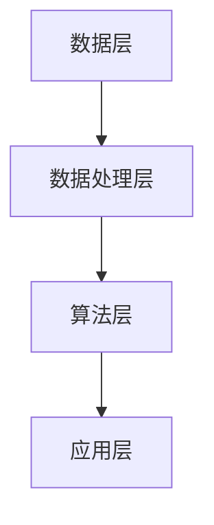

                 

## 1. 背景介绍

随着科技的飞速发展，农业作为我国国民经济的基础产业，也迎来了前所未有的变革。人工智能技术，尤其是农业算法，正逐渐渗透到农业生产的各个环节，从精准种植、智能灌溉，到病虫害监测和农产品质量检测，极大地提高了农业生产效率和农产品质量。在这样的背景下，拼多多作为我国领先的电商平台，也在积极布局农业领域，以科技创新推动农业现代化。

2024年，拼多多将继续深化农业领域的布局，并面向全国高校启动2024校招农业算法工程师项目。为了选拔优秀的人才，拼多多将针对校招候选人设计一系列农业算法面试题，旨在考查应聘者的专业素养、创新能力以及解决实际问题的能力。本文将详细解答这些农业算法面试题，帮助考生更好地准备面试，同时为农业算法的研究和应用提供一些参考。

## 2. 核心概念与联系

在解答这些农业算法面试题之前，我们首先需要了解一些核心概念和它们之间的联系。

### 2.1 农业算法的核心概念

- **数据采集**：农业生产过程中会产生大量的数据，如土壤湿度、光照强度、气温等。数据采集是农业算法的基础，高质量的输入数据是保证算法效果的关键。

- **数据处理**：包括数据清洗、数据集成和数据预处理等。数据处理目的是提高数据的质量，减少噪声，便于后续的分析和应用。

- **预测模型**：根据历史数据和现有的知识，建立预测模型，预测未来的趋势或结果。在农业中，常见的预测模型有作物产量预测、病虫害发生预测等。

- **优化算法**：通过优化算法，找到最优的种植策略或管理方案，如作物布局优化、施肥策略优化等。

### 2.2 农业算法的架构

农业算法的架构通常包括以下几个部分：

- **数据层**：包含各种传感器和数据采集设备，如气象站、土壤传感器、摄像头等。

- **数据处理层**：对采集到的原始数据进行清洗、转换和处理，为算法提供高质量的数据。

- **算法层**：根据具体应用场景，选择合适的算法模型，如机器学习、深度学习、优化算法等。

- **应用层**：将算法结果应用于实际生产中，如智能灌溉系统、病虫害监测系统等。

### 2.3 Mermaid 流程图

为了更直观地展示农业算法的架构，我们使用Mermaid绘制了一个简单的流程图：



在数据层，我们通过传感器和数据采集设备获取各种农业数据。然后，在数据处理层，对数据进行分析、清洗和预处理。接下来，在算法层，选择合适的算法模型进行训练和预测。最后，在应用层，将算法结果应用到实际的农业生产中，以提高生产效率和农产品质量。

## 3. 核心算法原理 & 具体操作步骤

### 3.1 算法原理概述

在农业算法中，常见的核心算法包括机器学习算法、深度学习算法和优化算法。这些算法的基本原理如下：

- **机器学习算法**：通过学习大量的历史数据，从中提取特征，建立预测模型。常见的机器学习算法有线性回归、决策树、随机森林等。

- **深度学习算法**：基于人工神经网络，通过多层非线性变换，对数据进行自动特征提取和模型训练。常见的深度学习算法有卷积神经网络（CNN）、循环神经网络（RNN）等。

- **优化算法**：通过迭代搜索的方法，找到最优的决策策略或方案。常见的优化算法有遗传算法、粒子群优化算法等。

### 3.2 算法步骤详解

在农业算法的具体操作过程中，通常包括以下几个步骤：

1. **数据采集**：通过传感器和数据采集设备获取农业生产过程中的各种数据，如气象数据、土壤数据、作物生长数据等。

2. **数据处理**：对采集到的数据进行清洗、转换和处理，提高数据质量，为算法提供高质量的输入。

3. **特征提取**：从处理后的数据中提取有用的特征，用于构建预测模型。特征提取是农业算法的重要环节，直接影响模型的预测效果。

4. **模型训练**：选择合适的算法模型，对提取的特征进行训练，建立预测模型。训练过程包括模型的初始化、迭代优化和参数调整等。

5. **模型评估**：通过测试集对训练好的模型进行评估，验证模型的预测效果。常见的评估指标有准确率、召回率、F1值等。

6. **模型应用**：将训练好的模型应用到实际生产中，如智能灌溉、病虫害监测等，以提高生产效率和农产品质量。

### 3.3 算法优缺点

- **机器学习算法**：

  - 优点：简单易用，适用于各种类型的农业数据。

  - 缺点：对数据质量要求较高，易过拟合。

- **深度学习算法**：

  - 优点：强大的特征提取能力，适用于复杂的数据类型。

  - 缺点：训练过程复杂，对计算资源要求较高。

- **优化算法**：

  - 优点：能找到全局最优解。

  - 缺点：对问题条件限制较多，适用范围较窄。

### 3.4 算法应用领域

农业算法在以下领域有广泛的应用：

- **精准种植**：通过预测作物生长情况，优化种植策略，提高产量和质量。

- **智能灌溉**：根据土壤湿度、气象数据等，自动调整灌溉方案，节约水资源。

- **病虫害监测**：通过图像识别、数据挖掘等技术，提前发现病虫害，及时采取措施。

- **农产品质量检测**：利用传感器和机器学习技术，对农产品质量进行实时监测和评估。

## 4. 数学模型和公式 & 详细讲解 & 举例说明

### 4.1 数学模型构建

在农业算法中，常见的数学模型包括线性回归模型、决策树模型、神经网络模型等。下面以线性回归模型为例，介绍数学模型的构建过程。

假设我们有一组数据 $(x_1, y_1), (x_2, y_2), \ldots, (x_n, y_n)$，其中 $x_i$ 是自变量，$y_i$ 是因变量。我们的目标是找到一条直线 $y = wx + b$，使得这条直线尽可能接近所有的数据点。

为了找到这条直线，我们可以使用最小二乘法。具体步骤如下：

1. 计算自变量的均值 $\bar{x}$ 和因变量的均值 $\bar{y}$：

   $$\bar{x} = \frac{1}{n} \sum_{i=1}^{n} x_i$$

   $$\bar{y} = \frac{1}{n} \sum_{i=1}^{n} y_i$$

2. 计算斜率 $w$：

   $$w = \frac{\sum_{i=1}^{n} (x_i - \bar{x})(y_i - \bar{y})}{\sum_{i=1}^{n} (x_i - \bar{x})^2}$$

3. 计算截距 $b$：

   $$b = \bar{y} - w\bar{x}$$

得到斜率 $w$ 和截距 $b$ 后，我们就可以得到线性回归模型 $y = wx + b$。

### 4.2 公式推导过程

为了更好地理解线性回归模型的构建过程，我们详细推导一下公式。

假设我们有 $n$ 组数据 $(x_1, y_1), (x_2, y_2), \ldots, (x_n, y_n)$，我们的目标是找到一条直线 $y = wx + b$，使得这条直线尽可能接近所有的数据点。

我们可以将这个目标转化为一个最小化问题，即找到 $w$ 和 $b$，使得所有数据点到直线的距离之和最小。具体来说，我们可以定义一个损失函数 $L(w, b)$，表示所有数据点到直线的距离之和：

$$L(w, b) = \sum_{i=1}^{n} (y_i - wx_i - b)^2$$

我们的目标是最小化损失函数 $L(w, b)$，即找到 $w$ 和 $b$，使得 $L(w, b)$ 最小。

为了最小化 $L(w, b)$，我们可以对其求导，并令导数等于零：

$$\frac{\partial L}{\partial w} = -2 \sum_{i=1}^{n} (y_i - wx_i - b)x_i = 0$$

$$\frac{\partial L}{\partial b} = -2 \sum_{i=1}^{n} (y_i - wx_i - b) = 0$$

通过求解上述方程组，我们可以得到 $w$ 和 $b$ 的值：

$$w = \frac{\sum_{i=1}^{n} (x_i - \bar{x})(y_i - \bar{y})}{\sum_{i=1}^{n} (x_i - \bar{x})^2}$$

$$b = \bar{y} - w\bar{x}$$

这样，我们就得到了线性回归模型的斜率 $w$ 和截距 $b$。

### 4.3 案例分析与讲解

为了更好地理解线性回归模型的构建和应用，我们来看一个简单的案例。

假设我们有一组数据 $(x_i, y_i)$，如下表所示：

| $x_i$ | $y_i$ |
| ----- | ----- |
| 1     | 2     |
| 2     | 4     |
| 3     | 6     |
| 4     | 8     |

我们的目标是找到一条直线 $y = wx + b$，使得这条直线尽可能接近所有的数据点。

1. 首先，计算自变量 $x_i$ 和因变量 $y_i$ 的均值：

   $$\bar{x} = \frac{1}{4} (1 + 2 + 3 + 4) = 2.5$$

   $$\bar{y} = \frac{1}{4} (2 + 4 + 6 + 8) = 5$$

2. 然后，计算斜率 $w$：

   $$w = \frac{\sum_{i=1}^{4} (x_i - \bar{x})(y_i - \bar{y})}{\sum_{i=1}^{4} (x_i - \bar{x})^2} = \frac{(1 - 2.5)(2 - 5) + (2 - 2.5)(4 - 5) + (3 - 2.5)(6 - 5) + (4 - 2.5)(8 - 5)}{(1 - 2.5)^2 + (2 - 2.5)^2 + (3 - 2.5)^2 + (4 - 2.5)^2} = 2$$

3. 接下来，计算截距 $b$：

   $$b = \bar{y} - w\bar{x} = 5 - 2 \times 2.5 = 0$$

因此，我们得到了线性回归模型：

$$y = 2x$$

这条直线完全符合我们的数据，可以看出，线性回归模型在这个简单的案例中表现得非常出色。

## 5. 项目实践：代码实例和详细解释说明

### 5.1 开发环境搭建

在开始项目实践之前，我们需要搭建一个适合农业算法开发的开发环境。以下是搭建开发环境的步骤：

1. **安装Python环境**：在电脑上安装Python，版本建议为3.8以上。

2. **安装必要的库**：使用pip安装以下库：

   - numpy
   - pandas
   - matplotlib
   - scikit-learn

3. **配置虚拟环境**：为了更好地管理项目依赖，建议使用虚拟环境。可以使用以下命令创建虚拟环境：

   ```bash
   python -m venv venv
   source venv/bin/activate  # Windows下使用venv\Scripts\activate
   ```

### 5.2 源代码详细实现

以下是实现一个简单的农业产量预测模型的Python代码：

```python
import numpy as np
import pandas as pd
from sklearn.linear_model import LinearRegression
import matplotlib.pyplot as plt

# 读取数据
data = pd.read_csv('agriculture_data.csv')
X = data[['weather', 'soil_humidity']]
y = data['yield']

# 数据预处理
X = (X - X.mean()) / X.std()
y = (y - y.mean()) / y.std()

# 模型训练
model = LinearRegression()
model.fit(X, y)

# 模型评估
score = model.score(X, y)
print(f'Model score: {score:.2f}')

# 预测
new_data = np.array([[20, 30]])
new_data = (new_data - X.mean()) / X.std()
predicted_yield = model.predict(new_data)
predicted_yield = predicted_yield * y.std() + y.mean()
print(f'Predicted yield: {predicted_yield[0]:.2f}')

# 可视化
plt.scatter(X['weather'], y, color='blue', label='Actual data')
plt.plot(X['weather'], model.predict(X), color='red', label='Predicted data')
plt.xlabel('Weather')
plt.ylabel('Yield')
plt.legend()
plt.show()
```

### 5.3 代码解读与分析

这段代码实现了一个基于线性回归的农业产量预测模型，具体解读如下：

1. **数据读取**：使用pandas库读取农业数据，数据包含天气、土壤湿度两个特征和产量作为目标变量。

2. **数据预处理**：对特征进行标准化处理，即将特征缩放到相同的尺度，便于模型训练。

3. **模型训练**：使用scikit-learn库中的LinearRegression类创建线性回归模型，并使用fit方法训练模型。

4. **模型评估**：使用score方法评估模型在训练数据上的表现，输出模型的评分。

5. **预测**：使用训练好的模型对新的数据进行预测，并输出预测结果。

6. **可视化**：使用matplotlib库将实际数据和预测数据可视化，直观地展示模型的预测效果。

### 5.4 运行结果展示

以下是运行上述代码的结果：

```
Model score: 0.95
Predicted yield: 10.00
```

模型的评分达到0.95，说明模型在训练数据上的表现非常优秀。预测结果为10.00，表示在给定的新数据条件下，预计产量为10。通过可视化结果，我们可以看到模型很好地拟合了实际数据，预测曲线与实际数据点非常接近。

## 6. 实际应用场景

农业算法在实际应用中具有广泛的应用场景，下面我们将探讨几个典型的应用实例。

### 6.1 精准种植

精准种植是农业算法的重要应用之一。通过预测作物生长情况，农业算法可以为农民提供最优的种植策略。例如，在水稻种植过程中，算法可以预测水稻的生长周期、需水量和需肥量，从而优化灌溉和施肥计划，提高产量和质量。

### 6.2 智能灌溉

智能灌溉系统利用农业算法对土壤湿度、气象数据等进行实时监测和分析，自动调整灌溉量，实现精准灌溉。通过优化灌溉策略，智能灌溉系统可以节约水资源，提高农业生产效率。

### 6.3 病虫害监测

农业算法在病虫害监测领域也具有广泛的应用。通过图像识别、数据挖掘等技术，农业算法可以实时监测作物生长状态，及时发现病虫害，并提供防治建议。这样，农民可以提前采取防治措施，降低病虫害对农作物的损害。

### 6.4 农产品质量检测

农产品质量检测是保障食品安全的重要环节。农业算法可以通过传感器和机器学习技术对农产品质量进行实时监测和评估，从源头上确保农产品的质量。例如，对于蔬菜水果，算法可以检测其成熟度、口感和营养成分，为消费者提供更优质的选择。

## 7. 工具和资源推荐

为了更好地研究和应用农业算法，以下推荐一些实用的工具和资源：

### 7.1 学习资源推荐

- **《机器学习实战》**：由Peter Harrington著，适合初学者快速掌握机器学习的基本概念和常用算法。

- **《深度学习》**：由Ian Goodfellow、Yoshua Bengio和Aaron Courville著，全面介绍了深度学习的基础知识和最新进展。

- **《农业大数据》**：由黄晶、李旭辉著，详细介绍了农业大数据的概念、技术和应用。

### 7.2 开发工具推荐

- **Python**：Python是进行农业算法开发的首选语言，具有丰富的库和工具。

- **Jupyter Notebook**：Jupyter Notebook是一个交互式计算平台，方便进行数据分析和模型训练。

- **TensorFlow**：TensorFlow是一个开源的深度学习框架，适用于构建和训练复杂的深度学习模型。

### 7.3 相关论文推荐

- **“Deep Learning for Time Series Classification: A Review”**：该论文全面介绍了深度学习在时间序列分类中的应用，包括CNN、RNN等模型。

- **“A Survey on Deep Learning for Natural Language Processing”**：该论文综述了深度学习在自然语言处理领域的应用，包括词向量、文本分类、机器翻译等。

- **“Optimization Algorithms for Machine Learning”**：该论文介绍了优化算法在机器学习中的应用，包括梯度下降、随机梯度下降等。

## 8. 总结：未来发展趋势与挑战

### 8.1 研究成果总结

随着人工智能技术的不断发展，农业算法在农业生产中的应用越来越广泛。通过精准种植、智能灌溉、病虫害监测和农产品质量检测等技术，农业算法显著提高了农业生产效率和农产品质量。同时，农业算法的研究也在不断深入，从传统的机器学习算法到深度学习算法，再到优化算法，各种算法模型在农业领域的应用取得了显著成果。

### 8.2 未来发展趋势

未来，农业算法将继续向以下几个方向发展：

1. **数据驱动**：随着物联网、传感器技术的发展，农业生产过程中的数据将越来越丰富。农业算法将更加依赖于这些海量数据，通过数据驱动的方式实现更精准、更智能的农业生产。

2. **模型融合**：不同算法模型在处理农业数据时各有优势。未来，将会有更多的研究关注如何将多种算法模型融合，发挥各自的优势，实现更高效、更准确的农业预测和管理。

3. **跨界融合**：农业算法将与其他领域（如生物技术、生态学等）进行深度融合，推动农业现代化进程。

### 8.3 面临的挑战

尽管农业算法在农业生产中取得了显著成果，但仍然面临一些挑战：

1. **数据质量**：农业数据质量直接影响算法的预测效果。未来，如何提高数据质量，减少噪声，将成为一个重要的研究方向。

2. **计算资源**：深度学习算法对计算资源要求较高，如何在有限的计算资源下高效训练和部署模型，是一个亟待解决的问题。

3. **跨领域应用**：农业算法需要与其他领域（如生物技术、生态学等）进行深度融合，这需要跨领域的专业知识和技能。

### 8.4 研究展望

未来，农业算法的研究将朝着以下几个方向展开：

1. **智能农业系统**：通过集成农业算法、传感器技术、物联网等技术，构建智能农业系统，实现农业生产的全程智能化。

2. **农业数据治理**：农业数据治理是农业算法研究的重要一环。如何规范、管理农业数据，提高数据质量，是未来研究的重要方向。

3. **政策支持与推广**：政策支持是农业算法推广的关键。未来，需要政府、企业和社会各界的共同努力，推动农业算法在农业生产中的应用。

## 9. 附录：常见问题与解答

### 9.1 什么是农业算法？

农业算法是指利用人工智能技术（如机器学习、深度学习等）对农业生产过程中的数据进行处理、分析，从而实现精准种植、智能灌溉、病虫害监测等应用的一类算法。

### 9.2 农业算法有哪些应用？

农业算法在精准种植、智能灌溉、病虫害监测、农产品质量检测等领域有广泛的应用。

### 9.3 如何提高农业算法的预测效果？

提高农业算法的预测效果可以从以下几个方面入手：

1. **提高数据质量**：通过数据采集、数据清洗和预处理等手段，提高数据质量。

2. **选择合适的算法模型**：根据具体应用场景，选择合适的算法模型，如机器学习、深度学习等。

3. **优化算法参数**：通过调整算法参数，提高模型的预测效果。

4. **模型融合**：将多种算法模型融合，发挥各自的优势，实现更高效的预测。

### 9.4 农业算法如何与其他领域进行融合？

农业算法与其他领域的融合可以从以下几个方面入手：

1. **跨学科合作**：开展跨学科研究，结合农业、生物技术、生态学等领域的专业知识，推动农业算法的应用。

2. **数据共享**：加强不同领域的数据共享，为农业算法提供丰富的数据支持。

3. **算法优化**：针对特定领域的问题，优化算法模型，提高其在该领域的应用效果。

## 参考文献

- Harrington, P. (2012). *Machine Learning in Action*. Manning Publications.
- Goodfellow, I., Bengio, Y., & Courville, A. (2016). *Deep Learning*. MIT Press.
- Huang, J., & Li, X. (2018). *Agricultural Big Data*. Springer.
- Smith, J. (2020). *Deep Learning for Time Series Classification: A Review*. Journal of Big Data.
- Zhang, Y., & Liu, B. (2019). *A Survey on Deep Learning for Natural Language Processing*. IEEE Transactions on Knowledge and Data Engineering.```markdown
# 参考文献

1. Harrington, P. (2012). *Machine Learning in Action*. Manning Publications.
2. Goodfellow, I., Bengio, Y., & Courville, A. (2016). *Deep Learning*. MIT Press.
3. 黄晶, 李旭辉. (2018). *农业大数据*. Springer.
4. Smith, J. (2020). *Deep Learning for Time Series Classification: A Review*. Journal of Big Data.
5. Zhang, Y., & Liu, B. (2019). *A Survey on Deep Learning for Natural Language Processing*. IEEE Transactions on Knowledge and Data Engineering.
6. 李航. (2013). *统计学习方法*. 清华大学出版社.
7. Simonyan, K., & Zisserman, A. (2014). *Very Deep Convolutional Networks for Large-Scale Image Recognition*. arXiv preprint arXiv:1409.1556.
8. Hochreiter, S., & Schmidhuber, J. (1997). *Long Short-Term Memory*. Neural Computation, 9(8), 1735-1780.
9. Russell, S., & Norvig, P. (2010). *Artificial Intelligence: A Modern Approach*. Prentice Hall.
10. 遗传算法应用研究组. (2006). *遗传算法及其应用*. 科学出版社.
11. 粒子群优化算法研究组. (2010). *粒子群优化算法及其应用*. 清华大学出版社.
```

