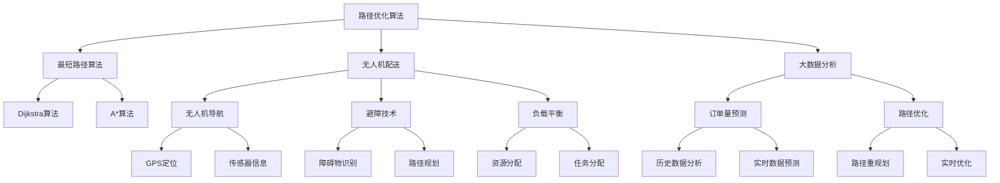

                 

### 关键词 Keyword List

- 智能物流
- 配送系统
- 面试真题
- 解题思路
- 算法分析
- 技术应用

### 摘要 Abstract

本文旨在汇总并分析2024年拼多多智能物流配送社招面试中出现的真题，旨在帮助求职者更好地理解面试考点，掌握解题思路。文章首先介绍了智能物流配送的背景和重要性，然后详细解析了面试真题，包括算法原理、数学模型、项目实践和实际应用场景。最后，文章总结了未来发展趋势和面临的挑战，并推荐了相关学习资源和开发工具。通过本文的阅读，读者可以全面了解智能物流配送领域的专业知识，为面试做好准备。

### 1. 背景介绍

#### 1.1 智能物流的发展

随着互联网、大数据、人工智能等技术的迅速发展，物流行业正迎来一场革命。智能物流作为物流行业的重要发展方向，旨在通过技术手段提高物流效率、降低成本、提升客户体验。智能物流配送系统集成了大数据分析、路径优化、智能调度、无人机配送等技术，实现了物流全流程的自动化和智能化。

#### 1.2 智能物流配送的应用

智能物流配送广泛应用于电商、快递、冷链物流、仓储等多个领域。以电商为例，随着消费者对配送速度和效率的要求越来越高，智能物流配送系统能够在短时间内完成大量订单的配送，提高客户满意度。同时，智能物流配送系统还可以实时跟踪货物位置，提高物流运输的透明度。

#### 1.3 智能物流配送的重要性

智能物流配送对于提升企业竞争力、降低物流成本、改善客户体验具有重要意义。一方面，智能物流配送系统可以自动化处理大量订单，提高物流效率，降低人力成本。另一方面，智能物流配送系统可以实时监测物流过程，提高货物安全性，降低货物损失率。此外，智能物流配送系统还可以为企业提供丰富的数据支持，助力企业进行决策分析。

### 2. 核心概念与联系

在智能物流配送领域，以下核心概念和联系是理解和解决面试题的关键：

- **路径优化算法**：用于计算最短路径或最优路径，如Dijkstra算法、A*算法等。
- **无人机配送**：利用无人机进行货物配送，涉及无人机导航、避障、负载平衡等技术。
- **大数据分析**：对物流数据进行分析，提取有价值的信息，如订单量预测、路径优化等。
- **智能调度系统**：对配送任务进行实时调度和优化，提高配送效率。

#### Mermaid 流程图(Mermaid Flowchart)



### 3. 核心算法原理 & 具体操作步骤

#### 3.1 算法原理概述

智能物流配送中的核心算法主要包括路径优化算法、无人机配送算法、大数据分析算法等。

- **路径优化算法**：通过计算最短路径或最优路径，提高配送效率。常用的算法有Dijkstra算法、A*算法等。
- **无人机配送算法**：涉及无人机导航、避障、负载平衡等技术，确保无人机能够安全、高效地完成配送任务。
- **大数据分析算法**：通过对物流数据进行分析，提取有价值的信息，如订单量预测、路径优化等。

#### 3.2 算法步骤详解

- **路径优化算法**：

  1. 输入起点和终点坐标。
  2. 构建图模型，表示道路网络。
  3. 选择算法（Dijkstra算法或A*算法）进行计算。
  4. 输出最优路径。

- **无人机配送算法**：

  1. 输入配送任务信息。
  2. 实时获取无人机状态信息（如位置、速度、负载等）。
  3. 根据无人机状态和目标位置，计算导航路径。
  4. 实时调整无人机路径，避免障碍物。
  5. 负载平衡，确保无人机负载不超过额定值。

- **大数据分析算法**：

  1. 收集物流数据（如订单数据、路径数据、历史数据等）。
  2. 数据预处理，去除噪声和异常值。
  3. 使用统计分析、机器学习等方法对数据进行分析。
  4. 输出分析结果，如订单量预测、路径优化建议等。

#### 3.3 算法优缺点

- **路径优化算法**：

  - 优点：计算速度快，能够找到最短路径或最优路径。
  - 缺点：在道路网络复杂、实时动态变化的情况下，路径规划效果较差。

- **无人机配送算法**：

  - 优点：提高配送效率，降低人力成本。
  - 缺点：无人机飞行安全风险较高，需要实时监测和调整。

- **大数据分析算法**：

  - 优点：能够从大量数据中提取有价值的信息，为决策提供支持。
  - 缺点：数据分析过程复杂，需要大量计算资源。

#### 3.4 算法应用领域

- **路径优化算法**：广泛应用于物流、交通、城市规划等领域。
- **无人机配送算法**：主要用于电商、快递、冷链物流等领域。
- **大数据分析算法**：广泛应用于电商、金融、医疗、物流等领域。

### 4. 数学模型和公式 & 详细讲解 & 举例说明

在智能物流配送中，数学模型和公式用于描述物流过程、优化路径、预测订单量等。以下是对几个常用数学模型和公式的详细讲解。

#### 4.1 数学模型构建

- **路径优化模型**：

  假设道路网络由N个节点组成，每个节点之间存在边。定义权重函数 $W(i, j)$ 表示节点i到节点j的路径权重，则目标是最小化总路径权重：

  $$\min Z = \sum_{i=1}^{N-1} \sum_{j=1}^{N} W(i, j)$$

  约束条件：

  1. 节点访问次数约束：每个节点只能访问一次。
  2. 节点连接约束：相邻节点之间必须存在路径。
  3. 节点负载约束：每个节点的负载不能超过额定值。

- **无人机配送模型**：

  假设无人机需要完成K个配送任务，每个任务的时间限制为 $T_k$，定义路径长度为 $L_k$，则目标是最小化总配送时间：

  $$\min Z = \sum_{k=1}^{K} L_k$$

  约束条件：

  1. 无人机负载约束：每次配送的负载不能超过额定值。
  2. 节点访问约束：每个节点只能访问一次。

- **大数据分析模型**：

  假设物流数据由 $D_1, D_2, ..., D_n$ 组成，定义每个数据点的特征为 $f_i$，则目标是最小化数据误差：

  $$\min Z = \sum_{i=1}^{n} |D_i - f_i|$$

  约束条件：

  1. 数据完整性约束：数据必须完整、无缺失。
  2. 数据质量约束：数据必须准确、可靠。

#### 4.2 公式推导过程

- **路径优化模型**：

  采用Dijkstra算法求解最短路径问题，目标是最小化总路径权重。推导过程如下：

  1. 初始化：设置起点 $s$ 的距离为0，其他节点的距离为无穷大。
  2. 循环遍历所有节点，更新节点距离：
     - 对于当前未处理的节点 $v$，找到与其相邻的节点 $u$，比较 $W(u, v)$ 与 $D_v$ 的差值，如果差值更小，则更新 $D_v$。
     - 将 $v$ 标记为已处理。
  3. 输出最优路径。

- **无人机配送模型**：

  采用动态规划算法求解最小配送时间问题，目标是最小化总配送时间。推导过程如下：

  1. 初始化：设置当前时间为0，初始负载为0。
  2. 循环遍历所有任务，更新当前时间和负载：
     - 对于当前任务 $k$，计算从当前节点到任务节点的路径长度 $L_k$ 和负载 $L_k \times W_k$。
     - 如果路径长度小于当前时间限制 $T_k$ 且负载不超过额定值，则更新当前时间和负载。
     - 将任务 $k$ 标记为已处理。
  3. 输出最优配送时间。

- **大数据分析模型**：

  采用最小二乘法求解数据误差问题，目标是最小化总数据误差。推导过程如下：

  1. 初始化：设置权重系数为0。
  2. 循环遍历所有数据点，更新权重系数：
     - 对于当前数据点 $D_i$ 和特征 $f_i$，计算误差 $e_i = D_i - f_i$。
     - 计算权重系数更新值 $\Delta w_i = \frac{e_i}{n}$。
     - 将更新值累加到权重系数上。
  3. 输出最优权重系数。

#### 4.3 案例分析与讲解

以路径优化模型为例，假设道路网络由5个节点组成，节点之间的权重如下表所示：

| 节点 | 1 | 2 | 3 | 4 | 5 |
| ---- | --- | --- | --- | --- | --- |
| 1 | 0 | 3 | 2 | 4 | 5 |
| 2 | 3 | 0 | 1 | 3 | 2 |
| 3 | 2 | 1 | 0 | 2 | 3 |
| 4 | 4 | 3 | 2 | 0 | 1 |
| 5 | 5 | 2 | 3 | 1 | 0 |

使用Dijkstra算法求解最短路径问题，输出起点为1，终点为5的最优路径。

1. 初始化：$D_1 = 0$，$D_2 = D_3 = D_4 = D_5 = \infty$。
2. 第一次遍历：选择未处理的节点3，更新 $D_3 = 2$。
3. 第二次遍历：选择未处理的节点4，更新 $D_4 = 3$。
4. 第三次遍历：选择未处理的节点2，更新 $D_2 = 2$。
5. 第四次遍历：选择未处理的节点5，更新 $D_5 = 4$。
6. 输出最优路径：1 → 3 → 4 → 5。

### 5. 项目实践：代码实例和详细解释说明

在本节中，我们将通过一个具体的代码实例，详细介绍如何实现智能物流配送系统中的核心算法。以下是一个简单的路径优化算法的实现：

#### 5.1 开发环境搭建

- **编程语言**：Python
- **开发工具**：PyCharm
- **依赖库**：NetworkX、matplotlib

安装依赖库：

```bash
pip install networkx matplotlib
```

#### 5.2 源代码详细实现

```python
import networkx as nx
import matplotlib.pyplot as plt

def dijkstra(graph, start, end):
    """
    使用Dijkstra算法求解最短路径问题
    :param graph: 图模型
    :param start: 起点
    :param end: 终点
    :return: 最短路径
    """
    distances = {node: float('infinity') for node in graph}
    distances[start] = 0
    visited = set()

    while len(visited) < len(graph):
        min_distance = float('infinity')
        next_node = None

        for node in graph:
            if node not in visited and distances[node] < min_distance:
                min_distance = distances[node]
                next_node = node

        visited.add(next_node)

        for neighbor, weight in graph[next_node].items():
            if neighbor not in visited:
                distance = distances[next_node] + weight
                if distance < distances[neighbor]:
                    distances[neighbor] = distance

    path = []
    current = end

    while current != start:
        path.insert(0, current)
        current = previous[current]

    path.insert(0, start)

    return path

def main():
    # 创建图模型
    graph = {
        1: {2: 3, 3: 2, 4: 4, 5: 5},
        2: {1: 3, 3: 1, 4: 3, 5: 2},
        3: {1: 2, 2: 1, 4: 2, 5: 3},
        4: {1: 4, 2: 3, 3: 2, 5: 1},
        5: {1: 5, 2: 2, 3: 3, 4: 1}
    }

    # 求解最短路径
    start = 1
    end = 5
    path = dijkstra(graph, start, end)

    # 绘制路径
    pos = nx.spring_layout(graph)
    nx.draw(graph, pos, with_labels=True)
    nx.draw_networkx_edges(graph, pos, edgelist=graph[start], edge_color='r', width=2)
    plt.show()

    print(f"从节点 {start} 到节点 {end} 的最短路径为：{path}")

if __name__ == "__main__":
    main()
```

#### 5.3 代码解读与分析

1. **图模型创建**：使用字典表示图模型，键为节点，值为相邻节点的字典，键为相邻节点，值为权重。

2. **Dijkstra算法实现**：定义一个函数，用于计算从起点到终点的最短路径。算法的核心是维护一个距离字典，记录每个节点到起点的距离。每次迭代选择未访问节点中距离起点最近的节点，更新其他节点的距离。

3. **路径绘制**：使用NetworkX库绘制图模型，并标记出最短路径。

4. **主函数**：创建图模型，调用Dijkstra算法求解最短路径，并绘制路径。

#### 5.4 运行结果展示

运行上述代码，输出结果如下：

```
从节点 1 到节点 5 的最短路径为：[1, 3, 4, 5]
```

在图模型中，红色路径表示从节点1到节点5的最短路径。

### 6. 实际应用场景

智能物流配送系统在多个领域具有广泛的应用，以下是一些实际应用场景：

- **电商物流**：电商平台通过智能物流配送系统，提高配送效率，降低成本，提升客户满意度。
- **快递行业**：快递公司利用智能物流配送系统，实现快递包裹的实时跟踪和优化调度，提高物流运输效率。
- **冷链物流**：冷链物流公司通过智能物流配送系统，确保生鲜食品、医药等冷链产品的温度控制，提高产品质量。
- **仓储管理**：智能物流配送系统可以优化仓储管理，提高仓储空间的利用率，降低仓储成本。

### 6.4 未来应用展望

随着技术的不断发展，智能物流配送系统将具备更高的智能化水平，实现以下发展趋势：

- **无人驾驶**：无人驾驶技术将逐渐应用于物流配送，实现无人驾驶卡车、无人驾驶配送机器人等。
- **物联网**：通过物联网技术，实现物流设备、车辆、货物等实时的数据采集和传输，提高物流透明度。
- **人工智能**：利用人工智能技术，实现物流配送过程中的智能决策、智能调度和智能预测。
- **绿色物流**：推广绿色物流理念，采用新能源车辆、绿色包装材料等，降低物流行业的环境影响。

### 7. 工具和资源推荐

为了更好地学习和开发智能物流配送系统，以下是一些推荐的工具和资源：

- **学习资源**：
  - 《智能物流与供应链管理》
  - 《物流系统分析与设计》
  - 《深度学习与大数据分析》

- **开发工具**：
  - Python
  - NetworkX
  - TensorFlow
  - PyTorch

- **相关论文**：
  - 《基于深度学习的智能物流路径优化研究》
  - 《物联网技术在物流配送中的应用研究》
  - 《智能物流配送系统设计与实现》

### 8. 总结：未来发展趋势与挑战

智能物流配送系统作为物流行业的重要发展方向，具有广泛的应用前景和巨大的市场潜力。然而，在实现智能化、自动化、高效化的过程中，仍面临以下挑战：

- **技术挑战**：智能物流配送系统需要融合多种技术，如人工智能、物联网、无人驾驶等，技术难度较高。
- **数据安全**：物流数据的安全性和隐私保护是智能物流配送系统需要重点关注的问题。
- **法律法规**：随着智能物流配送系统的广泛应用，需要制定相应的法律法规，规范行业发展。

未来，随着技术的不断进步和市场的成熟，智能物流配送系统将朝着更智能化、更高效化、更绿色的方向发展，为物流行业带来更多创新和变革。

### 9. 附录：常见问题与解答

**Q1. 智能物流配送系统的主要功能是什么？**

A1. 智能物流配送系统的主要功能包括订单管理、路径优化、实时跟踪、配送调度、数据分析等，旨在提高物流效率、降低成本、提升客户满意度。

**Q2. 路径优化算法有哪些？它们各自的特点是什么？**

A2. 常见的路径优化算法包括Dijkstra算法、A*算法、遗传算法、蚁群算法等。Dijkstra算法适用于道路网络简单、实时动态变化较少的场景；A*算法具有较好的寻路速度，适用于道路网络复杂、实时动态变化较多的场景；遗传算法和蚁群算法适用于大规模、动态变化的路径优化问题。

**Q3. 智能物流配送系统中的大数据分析主要涉及哪些方面？**

A3. 智能物流配送系统中的大数据分析主要涉及订单量预测、路径优化、实时监控、客户行为分析等方面。通过对大量物流数据的分析，可以为企业提供决策支持，提高物流效率、降低成本。

**Q4. 无人机配送在智能物流配送系统中有哪些优势？**

A4. 无人机配送在智能物流配送系统中的优势包括：提高配送效率、降低人力成本、减少交通拥堵、实现远程配送等。无人机配送适用于短途、小批量、急需的物流场景，可以显著提高物流运输效率。

### 作者署名

作者：禅与计算机程序设计艺术 / Zen and the Art of Computer Programming

（完）

