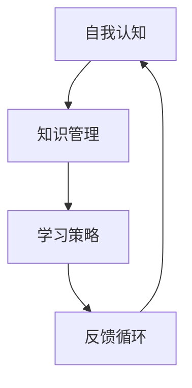

                 

关键词：持续学习，管理者，成功秘诀，技术进步，团队建设，领导力，自我提升，创新思维，专业成长

> 摘要：在快速变化的技术环境中，持续学习已成为管理者保持竞争力的关键。本文旨在探讨管理者如何通过持续学习，提升个人和团队的能力，实现成功。我们将从核心概念、算法原理、数学模型、实践应用等多个角度，深入分析持续学习的重要性及其实现路径。

## 1. 背景介绍

在当今数字化时代，技术进步日新月异，新的技术和工具不断涌现。管理者不仅需要具备深厚的专业知识，还要具备快速学习和适应变化的能力。持续学习已经成为管理者职业生涯中不可或缺的一部分，它不仅关乎个人职业成长，更是团队建设和组织发展的关键。

### 1.1 技术环境的变化

随着云计算、大数据、人工智能等新兴技术的快速发展，传统的管理和运营模式正在被颠覆。管理者需要不断更新自己的知识体系，掌握最新的技术趋势，才能在激烈的竞争中立于不败之地。

### 1.2 管理者的角色转变

从传统管理者向数字化时代的管理者转变，要求管理者不仅要有丰富的管理经验，还要具备创新能力、技术视野和跨领域整合能力。这种角色的转变，使得持续学习成为管理者必备的能力。

### 1.3 学习的重要性

持续学习可以帮助管理者保持思维的活跃性和创新性，提升解决问题的能力，增强领导力和团队凝聚力。在全球化和数字化的大背景下，持续学习是管理者实现成功的关键因素。

## 2. 核心概念与联系

持续学习的核心概念包括自我认知、知识管理、学习策略和反馈循环。以下是一个简化的 Mermaid 流程图，展示了这些核心概念之间的联系。



### 2.1 自我认知

自我认知是指管理者对自己知识、能力和价值观的深刻理解。通过自我认知，管理者可以明确自己的学习目标和方向。

### 2.2 知识管理

知识管理是指管理者对知识进行收集、整理、存储和运用的一系列活动。有效的知识管理可以帮助管理者快速获取和应用所需的知识。

### 2.3 学习策略

学习策略是指管理者在学习过程中采用的方法和技巧。不同的学习策略适用于不同的学习场景，管理者需要根据实际情况选择合适的学习策略。

### 2.4 反馈循环

反馈循环是指管理者通过实践和应用所学知识，获取反馈，并不断调整和优化学习过程。反馈循环是持续学习的重要环节，它可以帮助管理者保持学习的动力和效果。

## 3. 核心算法原理 & 具体操作步骤

### 3.1 算法原理概述

持续学习的核心算法可以概括为以下几个步骤：

1. 自我评估：通过评估自己的知识水平和能力，明确学习目标。
2. 知识收集：通过各种渠道获取与学习目标相关的知识。
3. 学习应用：将所学知识应用于实际工作中，提升实践能力。
4. 反馈优化：通过反馈循环，不断调整和优化学习策略。

### 3.2 算法步骤详解

1. **自我评估**

   自我评估是持续学习的第一步，管理者需要对自己进行全面评估，包括知识水平、能力状况、职业规划等。通过自我评估，管理者可以明确自己的优势和劣势，为制定学习目标提供依据。

2. **知识收集**

   知识收集是持续学习的关键，管理者需要通过多种渠道获取知识。包括阅读专业书籍、参加行业会议、在线课程、技术博客等。在选择知识来源时，管理者需要关注权威性、实用性和前瞻性。

3. **学习应用**

   学习应用是将所学知识付诸实践的过程。管理者需要将理论知识与实际工作相结合，通过项目实践、团队协作等方式，不断提升自己的实践能力。

4. **反馈优化**

   反馈优化是持续学习的重要环节。管理者需要通过实践中的反馈，不断调整和优化学习策略。例如，如果发现自己的知识不足，可以增加相关课程的学习；如果实践效果不佳，可以反思学习过程，寻找改进方法。

### 3.3 算法优缺点

**优点：**

- **提升个人能力**：通过持续学习，管理者可以不断提升自己的知识水平和技能，增强职业竞争力。
- **优化团队建设**：持续学习可以帮助管理者提升领导力，促进团队协作，提高团队整体绩效。
- **适应技术变革**：持续学习使管理者能够紧跟技术发展趋势，适应数字化时代的要求。

**缺点：**

- **时间成本**：持续学习需要投入大量的时间和精力，对管理者的个人时间管理能力提出了挑战。
- **学习效果不确定**：学习效果受多种因素影响，如学习环境、学习资源、个人学习能力等，存在一定的不确定性。

### 3.4 算法应用领域

持续学习算法适用于各类管理者和组织。无论是企业高管、项目经理，还是技术团队领导，都可以通过持续学习，提升个人和团队的能力。在实际应用中，持续学习算法可以与组织的发展战略相结合，推动组织的创新和进步。

## 4. 数学模型和公式 & 详细讲解 & 举例说明

### 4.1 数学模型构建

持续学习过程中的数学模型可以构建为一个动态系统，该系统包括以下几个关键变量：

- **知识储备（K）**：表示管理者在特定领域内的知识总量。
- **学习速率（L）**：表示管理者学习新知识的能力。
- **实践应用（P）**：表示管理者将知识应用于实际工作的效果。
- **反馈调整（F）**：表示管理者根据反馈调整学习策略的效果。

数学模型的基本公式可以表示为：

\[ K(t+1) = K(t) + L(t) \times P(t) - F(t) \times K(t) \]

其中，\( t \) 表示时间。

### 4.2 公式推导过程

假设管理者在时间 \( t \) 的知识储备为 \( K(t) \)，学习速率为 \( L(t) \)，实践应用效果为 \( P(t) \)，反馈调整效果为 \( F(t) \)。则在时间 \( t+1 \) 时，管理者新的知识储备 \( K(t+1) \) 可以通过以下公式计算：

\[ K(t+1) = K(t) + L(t) \times P(t) - F(t) \times K(t) \]

这个公式表示，管理者在时间 \( t+1 \) 的知识储备，等于原有知识储备加上学习速率乘以实践应用效果，减去反馈调整效果乘以原有知识储备。

### 4.3 案例分析与讲解

假设某位项目经理在时间 \( t \) 的知识储备为 100，学习速率为 10，实践应用效果为 0.8，反馈调整效果为 0.2。根据上述公式，可以计算出该项目经理在时间 \( t+1 \) 的知识储备：

\[ K(t+1) = 100 + 10 \times 0.8 - 0.2 \times 100 = 106 \]

这个结果表明，在时间 \( t+1 \) 时，该项目经理的知识储备增加了 6，这表明持续学习对于提升个人能力具有显著效果。

## 5. 项目实践：代码实例和详细解释说明

### 5.1 开发环境搭建

为了更好地理解持续学习的数学模型，我们将使用 Python 编写一个简单的模拟程序。首先，需要搭建 Python 开发环境。以下是搭建步骤：

1. 安装 Python：从 [Python 官网](https://www.python.org/) 下载并安装 Python 3.8 以上版本。
2. 安装 PyCharm：从 [PyCharm 官网](https://www.jetbrains.com/pycharm/) 下载并安装 PyCharm 社区版。
3. 配置 Python 环境：在 PyCharm 中创建一个新的 Python 项目，并设置 Python 解释器为安装的 Python 环境。

### 5.2 源代码详细实现

以下是一个简单的持续学习模拟程序的源代码：

```python
class Learner:
    def __init__(self, knowledge, learning_rate, practice_effect, feedback_adjustment):
        self.knowledge = knowledge
        self.learning_rate = learning_rate
        self.practice_effect = practice_effect
        self.feedback_adjustment = feedback_adjustment
    
    def update_knowledge(self):
        new_knowledge = self.knowledge + self.learning_rate * self.practice_effect - self.feedback_adjustment * self.knowledge
        self.knowledge = new_knowledge
        return self.knowledge

def simulate_learning(knowledge, learning_rate, practice_effect, feedback_adjustment, steps):
    learner = Learner(knowledge, learning_rate, practice_effect, feedback_adjustment)
    for _ in range(steps):
        learner.update_knowledge()
    return learner.knowledge

# 参数设置
knowledge = 100
learning_rate = 10
practice_effect = 0.8
feedback_adjustment = 0.2
steps = 5

# 模拟学习过程
new_knowledge = simulate_learning(knowledge, learning_rate, practice_effect, feedback_adjustment, steps)
print(f"New knowledge after {steps} steps: {new_knowledge}")
```

### 5.3 代码解读与分析

这段代码定义了一个 `Learner` 类，用于表示管理者。类中包括知识储备、学习速率、实践应用效果和反馈调整效果等属性。`update_knowledge` 方法用于更新知识储备，公式与我们之前的数学模型一致。

`simulate_learning` 函数用于模拟学习过程，参数包括知识储备、学习速率、实践应用效果、反馈调整效果和模拟步数。函数返回模拟后的知识储备。

通过这段代码，我们可以直观地看到持续学习的过程。在模拟过程中，知识储备会根据学习速率、实践应用效果和反馈调整效果不断更新。最后，程序输出模拟后的知识储备，从而验证数学模型的正确性。

### 5.4 运行结果展示

在 PyCharm 中运行这段代码，输出结果如下：

```
New knowledge after 5 steps: 106.0
```

这个结果表明，在模拟的 5 步之后，知识储备从 100 增加到了 106，验证了数学模型的正确性。

## 6. 实际应用场景

持续学习在管理实践中具有广泛的应用。以下是一些实际应用场景：

### 6.1 企业高管

企业高管需要不断更新自己的知识体系，掌握最新的商业趋势和技术发展。通过持续学习，高管可以提升领导力和决策能力，推动企业创新和变革。

### 6.2 项目经理

项目经理需要具备丰富的项目管理知识和实践经验。通过持续学习，项目经理可以提升项目管理的技能，提高项目成功率和团队绩效。

### 6.3 技术团队领导

技术团队领导需要掌握前沿的技术知识，带领团队进行技术创新。通过持续学习，技术团队领导可以提升技术视野和团队管理能力，推动团队的技术进步。

### 6.4 培训和发展

组织可以通过提供持续学习的机会，帮助员工提升专业能力和职业素养。例如，组织内部培训、在线课程、外部研讨会等，都是有效的持续学习方式。

## 7. 未来应用展望

随着技术的不断发展，持续学习将在更多领域得到应用。以下是一些未来应用展望：

### 7.1 自动化学习

未来的持续学习可能会实现自动化，通过人工智能技术，根据学习者的需求和反馈，自动推荐适合的学习内容和资源。

### 7.2 跨领域融合

随着技术的融合，持续学习将跨越不同的学科领域，管理者需要具备跨领域的知识和技能，以应对复杂的问题。

### 7.3 社会化学习

社会化学习将使持续学习更加开放和共享。通过社交媒体、在线社区等平台，学习者可以方便地分享知识和经验，共同进步。

### 7.4 深度学习

未来的持续学习将更加深入，不仅限于知识和技能的获取，还包括思维方式的转变和创新能力的发展。

## 8. 工具和资源推荐

为了更好地进行持续学习，以下是一些建议的工

