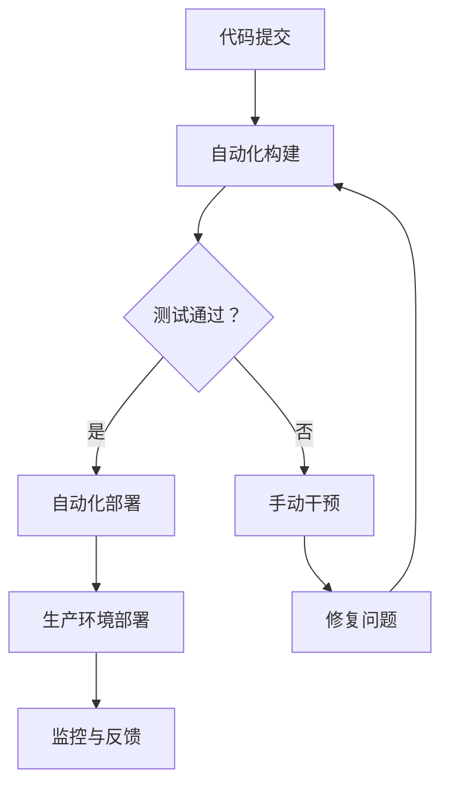

                 

关键词：持续部署、自动化部署、手动部署、DevOps、敏捷开发、持续集成、持续交付、CI/CD 工具、Git、版本控制、容器化、Kubernetes、容器编排、基础设施即代码、自动化测试、代码质量、运维效率、部署风险管理。

> 摘要：本文将深入探讨持续部署策略中的自动化和手动部署的选择。我们将分析它们在DevOps和敏捷开发环境中的重要性，详细阐述各自的优势与局限性，并通过实际案例和实践经验，帮助读者理解如何在不同场景下做出最优决策，提高运维效率和代码质量。

## 1. 背景介绍

在当今快速发展的技术环境中，持续集成（Continuous Integration，CI）和持续交付（Continuous Delivery，CD）已成为软件开发和部署的基石。这些实践的核心目标是缩短软件交付周期，提高软件质量和开发团队的生产力。而持续部署（Continuous Deployment，CD）则是CD的进一步延伸，通过自动化流程实现软件的无缝发布。

持续部署策略分为自动化部署和手动部署两种。自动化部署依赖于一系列预定义的流程和工具，以自动执行从代码提交到生产环境部署的整个过程。而手动部署则更多地依赖于开发人员或运维团队的干预，通过手动执行一系列步骤来完成部署过程。

随着DevOps文化的普及和敏捷开发方法的广泛应用，自动化部署逐渐成为主流。自动化部署不仅能够显著提高部署速度和频率，还能减少人为错误，提高代码质量和系统的稳定性。然而，自动化部署并不意味着完全摒弃手动部署，两者在实际应用中各有其适用场景。

本文将深入探讨自动化部署和手动部署的选择，分析各自的优势和局限性，并结合实际案例，为读者提供实用的部署策略建议。

## 2. 核心概念与联系

### 2.1. 自动化部署

自动化部署是指通过预定义的脚本、工具和流程，实现从代码提交到生产环境部署的自动化执行。自动化部署的核心在于减少手动操作，提高部署速度和一致性，从而降低部署风险。以下是自动化部署的关键概念：

- **CI/CD 工具**：如 Jenkins、Travis CI、GitLab CI 等，用于自动化构建、测试和部署过程。
- **容器化**：使用 Docker 等工具将应用程序及其运行环境打包成容器，确保在不同环境中的一致性。
- **Kubernetes**：用于容器编排和管理，实现容器的自动化部署、扩展和管理。
- **基础设施即代码**：使用脚本和工具（如 Terraform、Ansible）管理基础设施，确保基础设施的自动化配置和部署。

### 2.2. 手动部署

手动部署是指由开发人员或运维团队手动执行部署过程，包括构建、测试、部署和配置等步骤。以下是手动部署的关键概念：

- **Git**：用于版本控制和源代码管理。
- **版本控制策略**：如 Git Flow 或 GitLab Flow，用于管理和发布不同版本的软件。
- **配置管理工具**：如 Ansible、Puppet、Chef 等，用于自动化配置和管理服务器。
- **自动化测试**：用于确保部署过程中代码质量和功能完整性。

### 2.3. Mermaid 流程图

以下是自动化部署和手动部署的 Mermaid 流程图，展示了它们的基本流程和关键步骤：



在这个流程图中，A 表示代码提交，B 表示自动化构建，C 表示测试通过与否，D 表示自动化部署，E 表示手动干预，F 表示修复问题，G 表示生产环境部署，H 表示监控与反馈。

通过这个流程图，我们可以清晰地看到自动化部署和手动部署在持续集成和持续交付中的关系和作用。

## 3. 核心算法原理 & 具体操作步骤

### 3.1. 算法原理概述

自动化部署的核心算法原理是基于预定义的脚本和流程，通过 CI/CD 工具实现自动化执行。以下是自动化部署的主要步骤：

1. **代码提交**：开发人员将代码提交到版本控制系统，如 Git。
2. **自动化构建**：CI 工具从版本控制系统获取代码，构建应用程序和依赖项。
3. **测试**：运行自动化测试，确保代码质量和功能完整性。
4. **部署**：如果测试通过，CI 工具将应用程序部署到测试或生产环境。
5. **监控与反馈**：部署后，监控系统监控应用程序的状态，并将反馈信息传递给 CI 工具，以便进一步处理。

### 3.2. 算法步骤详解

以下是自动化部署的具体步骤详解：

1. **代码提交**：
    - 开发人员使用 Git 将代码提交到远程仓库。
    - CI 工具配置 Webhook 监听代码提交事件，自动触发构建流程。

2. **自动化构建**：
    - CI 工具从 Git 仓库克隆代码，安装依赖项，构建应用程序。
    - 构建过程中，CI 工具自动执行单元测试、集成测试等。

3. **测试**：
    - 自动化测试执行完成后，CI 工具检查测试结果。
    - 如果测试失败，CI 工具通知开发人员并暂停部署流程。

4. **部署**：
    - 如果测试通过，CI 工具将应用程序部署到测试或生产环境。
    - 部署过程中，CI 工具使用容器化技术（如 Docker）确保应用程序在不同环境中的一致性。

5. **监控与反馈**：
    - 部署后，应用程序在测试或生产环境中运行，监控系统监控其状态。
    - 如果监控系统检测到异常，CI 工具将反馈信息传递给开发人员，以便快速修复问题。

### 3.3. 算法优缺点

**优点**：

- **提高部署速度**：自动化部署减少了手动操作，显著提高了部署速度。
- **降低部署风险**：自动化部署通过预定义的流程和测试，降低了人为错误和部署失败的风险。
- **提高代码质量**：自动化测试确保了代码质量和功能完整性，减少了缺陷和漏洞。

**缺点**：

- **初期投入较大**：自动化部署需要配置 CI/CD 工具、容器化技术等，初期投入较大。
- **维护成本高**：自动化部署的维护成本较高，需要不断更新和优化流程。

### 3.4. 算法应用领域

自动化部署广泛应用于各种场景，包括：

- **Web 应用程序**：如在线商店、博客、社交媒体等。
- **移动应用程序**：如 iOS 和 Android 应用。
- **后台服务**：如 API、数据库、消息队列等。
- **容器化应用**：如 Kubernetes 集群中的应用程序。

## 4. 数学模型和公式 & 详细讲解 & 举例说明

### 4.1. 数学模型构建

在自动化部署中，我们可以构建一个简单的数学模型来评估部署速度和风险。以下是数学模型的构建：

1. **部署速度（T）**：表示从代码提交到部署完成所需的时间。
2. **部署风险（R）**：表示部署失败的概率。

数学模型如下：

$$
T = f(R)
$$

其中，f() 是一个函数，用于评估部署速度与风险之间的关系。

### 4.2. 公式推导过程

根据数学模型，我们可以推导出以下公式：

1. **部署速度（T）**：

$$
T = T_0 + \frac{T_1 \cdot R}{100}
$$

其中，T0 是手动部署所需时间，T1 是自动化部署所需时间。R 是部署风险，以百分比表示。

2. **部署风险（R）**：

$$
R = \frac{R_0 + R_1 \cdot T}{T_0}
$$

其中，R0 是手动部署风险，R1 是自动化部署风险。

### 4.3. 案例分析与讲解

假设手动部署所需时间为 10 小时，自动化部署所需时间为 2 小时。手动部署风险为 20%，自动化部署风险为 10%。

根据公式，我们可以计算出：

1. **部署速度（T）**：

$$
T = 10 + \frac{2 \cdot 10}{100} = 10.2 \text{ 小时}
$$

2. **部署风险（R）**：

$$
R = \frac{20 + 10 \cdot 10.2}{10} = 31.8\%
$$

通过这个例子，我们可以看到自动化部署显著提高了部署速度，但同时也增加了部署风险。在实际应用中，我们需要根据业务需求和风险承受能力，权衡部署速度和风险之间的关系。

### 4.4. 案例分析与讲解

假设一个电商网站，每天需要多次部署。如果手动部署，每次部署需要 10 小时，风险为 20%。如果采用自动化部署，每次部署需要 2 小时，风险为 10%。

1. **手动部署**：

- 每天部署次数：3 次
- 总部署时间：10 小时/次 × 3 次 = 30 小时
- 部署风险：20% × 3 次 = 60%

2. **自动化部署**：

- 每天部署次数：5 次
- 总部署时间：2 小时/次 × 5 次 = 10 小时
- 部署风险：10% × 5 次 = 50%

通过这个案例，我们可以看到自动化部署不仅提高了部署速度，还降低了部署风险。这对于电商网站等高频率部署的应用场景尤为重要。

## 5. 项目实践：代码实例和详细解释说明

### 5.1. 开发环境搭建

在本案例中，我们将使用 Jenkins 作为 CI/CD 工具，Docker 用于容器化，Kubernetes 用于容器编排。以下是开发环境搭建的步骤：

1. **安装 Jenkins**：

- 从 Jenkins 官网下载最新版本的 Jenkins.war 文件。
- 将 Jenkins.war 文件上传到 Java Web 服务器（如 Apache Tomcat）。
- 启动 Java Web 服务器，访问 Jenkins 管理界面。

2. **安装 Docker**：

- 从 Docker 官网下载适用于操作系统的 Docker 版本。
- 安装 Docker 并配置 Docker Engine。

3. **安装 Kubernetes**：

- 使用 kubeadm 工具初始化 Kubernetes 集群。
- 配置 Kubernetes 网络和存储。

### 5.2. 源代码详细实现

在本案例中，我们将使用一个简单的 Web 应用程序作为示例，实现自动化部署。以下是源代码的详细实现：

1. **创建 Java Web 项目**：

- 使用 Spring Boot 创建一个简单的 Web 应用程序。
- 编写 RESTful API，处理 HTTP 请求。

2. **编写 Dockerfile**：

- 创建 Dockerfile 文件，定义应用程序的容器镜像。

```Dockerfile
FROM openjdk:8-jdk-alpine
ARG JAR_FILE=target/*.jar
COPY ${JAR_FILE} app.jar
ENTRYPOINT ["java","-Djava.security.egd=file:/dev/./urandom","-jar","/app.jar"]
```

3. **编写 Jenkinsfile**：

- 创建 Jenkinsfile 文件，定义 Jenkins 任务的执行流程。

```groovy
pipeline {
    agent any
    stages {
        stage('Build') {
            steps {
                sh 'mvn clean package'
            }
        }
        stage('Test') {
            steps {
                sh 'mvn test'
            }
        }
        stage('Docker Build') {
            steps {
                sh 'docker build -t myapp .'
            }
        }
        stage('Docker Push') {
            steps {
                sh 'docker push myapp'
            }
        }
        stage('Kubernetes Deploy') {
            steps {
                sh 'kubectl apply -f k8s.yml'
            }
        }
    }
}
```

### 5.3. 代码解读与分析

1. **Dockerfile**：

- FROM 指令指定了基础镜像，这里是 OpenJDK 8。
- ARG 指令用于传递参数，JAR_FILE 表示生成的 JAR 文件路径。
- COPY 指令将生成的 JAR 文件复制到容器中。
- ENTRYPOINT 指令定义了容器的入口点，即运行 JAR 文件。

2. **Jenkinsfile**：

- pipeline 指令定义了一个流水线任务。
- stages 指令定义了多个构建阶段，包括 Build、Test、Docker Build、Docker Push 和 Kubernetes Deploy。
- steps 指令在各个阶段执行具体的步骤，如构建应用程序、运行测试、构建 Docker 镜像、推送 Docker 镜像和部署 Kubernetes 应用程序。

### 5.4. 运行结果展示

1. **构建结果**：

- 在 Jenkins 界面中运行 Jenkinsfile，执行构建任务。
- 查看构建日志，确认构建成功。

2. **部署结果**：

- 在 Kubernetes 界面中查看部署的应用程序，确认应用程序已成功部署并运行。

通过这个案例，我们展示了如何使用 Jenkins、Docker 和 Kubernetes 实现自动化部署。这个案例只是一个简单的示例，实际项目中可能涉及到更复杂的构建、测试和部署流程。

## 6. 实际应用场景

### 6.1. 高频次部署的应用场景

高频次部署的应用场景，如电商平台、社交媒体平台和在线游戏，需要快速响应市场需求和用户反馈。在这种情况下，自动化部署具有明显的优势：

- **提高部署速度**：自动化部署可以显著缩短部署时间，实现快速迭代和发布。
- **降低部署风险**：自动化测试确保代码质量和功能完整性，减少部署失败的风险。
- **提高运维效率**：自动化部署减少了手动操作，提高了运维团队的生产力。

### 6.2. 长周期开发的应用场景

长周期开发的应用场景，如大型企业级系统、金融系统和医疗系统，通常需要经过长时间的开发和测试。在这种情况下，手动部署具有一些优势：

- **可控性**：手动部署允许开发人员或运维团队在部署过程中进行干预，确保部署过程可控。
- **灵活性**：手动部署可以根据项目需求进行调整，适应不同的部署环境。
- **降低复杂性**：在复杂的应用场景中，自动化部署可能带来额外的复杂性和维护成本。

### 6.3. 跨团队协作的应用场景

跨团队协作的应用场景，如敏捷开发团队、DevOps 团队和产品团队，需要高效沟通和协作。在这种情况下，自动化部署有助于实现跨团队协作：

- **简化流程**：自动化部署减少了人工干预，简化了跨团队协作流程。
- **提高沟通效率**：自动化部署的透明度提高了跨团队沟通的效率，减少了误解和冲突。
- **共享资源**：自动化部署工具和平台可以方便地共享资源，实现跨团队的协同工作。

### 6.4. 未来应用展望

随着云计算、大数据和人工智能等技术的不断发展，自动化部署在各个领域的应用前景广阔：

- **云计算集成**：自动化部署将更好地与云计算平台集成，实现无缝的部署和管理。
- **大数据处理**：自动化部署将提高大数据处理和分析的效率，加速数据价值的实现。
- **人工智能应用**：自动化部署将结合人工智能技术，实现更智能、更高效的部署和管理。

## 7. 工具和资源推荐

### 7.1. 学习资源推荐

- **《持续集成与持续部署：实战指南》**：这本书详细介绍了 CI/CD 的概念、工具和实践，适合初学者和进阶者阅读。
- **《DevOps Handbook》**：这本书涵盖了 DevOps 的核心理念、工具和实践，对理解和应用 DevOps 文化有很大帮助。

### 7.2. 开发工具推荐

- **Jenkins**：一款开源的自动化构建工具，支持多种编程语言和平台，功能强大且灵活。
- **Docker**：一款流行的容器化技术，用于打包和部署应用程序，支持多种操作系统和平台。
- **Kubernetes**：一款开源的容器编排平台，用于自动化部署、扩展和管理容器化应用。

### 7.3. 相关论文推荐

- **"DevOps: A Research Agenda"**：这篇论文探讨了 DevOps 的研究现状和未来方向，对 DevOps 研究者有很大参考价值。
- **"Continuous Deployment at Twitter"**：这篇论文介绍了 Twitter 的持续部署实践，分享了其成功经验和教训。

## 8. 总结：未来发展趋势与挑战

### 8.1. 研究成果总结

本文从自动化部署和手动部署的角度，探讨了持续部署策略。通过分析 CI/CD 工具、容器化技术和 Kubernetes 等关键概念，我们了解了自动化部署的优势和局限性，并结合实际案例，展示了自动化部署的实践过程。此外，我们还讨论了自动化部署在不同应用场景中的适用性，并对未来发展趋势进行了展望。

### 8.2. 未来发展趋势

随着技术的发展，自动化部署在未来将继续发挥重要作用。以下是一些未来发展趋势：

- **云计算集成**：自动化部署将更好地与云计算平台集成，实现更高效的部署和管理。
- **人工智能应用**：结合人工智能技术，自动化部署将实现更智能、更高效的部署和管理。
- **跨领域应用**：自动化部署将在更多领域得到应用，如金融、医疗、物联网等。

### 8.3. 面临的挑战

尽管自动化部署具有许多优势，但在实际应用中仍面临一些挑战：

- **初期投入较大**：自动化部署需要配置和部署相关工具和平台，初期投入较大。
- **维护成本高**：自动化部署的维护成本较高，需要不断更新和优化流程。
- **技术门槛**：自动化部署需要一定的技术背景和经验，对于非技术人员来说有一定门槛。

### 8.4. 研究展望

在未来，自动化部署的研究方向包括：

- **优化部署流程**：研究如何优化自动化部署流程，提高部署效率和可靠性。
- **降低技术门槛**：研究如何降低自动化部署的技术门槛，使其更易于使用。
- **跨领域应用**：研究如何将自动化部署应用于更多领域，实现更广泛的部署自动化。

总之，自动化部署是持续部署策略的重要组成部分，具有广泛的应用前景。在未来的发展中，我们需要不断探索和研究，优化自动化部署流程，降低技术门槛，使其更好地服务于软件开发和运维领域。

## 9. 附录：常见问题与解答

### 9.1. 自动化部署与手动部署的区别是什么？

自动化部署是通过预定义的脚本和工具，实现从代码提交到生产环境部署的自动化执行。手动部署则是由开发人员或运维团队手动执行部署过程。

### 9.2. 自动化部署的优势是什么？

自动化部署的优势包括：

- 提高部署速度
- 降低部署风险
- 提高代码质量
- 提高运维效率

### 9.3. 自动化部署的劣势是什么？

自动化部署的劣势包括：

- 初期投入较大
- 维护成本高
- 需要一定的技术背景和经验

### 9.4. 什么是 CI/CD？

CI/CD 是持续集成（Continuous Integration）和持续交付（Continuous Delivery）的缩写，是一种软件开发和部署实践，通过自动化流程实现代码的持续集成、测试和交付。

### 9.5. 什么是容器化？

容器化是一种轻量级虚拟化技术，将应用程序及其运行环境打包成一个容器，确保在不同环境中的一致性。

### 9.6. 什么是 Kubernetes？

Kubernetes 是一款开源的容器编排平台，用于自动化部署、扩展和管理容器化应用。

### 9.7. 自动化部署适用于哪些场景？

自动化部署适用于高频次部署的应用场景、跨团队协作的应用场景和长周期开发的应用场景。

### 9.8. 如何降低自动化部署的维护成本？

可以通过以下方法降低自动化部署的维护成本：

- 简化部署流程
- 使用开源工具和平台
- 定期更新和维护自动化脚本和工具

### 9.9. 自动化部署与 DevOps 有什么关系？

自动化部署是 DevOps 文化的重要组成部分，通过自动化流程实现持续集成、持续交付和持续部署，提高软件开发和运维效率。

### 9.10. 自动化部署与手动部署如何结合使用？

在特定场景下，可以结合使用自动化部署和手动部署。例如，对于关键业务系统或高风险的部署，可以采用手动部署，而对于日常的、非关键的业务系统，可以采用自动化部署。

### 9.11. 自动化部署如何保证代码质量和功能完整性？

通过自动化测试、代码审查和静态代码分析等技术，可以确保自动化部署过程中的代码质量和功能完整性。

### 9.12. 自动化部署如何管理部署风险？

通过部署策略和流程管理、监控和反馈机制，可以降低自动化部署过程中的风险。例如，在部署前进行充分的测试，部署后进行监控和反馈，及时发现和解决部署问题。

### 9.13. 自动化部署需要哪些工具和平台？

自动化部署需要以下工具和平台：

- CI/CD 工具：如 Jenkins、Travis CI、GitLab CI 等
- 容器化技术：如 Docker、Kubernetes 等
- 配置管理工具：如 Ansible、Puppet、Chef 等
- 监控和日志分析工具：如 Prometheus、Grafana、ELK（Elasticsearch、Logstash、Kibana）等

### 9.14. 自动化部署与云计算有什么关系？

自动化部署与云计算密切相关。云计算提供了自动化部署所需的资源、平台和工具，自动化部署则通过云计算实现更高效、更灵活的部署和管理。

### 9.15. 自动化部署如何实现跨团队协作？

通过自动化部署平台和工具，可以实现跨团队的协作和沟通。例如，使用 Jenkinsfile 定义部署任务，团队成员可以在不同的阶段参与部署过程，通过 Webhook 实现实时通知和协作。

### 9.16. 自动化部署如何适应不同开发语言和框架？

通过支持多种编程语言和框架的 CI/CD 工具，可以实现自动化部署的跨语言和跨框架支持。例如，使用 Jenkinsfile 或 GitLab CI 文件，可以定义不同语言的构建、测试和部署任务。

### 9.17. 自动化部署如何处理复杂的应用场景？

对于复杂的应用场景，可以通过定制化自动化部署流程和脚本，实现更复杂的部署和管理。例如，使用 Docker Compose、Kubernetes 容器编排和基础设施即代码工具，可以处理复杂的容器化应用和基础设施配置。

### 9.18. 自动化部署与敏捷开发有什么关系？

自动化部署与敏捷开发密切相关。敏捷开发强调快速迭代和交付，自动化部署通过自动化流程实现快速部署和反馈，提高了敏捷开发的效率和质量。

### 9.19. 自动化部署与持续集成（CI）有什么区别？

持续集成（CI）是自动化部署的一部分，它关注于代码的集成和测试。自动化部署则更全面，包括从代码提交到生产环境部署的整个过程。

### 9.20. 自动化部署与持续交付（CD）有什么区别？

持续交付（CD）是自动化部署的一部分，它关注于将代码交付到生产环境。自动化部署则更全面，包括持续集成、测试、交付和部署的整个过程。

### 9.21. 自动化部署如何提高代码质量？

通过自动化测试、代码审查和静态代码分析等技术，自动化部署可以确保代码质量和功能完整性，从而提高代码质量。

### 9.22. 自动化部署与手动部署在成本方面如何权衡？

在成本方面，自动化部署可能需要更高的初期投入，但长期来看，可以提高运维效率和代码质量，从而降低整体成本。对于高风险和高价值的业务系统，手动部署可能更合适。

### 9.23. 自动化部署如何适应不同规模的团队？

对于小型团队，自动化部署可能更加简单和灵活。对于大型团队，自动化部署需要更复杂的管理和协调，但可以通过更完善的流程和工具实现高效的部署和管理。

### 9.24. 自动化部署如何处理配置和环境差异？

通过使用容器化技术和基础设施即代码工具，自动化部署可以处理配置和环境差异。容器化技术确保应用程序在不同环境中的一致性，基础设施即代码工具用于自动化配置和管理不同环境的基础设施。

### 9.25. 自动化部署与敏捷开发如何结合？

自动化部署与敏捷开发紧密结合，通过自动化流程实现快速迭代和交付。敏捷开发团队可以使用自动化部署平台和工具，实现敏捷开发的快速响应和持续改进。

### 9.26. 自动化部署如何确保安全？

通过安全测试、漏洞扫描和权限控制等技术，自动化部署可以确保部署过程中的安全性。此外，使用安全沙箱和容器隔离技术，可以进一步确保应用程序的安全性。

### 9.27. 自动化部署如何处理部署故障？

通过监控和反馈机制，自动化部署可以及时发现和解决部署故障。例如，在部署失败时，CI/CD 工具可以暂停部署流程，通知相关人员并提示故障原因。

### 9.28. 自动化部署如何与版本控制结合使用？

自动化部署与版本控制紧密结合，通过 Git 等版本控制工具，自动化部署可以跟踪和管理代码的版本和历史。

### 9.29. 自动化部署如何支持持续集成（CI）？

自动化部署是持续集成（CI）的核心组成部分，CI 工具通过自动化流程实现代码的集成、测试和部署，确保代码质量和功能完整性。

### 9.30. 自动化部署与手动部署在运维效率方面如何比较？

自动化部署通过减少手动操作，提高了运维效率。手动部署则需要更多的手动操作，运维效率较低。然而，对于特定场景，手动部署可能更合适。

### 9.31. 自动化部署如何提高生产效率？

通过自动化流程和工具，自动化部署可以显著提高生产效率。自动化部署减少了部署时间，提高了代码质量和系统的稳定性，从而提高了生产效率。

### 9.32. 自动化部署与持续交付（CD）的关系是什么？

持续交付（CD）是自动化部署的一部分，它关注于将代码交付到生产环境。自动化部署则更全面，包括持续集成、测试、交付和部署的整个过程。

### 9.33. 自动化部署如何处理异常情况？

通过监控和反馈机制，自动化部署可以及时发现和解决异常情况。例如，在部署失败时，CI/CD 工具可以暂停部署流程，通知相关人员并提示故障原因。

### 9.34. 自动化部署与 DevOps 的关系是什么？

自动化部署是 DevOps 文化的重要组成部分，它通过自动化流程实现持续集成、持续交付和持续部署，提高了软件开发和运维效率。

### 9.35. 自动化部署与敏捷开发的关系是什么？

自动化部署与敏捷开发紧密结合，通过自动化流程实现快速迭代和交付，提高了敏捷开发的效率和质量。

### 9.36. 自动化部署如何降低成本？

通过自动化流程和工具，自动化部署可以减少人工操作和运维成本，从而降低整体成本。此外，自动化部署还可以提高代码质量和系统稳定性，减少故障和修复成本。

### 9.37. 自动化部署如何提高代码质量？

通过自动化测试、代码审查和静态代码分析等技术，自动化部署可以确保代码质量和功能完整性，从而提高代码质量。

### 9.38. 自动化部署如何适应不同的开发语言和框架？

通过支持多种编程语言和框架的 CI/CD 工具，自动化部署可以适应不同的开发语言和框架。例如，使用 Jenkinsfile 或 GitLab CI 文件，可以定义不同语言的构建、测试和部署任务。

### 9.39. 自动化部署如何实现容器化应用？

通过使用容器化技术，如 Docker，自动化部署可以实现容器化应用。在 CI/CD 流程中，可以使用 Dockerfile 定义容器镜像，并在 Kubernetes 中部署和管理容器化应用。

### 9.40. 自动化部署如何与 Kubernetes 结合使用？

自动化部署与 Kubernetes 密切结合，通过 Kubernetes 容器编排平台，自动化部署可以实现自动化部署、扩展和管理容器化应用。在 CI/CD 流程中，可以使用 Kubernetes 配置文件定义应用程序的部署和配置。

### 9.41. 自动化部署与持续集成（CI）的区别是什么？

持续集成（CI）是自动化部署的一部分，它关注于代码的集成和测试。自动化部署则更全面，包括从代码提交到生产环境部署的整个过程。

### 9.42. 自动化部署如何处理不同环境的配置差异？

通过使用容器化技术和基础设施即代码工具，自动化部署可以处理不同环境的配置差异。容器化技术确保应用程序在不同环境中的一致性，基础设施即代码工具用于自动化配置和管理不同环境的基础设施。

### 9.43. 自动化部署如何提高运维效率？

通过自动化流程和工具，自动化部署可以减少手动操作和运维成本，从而提高运维效率。自动化部署减少了部署时间，提高了代码质量和系统的稳定性。

### 9.44. 自动化部署如何降低部署风险？

通过自动化测试、代码审查和静态代码分析等技术，自动化部署可以确保代码质量和功能完整性，从而降低部署风险。

### 9.45. 自动化部署如何与版本控制结合使用？

自动化部署与版本控制紧密结合，通过 Git 等版本控制工具，自动化部署可以跟踪和管理代码的版本和历史。

### 9.46. 自动化部署如何支持敏捷开发？

自动化部署与敏捷开发紧密结合，通过自动化流程实现快速迭代和交付，提高了敏捷开发的效率和质量。

### 9.47. 自动化部署如何与持续交付（CD）结合使用？

自动化部署与持续交付（CD）紧密结合，通过自动化流程实现代码的交付到生产环境，提高了持续交付的效率和质量。

### 9.48. 自动化部署如何处理复杂的应用场景？

对于复杂的应用场景，可以通过定制化自动化部署流程和脚本，实现更复杂的部署和管理。例如，使用 Docker Compose、Kubernetes 容器编排和基础设施即代码工具，可以处理复杂的容器化应用和基础设施配置。

### 9.49. 自动化部署如何提高生产效率？

通过自动化流程和工具，自动化部署可以显著提高生产效率。自动化部署减少了部署时间，提高了代码质量和系统的稳定性。

### 9.50. 自动化部署如何处理配置和环境差异？

通过使用容器化技术和基础设施即代码工具，自动化部署可以处理配置和环境差异。容器化技术确保应用程序在不同环境中的一致性，基础设施即代码工具用于自动化配置和管理不同环境的基础设施。

