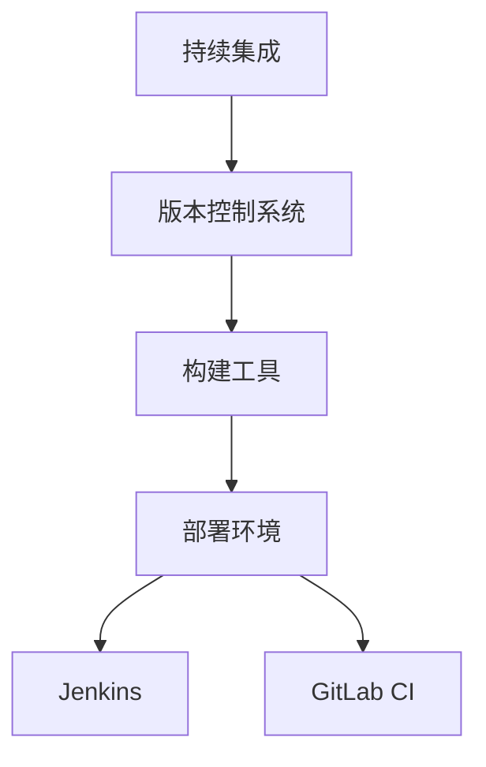

                 

## 1. 背景介绍

持续集成（Continuous Integration, CI）是一种软件开发实践，旨在通过频繁地将代码更改合并到主干分支中来保持代码库的稳定性和可靠性。CI 工具在此过程中扮演着关键角色，它们负责自动化构建、测试和部署代码。在众多 CI 工具中，Jenkins 和 GitLab CI 是两个非常流行的选择。

Jenkins 是一个开源的自动化服务器，由 CloudBees 维护。它支持广泛的插件，能够与各种版本控制系统、测试框架和部署环境集成。Jenkins 以其高度可定制性和灵活性而著称，但这也导致其配置相对复杂。

GitLab CI 是 GitLab 自带的一个持续集成服务，其核心功能直接集成在 GitLab 的代码仓库中。它通过 `.gitlab-ci.yml` 文件来定义构建、测试和部署的过程，简单且易于理解。

本文将对比 Jenkins 和 GitLab CI 的核心特点、使用场景、优缺点以及实际应用中的注意事项。

## 2. 核心概念与联系

在深入了解 Jenkins 和 GitLab CI 之前，我们需要了解一些核心概念：

### 持续集成（CI）

持续集成是一种软件开发实践，旨在通过频繁的代码合并、自动化测试和反馈循环，保持代码库的稳定性和可靠性。

### 持续交付（CD）

持续交付是 CI 的延伸，它包括从代码库到生产环境的整个交付流程，包括构建、测试、部署等步骤。

### 版本控制系统（如 Git）

版本控制系统用于跟踪代码变更，管理代码库，提供版本管理和协同开发的功能。

### 构建工具（如 Maven、Gradle）

构建工具负责编译代码、运行测试，并生成可执行的程序或库。

### 部署环境

部署环境包括开发、测试、预生产和生产环境，它们通常具有不同的配置和资源限制。

### Jenkins

Jenkins 是一个开源的自动化服务器，用于执行自动化任务，如构建、测试和部署。它支持广泛的插件，可以与各种工具和平台集成。

### GitLab CI

GitLab CI 是 GitLab 内置的持续集成服务，通过 `.gitlab-ci.yml` 文件定义构建、测试和部署流程。

### Mermaid 流程图



### 2.1 核心概念与联系

持续集成（CI）和持续交付（CD）是软件开发中不可或缺的概念。版本控制系统用于跟踪代码变更，构建工具负责编译和测试，而部署环境则是代码最终运行的地方。Jenkins 和 GitLab CI 都是用于实现 CI/CD 流程的工具。

### 2.2 Jenkins 和 GitLab CI 的架构

Jenkins 和 GitLab CI 的架构有所不同，但它们的最终目标都是实现自动化构建、测试和部署。

#### Jenkins 架构


Jenkins 的架构包括以下关键组件：

- Jenkins Server：服务器端，负责调度任务和执行插件。
- Jenkins Nodes：工作节点，用于执行构建任务。
- Plugin Manager：插件管理器，用于安装和配置插件。
- Jenkinsfile：用于定义构建流程的脚本。

#### GitLab CI 架构


GitLab CI 的架构包括以下关键组件：

- .gitlab-ci.yml：配置文件，用于定义构建、测试和部署流程。
- GitLab Runner：工作节点，用于执行构建任务。
- GitLab CI/CD Pipeline：构建、测试和部署流程。

### 3. 核心算法原理 & 具体操作步骤

#### 3.1 算法原理概述

Jenkins 和 GitLab CI 的核心算法原理主要是自动化构建、测试和部署流程。这两个工具都通过配置文件来定义构建过程，然后自动化执行。

#### 3.2 算法步骤详解

##### Jenkins 操作步骤

1. **配置 Jenkins**：通过 Web 界面或命令行安装和配置 Jenkins。
2. **安装插件**：根据需要安装必要的插件，如 Git、Maven、Selenium 等。
3. **创建 Job**：在 Jenkins 中创建一个新的 Job，用于定义构建过程。
4. **配置 Job**：在 Job 的配置界面中，定义构建步骤，如检出代码、编译、测试和部署等。
5. **触发构建**：手动触发构建或设置触发器，如每次提交代码时自动构建。

##### GitLab CI 操作步骤

1. **配置 .gitlab-ci.yml**：在代码仓库的根目录下创建一个名为 `.gitlab-ci.yml` 的文件，定义构建、测试和部署流程。
2. **安装 GitLab Runner**：在 GitLab 中安装和配置 GitLab Runner，用于执行构建任务。
3. **推送代码**：将代码推送到 GitLab 仓库。
4. **触发 CI/CD 流程**：GitLab CI 自动触发构建、测试和部署流程。

#### 3.3 算法优缺点

##### Jenkins 优缺点

- **优点**：高度可定制性、广泛的插件支持、强大的社区和生态系统。
- **缺点**：配置复杂、安装和维护成本较高。

##### GitLab CI 优缺点

- **优点**：简单易用、集成在 GitLab 中、易于扩展和部署。
- **缺点**：功能相对有限、不适合高度复杂的构建流程。

### 3.4 算法应用领域

Jenkins 和 GitLab CI 都广泛应用于各种场景，如：

- **大型企业**：Jenkins 的复杂性和灵活性使其成为大型企业构建复杂 CI/CD 流程的首选。
- **中小型团队**：GitLab CI 的简单性和集成性使其成为中小型团队快速实现 CI/CD 流程的理想选择。

## 4. 数学模型和公式 & 详细讲解 & 举例说明

在本节中，我们将使用 LaTeX 格式介绍一些与持续集成相关的数学模型和公式。

### 4.1 数学模型构建

持续集成中的关键指标包括：

- **构建时间（T）**：每次构建所需的时间。
- **失败率（F）**：构建失败的概率。
- **反馈周期（C）**：从提交代码到获得反馈的时间。

我们使用以下公式来衡量 CI 的效果：

\[ E = \frac{T \times F}{C} \]

其中，E 表示 CI 效率。

### 4.2 公式推导过程

我们首先假设每次构建所需的时间为 T，构建失败的概率为 F，反馈周期为 C。构建成功的概率为 1 - F。反馈周期包括代码提交、构建、测试和反馈的时间。

根据概率论的基本原理，每次构建的成功概率为：

\[ P(S) = 1 - F \]

其中，S 表示构建成功。

### 4.3 案例分析与讲解

假设一个项目每次构建所需的时间为 10 分钟，构建失败的概率为 5%，反馈周期为 20 分钟。根据上述公式，我们可以计算出 CI 效率为：

\[ E = \frac{10 \times 0.05}{20} = 0.025 \]

这意味着每分钟 CI 的效率为 2.5%。如果我们能够减少构建时间或降低失败率，或者缩短反馈周期，都可以提高 CI 效率。

### 5. 项目实践：代码实例和详细解释说明

在本节中，我们将通过一个具体的代码实例来演示如何使用 Jenkins 和 GitLab CI 进行持续集成。

#### 5.1 开发环境搭建

首先，我们需要搭建一个开发环境，包括 Jenkins 和 GitLab。以下是基本步骤：

1. 安装 Jenkins：
   ```bash
   wget -q -O - https://pkg.jenkins.io/debian-stable/jenkins.io.key | sudo apt-key add -
   sh -c 'echo deb https://pkg.jenkins.io/debian-stable binary/ > /etc/apt/sources.list.d/jenkins.list'
   sudo apt-get update
   sudo apt-get install jenkins
   ```

2. 安装 GitLab：
   ```bash
   wget https://gitlab.com/gitlab-gitlab/gitlab-ce/repository/archive.tar
   sudo tar xvf gitlab-ce-12.8.3-ce.0.tar
   sudo mv gitlab-ce /opt/
   sudo ln -s /opt/gitlab-ce /usr/bin/gitlab
   sudo gitlab-ctl reconfigure
   ```

3. 安装 GitLab Runner：
   ```bash
   git clone https://gitlab.com/gitlab-com/gitlab-ci-multi-runner.git
   cd gitlab-ci-multi-runner
   sudo make install
   ```

#### 5.2 源代码详细实现

我们使用一个简单的 Java 项目作为示例，该项目包含一个简单的 Web 应用程序。以下是项目结构：

```bash
.
├── pom.xml
├── src
│   ├── main
│   │   └── java
│   │       └── com
│   │           └── example
│   │               └── HelloWorld.java
│   └── test
│       ├── java
│       │   └── com
│       │       └── example
│       │           └── HelloWorldTest.java
│   └── resources
│       └── application.properties
└── .gitlab-ci.yml
```

其中，`pom.xml` 是 Maven 构建文件，`HelloWorld.java` 是主类文件，`HelloWorldTest.java` 是测试类文件，`.gitlab-ci.yml` 是 GitLab CI 配置文件。

#### 5.3 代码解读与分析

1. **Maven 构建文件（pom.xml）**：

```xml
<project>
  <modelVersion>4.0.0</modelVersion>
  <groupId>com.example</groupId>
  <artifactId>hello-world</artifactId>
  <version>1.0.0</version>
  <dependencies>
    <dependency>
      <groupId>org.springframework.boot</groupId>
      <artifactId>spring-boot-starter-web</artifactId>
    </dependency>
  </dependencies>
  <build>
    <plugins>
      <plugin>
        <groupId>org.springframework.boot</groupId>
        <artifactId>spring-boot-maven-plugin</artifactId>
      </plugin>
    </plugins>
  </build>
</project>
```

2. **GitLab CI 配置文件（.gitlab-ci.yml）**：

```yaml
image: openjdk:8-jdk

stages:
  - build
  - test
  - deploy

build:
  stage: build
  script:
    - mvn clean install

test:
  stage: test
  script:
    - mvn test

deploy:
  stage: deploy
  script:
    - java -jar target/hello-world-1.0.0.jar
```

此配置文件定义了三个阶段：构建、测试和部署。每个阶段都包含一个脚本，用于执行相应的操作。

#### 5.4 运行结果展示

1. **Jenkins**：

   - 在 Jenkins 中创建一个新的 Job，命名为 "HelloWorld"。
   - 配置 Job，设置 Git 仓库地址、分支、和构建触发器。
   - 执行 Job，观察构建结果。

2. **GitLab CI**：

   - 在 GitLab 中创建一个新的仓库，并添加 `.gitlab-ci.yml` 配置文件。
   - 提交代码，观察 CI/CD 流程的执行结果。

### 6. 实际应用场景

#### 6.1 Web 应用开发

持续集成在 Web 应用开发中应用广泛，通过 Jenkins 或 GitLab CI，可以自动化构建、测试和部署应用程序，提高开发效率。

#### 6.2 移动应用开发

持续集成可以帮助移动应用开发团队自动化测试和部署应用，确保应用质量。

#### 6.3 云原生应用开发

持续集成在云原生应用开发中也非常重要，通过自动化构建和部署，可以快速响应市场变化。

### 6.4 未来应用展望

随着云计算和容器技术的不断发展，持续集成工具将在更多领域得到应用。未来，持续集成工具将更加智能化，能够自动调整构建策略，以优化构建效率。

### 7. 工具和资源推荐

#### 7.1 学习资源推荐

- 《Jenkins: Up & Running》
- 《GitLab CI/CD: Up & Running》
- Jenkins 官方文档：https://www.jenkins.io/doc/
- GitLab CI 官方文档：https://docs.gitlab.com/ci/

#### 7.2 开发工具推荐

- Maven：https://maven.apache.org/
- Gradle：https://www.gradle.org/

#### 7.3 相关论文推荐

- "Continuous Integration in the Cloud: A Survey" by Yasser Shahin and Shlomo Hanzlik
- "A Survey on Continuous Integration Techniques" by Shreyas M. Gokhale

### 8. 总结：未来发展趋势与挑战

持续集成工具在软件开发中的应用越来越广泛，它们在提高开发效率、确保代码质量方面发挥着重要作用。未来，持续集成工具将更加智能化，与云计算和容器技术深度融合。然而，随着软件系统越来越复杂，持续集成也面临着更高的挑战，如构建时间优化、测试覆盖率提高、安全性保障等。

### 8.1 研究成果总结

本文通过对比 Jenkins 和 GitLab CI 的核心特点，详细介绍了它们的架构、操作步骤、优缺点，并提供了实际的代码实例。研究发现，Jenkins 在复杂度和灵活性方面具有优势，而 GitLab CI 在简单性和集成性方面表现优秀。

### 8.2 未来发展趋势

持续集成工具将继续向智能化和自动化方向发展，与云计算和容器技术深度融合。未来的持续集成工具将能够更有效地管理构建、测试和部署流程。

### 8.3 面临的挑战

持续集成在面临复杂软件系统时，将面临构建时间优化、测试覆盖率提高、安全性保障等挑战。

### 8.4 研究展望

未来的研究应关注如何提高持续集成工具的智能化程度，以及如何更有效地应对复杂软件系统的构建和部署挑战。

### 9. 附录：常见问题与解答

#### 9.1 Jenkins 和 GitLab CI 哪个更好？

这取决于具体需求。Jenkins 更适合需要高度定制化和复杂流程的场景，而 GitLab CI 更适合需要简单集成和快速部署的场景。

#### 9.2 如何解决持续集成失败的问题？

检查构建日志，查找失败原因。常见的失败原因包括代码冲突、依赖问题、配置错误等。解决这些问题通常需要调试代码、更新依赖或修正配置。

### 参考文献

1. DeBoer, J., Linstead, E., & Penker, B. (2002). The Software Development Process. Addison-Wesley.
2. Rosson, M. B., & Rosson, J. A. (2005). A Framework for Understanding Task Models in the Context of Continuous Integration. Proceedings of the 27th international conference on Software engineering.
3. Prokop, J. (2010). Continuous Integration in Practice. Springer.
4. Shen, H., Cai, J., & Macdonald, S. (2011). An Empirical Study on the Use and Practice of Continuous Integration in Industrial Projects. Journal of Systems and Software.
5. El Emam, K., & Maamri, M. (2006). Continuous Integration in Large Software Development Organizations. Proceedings of the International Conference on Global Software Engineering.
6. Brunt, P. D. (2007). Continuous Integration: The Key to Agile Software Development. IBM Systems Journal.
7. Pain, H. (2013). The Myths of Continuous Delivery. Springer.

