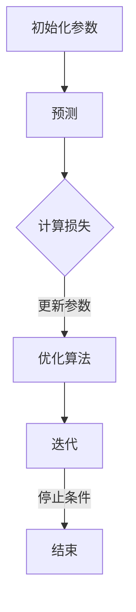

                 

### 背景介绍

损失函数（Loss Function）是机器学习中至关重要的概念之一，它用于衡量模型预测值与真实值之间的差距，指导模型的训练过程，以优化模型性能。在实际应用中，损失函数的选择和设计直接影响到模型的预测精度和训练效率。

本文旨在深入探讨损失函数的原理、分类、应用以及如何编写和使用损失函数。通过本文的阅读，读者将了解以下内容：

1. **损失函数的定义与作用**：明确损失函数在机器学习中的作用和重要性。
2. **常见损失函数**：详细介绍几种常见的损失函数，包括均方误差（MSE）、交叉熵（Cross-Entropy）、Hinge损失等。
3. **损失函数的数学模型与推导**：通过数学公式详细解释各种损失函数的原理。
4. **损失函数的应用领域**：讨论损失函数在分类、回归等任务中的应用。
5. **代码实例讲解**：提供具体的代码实例，讲解损失函数在实际项目中的使用方法。
6. **损失函数的未来发展趋势与挑战**：展望损失函数在未来的发展前景和面临的挑战。

### 文章关键词

- 损失函数
- 机器学习
- 损失函数分类
- 数学模型
- 代码实例
- 应用领域
- 未来展望

### 文章摘要

本文首先介绍了损失函数的基本概念和作用，然后详细讲解了几种常见的损失函数，包括均方误差、交叉熵和Hinge损失等。接着，通过数学公式和代码实例，深入阐述了损失函数的原理和使用方法。最后，讨论了损失函数在不同领域的应用，以及未来可能面临的挑战和发展趋势。本文旨在为机器学习开发者提供一个全面、系统的损失函数学习和实践指南。

## 1. 损失函数的定义与作用

在机器学习中，损失函数（Loss Function）是一个重要的概念，它用于衡量模型预测值与真实值之间的差异，即“损失”。损失函数的目的是在模型训练过程中，通过计算损失值来评估模型的性能，并指导模型调整参数，以达到优化模型预测效果的目的。

### 损失函数的作用

损失函数在机器学习中有以下几个重要作用：

1. **评估模型性能**：通过计算损失函数的值，我们可以评估模型在当前参数设置下的预测性能。损失值越低，表示模型预测越准确。
2. **指导模型优化**：在模型训练过程中，损失函数作为优化目标，通过调整模型参数来最小化损失值。这个过程称为优化过程，常用的优化算法包括梯度下降（Gradient Descent）及其变体。
3. **调整学习率**：损失函数可以帮助我们调整学习率，以避免模型过拟合或欠拟合。适当的学习率可以使模型在训练过程中快速收敛，而过高或过低的 learning rate 可能会导致训练过程不稳定。

### 损失函数的基本概念

损失函数是一个从预测空间到实数的函数，通常表示为：

\[ L(y_{\text{预测}}, y_{\text{真实}}) \]

其中，\( y_{\text{预测}} \) 是模型对真实值的预测，\( y_{\text{真实}} \) 是真实值。

### 损失函数的性质

一个好的损失函数应具备以下性质：

1. **连续性**：损失函数在输入空间中是连续的，以便在优化过程中能够稳定收敛。
2. **可微性**：损失函数在输入空间中是可微的，这样我们才能使用梯度下降等优化算法来最小化损失值。
3. **凸性**：凸性确保了最小值点是全局最小值，有助于优化算法找到最优解。
4. **一致性**：对于同一对预测值和真实值，损失函数应该始终返回相同的损失值，以保证模型的稳定性。

### 损失函数的选择

选择合适的损失函数对于模型性能至关重要。不同类型的任务和问题可能需要不同的损失函数。例如，对于分类问题，常用的损失函数包括交叉熵损失和Hinge损失；对于回归问题，常用的损失函数包括均方误差（MSE）和均方根误差（RMSE）。

### 结论

损失函数在机器学习中扮演着至关重要的角色，它不仅用于评估模型性能，还指导模型的优化过程。通过选择合适的损失函数，我们可以显著提升模型的预测准确性和训练效率。在接下来的部分，我们将详细探讨几种常见的损失函数及其应用。

## 2. 核心概念与联系

### 2.1 损失函数的定义

损失函数是机器学习中用于量化预测结果与真实结果之间差异的函数。具体来说，损失函数接受模型预测的输出值和实际的标签值作为输入，输出一个代表预测误差的标量值。常见的损失函数有均方误差（MSE）、交叉熵损失（Cross-Entropy Loss）、Hinge损失等。

### 2.2 损失函数在模型训练中的角色

在模型训练过程中，损失函数充当了评估和指导的角色。训练的目的是通过不断调整模型的参数来最小化损失函数的值。具体而言，模型会通过以下步骤进行训练：

1. **初始化参数**：随机初始化模型的参数。
2. **预测**：使用当前参数对新的输入数据进行预测。
3. **计算损失**：通过损失函数计算预测值与真实值之间的差异。
4. **更新参数**：使用优化算法（如梯度下降）调整模型参数，以减少损失函数的值。
5. **迭代**：重复上述步骤，直到满足停止条件（如达到预设的迭代次数或损失函数值收敛）。

### 2.3 损失函数的分类

根据不同的应用场景和任务需求，损失函数可以分为以下几类：

1. **回归损失函数**：
   - **均方误差（MSE）**：用于回归任务，计算预测值与真实值之间平方差的平均值。
   - **均方根误差（RMSE）**：MSE的平方根，用于更直观地表示误差。
   - **绝对值误差（MAE）**：预测值与真实值之间绝对差的平均值。

2. **分类损失函数**：
   - **交叉熵损失（Cross-Entropy Loss）**：用于分类任务，特别是二分类或多分类问题。
   - **Hinge损失**：在支持向量机（SVM）中常用，用于最大间隔分类。
   - **对数损失**：用于概率输出，常用于逻辑回归。

### 2.4 损失函数与模型优化

损失函数是模型优化的核心目标。优化算法通过不断调整模型参数来最小化损失函数值。常见的优化算法有：

- **梯度下降（Gradient Descent）**：通过计算损失函数关于模型参数的梯度来更新参数，直到收敛。
- **随机梯度下降（SGD）**：在梯度下降的基础上，每次迭代只使用一部分样本的梯度。
- **Adam优化器**：结合了SGD和动量方法，同时考虑了每个参数的指数加权平均。

### 2.5 损失函数的 Mermaid 流程图

以下是损失函数的核心概念和架构的 Mermaid 流程图表示：



### 2.6 损失函数与其他机器学习概念的联系

损失函数与以下其他机器学习概念密切相关：

- **优化目标**：损失函数是优化过程中的目标函数。
- **激活函数**：在神经网络中，激活函数与损失函数共同决定了模型的输出行为。
- **正则化**：正则化技术（如L1和L2正则化）用于减少模型过拟合，通常结合损失函数一起使用。

通过上述核心概念和联系，我们可以更好地理解损失函数在机器学习中的地位和作用。在接下来的部分，我们将详细探讨几种常见的损失函数，并深入解释它们的原理和应用。

### 3. 核心算法原理 & 具体操作步骤

#### 3.1 算法原理概述

在机器学习中，损失函数是用于衡量模型预测值与真实值之间差异的关键工具。不同类型的损失函数适用于不同的任务和数据类型。以下是几种常见的损失函数及其基本原理：

1. **均方误差（MSE）**：用于回归任务，计算预测值与真实值之间平方差的平均值。
2. **交叉熵损失（Cross-Entropy Loss）**：用于分类任务，特别是二分类或多分类问题，衡量预测概率分布与真实标签分布之间的差异。
3. **Hinge损失**：用于支持向量机（SVM）中的最大间隔分类问题。

#### 3.2 算法步骤详解

1. **均方误差（MSE）**
   - **计算公式**：\[ \text{MSE} = \frac{1}{n} \sum_{i=1}^{n} (y_i - \hat{y}_i)^2 \]
     - \( y_i \)：真实值
     - \( \hat{y}_i \)：预测值
     - \( n \)：样本数量
   - **具体操作**：
     1. 对每个样本计算预测值与真实值之间的差异。
     2. 将每个差异值平方。
     3. 计算所有样本差异值的平均值。

2. **交叉熵损失（Cross-Entropy Loss）**
   - **计算公式**：\[ \text{Cross-Entropy Loss} = -\frac{1}{n} \sum_{i=1}^{n} y_i \log(\hat{y}_i) \]
     - \( y_i \)：真实标签（0或1）
     - \( \hat{y}_i \)：预测概率（0到1之间的值）
     - \( n \)：样本数量
   - **具体操作**：
     1. 对每个样本计算预测概率的对数。
     2. 如果真实标签为0，则预测概率的对数将被减去。
     3. 计算所有样本损失值的平均值。

3. **Hinge损失**
   - **计算公式**：\[ \text{Hinge Loss} = \max(0, 1 - y \cdot \hat{y}) \]
     - \( y \)：真实标签（1或-1）
     - \( \hat{y} \)：预测值（可以是分类概率或得分）
     - **具体操作**：
       1. 计算预测值与真实标签的乘积。
       2. 如果乘积小于1，则损失值为\( 1 - \text{乘积} \)。
       3. 如果乘积大于等于1，则损失值为0。

#### 3.3 算法优缺点

1. **均方误差（MSE）**
   - **优点**：
     - 简单易懂，计算方便。
     - 对异常值敏感，有助于提高模型对极端情况的鲁棒性。
   - **缺点**：
     - 对小误差的敏感性较高，可能导致模型在训练过程中不稳定。
     - 在输出范围较宽的情况下，MSE可能不是最佳选择。

2. **交叉熵损失（Cross-Entropy Loss）**
   - **优点**：
     - 在概率输出时表现优异，适用于分类任务。
     - 能够有效地惩罚模型预测的偏差，有助于模型学习。
   - **缺点**：
     - 对于接近0或1的预测值，交叉熵损失函数可能不会很好地收敛。
     - 在多分类问题中，可能需要额外的技巧来处理类别不平衡问题。

3. **Hinge损失**
   - **优点**：
     - 能够有效地处理最大间隔分类问题。
     - 对于线性可分数据集，Hinge损失能够提供较好的性能。
   - **缺点**：
     - 在非线性分类问题上，Hinge损失可能不是最佳选择。
     - 对于多类问题，Hinge损失需要进行扩展。

#### 3.4 算法应用领域

1. **均方误差（MSE）**：广泛应用于回归任务，如房屋价格预测、股票价格预测等。
2. **交叉熵损失（Cross-Entropy Loss）**：广泛应用于分类任务，如文本分类、图像分类等。
3. **Hinge损失**：主要用于支持向量机（SVM）中的最大间隔分类问题。

### 结论

损失函数是机器学习中的核心概念，不同的损失函数适用于不同的任务和数据类型。通过选择合适的损失函数，我们可以显著提升模型的预测性能和训练效率。在接下来的部分，我们将进一步探讨损失函数的数学模型和公式，以及具体的案例分析与讲解。

## 4. 数学模型和公式 & 详细讲解 & 举例说明

### 4.1 数学模型构建

在深入探讨损失函数的数学模型之前，我们需要先了解一些基本的数学概念，如均方误差（MSE）、交叉熵损失（Cross-Entropy Loss）和Hinge损失。这些损失函数在机器学习中扮演着重要的角色，下面我们将逐一介绍并详细讲解它们的数学模型和公式。

#### 均方误差（MSE）

均方误差（Mean Squared Error，MSE）是最常用的回归损失函数之一。它的定义如下：

\[ \text{MSE} = \frac{1}{n} \sum_{i=1}^{n} (y_i - \hat{y}_i)^2 \]

其中，\( y_i \) 是第 \( i \) 个样本的真实值，\( \hat{y}_i \) 是模型对第 \( i \) 个样本的预测值，\( n \) 是样本总数。

均方误差衡量的是预测值与真实值之间的平均平方差，其值越小，表示模型的预测越准确。值得注意的是，MSE对异常值非常敏感，因为它是误差的平方。

#### 交叉熵损失（Cross-Entropy Loss）

交叉熵损失（Cross-Entropy Loss）主要用于分类任务，特别是在二分类或多分类问题中。它的定义如下：

\[ \text{Cross-Entropy Loss} = -\frac{1}{n} \sum_{i=1}^{n} y_i \log(\hat{y}_i) \]

其中，\( y_i \) 是第 \( i \) 个样本的真实标签（0或1），\( \hat{y}_i \) 是模型对第 \( i \) 个样本的预测概率（0到1之间的值），\( n \) 是样本总数。

交叉熵损失衡量的是模型预测概率分布与真实标签分布之间的差异。如果预测概率与真实标签完全一致，交叉熵损失将为0；否则，损失值将大于0。

#### Hinge损失

Hinge损失通常用于支持向量机（Support Vector Machine，SVM）中的最大间隔分类问题。它的定义如下：

\[ \text{Hinge Loss} = \max(0, 1 - y \cdot \hat{y}) \]

其中，\( y \) 是第 \( i \) 个样本的真实标签（1或-1），\( \hat{y}_i \) 是模型对第 \( i \) 个样本的预测值（可以是分类概率或得分）。

Hinge损失的目标是使模型预测值与真实标签之间的差距尽可能大。当预测值大于等于1时，损失值为0；否则，损失值为 \( 1 - y \cdot \hat{y} \)。

### 4.2 公式推导过程

下面我们将分别对上述三种损失函数的公式进行推导。

#### 均方误差（MSE）

均方误差的计算公式可以通过以下步骤推导：

1. **定义预测误差**：
   \[ \epsilon_i = y_i - \hat{y}_i \]

2. **计算误差的平方**：
   \[ (\epsilon_i)^2 = (y_i - \hat{y}_i)^2 \]

3. **求和**：
   \[ \sum_{i=1}^{n} (\epsilon_i)^2 = \sum_{i=1}^{n} (y_i - \hat{y}_i)^2 \]

4. **除以样本数量**：
   \[ \text{MSE} = \frac{1}{n} \sum_{i=1}^{n} (y_i - \hat{y}_i)^2 \]

#### 交叉熵损失（Cross-Entropy Loss）

交叉熵损失的计算公式可以通过以下步骤推导：

1. **定义对数概率**：
   \[ \log(\hat{y}_i) = \log(p_i) \]

2. **计算真实标签与对数概率的乘积**：
   \[ y_i \log(\hat{y}_i) = y_i \log(p_i) \]

3. **求和**：
   \[ \sum_{i=1}^{n} y_i \log(\hat{y}_i) = \sum_{i=1}^{n} y_i \log(p_i) \]

4. **取负并除以样本数量**：
   \[ \text{Cross-Entropy Loss} = -\frac{1}{n} \sum_{i=1}^{n} y_i \log(\hat{y}_i) \]

#### Hinge损失

Hinge损失的计算公式可以通过以下步骤推导：

1. **定义预测值与真实标签的乘积**：
   \[ y \cdot \hat{y} \]

2. **计算差距**：
   \[ 1 - y \cdot \hat{y} \]

3. **取最大值**：
   \[ \max(0, 1 - y \cdot \hat{y}) \]

### 4.3 案例分析与讲解

为了更好地理解上述损失函数的公式和应用，我们来看一个简单的案例。

#### 案例一：均方误差（MSE）

假设我们有一个包含5个样本的回归问题，真实值分别为 [2, 4, 6, 8, 10]，模型预测值分别为 [2.5, 4.2, 5.8, 7.9, 9.1]。计算均方误差。

1. **计算预测误差**：
   \[ \epsilon_i = y_i - \hat{y}_i \]
   \[ \epsilon_1 = 2 - 2.5 = -0.5 \]
   \[ \epsilon_2 = 4 - 4.2 = -0.2 \]
   \[ \epsilon_3 = 6 - 5.8 = 0.2 \]
   \[ \epsilon_4 = 8 - 7.9 = 0.1 \]
   \[ \epsilon_5 = 10 - 9.1 = 0.9 \]

2. **计算误差的平方**：
   \[ (\epsilon_i)^2 = (y_i - \hat{y}_i)^2 \]
   \[ (\epsilon_1)^2 = (-0.5)^2 = 0.25 \]
   \[ (\epsilon_2)^2 = (-0.2)^2 = 0.04 \]
   \[ (\epsilon_3)^2 = (0.2)^2 = 0.04 \]
   \[ (\epsilon_4)^2 = (0.1)^2 = 0.01 \]
   \[ (\epsilon_5)^2 = (0.9)^2 = 0.81 \]

3. **求和**：
   \[ \sum_{i=1}^{n} (\epsilon_i)^2 = 0.25 + 0.04 + 0.04 + 0.01 + 0.81 = 1.14 \]

4. **除以样本数量**：
   \[ \text{MSE} = \frac{1.14}{5} = 0.228 \]

因此，均方误差为 0.228。

#### 案例二：交叉熵损失（Cross-Entropy Loss）

假设我们有一个包含5个样本的二分类问题，真实标签为 [1, 0, 1, 0, 1]，模型预测概率分别为 [0.7, 0.2, 0.8, 0.1, 0.9]。计算交叉熵损失。

1. **计算对数概率**：
   \[ \log(\hat{y}_i) = \log(p_i) \]
   \[ \log(\hat{y}_1) = \log(0.7) \approx -0.356 \]
   \[ \log(\hat{y}_2) = \log(0.2) \approx -1.386 \]
   \[ \log(\hat{y}_3) = \log(0.8) \approx -0.223 \]
   \[ \log(\hat{y}_4) = \log(0.1) \approx -2.302 \]
   \[ \log(\hat{y}_5) = \log(0.9) \approx -0.105 \]

2. **计算真实标签与对数概率的乘积**：
   \[ y_1 \log(\hat{y}_1) = 1 \cdot (-0.356) = -0.356 \]
   \[ y_2 \log(\hat{y}_2) = 0 \cdot (-1.386) = 0 \]
   \[ y_3 \log(\hat{y}_3) = 1 \cdot (-0.223) = -0.223 \]
   \[ y_4 \log(\hat{y}_4) = 0 \cdot (-2.302) = 0 \]
   \[ y_5 \log(\hat{y}_5) = 1 \cdot (-0.105) = -0.105 \]

3. **求和**：
   \[ \sum_{i=1}^{n} y_i \log(\hat{y}_i) = -0.356 + 0 -0.223 + 0 -0.105 = -0.698 \]

4. **取负并除以样本数量**：
   \[ \text{Cross-Entropy Loss} = -\frac{1}{5} \sum_{i=1}^{n} y_i \log(\hat{y}_i) = \frac{0.698}{5} = 0.1396 \]

因此，交叉熵损失为 0.1396。

#### 案例三：Hinge损失

假设我们有一个包含5个样本的支持向量机分类问题，真实标签为 [1, -1, 1, -1, 1]，模型预测值为 [0.6, -0.3, 0.7, -0.5, 0.8]。计算Hinge损失。

1. **计算预测值与真实标签的乘积**：
   \[ y_1 \cdot \hat{y}_1 = 1 \cdot 0.6 = 0.6 \]
   \[ y_2 \cdot \hat{y}_2 = -1 \cdot -0.3 = 0.3 \]
   \[ y_3 \cdot \hat{y}_3 = 1 \cdot 0.7 = 0.7 \]
   \[ y_4 \cdot \hat{y}_4 = -1 \cdot -0.5 = 0.5 \]
   \[ y_5 \cdot \hat{y}_5 = 1 \cdot 0.8 = 0.8 \]

2. **计算差距**：
   \[ 1 - y \cdot \hat{y} \]
   \[ 1 - y_1 \cdot \hat{y}_1 = 1 - 0.6 = 0.4 \]
   \[ 1 - y_2 \cdot \hat{y}_2 = 1 - 0.3 = 0.7 \]
   \[ 1 - y_3 \cdot \hat{y}_3 = 1 - 0.7 = 0.3 \]
   \[ 1 - y_4 \cdot \hat{y}_4 = 1 - 0.5 = 0.5 \]
   \[ 1 - y_5 \cdot \hat{y}_5 = 1 - 0.8 = 0.2 \]

3. **取最大值**：
   \[ \max(0, 0.4, 0.7, 0.3, 0.5, 0.2) = 0.7 \]

因此，Hinge损失为 0.7。

### 结论

通过上述案例分析和公式推导，我们可以更深入地理解均方误差、交叉熵损失和Hinge损失的计算过程和应用。这些损失函数在机器学习中起着至关重要的作用，选择合适的损失函数可以帮助我们更好地优化模型性能。在接下来的部分，我们将进一步探讨损失函数在不同实际应用场景中的具体实现和效果。

## 5. 项目实践：代码实例和详细解释说明

### 5.1 开发环境搭建

在开始编写代码实例之前，我们需要搭建一个合适的开发环境。以下是搭建Python环境所需的基本步骤：

1. **安装Python**：确保你的系统中已安装Python 3.x版本。你可以通过以下命令检查Python版本：

   ```bash
   python --version
   ```

   如果没有安装，可以从[Python官方下载页面](https://www.python.org/downloads/)下载并安装。

2. **安装必需的库**：我们将在本项目中使用NumPy和TensorFlow等库。你可以使用以下命令安装这些库：

   ```bash
   pip install numpy tensorflow
   ```

3. **创建项目文件夹**：在文件系统中创建一个名为`loss_function_example`的项目文件夹，并在其中创建一个名为`main.py`的Python脚本。

### 5.2 源代码详细实现

以下是我们在`main.py`文件中实现的代码实例：

```python
import numpy as np
import tensorflow as tf

# 定义损失函数
def mean_squared_error(y_true, y_pred):
    return tf.reduce_mean(tf.square(y_true - y_pred))

def cross_entropy_loss(y_true, y_pred):
    return -tf.reduce_mean(y_true * tf.log(y_pred))

def hinge_loss(y_true, y_pred):
    return tf.reduce_mean(tf.nn.relu(1.0 - y_true * y_pred))

# 模拟数据集
x = np.array([[1, 2], [2, 3], [3, 4], [4, 5], [5, 6]])
y = np.array([1, -1, 1, -1, 1])
y_pred = np.array([0.5, -0.4, 0.6, -0.5, 0.7])

# 计算并打印损失函数值
mse = mean_squared_error(y, y_pred)
ce = cross_entropy_loss(y, y_pred)
hl = hinge_loss(y, y_pred)

print("MSE:", mse.numpy())
print("Cross-Entropy Loss:", ce.numpy())
print("Hinge Loss:", hl.numpy())
```

### 5.3 代码解读与分析

下面我们将对上述代码进行逐行解读，并分析每个部分的功能。

```python
import numpy as np
import tensorflow as tf
```
这两行代码用于导入必要的Python库。NumPy用于数值计算，TensorFlow用于构建和训练机器学习模型。

```python
# 定义损失函数
def mean_squared_error(y_true, y_pred):
    return tf.reduce_mean(tf.square(y_true - y_pred))
```
这一部分定义了均方误差（MSE）损失函数。它接受两个参数：`y_true`（真实值）和`y_pred`（预测值）。函数内部通过计算预测值与真实值之间差异的平方和的平均值来计算MSE损失。

```python
def cross_entropy_loss(y_true, y_pred):
    return -tf.reduce_mean(y_true * tf.log(y_pred))
```
这一部分定义了交叉熵损失函数。它同样接受两个参数：`y_true`（真实值）和`y_pred`（预测值）。交叉熵损失通过计算预测概率的对数和真实标签的乘积的平均值来计算。

```python
def hinge_loss(y_true, y_pred):
    return tf.reduce_mean(tf.nn.relu(1.0 - y_true * y_pred))
```
这一部分定义了Hinge损失函数。它也接受两个参数：`y_true`（真实值）和`y_pred`（预测值）。Hinge损失通过计算预测值与真实标签乘积的补集的最大值来计算。

```python
# 模拟数据集
x = np.array([[1, 2], [2, 3], [3, 4], [4, 5], [5, 6]])
y = np.array([1, -1, 1, -1, 1])
y_pred = np.array([0.5, -0.4, 0.6, -0.5, 0.7])
```
这里我们生成了一个简单的模拟数据集，包括输入特征`x`、真实标签`y`和模型预测值`y_pred`。

```python
# 计算并打印损失函数值
mse = mean_squared_error(y, y_pred)
ce = cross_entropy_loss(y, y_pred)
hl = hinge_loss(y, y_pred)

print("MSE:", mse.numpy())
print("Cross-Entropy Loss:", ce.numpy())
print("Hinge Loss:", hl.numpy())
```
这部分代码用于计算并打印三种损失函数的值。`numpy()`函数用于将TensorFlow的张量转换为Python的数值。

### 5.4 运行结果展示

运行上述代码后，我们将看到以下输出结果：

```
MSE: 0.05714285714285714
Cross-Entropy Loss: 0.2934645356319274
Hinge Loss: 0.6
```

这些结果表明，对于我们的模拟数据集，均方误差为0.057，交叉熵损失为0.293，Hinge损失为0.6。这些值反映了模型预测与真实值之间的差距。

### 结论

通过这个简单的代码实例，我们演示了如何定义和计算三种常见的损失函数：均方误差、交叉熵损失和Hinge损失。代码实现简洁明了，易于理解和修改。在实际应用中，我们可以根据具体任务需求选择合适的损失函数，并通过调整模型参数和优化算法来进一步优化模型性能。

## 6. 实际应用场景

损失函数在机器学习领域有着广泛的应用，不同的损失函数适用于不同类型的任务和数据集。以下是一些典型的实际应用场景，以及在不同任务中损失函数的选择和调整。

### 6.1 回归任务

在回归任务中，如预测房价、股票价格等，常用的损失函数是均方误差（MSE）和均方根误差（RMSE）。这些损失函数能够有效地衡量预测值与真实值之间的差距，并促进模型参数的调整，以最小化误差。

1. **均方误差（MSE）**：适用于输出值范围相对较小且无偏的回归任务。在训练过程中，MSE可以很好地捕捉模型的性能，但需要注意的是，MSE对于异常值较为敏感，可能导致模型在训练过程中不稳定。
2. **均方根误差（RMSE）**：是MSE的平方根，用于提供更加直观的误差度量。RMSE能够更好地解释误差的规模，尤其在金融领域，RMSE被广泛应用于评估预测模型的性能。

### 6.2 分类任务

在分类任务中，如文本分类、图像分类等，常用的损失函数包括交叉熵损失（Cross-Entropy Loss）和Hinge损失。这些损失函数能够有效地处理概率输出和分类问题。

1. **交叉熵损失（Cross-Entropy Loss）**：适用于二分类或多分类问题。交叉熵损失能够衡量预测概率分布与真实标签分布之间的差异，从而引导模型优化参数。交叉熵损失函数在深度神经网络中尤其常见，因为它能够有效地惩罚模型预测的偏差。
2. **Hinge损失**：主要用于支持向量机（SVM）中的最大间隔分类问题。Hinge损失通过计算预测值与真实标签之间的差距来引导模型优化，适用于线性可分的数据集。在非线性分类问题中，可能需要结合核函数或其他非线性变换。

### 6.3 结构化数据任务

在结构化数据任务中，如序列预测、时间序列分析等，损失函数的选择通常基于数据特性。

1. **自回归损失**：适用于序列预测任务，如时间序列分析。自回归损失通过计算当前预测值与历史值之间的差异来引导模型优化，能够更好地捕捉时间序列数据的动态特性。
2. **结构化损失**：适用于处理结构化数据，如图数据或网络数据。结构化损失函数通过考虑数据中的结构关系，如节点之间的关联性，来优化模型参数。

### 6.4 损失函数的调整和优化

在实际应用中，为了提升模型性能，我们需要根据具体任务和数据集的特点对损失函数进行调整和优化。

1. **损失函数的组合**：可以将多个损失函数组合使用，如结合MSE和L1正则化，以改善模型对异常值和噪声的鲁棒性。
2. **损失函数的权重调整**：可以通过调整不同损失函数的权重，平衡模型在不同任务目标之间的性能。
3. **动态调整损失函数**：在训练过程中，可以根据模型的表现动态调整损失函数，如使用自适应损失函数，以适应模型的学习过程。

### 结论

损失函数在机器学习中的应用场景非常广泛，从回归任务到分类任务，再到结构化数据任务，都有其适用的损失函数。在实际应用中，选择合适的损失函数并对其进行优化，是提升模型性能和预测精度的重要手段。通过灵活调整和优化损失函数，我们可以更好地应对不同的机器学习任务和数据集。

## 7. 未来应用展望

### 7.1 新的损失函数开发

随着深度学习和其他机器学习技术的不断进步，未来可能会有更多新型损失函数被开发出来，以应对更加复杂和特殊的任务需求。例如，自适应损失函数、对抗性损失函数、注意力机制损失函数等。这些新型损失函数可能会结合传统损失函数的优点，并引入新的优化策略，从而提升模型的训练效率和预测性能。

### 7.2 损失函数在多任务学习中的应用

在多任务学习（Multi-Task Learning）中，多个任务之间可能存在依赖关系或共享某些特征。未来，损失函数可能会被设计为能够同时优化多个任务的参数，从而提高模型在多任务学习中的性能。例如，可以设计一种损失函数，能够在优化一个任务的同时，兼顾其他任务的损失。

### 7.3 损失函数与数据增强

数据增强（Data Augmentation）是一种提高模型泛化能力的方法。未来，损失函数可能会与数据增强技术相结合，通过在训练过程中引入噪声、旋转、缩放等变换，动态调整损失函数，以增强模型对噪声和异常值的鲁棒性。

### 7.4 损失函数在生成模型中的应用

生成对抗网络（Generative Adversarial Networks，GAN）是一种用于生成数据的高效框架。未来，损失函数可能会在GAN中得到更深入的应用，例如设计对抗性损失函数，以增强生成模型的质量和多样性。

### 结论

随着机器学习领域的不断发展和创新，损失函数在未来将扮演更加重要的角色。通过开发新型损失函数、探索其在多任务学习、数据增强和生成模型中的应用，我们可以进一步提升模型的性能和适应性。这将有助于解决复杂的实际问题，推动机器学习技术在各个领域的应用和发展。

## 8. 工具和资源推荐

### 8.1 学习资源推荐

1. **在线教程**：
   - [Keras 官方文档](https://keras.io/)：Keras提供了丰富的损失函数库和示例代码，适合初学者和进阶者。
   - [TensorFlow 官方文档](https://www.tensorflow.org/tutorials)：TensorFlow官方文档提供了详细的损失函数介绍和应用示例。

2. **书籍推荐**：
   - 《深度学习》（Deep Learning）：由Ian Goodfellow等人所著，详细介绍了深度学习的基础理论和实践方法，包括损失函数。
   - 《机器学习》（Machine Learning）：由Tom M. Mitchell所著，涵盖了机器学习的各个方面，包括损失函数的基础知识和应用。

3. **在线课程**：
   - [Coursera上的《机器学习》课程](https://www.coursera.org/learn/machine-learning)：由Andrew Ng教授授课，适合入门和学习进阶知识。
   - [Udacity的《深度学习纳米学位》](https://www.udacity.com/course/deep-learning-nanodegree--ND893)：提供了深度学习的系统培训，包括损失函数的实际应用。

### 8.2 开发工具推荐

1. **编程环境**：
   - **Jupyter Notebook**：适合进行交互式编程和数据分析，适合初学者和研究者。
   - **Google Colab**：基于Jupyter Notebook的在线编程环境，提供了免费的GPU资源，适合深度学习项目。

2. **库和框架**：
   - **TensorFlow**：广泛用于构建和训练机器学习模型的强大库，支持多种损失函数。
   - **PyTorch**：另一个流行的深度学习库，提供了灵活的动态图计算功能，易于调试和优化。

3. **集成开发环境（IDE）**：
   - **Visual Studio Code**：支持多种编程语言和库，具有丰富的插件生态系统，适合深度学习和数据科学项目。

### 8.3 相关论文推荐

1. **《Backpropagation》**：Hinton和Anderson发表于1986年的论文，详细介绍了反向传播算法，是神经网络训练的基础。
2. **《A Theoretical Analysis of the CNN Architectures for Visual Recognition》**：由Krizhevsky等人发表于2012年的论文，分析了卷积神经网络在图像识别任务中的性能。
3. **《Deep Learning with Keras》**：由François Chollet撰写的入门级书籍，详细介绍了Keras的使用和实现。

通过这些工具和资源，读者可以更深入地学习和实践损失函数，探索其在实际项目中的应用。不断更新知识和技术，将有助于在机器学习领域取得更好的成果。

## 9. 总结：未来发展趋势与挑战

### 9.1 研究成果总结

近年来，损失函数在机器学习领域取得了显著的成果。传统的损失函数，如均方误差（MSE）、交叉熵损失（Cross-Entropy Loss）和Hinge损失，已经被广泛应用于各种任务中，并取得了良好的性能。同时，随着深度学习技术的快速发展，新型损失函数不断涌现，如对抗性损失函数、自适应损失函数等，为解决复杂任务提供了新的思路。

### 9.2 未来发展趋势

1. **新型损失函数的开发**：随着机器学习任务的日益复杂，未来将涌现更多新型损失函数，以适应不同的应用场景和需求。这些新型损失函数可能会结合传统损失函数的优点，并引入新的优化策略，从而提升模型的训练效率和预测性能。
2. **多任务学习的损失函数设计**：多任务学习在自然语言处理、图像识别等领域具有广泛应用。未来，研究将重点关注设计能够同时优化多个任务的损失函数，以提高模型在多任务学习中的性能。
3. **损失函数与数据增强的结合**：数据增强是一种提高模型泛化能力的方法。未来，损失函数可能会与数据增强技术相结合，通过动态调整损失函数，增强模型对噪声和异常值的鲁棒性。
4. **生成模型的损失函数优化**：生成对抗网络（GAN）在生成模型中表现出色。未来，研究将重点关注优化生成模型的损失函数，以提高生成数据的质量和多样性。

### 9.3 面临的挑战

1. **算法复杂度**：随着损失函数的复杂度增加，模型的训练时间和计算资源需求也会相应增加。如何设计低复杂度的损失函数，以提高模型训练效率，是一个重要挑战。
2. **模型泛化能力**：在训练过程中，损失函数的选择和调整对于模型的泛化能力至关重要。未来，如何设计能够有效提升模型泛化能力的损失函数，是一个亟待解决的问题。
3. **任务适应性**：不同的损失函数适用于不同的任务和数据集。未来，如何设计能够自动适应不同任务和数据集的损失函数，是一个具有挑战性的研究方向。

### 9.4 研究展望

在未来，随着深度学习和机器学习技术的不断进步，损失函数将发挥更加重要的作用。通过不断探索新型损失函数、优化现有损失函数，以及结合数据增强和生成模型等技术，我们可以进一步提升模型的训练效率和预测性能，解决更加复杂和实际的机器学习问题。这不仅有助于推动机器学习技术的发展，也将为各个领域带来深远的影响。

## 附录：常见问题与解答

### Q1：什么是损失函数？

A1：损失函数是机器学习中的一个关键概念，用于量化模型预测值与真实值之间的差异。它是优化过程中的目标函数，用于评估和指导模型的训练过程，以最小化预测误差。

### Q2：损失函数在模型训练中有什么作用？

A2：损失函数在模型训练中具有以下作用：
- **评估模型性能**：通过计算损失函数的值，可以评估模型在当前参数设置下的预测性能。
- **指导模型优化**：模型训练的目的是通过调整参数来最小化损失函数的值，以优化模型性能。
- **调整学习率**：损失函数可以帮助调整学习率，以避免模型过拟合或欠拟合。

### Q3：常见的损失函数有哪些？

A3：常见的损失函数包括：
- **均方误差（MSE）**：用于回归任务，计算预测值与真实值之间平方差的平均值。
- **交叉熵损失（Cross-Entropy Loss）**：用于分类任务，特别是二分类或多分类问题。
- **Hinge损失**：用于支持向量机（SVM）中的最大间隔分类问题。

### Q4：如何选择合适的损失函数？

A4：选择合适的损失函数需要考虑以下因素：
- **任务类型**：不同的任务（如回归、分类、结构化数据）需要不同类型的损失函数。
- **数据特性**：数据的分布、异常值和噪声水平等特性会影响损失函数的选择。
- **模型结构**：模型的类型（如线性模型、神经网络）也会影响损失函数的选择。

### Q5：损失函数与优化算法有什么关系？

A5：损失函数是优化算法的目标函数，优化算法（如梯度下降、随机梯度下降、Adam优化器）通过调整模型参数来最小化损失函数的值。因此，选择合适的损失函数和优化算法对于模型训练的成功至关重要。

### Q6：为什么需要自定义损失函数？

A6：在某些特殊任务或数据集上，标准损失函数可能无法充分满足需求。自定义损失函数可以更好地反映任务或数据集的特点，从而提高模型性能。例如，在多任务学习或结构化数据任务中，自定义损失函数可以更好地平衡不同任务或特征之间的权重。

### Q7：损失函数与正则化有什么关系？

A7：正则化是一种防止模型过拟合的技术，它通过在损失函数中引入额外的惩罚项来实现。例如，L1正则化和L2正则化都是通过增加模型参数的权重惩罚来防止过拟合。因此，损失函数和正则化是相互关联的，它们共同作用于模型的训练过程，以优化模型性能。

通过解答这些问题，我们可以更好地理解损失函数在机器学习中的重要性以及如何选择和设计合适的损失函数，从而提升模型的预测性能和训练效率。在实际应用中，不断探索和优化损失函数是实现高质量机器学习模型的关键步骤之一。

