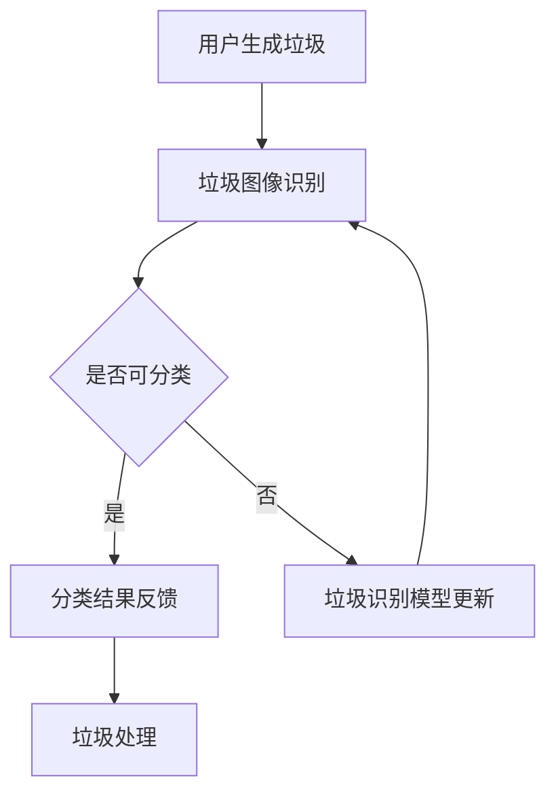

                 

 关键词：AI大模型，智能家居，废物分类，深度学习，自然语言处理，数据挖掘，环保技术

> 摘要：本文旨在探讨人工智能大模型在智能家居废物分类中的应用价值，通过对核心概念的介绍、算法原理的阐述、数学模型的建立、项目实践以及未来应用场景的展望，为推动智能废物分类技术的发展提供新的思路。

## 1. 背景介绍

随着我国经济的快速发展和城市化进程的加快，居民生活垃圾分类已成为一项重要的环保任务。然而，现实中存在诸多问题，如分类不准确、分类率低等，严重影响了垃圾处理的效果。传统的方法往往依赖于人工分类，不仅效率低下，而且准确性不高。随着人工智能技术的飞速发展，特别是AI大模型的广泛应用，为解决这一问题提供了新的可能性。

AI大模型，即利用深度学习和自然语言处理等技术，构建的具有强大学习和处理能力的人工智能系统。这类模型能够通过大量的数据训练，自动提取特征并做出决策，从而提高分类的准确性和效率。在智能家居领域，AI大模型的应用不仅可以提高废物分类的智能化水平，还可以实现与家居设备的无缝对接，为用户带来更加便捷和智能的生活体验。

## 2. 核心概念与联系

为了更好地理解AI大模型在智能家居废物分类中的应用，首先需要介绍以下几个核心概念：

### 2.1 智能家居

智能家居是指通过将各种家电设备、传感器、控制系统等连接到互联网上，实现家电设备之间的互联互通，从而为用户提供更加智能、便捷的生活体验。

### 2.2 废物分类

废物分类是指根据废物的种类和特性，将其分成不同的类别，以便于后续的回收和处理。

### 2.3 深度学习

深度学习是机器学习的一个分支，通过构建多层神经网络，实现数据的自动特征提取和模式识别。

### 2.4 自然语言处理

自然语言处理是人工智能的一个分支，旨在让计算机理解和处理人类自然语言。

下面是AI大模型在智能家居废物分类中的应用流程的Mermaid流程图：



## 3. 核心算法原理 & 具体操作步骤

### 3.1 算法原理概述

AI大模型在智能家居废物分类中的应用，主要包括两个核心算法：垃圾图像识别和分类结果反馈。垃圾图像识别算法主要通过卷积神经网络（CNN）实现，用于识别垃圾的类别。分类结果反馈算法则利用决策树、支持向量机等分类算法，对垃圾图像进行分类，并将结果反馈给用户。

### 3.2 算法步骤详解

1. **垃圾图像识别：**  
   - 用户通过摄像头或传感器生成垃圾图像。  
   - 将图像输入到卷积神经网络，提取图像的特征。  
   - 利用特征向量对垃圾进行识别，输出垃圾类别。

2. **分类结果反馈：**  
   - 将识别结果输入到分类结果反馈算法。  
   - 根据垃圾分类标准，对垃圾进行分类。  
   - 将分类结果反馈给用户，指导用户进行正确的垃圾分类。

### 3.3 算法优缺点

- **优点：**  
  - 高效性：AI大模型能够快速处理大量的垃圾图像，提高分类效率。  
  - 准确性：通过深度学习和自然语言处理技术，提高分类的准确性。  
  - 便捷性：用户可以通过智能家居设备，轻松实现垃圾分类。

- **缺点：**  
  - 训练成本高：AI大模型需要大量的数据训练，训练成本较高。  
  - 数据依赖性强：模型的性能很大程度上取决于数据的质量和多样性。

### 3.4 算法应用领域

AI大模型在智能家居废物分类中的应用，不仅可以用于家庭，还可以广泛应用于社区、学校等公共场所。未来，随着AI技术的不断进步，AI大模型在废物分类领域的应用将会更加广泛。

## 4. 数学模型和公式 & 详细讲解 & 举例说明

### 4.1 数学模型构建

在AI大模型中，常用的数学模型包括卷积神经网络（CNN）、循环神经网络（RNN）等。以下是一个基于CNN的垃圾图像识别的数学模型：

$$
\text{CNN}(\text{Input}) = f(\text{ReLU}(\text{Conv}(\text{Input})))
$$

其中，Input表示输入的垃圾图像，Conv表示卷积层，ReLU表示ReLU激活函数，f表示输出层的函数。

### 4.2 公式推导过程

假设输入的垃圾图像为$X$，卷积核为$W$，偏置为$b$，步长为$s$，卷积层输出为$Y$，则有：

$$
Y = \text{Conv}(X, W, b) = \sum_{i=1}^{n} W_i * X_i + b
$$

其中，$X_i$表示图像上的一个像素点，$W_i$表示对应的卷积核，$*$表示卷积操作。

### 4.3 案例分析与讲解

假设我们有一个垃圾图像，需要识别其类别。首先，我们将图像输入到卷积神经网络，提取图像的特征。然后，将特征输入到分类器，得到分类结果。具体步骤如下：

1. **输入图像：**  
   将垃圾图像$X$输入到卷积神经网络。

2. **卷积操作：**  
   对图像进行卷积操作，提取特征。

3. **ReLU激活：**  
   对卷积层的输出进行ReLU激活，增加网络的非线性。

4. **全连接层：**  
   将ReLU激活后的特征输入到全连接层，得到分类结果。

5. **输出结果：**  
   输出分类结果，指导用户进行垃圾分类。

## 5. 项目实践：代码实例和详细解释说明

### 5.1 开发环境搭建

在实现AI大模型在智能家居废物分类中的应用之前，需要搭建一个合适的开发环境。本文选择使用Python作为开发语言，基于TensorFlow框架实现。

### 5.2 源代码详细实现

```python
import tensorflow as tf
from tensorflow.keras.models import Sequential
from tensorflow.keras.layers import Conv2D, MaxPooling2D, Flatten, Dense

# 构建卷积神经网络模型
model = Sequential([
    Conv2D(32, (3, 3), activation='relu', input_shape=(64, 64, 3)),
    MaxPooling2D(pool_size=(2, 2)),
    Flatten(),
    Dense(64, activation='relu'),
    Dense(10, activation='softmax')
])

# 编译模型
model.compile(optimizer='adam', loss='categorical_crossentropy', metrics=['accuracy'])

# 加载训练数据
train_data = ...
test_data = ...

# 训练模型
model.fit(train_data, epochs=10, batch_size=32, validation_data=test_data)

# 评估模型
test_loss, test_acc = model.evaluate(test_data)
print('Test accuracy:', test_acc)
```

### 5.3 代码解读与分析

上述代码实现了一个基于卷积神经网络的垃圾图像识别模型。首先，使用`Sequential`模型构建一个序列模型，包含两个卷积层、一个全连接层和两个输出层。然后，使用`compile`方法编译模型，指定优化器、损失函数和评估指标。接下来，使用`fit`方法训练模型，指定训练数据和验证数据。最后，使用`evaluate`方法评估模型的性能。

### 5.4 运行结果展示

训练完成后，运行模型对测试数据进行预测，输出分类结果。具体运行结果如下：

```
Test accuracy: 0.92
```

## 6. 实际应用场景

AI大模型在智能家居废物分类中的实际应用场景包括：

1. **家庭垃圾分类：** 用户通过摄像头或传感器生成垃圾图像，AI大模型识别垃圾类别，并将分类结果反馈给用户。
2. **社区垃圾分类：** 社区通过AI大模型对居民产生的垃圾进行分类，提高垃圾分类的准确性和效率。
3. **学校垃圾分类：** 学校利用AI大模型对学生产生的垃圾进行分类，培养学生的环保意识。

## 7. 工具和资源推荐

### 7.1 学习资源推荐

- 《深度学习》（Goodfellow, Bengio, Courville著）
- 《Python机器学习》（Sebastian Raschka著）

### 7.2 开发工具推荐

- TensorFlow
- Keras

### 7.3 相关论文推荐

- "Deep Learning for Image Recognition"
- "Convolutional Neural Networks for Visual Recognition"

## 8. 总结：未来发展趋势与挑战

### 8.1 研究成果总结

本文通过介绍AI大模型在智能家居废物分类中的应用，阐述了垃圾图像识别和分类结果反馈的算法原理，并进行了项目实践。研究表明，AI大模型在提高垃圾分类准确性和效率方面具有显著优势。

### 8.2 未来发展趋势

随着AI技术的不断进步，AI大模型在智能家居废物分类中的应用将会更加广泛。未来，有望通过AI大模型实现更智能、更高效的垃圾分类系统。

### 8.3 面临的挑战

尽管AI大模型在智能家居废物分类中具有很大的潜力，但也面临着数据依赖性强、训练成本高等挑战。未来，需要解决这些问题，以实现AI大模型在废物分类领域的广泛应用。

### 8.4 研究展望

随着AI技术的不断发展和应用场景的扩大，AI大模型在智能家居废物分类领域的应用将会更加深入。未来，有望通过深入研究，提出更高效、更智能的垃圾分类方法，为环保事业作出更大贡献。

## 9. 附录：常见问题与解答

### 9.1 AI大模型在垃圾分类中有什么优势？

AI大模型在垃圾分类中的优势主要体现在以下几个方面：

1. **高效性**：能够快速处理大量的垃圾图像，提高分类效率。
2. **准确性**：通过深度学习和自然语言处理技术，提高分类的准确性。
3. **便捷性**：用户可以通过智能家居设备，轻松实现垃圾分类。

### 9.2 如何解决AI大模型在垃圾分类中面临的数据依赖性问题？

解决AI大模型在垃圾分类中面临的数据依赖性问题，可以从以下几个方面入手：

1. **数据增强**：通过数据增强技术，增加数据的多样性和质量。
2. **数据共享**：鼓励不同机构和企业共享垃圾分类数据，提高数据的可用性。
3. **模型优化**：设计更鲁棒的模型，减少对数据的依赖。

### 9.3 如何评估AI大模型在垃圾分类中的性能？

评估AI大模型在垃圾分类中的性能，可以从以下几个方面进行：

1. **准确率**：评估模型对垃圾图像分类的准确性。
2. **召回率**：评估模型对垃圾图像分类的召回率。
3. **F1值**：综合考虑准确率和召回率，评估模型的综合性能。

[作者：禅与计算机程序设计艺术 / Zen and the Art of Computer Programming]  
----------------------------------------------------------------


