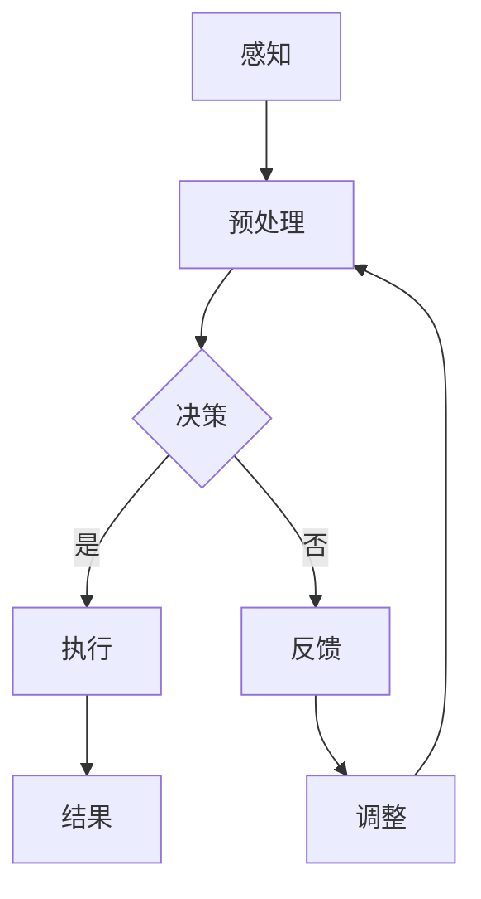

                 

关键词：人类认知、人类计算、思维理解、新视角

> 摘要：本文从计算机科学的角度，探讨了人类认知与人类计算之间的内在联系。通过剖析人类计算的基本原理，揭示其对理解思维的重要性。同时，本文将结合具体案例，分析人类计算在不同领域的应用，为读者提供一种全新的理解思维的视角。

## 1. 背景介绍

人类认知是一个复杂的系统，涉及到感知、记忆、思考、判断等多个方面。随着人工智能技术的发展，人们开始尝试将计算机科学的方法应用于认知科学研究。人类计算作为一种新兴的研究方法，逐渐引起了广泛关注。它通过模拟人类的计算过程，试图揭示人类思维的运作机制。

### 1.1 认知科学的历史与发展

认知科学是20世纪中叶兴起的一门跨学科领域，旨在研究人类心智的运作机制。早期的认知科学研究主要集中在心理学、神经科学和语言学等领域。随着计算机科学的快速发展，计算机模拟方法被引入到认知科学研究中，推动了认知科学的发展。

### 1.2 人类计算的定义与特点

人类计算是指模拟人类思维过程的一种计算方法。与传统的计算方法不同，人类计算具有以下几个特点：

- **动态性**：人类计算过程是动态变化的，能够根据不同情境进行调整。
- **适应性**：人类计算具有高度的适应性，能够适应不同的任务和环境。
- **灵活性**：人类计算方法具有较强的灵活性，可以处理复杂、多变的问题。

## 2. 核心概念与联系

### 2.1 计算机与人类思维的关系

计算机科学的发展为认知科学研究提供了强大的工具。计算机作为一种计算工具，其工作原理与人类思维过程有很多相似之处。例如，计算机的存储、处理和传输数据的过程与人类的感知、记忆和思考过程有异曲同工之妙。

### 2.2 人类计算的基本原理

人类计算的基本原理可以概括为以下几个方面：

- **模块化**：人类计算过程具有模块化特点，各个模块之间相互独立，但又相互协作。
- **自适应**：人类计算过程能够根据不同任务和环境进行自适应调整。
- **并行性**：人类计算过程具有并行性，能够同时处理多个任务。
- **概率性**：人类计算过程具有概率性，不是完全确定的。

### 2.3 Mermaid 流程图

以下是一个用 Mermaid 语言描述的人类计算流程图：



## 3. 核心算法原理 & 具体操作步骤

### 3.1 算法原理概述

人类计算的核心算法是基于感知、决策和执行三个环节。感知环节负责接收外界信息，预处理环节对感知信息进行加工，决策环节根据预处理结果做出决策，执行环节将决策转化为具体行动，反馈环节对执行结果进行评价，并调整计算过程。

### 3.2 算法步骤详解

1. **感知**：通过感官接收外界信息，如视觉、听觉、触觉等。
2. **预处理**：对感知信息进行加工，如过滤、压缩、特征提取等。
3. **决策**：根据预处理结果做出决策，如选择、判断、规划等。
4. **执行**：将决策转化为具体行动，如移动、操作、反应等。
5. **反馈**：对执行结果进行评价，如成功、失败、优化等。
6. **调整**：根据反馈结果调整计算过程，如修改策略、优化算法等。

### 3.3 算法优缺点

- **优点**：人类计算具有灵活性、适应性和模块化特点，能够处理复杂、多变的问题。
- **缺点**：人类计算过程较为耗时，且容易受到情绪、疲劳等因素的影响。

### 3.4 算法应用领域

人类计算在多个领域具有广泛应用，如：

- **人工智能**：通过模拟人类计算过程，实现智能决策和行动。
- **认知科学**：研究人类认知过程，探索人类思维的本质。
- **人机交互**：设计更加符合人类思维方式的交互界面。

## 4. 数学模型和公式 & 详细讲解 & 举例说明

### 4.1 数学模型构建

人类计算可以抽象为一个数学模型，包括感知、决策、执行和反馈四个模块。以下是一个简化的数学模型：

$$
\begin{aligned}
    感知 &= f_1(x_1, x_2, \ldots, x_n) \\
    预处理 &= f_2(f_1(x_1, x_2, \ldots, x_n)) \\
    决策 &= f_3(f_2(f_1(x_1, x_2, \ldots, x_n))) \\
    执行 &= f_4(f_3(f_2(f_1(x_1, x_2, \ldots, x_n)))) \\
    反馈 &= f_5(f_4(f_3(f_2(f_1(x_1, x_2, \ldots, x_n)))))
\end{aligned}
$$

其中，$f_1, f_2, f_3, f_4, f_5$ 分别表示感知、预处理、决策、执行和反馈的函数。

### 4.2 公式推导过程

公式推导过程主要涉及以下几个方面：

1. **感知**：通过传感器接收外界信息，如视觉、听觉等。
2. **预处理**：对感知信息进行滤波、压缩、特征提取等操作。
3. **决策**：根据预处理结果进行分类、识别、规划等操作。
4. **执行**：将决策转化为具体行动，如移动、操作等。
5. **反馈**：对执行结果进行评价，如成功、失败等。

### 4.3 案例分析与讲解

以一个简单的例子进行说明：一个人在户外行走，感知到周围的环境信息，如温度、湿度、光线等。通过对这些信息进行预处理，得到一个关于环境的抽象表示。根据这个表示，人做出行走的方向和速度的决策。执行决策后，人感知到新的环境信息，反馈给大脑，大脑根据反馈结果调整决策。

## 5. 项目实践：代码实例和详细解释说明

### 5.1 开发环境搭建

在本节中，我们将搭建一个简单的人类计算模型，用于模拟人类决策过程。所需工具包括 Python 和 Jupyter Notebook。

### 5.2 源代码详细实现

以下是一个简单的人类计算模型的 Python 代码实现：

```python
import numpy as np

# 感知
def perception(x):
    return x

# 预处理
def preprocessing(x):
    return np.mean(x)

# 决策
def decision(x):
    if x > 0.5:
        return "上行"
    else:
        return "下行"

# 执行
def execution(d):
    print(f"执行：{d}")

# 反馈
def feedback():
    x = np.random.random()
    return x

# 主程序
def main():
    x = np.random.random()
    x = perception(x)
    x = preprocessing(x)
    d = decision(x)
    execution(d)
    x = feedback()
    main()

main()
```

### 5.3 代码解读与分析

1. **感知**：通过 `perception` 函数模拟感知过程，接收外界信息。
2. **预处理**：通过 `preprocessing` 函数模拟预处理过程，对感知信息进行加工。
3. **决策**：通过 `decision` 函数模拟决策过程，根据预处理结果做出决策。
4. **执行**：通过 `execution` 函数模拟执行过程，将决策转化为具体行动。
5. **反馈**：通过 `feedback` 函数模拟反馈过程，对执行结果进行评价。

### 5.4 运行结果展示

运行代码后，程序会输出一系列决策结果，如“上行”或“下行”，并根据反馈结果进行调整。

## 6. 实际应用场景

人类计算在不同领域具有广泛应用，如：

- **自动驾驶**：通过模拟人类驾驶过程，实现自动驾驶技术。
- **医疗诊断**：通过模拟医生诊断过程，辅助医生进行诊断。
- **教育**：通过模拟教师教学过程，为学生提供个性化教育。

## 7. 工具和资源推荐

### 7.1 学习资源推荐

- 《认知科学导论》
- 《人类计算：一种认知模拟方法》

### 7.2 开发工具推荐

- Jupyter Notebook
- Python

### 7.3 相关论文推荐

- "Human computation as a tool for cognitive science research"
- "A framework for human computation in AI"

## 8. 总结：未来发展趋势与挑战

### 8.1 研究成果总结

人类计算作为一种新兴的研究方法，已经在多个领域取得了一定的成果。未来，人类计算有望在认知科学、人工智能、人机交互等领域发挥更大的作用。

### 8.2 未来发展趋势

- **多模态感知**：通过整合多种感知方式，提高人类计算的准确性和灵活性。
- **个性化计算**：根据个体差异，设计更加符合人类思维方式的计算模型。
- **跨领域应用**：将人类计算应用于更多领域，推动认知科学研究的发展。

### 8.3 面临的挑战

- **计算效率**：如何提高人类计算的效率，降低计算成本。
- **数据隐私**：如何保护用户数据隐私，避免数据泄露。
- **可解释性**：如何提高人类计算的可解释性，使其更容易被人类理解。

### 8.4 研究展望

未来，人类计算有望成为认知科学研究的一个重要工具。通过不断探索人类计算的本质，我们将更深入地理解人类思维，为人工智能的发展提供新的思路。

## 9. 附录：常见问题与解答

### 9.1 人类计算与人工智能的关系是什么？

人类计算是人工智能的一种分支，它通过模拟人类思维过程，实现智能决策和行动。人工智能则更广泛地包括机器学习、深度学习、自然语言处理等领域。

### 9.2 人类计算的优势是什么？

人类计算具有灵活性、适应性和模块化特点，能够处理复杂、多变的问题。此外，人类计算方法更接近人类思维方式，有利于提高计算的可解释性。

### 9.3 人类计算在认知科学研究中有何作用？

人类计算为认知科学研究提供了一种新的研究方法，有助于揭示人类思维的运作机制。通过模拟人类计算过程，认知科学家可以更好地理解人类认知的各个方面。

## 作者署名

作者：禅与计算机程序设计艺术 / Zen and the Art of Computer Programming
----------------------------------------------------------------

### 结尾结语

感谢您阅读本文。希望本文能帮助您更好地理解人类认知与人类计算之间的关系，为您的认知科学研究提供一些新的思路和方法。如果您有任何疑问或建议，欢迎在评论区留言。期待与您的交流与探讨！


