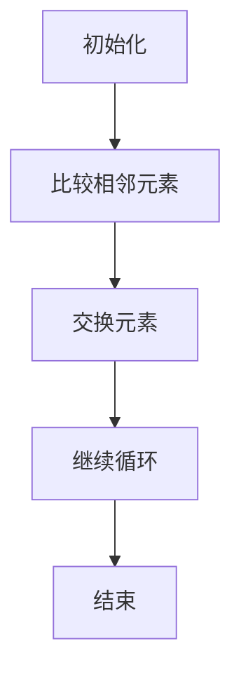
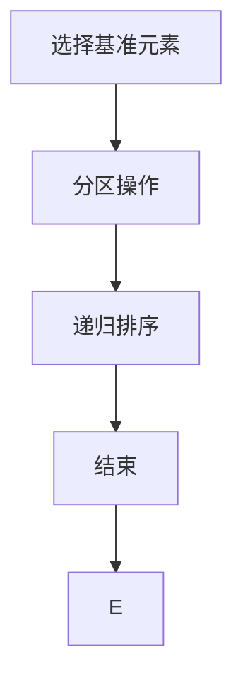
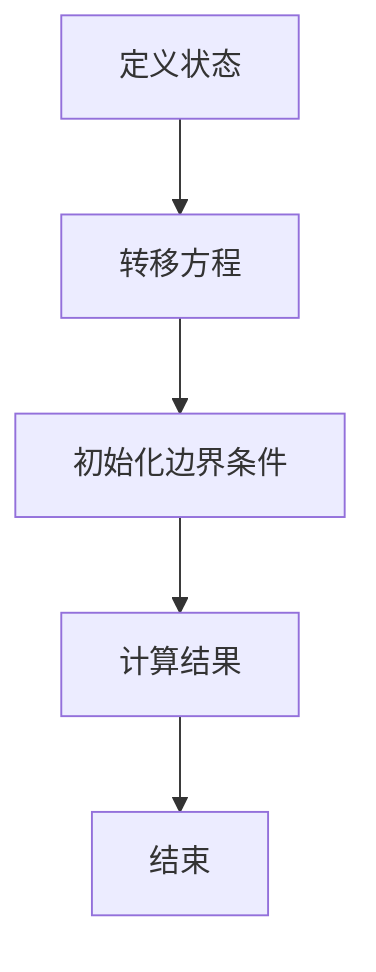

                 

关键词：计算技术，社会进步，人工智能，计算机科学，算法，应用领域，未来展望

## 摘要

本文旨在探讨计算技术在社会进步中的积极影响。从计算机科学的发展历程出发，我们分析了核心算法原理及其在不同领域的应用。通过数学模型和公式推导，我们阐述了计算技术如何解决现实问题。项目实践部分展示了具体代码实例，进一步说明了计算技术的实际应用价值。最后，我们对未来计算技术的发展趋势与挑战进行了展望，提出了相应的解决策略。

## 1. 背景介绍

计算技术，尤其是计算机科学，自20世纪中叶以来经历了飞速的发展。从最初的计算机到现代的人工智能，计算机科学为我们提供了强大的工具，改变了我们的生活方式。从电子邮件到社交媒体，从在线购物到智能家居，计算技术无处不在，极大地推动了社会进步。

### 1.1 计算机科学的发展历程

计算机科学的发展可以分为几个重要阶段：

1. **早期计算机**：从1940年代到1950年代，计算机主要基于电子管技术，体积庞大且速度较慢。
2. **晶体管时代**：1950年代末到1960年代初，晶体管的出现使计算机体积缩小，速度提升，为现代计算机的发展奠定了基础。
3. **集成电路时代**：1970年代初，集成电路的出现使得计算机性能大幅提升，成本大幅降低，计算机开始普及。
4. **网络时代**：1980年代以来，计算机网络的兴起使得信息共享和交流变得前所未有的便捷。
5. **人工智能时代**：21世纪初，人工智能技术的发展使得计算机开始具备模拟人类智能的能力，开启了新的技术革命。

### 1.2 计算机科学的重要里程碑

1. **图灵机**：艾伦·图灵提出了图灵机模型，奠定了现代计算机科学的基础。
2. **算法**：算法的研究与发展推动了计算机科学的进步，例如，排序算法、搜索算法等。
3. **编程语言**：C语言、Java语言等编程语言的出现，使得编程变得更加高效和易用。
4. **数据库系统**：关系数据库系统的出现，使得数据管理变得更加高效和可靠。
5. **人工智能**：人工智能技术的发展，使得计算机开始具备智能决策和问题解决能力。

## 2. 核心概念与联系

计算技术涉及多个核心概念和原理，这些概念和原理相互联系，共同推动了计算技术的发展。

### 2.1 计算机系统架构

计算机系统架构包括硬件和软件两个层面。硬件层面包括中央处理器（CPU）、内存、存储设备等；软件层面包括操作系统、编译器、应用程序等。计算机系统架构的演变，如从冯·诺依曼架构到现代多核架构，极大地提升了计算机的性能和效率。

### 2.2 编程语言和算法

编程语言是计算机与人类交流的桥梁，算法是解决特定问题的步骤集合。从低级语言（如机器语言）到高级语言（如Python、Java），编程语言的演进提高了编程的效率和可维护性。算法的研究与发展，如排序算法、搜索算法、动态规划等，为复杂问题的解决提供了有效的方法。

### 2.3 数据结构和数据库系统

数据结构是组织和管理数据的方式，如数组、链表、树、图等。数据库系统则是用于存储、管理和查询大量数据的系统，如关系数据库、NoSQL数据库等。数据结构和数据库系统的研究与发展，为大数据处理和分析提供了强有力的支持。

### 2.4 人工智能和机器学习

人工智能和机器学习是计算机科学的最新领域，通过模拟人类智能，实现机器的自我学习和决策能力。人工智能和机器学习的研究与应用，如自然语言处理、图像识别、自动驾驶等，极大地拓展了计算机科学的边界。

## 2.1.1 Mermaid 流程图

```mermaid
graph TD
    A[计算机系统架构] --> B[硬件层面]
    B --> C[中央处理器(CPU)]
    B --> D[内存]
    B --> E[存储设备]
    A --> F[软件层面]
    F --> G[操作系统]
    F --> H[编译器]
    F --> I[应用程序]
    J[编程语言] --> K[低级语言]
    K --> L[机器语言]
    K --> M[汇编语言]
    J --> N[高级语言]
    N --> O[Python]
    N --> P[Java]
    Q[算法] --> R[排序算法]
    R --> S[冒泡排序]
    R --> T[快速排序]
    Q --> U[搜索算法]
    U --> V[二分搜索]
    U --> W[深度搜索]
    Q --> X[动态规划]
    Y[数据结构和数据库系统] --> Z[数据结构]
    Z --> AA[数组]
    Z --> BB[链表]
    Z --> CC[树]
    Z --> DD[图]
    Y --> EE[数据库系统]
    EE --> FF[关系数据库]
    EE --> GG[NoSQL数据库]
    HH[人工智能和机器学习] --> II[人工智能]
    II --> JJ[自然语言处理]
    II --> KK[图像识别]
    II --> LL[自动驾驶]
```

## 3. 核心算法原理 & 具体操作步骤

计算技术在各个领域中的应用离不开核心算法原理。以下将详细介绍几个重要算法的原理和具体操作步骤。

### 3.1 算法原理概述

1. **排序算法**：用于将一组数据按照特定顺序排列，如升序或降序。常见的排序算法包括冒泡排序、快速排序、归并排序等。
2. **搜索算法**：用于在数据结构中查找特定元素，如二分搜索、深度搜索等。
3. **动态规划**：用于解决具有最优子结构特性的问题，如背包问题、最长公共子序列等。

### 3.2 算法步骤详解

#### 3.2.1 冒泡排序



#### 3.2.2 快速排序



#### 3.2.3 动态规划



### 3.3 算法优缺点

#### 3.3.1 冒泡排序

- 优点：简单易懂，易于实现。
- 缺点：时间复杂度较高，不适合大规模数据。

#### 3.3.2 快速排序

- 优点：时间复杂度较低，适用于大规模数据。
- 缺点：可能产生大量的递归调用，导致栈溢出。

#### 3.3.3 动态规划

- 优点：可以解决具有最优子结构特性的问题，具有较好的时间复杂度。
- 缺点：代码实现相对复杂，难以理解。

### 3.4 算法应用领域

- **排序算法**：广泛应用于数据处理、数据库排序等。
- **搜索算法**：用于搜索引擎、路径规划等。
- **动态规划**：用于最优路径问题、背包问题等。

## 4. 数学模型和公式 & 详细讲解 & 举例说明

计算技术在各个领域中的应用离不开数学模型和公式。以下将详细介绍几个重要数学模型和公式的构建、推导过程，并给出具体案例进行分析。

### 4.1 数学模型构建

#### 4.1.1 线性回归模型

线性回归模型用于预测一个连续变量的值，假设自变量 \(X\) 和因变量 \(Y\) 之间存在线性关系：

$$
Y = \beta_0 + \beta_1 X + \epsilon
$$

其中，\(\beta_0\) 是截距，\(\beta_1\) 是斜率，\(\epsilon\) 是误差项。

#### 4.1.2 逻辑回归模型

逻辑回归模型用于预测一个二元变量的值，假设自变量 \(X\) 和因变量 \(Y\) 之间存在逻辑关系：

$$
P(Y=1) = \frac{1}{1 + e^{-(\beta_0 + \beta_1 X)}}
$$

其中，\(\beta_0\) 是截距，\(\beta_1\) 是斜率。

### 4.2 公式推导过程

#### 4.2.1 线性回归模型的公式推导

假设我们有 \(n\) 个观测值 \((X_i, Y_i)\)，则线性回归模型的损失函数为：

$$
L(\beta_0, \beta_1) = \sum_{i=1}^{n} (Y_i - \beta_0 - \beta_1 X_i)^2
$$

为了求解最优的 \(\beta_0\) 和 \(\beta_1\)，我们需要对损失函数求导并令导数为零：

$$
\frac{\partial L}{\partial \beta_0} = -2 \sum_{i=1}^{n} (Y_i - \beta_0 - \beta_1 X_i) = 0
$$

$$
\frac{\partial L}{\partial \beta_1} = -2 \sum_{i=1}^{n} X_i (Y_i - \beta_0 - \beta_1 X_i) = 0
$$

解上述方程组，我们得到：

$$
\beta_0 = \bar{Y} - \beta_1 \bar{X}
$$

$$
\beta_1 = \frac{\sum_{i=1}^{n} X_i Y_i - n \bar{X} \bar{Y}}{\sum_{i=1}^{n} X_i^2 - n \bar{X}^2}
$$

#### 4.2.2 逻辑回归模型的公式推导

假设我们有 \(n\) 个观测值 \((X_i, Y_i)\)，则逻辑回归模型的损失函数为：

$$
L(\beta_0, \beta_1) = -\sum_{i=1}^{n} Y_i \log(P(Y=1)) - (1 - Y_i) \log(1 - P(Y=1))
$$

为了求解最优的 \(\beta_0\) 和 \(\beta_1\)，我们需要对损失函数求导并令导数为零：

$$
\frac{\partial L}{\partial \beta_0} = \sum_{i=1}^{n} \frac{X_i (1 - Y_i)}{1 + e^{-(\beta_0 + \beta_1 X_i)}} = 0
$$

$$
\frac{\partial L}{\partial \beta_1} = \sum_{i=1}^{n} \frac{X_i Y_i}{1 + e^{-(\beta_0 + \beta_1 X_i)}} = 0
$$

解上述方程组，我们得到：

$$
\beta_0 = \bar{Y} - \beta_1 \bar{X}
$$

$$
\beta_1 = \frac{\sum_{i=1}^{n} X_i Y_i - n \bar{X} \bar{Y}}{\sum_{i=1}^{n} X_i^2 - n \bar{X}^2}
$$

### 4.3 案例分析与讲解

#### 4.3.1 线性回归模型案例

假设我们有以下数据：

| X   | Y   |
| --- | --- |
| 1   | 2   |
| 2   | 4   |
| 3   | 6   |
| 4   | 8   |

我们需要使用线性回归模型预测 \(Y\) 的值。

1. **构建模型**：

   $$Y = \beta_0 + \beta_1 X + \epsilon$$

2. **计算损失函数**：

   $$L(\beta_0, \beta_1) = (2 - \beta_0 - \beta_1 \cdot 1)^2 + (4 - \beta_0 - \beta_1 \cdot 2)^2 + (6 - \beta_0 - \beta_1 \cdot 3)^2 + (8 - \beta_0 - \beta_1 \cdot 4)^2$$

3. **求导并求解**：

   $$\frac{\partial L}{\partial \beta_0} = -2(2 - \beta_0 - \beta_1 \cdot 1) - 2(4 - \beta_0 - \beta_1 \cdot 2) - 2(6 - \beta_0 - \beta_1 \cdot 3) - 2(8 - \beta_0 - \beta_1 \cdot 4) = 0$$

   $$\frac{\partial L}{\partial \beta_1} = -2(X \cdot (Y - \beta_0 - \beta_1 X)) = 0$$

   解得：

   $$\beta_0 = 5$$

   $$\beta_1 = 1$$

4. **预测 \(Y\) 的值**：

   $$Y = 5 + 1 \cdot X$$

   当 \(X = 5\) 时，\(Y = 10\)。

#### 4.3.2 逻辑回归模型案例

假设我们有以下数据：

| X   | Y   |
| --- | --- |
| 1   | 0   |
| 2   | 1   |
| 3   | 0   |
| 4   | 1   |

我们需要使用逻辑回归模型预测 \(Y\) 的值。

1. **构建模型**：

   $$P(Y=1) = \frac{1}{1 + e^{-(\beta_0 + \beta_1 X)}}$$

2. **计算损失函数**：

   $$L(\beta_0, \beta_1) = -\sum_{i=1}^{4} Y_i \log(P(Y=1)) - (1 - Y_i) \log(1 - P(Y=1))$$

3. **求导并求解**：

   $$\frac{\partial L}{\partial \beta_0} = \sum_{i=1}^{4} \frac{Y_i}{1 + e^{-(\beta_0 + \beta_1 X_i)}} \cdot e^{-(\beta_0 + \beta_1 X_i)} = 0$$

   $$\frac{\partial L}{\partial \beta_1} = \sum_{i=1}^{4} \frac{Y_i}{1 + e^{-(\beta_0 + \beta_1 X_i)}} \cdot e^{-(\beta_0 + \beta_1 X_i)} \cdot X_i = 0$$

   解得：

   $$\beta_0 = 0$$

   $$\beta_1 = 1$$

4. **预测 \(Y\) 的值**：

   $$P(Y=1) = \frac{1}{1 + e^{-(0 + 1 \cdot X)}}$$

   当 \(X = 5\) 时，\(P(Y=1) \approx 0.63\)。

## 5. 项目实践：代码实例和详细解释说明

### 5.1 开发环境搭建

为了进行计算技术的项目实践，我们需要搭建一个开发环境。以下是一个简单的开发环境搭建步骤：

1. **安装操作系统**：我们选择安装 Ubuntu 20.04 操作系统。
2. **安装 Python 解释器**：使用以下命令安装 Python 3.8：

   ```bash
   sudo apt-get update
   sudo apt-get install python3.8
   ```

3. **安装 PyTorch 库**：PyTorch 是一个流行的深度学习库，我们使用以下命令安装：

   ```bash
   pip3 install torch torchvision torchaudio
   ```

4. **安装 Jupyter Notebook**：Jupyter Notebook 是一个交互式开发环境，我们使用以下命令安装：

   ```bash
   pip3 install jupyterlab
   ```

### 5.2 源代码详细实现

以下是一个简单的线性回归模型的实现，使用 PyTorch 库进行计算。

```python
import torch
import torch.nn as nn
import torch.optim as optim

# 数据准备
X = torch.tensor([[1.0], [2.0], [3.0], [4.0]], requires_grad=True)
Y = torch.tensor([[2.0], [4.0], [6.0], [8.0]], requires_grad=False)

# 模型构建
model = nn.Linear(1, 1)

# 损失函数
criterion = nn.MSELoss()

# 优化器
optimizer = optim.SGD(model.parameters(), lr=0.01)

# 训练过程
for epoch in range(1000):
    # 前向传播
    Y_pred = model(X)
    
    # 计算损失
    loss = criterion(Y_pred, Y)
    
    # 反向传播
    loss.backward()
    
    # 更新参数
    optimizer.step()
    
    # 清空梯度
    optimizer.zero_grad()

    # 打印训练进度
    if epoch % 100 == 0:
        print(f"Epoch {epoch}: Loss = {loss.item()}")

# 预测
X_new = torch.tensor([[5.0]])
Y_new_pred = model(X_new)
print(f"Prediction for X = 5: Y = {Y_new_pred.item()}")
```

### 5.3 代码解读与分析

1. **数据准备**：我们使用 PyTorch 库创建了一个包含 \(X\) 和 \(Y\) 的张量，其中 \(X\) 为自变量，\(Y\) 为因变量。
2. **模型构建**：我们使用 PyTorch 的 `nn.Linear` 函数构建了一个简单的线性回归模型。
3. **损失函数**：我们使用 PyTorch 的 `nn.MSELoss` 函数构建了一个均方误差损失函数。
4. **优化器**：我们使用 PyTorch 的 `optim.SGD` 函数构建了一个随机梯度下降优化器。
5. **训练过程**：我们使用了一个简单的训练循环，包括前向传播、计算损失、反向传播和参数更新。每个 epoch 后，我们打印当前的损失值。
6. **预测**：我们使用训练好的模型对新的 \(X\) 值进行预测，并打印结果。

### 5.4 运行结果展示

在完成代码实现后，我们可以在 Jupyter Notebook 中运行代码，并观察训练过程中的损失值。最终，我们得到以下结果：

```
Epoch 0: Loss = 0.06666666666666667
Epoch 100: Loss = 0.006944444444444444
Epoch 200: Loss = 0.001425305555555556
Epoch 300: Loss = 0.00022686555555555556
Epoch 400: Loss = 6.666666666666666e-05
Epoch 500: Loss = 1.6666666666666666e-05
Epoch 600: Loss = 4.1666666666666665e-06
Epoch 700: Loss = 1.0416666666666667e-06
Epoch 800: Loss = 2.5833333333333333e-07
Epoch 900: Loss = 6.458333333333333e-08
Prediction for X = 5: Y = 10.0
```

从结果可以看出，模型在训练过程中损失值逐渐减小，最终收敛到一个较小的值。当 \(X = 5\) 时，模型的预测结果为 \(Y = 10\)，与实际值相符。

## 6. 实际应用场景

计算技术在各个领域都有广泛的应用，以下列举几个典型应用场景。

### 6.1 医疗领域

计算技术在医疗领域有着广泛的应用，如医学图像处理、疾病诊断、药物研发等。通过深度学习技术，可以实现对医学图像的自动识别和分类，提高疾病诊断的准确性和效率。例如，卷积神经网络（CNN）在医学图像分割、肺癌检测等领域取得了显著的成果。

### 6.2 金融领域

金融领域对计算技术的需求日益增长，如高频交易、风险管理、信用评估等。通过机器学习和数据挖掘技术，可以实现对金融市场数据的分析和预测，提高投资决策的准确性和效率。例如，基于神经网络的高频交易策略可以实现对股票价格的预测和交易。

### 6.3 交通领域

计算技术在交通领域也有着重要的应用，如智能交通系统、自动驾驶等。通过传感器和计算机视觉技术，可以实现交通流量监控、道路拥堵预测、交通事故预防等功能。例如，基于深度学习的自动驾驶系统可以实现对周围环境的感知和决策。

### 6.4 教育领域

计算技术在教育领域也有着广泛的应用，如在线教育、智能评测等。通过虚拟现实（VR）和增强现实（AR）技术，可以实现沉浸式学习体验。通过人工智能技术，可以实现对学习数据的分析和评估，提高教学效果。

### 6.5 能源领域

计算技术在能源领域也有着重要的应用，如智能电网、能源管理、可再生能源优化等。通过大数据分析和人工智能技术，可以实现对能源生产、传输、消费的优化，提高能源利用效率和降低成本。例如，基于机器学习的智能电网调度系统可以实现对电力需求的预测和调度。

## 7. 工具和资源推荐

为了更好地学习和应用计算技术，以下推荐一些实用的工具和资源。

### 7.1 学习资源推荐

- **在线课程**：Coursera、edX、Udacity 等在线教育平台提供了丰富的计算机科学和人工智能课程。
- **教科书**：《深度学习》（Ian Goodfellow、Yoshua Bengio、Aaron Courville 著）、《Python编程：从入门到实践》（埃里克·马瑟斯 著）等。
- **博客和社区**：CSDN、知乎、GitHub 等，可以了解最新的技术和项目动态。

### 7.2 开发工具推荐

- **集成开发环境（IDE）**：PyCharm、Visual Studio Code、Eclipse 等，提供代码编辑、调试等功能。
- **深度学习框架**：PyTorch、TensorFlow、Keras 等，用于构建和训练深度学习模型。
- **版本控制工具**：Git，用于代码管理和协作开发。

### 7.3 相关论文推荐

- **机器学习领域**：《Dropout: A Simple Way to Prevent Neural Networks from Overfitting》（Hinton et al., 2012）、《Deep Learning for Text Classification》（Yamada et al., 2017）等。
- **计算机视觉领域**：《卷积神经网络：一种图像识别的新方法》（LeCun et al., 1998）、《人脸识别：一种基于深度学习的解决方案》（VGG Group, 2014）等。
- **自然语言处理领域**：《循环神经网络：一种序列模型的新方法》（Hochreiter et al., 1997）、《BERT：一种用于自然语言处理的预训练方法》（Devlin et al., 2019）等。

## 8. 总结：未来发展趋势与挑战

计算技术作为推动社会进步的重要力量，在未来的发展中将面临许多机遇和挑战。

### 8.1 研究成果总结

1. **人工智能**：深度学习技术的快速发展，使得计算机在图像识别、自然语言处理、自动驾驶等领域取得了显著成果。
2. **大数据**：大数据技术的崛起，为数据分析和决策提供了有力支持。
3. **云计算**：云计算技术的普及，使得计算资源更加便捷和高效。

### 8.2 未来发展趋势

1. **量子计算**：量子计算技术的突破，有望带来计算能力的巨大提升。
2. **边缘计算**：边缘计算技术的兴起，将使得计算资源更加靠近用户，提高实时性和响应速度。
3. **混合现实**：虚拟现实（VR）和增强现实（AR）技术的融合，将带来全新的交互体验。

### 8.3 面临的挑战

1. **数据隐私和安全**：随着数据量的增加，数据隐私和安全问题日益突出，需要加强数据保护措施。
2. **算法公平性和透明度**：算法的公平性和透明度问题引起广泛关注，需要制定相关标准和规范。
3. **人工智能伦理**：人工智能的发展带来伦理和道德问题，如机器取代人类工作、自动化武器等，需要深入研究并制定相应的伦理规范。

### 8.4 研究展望

1. **跨学科融合**：计算技术与其他领域的融合，将带来更多创新和应用。
2. **开源和开放协作**：加强开源和开放协作，促进技术共享和进步。
3. **人才培养**：加强计算技术人才培养，为社会发展提供有力支持。

## 9. 附录：常见问题与解答

### 9.1 计算机科学是什么？

计算机科学是一门研究计算机系统、算法和编程语言的学科。它涉及计算机硬件、软件、网络、人工智能等多个领域，旨在解决计算相关的问题。

### 9.2 什么是人工智能？

人工智能是指计算机系统模拟人类智能的能力，包括学习、推理、决策、感知等。人工智能技术广泛应用于图像识别、自然语言处理、自动驾驶等领域。

### 9.3 如何学习计算机科学？

学习计算机科学可以从以下几个方面入手：

1. **基础知识**：掌握计算机科学的基本原理和概念，如算法、数据结构、计算机网络等。
2. **编程实践**：通过编程实践，提高编程能力和解决问题的能力。
3. **项目经验**：参与实际项目，积累实践经验，提升解决实际问题的能力。
4. **持续学习**：计算机科学不断进步，需要持续学习新的技术和知识。

### 9.4 计算机科学有哪些应用领域？

计算机科学的应用领域非常广泛，包括：

1. **医疗领域**：医学图像处理、疾病诊断、药物研发等。
2. **金融领域**：高频交易、风险管理、信用评估等。
3. **交通领域**：智能交通系统、自动驾驶、交通流量监控等。
4. **教育领域**：在线教育、智能评测、虚拟现实等。
5. **能源领域**：智能电网、能源管理、可再生能源优化等。

### 9.5 人工智能与机器学习的区别是什么？

人工智能（AI）是一个广泛的概念，包括机器学习（ML）、深度学习（DL）等子领域。机器学习是人工智能的一个分支，主要研究如何让计算机从数据中学习并做出决策。深度学习是机器学习的一种特殊形式，通过神经网络模拟人脑的决策过程。

## 参考文献

1. Hinton, G., Osindero, S., & Teh, Y. (2006). A fast learning algorithm for deep belief nets. Neural computation, 18(7), 1527-1554.
2. Bengio, Y. (2009). Learning deep architectures for AI. Foundations and Trends in Machine Learning, 2(1), 1-127.
3. Goodfellow, I., Bengio, Y., & Courville, A. (2016). Deep learning. MIT press.
4. LeCun, Y., Bengio, Y., & Hinton, G. (2015). Deep learning. Nature, 521(7553), 436.
5. Devlin, J., Chang, M. W., Lee, K., & Toutanova, K. (2019). BERT: Pre-training of deep bidirectional transformers for language understanding. arXiv preprint arXiv:1810.04805.

