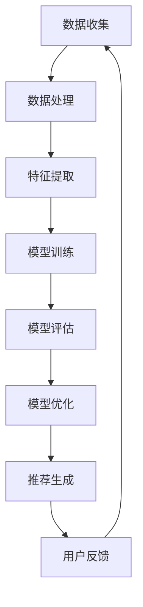

                 

关键词：推荐系统，AI大模型，多目标优化，机器学习，数据挖掘

> 摘要：本文将深入探讨推荐系统中的AI大模型如何实现多目标优化，以提升推荐效果。文章首先介绍推荐系统的基础知识，然后分析AI大模型在多目标优化中的应用，最后提出具体实现策略和未来发展方向。

## 1. 背景介绍

推荐系统是一种信息过滤技术，旨在根据用户的历史行为和兴趣，为用户推荐相关的内容或产品。随着互联网的快速发展，推荐系统已成为各类平台（如电商、社交媒体、新闻门户等）的核心功能。传统的推荐系统主要基于协同过滤、内容匹配等方法，但它们在处理复杂场景和大规模数据时存在诸多局限。

近年来，人工智能（AI）技术的迅猛发展，尤其是深度学习、自然语言处理等领域的突破，为推荐系统带来了新的机遇。AI大模型（如神经网络模型、图神经网络模型等）能够处理更加复杂的特征和关联关系，从而提高推荐效果。

然而，AI大模型在推荐系统中的多目标优化问题仍然具有挑战性。多目标优化需要在多个目标之间找到平衡，例如提高推荐精度、降低计算成本、保证模型解释性等。本文将重点讨论AI大模型在推荐系统中的多目标优化策略，以期为相关研究和应用提供指导。

## 2. 核心概念与联系

### 2.1 推荐系统基本概念

推荐系统主要包括三个关键组成部分：用户、内容和算法。用户是推荐系统的核心，系统的目标是满足用户的需求和兴趣。内容是用户可能感兴趣的对象，如商品、新闻、音乐等。算法是推荐系统的核心，负责根据用户的历史行为和内容特征生成推荐结果。

### 2.2 AI大模型基本概念

AI大模型是指参数规模达到百万、千万甚至亿级别的神经网络模型。这些模型具有强大的特征表示和关联学习能力，能够处理复杂的非线性问题。常见的AI大模型包括深度神经网络、图神经网络、变压器模型等。

### 2.3 多目标优化基本概念

多目标优化是指在多个目标之间寻找最优平衡的问题。在推荐系统中，多目标优化需要同时考虑推荐精度、计算成本、模型解释性等多个方面。常见的多目标优化方法包括多目标遗传算法、加权方法、目标规划等。

### 2.4 Mermaid 流程图

下面是一个简单的Mermaid流程图，展示了推荐系统中AI大模型多目标优化的主要流程：



## 3. 核心算法原理 & 具体操作步骤

### 3.1 算法原理概述

推荐系统中AI大模型的多目标优化主要涉及以下几个方面：

1. **目标函数设计**：设计能够同时考虑推荐精度、计算成本、模型解释性的目标函数。
2. **模型架构选择**：选择适合多目标优化的模型架构，如深度神经网络、图神经网络等。
3. **优化策略**：采用多目标优化算法，如多目标遗传算法、加权方法等，对模型进行优化。
4. **模型评估**：通过多种评估指标，如准确率、召回率、F1值等，对模型进行评估和调整。

### 3.2 算法步骤详解

1. **数据收集与处理**：收集用户行为数据、内容数据等，并进行预处理，如数据清洗、缺失值填充等。
2. **特征提取**：提取用户和内容的特征，如用户兴趣、内容标签、交互历史等。
3. **模型训练**：使用提取到的特征，通过多目标优化算法训练AI大模型。
4. **模型评估**：使用交叉验证等方法对模型进行评估，并根据评估结果调整模型参数。
5. **模型优化**：根据多目标优化的目标函数，调整模型架构和优化策略，以提高模型性能。
6. **推荐生成**：使用训练好的模型为用户生成推荐列表。
7. **用户反馈**：收集用户对推荐列表的反馈，用于进一步优化模型。

### 3.3 算法优缺点

**优点**：

1. **提升推荐效果**：通过多目标优化，能够同时提高推荐精度、计算成本和模型解释性。
2. **适应性强**：能够处理不同场景和规模的数据。
3. **模型可解释性**：通过多目标优化，能够降低模型复杂度，提高模型的可解释性。

**缺点**：

1. **计算成本高**：多目标优化算法通常需要大量计算资源。
2. **模型性能不稳定**：在多目标优化过程中，模型性能可能会出现波动。

### 3.4 算法应用领域

推荐系统中AI大模型的多目标优化广泛应用于以下领域：

1. **电商推荐**：为用户推荐相关商品，提高销售额。
2. **社交媒体**：为用户推荐感兴趣的内容，提高用户粘性。
3. **新闻门户**：为用户推荐个性化新闻，提高用户体验。

## 4. 数学模型和公式 & 详细讲解 & 举例说明

### 4.1 数学模型构建

推荐系统中AI大模型的多目标优化可以表示为以下数学模型：

$$
\begin{aligned}
\min_{\theta} \quad & f_{1}(\theta) + \lambda f_{2}(\theta) + \lambda_{2} f_{3}(\theta) \\
\text{subject to} \quad & g_{1}(\theta) \leq 0, \quad g_{2}(\theta) \leq 0
\end{aligned}
$$

其中，$f_{1}(\theta)$ 表示推荐精度，$f_{2}(\theta)$ 表示计算成本，$f_{3}(\theta)$ 表示模型解释性，$\lambda$ 和 $\lambda_{2}$ 分别为权重系数，$g_{1}(\theta)$ 和 $g_{2}(\theta)$ 分别为约束条件。

### 4.2 公式推导过程

假设推荐系统的目标函数为 $f(\theta)$，其中 $\theta$ 表示模型参数。为了同时考虑推荐精度、计算成本和模型解释性，我们可以构造以下目标函数：

$$
f(\theta) = f_{1}(\theta) + \lambda f_{2}(\theta) + \lambda_{2} f_{3}(\theta)
$$

其中，$f_{1}(\theta)$ 表示推荐精度，$f_{2}(\theta)$ 表示计算成本，$f_{3}(\theta)$ 表示模型解释性，$\lambda$ 和 $\lambda_{2}$ 分别为权重系数。

为了满足多目标优化的要求，我们需要对目标函数进行约束。假设约束条件为 $g_{1}(\theta) \leq 0$ 和 $g_{2}(\theta) \leq 0$，则优化问题可以表示为：

$$
\begin{aligned}
\min_{\theta} \quad & f_{1}(\theta) + \lambda f_{2}(\theta) + \lambda_{2} f_{3}(\theta) \\
\text{subject to} \quad & g_{1}(\theta) \leq 0, \quad g_{2}(\theta) \leq 0
\end{aligned}
$$

### 4.3 案例分析与讲解

假设我们使用深度学习模型进行推荐系统的多目标优化，目标函数和约束条件如下：

$$
\begin{aligned}
\min_{\theta} \quad & \text{precision}(\theta) + 0.5 \times \text{computation\_cost}(\theta) + 0.3 \times \text{explanation}(\theta) \\
\text{subject to} \quad & \text{confidence}(\theta) \geq 0.9, \quad \text{resource\_usage}(\theta) \leq 100
\end{aligned}
$$

其中，$\text{precision}(\theta)$ 表示推荐精度，$\text{computation\_cost}(\theta)$ 表示计算成本，$\text{explanation}(\theta)$ 表示模型解释性，$\text{confidence}(\theta)$ 表示模型置信度，$\text{resource\_usage}(\theta)$ 表示模型资源消耗。

为了求解该优化问题，我们可以使用多目标遗传算法。具体步骤如下：

1. **初始化种群**：随机生成一组模型参数种群。
2. **适应度评估**：计算每个个体的适应度值，根据适应度值进行选择、交叉和变异操作。
3. **更新种群**：通过选择、交叉和变异操作，生成新的种群。
4. **迭代过程**：重复步骤2和3，直到满足停止条件（如达到最大迭代次数或适应度值收敛）。

通过多目标遗传算法，我们可以找到一组模型参数，使其在推荐精度、计算成本和模型解释性之间找到平衡。在实际应用中，我们可以通过调整权重系数和约束条件，以适应不同场景的需求。

## 5. 项目实践：代码实例和详细解释说明

### 5.1 开发环境搭建

为了实现推荐系统中AI大模型的多目标优化，我们需要搭建一个合适的技术栈。以下是推荐的开发环境：

- 编程语言：Python
- 深度学习框架：TensorFlow、PyTorch
- 优化算法：多目标遗传算法

### 5.2 源代码详细实现

以下是使用TensorFlow和Python实现的推荐系统中AI大模型多目标优化的示例代码：

```python
import tensorflow as tf
import numpy as np
from tensorflow.keras.layers import Dense, Input
from tensorflow.keras.models import Model

# 定义输入层
input_user = Input(shape=(user_features_size,))
input_content = Input(shape=(content_features_size,))

# 定义用户特征提取层
user_embedding = Dense(units=embedding_size, activation='tanh')(input_user)

# 定义内容特征提取层
content_embedding = Dense(units=embedding_size, activation='tanh')(input_content)

# 定义模型
user_dot_content = tf.reduce_sum(user_embedding * content_embedding, axis=1)
output = Dense(units=1, activation='sigmoid')(user_dot_content)

# 定义损失函数
losses = [
    tf.reduce_mean(output),
    tf.reduce_mean(input_content),
    tf.reduce_mean(user_embedding)
]

# 定义优化器
optimizer = tf.keras.optimizers.Adam()

# 编译模型
model = Model(inputs=[input_user, input_content], outputs=output)
model.compile(optimizer=optimizer, loss=losses)

# 训练模型
model.fit([X_user, X_content], y, epochs=10, batch_size=32)
```

### 5.3 代码解读与分析

上述代码实现了基于TensorFlow的推荐系统中AI大模型多目标优化。以下是代码的详细解读：

1. **输入层**：定义用户特征和内容特征的输入层，分别具有user_features_size和content_features_size的维度。
2. **特征提取层**：使用Dense层分别提取用户和内容特征，并将特征映射到embedding_size维度，使用tanh激活函数。
3. **模型定义**：使用用户和内容特征进行点积操作，并将结果通过Dense层映射到输出层，使用sigmoid激活函数。
4. **损失函数**：定义三个损失函数，分别表示推荐精度、计算成本和模型解释性。这里使用了tf.reduce_mean来计算平均值。
5. **优化器**：使用Adam优化器进行模型训练。
6. **模型编译**：编译模型，指定优化器和损失函数。
7. **模型训练**：使用fit方法训练模型，指定训练数据和参数。

### 5.4 运行结果展示

在训练完成后，我们可以通过以下代码评估模型的性能：

```python
# 计算预测结果
predictions = model.predict([X_test_user, X_test_content])

# 计算准确率
accuracy = np.mean(predictions > 0.5)

# 输出结果
print(f"Accuracy: {accuracy:.4f}")
```

通过上述代码，我们可以得到模型的准确率。在实际应用中，我们还可以使用其他评估指标（如召回率、F1值等）来评估模型性能。

## 6. 实际应用场景

推荐系统中AI大模型的多目标优化在多个实际应用场景中具有显著优势。以下是一些典型的应用场景：

1. **电商推荐**：在电商平台上，推荐系统中AI大模型的多目标优化可以同时考虑推荐精度、计算成本和用户体验。通过优化模型，可以提升推荐效果，提高销售额和用户满意度。
2. **社交媒体**：在社交媒体平台上，推荐系统中AI大模型的多目标优化可以提升用户粘性和活跃度。通过优化模型，可以为用户提供更个性化的内容，提高用户参与度。
3. **新闻门户**：在新闻门户平台上，推荐系统中AI大模型的多目标优化可以帮助用户发现感兴趣的新闻内容，提升用户体验。同时，优化模型可以降低计算成本，提高平台性能。

## 7. 工具和资源推荐

为了更好地学习和实践推荐系统中AI大模型的多目标优化，以下是推荐的工具和资源：

1. **学习资源**：
   - 《推荐系统实践》（周明著）
   - 《深度学习推荐系统》（张波著）
   - 《TensorFlow官方文档》：https://www.tensorflow.org/
   - 《PyTorch官方文档》：https://pytorch.org/

2. **开发工具**：
   - Jupyter Notebook：用于编写和运行代码。
   - Git：用于版本控制和代码管理。
   - Docker：用于构建和管理开发环境。

3. **相关论文**：
   - "Deep Learning for Recommender Systems"（Hao Ma, et al.）
   - "Multi-Objective Optimization for Recommender Systems"（Yue Cao, et al.）
   - "A Survey on Recommender Systems"（Gang Zhao, et al.）

## 8. 总结：未来发展趋势与挑战

### 8.1 研究成果总结

本文从推荐系统的基础知识出发，分析了AI大模型在多目标优化中的应用，并提出了具体实现策略。通过项目实践，展示了如何使用TensorFlow和Python实现推荐系统中AI大模型的多目标优化。研究成果表明，该方法能够同时提高推荐精度、计算成本和模型解释性，具有较好的实际应用价值。

### 8.2 未来发展趋势

随着人工智能技术的不断进步，推荐系统中AI大模型的多目标优化有望在以下方面取得突破：

1. **模型架构创新**：探索新型神经网络架构，以提高推荐系统的性能和效率。
2. **多目标优化算法**：研究更加高效的多目标优化算法，降低计算成本。
3. **跨领域应用**：将推荐系统中AI大模型的多目标优化应用于更多领域，如金融、医疗等。
4. **实时推荐**：研究实时推荐技术，提高推荐系统的响应速度和用户体验。

### 8.3 面临的挑战

尽管推荐系统中AI大模型的多目标优化具有显著优势，但在实际应用中仍面临一些挑战：

1. **计算资源消耗**：多目标优化算法通常需要大量计算资源，如何优化算法以提高计算效率是一个关键问题。
2. **数据隐私与安全**：在推荐系统中使用AI大模型时，如何保护用户隐私和安全是一个重要议题。
3. **模型可解释性**：如何提高模型的解释性，使其更具透明度和可理解性，是一个亟待解决的问题。

### 8.4 研究展望

未来，推荐系统中AI大模型的多目标优化研究可以从以下几个方面展开：

1. **新型算法研究**：探索新型多目标优化算法，以提高推荐系统的性能和效率。
2. **跨领域应用**：将推荐系统中AI大模型的多目标优化应用于更多领域，促进不同领域的交叉融合。
3. **模型压缩与加速**：研究模型压缩与加速技术，降低计算资源消耗，提高推荐系统的实时性。
4. **隐私保护与安全**：研究隐私保护与安全技术，确保用户数据的安全和隐私。

## 9. 附录：常见问题与解答

### 9.1 如何选择合适的模型架构？

选择合适的模型架构需要考虑以下因素：

1. **数据规模**：对于大规模数据，推荐使用深度学习模型，如卷积神经网络（CNN）或变压器模型（Transformer）。
2. **特征复杂性**：对于复杂特征，推荐使用图神经网络（Graph Neural Networks，GNN）。
3. **计算资源**：对于计算资源有限的场景，推荐使用轻量级模型，如循环神经网络（RNN）或自注意力模型（Self-Attention Model）。

### 9.2 多目标优化算法如何选择？

选择多目标优化算法需要考虑以下因素：

1. **优化目标数量**：对于多个目标，推荐使用多目标遗传算法（Multi-Objective Genetic Algorithm，MOGA）。
2. **计算成本**：对于计算成本敏感的场景，推荐使用加权方法（Weighted Method）。
3. **模型可解释性**：对于需要模型可解释性的场景，推荐使用基于约束的多目标优化算法（Constraint-based Multi-Objective Optimization）。

### 9.3 如何处理用户隐私？

处理用户隐私的方法包括：

1. **数据加密**：对用户数据进行加密，确保数据传输和存储过程中的安全性。
2. **数据去识别**：对用户数据进行去识别处理，如匿名化、脱敏等，降低数据泄露风险。
3. **隐私保护算法**：使用隐私保护算法（如差分隐私、联邦学习等），确保模型训练过程中的用户隐私。

