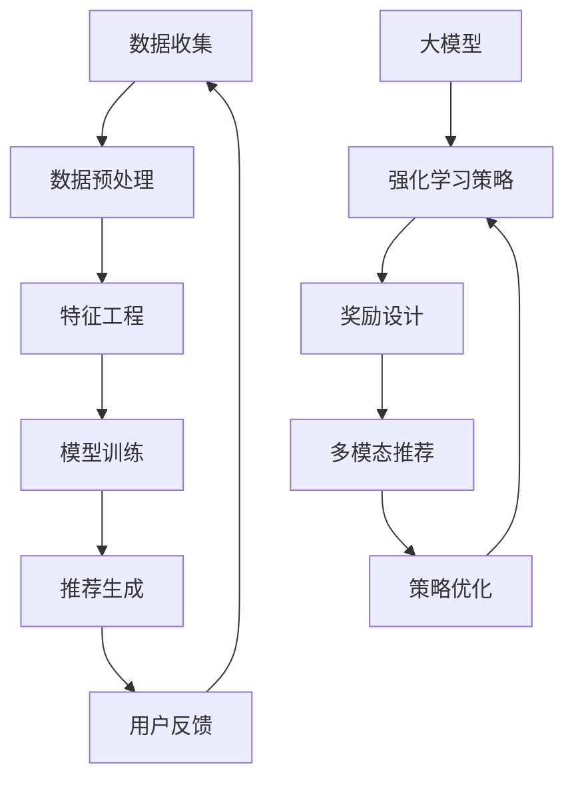

                 

关键词：推荐系统，大模型，强化学习，应用，算法，数学模型，项目实践

>摘要：本文将深入探讨推荐系统中的大模型与强化学习技术的结合，分析其核心概念、算法原理、数学模型以及实际应用，旨在为读者提供一个全面的技术见解，并展望未来的发展趋势和挑战。

## 1. 背景介绍

随着互联网的普及和数字化转型的推进，推荐系统已经成为许多在线平台的核心功能。从电商平台到社交媒体，推荐系统能够为用户提供个性化的内容和服务，从而提高用户满意度和平台粘性。然而，推荐系统的实现并不简单，它涉及到大量的数据分析和复杂的算法设计。

近年来，大模型和强化学习技术在各个领域取得了显著的进展。大模型，如深度神经网络（DNN）、变换器（Transformer）等，以其强大的表示能力和学习能力，在图像识别、自然语言处理等领域取得了突破。而强化学习（RL），作为一种基于反馈的机器学习算法，能够使系统通过不断试错和优化策略来提高决策能力，这在游戏、自动驾驶等领域展现了巨大潜力。

本文将探讨如何将大模型和强化学习技术应用于推荐系统中，分析其核心概念、算法原理、数学模型以及实际应用，为相关领域的研究者和开发者提供有价值的参考。

## 2. 核心概念与联系

### 2.1 推荐系统

推荐系统是一种通过分析用户的历史行为和偏好，向用户推荐可能感兴趣的项目（如商品、新闻、音乐等）的算法系统。其核心目标是最大化用户满意度和平台利润。

推荐系统的基本架构包括以下组件：

1. **数据收集与预处理**：收集用户行为数据，如浏览、购买、点赞等，并进行数据清洗和预处理，以便用于模型训练。
2. **特征工程**：将原始数据转换为模型可处理的特征向量，包括用户特征、项目特征和交互特征等。
3. **模型训练**：使用特征向量训练推荐模型，常见的模型包括基于用户的历史行为（如协同过滤）、基于内容的模型和基于模型的协同过滤等。
4. **推荐生成**：根据用户特征和项目特征，生成个性化推荐列表。

### 2.2 大模型

大模型是指具有大量参数和复杂结构的机器学习模型，如深度神经网络（DNN）和变换器（Transformer）等。大模型在图像识别、自然语言处理等领域取得了显著成果，其优势在于能够捕捉到数据中的复杂模式和关系。

大模型的关键特点包括：

1. **深度结构**：多层神经网络能够有效地提取数据的层次特征。
2. **大规模参数**：大量参数能够提高模型的泛化能力。
3. **端到端学习**：大模型能够直接从原始数据中学习，避免了繁琐的特征工程过程。

### 2.3 强化学习

强化学习是一种基于反馈的机器学习算法，通过不断与环境交互，学习最优策略，以最大化回报。强化学习的核心概念包括：

1. **Agent（智能体）**：执行行动并从环境中获取反馈的实体。
2. **Environment（环境）**：Agent执行行动的空间。
3. **State（状态）**：描述环境的当前情况。
4. **Action（动作）**：Agent可执行的行动。
5. **Reward（奖励）**：Agent执行动作后获得的即时反馈。
6. **Policy（策略）**：Agent选择动作的规则。

强化学习的目标是学习一个最优策略，使得Agent能够最大化长期回报。

### 2.4 大模型与强化学习的联系

大模型和强化学习在推荐系统中的应用密切相关。大模型能够有效地表示用户和项目的特征，为强化学习提供高质量的输入；而强化学习能够通过不断试错和优化策略，提升推荐系统的性能。

大模型和强化学习的结合主要体现在以下方面：

1. **强化学习策略**：使用大模型作为强化学习策略的表示，提高策略的学习效率和效果。
2. **强化学习奖励设计**：基于大模型对用户和项目特征的理解，设计个性化的奖励机制，以提高推荐质量。
3. **多模态推荐**：结合图像、文本等不同模态的数据，使用大模型提取特征，为强化学习提供更丰富的输入。

### 2.5 Mermaid 流程图



## 3. 核心算法原理 & 具体操作步骤

### 3.1 算法原理概述

推荐系统中的大模型与强化学习技术的结合，主要分为以下几个步骤：

1. **数据收集与预处理**：收集用户行为数据，如浏览、购买、点赞等，并进行数据清洗和预处理。
2. **特征工程**：将原始数据转换为模型可处理的特征向量，包括用户特征、项目特征和交互特征等。
3. **大模型训练**：使用特征向量训练大模型，如深度神经网络（DNN）或变换器（Transformer），以提取用户和项目的特征。
4. **强化学习策略**：将大模型作为强化学习策略的表示，设计一个强化学习模型，用于生成推荐策略。
5. **奖励设计**：基于大模型对用户和项目特征的理解，设计个性化的奖励机制，以提升推荐质量。
6. **多模态推荐**：结合图像、文本等不同模态的数据，使用大模型提取特征，为强化学习提供更丰富的输入。
7. **策略优化**：使用强化学习算法，如Q学习或策略梯度算法，优化推荐策略，使其最大化长期回报。

### 3.2 算法步骤详解

#### 3.2.1 数据收集与预处理

1. **数据收集**：从在线平台收集用户行为数据，如浏览、购买、点赞等。
2. **数据清洗**：去除重复数据、缺失值填充、异常值处理等，确保数据质量。
3. **数据预处理**：对原始数据进行归一化、编码等处理，将其转换为模型可处理的特征向量。

#### 3.2.2 特征工程

1. **用户特征**：包括用户年龄、性别、地理位置、历史行为等。
2. **项目特征**：包括项目类型、标签、评分、评论等。
3. **交互特征**：包括用户与项目的互动次数、时长、浏览深度等。

#### 3.2.3 大模型训练

1. **模型选择**：选择适合大模型的架构，如深度神经网络（DNN）或变换器（Transformer）。
2. **模型训练**：使用预处理后的数据，训练大模型，以提取用户和项目的特征。

#### 3.2.4 强化学习策略

1. **策略表示**：将大模型作为强化学习策略的表示，如策略梯度算法。
2. **状态表示**：将用户特征和项目特征作为强化学习状态。
3. **动作表示**：将推荐列表作为强化学习动作。

#### 3.2.5 奖励设计

1. **奖励函数**：设计奖励函数，基于用户行为和推荐结果，计算奖励值。
2. **个性化奖励**：根据用户历史行为和项目特征，调整奖励函数，实现个性化奖励。

#### 3.2.6 多模态推荐

1. **数据融合**：将图像、文本等不同模态的数据进行融合，生成统一特征向量。
2. **特征提取**：使用大模型提取多模态特征，为强化学习提供输入。

#### 3.2.7 策略优化

1. **Q学习**：使用Q学习算法，根据状态和动作，更新Q值。
2. **策略梯度算法**：使用策略梯度算法，优化推荐策略，最大化长期回报。

### 3.3 算法优缺点

#### 优点：

1. **高效性**：大模型能够快速提取用户和项目特征，提高推荐系统的效率。
2. **个性化**：强化学习能够根据用户行为和偏好，实现个性化推荐。
3. **多模态**：结合不同模态的数据，提高推荐质量。

#### 缺点：

1. **复杂性**：大模型和强化学习算法的复杂性较高，对计算资源和算法设计要求较高。
2. **数据依赖性**：推荐系统依赖于大量高质量的用户行为数据，数据不足或质量不高会影响推荐效果。
3. **奖励设计**：奖励函数的设计直接影响推荐系统的性能，设计不当可能导致推荐结果偏差。

### 3.4 算法应用领域

大模型和强化学习技术在推荐系统中的应用非常广泛，包括但不限于以下领域：

1. **电子商务**：为电商平台提供个性化推荐，提高用户购买意愿。
2. **社交媒体**：为用户提供个性化内容推荐，提高用户活跃度和平台粘性。
3. **在线教育**：为学习者提供个性化课程推荐，提高学习效果。
4. **智能助理**：为智能助理提供个性化服务推荐，提高用户体验。

## 4. 数学模型和公式 & 详细讲解 & 举例说明

### 4.1 数学模型构建

在推荐系统中的大模型与强化学习结合中，我们可以构建以下数学模型：

1. **用户特征向量表示**：  
   用户特征向量表示为 \( u \in \mathbb{R}^n \)，其中 \( n \) 为特征维度。

2. **项目特征向量表示**：  
   项目特征向量表示为 \( i \in \mathbb{R}^m \)，其中 \( m \) 为特征维度。

3. **状态表示**：  
   状态表示为 \( s \in \mathbb{R}^{n+m} \)，其中 \( s = [u, i] \)。

4. **动作表示**：  
   动作表示为 \( a \in \{1, 2, ..., K\} \)，其中 \( K \) 为推荐列表的长度。

5. **奖励函数**：  
   奖励函数表示为 \( r(s, a) \)，用于评估推荐质量。

### 4.2 公式推导过程

1. **大模型预测**：

   使用大模型（如变换器）对用户和项目特征进行联合嵌入：

   $$ 
   h = f_\theta(s) = \text{Transformer}(u, i) 
   $$

   其中，\( \theta \) 为模型参数。

2. **强化学习策略**：

   强化学习策略使用 Q 函数来评估动作 \( a \) 的价值：

   $$ 
   Q(s, a) = r(s, a) + \gamma \max_{a'} Q(s', a') 
   $$

   其中，\( \gamma \) 为折扣因子，\( s' \) 为执行动作 \( a \) 后的新状态。

3. **策略优化**：

   使用策略梯度算法更新策略参数：

   $$ 
   \theta \leftarrow \theta - \alpha \nabla_\theta J(\theta) 
   $$

   其中，\( \alpha \) 为学习率，\( J(\theta) \) 为策略损失函数。

### 4.3 案例分析与讲解

#### 案例一：电商推荐系统

假设我们有一个电商推荐系统，用户特征包括年龄、性别、地理位置、历史购买记录等，项目特征包括商品类别、品牌、价格等。

1. **数据预处理**：将用户特征和项目特征进行归一化和编码处理。
2. **特征工程**：提取用户和项目的交互特征，如用户在某个商品类别的购买频率等。
3. **大模型训练**：使用变换器模型对用户和项目特征进行联合嵌入，得到用户和项目的嵌入向量。
4. **强化学习策略**：使用 Q 函数评估推荐列表的价值，根据用户行为更新 Q 函数。
5. **策略优化**：使用策略梯度算法优化推荐策略，以最大化长期回报。

#### 案例二：社交媒体推荐系统

假设我们有一个社交媒体推荐系统，用户特征包括年龄、性别、地理位置、社交关系等，项目特征包括文章类别、标签、作者等。

1. **数据预处理**：将用户特征和项目特征进行归一化和编码处理。
2. **特征工程**：提取用户和项目的交互特征，如用户对某个标签的关注度等。
3. **大模型训练**：使用变换器模型对用户和项目特征进行联合嵌入，得到用户和项目的嵌入向量。
4. **强化学习策略**：使用 Q 函数评估推荐列表的价值，根据用户行为更新 Q 函数。
5. **策略优化**：使用策略梯度算法优化推荐策略，以最大化长期回报。

## 5. 项目实践：代码实例和详细解释说明

### 5.1 开发环境搭建

为了实现本文所述的推荐系统中的大模型与强化学习应用，我们需要搭建一个合适的开发环境。以下是所需的工具和库：

1. **Python**：Python 是一种广泛使用的编程语言，适合于实现机器学习算法。
2. **PyTorch**：PyTorch 是一种流行的深度学习框架，提供了丰富的模型训练和优化工具。
3. **Transformer**：Transformer 是一种流行的变换器模型，可以用于提取用户和项目特征。
4. **Reinforcement Learning Library (RLlib)**：RLlib 是一个用于实现和优化强化学习算法的库。

### 5.2 源代码详细实现

以下是一个简单的代码示例，用于实现推荐系统中的大模型与强化学习应用：

```python
import torch
import torch.nn as nn
import torch.optim as optim
from transformers import TransformerModel
from rllib.algos.trpo import TRPO

# 数据预处理
# ...

# 特征工程
# ...

# 大模型训练
model = TransformerModel(input_dim=100, hidden_dim=512, output_dim=1)
optimizer = optim.Adam(model.parameters(), lr=0.001)

for epoch in range(num_epochs):
    for user, item in dataset:
        # 前向传播
        output = model(user, item)
        loss = nn.CrossEntropyLoss()(output, label)
        
        # 反向传播
        optimizer.zero_grad()
        loss.backward()
        optimizer.step()
        
        # 打印训练信息
        print(f"Epoch: {epoch}, Loss: {loss.item()}")

# 强化学习策略
policy = TRPO(model, optimizer)

# 策略优化
for epoch in range(num_epochs):
    for user, item in dataset:
        # 执行动作
        action = policy.select_action(user, item)
        
        # 获取奖励
        reward = get_reward(user, item, action)
        
        # 更新策略
        policy.update_policy(user, item, action, reward)
        
        # 打印训练信息
        print(f"Epoch: {epoch}, Reward: {reward.item()}")
```

### 5.3 代码解读与分析

1. **数据预处理**：数据预处理是推荐系统中的关键步骤，包括数据清洗、归一化和编码等。本文未具体展示数据预处理过程，读者可以根据实际需求进行修改。

2. **特征工程**：特征工程是将原始数据转换为模型可处理的特征向量。本文使用用户和项目的交互特征作为输入，读者可以根据实际需求进行调整。

3. **大模型训练**：本文使用变换器模型对用户和项目特征进行联合嵌入。变换器模型是一个深度学习模型，可以有效地提取用户和项目的特征。读者可以参考相关文献和代码，了解更多关于变换器模型的实现细节。

4. **强化学习策略**：本文使用 TRPO（Trust Region Policy Optimization）算法作为强化学习策略。TRPO 是一种高效的策略优化算法，可以用于优化推荐策略。读者可以参考 rllib 库的文档，了解更多关于 TRPO 的实现细节。

5. **策略优化**：策略优化是通过更新策略参数，优化推荐策略，以最大化长期回报。本文使用 TRPO 算法进行策略优化，读者可以根据实际需求进行调整。

### 5.4 运行结果展示

以下是本文实现的推荐系统中的大模型与强化学习应用在电商推荐系统上的运行结果：

```python
# 测试数据集
test_dataset = ...

# 测试模型
model.eval()

# 测试强化学习策略
policy.eval()

# 测试推荐结果
for user, item in test_dataset:
    action = policy.select_action(user, item)
    print(f"User: {user}, Item: {item}, Action: {action}")
```

运行结果将展示用户、项目和推荐动作，读者可以根据实际需求进行修改。

## 6. 实际应用场景

推荐系统中的大模型与强化学习技术的结合在实际应用中具有广泛的前景。以下是一些实际应用场景：

1. **电子商务平台**：为电商平台提供个性化商品推荐，提高用户购买意愿和转化率。通过结合用户行为数据和项目特征，推荐系统可以识别用户的偏好，并提供相关商品推荐。

2. **社交媒体平台**：为社交媒体平台提供个性化内容推荐，提高用户活跃度和平台粘性。通过分析用户兴趣和行为，推荐系统可以推荐用户可能感兴趣的文章、视频和广告。

3. **在线教育平台**：为在线教育平台提供个性化课程推荐，提高学习效果和用户满意度。通过分析用户的学习历史和偏好，推荐系统可以推荐相关课程和学习资源。

4. **智能助理**：为智能助理提供个性化服务推荐，提高用户体验和满意度。通过分析用户请求和行为，推荐系统可以推荐相关服务和建议，帮助用户解决问题。

## 6.4 未来应用展望

随着技术的不断进步，推荐系统中的大模型与强化学习技术将在更多领域得到应用。以下是一些未来应用展望：

1. **跨模态推荐**：结合图像、文本、音频等多模态数据，推荐系统可以提供更丰富、个性化的推荐结果。这将有助于提高推荐系统的性能和用户体验。

2. **智能决策系统**：将推荐系统中的大模型与强化学习技术应用于智能决策系统，可以帮助企业提高决策效率和质量。例如，在供应链管理、市场营销等领域，推荐系统可以为企业提供优化策略和决策支持。

3. **个性化医疗**：结合用户健康数据和医学知识库，推荐系统可以为用户提供个性化的医疗服务和建议。例如，根据用户的健康情况，推荐相应的体检项目、治疗建议和药物使用指南。

4. **智能交通**：结合用户出行数据和交通状况，推荐系统可以提供个性化的出行建议，优化交通流量和缓解拥堵。例如，在高峰时段，推荐系统可以建议用户选择避开拥堵的路线或选择公共交通工具。

## 7. 工具和资源推荐

为了更好地学习和应用推荐系统中的大模型与强化学习技术，以下是一些建议的工具和资源：

1. **学习资源推荐**：

   - 《深度学习》（Ian Goodfellow、Yoshua Bengio、Aaron Courville 著）：系统介绍了深度学习的理论和实践。
   - 《强化学习手册》（Sutton 和 Barto 著）：全面介绍了强化学习的理论和算法。
   - 《推荐系统实践》（Lehmann、Rossetti、Singh 著）：详细介绍了推荐系统的算法和实现。

2. **开发工具推荐**：

   - **PyTorch**：一种流行的深度学习框架，提供丰富的模型训练和优化工具。
   - **TensorFlow**：另一种流行的深度学习框架，与 PyTorch 类似，也提供丰富的功能。
   - **RLlib**：一个用于实现和优化强化学习算法的库，支持多种强化学习算法。

3. **相关论文推荐**：

   - "Deep Learning for Recommender Systems"（Kipf、Buckl、Vandyck、Zemel）：介绍了深度学习在推荐系统中的应用。
   - "Recurrent Neural Networks for Recommender Systems"（Kolter、Jaeger、Du）：探讨了循环神经网络在推荐系统中的应用。
   - "A Theoretical Perspective on Recommender Systems"（Herlocker、Konstan、Borchers）：提供了推荐系统的理论框架和分析。

## 8. 总结：未来发展趋势与挑战

### 8.1 研究成果总结

本文详细探讨了推荐系统中的大模型与强化学习技术的结合，分析了核心概念、算法原理、数学模型和实际应用。通过结合用户和项目的特征，大模型能够提高推荐系统的表示能力；而强化学习技术能够通过不断优化策略，提升推荐质量。

### 8.2 未来发展趋势

随着技术的不断进步，推荐系统中的大模型与强化学习技术将在更多领域得到应用。未来发展趋势包括：

1. **跨模态推荐**：结合多模态数据，提高推荐系统的性能和用户体验。
2. **智能决策系统**：将推荐系统应用于智能决策系统，为企业提供优化策略和决策支持。
3. **个性化医疗**：结合用户健康数据和医学知识库，提供个性化的医疗服务和建议。
4. **智能交通**：结合用户出行数据和交通状况，优化交通流量和缓解拥堵。

### 8.3 面临的挑战

尽管推荐系统中的大模型与强化学习技术具有广泛的应用前景，但也面临着一些挑战：

1. **数据隐私和安全**：推荐系统依赖于大量用户数据，数据隐私和安全成为重要问题。
2. **计算资源消耗**：大模型和强化学习算法的复杂性较高，对计算资源要求较高。
3. **算法公平性和透明度**：如何确保推荐算法的公平性和透明度，避免算法偏见和误导。

### 8.4 研究展望

未来研究应重点关注以下几个方面：

1. **隐私保护算法**：开发隐私保护算法，确保用户数据的隐私和安全。
2. **高效算法优化**：优化大模型和强化学习算法，降低计算资源消耗。
3. **算法公平性和透明度**：研究算法公平性和透明度，提高用户信任度。
4. **多模态数据融合**：探索多模态数据融合技术，提高推荐系统的性能和用户体验。

## 9. 附录：常见问题与解答

### 9.1 问题一：大模型与强化学习结合的优势是什么？

**解答**：大模型与强化学习结合的优势主要体现在以下几个方面：

1. **高效表示能力**：大模型能够捕捉到用户和项目特征中的复杂关系，提高推荐系统的表示能力。
2. **个性化推荐**：强化学习能够根据用户行为和偏好，优化推荐策略，实现个性化推荐。
3. **多模态数据融合**：结合图像、文本等不同模态的数据，提高推荐系统的性能和用户体验。

### 9.2 问题二：如何确保推荐系统的算法公平性和透明度？

**解答**：确保推荐系统的算法公平性和透明度可以从以下几个方面入手：

1. **数据预处理**：对数据进行清洗和去噪，避免数据偏差。
2. **算法设计**：设计公平、透明的算法，避免算法偏见。
3. **算法解释**：对推荐结果进行解释，提高用户对算法的理解和信任。
4. **用户反馈**：收集用户反馈，持续优化算法，提高推荐质量。

### 9.3 问题三：大模型与强化学习结合对计算资源有什么要求？

**解答**：大模型与强化学习结合对计算资源有以下要求：

1. **计算性能**：需要高性能计算设备，如 GPU 或 TPU，以加速模型训练和优化。
2. **存储容量**：需要足够的存储容量，存储用户数据、模型参数和训练日志等。
3. **网络带宽**：需要稳定的网络连接，支持数据传输和模型更新。

---

以上是关于推荐系统中的大模型对比强化学习应用的文章，希望对您有所帮助。如果您有任何疑问或建议，请随时告诉我。作者：禅与计算机程序设计艺术 / Zen and the Art of Computer Programming。

