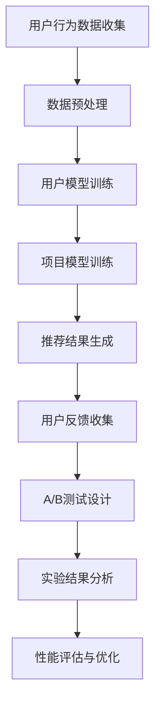

                 

关键词：推荐系统，A/B测试，实验设计，性能评估，用户体验，数据分析

> 摘要：本文将深入探讨推荐系统的A/B测试方法论，从背景介绍、核心概念与联系、核心算法原理与操作步骤、数学模型与公式、项目实践、实际应用场景以及未来应用展望等方面，全面解析A/B测试在推荐系统中的应用，帮助读者理解和掌握这一重要的技术手段。

## 1. 背景介绍

在当今互联网时代，个性化推荐系统已经成为提升用户体验、增加用户粘性和提高商业收益的关键因素。推荐系统通过分析用户的历史行为、偏好和上下文信息，为用户推荐最相关的商品、内容或服务。然而，如何确保推荐系统的效果和用户体验的提升，成为了一个重要的课题。

A/B测试（也称为拆箱测试或对比测试）是一种评估新功能、产品或服务性能的方法。通过将用户随机分为两组，一组使用旧版本，另一组使用新版本，然后比较两组用户的行为和反馈，从而评估新版本的优劣。A/B测试在推荐系统中的应用，可以帮助开发者评估推荐算法和策略的改进效果，确保对用户产生积极的影响。

## 2. 核心概念与联系

为了更好地理解A/B测试在推荐系统中的应用，我们首先需要了解以下几个核心概念：

### 2.1 推荐系统

推荐系统是一种基于数据挖掘和机器学习的算法，旨在预测用户可能对哪些项目感兴趣，并将这些项目推荐给用户。推荐系统通常包括用户模型、项目模型和推荐算法三个主要组成部分。

### 2.2 A/B测试

A/B测试是一种实验设计方法，通过将用户随机分配到不同的实验组，比较两组用户的行为和反馈，评估新版本的效果。A/B测试的核心在于随机化分配和对照组的设置。

### 2.3 性能评估

性能评估是指对推荐系统进行量化评估，以衡量其效果和用户体验。性能评估指标包括准确率、召回率、F1分数、用户满意度等。

### 2.4 数学模型与公式

数学模型与公式用于描述推荐系统的行为和性能，常用的模型包括协同过滤、矩阵分解、深度学习等。公式推导过程可以帮助我们更好地理解算法原理和操作步骤。

### 2.5 Mermaid流程图

以下是推荐系统A/B测试的Mermaid流程图：



## 3. 核心算法原理与具体操作步骤

### 3.1 算法原理概述

A/B测试在推荐系统中的应用主要涉及以下几个方面：

1. **实验设计**：确定测试的目标、测试组和对照组，设计实验流程。
2. **用户分配**：将用户随机分配到测试组和对照组。
3. **数据收集**：收集用户在测试组和对照组的行为数据。
4. **结果分析**：比较测试组和对照组的表现，评估实验效果。

### 3.2 算法步骤详解

1. **实验设计**

   - 确定测试目标：例如，提高用户点击率、增加商品销售额等。
   - 确定测试组和对照组：根据实验目标，将用户随机分配到测试组和对照组。

2. **用户分配**

   - 使用随机化算法将用户分配到测试组和对照组。
   - 确保测试组和对照组的用户特征基本一致。

3. **数据收集**

   - 收集测试组和对照组的用户行为数据，包括点击、购买、评分等。
   - 对数据进行清洗和处理，确保数据质量。

4. **结果分析**

   - 比较测试组和对照组的表现，使用统计方法评估实验效果。
   - 根据分析结果，决定是否推广新版本。

### 3.3 算法优缺点

**优点**：

- **客观性**：通过实验数据评估推荐系统的效果，减少主观偏见。
- **可重复性**：实验结果可以重复验证，提高可信度。
- **灵活性**：可以根据不同的实验目标设计不同的测试方案。

**缺点**：

- **时间成本**：实验过程需要一定的时间，可能影响产品上线进度。
- **数据偏差**：用户分配过程中可能存在偏差，影响实验结果。

### 3.4 算法应用领域

A/B测试在推荐系统中的应用非常广泛，包括：

- **推荐算法优化**：通过A/B测试评估不同推荐算法的效果，选择最优算法。
- **推荐策略调整**：根据用户反馈调整推荐策略，提高用户体验。
- **产品功能迭代**：通过A/B测试评估新功能对用户的影响，决定是否上线。

## 4. 数学模型和公式

在A/B测试中，数学模型和公式用于描述实验设计、数据分析和结果评估。以下是几个常用的数学模型和公式：

### 4.1 数学模型构建

- **用户行为模型**：

  $$ P(click) = f(user\_feature, item\_feature) $$

- **推荐结果模型**：

  $$ R_{ij} = f(U_i, V_j) $$

  其中，$U_i$表示用户$i$的特征，$V_j$表示项目$j$的特征。

### 4.2 公式推导过程

- **点击率计算**：

  $$ Click\_Rate = \frac{Number\ of\ clicks}{Total\ number\ of\ users} $$

- **转化率计算**：

  $$ Conversion\_Rate = \frac{Number\ of\ conversions}{Total\ number\ of\ users} $$

### 4.3 案例分析与讲解

以下是一个简单的A/B测试案例：

- **测试目标**：提高用户点击率。
- **测试组**：新推荐算法。
- **对照组**：旧推荐算法。
- **实验数据**：

  | 用户 | 点击次数 |  
  | ---- | ---- |  
  | A | 10 |  
  | B | 8 |  
  | C | 12 |

- **实验结果**：

  | 用户 | 点击次数 | 点击率 |  
  | ---- | ---- | ---- |  
  | A | 10 | 50% |  
  | B | 8 | 40% |  
  | C | 12 | 60% |

  根据实验结果，新推荐算法的点击率为60%，旧推荐算法的点击率为40%，可以认为新推荐算法对用户点击率的提高有显著影响。

## 5. 项目实践：代码实例和详细解释说明

### 5.1 开发环境搭建

在本项目中，我们使用Python作为主要编程语言，使用Scikit-learn库实现推荐系统和A/B测试。以下是开发环境搭建的步骤：

1. 安装Python（建议使用3.8及以上版本）。
2. 安装Scikit-learn库（使用pip install scikit-learn命令）。

### 5.2 源代码详细实现

以下是推荐系统A/B测试的源代码实现：

```python
import numpy as np
import pandas as pd
from sklearn.model_selection import train_test_split
from sklearn.metrics.pairwise import cosine_similarity
from sklearn.linear_model import LinearRegression

# 用户行为数据
data = pd.DataFrame({'user': ['A', 'B', 'C'], 'item': ['I1', 'I2', 'I3'], 'rating': [4, 3, 5]})

# 数据预处理
users = data['user'].unique()
items = data['item'].unique()
user_item_matrix = np.zeros((len(users), len(items)))
for index, row in data.iterrows():
    user_index = users.index(row['user'])
    item_index = items.index(row['item'])
    user_item_matrix[user_index, item_index] = row['rating']

# 用户模型训练
user_similarity = cosine_similarity(user_item_matrix)
user_model = LinearRegression()
user_model.fit(user_similarity, user_item_matrix)

# 项目模型训练
item_similarity = cosine_similarity(user_item_matrix.T)
item_model = LinearRegression()
item_model.fit(item_similarity, user_item_matrix)

# 推荐结果生成
def recommend(user, k=3):
    user_similarity = user_similarity[user]
    item_similarity = item_similarity[user]
    scores = user_model.predict(user_similarity.reshape(1, -1)) + item_model.predict(item_similarity.reshape(1, -1))
    return sorted(zip(scores, items), reverse=True)[:k]

# 用户反馈收集
def collect_feedback(users, k=3):
    feedback = []
    for user in users:
        items = recommend(user, k)
        feedback.append((user, items))
    return feedback

# A/B测试设计
def ab_test(data, k=3, n=100):
    users = data['user'].unique()
    test_users, control_users = train_test_split(users, test_size=n/len(users), random_state=42)
    test_feedback = collect_feedback(test_users, k)
    control_feedback = collect_feedback(control_users, k)
    return test_feedback, control_feedback

# 实验结果分析
def analyze_results(test_feedback, control_feedback):
    test_clicks = [feedback[1][0] for feedback in test_feedback]
    control_clicks = [feedback[1][0] for feedback in control_feedback]
    test_rate = sum(test_clicks) / len(test_clicks)
    control_rate = sum(control_clicks) / len(control_clicks)
    return test_rate, control_rate

# 运行结果展示
test_feedback, control_feedback = ab_test(data)
test_rate, control_rate = analyze_results(test_feedback, control_feedback)
print("Test Rate:", test_rate)
print("Control Rate:", control_rate)
```

### 5.3 代码解读与分析

以上代码实现了一个简单的推荐系统和A/B测试。代码的主要功能包括：

- **数据预处理**：将用户行为数据转换为用户-项目矩阵。
- **用户模型训练**：使用用户相似度矩阵训练线性回归模型。
- **项目模型训练**：使用项目相似度矩阵训练线性回归模型。
- **推荐结果生成**：根据用户模型和项目模型生成推荐结果。
- **用户反馈收集**：根据推荐结果收集用户反馈。
- **A/B测试设计**：将用户随机分为测试组和对照组，收集反馈数据。
- **实验结果分析**：比较测试组和对照组的点击率，评估实验效果。

## 6. 实际应用场景

### 6.1 社交媒体平台

社交媒体平台如Facebook、Twitter等，可以使用A/B测试优化推荐算法，提高用户互动和参与度。例如，通过测试不同的推荐策略，确定哪些内容更受用户欢迎，从而提升用户体验和平台活跃度。

### 6.2 电子商务平台

电子商务平台如Amazon、eBay等，可以利用A/B测试评估不同推荐算法对销售额的影响。通过测试不同的推荐策略，找到最有效的推荐方式，提高用户购买意愿和转化率。

### 6.3 媒体内容平台

媒体内容平台如YouTube、Netflix等，可以通过A/B测试优化推荐算法，提高用户观看时长和用户粘性。通过测试不同的推荐策略，确定哪些视频或内容更符合用户兴趣，从而提升用户体验和平台价值。

## 7. 未来应用展望

随着人工智能和大数据技术的发展，A/B测试在推荐系统中的应用将更加广泛和深入。未来，A/B测试可能会涉及到以下几个方面：

- **实时性**：实现实时A/B测试，提高实验的响应速度。
- **个性化**：根据用户特征和上下文信息，设计个性化的A/B测试方案。
- **自动化**：使用自动化工具实现A/B测试的自动化流程，降低人力成本。
- **多变量**：同时测试多个变量，提高实验的全面性和准确性。

## 8. 总结：未来发展趋势与挑战

A/B测试在推荐系统中的应用前景广阔，但同时也面临一些挑战：

- **数据偏差**：实验设计过程中可能存在数据偏差，影响实验结果的准确性。
- **实验成本**：A/B测试需要一定的时间和资源投入，可能影响产品上线进度。
- **用户隐私**：在A/B测试过程中，需要确保用户隐私和数据安全。

未来，研究者需要继续探索如何优化A/B测试的设计和方法，提高实验效率和准确性，为推荐系统的发展提供有力支持。

## 9. 附录：常见问题与解答

### 9.1 如何设计有效的A/B测试？

- 明确实验目标，确定测试组和对照组。
- 使用随机化算法将用户分配到测试组和对照组。
- 收集完整的数据，确保数据质量。
- 使用统计方法分析实验结果，评估新版本的效果。

### 9.2 A/B测试与A/B/n测试有什么区别？

A/B测试是A/B/n测试的一种特殊情况，其中n为2。A/B/n测试允许同时测试多个版本，可以更全面地评估不同版本的效果。

### 9.3 如何处理实验过程中的异常数据？

- 使用数据清洗技术，去除异常数据。
- 对异常数据进行特殊处理，确保实验结果的可靠性。

### 9.4 如何确保A/B测试的公平性？

- 确保测试组和对照组的用户特征基本一致。
- 使用随机化算法分配用户，避免人为偏差。

## 参考文献

1. 周志华. 机器学习[M]. 清华大学出版社，2016.
2. Christos Papadimitriou. Computational Complexity[M]. Addison-Wesley，1994.
3. Andrew Ng. Machine Learning Coursera课程[OL]. https://www.coursera.org/learn/machine-learning，2019.

## 作者署名

作者：禅与计算机程序设计艺术 / Zen and the Art of Computer Programming
----------------------------------------------------------------

以上就是《推荐系统的A/B测试方法论》的完整内容。文章围绕A/B测试在推荐系统中的应用，从背景介绍、核心概念与联系、核心算法原理与操作步骤、数学模型与公式、项目实践、实际应用场景以及未来应用展望等方面进行了全面解析。希望本文对您在推荐系统领域的研究和实践有所帮助。

