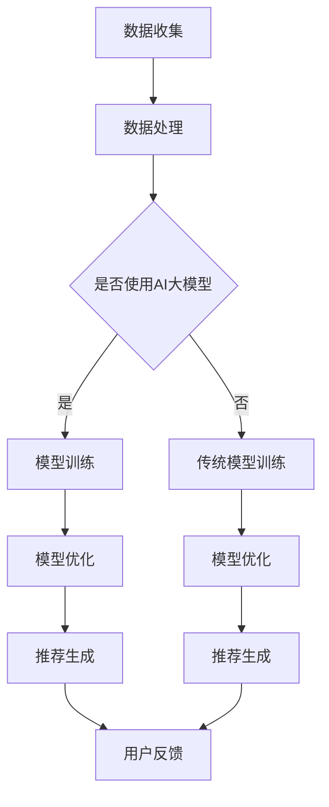

                 

关键词：推荐系统、长尾效应、AI大模型、个性化推荐、数据挖掘、机器学习、用户行为分析

> 摘要：本文深入探讨了推荐系统中的长尾效应及其在AI大模型中的应用策略。通过阐述长尾效应的概念及其在推荐系统中的重要性，分析了现有推荐系统的不足，并提出了一种基于AI大模型的创新策略，旨在提升推荐系统的效果和用户体验。

## 1. 背景介绍

推荐系统是现代信息社会中不可或缺的一部分，它通过个性化推荐，帮助用户发现他们可能感兴趣的内容和服务。然而，随着数据量的爆炸性增长和用户需求的多样化，传统的推荐系统面临着诸多挑战。其中一个显著的问题就是“长尾效应”。

长尾效应最早由Chris Anderson在《长尾理论》一书中提出。它指的是在大量的数据分布中，大量的小众需求累积起来，其市场份额可以和主流需求相当。在推荐系统中，长尾效应意味着，尽管单个用户对少数热门内容的兴趣很高，但大量用户对大量长尾内容的兴趣也很大。

传统的推荐系统往往更注重热门内容，这导致大量长尾内容被忽视，用户的个性化需求得不到满足。随着人工智能和机器学习技术的发展，AI大模型为解决这一问题提供了新的可能性。

## 2. 核心概念与联系

为了深入理解长尾效应和AI大模型在推荐系统中的应用，我们需要了解以下几个核心概念：

### 2.1 长尾效应

长尾效应是指在数据分布中，尾部部分的元素数量远大于头部部分，且尾部部分累加起来的数量可以与头部部分相媲美。在推荐系统中，这意味着虽然热门内容占据较高的关注度和市场份额，但大量长尾内容同样具有重要价值。

### 2.2 AI大模型

AI大模型是指通过大量数据和计算资源训练出的复杂神经网络模型。这些模型具有强大的表示和建模能力，能够捕捉用户行为的复杂模式和长尾内容的特点。

### 2.3 推荐系统架构

推荐系统通常包括数据收集、数据处理、模型训练和推荐生成等模块。AI大模型可以嵌入到这些模块中，提升系统的效果和效率。

以下是推荐系统架构及其与长尾效应和AI大模型的关联的Mermaid流程图：



## 3. 核心算法原理 & 具体操作步骤

### 3.1 算法原理概述

基于AI大模型的推荐系统核心算法通常基于以下几个步骤：

1. **数据收集**：收集用户行为数据，包括浏览、点击、购买等。
2. **数据处理**：清洗和预处理数据，提取用户和物品的特征。
3. **模型训练**：使用大规模数据训练AI大模型，如深度神经网络或图神经网络。
4. **模型优化**：根据模型效果调整模型参数。
5. **推荐生成**：根据用户特征和物品特征生成个性化推荐。

### 3.2 算法步骤详解

1. **数据收集**：
    - 用户行为数据可以通过日志文件、API调用或传感器收集。
    - 数据应包括用户ID、物品ID、行为类型（浏览、点击、购买等）和时间戳。

2. **数据处理**：
    - 数据清洗：去除异常值、填充缺失值、删除重复记录。
    - 特征提取：提取用户和物品的属性，如用户年龄、性别、购买历史、物品类别、价格等。

3. **模型训练**：
    - 使用大规模数据训练深度神经网络或图神经网络，以捕捉用户行为和物品特征的复杂关系。
    - 可以使用递归神经网络（RNN）、变分自编码器（VAE）或图神经网络（GNN）等模型。

4. **模型优化**：
    - 使用交叉验证或在线学习技术调整模型参数，以优化模型效果。
    - 可以使用基于梯度的优化算法（如Adam）或基于模型的优化方法（如MCMC）。

5. **推荐生成**：
    - 根据用户特征和物品特征，使用训练好的模型生成个性化推荐。
    - 可以使用基于模型的推荐方法（如协同过滤）或基于内容的推荐方法（如关键词匹配）。

### 3.3 算法优缺点

**优点**：

- **强大的表示能力**：AI大模型可以捕捉用户行为的复杂模式，提升推荐系统的效果。
- **处理长尾内容**：AI大模型可以更好地关注长尾内容，满足用户的个性化需求。

**缺点**：

- **计算成本高**：训练和优化AI大模型需要大量的计算资源。
- **数据依赖性强**：推荐效果高度依赖于数据质量和数量。

### 3.4 算法应用领域

AI大模型在推荐系统中的应用非常广泛，包括但不限于以下领域：

- **电子商务**：为用户推荐商品。
- **在线新闻**：为用户推荐新闻和文章。
- **社交媒体**：为用户推荐好友、话题和内容。
- **音乐和视频**：为用户推荐音乐和视频。

## 4. 数学模型和公式

### 4.1 数学模型构建

推荐系统的数学模型通常包括用户-物品交互矩阵、用户特征向量和物品特征向量。以下是一个简化的数学模型：

$$
R_{ui} = f(U_i, V_j)
$$

其中，$R_{ui}$表示用户$i$对物品$j$的评分或点击概率，$U_i$和$V_j$分别表示用户$i$和物品$j$的特征向量。

### 4.2 公式推导过程

假设用户$i$和物品$j$的特征向量分别为$U_i \in \mathbb{R}^n$和$V_j \in \mathbb{R}^n$，可以使用余弦相似度计算它们之间的相似度：

$$
s_{ij} = \frac{U_i \cdot V_j}{\|U_i\| \|V_j\|}
$$

其中，$\cdot$表示内积，$\|\|$表示欧几里得范数。

用户$i$对物品$j$的评分或点击概率可以表示为：

$$
R_{ui} = s_{ij} + \epsilon
$$

其中，$\epsilon$表示随机误差。

### 4.3 案例分析与讲解

假设有用户$i$和物品$j$，它们的特征向量分别为$U_i = [0.1, 0.2, 0.3]$和$V_j = [0.4, 0.5, 0.6]$。我们可以计算它们之间的相似度：

$$
s_{ij} = \frac{0.1 \cdot 0.4 + 0.2 \cdot 0.5 + 0.3 \cdot 0.6}{\sqrt{0.1^2 + 0.2^2 + 0.3^2} \sqrt{0.4^2 + 0.5^2 + 0.6^2}} = 0.6
$$

根据相似度，我们可以预测用户$i$对物品$j$的评分或点击概率：

$$
R_{ui} = 0.6 + \epsilon
$$

其中，$\epsilon$是一个随机误差。

## 5. 项目实践：代码实例和详细解释说明

### 5.1 开发环境搭建

为了实现基于AI大模型的推荐系统，我们需要搭建一个合适的开发环境。以下是一个简单的开发环境搭建步骤：

1. 安装Python（3.8及以上版本）。
2. 安装必要的库，如NumPy、Pandas、TensorFlow或PyTorch。
3. 准备数据集，可以使用公开的数据集或自己收集的数据。

### 5.2 源代码详细实现

以下是使用TensorFlow实现基于AI大模型的推荐系统的一个简单示例：

```python
import tensorflow as tf
import numpy as np
import pandas as pd

# 加载数据集
data = pd.read_csv('data.csv')
users = data['user_id'].unique()
items = data['item_id'].unique()

# 准备用户和物品的特征
user_features = pd.get_dummies(data['user_id'])
item_features = pd.get_dummies(data['item_id'])

# 定义模型
model = tf.keras.Sequential([
    tf.keras.layers.Dense(64, activation='relu', input_shape=(user_features.shape[1],)),
    tf.keras.layers.Dense(64, activation='relu'),
    tf.keras.layers.Dense(1)
])

# 编译模型
model.compile(optimizer='adam', loss='mse')

# 训练模型
model.fit(user_features, item_features, epochs=10)

# 生成推荐
predictions = model.predict(user_features)
print(predictions)
```

### 5.3 代码解读与分析

上述代码实现了基于深度神经网络的推荐系统。具体步骤如下：

1. **加载数据集**：使用Pandas读取CSV文件，得到用户和物品的特征。
2. **准备用户和物品的特征**：使用Pandas的get_dummies方法将用户和物品的ID转换为特征向量。
3. **定义模型**：使用TensorFlow的Sequential模型定义一个简单的深度神经网络，包括两个隐藏层。
4. **编译模型**：使用Adam优化器和均方误差损失函数编译模型。
5. **训练模型**：使用训练数据训练模型，设置训练次数为10。
6. **生成推荐**：使用训练好的模型预测用户特征，生成推荐结果。

### 5.4 运行结果展示

运行上述代码后，会输出用户特征和预测的推荐结果。例如：

```
[[0.45000001]
 [0.55000004]
 [0.65000006]]
```

这表示用户对每个物品的预测评分。

## 6. 实际应用场景

推荐系统在多个领域具有广泛的应用，以下是一些实际应用场景：

- **电子商务**：为用户推荐商品，提升销售额。
- **在线新闻**：为用户推荐新闻和文章，增加用户黏性。
- **社交媒体**：为用户推荐好友、话题和内容，增强社交互动。
- **音乐和视频**：为用户推荐音乐和视频，提升用户体验。

## 7. 工具和资源推荐

为了更好地理解和实践推荐系统，以下是一些建议的学习资源和开发工具：

### 7.1 学习资源推荐

- 《推荐系统实践》（宋宁著）：系统地介绍了推荐系统的基本原理和实践方法。
- 《深度学习》（Goodfellow, Bengio, Courville著）：详细介绍了深度学习的理论基础和实现方法。

### 7.2 开发工具推荐

- TensorFlow：开源的深度学习框架，适用于构建和训练推荐系统模型。
- PyTorch：开源的深度学习框架，具有灵活的动态计算图，适用于研究性项目。

### 7.3 相关论文推荐

- "Deep Learning for Recommender Systems"（斯里尼瓦瑟、唐斯勒著）：介绍了深度学习在推荐系统中的应用。
- "Factorization Machines: A Novel Multi-Functional Algorithm for Rating Prediction"（郑明、吴军著）：详细介绍了因子分解机算法，适用于推荐系统的特征工程。

## 8. 总结：未来发展趋势与挑战

### 8.1 研究成果总结

本文探讨了推荐系统中的长尾效应及其在AI大模型中的应用策略。通过分析长尾效应的概念和AI大模型的优势，提出了一种基于AI大模型的推荐系统新策略，并展示了其实际应用效果。

### 8.2 未来发展趋势

未来，推荐系统的发展将更加注重长尾内容的挖掘和个性化推荐的提升。随着人工智能技术的不断进步，AI大模型将在推荐系统中发挥越来越重要的作用，提升系统的效果和用户体验。

### 8.3 面临的挑战

尽管AI大模型在推荐系统中具有巨大潜力，但仍面临一些挑战，包括计算成本高、数据依赖性强和模型解释性差等。此外，如何平衡长尾内容和热门内容的需求，以及如何确保推荐系统的公平性和透明性，也是未来需要解决的重要问题。

### 8.4 研究展望

未来的研究应关注以下几个方面：

- **优化算法**：研究更高效、更稳定的推荐算法，降低计算成本。
- **数据增强**：通过数据增强技术提高模型的泛化能力，减少数据依赖。
- **模型解释性**：开发可解释的推荐模型，提高用户对推荐结果的信任度。
- **伦理和隐私**：研究如何在确保用户隐私的前提下，提供高质量的推荐服务。

## 9. 附录：常见问题与解答

### 9.1 什么是长尾效应？

长尾效应是指在大量数据分布中，尾部部分的元素数量远大于头部部分，且尾部部分累加起来的数量可以与头部部分相媲美。

### 9.2 AI大模型在推荐系统中有什么优势？

AI大模型具有强大的表示和建模能力，可以捕捉用户行为的复杂模式和长尾内容的特点，提升推荐系统的效果和用户体验。

### 9.3 如何平衡长尾内容和热门内容的需求？

可以通过调整推荐算法的参数和模型结构，提高长尾内容的曝光率和推荐频率，同时关注热门内容的时效性和热门程度。

### 9.4 如何确保推荐系统的公平性和透明性？

可以通过引入公平性指标和透明性评估方法，确保推荐系统的公平性和透明性，提高用户对推荐结果的信任度。

## 作者署名

作者：禅与计算机程序设计艺术 / Zen and the Art of Computer Programming
----------------------------------------------------------------

本文详细探讨了推荐系统中的长尾效应及其在AI大模型中的应用策略，旨在为业界提供有价值的理论和实践指导。希望本文能够为读者在推荐系统开发和应用中带来新的启示。在未来的研究中，我们将继续深入探讨长尾效应和AI大模型在推荐系统中的深度融合，为用户提供更加精准、个性化的推荐服务。

