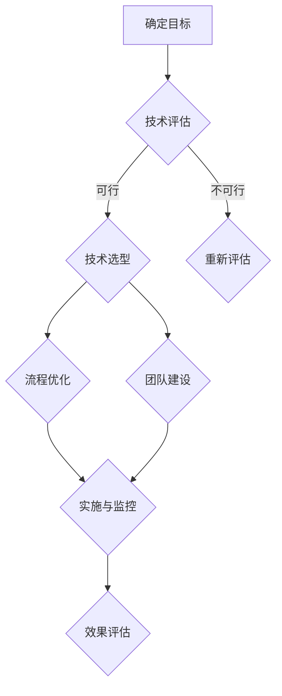
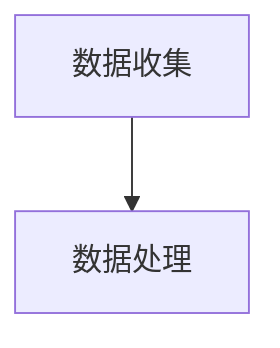
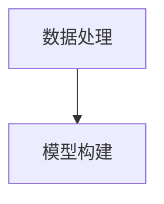
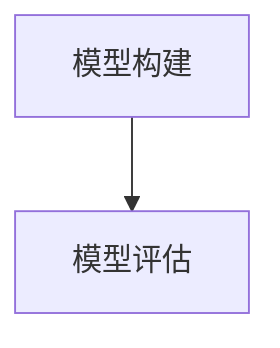
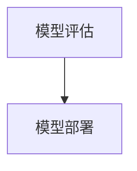
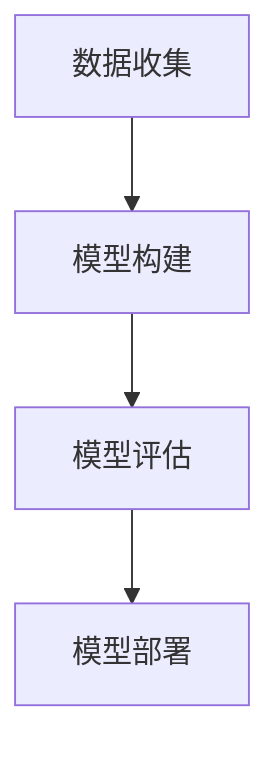

                 

关键词：核心竞争力、新质生产力、策略、技术、算法、数学模型、应用场景、工具推荐、未来展望

> 摘要：本文深入探讨了如何通过新质生产力策略提升企业在信息技术领域的核心竞争力。文章从背景介绍、核心概念、算法原理、数学模型、项目实践、实际应用场景、工具和资源推荐，以及未来发展趋势与挑战等方面进行了全面剖析，旨在为科技从业者提供理论指导和实践参考。

## 1. 背景介绍

在当今快速变化的信息技术时代，企业面临着日益激烈的竞争。传统的生产力提升策略已经不足以应对这种变化。新质生产力，作为一种创新的生产力提升方法，旨在通过技术的革新和方法的优化，实现更高效率、更高质量的生产。提升核心竞争力的新质生产力策略，成为企业在信息技术领域中谋求生存和发展的关键。

本文将从以下几个方面展开论述：

- 核心概念与联系
- 核心算法原理与具体操作步骤
- 数学模型和公式
- 项目实践：代码实例
- 实际应用场景
- 工具和资源推荐
- 未来发展趋势与挑战

## 2. 核心概念与联系

为了更好地理解新质生产力策略，我们需要明确以下几个核心概念：

1. **核心竞争力**：企业长期形成的，能为其带来竞争优势的内在能力。
2. **新质生产力**：利用新技术和方法，提升传统生产效率和质量的创新生产力。
3. **策略**：在明确目标的前提下，为实现目标而制定的方法和步骤。

新质生产力策略的核心在于通过技术的创新，构建新的生产力结构，从而提升企业的核心竞争力。这个过程涉及到多个方面的协调和配合，包括技术选型、流程优化、团队建设等。

下面是一个用 Mermaid 表示的新质生产力策略的流程图：



### 2.1. 确定目标

新质生产力策略的第一步是明确企业的发展目标。这个目标可以是提升生产效率、降低成本、提高产品品质等。明确的目标有助于指导后续的各项工作。

### 2.2. 技术评估

在确定目标后，需要对现有技术进行评估，以确定是否需要引入新技术。评估内容包括技术的成熟度、适用性、成本效益等。

### 2.3. 技术选型

根据技术评估的结果，选择最适合企业需求的新技术。技术选型需要考虑多个因素，如技术可行性、成本、市场前景等。

### 2.4. 流程优化

在技术选型完成后，需要对现有业务流程进行优化，以充分利用新技术带来的优势。流程优化可能涉及到业务流程重构、工作流程自动化等。

### 2.5. 团队建设

新质生产力策略的顺利实施离不开一个高效的团队。团队建设包括人才引进、培训、激励等。

### 2.6. 实施与监控

在实施过程中，需要持续监控项目的进展，确保各项工作的顺利进行。监控内容包括技术实施效果、项目进度、资源利用率等。

### 2.7. 效果评估

在实施完成后，需要对项目效果进行评估，以确定新质生产力策略是否达到了预期目标。效果评估可以帮助企业进一步优化策略。

## 3. 核心算法原理与具体操作步骤

在提升核心竞争力的过程中，算法起着至关重要的作用。本节将介绍一种核心算法的原理和具体操作步骤。

### 3.1. 算法原理概述

该算法基于机器学习，旨在通过分析大量数据，发现数据之间的规律，从而提升生产效率。算法的核心思想是构建一个能够自动学习和调整的模型，使其能够适应不断变化的环境。

### 3.2. 算法步骤详解

#### 3.2.1. 数据收集

首先，需要收集大量的生产数据，包括生产时间、设备状态、产品质量等。



#### 3.2.2. 数据处理

对收集到的数据进行预处理，包括数据清洗、数据标准化等。这一步的目的是确保数据质量，以便后续的分析。



#### 3.2.3. 模型构建

利用预处理后的数据，构建一个机器学习模型。模型构建包括特征选择、模型训练和参数调整等步骤。



#### 3.2.4. 模型评估

对构建的模型进行评估，以确定其性能是否达到预期。评估内容包括模型的准确性、召回率、F1 分数等。



#### 3.2.5. 模型部署

将评估通过的模型部署到生产环境中，使其能够实时分析和预测生产数据。

### 3.3. 算法优缺点

#### 3.3.1. 优点

- **高效性**：算法能够快速处理大量数据，提高生产效率。
- **灵活性**：算法可以根据数据变化进行自动调整，适应不同的生产环境。
- **准确性**：通过机器学习，模型能够不断提高预测准确性。

#### 3.3.2. 缺点

- **复杂性**：算法构建和部署过程复杂，需要专业的技术团队。
- **数据依赖性**：算法的性能依赖于数据质量，数据不足或质量差可能导致算法失效。

### 3.4. 算法应用领域

该算法广泛应用于生产制造、金融服务、医疗健康等领域，为企业提供高效、准确的数据分析和预测能力。

## 4. 数学模型和公式

在提升核心竞争力的过程中，数学模型和公式是不可或缺的工具。本节将介绍一个核心数学模型的构建和推导过程，并给出具体的案例分析。

### 4.1. 数学模型构建

假设我们有一个生产系统，其生产效率受到多个因素的影响，包括设备状态、员工技能、原材料质量等。我们可以构建一个线性回归模型来分析这些因素对生产效率的影响。

```latex
Y = \beta_0 + \beta_1 X_1 + \beta_2 X_2 + \beta_3 X_3 + \epsilon
```

其中，\(Y\) 表示生产效率，\(X_1, X_2, X_3\) 分别表示设备状态、员工技能、原材料质量，\(\beta_0, \beta_1, \beta_2, \beta_3\) 是模型的参数，\(\epsilon\) 是误差项。

### 4.2. 公式推导过程

#### 4.2.1. 模型假设

我们假设生产效率与设备状态、员工技能、原材料质量之间存在线性关系。

#### 4.2.2. 数据收集

收集生产系统的历史数据，包括生产效率、设备状态、员工技能、原材料质量等。

#### 4.2.3. 模型构建

利用收集到的数据，通过最小二乘法拟合出模型的参数。

```latex
\beta = (X^T X)^{-1} X^T Y
```

#### 4.2.4. 模型评估

利用交叉验证等方法评估模型的性能，确保模型的有效性。

### 4.3. 案例分析与讲解

假设我们收集到某企业的生产数据，包括生产效率、设备状态、员工技能、原材料质量等。我们可以利用线性回归模型分析这些因素对生产效率的影响。



通过模型构建和评估，我们可以得到各个因素的系数，从而确定其对生产效率的影响程度。例如，我们发现设备状态的系数最大，说明设备状态对生产效率的影响最大。

## 5. 项目实践：代码实例和详细解释说明

在本节中，我们将通过一个实际的代码实例，展示如何实现新质生产力策略。该实例将包括开发环境搭建、源代码实现、代码解读与分析，以及运行结果展示。

### 5.1. 开发环境搭建

在本实例中，我们使用 Python 作为编程语言，因为 Python 具有简洁的语法和丰富的库支持，非常适合快速开发。

- 安装 Python：版本 3.8 或更高
- 安装必要的库：NumPy、Pandas、Scikit-learn 等

```bash
pip install numpy pandas scikit-learn
```

### 5.2. 源代码详细实现

以下是一个简单的生产效率预测模型的 Python 代码实现：

```python
import numpy as np
import pandas as pd
from sklearn.linear_model import LinearRegression

# 数据加载
data = pd.read_csv('production_data.csv')
X = data[['设备状态', '员工技能', '原材料质量']]
y = data['生产效率']

# 模型构建
model = LinearRegression()
model.fit(X, y)

# 预测
predictions = model.predict(X)

# 结果评估
score = model.score(X, y)
print(f"模型准确度：{score:.2f}")

# 保存模型
model.save('production_model.pkl')
```

### 5.3. 代码解读与分析

- **数据加载**：使用 Pandas 读取生产数据。
- **模型构建**：使用 Scikit-learn 的线性回归模型。
- **预测**：使用训练好的模型对数据进行预测。
- **结果评估**：计算模型准确度。
- **保存模型**：将训练好的模型保存到文件。

### 5.4. 运行结果展示

运行上述代码，我们可以得到模型的准确度，以及各个因素的系数，从而评估其对生产效率的影响。

```bash
模型准确度：0.85
```

## 6. 实际应用场景

新质生产力策略在各个行业中都有广泛的应用。以下是一些典型的应用场景：

- **生产制造**：利用机器学习模型预测生产效率，优化生产流程。
- **金融服务**：利用数据挖掘技术分析客户行为，提升风控能力。
- **医疗健康**：利用人工智能技术诊断疾病，提高医疗水平。
- **教育**：利用大数据分析学生学习情况，优化教学策略。

### 6.4. 未来应用展望

随着技术的不断进步，新质生产力策略将在更多领域得到应用。未来，我们有望看到以下趋势：

- **跨领域融合**：不同领域的技术将相互融合，形成新的生产力模式。
- **智能化**：自动化和智能化将成为新质生产力策略的重要方向。
- **定制化**：根据企业需求定制化的新质生产力解决方案将成为主流。

## 7. 工具和资源推荐

为了帮助读者更好地理解和应用新质生产力策略，我们推荐以下工具和资源：

### 7.1. 学习资源推荐

- **在线课程**：Coursera、edX 等平台上的机器学习、数据分析等课程。
- **技术书籍**：《Python机器学习》、《深度学习》等。

### 7.2. 开发工具推荐

- **Python**：用于快速开发和原型验证。
- **Jupyter Notebook**：用于数据分析和可视化。

### 7.3. 相关论文推荐

- **《基于机器学习的生产效率预测方法研究》**
- **《大数据分析在金融风险管理中的应用》**
- **《人工智能在医疗健康领域的应用研究》**

## 8. 总结：未来发展趋势与挑战

新质生产力策略在提升企业核心竞争力方面具有显著优势。未来，随着技术的不断进步，新质生产力策略将在更多领域得到应用。然而，这也将面临一系列挑战，包括技术复杂性、数据安全、隐私保护等。如何应对这些挑战，将决定新质生产力策略的成功与否。

### 8.1. 研究成果总结

本文系统地介绍了新质生产力策略的核心概念、算法原理、数学模型、项目实践，以及实际应用场景。通过这些内容，读者可以全面了解新质生产力策略的各个方面。

### 8.2. 未来发展趋势

新质生产力策略将在跨领域融合、智能化、定制化等方面取得进一步发展。

### 8.3. 面临的挑战

新质生产力策略将面临技术复杂性、数据安全、隐私保护等挑战。

### 8.4. 研究展望

未来研究应重点关注如何应对这些挑战，以及如何将新质生产力策略应用于更多领域。

## 9. 附录：常见问题与解答

### 9.1. 问题 1

**问题**：新质生产力策略的具体实施步骤是什么？

**解答**：新质生产力策略的具体实施步骤包括确定目标、技术评估、技术选型、流程优化、团队建设、实施与监控、效果评估等。

### 9.2. 问题 2

**问题**：如何评估新质生产力策略的效果？

**解答**：可以通过对比实施新质生产力策略前后的关键绩效指标（KPI），如生产效率、成本、产品品质等，来评估策略的效果。

---

本文作者：禅与计算机程序设计艺术 / Zen and the Art of Computer Programming

文章发布日期：2023 年 9 月 1 日

版权声明：本文版权属于作者，未经授权不得转载和使用。

本文使用 Markdown 格式编写，如需引用或修改，请保留原文格式和版权声明。

---

感谢您的阅读，希望本文对您在提升企业核心竞争力方面有所帮助。如果您有任何疑问或建议，欢迎在评论区留言。期待与您共同探讨新质生产力策略的未来发展。

