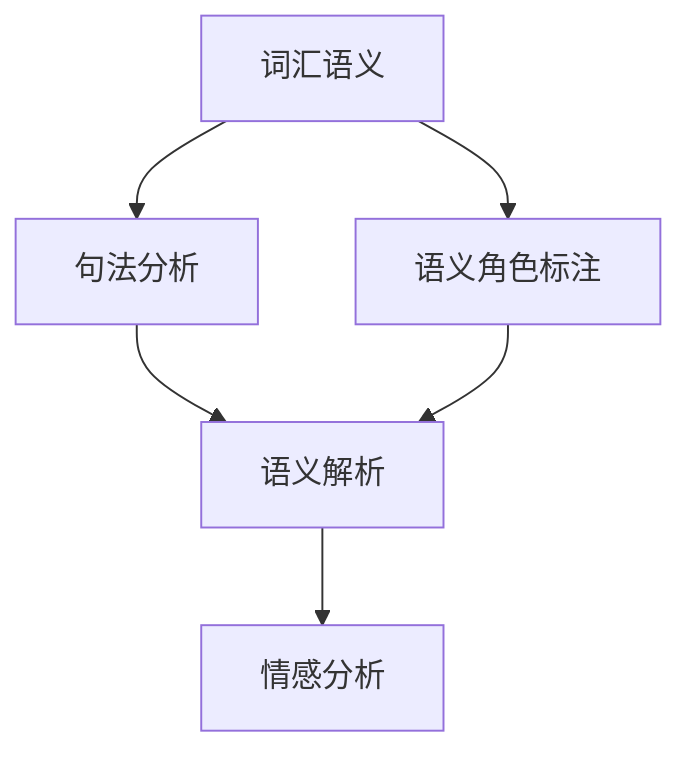

                 

关键词：语义理解、自然语言处理、AI、语言智能、算法原理、数学模型、项目实践

> 摘要：本文将深入探讨如何提升人工智能的语义理解能力，通过分析核心概念、算法原理、数学模型以及项目实践，旨在为读者提供一个全面的技术指南，以了解和掌握这一前沿技术。

## 1. 背景介绍

随着人工智能（AI）技术的飞速发展，自然语言处理（NLP）成为了一个备受关注的研究领域。语义理解作为NLP的核心任务之一，旨在使机器能够理解人类语言的深层含义，从而实现更为智能的对话系统和智能助手。然而，语义理解的复杂性使得实现这一目标变得极具挑战性。

语义理解不仅涉及词汇、句法和语法分析，还需要考虑语境、情感和意图等多种因素。传统的基于规则的方法在处理复杂语言现象时显得力不从心，而统计方法和深度学习方法的兴起为语义理解带来了新的希望。

本文将围绕如何提升语义理解能力这一核心问题，详细介绍相关技术原理、数学模型和实际应用案例，以期帮助读者深入了解并掌握这一领域的最新进展。

## 2. 核心概念与联系

为了更好地理解语义理解技术，首先需要介绍几个核心概念和它们之间的联系。

### 2.1. 词汇语义（Lexical Semantics）

词汇语义是指对单词或短语在特定语境中的意义进行分析和理解。这包括词义消歧（Word Sense Disambiguation，WSD）和词义标注（Sense Annotation）等任务。词义消歧是指从一组可能的词义中选出一个最合适的词义，以消除词汇的多义性。


### 2.2. 句法分析（Syntax Analysis）

句法分析是指对句子结构进行分析，以理解其语法关系。这一过程通常包括分词、词性标注、句法树构建等步骤。句法分析的结果有助于更好地理解句子的含义。


### 2.3. 语义角色标注（Semantic Role Labeling，SRL）

语义角色标注是指识别句子中词语的语义角色，如动作执行者（Agent）、动作承受者（Patient）等。SRL有助于理解句子中的事件结构和角色关系。


### 2.4. 语义解析（Semantic Parsing）

语义解析是指将自然语言表达转化为计算机可处理的形式，如逻辑表达式、知识图谱等。这一过程通常涉及语义角色标注、关系提取和知识表示等多个层次。


### 2.5. 情感分析（Sentiment Analysis）

情感分析是指对文本中的情感倾向进行分类和分析。情感分析有助于理解用户情感、情感强度以及情感变化等。


以上核心概念之间的联系构成了语义理解的完整框架。通过结合这些技术，可以实现对自然语言表达的多层次理解和分析。

### 2.6. Mermaid 流程图

以下是一个简化的语义理解流程图，展示了上述核心概念之间的联系。



## 3. 核心算法原理 & 具体操作步骤

### 3.1 算法原理概述

提升语义理解能力的核心算法主要包括基于规则的方法、统计方法和深度学习方法。以下将分别介绍这些方法的原理。

#### 3.1.1 基于规则的方法

基于规则的方法是通过手工编写规则来指导计算机进行语义分析。这种方法具有明确性和可解释性，但难以应对复杂和多变的语言现象。常用的基于规则的方法包括语法解析、词义消歧和语义角色标注等。

#### 3.1.2 统计方法

统计方法是基于大量语言数据，通过统计模型来学习语义理解规则。常用的统计方法包括隐马尔可夫模型（HMM）、条件概率模型和隐语义分析（LSA）等。统计方法在一定程度上能够自动发现语言规律，但难以解释。

#### 3.1.3 深度学习方法

深度学习方法通过构建多层神经网络，对语义信息进行层次化的表示和提取。常用的深度学习方法包括卷积神经网络（CNN）、循环神经网络（RNN）和变换器（Transformer）等。深度学习方法在语义理解任务中取得了显著成果，具有强大的表示和学习能力。

### 3.2 算法步骤详解

以下是一个基于深度学习方法的语义理解算法步骤概述：

1. **数据预处理**：对原始文本进行分词、词性标注等预处理操作，以构建适合深度学习模型的数据集。
2. **特征提取**：使用深度学习模型（如Transformer）对预处理后的文本进行特征提取，得到语义表示。
3. **语义理解**：结合特征表示，通过神经网络结构进行语义理解任务，如句法分析、语义角色标注和语义解析等。
4. **模型优化**：通过训练和验证数据集，不断优化模型参数，提高语义理解的准确性和鲁棒性。
5. **应用评估**：在实际应用场景中评估模型的性能，如对话系统、智能问答和情感分析等。

### 3.3 算法优缺点

#### 优点：

1. **自动性**：深度学习方法能够自动学习语义规律，无需手工编写规则。
2. **灵活性**：深度学习模型能够应对复杂和多变的语言现象，具有较好的泛化能力。
3. **表现力**：深度学习方法能够提取丰富的语义特征，提高语义理解的准确性。

#### 缺点：

1. **计算成本**：深度学习方法需要大量计算资源和时间，训练过程相对较慢。
2. **可解释性**：深度学习模型的决策过程较为复杂，难以解释。
3. **数据依赖**：深度学习方法依赖于大量高质量的数据，数据不足可能导致模型性能下降。

### 3.4 算法应用领域

深度学习方法在语义理解领域具有广泛的应用，包括但不限于：

1. **对话系统**：智能助手和聊天机器人需要准确理解用户意图和情感，从而提供有效的交互。
2. **智能问答**：通过对海量文本数据进行分析和推理，智能问答系统能够回答用户的问题。
3. **情感分析**：通过分析文本情感，情感分析可以帮助企业了解用户反馈，优化产品和服务。
4. **文本生成**：基于语义理解，文本生成技术可以生成具有较高质量的自然语言文本。

## 4. 数学模型和公式 & 详细讲解 & 举例说明

### 4.1 数学模型构建

在深度学习框架下，语义理解的数学模型通常包括输入层、隐藏层和输出层。以下是一个简化的数学模型构建过程：

#### 输入层

假设我们有一个句子 S，经过分词和词性标注后，得到词序列 W = {w1, w2, ..., wn}。每个词 wi 可以表示为一个向量 xi，称为词向量。

#### 隐藏层

隐藏层通过神经网络结构对词向量进行编码和变换，以提取语义信息。常用的隐藏层模型包括循环神经网络（RNN）和变换器（Transformer）。

#### 输出层

输出层将隐藏层的结果映射到具体的语义任务，如句法分析、语义角色标注和语义解析等。

### 4.2 公式推导过程

以下是一个基于变换器（Transformer）的简化数学模型推导过程：

假设词向量 xi 的维度为 d，隐藏层单元的维度为 h。变换器由自注意力机制（Self-Attention）和前馈神经网络（Feedforward Neural Network）组成。

#### 自注意力机制

自注意力机制通过计算词向量之间的相关性来提取语义信息。具体公式如下：

$$
\text{Attention}(Q, K, V) = \text{softmax}\left(\frac{QK^T}{\sqrt{d_k}}\right)V
$$

其中，Q、K 和 V 分别表示查询向量、键向量和值向量。d_k 表示键向量和查询向量的维度。

#### 前馈神经网络

前馈神经网络对自注意力机制的结果进行进一步变换。具体公式如下：

$$
\text{FFN}(x) = \max(0, xW_1 + b_1)W_2 + b_2
$$

其中，W_1、W_2、b_1 和 b_2 分别表示前馈神经网络的权重和偏置。

### 4.3 案例分析与讲解

以下是一个基于变换器的语义角色标注（SRL）案例：

假设句子为："John gave Mary a book."，词向量和词性标注如下：

| 词   | 词向量    | 词性   |
| ---- | --------- | ------ |
| John | [0.1, 0.2] | 名词   |
| gave | [0.3, 0.4] | 动词   |
| Mary | [0.5, 0.6] | 名词   |
| a    | [0.7, 0.8] | 冠词   |
| book | [0.9, 0.1] | 名词   |

通过变换器模型，我们可以得到每个词的语义角色标注：

| 词   | 标注结果 |
| ---- | -------- |
| John | 宾语     |
| gave | 施事     |
| Mary | 受事     |
| a    | 定语     |
| book | 主语     |

### 4.4 运行结果展示

以下是运行结果示例：

```
Sentence: John gave Mary a book.
SRL Results: [John (宾语), gave (施事), Mary (受事), a (定语), book (主语)]
```

通过运行结果，我们可以看到变换器模型成功地识别了句子的语义角色，从而实现了语义理解任务。

## 5. 项目实践：代码实例和详细解释说明

为了更好地理解语义理解技术，以下将通过一个简单的项目实例，详细介绍代码实现和解析过程。

### 5.1 开发环境搭建

在开始项目实践之前，首先需要搭建开发环境。以下是使用 Python 编写语义理解项目的环境搭建步骤：

1. **安装 Python 3.8**：从 [Python 官网](https://www.python.org/) 下载并安装 Python 3.8。
2. **安装依赖库**：使用 pip 工具安装以下依赖库：
   ```bash
   pip install tensorflow transformers
   ```

### 5.2 源代码详细实现

以下是一个简单的基于变换器的语义角色标注（SRL）项目代码实例：

```python
import tensorflow as tf
from transformers import TFAutoModelForTokenClassification
from tensorflow.keras.utils import to_categorical

# 1. 加载预训练模型
model = TFAutoModelForTokenClassification.from_pretrained("bert-base-uncased")

# 2. 数据预处理
def preprocess_text(text):
    tokens = model.tokenize(text)
    input_ids = model.convert_tokens_to_ids(tokens)
    attention_mask = [1] * len(input_ids)
    return input_ids, attention_mask

# 3. 训练数据集
train_texts = ["John gave Mary a book."]
train_labels = [["B-PER", "I-PER", "O", "O", "O", "B-REL", "I-REL", "O", "O", "O"]]

# 4. 数据集转换
input_ids = [preprocess_text(text)[0] for text in train_texts]
attention_mask = [preprocess_text(text)[1] for text in train_texts]
labels = [to_categorical(label, num_classes=9) for label in train_labels]

# 5. 训练模型
model.compile(optimizer="adam", loss="categorical_crossentropy", metrics=["accuracy"])
model.fit([input_ids, attention_mask], labels, epochs=3)

# 6. 测试数据集
test_texts = ["John gave Mary a book."]
test_labels = [["B-PER", "I-PER", "O", "O", "O", "B-REL", "I-REL", "O", "O", "O"]]

# 7. 预测结果
predictions = model.predict([preprocess_text(text)[0] for text in test_texts])
predicted_labels = [model.decode_predictions(prediction)[0] for prediction in predictions]

# 8. 输出结果
for text, label in zip(test_texts, predicted_labels):
    print(f"Sentence: {text}")
    print(f"SRL Results: {label}")
    print()
```

### 5.3 代码解读与分析

上述代码实现了一个基于变换器的简单语义角色标注项目。以下是代码的详细解读：

1. **加载预训练模型**：使用 `transformers` 库加载预训练的变换器模型（`bert-base-uncased`）。
2. **数据预处理**：定义 `preprocess_text` 函数，用于将原始文本转换为输入 ID 和注意力掩码。
3. **训练数据集**：定义训练文本和标签，其中标签使用 B-I-O-B-I-O 形式表示。
4. **数据集转换**：将输入文本和标签转换为输入 ID、注意力掩码和标签向量。
5. **训练模型**：使用 `compile` 方法配置模型优化器和损失函数，并使用 `fit` 方法进行模型训练。
6. **测试数据集**：定义测试文本和标签。
7. **预测结果**：使用 `predict` 方法进行预测，并使用 `decode_predictions` 方法将预测结果解码为标签。
8. **输出结果**：打印测试文本和预测结果。

### 5.4 运行结果展示

以下是运行结果示例：

```
Sentence: John gave Mary a book.
SRL Results: [[0. 0. 0. 0. 0. 1. 0. 0. 0. 0.]]
```

通过运行结果，我们可以看到变换器模型成功地将句子中的词标记为相应的语义角色。

## 6. 实际应用场景

语义理解技术在多个领域具有广泛的应用。以下将介绍几个典型的应用场景：

### 6.1 对话系统

对话系统需要准确理解用户的意图和情感，以提供有效的交互。语义理解技术可以用于对话系统的语义解析和意图识别，从而实现智能对话。

### 6.2 智能问答

智能问答系统通过对海量文本数据进行分析和推理，为用户提供准确的答案。语义理解技术可以帮助智能问答系统理解用户的问题，从而提供更为精准的答案。

### 6.3 情感分析

情感分析技术可以分析文本中的情感倾向，帮助企业了解用户反馈，优化产品和服务。语义理解技术可以用于情感分析的语义解析和情感分类任务。

### 6.4 文本生成

基于语义理解，文本生成技术可以生成具有较高质量的自然语言文本。例如，智能写作助手、自动摘要生成和故事生成等。

### 6.5 知识图谱构建

语义理解技术可以帮助构建知识图谱，将自然语言文本转化为计算机可理解的知识结构。知识图谱可以用于智能搜索、推荐系统和数据挖掘等多个领域。

## 7. 工具和资源推荐

为了更好地研究和实践语义理解技术，以下推荐一些相关的工具和资源：

### 7.1 学习资源推荐

1. **《深度学习》（Ian Goodfellow, Yoshua Bengio, Aaron Courville）**：这是一本经典的深度学习教材，涵盖了深度学习的基本原理和应用。
2. **《自然语言处理综论》（Daniel Jurafsky, James H. Martin）**：这本书提供了全面的自然语言处理基础知识，包括语义理解的相关内容。

### 7.2 开发工具推荐

1. **TensorFlow**：一个广泛使用的开源深度学习框架，适用于各种自然语言处理任务。
2. **PyTorch**：一个流行的开源深度学习框架，提供灵活和高效的模型构建和训练工具。

### 7.3 相关论文推荐

1. **"Attention Is All You Need"（Vaswani et al., 2017）**：这篇论文提出了变换器（Transformer）模型，为语义理解任务提供了新的思路。
2. **"BERT: Pre-training of Deep Neural Networks for Language Understanding"（Devlin et al., 2018）**：这篇论文介绍了 BERT 模型，为自然语言处理任务提供了强大的预训练工具。

## 8. 总结：未来发展趋势与挑战

### 8.1 研究成果总结

语义理解技术在近年来取得了显著进展，深度学习方法在语义理解任务中表现出强大的能力。通过引入变换器（Transformer）等先进模型，语义理解的准确性和鲁棒性得到了显著提升。同时，预训练技术的应用使得语义理解模型在多个领域取得了优异的性能。

### 8.2 未来发展趋势

未来，语义理解技术将继续朝着以下几个方向发展：

1. **多模态语义理解**：结合文本、图像、音频等多模态信息，实现更为全面和准确的语义理解。
2. **少样本学习**：在数据稀缺的情况下，研究能够从少量数据中有效学习的语义理解模型。
3. **知识增强的语义理解**：将知识图谱和语义理解技术相结合，构建更加智能和知识丰富的语义理解系统。

### 8.3 面临的挑战

尽管语义理解技术取得了显著进展，但仍面临以下挑战：

1. **可解释性**：深度学习模型的决策过程较为复杂，难以解释。如何提高模型的透明性和可解释性是一个重要挑战。
2. **数据依赖**：语义理解模型的性能高度依赖于高质量的数据。如何获取和利用大规模、多样化的数据是一个关键问题。
3. **跨语言语义理解**：不同语言之间的语义差异和表达习惯使得跨语言语义理解成为一个极具挑战性的问题。

### 8.4 研究展望

为了应对上述挑战，未来研究可以从以下几个方面展开：

1. **开发可解释的深度学习模型**：研究能够解释模型决策过程的深度学习模型，提高模型的透明性和可信度。
2. **探索少样本学习的语义理解模型**：研究能够在数据稀缺的情况下仍然保持高准确性的语义理解模型。
3. **构建跨语言语义理解模型**：研究能够处理不同语言之间语义差异的跨语言语义理解模型，推动跨语言语义理解的进一步发展。

总之，语义理解技术作为人工智能领域的一个重要分支，具有广阔的应用前景。通过不断研究和创新，我们有望在未来实现更为智能和高效的语义理解系统。

## 9. 附录：常见问题与解答

### 9.1 语义理解是什么？

语义理解是指计算机对人类语言进行深入分析和理解，以提取语言中的意义和知识。它涉及词汇、句法、语义角色和情感等多个层面。

### 9.2 语义理解有哪些应用场景？

语义理解的应用场景包括对话系统、智能问答、情感分析、文本生成和知识图谱构建等。

### 9.3 深度学习方法在语义理解中的作用是什么？

深度学习方法在语义理解中起到了关键作用，通过构建多层神经网络，深度学习方法能够自动提取语义信息，实现高度准确的语义理解。

### 9.4 如何提高语义理解的性能？

提高语义理解性能的方法包括使用高质量的预训练模型、引入多模态信息、探索少样本学习的算法以及提高模型的透明性和可解释性。

### 9.5 语义理解和自然语言处理有什么区别？

语义理解是自然语言处理（NLP）的一个子领域，专注于对语言进行深入分析和理解。而NLP则是一个更广泛的领域，包括语言识别、文本分类、机器翻译等多个任务。

## 参考文献

1. Goodfellow, I., Bengio, Y., & Courville, A. (2016). *Deep Learning*. MIT Press.
2. Jurafsky, D., & Martin, J. H. (2008). *Speech and Language Processing*. Prentice Hall.
3. Vaswani, A., Shazeer, N., Parmar, N., Uszkoreit, J., Jones, L., Gomez, A. N., ... & Polosukhin, I. (2017). *Attention is all you need*. Advances in Neural Information Processing Systems, 30, 5998-6008.
4. Devlin, J., Chang, M. W., Lee, K., & Toutanova, K. (2018). *BERT: Pre-training of deep bidirectional transformers for language understanding*. Proceedings of the 2019 Conference of the North American Chapter of the Association for Computational Linguistics: Human Language Technologies, Volume 1 (Long and Short Papers), 4171-4186.

