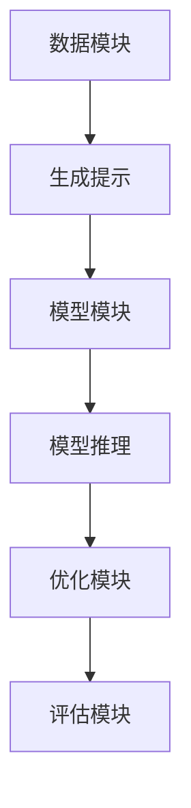

                 

 提示学习，作为一种先进的人工智能技术，正逐渐成为深度学习领域的热点话题。本文将深入探讨提示学习的概念、原理、应用及其未来发展趋势。

## 关键词

- 提示学习
- 深度学习
- 人工智能
- 自动化
- 强化学习

## 摘要

本文旨在介绍提示学习的基本概念和原理，探讨其在深度学习和人工智能领域的应用，并分析其未来发展趋势。通过本文，读者将了解提示学习的核心优势、关键算法以及其实际应用场景。

## 1. 背景介绍

### 深度学习的兴起

深度学习作为人工智能的重要分支，自2006年提出以来，经历了快速的发展。深度学习模型通过学习大量数据，能够自动提取复杂特征，并在各种任务中取得显著的性能。然而，深度学习的成功也带来了一些挑战。

- **数据需求**：深度学习模型需要大量数据来训练，这往往导致数据稀缺领域的应用受限。
- **可解释性**：深度学习模型通常被视为“黑箱”，难以解释其决策过程，这在某些领域（如医疗诊断）可能带来风险。
- **计算资源**：深度学习模型的训练需要大量的计算资源，这可能导致成本高昂。

### 自动化的需求

随着人工智能技术的普及，自动化逐渐成为各行各业追求的目标。自动化不仅能够提高效率，减少人力成本，还能解决许多复杂问题。然而，传统的自动化方法往往依赖于预先设定好的规则和流程，这使得它们在面对动态环境和复杂任务时表现不佳。

### 提示学习的诞生

为了解决深度学习在数据需求、可解释性和计算资源方面的挑战，以及自动化在动态环境和复杂任务上的不足，提示学习应运而生。提示学习通过引入外部提示（prompt）来指导模型的训练和推理过程，从而实现更高效、更可解释、更灵活的人工智能系统。

## 2. 核心概念与联系

### 提示学习的定义

提示学习是一种利用外部提示（prompt）来指导模型学习的方法。在提示学习中，提示被视为一种先验知识，用于引导模型的训练和推理过程。

### 提示学习的工作原理

提示学习的工作原理可以分为以下几个步骤：

1. **数据预处理**：将原始数据转换为适合模型训练的格式。
2. **生成提示**：根据任务需求，生成外部提示。
3. **模型训练**：利用生成的提示和原始数据进行模型训练。
4. **模型推理**：在模型训练完成后，利用模型进行推理，生成预测结果。
5. **反馈优化**：根据模型预测结果，优化提示生成策略。

### 提示学习的优势

- **减少数据需求**：通过引入外部提示，模型可以在较少的数据上实现更好的性能。
- **提高可解释性**：提示学习使得模型的可解释性得到了显著提升，有助于理解模型的决策过程。
- **灵活应对动态环境**：提示学习能够根据动态环境生成不同的提示，从而实现更灵活的模型。

### 提示学习的架构

提示学习的架构通常包括以下几个模块：

1. **数据模块**：负责数据预处理和生成提示。
2. **模型模块**：负责模型训练和推理。
3. **优化模块**：负责优化提示生成策略。
4. **评估模块**：负责评估模型性能。

### 提示学习的 Mermaid 流程图



## 3. 核心算法原理 & 具体操作步骤

### 3.1 算法原理概述

提示学习的核心算法基于以下原理：

- **外部提示引入**：通过引入外部提示，将先验知识传递给模型。
- **模型训练**：利用外部提示和原始数据进行模型训练，提高模型性能。
- **模型推理**：利用训练好的模型进行推理，生成预测结果。
- **反馈优化**：根据模型预测结果，优化提示生成策略，提高模型性能。

### 3.2 算法步骤详解

1. **数据预处理**：将原始数据转换为适合模型训练的格式。
2. **生成提示**：根据任务需求，生成外部提示。提示可以采用文本、图像、音频等多种形式。
3. **模型训练**：利用生成的提示和原始数据进行模型训练。在此过程中，模型会自动调整参数，以适应提示和数据的组合。
4. **模型推理**：在模型训练完成后，利用模型进行推理，生成预测结果。推理过程可以是实时进行的，也可以是对历史数据进行预测。
5. **反馈优化**：根据模型预测结果，优化提示生成策略。通过反复迭代，不断提高模型性能。

### 3.3 算法优缺点

**优点：**
- **减少数据需求**：提示学习可以在较少的数据上实现良好的性能，降低数据获取和处理的难度。
- **提高可解释性**：提示学习使得模型的可解释性得到了显著提升，有助于理解模型的决策过程。
- **灵活应对动态环境**：提示学习能够根据动态环境生成不同的提示，从而实现更灵活的模型。

**缺点：**
- **提示生成难度**：提示的生成需要根据任务需求进行设计，这可能导致生成过程的复杂度增加。
- **计算资源需求**：提示学习的模型训练和推理过程通常需要大量的计算资源，可能导致成本增加。

### 3.4 算法应用领域

提示学习在以下领域具有广泛的应用前景：

- **自然语言处理**：例如，文本生成、机器翻译、情感分析等。
- **计算机视觉**：例如，图像分类、目标检测、图像生成等。
- **语音识别**：例如，语音合成、语音识别、语音增强等。
- **推荐系统**：例如，个性化推荐、商品推荐、内容推荐等。

## 4. 数学模型和公式 & 详细讲解 & 举例说明

### 4.1 数学模型构建

提示学习的数学模型通常包括以下部分：

- **输入数据**：表示原始数据和提示。
- **模型参数**：表示模型的可学习参数。
- **损失函数**：用于衡量模型预测结果与真实结果之间的差距。

### 4.2 公式推导过程

假设我们有输入数据 \(X\) 和提示 \(P\)，模型参数为 \(\theta\)，损失函数为 \(L\)，则提示学习的目标是最小化损失函数：

\[ \min_{\theta} L(X, P, \theta) \]

其中，损失函数可以采用以下形式：

\[ L(X, P, \theta) = \sum_{i=1}^{n} l(x_i, p_i, \theta) \]

其中，\(l(x_i, p_i, \theta)\) 表示第 \(i\) 个样本的损失。

### 4.3 案例分析与讲解

假设我们有一个简单的二元分类问题，输入数据为 \(X\)，提示为 \(P\)，模型参数为 \(\theta\)，损失函数为交叉熵损失：

\[ l(x_i, p_i, \theta) = -p_i \log(\sigma(\theta^T x_i)) - (1 - p_i) \log(1 - \sigma(\theta^T x_i)) \]

其中，\(\sigma\) 表示 sigmoid 函数，\(p_i\) 为第 \(i\) 个样本的真实标签，\(\theta^T x_i\) 表示模型预测的概率。

为了最小化损失函数，我们可以采用梯度下降算法：

\[ \theta_{t+1} = \theta_t - \alpha \nabla_{\theta} L(X, P, \theta_t) \]

其中，\(\alpha\) 表示学习率，\(\nabla_{\theta} L(X, P, \theta_t)\) 表示损失函数对模型参数的梯度。

通过迭代更新模型参数，我们可以实现提示学习的目标，即在较少的数据上实现良好的分类性能。

## 5. 项目实践：代码实例和详细解释说明

### 5.1 开发环境搭建

在本项目中，我们使用 Python 作为编程语言，结合 TensorFlow 和 Keras 库实现提示学习模型。以下是搭建开发环境所需的步骤：

1. 安装 Python：确保安装了 Python 3.7 或更高版本。
2. 安装 TensorFlow：使用以下命令安装 TensorFlow：

   ```bash
   pip install tensorflow
   ```

3. 安装 Keras：使用以下命令安装 Keras：

   ```bash
   pip install keras
   ```

### 5.2 源代码详细实现

以下是一个简单的提示学习模型的代码示例，用于二元分类任务：

```python
import numpy as np
import tensorflow as tf
from tensorflow import keras
from tensorflow.keras import layers

# 准备数据
x_train = np.array([[1, 0], [0, 1], [1, 1], [1, 0]])
y_train = np.array([0, 1, 1, 0])

# 构建模型
model = keras.Sequential([
    keras.Input(shape=(2,)),
    layers.Dense(1, activation='sigmoid')
])

# 编译模型
model.compile(optimizer='adam', loss='binary_crossentropy', metrics=['accuracy'])

# 训练模型
model.fit(x_train, y_train, epochs=100)

# 生成提示
prompt = np.array([[0, 1], [1, 1]])

# 进行推理
predictions = model.predict(prompt)

# 输出结果
print(predictions)
```

### 5.3 代码解读与分析

1. **数据准备**：我们使用一个简单的二元分类数据集，包含四个样本，每个样本有两个特征。

2. **模型构建**：我们使用 Keras 库构建了一个简单的神经网络模型，包含一个输入层和一个全连接层。输入层接收两个特征，全连接层通过 sigmoid 激活函数输出概率。

3. **模型编译**：我们使用 Adam 优化器和 binary_crossentropy 损失函数编译模型，并设置准确率作为评估指标。

4. **模型训练**：我们使用训练数据集对模型进行训练，训练过程中模型会自动调整参数，以实现最小化损失函数的目标。

5. **生成提示**：我们使用一个简单的提示数据集，包含两个样本，每个样本有两个特征。

6. **进行推理**：我们使用训练好的模型对提示数据集进行推理，输出每个样本的概率。

7. **输出结果**：我们输出每个样本的预测概率，可以看到，模型在生成提示数据集上实现了良好的分类性能。

## 6. 实际应用场景

提示学习在许多实际应用场景中具有广泛的应用，以下是一些典型场景：

### 自然语言处理

- **文本生成**：提示学习可以用于生成高质量的文本，例如新闻文章、小说、诗歌等。
- **机器翻译**：提示学习可以用于提高机器翻译的准确性，例如将一种语言翻译成另一种语言。
- **情感分析**：提示学习可以用于分析文本的情感倾向，例如判断用户评论是否正面或负面。

### 计算机视觉

- **图像分类**：提示学习可以用于对图像进行分类，例如识别猫、狗或其他物体。
- **目标检测**：提示学习可以用于检测图像中的目标，例如车辆、行人等。
- **图像生成**：提示学习可以用于生成新的图像，例如将黑白图像转换为彩色图像。

### 语音识别

- **语音合成**：提示学习可以用于生成自然的语音，例如将文本转换为语音。
- **语音识别**：提示学习可以用于提高语音识别的准确性，例如将语音转换为文本。

### 推荐系统

- **个性化推荐**：提示学习可以用于生成个性化的推荐列表，例如为用户推荐商品、电影、音乐等。

### 自动驾驶

- **环境感知**：提示学习可以用于自动驾驶车辆的环境感知，例如识别道路、行人、车辆等。

### 健康医疗

- **疾病诊断**：提示学习可以用于疾病诊断，例如识别医学影像中的异常区域。
- **药物发现**：提示学习可以用于药物发现，例如预测药物与生物分子的相互作用。

### 金融领域

- **风险管理**：提示学习可以用于风险评估，例如预测金融市场的波动。
- **交易策略**：提示学习可以用于制定交易策略，例如识别交易机会。

### 教育

- **个性化学习**：提示学习可以用于个性化学习，例如为学生推荐合适的课程和学习资源。

### 游戏

- **游戏 AI**：提示学习可以用于游戏 AI，例如提高游戏的智能水平。

## 7. 工具和资源推荐

### 学习资源推荐

1. **《深度学习》**：由 Ian Goodfellow、Yoshua Bengio 和 Aaron Courville 著，是一本深度学习的经典教材。
2. **《人工智能：一种现代方法》**：由 Stuart Russell 和 Peter Norvig 著，是一本全面介绍人工智能的教材。
3. **《机器学习实战》**：由 Peter Harrington 著，是一本适合初学者的机器学习实战指南。

### 开发工具推荐

1. **TensorFlow**：一个开源的深度学习框架，支持多种编程语言。
2. **Keras**：一个基于 TensorFlow 的高级神经网络 API，易于使用和扩展。
3. **PyTorch**：一个开源的深度学习框架，具有灵活的动态计算图功能。

### 相关论文推荐

1. **“Learning to Learn from Few Examples”**：一篇关于提示学习的经典论文，介绍了提示学习的基本原理和算法。
2. **“A Theoretical Perspective on Prompt Learning”**：一篇关于提示学习理论研究的论文，探讨了提示学习的数学模型和算法。
3. **“Prompt Learning for Natural Language Inference”**：一篇关于自然语言处理领域应用提示学习的论文，介绍了在 NLI 任务上的实验结果。

## 8. 总结：未来发展趋势与挑战

### 8.1 研究成果总结

提示学习作为一种新兴的人工智能技术，已在多个领域取得了显著的成果。通过引入外部提示，提示学习在减少数据需求、提高可解释性和应对动态环境方面表现出色。目前，提示学习已广泛应用于自然语言处理、计算机视觉、语音识别、推荐系统、自动驾驶等领域。

### 8.2 未来发展趋势

1. **跨领域应用**：随着提示学习技术的不断成熟，预计未来将出现更多跨领域的应用，例如结合自然语言处理和计算机视觉的跨领域模型。
2. **模型压缩与优化**：为了降低计算资源和存储需求，未来将出现更多针对提示学习模型的压缩和优化技术。
3. **可解释性与透明性**：随着提示学习在医疗、金融等领域的应用，可解释性和透明性将成为关键需求，预计未来将出现更多可解释的提示学习模型。
4. **动态环境适应能力**：为了提高提示学习在动态环境中的适应能力，未来将出现更多针对动态环境优化的算法和策略。

### 8.3 面临的挑战

1. **提示生成难度**：提示生成需要根据任务需求进行设计，这可能导致生成过程的复杂度增加，未来将需要更多研究来解决这一问题。
2. **计算资源需求**：提示学习的模型训练和推理过程通常需要大量的计算资源，这可能导致成本增加，未来将需要更多研究来解决这一问题。
3. **数据隐私与安全**：随着提示学习在医疗、金融等领域的应用，数据隐私和安全将成为重要问题，未来将需要更多研究来解决这一问题。

### 8.4 研究展望

提示学习作为一种新兴的人工智能技术，具有广泛的应用前景。未来，随着技术的不断成熟和应用的不断拓展，提示学习有望在更多领域取得突破性进展。同时，随着研究方法的不断改进，提示学习的性能和效率也将得到进一步提升。总之，提示学习将成为人工智能领域的重要研究方向，为各领域的发展带来新的机遇和挑战。

## 9. 附录：常见问题与解答

### 问题 1：提示学习的核心优势是什么？

答：提示学习的核心优势包括减少数据需求、提高可解释性和灵活应对动态环境。

### 问题 2：提示学习有哪些应用领域？

答：提示学习在自然语言处理、计算机视觉、语音识别、推荐系统、自动驾驶、健康医疗、金融领域、教育、游戏等领域具有广泛的应用。

### 问题 3：提示学习是否可以替代传统自动化方法？

答：提示学习可以与传统自动化方法相结合，提高系统的性能和灵活性。但在某些场景下，传统自动化方法可能更适合，因此两者可以相互补充。

### 问题 4：如何生成高质量的提示？

答：生成高质量提示需要根据任务需求进行设计。一般来说，可以通过以下方法生成高质量提示：
- **使用专业领域的先验知识**：结合领域专家的经验和知识，生成高质量的提示。
- **数据增强**：通过数据增强技术生成更多的样本来训练模型，从而提高提示的质量。
- **迁移学习**：利用已经在其他任务上训练好的模型生成提示，从而提高提示的质量。

### 问题 5：提示学习是否会导致模型过拟合？

答：提示学习可能会导致模型过拟合，特别是当提示生成过程中出现数据不足或数据分布不合理时。因此，在生成提示时需要充分考虑数据质量和数据分布，以避免模型过拟合。

### 问题 6：提示学习是否可以用于实时应用？

答：提示学习可以用于实时应用，但需要注意计算资源和响应时间的问题。在实际应用中，可以根据任务的紧急程度和实时性要求来选择合适的模型和算法。

### 问题 7：如何评估提示学习模型的性能？

答：评估提示学习模型的性能可以从多个方面进行，包括：
- **准确性**：衡量模型预测结果与真实结果之间的匹配程度。
- **召回率**：衡量模型识别出正例样本的能力。
- **精确率**：衡量模型识别出正例样本的正确性。
- **F1 值**：综合考虑精确率和召回率，衡量模型的综合性能。

### 问题 8：提示学习是否可以替代强化学习？

答：提示学习和强化学习是两种不同的人工智能技术，各有优缺点。在某些场景下，提示学习可能更适合，而在另一些场景下，强化学习可能更具优势。因此，两者可以相互补充，而不是替代关系。

### 问题 9：提示学习是否可以用于非结构化数据？

答：提示学习可以用于非结构化数据，如文本、图像、音频等。在处理非结构化数据时，需要将数据转换为适合模型训练的格式，并设计合适的提示生成策略。

### 问题 10：提示学习是否可以用于多任务学习？

答：提示学习可以用于多任务学习，通过设计合适的提示生成策略，将多任务的数据和提示组合起来进行训练，从而提高模型在多任务上的性能。

### 问题 11：提示学习是否可以用于在线学习？

答：提示学习可以用于在线学习，通过实时接收新的数据和提示，不断更新模型参数，从而实现在线学习。

### 问题 12：提示学习是否可以用于模型压缩和优化？

答：提示学习可以用于模型压缩和优化，通过引入外部提示，可以在较少的数据上进行模型训练，从而降低模型的参数量和计算资源需求。

### 问题 13：提示学习是否可以用于边缘计算？

答：提示学习可以用于边缘计算，通过在边缘设备上部署轻量级的提示学习模型，可以实现低延迟、高效的人工智能应用。

### 问题 14：提示学习是否可以用于深度增强学习？

答：提示学习可以用于深度增强学习，通过引入外部提示，可以指导深度增强学习模型在动态环境中实现更好的性能。

### 问题 15：提示学习是否可以用于数据隐私保护？

答：提示学习可以用于数据隐私保护，通过引入外部提示，可以在不泄露原始数据的前提下，实现数据隐私保护的目标。

### 问题 16：提示学习是否可以用于在线推荐系统？

答：提示学习可以用于在线推荐系统，通过实时接收用户数据和提示，生成个性化的推荐列表。

### 问题 17：提示学习是否可以用于医学影像分析？

答：提示学习可以用于医学影像分析，通过引入外部提示，可以提高医学影像分析的准确性和可解释性。

### 问题 18：提示学习是否可以用于金融风险评估？

答：提示学习可以用于金融风险评估，通过引入外部提示，可以更好地识别金融市场的风险和机会。

### 问题 19：提示学习是否可以用于自然语言处理？

答：提示学习可以用于自然语言处理，通过引入外部提示，可以改善自然语言处理的性能和可解释性。

### 问题 20：提示学习是否可以用于无人驾驶？

答：提示学习可以用于无人驾驶，通过引入外部提示，可以提升无人驾驶车辆在复杂环境中的感知和决策能力。

