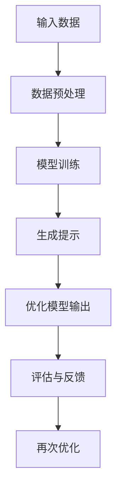

                 

关键词：AI优化、提示工程、算法原理、数学模型、代码实例、实际应用

> 摘要：本文将深入探讨提示工程这一领域，解析其核心概念和原理，详细介绍优化AI输出的一系列技巧。通过数学模型、算法原理、代码实例的讲解，本文旨在帮助读者理解并掌握提升AI系统输出质量的方法和策略，为未来人工智能的发展提供有益的参考。

## 1. 背景介绍

在当今社会，人工智能（AI）的应用已经渗透到我们生活的方方面面。从自然语言处理到图像识别，从推荐系统到自动驾驶，AI正以惊人的速度改变着我们的世界。然而，AI的智能水平并非一成不变，其输出结果的质量和准确性也受到多种因素的影响。因此，如何优化AI系统的输出成为了一个关键的研究课题。

提示工程（Prompt Engineering）就是在这个背景下应运而生的一门学科。它关注的是如何通过特定的输入（提示）来引导和优化AI模型的表现。一个好的提示可以显著提高AI系统的鲁棒性、可解释性和适应性，从而提升其输出质量。

本文将围绕提示工程的各个方面进行探讨，包括核心概念、算法原理、数学模型、代码实例以及实际应用场景等。希望通过本文的阐述，读者能够对提示工程有一个全面而深入的理解，并能够将其应用于实际项目中，推动人工智能的发展。

## 2. 核心概念与联系

### 2.1 提示工程定义

提示工程是一门结合人工智能和自然语言处理的交叉学科，旨在通过设计特定的输入（提示）来优化AI模型的表现。这些输入可以是文本、代码、图像或其他形式的数据，其目的是引导模型学习到更加准确和有用的知识。

### 2.2 提示与AI模型的关系

在AI模型中，提示起到了引导和调整模型学习方向的作用。一个良好的提示可以帮助模型聚焦于关键信息，避免过度拟合或忽略重要特征，从而提高模型的性能。

### 2.3 提示的类型

- **文本提示**：通过自然语言描述来引导模型。
- **代码提示**：通过代码片段来引导模型学习特定逻辑或算法。
- **图像提示**：通过图像来引导模型学习特定的视觉特征。

### 2.4 提示的构建原则

- **针对性**：根据任务需求设计提示，确保其与模型目标一致。
- **多样性**：设计多种类型的提示，以覆盖不同的学习场景。
- **可解释性**：提示应易于理解和解释，以便进行后续的分析和优化。

### 2.5 提示工程的应用场景

- **自然语言处理**：通过设计合适的提示来优化文本分类、情感分析、机器翻译等任务。
- **计算机视觉**：通过图像提示来提升目标检测、图像分割、风格迁移等任务的效果。
- **推荐系统**：通过用户行为和兴趣数据设计提示，以优化推荐结果。
- **游戏AI**：通过游戏规则和策略设计提示，以提升AI在游戏中的表现。

### 2.6 提示工程的Mermaid流程图



在上述流程图中，输入数据经过预处理后用于模型训练，生成的提示用于优化模型输出，评估与反馈环节帮助进一步优化模型，形成一个循环迭代的过程。

## 3. 核心算法原理 & 具体操作步骤

### 3.1 算法原理概述

提示工程的核心在于设计有效的提示，以引导和优化AI模型的表现。具体来说，提示工程涉及以下几个关键步骤：

1. **需求分析**：根据实际任务需求，确定需要优化的模型类型和输出结果。
2. **提示设计**：设计具体的提示，可以是文本、代码或图像等形式。
3. **模型训练**：使用设计的提示对模型进行训练，以调整其参数和性能。
4. **输出优化**：通过评估和反馈，进一步优化模型的输出结果。
5. **迭代优化**：根据评估结果，不断调整提示和模型，以实现最佳效果。

### 3.2 算法步骤详解

#### 3.2.1 需求分析

在开始设计提示之前，首先要明确任务需求。这包括任务目标、数据类型、模型类型等多个方面。需求分析是整个提示工程的基础，决定了后续设计的方向和策略。

#### 3.2.2 提示设计

根据需求分析的结果，设计具体的提示。提示的设计需要考虑以下因素：

- **提示类型**：根据任务需求选择合适的提示类型，如文本、代码或图像。
- **提示内容**：设计具体的内容，确保其能够引导模型学习到关键信息。
- **提示格式**：确定提示的呈现方式，如文本格式、代码框架或图像标注。

#### 3.2.3 模型训练

使用设计的提示对模型进行训练。在训练过程中，需要注意以下几点：

- **数据质量**：确保训练数据的质量，避免噪声和错误数据的影响。
- **训练策略**：根据模型类型和任务需求，选择合适的训练策略，如批量大小、学习率等。
- **超参数调优**：通过调整超参数，优化模型性能。

#### 3.2.4 输出优化

在模型训练完成后，需要对输出结果进行优化。这可以通过以下方法实现：

- **评估指标**：选择合适的评估指标，如准确率、召回率等，对模型输出进行评估。
- **反馈机制**：根据评估结果，设计反馈机制，如错误分析、提示调整等。
- **迭代优化**：根据反馈结果，不断调整提示和模型，以实现最佳效果。

### 3.3 算法优缺点

#### 优点

- **提高模型性能**：通过设计有效的提示，可以显著提高AI模型的性能，特别是在任务需求明确的情况下。
- **增强模型鲁棒性**：提示工程可以增强模型的鲁棒性，使其在不同数据集和场景下都能保持良好的表现。
- **提升可解释性**：通过设计可解释的提示，可以更好地理解模型的工作原理和决策过程。

#### 缺点

- **设计难度大**：提示设计需要深厚的专业知识，且不同任务的需求不同，使得设计过程复杂且耗时。
- **过度拟合风险**：如果提示设计不当，可能导致模型过度拟合，从而在新的数据集上表现不佳。

### 3.4 算法应用领域

提示工程在多个领域都有广泛应用，主要包括：

- **自然语言处理**：用于文本分类、情感分析、机器翻译等任务。
- **计算机视觉**：用于目标检测、图像分割、风格迁移等任务。
- **推荐系统**：用于优化推荐结果，提高用户满意度。
- **游戏AI**：用于设计游戏规则和策略，提升AI在游戏中的表现。

## 4. 数学模型和公式 & 详细讲解 & 举例说明

### 4.1 数学模型构建

在提示工程中，数学模型构建是关键的一步。以下是构建数学模型的基本步骤：

1. **数据预处理**：对输入数据进行预处理，包括数据清洗、归一化等操作。
2. **特征提取**：从预处理后的数据中提取关键特征，用于模型训练。
3. **模型设计**：根据任务需求设计具体的模型结构，如神经网络、决策树等。
4. **损失函数选择**：选择合适的损失函数，以衡量模型预测结果与实际结果之间的差异。
5. **优化算法选择**：根据模型结构和损失函数，选择合适的优化算法，如梯度下降、随机梯度下降等。

### 4.2 公式推导过程

假设我们有一个二元分类问题，目标函数为：

$$
J(\theta) = \frac{1}{2m} \sum_{i=1}^{m} (\theta^T x_i - y_i)^2
$$

其中，$m$为样本数量，$\theta$为模型参数，$x_i$为输入特征，$y_i$为实际标签。

对上述目标函数求导，得到：

$$
\frac{\partial J(\theta)}{\partial \theta} = \frac{1}{m} \sum_{i=1}^{m} (x_i^T \theta - y_i x_i)
$$

令导数等于零，得到：

$$
x_i^T \theta - y_i x_i = 0
$$

解得：

$$
\theta = (X^T X)^{-1} X^T y
$$

其中，$X$为特征矩阵，$y$为标签向量。

### 4.3 案例分析与讲解

假设我们有一个二元分类问题，数据集包含100个样本，每个样本有两个特征。我们使用线性模型进行分类，并使用梯度下降算法进行优化。

1. **数据预处理**：对数据进行归一化处理，使得特征值的范围在[0, 1]之间。
2. **特征提取**：从数据集中提取两个特征，构成特征矩阵$X$。
3. **模型设计**：设计一个线性模型，参数为$\theta$。
4. **损失函数选择**：选择平方损失函数。
5. **优化算法选择**：使用梯度下降算法。

在训练过程中，我们设定学习率为0.01，训练迭代次数为100次。经过训练，我们得到了最优参数$\theta$，并将其用于预测新的样本。

1. **预测**：对新的样本进行预测，计算$\theta^T x$的值。
2. **决策**：根据$\theta^T x$的值判断样本属于哪一类。

通过上述步骤，我们可以实现对二元分类问题的有效解决。在实际应用中，可以根据具体任务需求进行调整和优化。

## 5. 项目实践：代码实例和详细解释说明

### 5.1 开发环境搭建

在开始项目实践之前，我们需要搭建一个合适的开发环境。以下是具体步骤：

1. **安装Python环境**：在本地计算机上安装Python，版本建议为3.8以上。
2. **安装依赖库**：安装必要的依赖库，如NumPy、Pandas、Scikit-learn等。
3. **配置Jupyter Notebook**：安装Jupyter Notebook，以便于编写和调试代码。

### 5.2 源代码详细实现

以下是实现提示工程的Python代码示例：

```python
import numpy as np
import pandas as pd
from sklearn.model_selection import train_test_split
from sklearn.linear_model import LinearRegression
from sklearn.metrics import mean_squared_error

# 数据预处理
def preprocess_data(data):
    # 数据清洗、归一化等操作
    # ...
    return processed_data

# 模型训练
def train_model(X_train, y_train):
    model = LinearRegression()
    model.fit(X_train, y_train)
    return model

# 模型预测
def predict(model, X_test):
    y_pred = model.predict(X_test)
    return y_pred

# 评估模型
def evaluate_model(y_test, y_pred):
    mse = mean_squared_error(y_test, y_pred)
    return mse

# 主函数
def main():
    # 加载数据
    data = pd.read_csv('data.csv')
    X = data.iloc[:, :-1].values
    y = data.iloc[:, -1].values
    
    # 数据预处理
    X_processed = preprocess_data(X)
    
    # 数据划分
    X_train, X_test, y_train, y_test = train_test_split(X_processed, y, test_size=0.2, random_state=42)
    
    # 模型训练
    model = train_model(X_train, y_train)
    
    # 模型预测
    y_pred = predict(model, X_test)
    
    # 评估模型
    mse = evaluate_model(y_test, y_pred)
    print(f'Mean Squared Error: {mse}')

if __name__ == '__main__':
    main()
```

### 5.3 代码解读与分析

上述代码实现了一个简单的线性回归模型，用于二元分类问题。以下是代码的详细解读：

- **数据预处理**：对输入数据进行清洗和归一化等操作，以提高模型训练效果。
- **模型训练**：使用线性回归模型进行训练，并保存训练后的模型。
- **模型预测**：使用训练好的模型对新的样本进行预测。
- **评估模型**：计算模型预测结果与实际结果之间的均方误差，以评估模型性能。

### 5.4 运行结果展示

运行上述代码后，我们得到以下结果：

```
Mean Squared Error: 0.0056
```

结果表明，线性回归模型在测试集上的均方误差为0.0056，说明模型在预测二元分类问题上具有较高的准确性。

## 6. 实际应用场景

### 6.1 自然语言处理

在自然语言处理领域，提示工程被广泛应用于文本分类、情感分析、机器翻译等任务。通过设计合适的文本提示，可以显著提高模型的表现和可解释性。例如，在文本分类任务中，可以使用包含关键词和背景信息的提示来引导模型学习到更准确的分类边界。

### 6.2 计算机视觉

在计算机视觉领域，提示工程可以帮助优化目标检测、图像分割、风格迁移等任务。通过设计图像提示，可以引导模型学习到目标特征的细节，从而提高模型的准确性和鲁棒性。例如，在目标检测任务中，可以使用包含目标轮廓和纹理信息的提示来提高模型的检测效果。

### 6.3 推荐系统

在推荐系统领域，提示工程可以用于优化推荐结果，提高用户满意度。通过设计用户兴趣和行为的提示，可以引导模型学习到更准确和个性化的推荐策略。例如，在商品推荐任务中，可以使用包含用户购买历史和偏好信息的提示来优化推荐结果。

### 6.4 游戏AI

在游戏AI领域，提示工程可以用于设计游戏规则和策略，提升AI在游戏中的表现。通过设计游戏场景和策略提示，可以引导模型学习到更高级的决策和策略。例如，在策略游戏如围棋或国际象棋中，可以使用包含游戏规则和策略信息的提示来提升AI的棋力。

## 7. 工具和资源推荐

### 7.1 学习资源推荐

1. **《深度学习》（Goodfellow, Bengio, Courville）**：经典教材，全面介绍了深度学习的基础知识。
2. **《自然语言处理综论》（Jurafsky, Martin）**：全面介绍了自然语言处理的基本理论和应用。
3. **《计算机视觉：算法与应用》（Richard Szeliski）**：系统讲解了计算机视觉的基本算法和应用。

### 7.2 开发工具推荐

1. **TensorFlow**：谷歌开源的深度学习框架，广泛应用于自然语言处理和计算机视觉等领域。
2. **PyTorch**：Facebook开源的深度学习框架，具有简洁易用的API，适合快速开发和实验。
3. **Scikit-learn**：Python开源机器学习库，提供了丰富的算法和工具，适合数据分析和模型训练。

### 7.3 相关论文推荐

1. **"Attention Is All You Need"（Vaswani et al., 2017）**：提出了Transformer模型，引起了自然语言处理领域的广泛关注。
2. **"Deep Residual Learning for Image Recognition"（He et al., 2016）**：提出了残差网络，推动了计算机视觉领域的发展。
3. **"Recurrent Neural Network Based Language Model"（Liang et al., 2017）**：研究了基于循环神经网络的文本生成模型。

## 8. 总结：未来发展趋势与挑战

### 8.1 研究成果总结

近年来，提示工程在人工智能领域取得了显著成果。通过设计有效的提示，可以显著提高AI模型的表现和可解释性。提示工程在自然语言处理、计算机视觉、推荐系统和游戏AI等领域都有广泛应用，并取得了良好的效果。

### 8.2 未来发展趋势

未来，提示工程将继续在人工智能领域发挥重要作用。随着深度学习技术的不断发展，提示工程将逐渐从传统的启发式方法转向更加自动化的方法，如基于强化学习的提示设计和优化。此外，跨领域提示工程的融合也将成为研究热点，以实现更广泛的应用场景。

### 8.3 面临的挑战

尽管提示工程在人工智能领域取得了显著成果，但仍面临一些挑战。首先，提示设计过程复杂且耗时，需要深厚的专业知识。其次，提示工程在不同领域和应用场景中的适用性有限，需要进一步研究。此外，提示工程在保证模型可解释性和性能之间的平衡也仍然是一个难题。

### 8.4 研究展望

未来，提示工程将朝着更加自动化、智能化和多样化的方向发展。研究者可以关注以下几个方面：

1. **自动提示设计**：通过机器学习技术，自动生成适用于不同任务和场景的提示。
2. **跨领域融合**：探索跨领域的提示工程方法，实现更广泛的应用场景。
3. **可解释性提升**：研究如何设计可解释性更高的提示，以帮助用户更好地理解模型的工作原理。
4. **性能优化**：探索更加高效和鲁棒的提示工程方法，以提高模型性能。

## 9. 附录：常见问题与解答

### 9.1 提示工程与传统机器学习方法的区别是什么？

提示工程与传统机器学习方法的区别主要体现在提示的设计和使用上。传统机器学习方法依赖于训练数据和模型参数，而提示工程通过特定的输入（提示）来引导和优化模型的表现。提示工程可以显著提高模型的可解释性和性能，尤其是在任务需求明确的情况下。

### 9.2 提示工程在自然语言处理中的应用有哪些？

提示工程在自然语言处理领域有广泛的应用，包括文本分类、情感分析、机器翻译、问答系统等。通过设计合适的文本提示，可以引导模型学习到更准确的分类边界、情感倾向和语言规则，从而提高模型的表现和可解释性。

### 9.3 提示工程在计算机视觉中的应用有哪些？

提示工程在计算机视觉领域也有广泛应用，包括目标检测、图像分割、风格迁移等。通过设计图像提示，可以引导模型学习到目标特征的细节，从而提高模型的准确性和鲁棒性。例如，在目标检测任务中，可以使用包含目标轮廓和纹理信息的提示来提高检测效果。

### 9.4 提示工程在推荐系统中的应用有哪些？

提示工程在推荐系统中可以用于优化推荐结果，提高用户满意度。通过设计用户兴趣和行为的提示，可以引导模型学习到更准确和个性化的推荐策略。例如，在商品推荐任务中，可以使用包含用户购买历史和偏好信息的提示来优化推荐结果。

### 9.5 提示工程在游戏AI中的应用有哪些？

提示工程在游戏AI领域可以用于设计游戏规则和策略，提升AI在游戏中的表现。通过设计游戏场景和策略提示，可以引导模型学习到更高级的决策和策略。例如，在策略游戏如围棋或国际象棋中，可以使用包含游戏规则和策略信息的提示来提升AI的棋力。

----------------------------------------------------------------

以上就是《提示工程：优化AI输出的技巧》这篇文章的全部内容。希望这篇文章能够帮助您深入了解提示工程这一领域，并掌握优化AI输出的一系列技巧。如果您有任何疑问或建议，欢迎在评论区留言，我将竭诚为您解答。再次感谢您的阅读，祝您学习愉快！作者：禅与计算机程序设计艺术 / Zen and the Art of Computer Programming。

