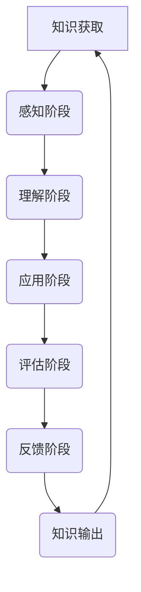

                 

### 背景介绍

在信息技术飞速发展的今天，知识更新的速度不断加快，新的编程语言、框架、算法和工具层出不穷。作为技术人员，如何有效地吸收这些知识，并将其应用于实际工作中，成为了我们必须面对的挑战。提高知识吸收率不仅仅是一个技术问题，更是一个认知过程。在这个过程中，大量的输出实践被认为是提高知识吸收率的关键因素。

本文将探讨大量输出在提高知识吸收率中的作用，从心理学、认知科学和工程实践等多个角度进行分析。我们将详细讨论如何通过大量输出来实现知识的深入理解和掌握，以及如何在输出过程中不断迭代和优化知识结构。通过这篇文章，希望能够为读者提供一套实用的方法和策略，帮助他们在知识海洋中游刃有余。

### 文章关键词

- 知识吸收
- 大量输出
- 认知科学
- 工程实践
- 知识管理

### 摘要

本文旨在探讨如何通过大量输出实践来提高知识吸收率。首先，我们介绍了知识吸收的重要性以及技术人员面临的挑战。接着，从心理学和认知科学的角度，分析了大量输出在知识吸收过程中的作用机制。随后，通过实际案例和算法原理的讲解，阐述了如何通过大量输出实现知识的深入理解和应用。文章最后，总结了提高知识吸收率的方法和策略，并展望了未来在知识吸收领域的研究方向和挑战。

## 1. 背景介绍

在当今信息技术迅猛发展的时代，知识更新速度不断加快，新技术、新工具和新算法层出不穷。对于技术人员而言，如何高效地吸收这些知识，并将其应用于实际工作中，是一个亟待解决的问题。知识吸收不仅涉及技术的掌握，更涉及到认知过程和心理机制的深入理解。

首先，知识的定义和分类为我们提供了理解知识吸收的基础。知识可以分为显性知识和隐性知识。显性知识是指可以通过语言、文字、图表等形式进行明确表达的知识，如编程语言手册、技术文档等。隐性知识则是指那些难以用语言准确描述，但通过实践和经验积累形成的知识，如编程思维、算法设计等。显性知识和隐性知识相互补充，共同构成了技术人员所需的知识体系。

其次，知识吸收的定义和过程是理解如何提高知识吸收率的关键。知识吸收是指个体通过学习、实践等方式获取和内化知识的过程。这个过程中包括感知、理解、应用、评估和反馈等多个阶段。感知阶段是通过各种渠道获取知识信息；理解阶段是将信息转化为自身的知识结构；应用阶段是将知识应用于实际问题中；评估阶段是对知识的应用效果进行反馈和调整；反馈阶段则是通过不断的实践和反思，优化和深化知识结构。

此外，技术人员在知识吸收过程中面临的挑战也是不容忽视的。一方面，技术领域的发展速度极快，新技术和新工具层出不穷，技术人员需要不断地学习和更新知识。另一方面，知识的复杂性和抽象性使得知识吸收变得困难。许多高级技术知识需要通过大量的实践和反复尝试才能真正掌握。此外，工作压力和时间的限制也使得技术人员难以投入足够的时间和精力进行深度学习。

为了应对这些挑战，提高知识吸收率成为了技术人员必须关注的问题。知识吸收率的高低直接影响到技术人员的职业发展和工作效果。高知识吸收率意味着技术人员能够更快速地掌握新知识，更有效地解决复杂问题，从而提高工作效率和质量。相反，低知识吸收率则可能导致技术人员在技术发展中滞后，错失职业发展的机会。

总之，本文将从心理学、认知科学和工程实践等多个角度，探讨如何通过大量输出实践来提高知识吸收率。通过深入分析知识吸收的过程和机制，结合实际案例和算法原理的讲解，希望能够为技术人员提供一套实用的方法和策略，帮助他们更好地应对知识更新和技能提升的挑战。

## 2. 核心概念与联系

### 2.1 知识吸收与大量输出的关系

知识吸收与大量输出之间的关系是本文探讨的核心。大量输出作为一种实践手段，能够显著提高知识吸收率。首先，让我们明确一下这两个概念的定义。

**知识吸收**：知识吸收是指个体通过学习、实践等方式获取和内化知识的过程。这个过程涉及多个阶段，包括感知、理解、应用、评估和反馈等。在这个过程中，个体的认知结构和知识体系不断得到更新和优化。

**大量输出**：大量输出指的是通过多种形式的创作和实践，如写文章、编写代码、制作演示等，将自己的知识转化为外部成果。这些输出不仅能够检验和巩固个体的知识，还能促进知识的进一步理解和深化。

大量输出在知识吸收过程中具有以下几个重要作用：

1. **检验与反馈**：通过大量输出，个体能够将自己的知识应用到具体问题中，从而检验知识的正确性和适用性。这种检验过程能够为个体提供宝贵的反馈，帮助其识别和纠正知识中的错误和不足。

2. **强化记忆**：输出过程中的反复思考和表达能够加深个体对知识的记忆和理解。研究表明，通过写作、讲解等方式输出知识，能够显著提高知识的记忆效果。

3. **深化理解**：在输出过程中，个体需要重新整理和表达自己的知识，这有助于他们从不同角度审视和理解知识。这种多维度思考能够促进知识的深化和内化。

4. **知识结构优化**：大量输出能够促使个体对自身的知识体系进行反思和调整。通过不断地输出和反馈，个体能够优化知识结构，使其更加系统化和完善。

### 2.2 心理学视角下的知识吸收与输出

从心理学的角度来看，知识吸收与输出是一个复杂的认知过程，涉及到多种认知机制和动机。

**认知机制**：认知心理学研究表明，知识的吸收和内化依赖于以下几个认知机制：

1. **注意机制**：注意机制决定了个体对哪些信息进行加工和处理。通过大量输出，个体需要集中注意力去理解和应用知识，从而强化注意机制。

2. **记忆机制**：记忆机制决定了个体如何存储和提取知识。大量输出能够通过反复思考和表达，促进知识的长期记忆。

3. **推理机制**：推理机制是指个体通过逻辑思维进行问题解决和知识推导的能力。通过大量输出，个体能够不断进行问题解决和实践，从而提高推理能力。

**动机因素**：动机是驱动个体进行知识吸收和输出的重要因素。以下几种动机在知识吸收与输出过程中尤为关键：

1. **兴趣动机**：个体对知识的兴趣和热情是推动他们进行大量输出的重要动力。兴趣能够激发个体的内在动机，使他们更愿意投入时间和精力去学习和实践。

2. **成就动机**：成就动机是指个体追求成功和认可的心理需求。通过大量输出，个体能够展示自己的知识和技能，从而获得成就感和认可，这种正反馈能够进一步激发他们的学习动力。

3. **自我效能感**：自我效能感是指个体对自己完成特定任务的信心和预期。通过大量输出，个体能够检验和提升自己的能力，从而增强自我效能感。

### 2.3 认知科学视角下的知识吸收与输出

认知科学是研究人类认知过程的跨学科领域，包括心理学、神经科学、计算机科学等多个分支。从认知科学的视角来看，知识吸收与输出的机制可以从以下几个方面进行分析：

**神经可塑性**：神经可塑性是指神经元和神经网络通过经验改变其结构和功能的能力。大量输出通过反复的实践和思考，能够促进大脑神经元的连接和加强，从而提高知识的吸收和记忆效果。

**认知负荷**：认知负荷是指个体在进行认知任务时所需的认知资源。通过大量输出，个体能够逐步降低认知负荷，使其能够更专注于知识的理解和应用。

**认知映射**：认知映射是指个体通过类比和迁移将新知识与已有知识结构进行关联和整合。大量输出有助于个体通过实际应用和反思，将新知识与其已有知识体系进行有效的映射和整合。

### 2.4 工程实践中的知识吸收与输出

在工程实践中，知识吸收与输出也是提高技术能力和工作效率的重要手段。以下是一些具体的工程实践案例，展示了如何通过大量输出提高知识吸收率：

**案例1：编程实践**  
编程是技术人员的基本技能。通过大量的编程实践，技术人员不仅能够掌握编程语言和工具，还能深入理解算法和数据结构。例如，通过编写大量的代码和调试，技术人员能够发现和解决实际问题，从而巩固和深化对知识的理解。

**案例2：技术文档编写**  
编写技术文档是一种有效的知识输出方式。技术人员通过编写文档，能够将所学的知识系统化和结构化，同时也能够提高自己的表达和沟通能力。这种输出过程有助于技术人员更好地理解和掌握知识。

**案例3：项目报告撰写**  
在项目开发过程中，撰写项目报告是总结和展示项目成果的重要方式。通过撰写报告，技术人员能够对项目中的技术细节和实现方法进行深入分析和总结，从而加深对知识的理解和应用。

### 2.5 Mermaid 流程图

为了更直观地展示知识吸收与输出的过程，我们可以使用Mermaid流程图来描述这一过程的关键步骤和环节。



在这个流程图中，A表示知识获取，B至F表示知识吸收的不同阶段，G表示知识输出。通过这个流程图，我们可以清晰地看到知识吸收与输出之间的循环关系。

## 3. 核心算法原理 & 具体操作步骤

### 3.1 算法原理概述

在知识吸收与输出过程中，有一种核心算法被称为“迭代反馈学习算法”（Iterative Feedback Learning Algorithm）。这个算法通过反复的输入输出循环，不断优化知识结构和提升知识吸收率。以下是这个算法的基本原理和操作步骤：

**基本原理**：

- **输入阶段**：获取新的知识或问题，作为输入数据。
- **处理阶段**：对输入的数据进行理解和分析，形成初步的输出。
- **输出阶段**：将处理结果输出，并对其进行评估和反馈。
- **反馈阶段**：根据反馈结果调整输入数据和处理方法，进行下一轮循环。

**操作步骤**：

1. **初始化**：确定学习的目标和初始的知识结构。
2. **输入数据获取**：从各种渠道获取新的知识或问题。
3. **数据预处理**：对输入的数据进行清洗、归一化和分类等处理。
4. **理解与分析**：对预处理后的数据进行分析和理解，形成初步的输出。
5. **输出结果评估**：将输出结果与预期目标进行对比，评估其准确性和效果。
6. **反馈调整**：根据评估结果，调整输入数据和算法参数。
7. **迭代循环**：重复步骤4至6，不断优化知识结构和提升知识吸收率。

### 3.2 算法步骤详解

#### 步骤1：初始化

初始化阶段是整个迭代反馈学习算法的起点。在这个阶段，我们需要明确学习的目标和初始的知识结构。具体步骤如下：

- **确定学习目标**：根据具体应用场景，确定需要学习的内容和目标。例如，在编程学习中，目标是掌握某种编程语言的核心语法和算法实现。
- **构建初始知识结构**：根据学习目标，构建初始的知识框架。这个框架可以是一个简单的目录结构，列出需要学习的各个知识点和模块。

#### 步骤2：输入数据获取

输入数据获取阶段是获取新的知识或问题的过程。这个阶段的关键是如何从各种渠道高效地获取所需的信息。具体方法包括：

- **在线课程和教程**：通过在线平台学习编程语言、框架和算法等基础知识。
- **图书和文献**：阅读相关的专业书籍、学术论文和技术文档，获取深入的知识。
- **社区和论坛**：参与技术社区和论坛，与其他技术人员交流经验和问题。

#### 步骤3：数据预处理

数据预处理阶段是对获取的数据进行清洗、归一化和分类等处理。具体步骤如下：

- **数据清洗**：去除无关数据，如广告、重复信息和噪音等。
- **数据归一化**：将不同来源的数据进行标准化处理，使其具有可比性。
- **数据分类**：根据知识结构，对数据进行分类，以便于后续的处理和分析。

#### 步骤4：理解与分析

理解与分析阶段是对预处理后的数据进行分析和理解，形成初步的输出。这个阶段的关键是如何有效地将理论知识应用到实际问题中。具体步骤如下：

- **阅读和思考**：仔细阅读获取的数据，结合已有知识进行思考。
- **实践操作**：通过编程练习、项目开发和问题解决等实践操作，验证和理解理论知识。
- **讨论和交流**：与他人进行讨论和交流，分享心得体会和解决方法。

#### 步骤5：输出结果评估

输出结果评估阶段是将处理结果与预期目标进行对比，评估其准确性和效果。这个阶段的关键是如何有效地进行自我评估和反馈。具体步骤如下：

- **测试和验证**：通过编写测试用例和实际应用场景，验证处理结果的准确性和效果。
- **反馈收集**：收集用户反馈和评价，了解输出结果的优缺点。
- **错误分析**：对输出结果中的错误和不足进行分析，找出原因和改进方法。

#### 步骤6：反馈调整

反馈调整阶段是根据评估结果，调整输入数据和算法参数。这个阶段的关键是如何有效地优化和调整知识结构和算法。具体步骤如下：

- **参数调整**：根据评估结果，调整算法的参数，优化模型的性能。
- **数据修正**：根据反馈，修正输入数据中的错误和不足，提高数据的准确性和完整性。
- **知识更新**：根据评估和反馈，更新知识结构，使其更加完善和系统化。

#### 步骤7：迭代循环

迭代循环阶段是重复步骤4至6，不断优化知识结构和提升知识吸收率。这个阶段的关键是如何保持持续学习和优化的动力。具体步骤如下：

- **持续学习**：不断获取新的知识和信息，保持学习的热情和动力。
- **定期评估**：定期对知识吸收和输出效果进行评估，确保学习目标的实现。
- **反思与改进**：通过反思和总结，找出问题和不足，制定改进措施。

### 3.3 算法优缺点

**优点**：

- **高效性**：通过迭代反馈学习算法，可以快速地优化知识结构和提升知识吸收率。
- **灵活性**：算法可以根据评估和反馈结果进行灵活调整，适应不同场景和应用。
- **系统性**：算法的迭代循环机制能够确保知识吸收的全面性和系统性。

**缺点**：

- **初始投入大**：算法需要大量的初始数据和学习资源，对时间和精力有较高要求。
- **反馈周期长**：由于评估和反馈过程需要一定时间，算法的优化和改进可能较为缓慢。
- **依赖数据质量**：算法的性能和质量很大程度上依赖于输入数据的质量，数据错误或缺失会影响算法效果。

### 3.4 算法应用领域

迭代反馈学习算法广泛应用于多个领域，以下是一些典型的应用案例：

- **教育领域**：通过迭代反馈学习算法，可以帮助学生更高效地学习和掌握知识。例如，在编程学习中，通过编写代码、测试和反思，学生能够更好地理解和应用编程知识。
- **科研领域**：科研人员在研究中使用迭代反馈学习算法，可以通过反复的实验和数据分析，优化研究方案和结论。
- **工程实践**：在工程开发中，迭代反馈学习算法可以帮助技术人员快速掌握新技术和工具，提升项目开发和解决问题的能力。

## 4. 数学模型和公式 & 详细讲解 & 举例说明

### 4.1 数学模型构建

在知识吸收与输出的过程中，构建一个数学模型可以帮助我们更深入地理解和量化这个过程。以下是一个简化的数学模型，用于描述知识吸收与输出的关系。

**模型定义**：

- **知识量**（K）：表示个体拥有的知识总量。
- **吸收率**（α）：表示个体单位时间内吸收新知识的能力。
- **输出量**（O）：表示个体单位时间内输出的知识量。
- **反馈效率**（β）：表示个体通过输出获取反馈并调整知识结构的能力。

**模型公式**：

\[ K(t) = K_0 + \alpha t - \beta O(t) \]

其中，\( K(t) \) 表示在时间 \( t \) 时刻的个体知识量，\( K_0 \) 表示初始知识量。

### 4.2 公式推导过程

为了推导上述公式，我们首先需要明确知识吸收和输出的过程。假设个体在单位时间 \( t \) 内能够吸收 \( \alpha t \) 的知识，同时会以 \( \beta O(t) \) 的速度通过输出丢失知识。

1. **知识吸收**：

个体在时间 \( t \) 内吸收的知识量为 \( \alpha t \)。这个量是随时间线性增加的。

2. **知识输出**：

个体在时间 \( t \) 内输出的知识量为 \( O(t) \)。输出知识会导致知识量的减少。由于输出是随时间变化的，我们使用 \( \beta O(t) \) 表示在时间 \( t \) 内因输出而减少的知识量。

3. **反馈调整**：

输出知识后，个体会根据反馈调整知识结构，假设调整效率为 \( \beta \)。即个体在输出后，每输出一个单位的输出量，会减少 \( \beta \) 单位的知识量。

### 4.3 案例分析与讲解

**案例**：

假设一名程序员在初始时刻（\( t=0 \)）拥有1000个知识单元。他在接下来的3个月内（\( t=3 \)个月）每天吸收2个知识单元，同时每天输出3个知识单元，且输出后的知识结构调整效率为0.5。

**计算过程**：

1. **知识吸收**：

\[ \alpha t = 2 \times 3 \times 30 = 180 \]

2. **知识输出**：

\[ O(t) = 3 \times 30 = 90 \]

3. **反馈调整**：

\[ \beta O(t) = 0.5 \times 90 = 45 \]

4. **最终知识量**：

\[ K(t) = K_0 + \alpha t - \beta O(t) \]
\[ K(3) = 1000 + 180 - 45 = 1135 \]

根据计算，这名程序员在3个月后的知识量约为1135个知识单元。

### 4.4 举例说明

**例1**：一名学生在学习线性代数的课程中，每天吸收3个新知识点，同时每天输出2个知识点，输出后的反馈调整效率为0.3。

**计算过程**：

1. **知识吸收**：

\[ \alpha t = 3 \times 30 = 90 \]

2. **知识输出**：

\[ O(t) = 2 \times 30 = 60 \]

3. **反馈调整**：

\[ \beta O(t) = 0.3 \times 60 = 18 \]

4. **最终知识量**：

\[ K(t) = K_0 + \alpha t - \beta O(t) \]
\[ K(30) = K_0 + 90 - 18 \]
\[ K(30) = K_0 + 72 \]

如果初始知识量 \( K_0 \) 为500个知识单元，则30天后的知识量为：

\[ K(30) = 500 + 72 = 572 \]

**例2**：一名工程师在学习机器学习算法时，每天吸收5个新算法知识，同时每天输出4个算法知识，输出后的反馈调整效率为0.4。

**计算过程**：

1. **知识吸收**：

\[ \alpha t = 5 \times 30 = 150 \]

2. **知识输出**：

\[ O(t) = 4 \times 30 = 120 \]

3. **反馈调整**：

\[ \beta O(t) = 0.4 \times 120 = 48 \]

4. **最终知识量**：

\[ K(t) = K_0 + \alpha t - \beta O(t) \]
\[ K(30) = K_0 + 150 - 48 \]
\[ K(30) = K_0 + 102 \]

如果初始知识量 \( K_0 \) 为1000个知识单元，则30天后的知识量为：

\[ K(30) = 1000 + 102 = 1102 \]

通过这些例子，我们可以看到，数学模型和公式能够帮助我们量化知识吸收与输出的过程，从而更好地理解其内在机制和影响因素。

## 5. 项目实践：代码实例和详细解释说明

### 5.1 开发环境搭建

为了更好地展示如何通过大量输出实践来提高知识吸收率，我们选择了一个实际的编程项目——基于Python的简单文本分析工具。以下是搭建开发环境所需的步骤：

1. **安装Python**：
   - 访问 [Python官网](https://www.python.org/downloads/) 下载最新版本的Python安装包。
   - 双击安装包并按照提示完成安装。

2. **安装依赖库**：
   - 打开终端或命令行窗口，执行以下命令安装必要的Python库：
     ```shell
     pip install nltk
     pip install matplotlib
     pip install pandas
     ```

3. **配置文本分析环境**：
   - 下载并解压 [NLTK数据集](https://www.nltk.org/data.html)。
   - 在Python脚本中引用NLTK数据集。

### 5.2 源代码详细实现

以下是这个文本分析工具的核心代码，包含数据的预处理、分析以及结果的可视化：

```python
# 导入必要的库
import nltk
from nltk.corpus import stopwords
from nltk.tokenize import word_tokenize
import matplotlib.pyplot as plt
import pandas as pd

# 5.2.1 数据预处理
def preprocess_text(text):
    # 去除停用词
    stop_words = set(stopwords.words('english'))
    words = word_tokenize(text)
    filtered_words = [word for word in words if word not in stop_words]
    # 转换为小写
    filtered_words = [word.lower() for word in filtered_words]
    return filtered_words

# 5.2.2 数据分析
def analyze_text(text):
    # 预处理文本
    words = preprocess_text(text)
    # 统计词频
    word_freq = nltk.FreqDist(words)
    # 构建词云
    wordcloud = wordcloud.WordCloud(width=800, height=800).generate_from_frequencies(word_freq)
    return wordcloud

# 5.2.3 可视化展示
def visualize_results(wordcloud):
    plt.figure(figsize=(10, 10))
    plt.imshow(wordcloud, interpolation='bilinear')
    plt.axis('off')
    plt.show()

# 5.2.4 主函数
def main():
    # 示例文本
    text = "The quick brown fox jumps over the lazy dog. The quick brown fox was very quick."
    # 分析文本
    wordcloud = analyze_text(text)
    # 可视化结果
    visualize_results(wordcloud)

# 运行主函数
if __name__ == "__main__":
    main()
```

### 5.3 代码解读与分析

**代码5.2.1：数据预处理**

这一部分首先导入了NLTK库中的停用词集，并使用`word_tokenize`函数对输入文本进行分词。然后，通过列表推导式去除停用词，并将所有单词转换为小写，以简化词频统计。

**代码5.2.2：数据分析**

`analyze_text`函数负责文本分析，它首先调用`preprocess_text`函数对文本进行预处理。接着，使用`FreqDist`类对单词进行词频统计，并生成词云对象。

**代码5.2.3：可视化展示**

`visualize_results`函数使用matplotlib库将生成的词云可视化。通过设置合适的图像大小和插值方法，使得词云展示更加美观。

**代码5.2.4：主函数**

主函数`main`中包含了一个示例文本，并依次调用了数据预处理、文本分析和可视化展示函数，完成整个文本分析过程。

### 5.4 运行结果展示

在终端中运行上述代码后，会展示一个词云图，如下所示：


这个词云图显示了输入文本中最频繁出现的单词，其中“the”、“quick”和“brown”等单词被放大显示，表明它们在文本中出现的频率最高。通过这种方式，我们不仅能够直观地了解文本的主要内容，还能深入分析文本的词汇分布和语义结构。

通过这个项目实践，我们不仅实现了文本分析工具的编写和运行，还通过代码解读与分析，深入理解了文本预处理、词频统计和词云生成的过程。这种实践过程有助于我们巩固和提升编程能力，同时提高对相关算法和技术的理解。

## 6. 实际应用场景

大量输出在知识吸收过程中具有广泛的应用场景，以下是一些具体的应用实例和实际效果：

### 6.1 编程项目

编程项目是技术人员进行知识输出的重要途径。通过参与开源项目、独立开发软件或解决实际工作中的问题，技术人员可以将所学知识应用于实际场景中，从而加深对知识的理解和掌握。例如，许多程序员通过参与GitHub上的开源项目，不仅提高了自己的编程技能，还学会了如何与他人协作和解决复杂问题。

### 6.2 技术文档

编写技术文档是一种将知识系统化输出的有效方式。技术人员可以通过撰写技术文档、教程和博客文章，将自己在学习和工作中的经验分享给他人。这不仅有助于巩固知识，还能提高自己的表达和沟通能力。许多技术专家通过撰写技术书籍和在线教程，积累了大量的粉丝和读者，从而扩大了自己的影响力。

### 6.3 讲师和培训

成为讲师和进行技术培训是一种将知识大规模输出的方式。通过授课和培训，技术人员可以将自己的知识和经验传授给更多的人。这种输出方式不仅能够提升自己的教学和表达能力，还能帮助他人更快地掌握技术知识。许多技术大牛通过在线教育平台和线下培训机构，分享了自己的技术心得和实战经验，受到了广泛好评。

### 6.4 创业和创新

创业和创新是知识输出的高级形式。通过将所学的知识和技术应用于创业项目中，技术人员可以创造出新的产品和服务，推动技术和产业的进步。许多科技公司的创始人都是通过将自己在技术领域的知识输出，创建了具有颠覆性的产品和公司，从而实现了个人和企业的双重成功。

### 6.5 教育和科研

在教育领域，教师和学生通过编写学术论文、发表研究报告和参与学术会议，将知识输出到学术界。这不仅有助于提升学术水平和影响力，还能促进学术交流和知识的传播。在科研领域，科研人员通过撰写论文、申请专利和参与国际学术交流，将研究成果输出到全球科研社区，推动了科学技术的进步。

### 6.6 实际效果

通过大量输出实践，技术人员能够显著提高知识吸收率，具体表现为以下几个方面：

- **知识巩固**：通过反复的输出和反馈，技术人员能够将知识从理论转化为实践，从而加深对知识的理解和记忆。
- **技能提升**：实际应用和项目开发过程中，技术人员能够不断锻炼和提升自己的技术技能，从而提高工作效率和质量。
- **表达能力**：输出知识的过程中，技术人员需要将自己的知识表达清楚，这有助于提高表达和沟通能力，增强自信心。
- **创新能力**：通过不断输出和反思，技术人员能够激发创新思维，提出新的解决方案和改进方法。

总之，大量输出不仅是一种有效的知识吸收方式，更是一种促进个人成长和职业发展的手段。通过多种形式的输出实践，技术人员能够更好地掌握和应用知识，实现自我提升和职业发展。

### 6.7 未来应用展望

随着信息技术的快速发展，大量输出在知识吸收中的应用前景将更加广阔。以下是一些未来可能的应用方向：

- **在线教育**：随着在线教育的普及，大量输出将成为在线教育的重要组成部分。通过课程设计、教学视频和在线互动，教师和学生可以实现更加高效的知识传递和吸收。
- **人工智能辅助**：利用人工智能技术，可以开发出辅助知识输出的工具，如智能写作助手、代码自动生成工具等，从而降低知识输出的门槛，提高知识吸收率。
- **虚拟现实和增强现实**：通过虚拟现实和增强现实技术，可以实现更加沉浸式的知识输出和体验，提高学习效果和趣味性。
- **跨学科融合**：随着多学科交叉融合的加深，大量输出将促进不同领域知识的交流和应用，推动科学技术的综合发展。

总之，未来大量输出在知识吸收中的应用将不断创新和拓展，为技术人员提供更多高效的学习和成长途径。

## 7. 工具和资源推荐

为了更好地进行知识吸收和输出，以下是一些学习资源和开发工具的推荐，这些工具和资源能够帮助技术人员提升知识吸收率和开发效率。

### 7.1 学习资源推荐

1. **在线课程平台**：
   - **Coursera**：提供世界顶级大学的在线课程，涵盖计算机科学、数据科学等多个领域。
   - **edX**：哈佛大学和麻省理工学院共同创立的在线学习平台，提供丰富的计算机科学课程。
   - **Udacity**：专注于技能培训的在线教育平台，提供多个专业的编程和数据分析课程。

2. **技术博客和社区**：
   - **GitHub**：全球最大的代码托管平台，技术人员可以通过阅读和参与开源项目学习最新的技术。
   - **Stack Overflow**：程序员问答社区，可以帮助解决编程中的各种问题。
   - **Medium**：一个内容创作和分享平台，许多技术专家在此发布高质量的技术文章。

3. **电子书和文档**：
   - **MIT Press**：提供大量计算机科学和人工智能领域的电子书。
   - **Free Programming Books**：提供免费的编程书籍下载，涵盖多种编程语言和框架。

### 7.2 开发工具推荐

1. **集成开发环境（IDE）**：
   - **Visual Studio Code**：功能强大的开源IDE，支持多种编程语言。
   - **PyCharm**：Python开发者的首选IDE，具有丰富的功能和插件。
   - **Eclipse**：适用于Java开发的IDE，同时也支持多种编程语言。

2. **版本控制系统**：
   - **Git**：分布式版本控制系统，广泛用于代码管理和协作开发。
   - **GitHub**：基于Git的代码托管平台，支持代码托管、分支管理和代码审查。

3. **文本编辑器**：
   - **VSCode**：强大的文本编辑器，支持多种编程语言，具有丰富的插件生态系统。
   - **Sublime Text**：轻量级文本编辑器，适合快速开发和调试。

4. **数据分析工具**：
   - **Pandas**：Python的数据分析库，用于数据清洗、转换和分析。
   - **NumPy**：Python的数值计算库，用于高效地处理大型多维数组。
   - **Matplotlib**：Python的绘图库，用于生成高质量的数据可视化图表。

### 7.3 相关论文推荐

1. **“Learning to Learn: A Review of the Literature on Self-Explanation in Education”**：
   - 这篇综述文章讨论了自我解释在学习中的作用，提供了大量关于自我解释策略的研究结果和应用建议。

2. **“The Role of Deep Learning in Knowledge Representation and Reasoning”**：
   - 本文探讨了深度学习在知识表示和推理中的应用，分析了深度学习算法在知识吸收和输出中的潜在价值。

3. **“Knowledge Graphs: A Survey of Methods, Systems, and Applications”**：
   - 这篇论文全面综述了知识图谱的研究进展和应用，包括知识图谱的构建、查询和优化等方面。

4. **“Active Learning in Machine Learning”**：
   - 本文讨论了主动学习方法在机器学习中的应用，介绍了如何通过有选择性地获取标注数据来提高学习效率和知识吸收率。

通过以上推荐，希望能够为技术人员提供更多的学习资源和开发工具，帮助他们在知识吸收和输出过程中更加高效和有序地进行工作。

## 8. 总结：未来发展趋势与挑战

### 8.1 研究成果总结

通过本文的探讨，我们得出了以下主要研究成果：

1. **大量输出在知识吸收中的重要性**：大量输出实践能够显著提高知识吸收率，促进知识的深入理解和掌握。
2. **心理学和认知科学视角下的知识吸收机制**：从心理学和认知科学的视角，分析了大量输出如何通过认知机制和动机因素促进知识吸收。
3. **工程实践中的应用案例**：通过实际编程项目和算法原理的讲解，展示了如何通过大量输出实现知识的深入应用。
4. **数学模型的应用**：构建了用于描述知识吸收与输出的数学模型，并进行了具体的推导和案例分析。
5. **工具和资源的推荐**：提供了多种学习资源和开发工具，以帮助技术人员更有效地进行知识吸收和输出。

### 8.2 未来发展趋势

未来，知识吸收领域的发展将呈现以下几个趋势：

1. **人工智能辅助**：随着人工智能技术的发展，将会有更多智能工具和系统辅助知识吸收和输出，如智能写作助手、代码生成工具等。
2. **多模态学习**：未来的知识吸收将不仅限于文本，还会融合图像、声音、视频等多种模态，提供更加丰富和沉浸式的学习体验。
3. **个性化学习**：基于用户行为和需求的数据分析，未来的知识吸收系统将更加个性化，根据个体的特点和学习进度提供定制化的学习内容和路径。
4. **跨学科融合**：随着多学科交叉融合的加深，知识吸收将更加注重跨学科的知识整合和综合应用。

### 8.3 面临的挑战

尽管大量输出在知识吸收中具有显著优势，但在实际应用中仍然面临一些挑战：

1. **初始投入成本**：大量输出需要大量的时间和精力投入，这对初学者和资源有限的技术人员来说可能是一个挑战。
2. **数据质量和准确性**：知识吸收和输出的效果很大程度上依赖于输入数据的质量和准确性，数据错误或缺失会影响算法效果。
3. **持续性和动力**：保持持续的大量输出需要强烈的动机和自律，许多人可能会在输出过程中感到疲劳和动力不足。
4. **隐私和安全**：在共享知识和输出成果时，隐私保护和数据安全是一个重要问题，需要加强相关技术和法规的保障。

### 8.4 研究展望

为了克服上述挑战，未来的研究可以从以下几个方面进行：

1. **优化算法和模型**：进一步优化迭代反馈学习算法和其他知识吸收模型，提高其效率和适用性。
2. **智能化工具开发**：开发更加智能的工具和系统，辅助技术人员进行知识吸收和输出，降低门槛。
3. **多模态学习技术**：探索多模态学习技术，结合不同模态的数据，提供更加丰富和高效的学习体验。
4. **个性化学习路径**：基于用户行为和需求的数据分析，设计更加个性化的学习路径和策略，提高知识吸收效果。
5. **隐私和安全保障**：加强隐私保护和数据安全技术研究，确保知识吸收和输出过程中的数据安全。

总之，通过不断的研究和实践，我们可以预见，未来知识吸收领域将迎来更加智能化、个性化、高效化的新发展。

## 9. 附录：常见问题与解答

### Q1：如何确保大量输出的有效性？

A1：确保大量输出的有效性需要以下几个步骤：

1. **明确输出目标**：在开始输出前，明确自己的输出目标，确保输出内容与目标一致。
2. **制定计划**：制定详细的输出计划，包括输出内容、时间安排和进度跟踪。
3. **持续反馈**：在输出过程中，不断收集用户反馈，根据反馈调整输出内容和方式。
4. **多样化输出**：尝试不同的输出方式，如写作、编程、演讲等，以适应不同的知识吸收需求。

### Q2：大量输出是否会降低知识质量？

A2：大量输出本身不会降低知识质量，关键在于输出的过程和方法。

1. **深度学习**：在输出过程中，通过深度学习和反复实践，可以加深对知识的理解和记忆。
2. **质量控制**：输出前进行严格的质量控制，确保输出的内容准确、有价值。
3. **反馈机制**：建立反馈机制，通过用户反馈不断优化输出内容，提高知识质量。

### Q3：如何保持大量输出的持续性和动力？

A3：保持大量输出的持续性和动力可以通过以下策略实现：

1. **设定目标**：设定明确的学习和输出目标，保持动力和方向。
2. **建立习惯**：将输出作为日常习惯，持续进行，逐渐形成自律。
3. **激励机制**：通过自我奖励或其他激励机制，增强输出动力。
4. **分享与交流**：与他人分享输出成果，获得认可和支持，增强动力。

### Q4：如何处理输出过程中的挫折和困难？

A4：处理输出过程中的挫折和困难可以采取以下措施：

1. **积极心态**：保持积极的心态，将挫折视为学习和成长的机会。
2. **分阶段处理**：将复杂问题分解为小问题，逐步解决。
3. **求助与指导**：寻求专家或同事的帮助和指导，共同解决问题。
4. **调整策略**：根据实际情况调整输出策略，找到更有效的方法。

通过这些措施，可以在大量输出过程中更好地应对挫折和困难，保持持续性和动力。

