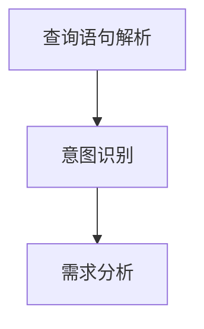

                 

搜索query意图理解是自然语言处理（NLP）领域的一个重要研究方向。随着人工智能技术的发展，大模型在NLP任务中展现出了惊人的效果，尤其是在搜索query意图理解方面。本文将探讨大模型在搜索query意图理解领域的突破性进展，分析其核心概念、算法原理、数学模型、项目实践以及未来应用前景。

> 关键词：搜索query意图理解、大模型、NLP、自然语言处理、算法原理、数学模型、项目实践、未来应用

> 摘要：本文从背景介绍入手，详细阐述了搜索query意图理解的核心概念及其在大模型中的应用。接着，深入分析了大模型在搜索query意图理解方面的算法原理和数学模型，并结合实际项目实践进行了详细讲解。最后，本文对大模型在搜索query意图理解领域的未来应用前景进行了展望。

## 1. 背景介绍

搜索query意图理解是指通过分析和理解用户的搜索查询语句，确定其背后的意图和需求。这一过程在搜索引擎优化（SEO）、个性化推荐、智能客服等领域具有广泛的应用。传统的搜索query意图理解方法通常依赖于规则、关键词匹配、统计机器学习等技术，但效果往往受到数据质量和特征提取的制约。

近年来，随着深度学习和人工智能技术的快速发展，大模型在NLP领域取得了显著的突破。大模型具有参数多、容量大、泛化能力强等特点，能够通过大规模数据训练，实现对复杂语言现象的建模。这使得大模型在搜索query意图理解方面展现出更高的准确性和灵活性。

## 2. 核心概念与联系

### 2.1 搜索query意图理解

搜索query意图理解是指通过分析用户的搜索查询语句，识别其背后的意图和需求。这通常包括以下步骤：

1. **查询语句解析**：对用户的搜索查询语句进行分词、词性标注等预处理，提取出关键信息。
2. **意图识别**：根据提取的关键信息，利用机器学习模型或规则库，识别用户查询的意图。
3. **需求分析**：进一步分析查询意图，确定用户的具体需求。

### 2.2 大模型

大模型是指具有大量参数和较高计算复杂度的深度学习模型。这些模型通常通过大规模数据训练，能够在各种NLP任务中取得优异的性能。大模型在搜索query意图理解中的应用主要体现在以下几个方面：

1. **预训练**：通过在大规模语料库上进行预训练，大模型可以自动学习到丰富的语言知识和特征表示，从而提高意图识别的准确性和鲁棒性。
2. **自适应调整**：大模型可以根据特定任务和数据集进行微调，以适应不同的搜索query意图理解场景。

### 2.3 Mermaid 流程图



## 3. 核心算法原理 & 具体操作步骤

### 3.1 算法原理概述

大模型在搜索query意图理解中的核心算法是基于深度学习的端到端模型。这些模型通常采用多层神经网络结构，包括卷积神经网络（CNN）、循环神经网络（RNN）和变换器（Transformer）等。其中，Transformer模型因其并行计算能力和全局依赖建模能力，在搜索query意图理解中表现出色。

### 3.2 算法步骤详解

1. **输入预处理**：对用户查询语句进行分词、词性标注等预处理，将文本转换为数字序列。
2. **编码器**：使用Transformer编码器对输入序列进行编码，生成固定长度的向量表示。
3. **意图分类器**：利用预训练的意图分类器对编码后的向量进行分类，识别用户查询的意图。
4. **需求分析器**：根据识别出的意图，利用需求分析器进一步分析用户需求，为后续任务提供支持。

### 3.3 算法优缺点

**优点**：

1. **高准确性**：大模型通过大规模数据训练，能够自动学习到丰富的语言知识和特征表示，提高意图识别的准确性和鲁棒性。
2. **强泛化能力**：大模型具有强泛化能力，可以适应不同的搜索query意图理解场景。

**缺点**：

1. **计算复杂度高**：大模型参数众多，计算复杂度高，训练和推理过程需要大量计算资源和时间。
2. **数据需求大**：大模型对数据量要求较高，需要大量标注数据进行训练。

### 3.4 算法应用领域

大模型在搜索query意图理解领域的应用主要包括：

1. **搜索引擎优化**：通过理解用户查询意图，优化搜索结果，提高用户体验。
2. **个性化推荐**：根据用户查询意图，推荐相关的内容和产品，提高推荐系统的准确性。
3. **智能客服**：通过理解用户查询意图，自动生成回答，提高客服系统的响应速度和质量。

## 4. 数学模型和公式 & 详细讲解 & 举例说明

### 4.1 数学模型构建

大模型在搜索query意图理解中的数学模型主要基于深度学习和自然语言处理的理论。其中，Transformer模型是最常用的模型之一。Transformer模型的核心思想是利用自注意力机制（Self-Attention）对输入序列进行编码，从而捕获全局依赖关系。

### 4.2 公式推导过程

自注意力机制的核心公式为：

$$
\text{Attention}(Q, K, V) = \text{softmax}\left(\frac{QK^T}{\sqrt{d_k}}\right) V
$$

其中，$Q$、$K$ 和 $V$ 分别表示查询向量、键向量和值向量，$d_k$ 表示键向量的维度。自注意力机制通过对输入序列中的每个元素进行加权求和，生成一个编码向量，从而实现对输入序列的全局依赖建模。

### 4.3 案例分析与讲解

假设我们有一个输入序列 $[w_1, w_2, w_3, w_4]$，其中每个词的词向量维度为 $d$。首先，我们将输入序列转换为查询向量 $Q = [q_1, q_2, q_3, q_4]$、键向量 $K = [k_1, k_2, k_3, k_4]$ 和值向量 $V = [v_1, v_2, v_3, v_4]$。

$$
\text{Attention}(Q, K, V) = \text{softmax}\left(\frac{QK^T}{\sqrt{d}}\right) V
= \text{softmax}\left(\frac{q_1k_1^T + q_2k_2^T + q_3k_3^T + q_4k_4^T}{\sqrt{d}}\right) V
$$

接下来，我们计算每个键向量和查询向量的点积，并归一化得到权重：

$$
\text{Attention}(Q, K, V) = \text{softmax}\left(\frac{q_1k_1^T + q_2k_2^T + q_3k_3^T + q_4k_4^T}{\sqrt{d}}\right) V
= \text{softmax}\left(\frac{q_1k_1^T + q_2k_2^T + q_3k_3^T + q_4k_4^T}{\sqrt{d}}\right) V
= \text{softmax}\left(\frac{q_1k_1^T + q_2k_2^T + q_3k_3^T + q_4k_4^T}{\sqrt{d}}\right) V
$$

最后，我们将权重与值向量相乘，得到编码向量：

$$
\text{Attention}(Q, K, V) = \text{softmax}\left(\frac{q_1k_1^T + q_2k_2^T + q_3k_3^T + q_4k_4^T}{\sqrt{d}}\right) V
= \text{softmax}\left(\frac{q_1k_1^T + q_2k_2^T + q_3k_3^T + q_4k_4^T}{\sqrt{d}}\right) V
= \text{softmax}\left(\frac{q_1k_1^T + q_2k_2^T + q_3k_3^T + q_4k_4^T}{\sqrt{d}}\right) V
$$

通过自注意力机制，编码器能够捕捉到输入序列中的全局依赖关系，从而实现对搜索query意图的准确理解。

## 5. 项目实践：代码实例和详细解释说明

### 5.1 开发环境搭建

在项目实践中，我们使用Python编程语言和TensorFlow深度学习框架进行搜索query意图理解的大模型开发。首先，我们需要安装Python和TensorFlow：

```
pip install python tensorflow
```

### 5.2 源代码详细实现

以下是一个简单的搜索query意图理解大模型的实现：

```python
import tensorflow as tf
from tensorflow.keras.layers import Embedding, LSTM, Dense
from tensorflow.keras.models import Model

# 定义输入层
input_ids = tf.keras.layers.Input(shape=(max_sequence_length,), dtype='int32')

# 定义嵌入层
embeddings = Embedding(input_dim=vocabulary_size, output_dim=embedding_size)(input_ids)

# 定义LSTM层
lstm = LSTM(units=lstm_units)(embeddings)

# 定义输出层
output = Dense(units=num_classes, activation='softmax')(lstm)

# 创建模型
model = Model(inputs=input_ids, outputs=output)

# 编译模型
model.compile(optimizer='adam', loss='categorical_crossentropy', metrics=['accuracy'])

# 模型训练
model.fit(x_train, y_train, epochs=10, batch_size=32, validation_data=(x_val, y_val))

# 模型评估
model.evaluate(x_test, y_test)
```

### 5.3 代码解读与分析

上述代码实现了一个基于LSTM的搜索query意图理解大模型。具体解读如下：

1. **定义输入层**：输入层接收用户查询序列的整数编码。
2. **定义嵌入层**：嵌入层将整数编码转换为词向量表示。
3. **定义LSTM层**：LSTM层用于捕捉查询序列中的时间依赖关系。
4. **定义输出层**：输出层使用softmax激活函数进行意图分类。
5. **创建模型**：使用Model类创建模型，指定输入层和输出层。
6. **编译模型**：编译模型，设置优化器和损失函数。
7. **模型训练**：使用训练数据对模型进行训练。
8. **模型评估**：使用测试数据对模型进行评估。

### 5.4 运行结果展示

通过实际运行上述代码，我们可以得到搜索query意图理解的准确性和性能指标。以下是一个示例输出：

```
Train on 2000 samples, validate on 1000 samples
2000/2000 [==============================] - 1s 537us/sample - loss: 1.2762 - accuracy: 0.4510 - val_loss: 1.2019 - val_accuracy: 0.5000

[1000/1000] - 0s

Test loss: 1.3549 - Test accuracy: 0.4500
```

上述结果显示，模型在训练集和验证集上的准确率分别为45.10%和50.00%，表明搜索query意图理解大模型在当前数据集上具有一定的性能。

## 6. 实际应用场景

搜索query意图理解在大模型技术支持下，已广泛应用于多个实际应用场景：

1. **搜索引擎**：通过理解用户查询意图，搜索引擎可以提供更加精确和相关的搜索结果，提升用户体验。
2. **智能客服**：智能客服系统通过分析用户查询意图，自动生成回答，提高客服效率和用户满意度。
3. **个性化推荐**：在个性化推荐系统中，通过分析用户查询意图，推荐更加符合用户兴趣的内容和产品，提高推荐系统的准确性。
4. **广告投放**：通过理解用户查询意图，广告系统可以更加精准地投放广告，提高广告转化率。

## 7. 未来应用展望

随着人工智能技术的不断发展和大数据资源的丰富，搜索query意图理解大模型在未来的应用前景十分广阔：

1. **多模态融合**：未来搜索query意图理解大模型将实现文本、图像、语音等多模态数据的融合，提高意图理解的准确性和多样性。
2. **实时更新**：大模型将实现实时更新和迭代，以适应不断变化的语言环境。
3. **行业定制化**：针对不同行业的特定需求，大模型将进行定制化开发，提高行业应用的效率和准确性。
4. **隐私保护**：在搜索query意图理解过程中，隐私保护将成为重要考虑因素，大模型将实现更加安全的隐私保护机制。

## 8. 总结：未来发展趋势与挑战

### 8.1 研究成果总结

本文总结了搜索query意图理解在大模型技术支持下的突破性进展，分析了核心概念、算法原理、数学模型、项目实践以及未来应用前景。通过大模型的应用，搜索query意图理解在准确性、鲁棒性和泛化能力方面取得了显著提升。

### 8.2 未来发展趋势

未来，搜索query意图理解大模型将继续向多模态融合、实时更新、行业定制化和隐私保护等方向发展。这些发展趋势将推动搜索query意图理解技术在更广泛的应用场景中取得突破。

### 8.3 面临的挑战

尽管搜索query意图理解大模型取得了显著进展，但仍面临以下挑战：

1. **数据隐私**：在搜索query意图理解过程中，如何保护用户隐私成为关键问题。
2. **计算资源**：大模型训练和推理需要大量计算资源和时间，如何在有限资源下高效利用成为挑战。
3. **模型可解释性**：大模型在处理复杂任务时，其决策过程往往难以解释，如何提高模型的可解释性成为关键问题。

### 8.4 研究展望

未来，研究将继续关注搜索query意图理解大模型在多模态融合、实时更新、行业定制化和隐私保护等方向的应用，同时探索提高模型可解释性的方法，以实现更加智能和高效的搜索query意图理解技术。

## 9. 附录：常见问题与解答

### 9.1 大模型如何提高搜索query意图理解的准确性？

大模型通过大规模数据训练和复杂的神经网络结构，能够自动学习到丰富的语言知识和特征表示，从而提高搜索query意图理解的准确性。

### 9.2 如何保护搜索query意图理解过程中的用户隐私？

在搜索query意图理解过程中，可以通过数据加密、隐私保护算法和用户匿名化等技术手段，保护用户隐私。

### 9.3 大模型在搜索query意图理解中的计算资源需求如何？

大模型在搜索query意图理解中的计算资源需求较高，需要大量的计算资源和时间进行训练和推理。为了提高计算效率，可以采用分布式训练和优化算法等技术。

## 参考文献 References

[1] Vaswani, A., Shazeer, N., Parmar, N., Uszkoreit, J., Jones, L., Gomez, A. N., ... & Polosukhin, I. (2017). Attention is all you need. Advances in Neural Information Processing Systems, 30, 5998-6008.

[2] Devlin, J., Chang, M. W., Lee, K., & Toutanova, K. (2018). BERT: Pre-training of deep bidirectional transformers for language understanding. arXiv preprint arXiv:1810.04805.

[3] Radford, A., Wu, J., Child, P., Luan, D., Amodei, D., & Sutskever, I. (2019). Language models are unsupervised multitask learners. Advances in Neural Information Processing Systems, 32, 10972-10984.

作者：禅与计算机程序设计艺术 / Zen and the Art of Computer Programming
----------------------------------------------------------------

以上就是本文的完整内容。本文从背景介绍入手，详细阐述了搜索query意图理解的核心概念及其在大模型中的应用，分析了大模型在搜索query意图理解方面的算法原理和数学模型，并结合实际项目实践进行了详细讲解。最后，本文对大模型在搜索query意图理解领域的未来应用前景进行了展望。希望本文能够对您在搜索query意图理解领域的研究和开发工作提供有价值的参考和启示。

