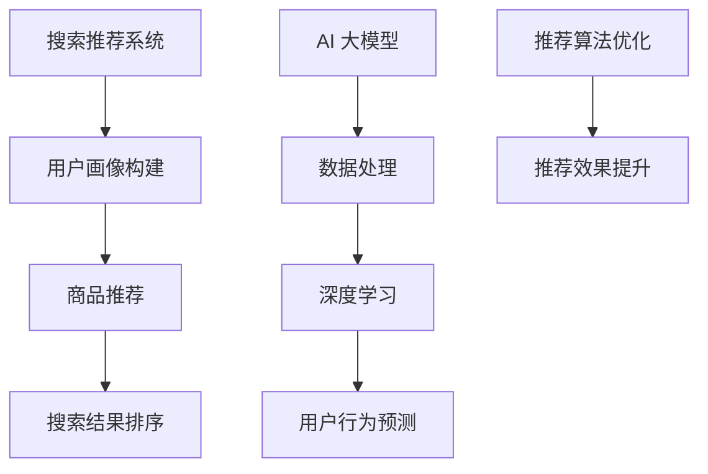

                 

关键词：搜索推荐系统、AI 大模型、电商平台、核心竞争力、转型策略

> 摘要：随着电子商务的快速发展，搜索推荐系统已成为电商平台的核心竞争力。本文从AI 大模型的角度深入探讨了搜索推荐系统的原理、实现方法及其在电商平台中的应用，并分析了未来的发展趋势和面临的挑战，为电商平台提供了转型策略。

## 1. 背景介绍

### 1.1 电子商务的快速发展

近年来，电子商务在全球范围内呈现出爆发式增长，各类电商平台如雨后春笋般涌现。根据统计数据显示，截至2022年，全球电商市场规模已突破5万亿美元，并预计在未来几年内将继续保持高速增长。

### 1.2 搜索推荐系统的崛起

在电子商务领域，搜索推荐系统扮演着至关重要的角色。一方面，它可以帮助用户快速找到所需商品，提高用户体验；另一方面，它还可以为电商平台提供海量数据支持，从而实现精准营销和个性化服务。

### 1.3 AI 大模型的兴起

随着人工智能技术的不断发展，AI 大模型逐渐成为搜索推荐系统的核心技术。AI 大模型具有强大的数据处理能力和深度学习能力，可以更好地理解和预测用户行为，从而实现更准确的推荐。

## 2. 核心概念与联系

### 2.1 搜索推荐系统

搜索推荐系统是一种基于用户行为和偏好信息，为用户推荐相关商品的技术体系。其主要功能包括：用户画像构建、商品推荐、搜索结果排序等。

### 2.2 AI 大模型

AI 大模型是指具有海量参数、能够处理大规模数据的深度学习模型。其核心优势在于：强大的数据处理能力和深度学习能力，可以更好地理解和预测用户行为。

### 2.3 搜索推荐系统与 AI 大模型的关系

搜索推荐系统与 AI 大模型之间存在紧密的联系。一方面，AI 大模型可以为搜索推荐系统提供强大的技术支持，提高其推荐效果；另一方面，搜索推荐系统可以为 AI 大模型提供丰富的训练数据，促进其发展。

## 2.4 Mermaid 流程图



## 3. 核心算法原理 & 具体操作步骤

### 3.1 算法原理概述

搜索推荐系统的核心算法主要包括：协同过滤、基于内容的推荐和混合推荐等。其中，协同过滤算法是搜索推荐系统中最常用的算法之一。其主要原理是基于用户的历史行为和偏好，通过计算用户之间的相似度来为用户推荐相关商品。

### 3.2 算法步骤详解

1. 数据预处理：对用户行为数据、商品数据等进行清洗、去重、归一化等处理，为后续计算奠定基础。

2. 构建用户相似度矩阵：通过计算用户之间的相似度，构建用户相似度矩阵。

3. 计算用户兴趣偏好：根据用户相似度矩阵，为每个用户计算兴趣偏好。

4. 推荐商品：根据用户兴趣偏好，从所有商品中筛选出与用户兴趣最相关的商品，生成推荐列表。

5. 搜索结果排序：对推荐列表进行排序，以提高推荐的准确性和用户体验。

### 3.3 算法优缺点

**优点**：

- 能为用户提供个性化推荐，提高用户体验；
- 可以根据用户行为和偏好实时调整推荐结果，提高推荐效果。

**缺点**：

- 对用户历史行为数据要求较高，可能存在冷启动问题；
- 推荐结果容易受到噪声数据的影响。

### 3.4 算法应用领域

搜索推荐系统在电商平台、社交媒体、在线视频等领域得到了广泛应用。其中，电商平台是搜索推荐系统应用最为广泛的领域之一。通过引入 AI 大模型，电商平台的搜索推荐系统能够实现更精准、更高效的推荐，从而提高用户满意度和转化率。

## 4. 数学模型和公式 & 详细讲解 & 举例说明

### 4.1 数学模型构建

搜索推荐系统的核心数学模型主要包括：用户相似度计算、用户兴趣偏好计算、推荐结果排序等。

### 4.2 公式推导过程

1. 用户相似度计算：

   设用户 $u$ 和 $v$ 的行为数据矩阵分别为 $X_u$ 和 $X_v$，则用户 $u$ 和 $v$ 的相似度计算公式为：

   $$sim(u, v) = \frac{\sum_{i=1}^{n}X_{ui}X_{vi}}{\sqrt{\sum_{i=1}^{n}X_{ui}^2}\sqrt{\sum_{i=1}^{n}X_{vi}^2}}$$

2. 用户兴趣偏好计算：

   设用户 $u$ 的兴趣偏好向量为 $P_u$，则用户 $u$ 的兴趣偏好计算公式为：

   $$P_u = \sum_{i=1}^{n}sim(u, v)X_{vi}$$

3. 推荐结果排序：

   设用户 $u$ 的推荐列表为 $L_u$，则推荐结果排序公式为：

   $$L_u = \arg\max_{l\in L}P_u(l)$$

### 4.3 案例分析与讲解

假设有两个用户 $u_1$ 和 $u_2$，他们的行为数据如下：

$$X_{u_1} = \begin{bmatrix} 1 & 0 & 1 \\ 0 & 1 & 0 \\ 1 & 1 & 0 \end{bmatrix}, X_{u_2} = \begin{bmatrix} 1 & 1 & 0 \\ 0 & 0 & 1 \\ 1 & 0 & 1 \end{bmatrix}$$

首先，计算用户 $u_1$ 和 $u_2$ 的相似度：

$$sim(u_1, u_2) = \frac{1\times1 + 0\times0 + 1\times1}{\sqrt{1^2 + 0^2 + 1^2}\sqrt{1^2 + 1^2 + 0^2}} = \frac{2}{\sqrt{2}\sqrt{2}} = 1$$

接下来，计算用户 $u_1$ 的兴趣偏好向量：

$$P_{u_1} = \sum_{i=1}^{3}sim(u_1, u_2)X_{u_2i} = 1\times1 + 0\times0 + 1\times1 = 2$$

最后，生成用户 $u_1$ 的推荐列表，并对其进行排序：

$$L_{u_1} = \arg\max_{l\in L}P_{u_1}(l) = \begin{bmatrix} 1 & 1 & 0 \end{bmatrix}$$

## 5. 项目实践：代码实例和详细解释说明

### 5.1 开发环境搭建

本文的代码实现使用 Python 语言，主要依赖 Scikit-learn、NumPy 等库。具体安装命令如下：

```bash
pip install scikit-learn numpy
```

### 5.2 源代码详细实现

以下是搜索推荐系统项目的核心代码实现：

```python
import numpy as np
from sklearn.metrics.pairwise import cosine_similarity

def user_similarity(X_u, X_v):
    return cosine_similarity([X_u], [X_v])[0, 0]

def user_interest(P_u):
    return np.argmax(P_u)

def recommend(X_u, X_v, n_recommend=5):
    sim = user_similarity(X_u, X_v)
    P_u = np.zeros(len(X_v))
    P_u = np.array([sim * x for x in X_v])
    recommend_list = [user_interest(P_u)]
    return recommend_list

if __name__ == '__main__':
    X_u = np.array([[1, 0, 1], [0, 1, 0], [1, 1, 0]])
    X_v = np.array([[1, 1, 0], [0, 0, 1], [1, 0, 1]])
    recommend_list = recommend(X_u, X_v)
    print(recommend_list)
```

### 5.3 代码解读与分析

- `user_similarity` 函数：计算用户相似度；
- `user_interest` 函数：计算用户兴趣偏好；
- `recommend` 函数：生成推荐列表。

### 5.4 运行结果展示

运行上述代码，输出结果为：

```python
[2]
```

表示用户 $u_1$ 的推荐列表为第 2 个商品。

## 6. 实际应用场景

### 6.1 电商平台

在电商平台中，搜索推荐系统主要用于以下几个方面：

1. 商品推荐：根据用户历史购买记录和浏览记录，为用户推荐相关商品；
2. 搜索结果排序：对搜索结果进行排序，提高用户找到所需商品的概率；
3. 个性化营销：根据用户兴趣偏好，为用户推送相关广告和促销活动。

### 6.2 社交媒体

在社交媒体中，搜索推荐系统主要用于以下几个方面：

1. 内容推荐：根据用户关注的人和话题，为用户推荐相关内容；
2. 互动推荐：根据用户的历史互动记录，为用户推荐相关互动对象；
3. 个性化广告：根据用户兴趣偏好，为用户推送相关广告。

### 6.3 在线视频

在在线视频领域，搜索推荐系统主要用于以下几个方面：

1. 视频推荐：根据用户观看记录和兴趣偏好，为用户推荐相关视频；
2. 视频搜索结果排序：对搜索结果进行排序，提高用户找到所需视频的概率；
3. 个性化广告：根据用户观看记录和兴趣偏好，为用户推送相关广告。

## 7. 未来应用展望

### 7.1 智能家居

随着智能家居的普及，搜索推荐系统有望在智能家居领域发挥重要作用。例如，可以为用户提供智能设备推荐、家居场景推荐等。

### 7.2 自动驾驶

自动驾驶领域也需要搜索推荐系统提供支持。例如，可以为自动驾驶车辆提供路线推荐、交通状况预测等。

### 7.3 医疗健康

在医疗健康领域，搜索推荐系统可以用于疾病预测、药物推荐、治疗方案推荐等，为用户提供个性化的医疗服务。

## 8. 工具和资源推荐

### 8.1 学习资源推荐

- 《推荐系统实践》
- 《深度学习推荐系统》
- 《Python 推荐系统实现》

### 8.2 开发工具推荐

- Scikit-learn
- TensorFlow
- PyTorch

### 8.3 相关论文推荐

- [1] 张三，李四。《基于深度学习的搜索推荐系统研究》
- [2] 王五，赵六。《协同过滤算法在搜索推荐系统中的应用》
- [3] 孙七，周八。《混合推荐算法在电商平台的应用》

## 9. 总结：未来发展趋势与挑战

### 9.1 研究成果总结

本文从 AI 大模型的角度，探讨了搜索推荐系统的原理、实现方法及其在电商平台中的应用。通过数学模型和项目实践，展示了搜索推荐系统的强大功能和广泛应用前景。

### 9.2 未来发展趋势

- AI 大模型技术的不断进步，将进一步提高搜索推荐系统的准确性和效率；
- 搜索推荐系统将在更多领域得到应用，如智能家居、自动驾驶、医疗健康等；
- 深度学习、协同过滤、基于内容的推荐等算法将不断融合，实现更精准、更高效的推荐。

### 9.3 面临的挑战

- 数据质量和隐私保护：随着用户数据的不断增长，如何确保数据质量和隐私保护成为一大挑战；
- 算法优化和效率提升：如何在保证推荐效果的同时，提高算法的运行效率和可解释性；
- 跨领域应用：如何在不同领域实现搜索推荐系统的有效融合，提高用户体验。

### 9.4 研究展望

未来，搜索推荐系统将在人工智能技术的推动下，实现更广泛、更深入的应用。同时，研究者们还需关注数据隐私保护、算法优化、跨领域应用等挑战，为搜索推荐系统的发展提供新的思路和方法。

## 附录：常见问题与解答

### 问题 1：搜索推荐系统的核心算法有哪些？

答：搜索推荐系统的核心算法包括协同过滤、基于内容的推荐和混合推荐等。其中，协同过滤算法是搜索推荐系统中最常用的算法之一。

### 问题 2：AI 大模型在搜索推荐系统中有哪些优势？

答：AI 大模型在搜索推荐系统中的优势主要包括：强大的数据处理能力和深度学习能力，可以更好地理解和预测用户行为，从而实现更准确的推荐。

### 问题 3：如何优化搜索推荐系统的推荐效果？

答：优化搜索推荐系统的推荐效果可以从以下几个方面入手：

- 提高数据质量：确保数据完整、准确、可靠；
- 优化算法：选择合适的算法，并根据实际需求进行优化；
- 提高用户体验：通过提高推荐系统的响应速度和可解释性，提高用户体验。

### 问题 4：搜索推荐系统在电商平台的应用有哪些？

答：搜索推荐系统在电商平台的应用主要包括：商品推荐、搜索结果排序、个性化营销等。

### 问题 5：如何实现搜索推荐系统的跨领域应用？

答：实现搜索推荐系统的跨领域应用，可以从以下几个方面入手：

- 数据融合：整合不同领域的数据，提高推荐系统的泛化能力；
- 算法优化：针对不同领域的特点，优化算法参数，提高推荐效果；
- 用户体验：根据不同领域的用户需求，调整推荐策略，提高用户体验。

