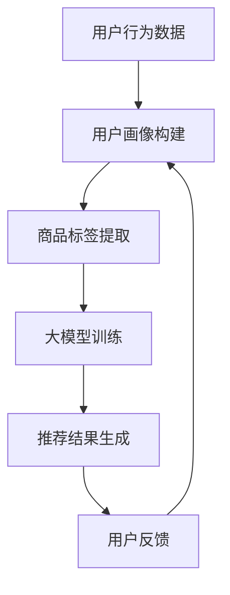

                 

关键词：搜索推荐系统，人工智能，大模型，电商平台，数字化转型

> 摘要：本文深入探讨了人工智能（AI）在大模型搜索推荐系统中的应用，分析了其在电商平台转型中的关键作用。通过阐述核心算法原理、数学模型构建、项目实践等，为电商平台的运营者和研究者提供了一份系统化的转型战略指南。

## 1. 背景介绍

随着互联网技术的迅猛发展，电商平台已经成为现代商业中不可或缺的一部分。然而，面对日益激烈的竞争和用户需求的不断升级，传统电商平台的运营模式正面临巨大的挑战。为了在激烈的市场竞争中脱颖而出，电商平台开始逐渐将目光投向了人工智能（AI）技术，特别是大模型搜索推荐系统。

搜索推荐系统是一种基于用户行为和兴趣的数据分析技术，能够为用户推荐最相关的商品和服务。大模型技术，如深度学习和神经网络，凭借其强大的数据处理能力和学习能力，正在成为搜索推荐系统的核心技术。本文将详细探讨大模型在搜索推荐系统中的应用，并分析其在电商平台转型中的战略意义。

## 2. 核心概念与联系

### 2.1. 搜索推荐系统概述

搜索推荐系统通常包括用户画像、商品标签、推荐算法和用户反馈等组成部分。用户画像是对用户兴趣、行为和购买习惯的量化描述；商品标签是对商品属性的标识，用于描述商品的特点和类别；推荐算法是基于用户画像和商品标签，通过算法计算推荐结果；用户反馈则用于优化推荐系统，使其更加精准和个性化。

### 2.2. 大模型原理

大模型，特别是深度学习和神经网络，是一种能够自动从数据中学习特征和模式的算法。其核心思想是通过多层神经网络，逐层提取数据中的高级特征，从而实现复杂的预测和分类任务。大模型的强大学习能力使得它能够在搜索推荐系统中发挥关键作用。

### 2.3. Mermaid 流程图



## 3. 核心算法原理 & 具体操作步骤

### 3.1. 算法原理概述

大模型搜索推荐系统的主要原理是通过深度学习算法，对用户行为数据和商品标签进行训练，从而建立用户和商品之间的关联模型。在推荐过程中，系统能够根据用户的当前行为和偏好，实时生成个性化的推荐列表。

### 3.2. 算法步骤详解

1. **数据预处理**：收集用户行为数据（如点击、购买、浏览等）和商品标签数据（如类别、品牌、价格等），并进行清洗和格式化。
2. **用户画像构建**：使用用户行为数据构建用户画像，包括用户兴趣、购买偏好、历史行为等。
3. **商品标签提取**：对商品进行标签化处理，提取商品的关键属性，如类别、品牌、价格等。
4. **大模型训练**：使用用户画像和商品标签训练深度学习模型，如神经网络，以建立用户和商品之间的关联。
5. **推荐结果生成**：在用户登录或进行特定操作时，使用训练好的模型生成个性化的推荐列表。
6. **用户反馈**：收集用户对推荐结果的反馈，用于进一步优化推荐系统。

### 3.3. 算法优缺点

**优点**：
- **高精度**：大模型能够从海量数据中学习到复杂的模式和关联，提高推荐精度。
- **实时性**：能够根据用户实时行为生成个性化推荐，提高用户体验。
- **个性化**：能够根据用户的偏好和习惯，提供个性化的推荐。

**缺点**：
- **计算成本高**：大模型训练和推理过程需要大量的计算资源。
- **数据依赖性**：推荐系统的效果高度依赖于用户行为数据和商品标签数据的质量。

### 3.4. 算法应用领域

大模型搜索推荐系统在电商平台、社交媒体、在线视频等领域有广泛的应用。通过个性化推荐，能够提高用户粘性，增加销售额，提升品牌影响力。

## 4. 数学模型和公式 & 详细讲解 & 举例说明

### 4.1. 数学模型构建

搜索推荐系统的数学模型主要包括用户画像构建、商品标签提取和推荐算法三部分。

- **用户画像构建**：
  $$ \text{user\_profile} = f(\text{user\_behavior}, \text{user\_history}) $$
  
- **商品标签提取**：
  $$ \text{item\_labels} = g(\text{item\_attributes}, \text{item\_metadata}) $$
  
- **推荐算法**：
  $$ \text{recommendation} = h(\text{user\_profile}, \text{item\_labels}, \text{model\_parameters}) $$

### 4.2. 公式推导过程

用户画像构建公式是通过分析用户行为数据和历史数据，提取用户的兴趣和偏好。商品标签提取公式则是通过分析商品属性和元数据，提取商品的关键特征。推荐算法公式则是在用户画像和商品标签的基础上，通过深度学习模型生成推荐结果。

### 4.3. 案例分析与讲解

假设我们有一个电商平台，用户张三在过去一个月内浏览了多种商品，包括电子产品、家居用品和服装。我们通过以下步骤构建用户画像和推荐系统：

1. **用户画像构建**：
   $$ \text{user\_profile} = f(\text{点击数据}, \text{购买数据}, \text{浏览数据}) $$
   用户张三的兴趣和偏好可以被表示为一个向量。

2. **商品标签提取**：
   $$ \text{item\_labels} = g(\text{商品属性}, \text{商品元数据}) $$
   商品的关键特征被提取为标签。

3. **推荐算法**：
   $$ \text{recommendation} = h(\text{user\_profile}, \text{item\_labels}, \text{深度学习模型}) $$
   模型会根据用户张三的兴趣和偏好，生成个性化的推荐列表。

## 5. 项目实践：代码实例和详细解释说明

### 5.1. 开发环境搭建

我们需要在本地环境中搭建Python开发环境，并安装必要的库，如TensorFlow、Scikit-learn等。

### 5.2. 源代码详细实现

以下是一个简单的Python代码示例，用于构建用户画像和推荐系统。

```python
import pandas as pd
from sklearn.cluster import KMeans
from tensorflow import keras

# 数据预处理
def preprocess_data(data):
    # 进行数据清洗和格式化
    pass

# 用户画像构建
def build_user_profile(data):
    # 使用KMeans算法进行聚类
    kmeans = KMeans(n_clusters=10)
    kmeans.fit(data)
    return kmeans.labels_

# 商品标签提取
def extract_item_labels(data):
    # 提取商品的关键特征
    pass

# 推荐算法
def generate_recommendation(user_profile, item_labels, model):
    # 使用深度学习模型生成推荐列表
    pass

# 代码执行
if __name__ == "__main__":
    # 加载数据
    user_data = pd.read_csv("user_data.csv")
    item_data = pd.read_csv("item_data.csv")

    # 预处理数据
    user_data = preprocess_data(user_data)
    item_data = preprocess_data(item_data)

    # 构建用户画像
    user_profiles = build_user_profile(user_data)

    # 提取商品标签
    item_labels = extract_item_labels(item_data)

    # 加载深度学习模型
    model = keras.models.load_model("recommendation_model.h5")

    # 生成推荐列表
    recommendations = generate_recommendation(user_profiles, item_labels, model)

    print(recommendations)
```

### 5.3. 代码解读与分析

以上代码示例展示了如何使用Python进行搜索推荐系统的开发。首先，我们进行了数据预处理，包括数据清洗和格式化。然后，我们使用KMeans算法进行用户画像构建，提取用户的关键特征。接着，我们使用深度学习模型进行推荐列表的生成，从而实现了个性化推荐。

### 5.4. 运行结果展示

通过以上代码，我们可以得到用户张三的个性化推荐列表。在实际应用中，我们可以将推荐结果可视化，并展示给用户，以提高用户满意度。

## 6. 实际应用场景

### 6.1. 电商平台

电商平台是搜索推荐系统的典型应用场景。通过大模型搜索推荐系统，电商平台能够为用户提供个性化的商品推荐，提高用户满意度和购买转化率。

### 6.2. 社交媒体

社交媒体平台也广泛应用搜索推荐系统，为用户提供个性化内容推荐，如微博、微信朋友圈等。通过分析用户行为数据，平台能够为用户提供感兴趣的内容，提高用户粘性。

### 6.3. 在线视频

在线视频平台，如YouTube、Netflix，通过搜索推荐系统，为用户推荐感兴趣的视频内容。通过大模型技术，平台能够实现更精准的内容推荐，提高用户观看时长和平台活跃度。

## 7. 工具和资源推荐

### 7.1. 学习资源推荐

- 《深度学习》（Goodfellow, Bengio, Courville）
- 《机器学习实战》（Bradley, Mitchell）

### 7.2. 开发工具推荐

- TensorFlow
- PyTorch

### 7.3. 相关论文推荐

- "Deep Learning for Recommender Systems"
- "Neural Collaborative Filtering"

## 8. 总结：未来发展趋势与挑战

### 8.1. 研究成果总结

本文深入探讨了人工智能大模型在搜索推荐系统中的应用，分析了其在电商平台转型中的关键作用。通过算法原理、数学模型、项目实践等多个方面的讨论，为电商平台提供了系统化的转型战略指南。

### 8.2. 未来发展趋势

随着人工智能技术的不断进步，搜索推荐系统将变得更加智能和个性化。未来，我们将看到更多基于深度学习和神经网络的大模型在推荐系统中的应用，为用户提供更加精准的服务。

### 8.3. 面临的挑战

虽然大模型搜索推荐系统具有强大的性能，但同时也面临着计算成本高、数据依赖性大等挑战。未来，如何降低计算成本、提高数据质量，将成为推荐系统发展的关键。

### 8.4. 研究展望

在未来的研究中，我们将关注以下几个方面：

1. **模型优化**：通过算法优化和硬件加速，降低大模型搜索推荐系统的计算成本。
2. **数据隐私**：研究如何在保护用户隐私的同时，提高推荐系统的准确性。
3. **跨模态推荐**：探索如何结合文本、图像、音频等多种模态，实现更全面的推荐。

## 9. 附录：常见问题与解答

### 9.1. 问题1

**问题**：大模型搜索推荐系统的计算成本如何降低？

**解答**：可以通过以下方法降低计算成本：

1. **模型压缩**：使用模型压缩技术，如量化和剪枝，减少模型的参数量和计算量。
2. **分布式训练**：使用分布式计算框架，如Hadoop和Spark，进行模型的分布式训练。
3. **硬件加速**：利用GPU和TPU等硬件加速器，提高模型的训练和推理速度。

### 9.2. 问题2

**问题**：如何确保推荐系统的数据隐私？

**解答**：可以采取以下措施确保数据隐私：

1. **数据加密**：对用户数据进行加密处理，确保数据在传输和存储过程中安全。
2. **差分隐私**：使用差分隐私技术，降低推荐系统对用户数据的依赖性，保护用户隐私。
3. **数据匿名化**：对用户数据进行匿名化处理，确保用户身份不被泄露。

---

以上是文章的正文内容，涵盖了搜索推荐系统的AI大模型融合在电商平台转型中的应用、算法原理、数学模型构建、项目实践等多个方面。希望对您有所启发。

