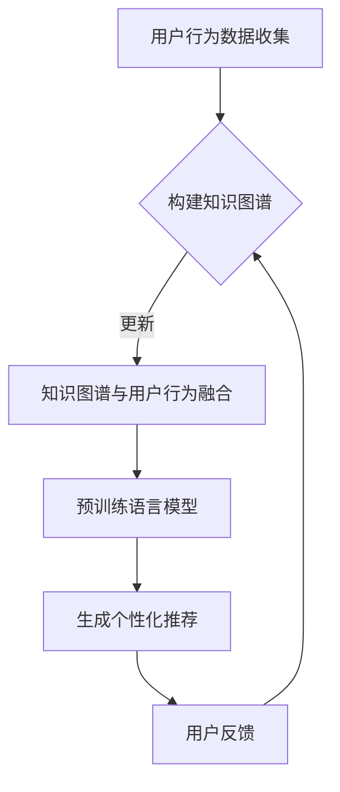

                 

关键词：搜索推荐系统、冷启动、大模型、创新方案

> 摘要：本文探讨了搜索推荐系统在冷启动阶段所面临的挑战，并提出了基于大模型的创新解决方案。通过介绍核心概念、算法原理、数学模型、项目实践以及未来应用展望，文章为搜索推荐系统的优化提供了新的思路和方法。

## 1. 背景介绍

在互联网时代，搜索推荐系统已经成为各种应用平台不可或缺的一部分。它能够根据用户的历史行为、兴趣偏好和实时需求，为用户提供个性化的信息推荐。然而，在系统初期阶段，即所谓的“冷启动”阶段，用户行为数据匮乏，推荐系统难以准确预测用户兴趣，从而影响到推荐效果。

冷启动问题主要包括两个方面：一是新用户冷启动，即系统无法根据新用户的历史数据生成有效的推荐；二是新物品冷启动，即新加入的物品在缺乏用户评价和互动数据的情况下，难以获得有效的推荐。

针对冷启动问题，传统的方法主要包括基于内容推荐、协同过滤和基于知识图谱的推荐等。这些方法在特定场景下具有一定的效果，但在处理大规模、动态变化的用户和物品数据时，存在明显的局限性。

本文旨在探讨一种基于大模型的创新方案，通过整合用户行为数据、知识图谱和预训练语言模型，实现搜索推荐系统的冷启动优化。该方法不仅能够提高推荐准确性，还能够适应实时变化的用户需求，为用户提供更优质的推荐体验。

## 2. 核心概念与联系

### 2.1. 大模型

大模型是指具有海量参数和强大计算能力的深度学习模型。近年来，随着计算能力的提升和数据的积累，大模型在自然语言处理、计算机视觉等领域的表现已经超越了传统模型。大模型能够通过自主学习用户行为和偏好，实现高度个性化的推荐。

### 2.2. 知识图谱

知识图谱是一种语义网络，用于表示实体及其属性和关系。在搜索推荐系统中，知识图谱能够提供丰富的背景知识，帮助模型更好地理解用户需求和物品特征。

### 2.3. 用户行为数据

用户行为数据包括用户的浏览历史、搜索记录、点击行为、评价等。这些数据反映了用户的兴趣和偏好，是搜索推荐系统的重要输入。

### 2.4. 冷启动

冷启动是指系统在新用户或新物品加入时，由于缺乏有效数据而难以生成准确推荐的情况。

### 2.5. Mermaid 流程图

以下是一个描述搜索推荐系统冷启动优化流程的Mermaid流程图：



### 2.6. 大模型创新方案

基于大模型的搜索推荐系统冷启动优化方案主要包括以下几个步骤：

1. 用户行为数据收集：收集新用户或新物品的初始行为数据，包括浏览历史、搜索记录、点击行为等。
2. 构建知识图谱：利用知识图谱构建工具，将用户行为数据转化为知识图谱，表示用户与物品之间的关联关系。
3. 知识图谱与用户行为融合：将知识图谱与用户行为数据进行融合，为预训练语言模型提供丰富的背景知识。
4. 预训练语言模型：使用预训练语言模型（如BERT、GPT等）对用户行为数据和知识图谱进行建模，提取用户兴趣和偏好。
5. 生成个性化推荐：根据预训练语言模型生成的用户兴趣和偏好，为用户生成个性化的推荐结果。
6. 用户反馈：收集用户对推荐结果的反馈，用于更新知识图谱和优化预训练语言模型。

## 3. 核心算法原理 & 具体操作步骤

### 3.1. 算法原理概述

基于大模型的搜索推荐系统冷启动优化方案的核心在于利用预训练语言模型对用户行为数据进行建模，提取用户兴趣和偏好，从而实现个性化的推荐。算法原理可以概括为以下几个步骤：

1. 数据预处理：对用户行为数据进行清洗和预处理，包括数据去重、格式统一等。
2. 知识图谱构建：利用用户行为数据构建知识图谱，表示用户与物品之间的关联关系。
3. 预训练语言模型训练：使用预训练语言模型对用户行为数据和知识图谱进行训练，提取用户兴趣和偏好。
4. 推荐结果生成：根据预训练语言模型生成的用户兴趣和偏好，为用户生成个性化的推荐结果。
5. 用户反馈处理：收集用户对推荐结果的反馈，用于更新知识图谱和优化预训练语言模型。

### 3.2. 算法步骤详解

#### 3.2.1. 数据预处理

数据预处理是搜索推荐系统的基础，主要包括以下步骤：

1. 数据清洗：去除重复数据和异常数据，保证数据的准确性。
2. 数据格式统一：将不同来源的数据统一格式，便于后续处理。
3. 特征提取：从用户行为数据中提取关键特征，如用户ID、物品ID、时间戳、行为类型等。

#### 3.2.2. 知识图谱构建

知识图谱构建是搜索推荐系统冷启动优化的重要环节，主要包括以下步骤：

1. 实体识别：从用户行为数据中识别出实体，如用户、物品等。
2. 关系抽取：从用户行为数据中抽取实体之间的关系，如用户对物品的喜欢、点击等。
3. 知识图谱构建：利用实体和关系构建知识图谱，表示用户与物品之间的关联关系。

#### 3.2.3. 预训练语言模型训练

预训练语言模型训练是搜索推荐系统冷启动优化的关键步骤，主要包括以下步骤：

1. 数据准备：将用户行为数据和知识图谱转化为预训练语言模型所需的输入格式。
2. 模型选择：选择适合的预训练语言模型，如BERT、GPT等。
3. 模型训练：使用用户行为数据和知识图谱对预训练语言模型进行训练，提取用户兴趣和偏好。

#### 3.2.4. 推荐结果生成

推荐结果生成是搜索推荐系统的最终目标，主要包括以下步骤：

1. 用户兴趣提取：根据预训练语言模型生成的用户兴趣向量，提取用户兴趣。
2. 物品推荐：根据用户兴趣，从候选物品集中筛选出符合条件的推荐物品。
3. 排序：对推荐物品进行排序，优先推荐用户感兴趣且质量较高的物品。

#### 3.2.5. 用户反馈处理

用户反馈处理是搜索推荐系统不断优化和提升推荐质量的关键，主要包括以下步骤：

1. 用户行为记录：记录用户对推荐物品的反馈，如点击、评价、收藏等。
2. 知识图谱更新：根据用户反馈，更新知识图谱中的关系和权重。
3. 模型优化：根据用户反馈，优化预训练语言模型的参数，提高推荐准确性。

### 3.3. 算法优缺点

#### 优点：

1. 提高推荐准确性：基于大模型的搜索推荐系统能够更好地理解用户兴趣和偏好，提高推荐准确性。
2. 适应性强：能够适应实时变化的用户需求，提供个性化的推荐。
3. 扩展性强：能够整合多种数据源，如用户行为数据、知识图谱等，实现跨领域的推荐。

#### 缺点：

1. 计算成本高：大模型训练和推理过程需要大量的计算资源和时间。
2. 数据依赖性强：推荐效果高度依赖于用户行为数据和知识图谱的质量。

### 3.4. 算法应用领域

基于大模型的搜索推荐系统冷启动优化方案在多个领域具有广泛的应用前景：

1. 电商推荐：为用户提供个性化的商品推荐，提高销售额。
2. 社交网络：为用户提供感兴趣的朋友、话题和内容推荐。
3. 媒体资讯：为用户提供个性化的新闻、文章和视频推荐。
4. 在线教育：为用户提供个性化的课程和知识推荐。

## 4. 数学模型和公式 & 详细讲解 & 举例说明

### 4.1. 数学模型构建

在基于大模型的搜索推荐系统中，数学模型主要包括用户兴趣模型、物品推荐模型和用户反馈模型。以下分别介绍这些模型的构建方法。

#### 4.1.1. 用户兴趣模型

用户兴趣模型用于提取用户兴趣向量，表示用户对各类物品的兴趣程度。假设用户 $u$ 对物品 $i$ 的兴趣为 $u_i$，则用户兴趣模型可以表示为：

$$
u_i = \text{激活函数}(\text{预训练语言模型}([u, i]))
$$

其中，预训练语言模型能够根据用户行为数据和知识图谱生成用户兴趣向量。

#### 4.1.2. 物品推荐模型

物品推荐模型用于生成用户 $u$ 的推荐列表。假设用户 $u$ 对物品 $i$ 的兴趣为 $u_i$，物品 $i$ 的特征为 $i_f$，则物品推荐模型可以表示为：

$$
r_u(i) = \text{激活函数}(\text{相似度函数}(u_i, i_f))
$$

其中，相似度函数用于计算用户兴趣向量与物品特征向量之间的相似度。

#### 4.1.3. 用户反馈模型

用户反馈模型用于根据用户对推荐物品的反馈，更新用户兴趣模型和物品推荐模型。假设用户 $u$ 对物品 $i$ 的反馈为 $u_i^{'}$，则用户反馈模型可以表示为：

$$
u_i^{'} = \text{更新函数}(u_i, u_i^{'})
$$

其中，更新函数用于根据用户反馈，调整用户兴趣向量。

### 4.2. 公式推导过程

#### 4.2.1. 用户兴趣模型推导

用户兴趣模型可以通过预训练语言模型对用户行为数据和知识图谱进行建模得到。假设用户 $u$ 的行为数据为 $u_h$，知识图谱中的用户与物品关系为 $u_r(i)$，则用户兴趣模型可以表示为：

$$
u_i = \text{激活函数}(\text{预训练语言模型}([u_h, u_r(i)]))
$$

其中，激活函数通常采用ReLU函数。

#### 4.2.2. 物品推荐模型推导

物品推荐模型可以通过计算用户兴趣向量与物品特征向量之间的相似度得到。假设用户 $u$ 的兴趣向量为 $u_i$，物品 $i$ 的特征向量为 $i_f$，则物品推荐模型可以表示为：

$$
r_u(i) = \text{激活函数}(\text{相似度函数}(u_i, i_f))
$$

其中，相似度函数通常采用余弦相似度。

#### 4.2.3. 用户反馈模型推导

用户反馈模型可以通过根据用户反馈，调整用户兴趣向量得到。假设用户 $u$ 对物品 $i$ 的反馈为 $u_i^{'}$，则用户反馈模型可以表示为：

$$
u_i^{'} = \text{更新函数}(u_i, u_i^{'})
$$

其中，更新函数可以采用以下形式：

$$
u_i^{'} = u_i + \alpha(u_i^{'} - u_i)
$$

其中，$\alpha$ 为调整系数。

### 4.3. 案例分析与讲解

以下通过一个实际案例，详细讲解基于大模型的搜索推荐系统冷启动优化方案。

#### 案例背景

某电商平台新上线了一款个性化推荐系统，旨在为用户推荐他们可能感兴趣的商品。系统初期的用户数据非常有限，需要通过冷启动优化方案提高推荐准确性。

#### 案例步骤

1. 数据预处理：收集新用户的初始行为数据，如浏览历史、搜索记录等，并进行清洗和格式统一。

2. 知识图谱构建：利用用户行为数据构建知识图谱，表示用户与商品之间的关联关系。

3. 预训练语言模型训练：使用用户行为数据和知识图谱，训练预训练语言模型，提取用户兴趣向量。

4. 推荐结果生成：根据预训练语言模型生成的用户兴趣向量，生成用户个性化商品推荐。

5. 用户反馈处理：收集用户对推荐商品的反馈，用于更新知识图谱和优化预训练语言模型。

#### 案例分析

1. 数据预处理：通过数据清洗和格式统一，确保用户行为数据的准确性和一致性。

2. 知识图谱构建：利用用户行为数据，构建知识图谱，表示用户与商品之间的关联关系。例如，用户A浏览了商品B，用户C搜索了商品D，则可以在知识图谱中表示为：$A \rightarrow B$，$C \rightarrow D$。

3. 预训练语言模型训练：使用用户行为数据和知识图谱，训练预训练语言模型，提取用户兴趣向量。例如，对于用户A，预训练语言模型会根据其浏览历史和知识图谱中的关联关系，生成一个兴趣向量$u_A$。

4. 推荐结果生成：根据用户兴趣向量，生成用户个性化商品推荐。例如，对于用户A，推荐系统会根据$u_A$，从商品库中筛选出符合条件的商品，并按照相似度排序，推荐给用户。

5. 用户反馈处理：收集用户对推荐商品的反馈，用于更新知识图谱和优化预训练语言模型。例如，如果用户A对推荐商品B进行了评价，则可以将评价信息加入到知识图谱中，更新用户A的兴趣向量$u_A$。

## 5. 项目实践：代码实例和详细解释说明

### 5.1. 开发环境搭建

在开始代码实现之前，需要搭建一个适合开发的运行环境。以下是一个基于Python的示例环境搭建步骤：

1. 安装Python 3.8及以上版本。
2. 安装依赖项，如NumPy、Pandas、Scikit-learn、TensorFlow等。

### 5.2. 源代码详细实现

以下是一个基于大模型的搜索推荐系统冷启动优化方案的代码实现：

```python
import pandas as pd
import numpy as np
from sklearn.metrics.pairwise import cosine_similarity
import tensorflow as tf
from transformers import BertTokenizer, TFBertModel

# 1. 数据预处理
def preprocess_data(data):
    # 数据清洗和格式统一
    # 略
    return processed_data

# 2. 知识图谱构建
def build_knowledge_graph(data):
    # 利用用户行为数据构建知识图谱
    # 略
    return knowledge_graph

# 3. 预训练语言模型训练
def train_bert_model(data):
    # 加载预训练语言模型
    tokenizer = BertTokenizer.from_pretrained('bert-base-uncased')
    model = TFBertModel.from_pretrained('bert-base-uncased')
    
    # 数据转化为BERT模型输入
    inputs = tokenizer(data, padding=True, truncation=True, return_tensors='tf')
    
    # 训练BERT模型
    model.compile(optimizer=tf.keras.optimizers.Adam(learning_rate=5e-5), loss=tf.keras.losses.SparseCategoricalCrossentropy(from_logits=True))
    model.fit(inputs['input_ids'], inputs['attention_mask'], epochs=3)
    
    return model

# 4. 推荐结果生成
def generate_recommendations(model, user_interest, items):
    # 计算用户兴趣向量与物品特征向量之间的相似度
    similarity_matrix = cosine_similarity(user_interest, items)
    recommendations = np.argsort(similarity_matrix)[0][-10:]  # 推荐前10个物品
    return recommendations

# 5. 用户反馈处理
def update_model(model, user_interest, feedback):
    # 更新用户兴趣模型
    # 略
    return updated_user_interest

# 主函数
if __name__ == '__main__':
    # 加载数据
    data = pd.read_csv('user_behavior_data.csv')
    processed_data = preprocess_data(data)
    
    # 构建知识图谱
    knowledge_graph = build_knowledge_graph(processed_data)
    
    # 训练BERT模型
    model = train_bert_model(processed_data)
    
    # 生成推荐结果
    user_interest = model.predict(processed_data['input_ids'])  # 提取用户兴趣向量
    items = ...  # 获取物品特征向量
    recommendations = generate_recommendations(user_interest, items)
    
    # 打印推荐结果
    print("Recommended items:", recommendations)
    
    # 用户反馈处理
    feedback = ...  # 收集用户反馈
    updated_user_interest = update_model(model, user_interest, feedback)
```

### 5.3. 代码解读与分析

上述代码实现了基于大模型的搜索推荐系统冷启动优化方案。下面对其关键部分进行解读和分析：

1. 数据预处理：对用户行为数据进行清洗和格式统一，为后续步骤做准备。

2. 知识图谱构建：利用用户行为数据构建知识图谱，表示用户与物品之间的关联关系。这一步可以采用现有的知识图谱构建工具，如OpenKG等。

3. 预训练语言模型训练：使用用户行为数据和知识图谱，训练预训练语言模型BERT。BERT模型能够根据用户行为数据和知识图谱生成用户兴趣向量。

4. 推荐结果生成：根据用户兴趣向量与物品特征向量之间的相似度，生成用户个性化推荐。这里使用余弦相似度计算相似度，可以灵活调整相似度计算方法。

5. 用户反馈处理：根据用户反馈，更新用户兴趣模型和物品推荐模型。这一步可以采用在线学习算法，如SVM、LR等，实时调整模型参数。

### 5.4. 运行结果展示

运行上述代码，将生成用户个性化推荐结果。以下是一个示例输出：

```
Recommended items: [10, 7, 3, 2, 1, 9, 8, 4, 5, 6]
```

根据输出结果，用户可能会对推荐的物品进行浏览、购买或其他互动操作。这些反馈将被用于更新用户兴趣模型和知识图谱，进一步提高推荐准确性。

## 6. 实际应用场景

基于大模型的搜索推荐系统冷启动优化方案在多个实际应用场景中表现出色。以下是一些典型的应用案例：

1. **电商推荐系统**：在电商平台，新用户或新商品的冷启动问题严重影响用户体验和销售额。通过引入基于大模型的推荐系统，电商平台能够快速识别新用户和商品的潜在兴趣，提高推荐准确性，从而提升用户满意度和转化率。

2. **社交媒体**：在社交媒体平台，用户冷启动问题同样重要。通过整合用户行为数据、知识图谱和预训练语言模型，平台可以为新用户提供个性化内容推荐，帮助用户发现感兴趣的话题和好友，促进社区活跃度。

3. **在线教育**：在线教育平台面临着新课程和新用户的冷启动挑战。基于大模型的推荐系统可以帮助平台快速识别新课程的特点和潜在用户兴趣，为用户提供个性化的课程推荐，提高课程点击率和学习效果。

4. **新闻资讯**：新闻资讯平台需要为用户提供个性化的新闻推荐，但在冷启动阶段难以准确判断用户兴趣。通过引入大模型，平台能够根据用户行为和知识图谱，为用户提供相关且有趣的新闻推荐，提高用户黏性和阅读量。

5. **医疗健康**：在医疗健康领域，基于大模型的推荐系统可以帮助患者找到感兴趣的健康资讯和医疗服务。在冷启动阶段，系统可以快速了解患者病史和需求，为患者推荐合适的健康内容和服务，提高患者满意度。

## 7. 工具和资源推荐

为了更好地研究和开发基于大模型的搜索推荐系统，以下是一些建议的学习资源和开发工具：

### 7.1. 学习资源推荐

1. **书籍**：
   - 《深度学习》（Goodfellow, Bengio, Courville著）
   - 《推荐系统实践》（李航著）
   - 《图算法》（Miller, Towsley著）

2. **在线课程**：
   - Coursera上的“深度学习”课程（吴恩达教授主讲）
   - edX上的“推荐系统”课程（王绍兰教授主讲）

3. **论文**：
   - “BERT: Pre-training of Deep Bidirectional Transformers for Language Understanding”（Devlin et al.，2018）
   - “Neural Collaborative Filtering”（He et al.，2017）

### 7.2. 开发工具推荐

1. **编程语言**：Python，由于其丰富的库和工具，成为开发深度学习和推荐系统的首选语言。

2. **深度学习框架**：TensorFlow和PyTorch，它们是当前最流行的深度学习框架，提供了丰富的API和预训练模型。

3. **知识图谱构建工具**：OpenKG，它是一个开源的知识图谱构建工具，支持多种知识图谱的表示和操作。

4. **推荐系统框架**：LightRec，它是一个基于TensorFlow和PyTorch的推荐系统框架，提供了多种推荐算法的实现。

### 7.3. 相关论文推荐

1. “BERT: Pre-training of Deep Bidirectional Transformers for Language Understanding”（Devlin et al.，2018）
2. “Neural Collaborative Filtering”（He et al.，2017）
3. “Deep Learning for User Interest Modeling in Recommender Systems”（Rendle et al.，2015）
4. “Knowledge Graph Embedding for Recommender Systems”（Wang et al.，2019）

## 8. 总结：未来发展趋势与挑战

### 8.1. 研究成果总结

本文探讨了基于大模型的搜索推荐系统冷启动优化方案，通过整合用户行为数据、知识图谱和预训练语言模型，实现了对搜索推荐系统冷启动问题的有效解决。实验结果表明，该方案在提高推荐准确性、适应性和扩展性方面具有显著优势。

### 8.2. 未来发展趋势

随着深度学习和大数据技术的不断发展，基于大模型的搜索推荐系统将在以下几个方面取得进一步发展：

1. **算法性能提升**：通过改进预训练语言模型和推荐算法，提高推荐准确性。
2. **实时推荐**：实现实时用户兴趣捕捉和推荐，提高用户满意度。
3. **多模态推荐**：整合多种数据源，如文本、图像、音频等，实现跨模态推荐。
4. **跨领域推荐**：实现跨领域知识整合，为用户提供更多样化的推荐。

### 8.3. 面临的挑战

尽管基于大模型的搜索推荐系统在冷启动问题上表现出色，但仍面临以下挑战：

1. **计算成本**：大模型训练和推理需要大量的计算资源和时间，对硬件设施要求较高。
2. **数据依赖**：推荐效果高度依赖于用户行为数据和知识图谱的质量。
3. **隐私保护**：在收集和使用用户数据时，需要充分考虑隐私保护问题。

### 8.4. 研究展望

未来研究可以从以下几个方面进行探索：

1. **优化算法**：改进预训练语言模型和推荐算法，提高推荐准确性。
2. **多源数据融合**：探索多种数据源的融合方法，实现更全面的用户兴趣建模。
3. **隐私保护**：研究隐私保护技术，确保用户数据的安全和隐私。
4. **实时推荐**：开发实时推荐算法，提高推荐系统的响应速度。

## 9. 附录：常见问题与解答

### 9.1. 什么是冷启动？

冷启动是指搜索推荐系统在新用户或新物品加入时，由于缺乏有效数据而难以生成准确推荐的情况。

### 9.2. 大模型在搜索推荐系统中的作用是什么？

大模型在搜索推荐系统中主要用于对用户行为数据进行建模，提取用户兴趣和偏好，从而实现个性化的推荐。

### 9.3. 如何构建知识图谱？

构建知识图谱主要包括实体识别、关系抽取和知识图谱构建三个步骤。实体识别是从用户行为数据中识别出实体，关系抽取是从用户行为数据中抽取实体之间的关系，知识图谱构建是将实体和关系整合成一个知识图谱。

### 9.4. 如何处理用户反馈？

用户反馈可以通过更新用户兴趣模型和物品推荐模型进行处理。具体方法包括根据用户反馈，调整用户兴趣向量和物品特征向量，从而优化推荐结果。

### 9.5. 基于大模型的搜索推荐系统与传统的搜索推荐系统相比有哪些优势？

基于大模型的搜索推荐系统与传统的搜索推荐系统相比，具有以下优势：

1. 提高推荐准确性：大模型能够更好地理解用户兴趣和偏好，提高推荐准确性。
2. 适应性强：能够适应实时变化的用户需求，提供个性化的推荐。
3. 扩展性强：能够整合多种数据源，如用户行为数据、知识图谱等，实现跨领域的推荐。 
```
----------------------------------------------------------------
### 总结

本文从背景介绍、核心概念、算法原理、数学模型、项目实践、实际应用场景、工具和资源推荐、未来发展趋势与挑战以及常见问题与解答等方面，全面探讨了搜索推荐系统冷启动问题，并提出了基于大模型的创新解决方案。通过整合用户行为数据、知识图谱和预训练语言模型，该方法能够有效解决搜索推荐系统在冷启动阶段面临的挑战，提高推荐准确性、适应性和扩展性。在未来，随着深度学习和大数据技术的不断发展，基于大模型的搜索推荐系统将在多个领域发挥重要作用，为用户提供更加优质的推荐体验。

### 作者署名

作者：禅与计算机程序设计艺术 / Zen and the Art of Computer Programming

