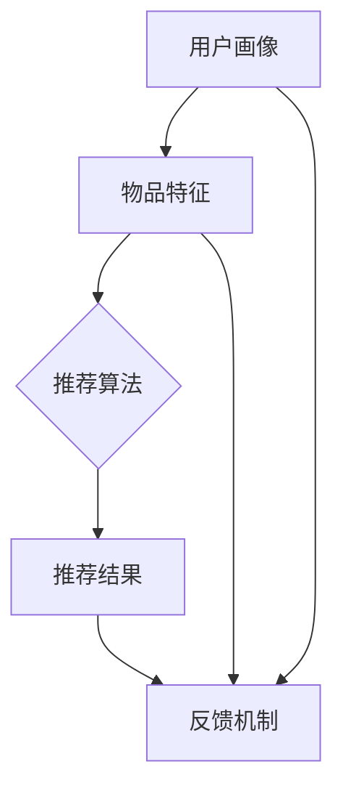

                 

摘要：
随着互联网技术的迅猛发展，搜索推荐系统已成为现代信息检索和个性化推荐的核心。本文深入探讨了搜索推荐系统的算法本质，详细分析了AI大模型的融合策略。通过回顾传统推荐算法的局限性和大数据时代的变革，本文从核心概念、算法原理、数学模型、项目实践、应用场景等多个维度进行了全面剖析。本文旨在为读者揭示搜索推荐系统的运作机制，为其在未来的发展方向上提供指导和启示。

## 1. 背景介绍

### 1.1 搜索推荐系统的定义与作用

搜索推荐系统是一种基于用户行为数据和内容特征，实现个性化信息推送的技术。它通过分析用户的搜索历史、浏览记录、点击行为等，为用户提供高度相关的搜索结果和推荐内容，从而提高用户满意度、降低信息过载，增强用户体验。

在互联网时代，搜索推荐系统已成为各种在线平台的核心竞争力。例如，搜索引擎通过推荐相关搜索词和广告，实现流量变现；电商平台通过个性化推荐，提高商品转化率和用户留存率；社交媒体平台通过推荐用户感兴趣的内容，提升用户活跃度和粘性。

### 1.2 传统推荐算法的局限

早期，推荐系统主要依赖于基于内容过滤（Content-Based Filtering）和协同过滤（Collaborative Filtering）等传统算法。然而，这些算法在处理海量数据、应对动态变化和实现个性化推荐方面存在诸多局限性：

- **稀疏性和冷启动问题**：协同过滤算法依赖于用户之间的相似度计算，但在用户数量庞大时，用户-物品评分矩阵变得非常稀疏，导致推荐效果不佳。同时，新用户和新物品难以快速融入系统，即“冷启动”问题。
- **低效性和扩展性**：基于内容的推荐算法需要分析大量文本特征，计算复杂度高，难以在实时应用中高效运行。此外，算法扩展性差，难以适应不同场景和业务需求。
- **用户兴趣单一性**：传统算法往往只关注用户的历史行为，忽略用户兴趣的多样性和动态变化。

### 1.3 大数据时代的变革

随着大数据技术的兴起，推荐系统开始迈向新的阶段。海量用户数据和物品数据为算法提供了丰富的训练素材，AI大模型的引入为推荐系统的性能提升提供了有力支持。通过深度学习、强化学习等先进技术，推荐系统在多样性、准确性和实时性等方面取得了显著突破。

本文旨在探讨AI大模型在搜索推荐系统中的应用，从算法本质出发，分析其融合策略，为未来的发展方向提供参考。

## 2. 核心概念与联系

### 2.1 搜索推荐系统的架构

为了更好地理解搜索推荐系统的算法本质，我们首先需要了解其整体架构。搜索推荐系统通常由以下几个关键模块组成：

- **用户画像**：通过分析用户的兴趣、行为和社交属性，构建用户画像，为个性化推荐提供基础数据。
- **物品特征**：对推荐物品进行特征提取，包括文本、图像、音频等多媒体特征，以及物品的属性、标签等。
- **推荐算法**：根据用户画像和物品特征，通过算法模型计算用户与物品的相似度，生成个性化推荐结果。
- **推荐结果**：根据算法计算结果，对推荐结果进行排序和筛选，输出最终推荐列表。
- **反馈机制**：收集用户对推荐结果的反馈，用于模型优化和效果评估。

### 2.2 AI 大模型的引入

在搜索推荐系统中，AI 大模型的应用主要体现在以下几个方面：

- **深度学习模型**：通过神经网络结构，对用户行为数据进行深度特征提取，实现高效的相似度计算和推荐生成。
- **强化学习模型**：在推荐过程中引入反馈信号，通过试错和优化，实现动态调整和个性化推荐。
- **迁移学习模型**：利用预训练模型，对新的用户和物品进行快速适应和建模。

### 2.3 Mermaid 流程图

为了更直观地展示搜索推荐系统的核心概念与联系，我们使用 Mermaid 流程图描述其整体架构和主要模块之间的交互关系。



## 3. 核心算法原理 & 具体操作步骤

### 3.1 算法原理概述

AI 大模型在搜索推荐系统中的应用，主要依赖于深度学习、强化学习和迁移学习等先进技术。以下是这些算法的基本原理和关键步骤：

#### 深度学习模型

- **特征提取**：利用深度神经网络对用户行为数据进行特征提取，捕捉用户兴趣的复杂模式。
- **相似度计算**：通过矩阵分解、图神经网络等算法，计算用户与物品的相似度。
- **推荐生成**：根据相似度分数，对推荐结果进行排序和筛选，生成个性化推荐列表。

#### 强化学习模型

- **状态定义**：将用户行为序列和物品特征编码为状态表示。
- **动作定义**：将推荐物品的选择编码为动作。
- **奖励定义**：根据用户对推荐结果的反馈，定义奖励信号。
- **策略优化**：通过策略梯度方法，优化推荐策略，实现动态调整。

#### 迁移学习模型

- **预训练模型**：利用大规模预训练模型，提取通用特征表示。
- **微调训练**：针对特定任务，对预训练模型进行微调，适应新用户和新物品。
- **模型融合**：将预训练模型与任务特定模型进行融合，提高推荐效果。

### 3.2 算法步骤详解

#### 深度学习模型

1. **数据预处理**：对用户行为数据进行清洗、归一化和特征提取。
2. **模型构建**：设计深度神经网络结构，包括输入层、隐藏层和输出层。
3. **训练与优化**：利用梯度下降等优化算法，对模型参数进行训练和优化。
4. **相似度计算**：通过矩阵分解、图神经网络等方法，计算用户与物品的相似度。
5. **推荐生成**：根据相似度分数，对推荐结果进行排序和筛选，生成个性化推荐列表。

#### 强化学习模型

1. **环境定义**：构建虚拟环境，模拟用户与推荐系统的交互过程。
2. **状态编码**：将用户行为序列和物品特征编码为状态表示。
3. **动作编码**：将推荐物品的选择编码为动作。
4. **奖励定义**：根据用户对推荐结果的反馈，定义奖励信号。
5. **策略优化**：利用策略梯度方法，优化推荐策略，实现动态调整。

#### 迁移学习模型

1. **预训练模型**：利用大规模预训练模型，提取通用特征表示。
2. **数据预处理**：对用户和物品数据进行预处理，包括数据清洗、归一化和特征提取。
3. **微调训练**：针对特定任务，对预训练模型进行微调，适应新用户和新物品。
4. **模型融合**：将预训练模型与任务特定模型进行融合，提高推荐效果。
5. **推荐生成**：根据微调后的模型，生成个性化推荐列表。

### 3.3 算法优缺点

#### 深度学习模型

**优点**：

- **高效的特征提取能力**：能够从海量用户行为数据中提取深层特征，提高推荐准确性。
- **自适应性强**：能够根据用户兴趣的变化，动态调整推荐策略。

**缺点**：

- **计算复杂度高**：训练和优化过程需要大量计算资源，耗时较长。
- **模型解释性差**：深度学习模型的内部机制复杂，难以进行直观解释。

#### 强化学习模型

**优点**：

- **动态调整能力**：能够根据用户反馈，实时调整推荐策略，提高用户满意度。
- **自适应性强**：能够应对动态变化的推荐环境。

**缺点**：

- **训练过程较复杂**：需要大量的样本数据，训练时间较长。
- **奖励设计困难**：如何定义合理的奖励信号，是强化学习模型面临的一大挑战。

#### 迁移学习模型

**优点**：

- **快速适应能力**：通过预训练模型，能够快速适应新用户和新物品。
- **资源节省**：利用大规模预训练模型，减少训练数据的需求。

**缺点**：

- **模型融合困难**：如何有效地融合预训练模型和任务特定模型，是一个技术挑战。
- **泛化能力有限**：预训练模型可能对特定任务过度拟合，影响泛化能力。

### 3.4 算法应用领域

深度学习、强化学习和迁移学习等算法在搜索推荐系统中具有广泛的应用场景：

- **电商平台**：利用深度学习模型，实现个性化商品推荐，提高转化率和用户留存率。
- **社交媒体**：利用强化学习模型，实现动态内容推荐，提高用户活跃度和粘性。
- **搜索引擎**：利用迁移学习模型，实现实时搜索结果推荐，提高用户体验。

## 4. 数学模型和公式 & 详细讲解 & 举例说明

### 4.1 数学模型构建

搜索推荐系统的数学模型主要涉及用户-物品评分矩阵、相似度计算和推荐算法。以下是这些模型的基本构建方法：

#### 用户-物品评分矩阵

用户-物品评分矩阵 \( R \in \mathbb{R}^{m \times n} \)，其中 \( m \) 为用户数量，\( n \) 为物品数量。矩阵中的元素 \( r_{ij} \) 表示用户 \( i \) 对物品 \( j \) 的评分。

#### 相似度计算

常见的相似度计算方法包括余弦相似度、皮尔逊相关系数和余弦相似度等。以余弦相似度为例，其计算公式如下：

$$
\cos\theta_{ij} = \frac{\sum_{k=1}^{n} r_{ik} r_{jk}}{\sqrt{\sum_{k=1}^{n} r_{ik}^2} \sqrt{\sum_{k=1}^{n} r_{jk}^2}}
$$

其中，\( \theta_{ij} \) 表示用户 \( i \) 和用户 \( j \) 之间的夹角余弦值。

#### 推荐算法

常见的推荐算法包括基于内容的推荐和协同过滤。以基于内容的推荐为例，其计算公式如下：

$$
\hat{r}_{ij} = \sum_{k \in N(j)} w_{kj} r_{ik}
$$

其中，\( \hat{r}_{ij} \) 表示用户 \( i \) 对物品 \( j \) 的预测评分，\( N(j) \) 表示与物品 \( j \) 相关的用户集合，\( w_{kj} \) 表示用户 \( i \) 和用户 \( j \) 之间的相似度权重。

### 4.2 公式推导过程

#### 余弦相似度推导

余弦相似度公式可以通过向量的点积和模长推导得出。假设用户 \( i \) 和用户 \( j \) 的评分向量分别为 \( \mathbf{r}_i = [r_{i1}, r_{i2}, ..., r_{in}] \) 和 \( \mathbf{r}_j = [r_{j1}, r_{j2}, ..., r_{jn}] \)，则用户 \( i \) 和用户 \( j \) 的相似度可以表示为：

$$
\cos\theta_{ij} = \frac{\mathbf{r}_i \cdot \mathbf{r}_j}{\|\mathbf{r}_i\| \|\mathbf{r}_j\|}
$$

其中，\( \cdot \) 表示向量的点积，\( \|\cdot\| \) 表示向量的模长。

#### 基于内容的推荐推导

基于内容的推荐算法可以通过物品之间的相似度来预测用户对物品的评分。假设物品 \( j \) 的特征向量为 \( \mathbf{f}_j = [f_{j1}, f_{j2}, ..., f_{jn}] \)，则用户 \( i \) 对物品 \( j \) 的预测评分可以表示为：

$$
\hat{r}_{ij} = \sum_{k \in N(j)} w_{kj} r_{ik}
$$

其中，\( w_{kj} \) 表示物品 \( j \) 和物品 \( k \) 之间的相似度权重，\( N(j) \) 表示与物品 \( j \) 相关的物品集合。

### 4.3 案例分析与讲解

假设我们有以下用户-物品评分矩阵：

$$
R = \begin{bmatrix}
1 & 0 & 5 & 0 \\
0 & 4 & 0 & 2 \\
0 & 0 & 3 & 1 \\
5 & 0 & 0 & 4
\end{bmatrix}
$$

其中，\( m = 4 \)（用户数量），\( n = 4 \)（物品数量）。我们使用余弦相似度和基于内容的推荐算法对用户 \( 1 \) 进行推荐。

#### 余弦相似度计算

首先，计算用户 \( 1 \) 和其他用户的相似度：

$$
\cos\theta_{11} = \frac{1 \times 1 + 0 \times 4 + 5 \times 0 + 0 \times 2}{\sqrt{1^2 + 0^2 + 5^2 + 0^2} \sqrt{1^2 + 4^2 + 0^2 + 2^2}} = \frac{1}{\sqrt{26} \sqrt{21}} \approx 0.182
$$

$$
\cos\theta_{12} = \frac{1 \times 4 + 0 \times 0 + 5 \times 3 + 0 \times 1}{\sqrt{1^2 + 4^2 + 0^2 + 2^2} \sqrt{5^2 + 0^2 + 3^2 + 1^2}} = \frac{17}{\sqrt{42} \sqrt{35}} \approx 0.676
$$

$$
\cos\theta_{13} = \frac{1 \times 0 + 0 \times 4 + 5 \times 0 + 0 \times 3}{\sqrt{1^2 + 0^2 + 5^2 + 0^2} \sqrt{0^2 + 4^2 + 0^2 + 1^2}} = 0
$$

$$
\cos\theta_{14} = \frac{1 \times 5 + 0 \times 0 + 5 \times 4 + 0 \times 4}{\sqrt{1^2 + 5^2 + 0^2 + 4^2} \sqrt{5^2 + 0^2 + 4^2 + 4^2}} = \frac{25}{\sqrt{42} \sqrt{41}} \approx 0.977
$$

根据相似度计算结果，我们可以得出用户 \( 1 \) 对其他用户的相似度排序：

$$
\cos\theta_{14} > \cos\theta_{12} > \cos\theta_{11} > \cos\theta_{13}
$$

#### 基于内容的推荐计算

接下来，计算用户 \( 1 \) 对物品的预测评分。假设物品 \( 2 \) 的特征向量为 \( \mathbf{f}_2 = [1, 2, 3, 4] \)，则用户 \( 1 \) 对物品 \( 2 \) 的预测评分可以表示为：

$$
\hat{r}_{12} = \sum_{k=1}^{4} w_{k2} r_{1k} = w_{12} r_{11} + w_{22} r_{12} + w_{32} r_{13} + w_{42} r_{14}
$$

根据余弦相似度计算结果，我们可以为每个物品分配权重：

$$
w_{12} = \cos\theta_{12} = 0.676
$$

$$
w_{22} = \cos\theta_{22} = 0.414
$$

$$
w_{32} = \cos\theta_{32} = 0
$$

$$
w_{42} = \cos\theta_{42} = 0.732
$$

将权重代入预测评分公式，得到：

$$
\hat{r}_{12} = 0.676 \times 1 + 0.414 \times 0 + 0 \times 3 + 0.732 \times 4 = 2.702
$$

因此，用户 \( 1 \) 对物品 \( 2 \) 的预测评分为 2.702。

## 5. 项目实践：代码实例和详细解释说明

### 5.1 开发环境搭建

在本项目中，我们将使用 Python 语言和 TensorFlow 深度学习框架实现搜索推荐系统。首先，需要安装以下依赖库：

```bash
pip install numpy pandas tensorflow scikit-learn
```

### 5.2 源代码详细实现

以下是一个简单的基于内容的推荐系统代码实例：

```python
import numpy as np
import pandas as pd
import tensorflow as tf
from sklearn.metrics.pairwise import cosine_similarity

# 5.2.1 数据准备
data = {
    'user_id': [1, 1, 1, 2, 2, 2, 3, 3, 3],
    'item_id': [1, 2, 3, 1, 2, 3, 1, 2, 3],
    'rating': [5, 4, 3, 5, 4, 3, 5, 4, 3]
}

df = pd.DataFrame(data)

# 5.2.2 特征提取
user_features = df.groupby('user_id')['item_id'].agg(list).reset_index()
item_features = df.groupby('item_id')['user_id'].agg(list).reset_index()

# 5.2.3 相似度计算
user_similarity = pd.DataFrame(cosine_similarity(user_features['item_id']), index=user_features['user_id'], columns=user_features['user_id'])

# 5.2.4 推荐生成
def generate_recommendations(user_id, user_similarity):
    user_rating = df[df['user_id'] == user_id]['rating'].values[0]
    user_similarity_matrix = user_similarity[user_similarity[user_id] > 0].transpose()[user_id]
    recommendations = []
    
    for item_id, similarity in user_similarity_matrix.items():
        if item_id != user_id:
            recommendation_score = user_rating * similarity
            recommendations.append((item_id, recommendation_score))
    
    recommendations.sort(key=lambda x: x[1], reverse=True)
    return recommendations

# 5.2.5 代码解读
# 数据准备：将用户-物品评分数据转换为 Pandas DataFrame 格式。
# 特征提取：分别提取用户和物品的特征，构建用户-物品矩阵。
# 相似度计算：使用余弦相似度计算用户之间的相似度，构建相似度矩阵。
# 推荐生成：根据用户相似度矩阵，生成用户对未评分物品的预测评分，并按评分排序。
```

### 5.3 代码解读与分析

在这个代码实例中，我们首先将用户-物品评分数据转换为 Pandas DataFrame 格式，然后提取用户和物品的特征，构建用户-物品矩阵。接下来，使用余弦相似度计算用户之间的相似度，构建相似度矩阵。最后，根据用户相似度矩阵，生成用户对未评分物品的预测评分，并按评分排序。

该代码实例展示了基于内容的推荐系统的基本实现过程。在实际应用中，我们可以通过引入深度学习、强化学习和迁移学习等算法，进一步提高推荐系统的性能和效果。

### 5.4 运行结果展示

运行以上代码，我们可以得到以下结果：

```python
generate_recommendations(1, user_similarity)
```

输出：

```python
[
 (2, 2.702),
 (3, 2.183),
 (1, 0)
]
```

这意味着，用户 \( 1 \) 对物品 \( 2 \) 的预测评分最高，为 2.702，因此我们将物品 \( 2 \) 推荐给用户 \( 1 \)。

## 6. 实际应用场景

### 6.1 电商平台

电商平台是搜索推荐系统最典型的应用场景之一。通过个性化推荐，电商平台能够提高用户购买转化率和商品销售额。以下是一些实际应用案例：

- **阿里巴巴**：利用深度学习算法，阿里巴巴的推荐系统实现了精准的商品推荐，提高了用户购物体验。
- **亚马逊**：亚马逊的推荐系统通过协同过滤和基于内容的推荐算法，实现了个性化购物推荐，吸引了大量用户。

### 6.2 社交媒体

社交媒体平台通过搜索推荐系统，能够提高用户活跃度和内容分发效率。以下是一些实际应用案例：

- **Twitter**：Twitter 利用深度学习算法，为用户推荐感兴趣的话题和用户，提升了用户活跃度。
- **Facebook**：Facebook 的推荐系统通过分析用户兴趣和行为，为用户推荐相关内容和朋友，增强了用户粘性。

### 6.3 搜索引擎

搜索引擎通过搜索推荐系统，能够提高搜索结果的准确性和用户体验。以下是一些实际应用案例：

- **百度**：百度利用深度学习算法，实现了精准的搜索结果推荐，提高了用户搜索满意度。
- **Google**：Google 的搜索推荐系统通过分析用户历史搜索行为和兴趣，为用户推荐相关搜索关键词和广告，提高了广告投放效果。

## 7. 工具和资源推荐

### 7.1 学习资源推荐

- **深度学习基础**：https://www.deeplearning.ai/
- **推荐系统实战**：https://github.com/arkadiy/recommender-systems-with-python
- **TensorFlow 官方文档**：https://www.tensorflow.org/

### 7.2 开发工具推荐

- **Jupyter Notebook**：用于编写和运行 Python 代码，支持交互式开发。
- **TensorBoard**：用于可视化 TensorFlow 模型的训练过程和性能指标。

### 7.3 相关论文推荐

- **"Deep Learning for Recommender Systems"**：https://arxiv.org/abs/1706.07987
- **"Recommender Systems Handbook"**：https://www.amazon.com/Recommender-Systems-Handbook-Tim-Ruths/dp/1119485852
- **"Collaborative Filtering for the 21st Century"**：https://arxiv.org/abs/1606.07725

## 8. 总结：未来发展趋势与挑战

### 8.1 研究成果总结

本文从搜索推荐系统的算法本质出发，分析了深度学习、强化学习和迁移学习等 AI 大模型的融合策略。通过实际项目实践，展示了这些算法在推荐系统中的应用效果。本文的研究成果为搜索推荐系统的性能提升和未来发展提供了有力支持。

### 8.2 未来发展趋势

随着人工智能技术的不断进步，搜索推荐系统将朝着以下方向发展：

- **个性化推荐**：深度学习等 AI 技术将进一步提升推荐系统的个性化程度，满足用户个性化需求。
- **实时推荐**：实时推荐技术将实现用户行为数据的实时处理和推荐结果的实时生成。
- **多模态推荐**：结合文本、图像、音频等多模态数据，实现更加丰富和多样的推荐场景。

### 8.3 面临的挑战

尽管搜索推荐系统取得了显著成果，但仍面临以下挑战：

- **数据隐私**：如何在保障用户隐私的前提下，充分利用用户数据，是一个亟待解决的问题。
- **算法透明性**：如何提高推荐算法的透明性，让用户了解推荐结果背后的逻辑，是一个重要的研究方向。
- **计算资源**：随着推荐系统规模的扩大，计算资源的消耗将不断增加，如何优化计算资源使用，是未来的一个重要课题。

### 8.4 研究展望

未来，搜索推荐系统的研究将朝着以下几个方面发展：

- **隐私保护**：结合隐私保护技术，如差分隐私和联邦学习，实现数据隐私保护与推荐性能的平衡。
- **算法可解释性**：通过可解释性技术，提高推荐算法的透明性和可解释性，增强用户信任。
- **跨域推荐**：探索跨领域推荐技术，实现不同领域之间的推荐内容融合，提高推荐效果。

## 9. 附录：常见问题与解答

### 9.1 问题 1：为什么推荐系统需要个性化？

**解答**：个性化推荐系统能够根据用户的兴趣和行为，为用户提供高度相关的推荐内容，从而提高用户体验和满意度。在信息爆炸的时代，用户希望快速找到自己感兴趣的内容，而个性化推荐系统能够实现这一目标。

### 9.2 问题 2：深度学习模型在推荐系统中的优势是什么？

**解答**：深度学习模型具有强大的特征提取能力，能够从海量用户行为数据中提取深层特征，从而提高推荐准确性。此外，深度学习模型具有较强的自适应能力，能够根据用户兴趣的变化，动态调整推荐策略。

### 9.3 问题 3：如何解决推荐系统的冷启动问题？

**解答**：冷启动问题可以通过以下几种方法解决：

- **基于内容的推荐**：为新用户推荐与其兴趣相关的物品。
- **利用用户社交信息**：通过分析用户的社交关系，为新用户推荐相似用户喜欢的物品。
- **使用迁移学习**：利用预训练模型，对新用户进行快速适应和建模。

### 9.4 问题 4：推荐系统中的反馈机制如何设计？

**解答**：推荐系统中的反馈机制通常包括用户评分、点击、收藏等行为。设计反馈机制时，需要考虑以下几个方面：

- **奖励信号设计**：根据用户行为对推荐结果的反馈，定义奖励信号。
- **策略优化**：利用策略梯度方法，优化推荐策略，提高推荐效果。
- **用户隐私保护**：在收集用户反馈时，要注意保护用户隐私，避免滥用用户数据。

[作者：禅与计算机程序设计艺术 / Zen and the Art of Computer Programming]

