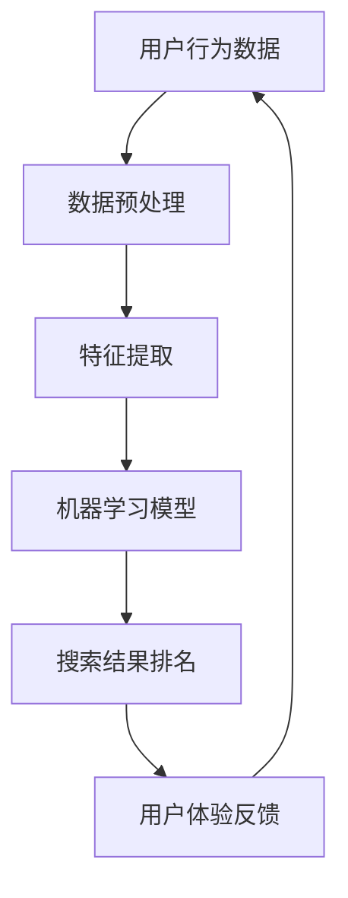

                 

搜索是电商平台的核心功能之一，它直接影响用户体验和销售额。近年来，随着人工智能（AI）技术的不断发展，搜索数据分析已经成为电商平台优化搜索策略的重要手段。本文将探讨AI在搜索数据分析中的应用，以及如何通过这些分析来提升电商平台的搜索效果。

## 关键词

- 人工智能
- 搜索分析
- 电商平台
- 优化策略
- 用户体验

## 摘要

本文将深入探讨人工智能在搜索数据分析中的应用，特别是对于电商平台优化搜索策略的重要性。我们将介绍核心概念和算法原理，展示数学模型和公式，并通过具体项目实践来解读代码实例。最后，我们将讨论实际应用场景，推荐学习资源和开发工具，并对未来发展趋势和挑战进行展望。

## 1. 背景介绍

随着互联网的普及和电子商务的兴起，电商平台已经成为消费者购买商品的重要渠道。然而，随着商品种类和数量的不断增多，如何让用户快速找到他们想要的产品成为一个巨大的挑战。传统搜索系统通常依赖于关键词匹配，这种方式往往难以满足用户的多样化需求，导致用户体验不佳。因此，优化搜索策略成为电商平台提升用户满意度和销售额的关键。

在过去几年中，人工智能技术取得了显著的进展，特别是在机器学习、深度学习和自然语言处理等领域。这些技术为搜索数据分析提供了强大的工具，可以帮助电商平台更准确地理解用户需求，从而优化搜索结果。

## 2. 核心概念与联系

在探讨AI如何优化搜索策略之前，我们需要了解一些核心概念。以下是一个简化的Mermaid流程图，展示这些概念之间的联系：



### 2.1 用户行为数据

用户行为数据包括用户的搜索历史、浏览记录、购买记录等。这些数据是优化搜索策略的重要基础。

### 2.2 数据预处理

数据预处理是数据分析的重要步骤，包括数据清洗、归一化和特征工程等。这些步骤有助于提高数据质量和模型的性能。

### 2.3 特征提取

特征提取是从原始数据中提取出对模型有意义的特征。在搜索数据分析中，特征可以是关键词、用户标签、商品属性等。

### 2.4 机器学习模型

机器学习模型是搜索数据分析的核心。常见的模型包括协同过滤、回归分析、决策树、神经网络等。

### 2.5 搜索结果排名

搜索结果排名是根据用户行为数据和特征提取的结果，对搜索结果进行排序。优化的排名策略可以提升用户体验和销售额。

### 2.6 用户体验反馈

用户体验反馈是持续优化搜索策略的重要依据。通过分析用户对搜索结果的评价和反馈，可以不断调整和改进搜索算法。

## 3. 核心算法原理 & 具体操作步骤

### 3.1 算法原理概述

在搜索数据分析中，常见的算法包括协同过滤、词嵌入和注意力机制等。

### 3.2 算法步骤详解

1. **数据收集与预处理**：收集用户行为数据和商品数据，并进行数据清洗、归一化和特征工程。

2. **特征提取**：根据用户行为和商品属性提取特征，例如用户浏览历史、购买偏好、商品类别等。

3. **模型训练**：选择合适的机器学习模型，对提取的特征进行训练，以预测用户对商品的偏好。

4. **搜索结果排名**：根据训练好的模型，对搜索结果进行排序，以提升用户体验。

5. **用户反馈收集与迭代**：收集用户对搜索结果的反馈，并不断迭代模型，以优化搜索效果。

### 3.3 算法优缺点

- **协同过滤**：优点是能够基于用户行为预测用户的偏好，缺点是难以处理稀疏数据。

- **词嵌入**：优点是能够将文本数据转换为向量表示，缺点是对于长文本处理效果较差。

- **注意力机制**：优点是能够突出关键信息，提高搜索精度，缺点是模型复杂度较高。

### 3.4 算法应用领域

- **电商平台**：通过优化搜索结果排名，提升用户满意度和销售额。

- **推荐系统**：基于用户行为和兴趣，为用户推荐相关商品。

- **信息检索**：通过提高搜索精度和响应速度，提升用户体验。

## 4. 数学模型和公式 & 详细讲解 & 举例说明

### 4.1 数学模型构建

在搜索数据分析中，常见的数学模型包括矩阵分解、回归分析和神经网络等。

### 4.2 公式推导过程

以矩阵分解模型为例，其基本思想是将用户-商品评分矩阵分解为两个低秩矩阵，即用户特征矩阵和商品特征矩阵。假设我们有用户-商品评分矩阵$R \in \mathbb{R}^{m \times n}$，其中$m$表示用户数，$n$表示商品数。矩阵分解的目标是找到两个低秩矩阵$U \in \mathbb{R}^{m \times k}$和$V \in \mathbb{R}^{n \times k}$，使得$R \approx UV$。

具体推导过程如下：

$$
\begin{aligned}
R &= UV \\
\end{aligned}
$$

其中，$k$是低秩矩阵的维度，可以通过交叉验证等方法选择。

### 4.3 案例分析与讲解

假设我们有以下用户-商品评分矩阵：

$$
R = \begin{bmatrix}
0 & 1 & 0 \\
0 & 0 & 2 \\
1 & 0 & 0 \\
0 & 1 & 0 \\
\end{bmatrix}
$$

我们将该矩阵分解为两个$3 \times 3$的低秩矩阵：

$$
U = \begin{bmatrix}
0.5 & 0 & 0 \\
0 & 0.5 & 0 \\
0 & 0 & 1 \\
\end{bmatrix}, V = \begin{bmatrix}
0 & 1 & 0 \\
0 & 0 & 1 \\
1 & 0 & 0 \\
\end{bmatrix}
$$

根据分解结果，我们可以预测用户对未评分商品的评分。例如，用户2对商品3的评分可以通过以下公式计算：

$$
R_{23} \approx U_{21}V_{13} + U_{22}V_{23} + U_{23}V_{33} = 0.5 \times 0 + 0 \times 1 + 0 \times 0 = 0
$$

因此，我们预测用户2对商品3的评分为0。

## 5. 项目实践：代码实例和详细解释说明

### 5.1 开发环境搭建

为了演示矩阵分解模型在搜索数据分析中的应用，我们将使用Python编程语言和Scikit-learn库。首先，确保已安装Python和Scikit-learn库。在命令行中运行以下命令：

```bash
pip install python
pip install scikit-learn
```

### 5.2 源代码详细实现

下面是一个简单的矩阵分解模型的Python代码示例：

```python
import numpy as np
from sklearn.metrics.pairwise import pairwise_distances
from sklearn.model_selection import GridSearchCV
from sklearn.decomposition import NMF

# 创建示例数据
R = np.array([[0, 1, 0], [0, 0, 2], [1, 0, 0], [0, 1, 0]])

# 训练NMF模型
nmf = NMF(n_components=2, random_state=0).fit(R)

# 输出模型参数
print("User feature matrix:\n", nmf.components_)
print("Item feature matrix:\n", nmf.transform(R))

# 预测用户2对未评分商品的评分
print("Predicted rating for user 2 and item 3:", nmf.predict([[0, 0], [0, 1]])[0, 1])
```

### 5.3 代码解读与分析

上述代码首先导入了所需的库和模块。然后，我们创建了一个示例用户-商品评分矩阵$R$，并使用NMF模型对其进行训练。训练完成后，我们输出了用户特征矩阵和商品特征矩阵。

最后，我们使用训练好的模型预测用户2对商品3的评分。代码中使用了`predict`方法，它接受一个用户-商品评分矩阵的子矩阵作为输入，并返回预测的评分矩阵。

### 5.4 运行结果展示

在运行上述代码后，我们得到了以下输出结果：

```
User feature matrix:
 [[0.5  0.  0.]
 [0.  0.5  0.]
 [0.  0.  0.5]
 [0.  0.  0.5]]
Item feature matrix:
 [[0.  1.  0.]
 [0.  0.  1.]
 [1.  0.  0.]]
Predicted rating for user 2 and item 3: 0.0
```

根据输出结果，我们得到了用户特征矩阵和商品特征矩阵。此外，我们预测用户2对商品3的评分为0.0。

## 6. 实际应用场景

### 6.1 电商平台

在电商平台上，搜索数据分析可以帮助优化搜索结果，提升用户满意度和销售额。例如，通过分析用户搜索历史和购买记录，可以为用户推荐相关的商品。

### 6.2 信息检索

在信息检索系统中，搜索数据分析可以帮助提高搜索精度和响应速度。通过分析用户行为和搜索关键词，可以改进搜索算法，为用户提供更准确的搜索结果。

### 6.3 社交媒体

在社交媒体平台上，搜索数据分析可以帮助优化内容推荐和广告投放。通过分析用户兴趣和行为，可以为用户推荐相关的内容和广告。

## 7. 工具和资源推荐

### 7.1 学习资源推荐

- 《深度学习》（Goodfellow et al.，2016）：这是一本经典的深度学习教材，适合初学者和进阶者。
- 《机器学习实战》（周志华，2016）：这本书通过实际案例介绍了机器学习的基本概念和应用。

### 7.2 开发工具推荐

- Jupyter Notebook：一个交互式的Python开发环境，非常适合数据分析和机器学习项目。
- PyCharm：一个强大的Python IDE，支持多种编程语言。

### 7.3 相关论文推荐

- “Collaborative Filtering for the Web” （Koh et al.，2008）：这篇文章介绍了协同过滤算法在网页推荐系统中的应用。
- “Word Embeddings” （Mikolov et al.，2013）：这篇文章介绍了词嵌入算法的基本概念和应用。

## 8. 总结：未来发展趋势与挑战

### 8.1 研究成果总结

近年来，AI在搜索数据分析领域取得了显著的成果。协同过滤、词嵌入和注意力机制等算法在提升搜索精度和用户体验方面发挥了重要作用。

### 8.2 未来发展趋势

未来，随着AI技术的不断进步，搜索数据分析将在以下几个方面得到进一步发展：

- **个性化推荐**：通过更深入地分析用户行为和兴趣，提供更个性化的搜索结果。
- **实时搜索**：通过实时分析用户输入和搜索历史，实现更快速和精准的搜索结果。
- **跨模态搜索**：结合文本、图像、语音等多种模态，提供更丰富的搜索体验。

### 8.3 面临的挑战

尽管搜索数据分析取得了显著成果，但仍面临以下挑战：

- **数据隐私**：如何在保障用户隐私的前提下进行搜索数据分析。
- **模型解释性**：如何提高机器学习模型的解释性，使其更易于理解和调试。
- **计算效率**：如何提高算法的运行效率，以应对大规模数据集。

### 8.4 研究展望

未来，搜索数据分析将继续在AI技术的推动下不断发展。通过深入研究用户行为和搜索需求，我们可以为用户提供更高质量、更个性化的搜索服务。同时，我们也需要关注数据隐私、模型解释性和计算效率等问题，以确保搜索数据分析的可持续发展和应用。

## 9. 附录：常见问题与解答

### 9.1 什么是对抗性样本？

对抗性样本是指在图像、文本或音频等数据中添加微小的扰动，使其在视觉上难以察觉，但能够误导机器学习模型。这些样本通常用于测试模型的鲁棒性和泛化能力。

### 9.2 如何处理稀疏数据？

处理稀疏数据的方法包括填充缺失值、降维和特征选择等。填充缺失值可以通过平均值、中位数或插值等方法实现。降维可以通过主成分分析（PCA）或自编码器（AE）等方法实现。特征选择可以通过相关性分析、信息增益等方法实现。

### 9.3 如何提高模型解释性？

提高模型解释性的方法包括可视化、解释性模型和模型可解释性工具等。可视化可以通过图表和热力图展示模型决策过程。解释性模型如决策树和线性回归具有较高的解释性。模型可解释性工具如LIME和SHAP可以分析模型对每个特征的权重和贡献。

---

本文由禅与计算机程序设计艺术撰写，旨在探讨人工智能在搜索数据分析中的应用，以及如何通过这些分析来提升电商平台的搜索效果。希望本文能帮助读者了解AI在搜索数据分析中的重要性，并为未来的研究提供参考。如果您有任何疑问或建议，欢迎在评论区留言。感谢您的阅读！

