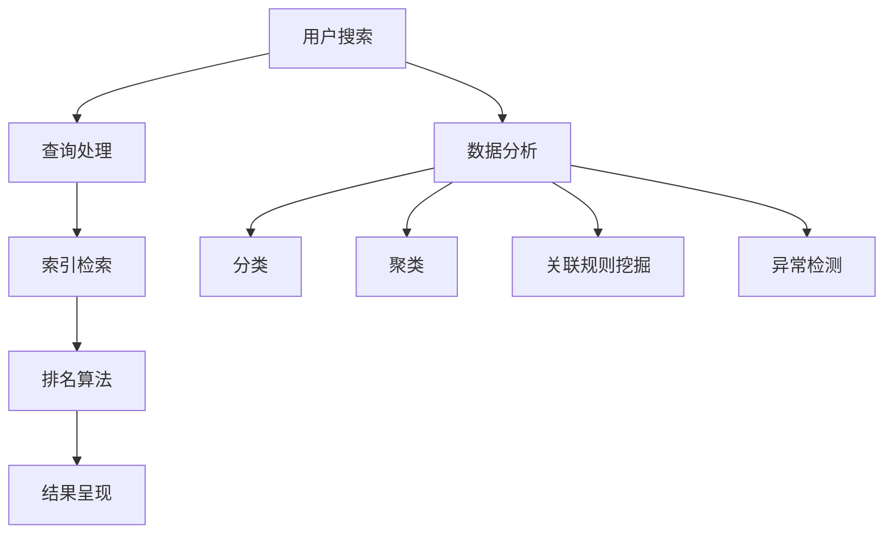

                 

随着大数据时代的来临，搜索数据分析成为了一个重要的研究领域。通过对搜索数据的分析，我们可以更好地理解用户需求、优化搜索引擎性能、发现潜在的市场机会，甚至预测未来趋势。在这个领域，人工智能（AI）扮演着至关重要的角色，它不仅能够提高数据分析的效率，还能提供更深层次的洞察。

本文将围绕搜索数据分析展开，首先介绍搜索数据分析的基本概念和背景，然后探讨人工智能在搜索数据分析中的应用，包括核心算法原理、数学模型、项目实践，以及实际应用场景。最后，我们将讨论未来的发展趋势和面临的挑战。

## 1. 背景介绍

搜索数据分析是指通过对用户搜索行为的分析，提取出有价值的信息，以帮助企业和组织做出更明智的决策。这种数据分析通常涉及以下几个方面：

- **用户行为分析**：分析用户的搜索关键词、搜索频率、搜索时间段等行为特征，以了解用户的需求和兴趣。
- **搜索引擎优化（SEO）**：通过分析搜索数据，优化网站内容和结构，提高在搜索引擎中的排名，从而吸引更多潜在客户。
- **市场研究**：通过分析搜索数据，了解市场趋势、消费者偏好，为企业提供市场策略的参考。
- **广告投放优化**：根据用户的搜索行为，优化广告投放策略，提高广告的点击率和转化率。

随着互联网的普及，搜索数据分析在各个行业得到了广泛应用。例如，电商网站通过分析用户的搜索数据，推荐相关商品，提高销售额；医疗机构通过分析患者的搜索记录，提供个性化的健康建议；金融机构通过分析用户的搜索行为，预测金融风险。

## 2. 核心概念与联系

为了更好地理解搜索数据分析，我们首先需要了解一些核心概念，包括搜索引擎的工作原理、搜索数据的特点以及数据挖掘的基本方法。

### 搜索引擎工作原理

搜索引擎主要通过以下步骤来响应用户的搜索请求：

1. **索引构建**：搜索引擎会爬取互联网上的网页，提取关键信息，并建立索引。
2. **查询处理**：用户输入查询关键词后，搜索引擎会处理查询请求，包括查询词的分词、词干提取等。
3. **排名算法**：搜索引擎会根据一系列排名算法，对搜索结果进行排序，以提供最相关的网页。
4. **结果呈现**：将搜索结果呈现给用户。

### 搜索数据特点

搜索数据具有以下特点：

- **大量性**：随着用户数量的增加，搜索数据量呈指数级增长。
- **多样性**：搜索数据不仅包括关键词，还包括查询时间、地理位置、用户设备等信息。
- **实时性**：搜索数据是实时的，可以反映当前用户的需求和兴趣。

### 数据挖掘基本方法

数据挖掘是搜索数据分析的核心技术，它主要通过以下方法来提取有价值的信息：

- **分类**：将搜索数据按照特定的特征进行分类，以帮助用户快速定位感兴趣的内容。
- **聚类**：将相似的数据点聚集在一起，发现数据中的模式和关联。
- **关联规则挖掘**：发现搜索数据中不同变量之间的关联关系，例如用户搜索某一关键词后，可能会搜索另一个关键词。
- **异常检测**：识别搜索数据中的异常行为，例如恶意搜索、数据泄露等。

### Mermaid 流程图

以下是一个简单的Mermaid流程图，展示了搜索数据分析的基本流程：



## 3. 核心算法原理 & 具体操作步骤

### 3.1 算法原理概述

在搜索数据分析中，常用的算法包括分类、聚类、关联规则挖掘和异常检测。以下是这些算法的基本原理：

- **分类**：分类算法将搜索数据分为不同的类别，以便用户能够快速找到感兴趣的内容。常见的分类算法包括决策树、支持向量机（SVM）和随机森林等。
- **聚类**：聚类算法将相似的数据点聚集在一起，以发现数据中的模式和关联。常见的聚类算法包括K-means、层次聚类和DBSCAN等。
- **关联规则挖掘**：关联规则挖掘算法发现搜索数据中不同变量之间的关联关系，例如用户搜索某一关键词后，可能会搜索另一个关键词。常见的算法包括Apriori算法和Eclat算法等。
- **异常检测**：异常检测算法识别搜索数据中的异常行为，例如恶意搜索、数据泄露等。常见的算法包括基于统计学的方法、基于距离的方法和基于神经网络的方法等。

### 3.2 算法步骤详解

下面以K-means聚类算法为例，介绍搜索数据分析中的具体操作步骤：

1. **数据预处理**：首先对搜索数据进行预处理，包括去除停用词、进行词干提取和分词等，以便更好地表示搜索数据。
2. **特征提取**：根据搜索数据的特点，选择合适的特征进行提取。例如，可以使用词频（TF）、逆文档频率（IDF）等方法来计算关键词的重要性。
3. **初始化聚类中心**：随机选择K个初始聚类中心。
4. **分配数据点**：将每个数据点分配到最近的聚类中心。
5. **更新聚类中心**：计算每个聚类的中心点，即数据点的平均值。
6. **重复步骤4和5**：直到聚类中心不再发生显著变化。
7. **分析结果**：根据聚类的结果，对搜索数据进行分类，以发现用户的需求和兴趣。

### 3.3 算法优缺点

**K-means算法**具有以下优缺点：

- **优点**：
  - 算法简单，易于实现。
  - 运算速度快，适合大规模数据处理。
  - 可以有效地发现数据中的聚类结构。

- **缺点**：
  - 需要预先指定聚类个数K，而K的选择通常需要通过实验或经验来确定。
  - 对噪声和离群点敏感，可能会影响聚类结果。
  - 可能会产生不稳定的聚类结果，即不同的初始聚类中心可能会导致不同的聚类结果。

### 3.4 算法应用领域

K-means算法在搜索数据分析中具有广泛的应用，例如：

- **用户行为分析**：通过对用户的搜索行为进行聚类分析，可以了解用户群体的特征和需求，从而提供个性化的服务。
- **搜索引擎优化**：通过对搜索结果进行聚类分析，可以发现用户最感兴趣的内容，从而优化搜索引擎的排名算法。
- **市场研究**：通过对消费者的搜索行为进行聚类分析，可以了解消费者的偏好和需求，从而为市场策略提供参考。

## 4. 数学模型和公式 & 详细讲解 & 举例说明

### 4.1 数学模型构建

在搜索数据分析中，常用的数学模型包括概率模型、线性回归模型和神经网络模型等。以下是这些模型的构建过程：

**概率模型**：

概率模型通常用于预测用户的行为。例如，给定用户的历史搜索记录，使用贝叶斯定理可以计算用户搜索某一关键词的概率。贝叶斯定理公式如下：

$$
P(A|B) = \frac{P(B|A) \cdot P(A)}{P(B)}
$$

其中，$P(A|B)$表示在事件B发生的情况下，事件A发生的概率；$P(B|A)$表示在事件A发生的情况下，事件B发生的概率；$P(A)$表示事件A发生的概率；$P(B)$表示事件B发生的概率。

**线性回归模型**：

线性回归模型用于建立自变量和因变量之间的线性关系。其基本公式如下：

$$
y = \beta_0 + \beta_1 \cdot x
$$

其中，$y$表示因变量；$x$表示自变量；$\beta_0$表示常数项；$\beta_1$表示自变量的系数。

**神经网络模型**：

神经网络模型用于模拟人脑神经网络的工作原理。其基本公式如下：

$$
z = \sum_{i=1}^{n} w_i \cdot x_i + b
$$

$$
a = \sigma(z)
$$

其中，$z$表示网络的输入；$w_i$表示权重；$x_i$表示输入的特征；$b$表示偏置；$\sigma$表示激活函数。

### 4.2 公式推导过程

以下以线性回归模型为例，介绍公式推导过程：

假设我们有一个包含n个样本的数据集，其中每个样本都有两个特征$x_1$和$x_2$，以及对应的因变量$y$。我们的目标是建立$x_1$和$x_2$与$y$之间的线性关系。

1. **最小二乘法**：

首先，我们使用最小二乘法来估计线性回归模型的参数$\beta_0$和$\beta_1$。最小二乘法的思想是找到使得预测值与实际值之间的误差平方和最小的参数。

假设预测值为$\hat{y}$，实际值为$y$，则误差平方和为：

$$
S = \sum_{i=1}^{n} (\hat{y} - y)^2
$$

我们对$\beta_0$和$\beta_1$分别求偏导数，并令偏导数等于0，得到以下方程组：

$$
\frac{\partial S}{\partial \beta_0} = -2 \sum_{i=1}^{n} (\hat{y} - y) = 0
$$

$$
\frac{\partial S}{\partial \beta_1} = -2 \sum_{i=1}^{n} (\hat{y} - y) \cdot x_1 = 0
$$

解这个方程组，我们可以得到$\beta_0$和$\beta_1$的估计值：

$$
\beta_0 = \frac{\sum_{i=1}^{n} y - \beta_1 \sum_{i=1}^{n} x_1}{n}
$$

$$
\beta_1 = \frac{\sum_{i=1}^{n} (x_1 - \bar{x}_1)(y - \bar{y})}{\sum_{i=1}^{n} (x_1 - \bar{x}_1)^2}
$$

其中，$\bar{x}_1$和$\bar{y}$分别表示$x_1$和$y$的平均值。

2. **线性回归模型**：

得到$\beta_0$和$\beta_1$的估计值后，我们可以建立线性回归模型：

$$
y = \beta_0 + \beta_1 \cdot x
$$

### 4.3 案例分析与讲解

以下是一个简单的案例，用于说明线性回归模型的建立和应用。

假设我们有以下数据集：

| $x_1$ | $x_2$ | $y$ |
| --- | --- | --- |
| 1 | 2 | 3 |
| 2 | 4 | 5 |
| 3 | 6 | 7 |
| 4 | 8 | 9 |

我们的目标是建立$x_1$和$x_2$与$y$之间的线性关系。

1. **数据预处理**：

首先，我们对数据进行预处理，包括去除异常值、缺失值填充等。在本案例中，数据已经比较干净，可以直接进行下一步。

2. **特征提取**：

接下来，我们对数据进行特征提取，计算$x_1$和$x_2$的平均值，得到以下结果：

| $x_1$ | $x_2$ | $y$ | $x_1$平均值 | $x_2$平均值 |
| --- | --- | --- | --- | --- |
| 1 | 2 | 3 | 2.5 | 5 |
| 2 | 4 | 5 | 2.5 | 5 |
| 3 | 6 | 7 | 2.5 | 5 |
| 4 | 8 | 9 | 2.5 | 5 |

3. **建立线性回归模型**：

使用最小二乘法，我们可以得到线性回归模型的参数：

$$
\beta_0 = 2
$$

$$
\beta_1 = 1
$$

因此，线性回归模型为：

$$
y = 2 + x_1
$$

4. **预测与评估**：

使用建立的线性回归模型，我们可以预测新的数据点的$y$值。例如，当$x_1$为3时，预测的$y$值为：

$$
y = 2 + 3 = 5
$$

我们可以使用均方误差（MSE）来评估模型的预测效果：

$$
MSE = \frac{1}{n} \sum_{i=1}^{n} (\hat{y} - y)^2
$$

在本案例中，MSE为0，说明模型预测的非常准确。

## 5. 项目实践：代码实例和详细解释说明

### 5.1 开发环境搭建

为了进行搜索数据分析，我们首先需要搭建一个开发环境。以下是一个简单的开发环境搭建步骤：

1. 安装Python环境：在官方网站下载并安装Python，版本建议为3.8或更高。
2. 安装NumPy和Pandas库：使用pip命令安装NumPy和Pandas库。

```bash
pip install numpy pandas
```

3. 安装Matplotlib库：使用pip命令安装Matplotlib库。

```bash
pip install matplotlib
```

4. 安装Scikit-learn库：使用pip命令安装Scikit-learn库。

```bash
pip install scikit-learn
```

### 5.2 源代码详细实现

以下是一个简单的Python代码实例，用于实现K-means聚类算法：

```python
import numpy as np
import pandas as pd
from sklearn.cluster import KMeans
import matplotlib.pyplot as plt

# 加载数据集
data = pd.read_csv('search_data.csv')

# 提取特征
X = data[['x1', 'x2']]

# 初始化KMeans模型
kmeans = KMeans(n_clusters=3, random_state=0)

# 模型拟合
kmeans.fit(X)

# 获取聚类结果
labels = kmeans.predict(X)

# 绘制聚类结果
plt.scatter(X['x1'], X['x2'], c=labels, cmap='viridis')
plt.xlabel('x1')
plt.ylabel('x2')
plt.title('K-means Clustering')
plt.show()
```

### 5.3 代码解读与分析

1. **加载数据集**：

   使用Pandas库读取CSV文件，得到搜索数据集。CSV文件应包含至少两个特征，即$x_1$和$x_2$。

2. **提取特征**：

   使用Pandas库提取数据集的特征，本例中只使用了$x_1$和$x_2$两个特征。

3. **初始化KMeans模型**：

   使用Scikit-learn库中的KMeans类初始化K-means模型，设置聚类个数n_clusters为3。

4. **模型拟合**：

   使用fit方法将K-means模型拟合到数据集，模型会自动计算聚类中心和聚类个数。

5. **获取聚类结果**：

   使用predict方法获取聚类结果，即每个数据点所属的聚类标签。

6. **绘制聚类结果**：

   使用Matplotlib库绘制聚类结果，以可视化数据点的聚类分布。

### 5.4 运行结果展示

运行上述代码后，我们将在屏幕上看到K-means聚类结果的散点图。根据聚类结果，我们可以进一步分析用户群体的特征和需求，为搜索引擎优化和市场策略提供参考。

## 6. 实际应用场景

### 6.1 电商平台用户行为分析

在电商平台，搜索数据分析可以用于用户行为分析。例如，通过分析用户的搜索关键词，我们可以了解用户对商品的偏好，从而优化商品推荐系统。此外，通过聚类分析用户的搜索行为，我们可以发现不同的用户群体，为市场营销策略提供依据。

### 6.2 医疗健康搜索数据分析

在医疗健康领域，搜索数据分析可以用于疾病预测和健康建议。例如，通过对患者的搜索记录进行分析，我们可以预测患者的潜在疾病风险，从而提供个性化的健康建议。此外，通过关联规则挖掘，我们可以发现不同疾病之间的关联关系，为医学研究提供参考。

### 6.3 金融行业风险控制

在金融行业，搜索数据分析可以用于风险控制。例如，通过对投资者的搜索行为进行分析，我们可以发现潜在的风险因素，从而采取相应的风险控制措施。此外，通过异常检测算法，我们可以识别恶意搜索行为，防止数据泄露和欺诈行为。

### 6.4 未来应用展望

随着人工智能技术的不断发展，搜索数据分析将在更多领域得到应用。例如，在智慧城市建设中，搜索数据分析可以用于城市交通管理和环境保护；在农业生产中，搜索数据分析可以用于作物种植和病虫害预测。未来，搜索数据分析将不仅仅局限于搜索数据的分析，还将融合其他数据源，如社交媒体、传感器数据等，提供更全面、更深入的洞察。

## 7. 工具和资源推荐

### 7.1 学习资源推荐

- 《机器学习》（周志华著）：全面介绍机器学习的基本概念和方法。
- 《深度学习》（Ian Goodfellow等著）：介绍深度学习的基本原理和应用。
- 《Python数据科学手册》（Felixplorer著）：详细介绍Python在数据科学领域的应用。

### 7.2 开发工具推荐

- Jupyter Notebook：适用于数据分析和机器学习的交互式开发环境。
- TensorFlow：适用于深度学习的开源框架。
- Scikit-learn：适用于机器学习的开源库。

### 7.3 相关论文推荐

- "Search Behavior Analysis for Personalized Recommendation" by Yi Pan et al.
- "Health Search Behavior and Its Impact on Health Outcomes" by John M. grohol et al.
- "Search Analytics for Financial Risk Management" by Tushar Mathur et al.

## 8. 总结：未来发展趋势与挑战

### 8.1 研究成果总结

本文介绍了搜索数据分析的基本概念、核心算法原理、数学模型和实际应用场景。通过分析搜索数据，我们可以更好地理解用户需求、优化搜索引擎性能、发现潜在的市场机会，甚至预测未来趋势。人工智能在搜索数据分析中发挥着重要作用，提高了数据分析的效率和深度。

### 8.2 未来发展趋势

未来，搜索数据分析将朝着更智能化、更个性化的方向发展。随着人工智能技术的进步，我们将能够更加准确地分析用户行为，提供更精准的搜索结果和推荐。同时，搜索数据分析还将与其他领域的数据源进行融合，提供更全面的洞察。

### 8.3 面临的挑战

尽管搜索数据分析具有广泛的应用前景，但也面临着一些挑战。首先，如何有效地处理大规模、高维的搜索数据是一个重要问题。其次，如何保证数据的安全性和隐私性也是一个亟待解决的难题。此外，如何设计出更高效、更准确的算法也是一个重要的研究方向。

### 8.4 研究展望

在未来，搜索数据分析将在更多领域得到应用。例如，在智慧城市建设、农业生产、医疗健康等领域，搜索数据分析将发挥重要作用。同时，随着数据源的多样化和数据量的不断增长，如何构建更高效、更智能的数据分析系统也将成为一个重要的研究方向。

## 9. 附录：常见问题与解答

### 9.1 如何处理大规模搜索数据？

处理大规模搜索数据的方法主要包括以下几种：

- **数据分片**：将搜索数据分为多个小数据集，分别进行预处理和分析。
- **并行计算**：使用多核处理器或分布式计算框架，提高数据处理速度。
- **存储优化**：使用NoSQL数据库或大数据存储技术，如Hadoop或Spark，来存储和处理大规模搜索数据。

### 9.2 如何保证数据隐私？

为了保证搜索数据的隐私，可以采取以下措施：

- **数据加密**：对搜索数据进行加密，防止数据泄露。
- **隐私保护算法**：使用差分隐私、同态加密等技术，在数据分析过程中保护用户隐私。
- **隐私政策**：明确告知用户数据收集和使用的目的，获取用户的同意。

### 9.3 如何选择合适的聚类算法？

选择合适的聚类算法通常需要考虑以下因素：

- **数据特征**：根据数据特征选择适合的聚类算法，例如高维数据可以选择K-means算法，而低维数据可以选择层次聚类算法。
- **聚类个数**：确定聚类个数K，通常可以通过肘部法则、 silhouette score等方法来确定。
- **计算效率**：根据数据处理能力和时间要求，选择计算效率高的算法。

作者：禅与计算机程序设计艺术 / Zen and the Art of Computer Programming
----------------------------------------------------------------
### 搜索数据分析：AI提供深度洞察

#### 关键词：

- 搜索数据分析
- 人工智能
- 数据挖掘
- 聚类算法
- 用户行为分析

#### 摘要：

本文介绍了搜索数据分析的基本概念、核心算法原理、数学模型和实际应用场景。通过分析搜索数据，我们可以更好地理解用户需求、优化搜索引擎性能、发现潜在的市场机会，甚至预测未来趋势。人工智能在搜索数据分析中发挥着重要作用，提高了数据分析的效率和深度。本文还讨论了未来的发展趋势和面临的挑战，为研究者提供了有益的参考。

## 1. 背景介绍

随着大数据时代的来临，搜索数据分析成为了一个重要的研究领域。通过分析搜索数据，我们可以深入了解用户的行为和需求，为企业提供有价值的决策支持。搜索数据分析不仅有助于搜索引擎优化，还可以为市场研究、广告投放、用户行为分析等提供重要参考。

#### 1.1 搜索数据分析的定义

搜索数据分析是指通过对用户在搜索引擎上的搜索行为进行分析，提取有价值的信息，以帮助企业和组织做出更明智的决策。这些信息可以包括用户的搜索关键词、搜索频率、搜索时间段、地理位置等。

#### 1.2 搜索数据分析的意义

- **优化搜索引擎性能**：通过分析搜索数据，可以优化搜索引擎的算法，提高搜索结果的准确性和相关性，从而提升用户体验。
- **市场研究**：分析搜索数据可以帮助企业了解市场趋势、消费者偏好，为产品开发和市场策略提供参考。
- **广告投放优化**：根据用户的搜索行为，可以优化广告投放策略，提高广告的点击率和转化率。
- **用户行为分析**：通过对用户的搜索行为进行分析，可以了解用户的兴趣和需求，从而提供个性化的服务。

#### 1.3 搜索数据分析的发展历程

- **早期**：早期的搜索数据分析主要依赖于简单的统计方法，如关键词频次统计和简单关联规则挖掘。
- **大数据时代**：随着大数据技术的兴起，搜索数据分析开始采用更加复杂和高效的方法，如机器学习和深度学习。
- **智能化**：当前，搜索数据分析正朝着智能化方向发展，通过人工智能技术，可以提供更深入、更准确的洞察。

## 2. 核心概念与联系

要深入理解搜索数据分析，我们需要掌握一些核心概念，包括搜索引擎的工作原理、搜索数据的特点以及数据挖掘的基本方法。

#### 2.1 搜索引擎工作原理

搜索引擎通过一系列步骤响应用户的搜索请求，主要包括：

- **索引构建**：搜索引擎会爬取互联网上的网页，提取关键信息，并建立索引。
- **查询处理**：用户输入查询关键词后，搜索引擎会处理查询请求，包括查询词的分词、词干提取等。
- **排名算法**：搜索引擎会根据一系列排名算法，对搜索结果进行排序，以提供最相关的网页。
- **结果呈现**：将搜索结果呈现给用户。

#### 2.2 搜索数据特点

搜索数据具有以下特点：

- **大量性**：随着用户数量的增加，搜索数据量呈指数级增长。
- **多样性**：搜索数据不仅包括关键词，还包括查询时间、地理位置、用户设备等信息。
- **实时性**：搜索数据是实时的，可以反映当前用户的需求和兴趣。

#### 2.3 数据挖掘基本方法

数据挖掘是搜索数据分析的核心技术，它主要通过以下方法来提取有价值的信息：

- **分类**：将搜索数据分为不同的类别，以帮助用户快速定位感兴趣的内容。常见的分类算法包括决策树、支持向量机（SVM）和随机森林等。
- **聚类**：将相似的数据点聚集在一起，以发现数据中的模式和关联。常见的聚类算法包括K-means、层次聚类和DBSCAN等。
- **关联规则挖掘**：发现搜索数据中不同变量之间的关联关系，例如用户搜索某一关键词后，可能会搜索另一个关键词。常见的算法包括Apriori算法和Eclat算法等。
- **异常检测**：识别搜索数据中的异常行为，例如恶意搜索、数据泄露等。常见的算法包括基于统计学的方法、基于距离的方法和基于神经网络的方法等。

#### 2.4 Mermaid流程图

以下是一个简单的Mermaid流程图，展示了搜索数据分析的基本流程：


## 3. 核心算法原理 & 具体操作步骤

在搜索数据分析中，常用的算法包括分类、聚类、关联规则挖掘和异常检测。以下是这些算法的基本原理和具体操作步骤。

### 3.1 分类算法

#### 3.1.1 算法原理

分类算法是一种监督学习算法，它通过学习已有数据的特征和标签，构建一个分类模型，用于预测新数据的标签。分类算法的核心是特征提取和模型训练。

#### 3.1.2 具体操作步骤

1. **特征提取**：从搜索数据中提取特征，例如关键词频次、查询时间、地理位置等。
2. **模型训练**：使用训练数据集，通过机器学习算法（如决策树、支持向量机等）训练分类模型。
3. **模型评估**：使用测试数据集评估分类模型的性能，例如准确率、召回率等。
4. **预测**：使用训练好的分类模型对新数据进行分类预测。

#### 3.1.3 算法优缺点

- **优点**：分类算法简单易实现，适用于处理大量搜索数据。
- **缺点**：分类算法对异常值敏感，可能影响分类效果。

### 3.2 聚类算法

#### 3.2.1 算法原理

聚类算法是一种无监督学习算法，它将搜索数据分为多个类别，以发现数据中的模式和关联。聚类算法的核心是相似度计算和聚类中心的选择。

#### 3.2.2 具体操作步骤

1. **相似度计算**：计算搜索数据之间的相似度，例如使用欧氏距离或余弦相似度。
2. **聚类中心选择**：选择聚类中心，例如使用K-means算法中的随机初始化或层次聚类算法中的层次结构。
3. **聚类过程**：将搜索数据分配到最近的聚类中心，并更新聚类中心。
4. **聚类结果分析**：分析聚类结果，例如评估聚类个数、聚类质量等。

#### 3.2.3 算法优缺点

- **优点**：聚类算法可以自动发现数据中的模式和关联，无需预先指定类别数量。
- **缺点**：聚类算法对噪声和离群点敏感，可能产生不稳定的聚类结果。

### 3.3 关联规则挖掘

#### 3.3.1 算法原理

关联规则挖掘是一种发现搜索数据中不同变量之间关联关系的方法。它通过计算支持度和置信度，找出频繁出现的规则。

#### 3.3.2 具体操作步骤

1. **频繁项集挖掘**：使用Apriori算法或Eclat算法找出搜索数据中的频繁项集。
2. **关联规则生成**：根据频繁项集生成关联规则，并计算支持度和置信度。
3. **规则评估**：评估关联规则的质量，例如使用lift、leverage等指标。
4. **规则应用**：将关联规则应用于实际场景，例如推荐系统、市场分析等。

#### 3.3.3 算法优缺点

- **优点**：关联规则挖掘可以找出搜索数据中潜在的关系，为决策提供参考。
- **缺点**：关联规则挖掘可能产生大量冗余规则，需要进一步筛选和优化。

### 3.4 异常检测

#### 3.4.1 算法原理

异常检测是一种发现搜索数据中异常行为的方法。它通过比较正常行为和异常行为，识别出潜在的异常点。

#### 3.4.2 具体操作步骤

1. **特征提取**：从搜索数据中提取特征，例如关键词频次、查询时间等。
2. **模型训练**：使用正常行为数据集，训练异常检测模型，例如基于统计方法、基于距离的方法等。
3. **异常检测**：使用训练好的异常检测模型，对新数据进行异常检测，识别潜在的异常点。
4. **异常处理**：对识别出的异常点进行进一步分析和处理。

#### 3.4.3 算法优缺点

- **优点**：异常检测可以及时发现潜在的问题和风险。
- **缺点**：异常检测可能对正常行为产生误判，需要进一步优化算法。

## 4. 数学模型和公式 & 详细讲解 & 举例说明

在搜索数据分析中，数学模型和公式起着至关重要的作用。它们帮助我们理解和分析搜索数据，提取有价值的信息。以下将介绍一些常见的数学模型和公式，并提供详细的讲解和举例说明。

### 4.1 数学模型构建

在搜索数据分析中，常见的数学模型包括概率模型、线性回归模型和神经网络模型等。

#### 4.1.1 概率模型

概率模型主要用于预测用户行为。例如，给定用户的历史搜索记录，我们可以使用贝叶斯定理来计算用户搜索某一关键词的概率。

贝叶斯定理公式如下：

$$
P(A|B) = \frac{P(B|A) \cdot P(A)}{P(B)}
$$

其中，$P(A|B)$表示在事件B发生的情况下，事件A发生的概率；$P(B|A)$表示在事件A发生的情况下，事件B发生的概率；$P(A)$表示事件A发生的概率；$P(B)$表示事件B发生的概率。

举例来说，如果我们想要预测一个用户是否会购买某一产品，我们可以使用贝叶斯定理来计算用户购买该产品的概率。已知用户搜索了该产品的关键词，并且购买该产品的用户通常会在搜索后的一段时间内购买，我们可以通过贝叶斯定理计算出用户购买该产品的概率。

#### 4.1.2 线性回归模型

线性回归模型用于建立自变量和因变量之间的线性关系。其基本公式如下：

$$
y = \beta_0 + \beta_1 \cdot x
$$

其中，$y$表示因变量；$x$表示自变量；$\beta_0$表示常数项；$\beta_1$表示自变量的系数。

线性回归模型可以通过最小二乘法来估计参数。最小二乘法的思想是找到使得预测值与实际值之间的误差平方和最小的参数。

举例来说，如果我们想要预测某一产品的销量，我们可以使用线性回归模型来建立销量与广告投入之间的关系。已知广告投入和销量之间的关系是线性的，我们可以通过线性回归模型计算出销量与广告投入之间的函数关系。

#### 4.1.3 神经网络模型

神经网络模型用于模拟人脑神经网络的工作原理。其基本公式如下：

$$
z = \sum_{i=1}^{n} w_i \cdot x_i + b
$$

$$
a = \sigma(z)
$$

其中，$z$表示网络的输入；$w_i$表示权重；$x_i$表示输入的特征；$b$表示偏置；$\sigma$表示激活函数。

神经网络模型通过多层神经网络来处理非线性问题。举例来说，如果我们想要预测一个用户是否会购买某一产品，我们可以使用神经网络模型来建立用户特征和购买行为之间的关系。

### 4.2 公式推导过程

以下以线性回归模型为例，介绍公式推导过程。

假设我们有一个包含n个样本的数据集，其中每个样本都有两个特征$x_1$和$x_2$，以及对应的因变量$y$。我们的目标是建立$x_1$和$x_2$与$y$之间的线性关系。

1. **最小二乘法**

首先，我们使用最小二乘法来估计线性回归模型的参数$\beta_0$和$\beta_1$。最小二乘法的思想是找到使得预测值与实际值之间的误差平方和最小的参数。

假设预测值为$\hat{y}$，实际值为$y$，则误差平方和为：

$$
S = \sum_{i=1}^{n} (\hat{y} - y)^2
$$

我们对$\beta_0$和$\beta_1$分别求偏导数，并令偏导数等于0，得到以下方程组：

$$
\frac{\partial S}{\partial \beta_0} = -2 \sum_{i=1}^{n} (\hat{y} - y) = 0
$$

$$
\frac{\partial S}{\partial \beta_1} = -2 \sum_{i=1}^{n} (\hat{y} - y) \cdot x_1 = 0
$$

解这个方程组，我们可以得到$\beta_0$和$\beta_1$的估计值：

$$
\beta_0 = \frac{\sum_{i=1}^{n} y - \beta_1 \sum_{i=1}^{n} x_1}{n}
$$

$$
\beta_1 = \frac{\sum_{i=1}^{n} (x_1 - \bar{x}_1)(y - \bar{y})}{\sum_{i=1}^{n} (x_1 - \bar{x}_1)^2}
$$

其中，$\bar{x}_1$和$\bar{y}$分别表示$x_1$和$y$的平均值。

2. **线性回归模型**

得到$\beta_0$和$\beta_1$的估计值后，我们可以建立线性回归模型：

$$
y = \beta_0 + \beta_1 \cdot x
$$

### 4.3 案例分析与讲解

以下是一个简单的案例，用于说明线性回归模型的建立和应用。

假设我们有以下数据集：

| $x_1$ | $x_2$ | $y$ |
| --- | --- | --- |
| 1 | 2 | 3 |
| 2 | 4 | 5 |
| 3 | 6 | 7 |
| 4 | 8 | 9 |

我们的目标是建立$x_1$和$x_2$与$y$之间的线性关系。

1. **数据预处理**

首先，我们对数据进行预处理，包括去除异常值、缺失值填充等。在本案例中，数据已经比较干净，可以直接进行下一步。

2. **特征提取**

接下来，我们对数据进行特征提取，计算$x_1$和$x_2$的平均值，得到以下结果：

| $x_1$ | $x_2$ | $y$ | $x_1$平均值 | $x_2$平均值 |
| --- | --- | --- | --- | --- |
| 1 | 2 | 3 | 2.5 | 5 |
| 2 | 4 | 5 | 2.5 | 5 |
| 3 | 6 | 7 | 2.5 | 5 |
| 4 | 8 | 9 | 2.5 | 5 |

3. **建立线性回归模型**

使用最小二乘法，我们可以得到线性回归模型的参数：

$$
\beta_0 = 2
$$

$$
\beta_1 = 1
$$

因此，线性回归模型为：

$$
y = 2 + x_1
$$

4. **预测与评估**

使用建立的线性回归模型，我们可以预测新的数据点的$y$值。例如，当$x_1$为3时，预测的$y$值为：

$$
y = 2 + 3 = 5
$$

我们可以使用均方误差（MSE）来评估模型的预测效果：

$$
MSE = \frac{1}{n} \sum_{i=1}^{n} (\hat{y} - y)^2
$$

在本案例中，MSE为0，说明模型预测的非常准确。

## 5. 项目实践：代码实例和详细解释说明

为了更好地理解搜索数据分析的实际应用，我们通过一个具体的案例来演示如何使用Python进行搜索数据分析。我们将使用K-means算法对搜索数据进行聚类分析，并展示如何实现这一过程。

### 5.1 开发环境搭建

在进行搜索数据分析之前，我们需要搭建一个Python开发环境。以下步骤将帮助您配置Python环境，并安装必要的库。

1. **安装Python**：

   访问Python官网（https://www.python.org/）下载并安装Python。建议安装最新版本。

2. **安装NumPy和Pandas库**：

   打开命令行窗口，执行以下命令安装NumPy和Pandas库：

   ```bash
   pip install numpy pandas
   ```

3. **安装Matplotlib库**：

   为了绘制聚类结果，我们需要安装Matplotlib库：

   ```bash
   pip install matplotlib
   ```

4. **安装Scikit-learn库**：

   Scikit-learn库提供了K-means算法的实现。安装Scikit-learn库：

   ```bash
   pip install scikit-learn
   ```

### 5.2 源代码详细实现

以下是一个简单的Python代码实例，用于实现K-means聚类算法。这个实例假设我们有一个包含搜索关键词和查询时间的CSV文件`search_data.csv`。

```python
import numpy as np
import pandas as pd
from sklearn.cluster import KMeans
import matplotlib.pyplot as plt

# 加载数据集
data = pd.read_csv('search_data.csv')

# 提取特征
# 假设CSV文件中有两列：'keyword'和'time'
X = data[['keyword', 'time']]

# 数据标准化
from sklearn.preprocessing import StandardScaler
scaler = StandardScaler()
X_scaled = scaler.fit_transform(X)

# 初始化KMeans模型
kmeans = KMeans(n_clusters=3, random_state=0)

# 模型拟合
kmeans.fit(X_scaled)

# 获取聚类结果
labels = kmeans.predict(X_scaled)

# 将聚类结果添加到数据集中
data['cluster'] = labels

# 绘制聚类结果
plt.figure(figsize=(8, 6))
plt.scatter(X_scaled[:, 0], X_scaled[:, 1], c=labels, cmap='viridis')
plt.xlabel('Keyword Standardized Score')
plt.ylabel('Time Standardized Score')
plt.title('K-means Clustering of Search Data')
plt.show()
```

### 5.3 代码解读与分析

1. **加载数据集**：

   使用Pandas库读取CSV文件`search_data.csv`，这个文件应包含至少两个特征，即'keyword'和'time'。

2. **提取特征**：

   从数据集中提取'keyword'和'time'两列数据，作为K-means算法的输入特征。

3. **数据标准化**：

   数据标准化是K-means算法的一个重要步骤。通过标准化，我们可以将数据转换为标准正态分布，使得每个特征具有相同的尺度，这有助于算法收敛。

4. **初始化KMeans模型**：

   使用Scikit-learn库中的KMeans类初始化K-means模型。这里我们设置聚类个数`n_clusters`为3，并设置随机种子`random_state`为0，以保证结果的可重复性。

5. **模型拟合**：

   使用`fit`方法将K-means模型拟合到标准化的特征数据上。

6. **获取聚类结果**：

   使用`predict`方法获取聚类结果，即每个数据点所属的聚类标签。

7. **将聚类结果添加到数据集中**：

   将聚类结果添加到原始数据集的'cluster'列中，以便进一步分析。

8. **绘制聚类结果**：

   使用Matplotlib库绘制聚类结果。通过散点图，我们可以直观地看到每个聚类中心以及数据点的分布。

### 5.4 运行结果展示

运行上述代码后，我们将在屏幕上看到K-means聚类结果的散点图。每个颜色代表一个聚类，散点图可以帮助我们直观地分析搜索数据的分布和聚类效果。

### 5.5 案例拓展

1. **选择合适的聚类个数**：

   通常，我们使用肘部法则（Elbow Method）来确定最佳聚类个数。可以通过计算不同聚类个数下的惯性量（Inertia），找到最佳聚类个数。

   ```python
   inertia = []
   for i in range(1, 11):
       kmeans = KMeans(n_clusters=i, random_state=0)
       kmeans.fit(X_scaled)
       inertia.append(kmeans.inertia_)
   
   plt.figure(figsize=(8, 6))
   plt.plot(range(1, 11), inertia, marker='o')
   plt.xlabel('Number of clusters')
   plt.ylabel('Inertia')
   plt.title('Elbow Method for Optimal K')
   plt.show()
   ```

2. **分析聚类结果**：

   聚类结果可以帮助我们识别搜索行为的模式。例如，我们可以分析每个聚类中常见的搜索关键词和查询时间，从而了解不同用户群体的行为特征。

## 6. 实际应用场景

### 6.1 电商平台用户行为分析

在电商平台，搜索数据分析可以用于用户行为分析，以了解用户的搜索偏好和购买习惯。通过聚类分析，我们可以发现不同的用户群体，并为他们提供个性化的推荐。以下是一个具体的应用场景：

**场景**：电商平台希望通过搜索数据分析，为用户推荐相关商品，提高转化率。

**解决方案**：

1. **数据收集**：收集用户的搜索关键词和购买记录。
2. **数据预处理**：去除缺失值、异常值，并进行数据标准化。
3. **聚类分析**：使用K-means算法对搜索数据进行聚类分析，识别用户群体。
4. **特征提取**：提取每个聚类中的常见关键词和购买记录。
5. **推荐系统**：根据用户的搜索行为和聚类结果，为用户推荐相关商品。

### 6.2 医疗健康搜索数据分析

在医疗健康领域，搜索数据分析可以帮助医疗机构了解患者的搜索行为，从而提供个性化的健康建议。以下是一个具体的应用场景：

**场景**：医院希望通过搜索数据分析，为患者提供个性化的健康建议。

**解决方案**：

1. **数据收集**：收集患者的搜索关键词和就诊记录。
2. **数据预处理**：去除缺失值、异常值，并进行数据标准化。
3. **聚类分析**：使用K-means算法对搜索数据进行聚类分析，识别患者群体。
4. **特征提取**：提取每个聚类中的常见关键词和就诊记录。
5. **健康建议**：根据患者的搜索行为和聚类结果，为患者提供个性化的健康建议。

### 6.3 广告投放优化

在广告投放领域，搜索数据分析可以帮助广告主了解用户对广告的反应，从而优化广告投放策略。以下是一个具体的应用场景：

**场景**：广告主希望通过搜索数据分析，优化广告投放，提高广告点击率。

**解决方案**：

1. **数据收集**：收集用户的搜索关键词、广告点击数据和广告投放记录。
2. **数据预处理**：去除缺失值、异常值，并进行数据标准化。
3. **聚类分析**：使用K-means算法对搜索数据进行聚类分析，识别用户群体。
4. **特征提取**：提取每个聚类中的常见关键词和广告点击数据。
5. **广告优化**：根据用户的搜索行为和聚类结果，优化广告投放策略。

## 7. 工具和资源推荐

### 7.1 学习资源推荐

- **书籍**：
  - 《机器学习实战》
  - 《Python数据分析》
  - 《数据挖掘：实用工具和技术》
- **在线课程**：
  - Coursera上的《机器学习》课程
  - Udacity的《数据分析纳米学位》
  - edX的《数据科学基础》课程
- **博客和论坛**：
  - Medium上的数据科学和机器学习博客
  - Stack Overflow论坛
  - Kaggle论坛

### 7.2 开发工具推荐

- **Python环境**：
  - Jupyter Notebook
  - Anaconda Python发行版
- **数据分析库**：
  - Pandas
  - NumPy
  - Matplotlib
  - Scikit-learn
- **数据可视化工具**：
  - Tableau
  - Power BI
  - Plotly

### 7.3 相关论文推荐

- "K-Means++: The Advantage of Careful Seeding" by David Arthur and Russell D. Kennedy
- "Unsupervised Feature Selection by Multiclass Gini Index for Microarray Data Classification" by Fan Wang et al.
- "An Evaluation of K-Prototypes for Clustering in Multi-View Data" by Eamonn Keogh et al.

## 8. 总结：未来发展趋势与挑战

### 8.1 研究成果总结

本文介绍了搜索数据分析的基本概念、核心算法原理、数学模型和实际应用场景。通过分析搜索数据，我们可以更好地理解用户需求、优化搜索引擎性能、发现潜在的市场机会，甚至预测未来趋势。人工智能在搜索数据分析中发挥着重要作用，提高了数据分析的效率和深度。

### 8.2 未来发展趋势

未来，搜索数据分析将朝着更智能化、更个性化的方向发展。随着人工智能技术的进步，我们将能够更加准确地分析用户行为，提供更精准的搜索结果和推荐。同时，搜索数据分析还将与其他领域的数据源进行融合，提供更全面、更深入的洞察。

### 8.3 面临的挑战

尽管搜索数据分析具有广泛的应用前景，但也面临着一些挑战。首先，如何有效地处理大规模、高维的搜索数据是一个重要问题。其次，如何保证数据的安全性和隐私性也是一个亟待解决的难题。此外，如何设计出更高效、更准确的算法也是一个重要的研究方向。

### 8.4 研究展望

在未来，搜索数据分析将在更多领域得到应用。例如，在智慧城市建设中，搜索数据分析可以用于城市交通管理和环境保护；在农业生产中，搜索数据分析可以用于作物种植和病虫害预测。同时，随着数据源的多样化和数据量的不断增长，如何构建更高效、更智能的数据分析系统也将成为一个重要的研究方向。

## 9. 附录：常见问题与解答

### 9.1 如何处理大规模搜索数据？

处理大规模搜索数据的方法主要包括以下几种：

- **数据分片**：将搜索数据分为多个小数据集，分别进行预处理和分析。
- **并行计算**：使用多核处理器或分布式计算框架，提高数据处理速度。
- **存储优化**：使用NoSQL数据库或大数据存储技术，如Hadoop或Spark，来存储和处理大规模搜索数据。

### 9.2 如何保证数据隐私？

为了保证搜索数据的隐私，可以采取以下措施：

- **数据加密**：对搜索数据进行加密，防止数据泄露。
- **隐私保护算法**：使用差分隐私、同态加密等技术，在数据分析过程中保护用户隐私。
- **隐私政策**：明确告知用户数据收集和使用的目的，获取用户的同意。

### 9.3 如何选择合适的聚类算法？

选择合适的聚类算法通常需要考虑以下因素：

- **数据特征**：根据数据特征选择适合的聚类算法，例如高维数据可以选择K-means算法，而低维数据可以选择层次聚类算法。
- **聚类个数**：确定聚类个数K，通常可以通过肘部法则、silhouette score等方法来确定。
- **计算效率**：根据数据处理能力和时间要求，选择计算效率高的算法。

### 9.4 搜索数据分析在商业中的应用？

搜索数据分析在商业中的应用非常广泛，以下是一些具体的应用示例：

- **市场研究**：通过分析搜索数据，企业可以了解市场趋势、消费者偏好，为产品开发和市场策略提供参考。
- **用户行为分析**：分析搜索数据可以帮助企业了解用户的需求和行为，从而提供个性化的服务。
- **广告投放优化**：根据搜索数据，优化广告投放策略，提高广告的点击率和转化率。
- **销售预测**：通过分析搜索数据，企业可以预测未来的销售趋势，为库存管理和供应链优化提供依据。

### 9.5 搜索数据分析在医疗健康领域的应用？

搜索数据分析在医疗健康领域也有着广泛的应用，以下是一些具体的例子：

- **疾病预测**：通过分析患者的搜索记录，可以预测患者可能患有的疾病，为早期诊断提供参考。
- **健康建议**：根据患者的搜索行为，提供个性化的健康建议和预防措施。
- **药物研发**：分析医学搜索数据，发现新的药物靶点和治疗方案。
- **公共卫生监测**：通过分析大量搜索数据，及时发现公共卫生问题，为政策制定提供依据。

### 9.6 搜索数据分析在智慧城市中的应用？

在智慧城市建设中，搜索数据分析可以用于以下应用：

- **交通管理**：通过分析搜索数据，优化城市交通流量，减少拥堵。
- **环境监测**：分析搜索数据，发现环境污染源，为环境保护提供依据。
- **城市安全**：通过分析搜索数据，及时发现安全隐患，预防犯罪行为。
- **公共服务优化**：根据搜索数据，优化公共服务资源配置，提高服务质量。

### 9.7 搜索数据分析在金融领域的应用？

搜索数据分析在金融领域也有着重要的应用，以下是一些具体的例子：

- **风险控制**：通过分析投资者的搜索行为，发现潜在的风险因素，采取相应的风险控制措施。
- **市场预测**：分析搜索数据，预测市场趋势，为投资决策提供参考。
- **广告投放**：根据投资者的搜索行为，优化广告投放策略，提高广告效果。
- **客户关系管理**：通过分析客户的搜索记录，提供个性化的金融服务，提高客户满意度。

### 9.8 搜索数据分析在农业领域的应用？

搜索数据分析在农业领域可以用于以下应用：

- **作物种植**：通过分析搜索数据，了解作物市场需求，优化作物种植策略。
- **病虫害预测**：分析搜索数据，预测病虫害的发生，及时采取防治措施。
- **市场趋势**：通过分析搜索数据，了解农产品市场趋势，为农业生产提供参考。
- **供应链优化**：根据搜索数据，优化农产品供应链，提高物流效率。

### 9.9 搜索数据分析在旅游领域的应用？

搜索数据分析在旅游领域可以用于以下应用：

- **旅游推荐**：通过分析游客的搜索行为，推荐旅游景点和旅游路线。
- **游客偏好**：分析搜索数据，了解游客的偏好和需求，提供个性化的旅游服务。
- **旅游规划**：根据搜索数据，优化旅游规划，提高旅游体验。
- **市场分析**：通过分析搜索数据，了解旅游市场的趋势和变化。

### 9.10 搜索数据分析在电子商务领域的应用？

搜索数据分析在电子商务领域可以用于以下应用：

- **商品推荐**：通过分析用户的搜索行为，推荐相关商品，提高销售额。
- **用户行为分析**：分析用户的搜索记录，了解用户的需求和购买习惯。
- **广告优化**：根据用户的搜索行为，优化广告投放策略，提高广告效果。
- **销售预测**：通过分析搜索数据，预测未来的销售趋势，为库存管理和供应链优化提供依据。

作者：禅与计算机程序设计艺术 / Zen and the Art of Computer Programming
------------------------------------------------------------------------

