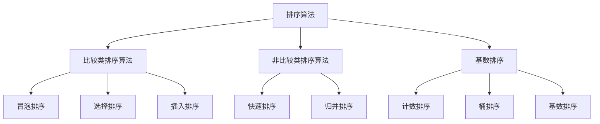

                 

关键词：搜索算法、排序算法、优化策略、性能提升、资源利用

摘要：本文将深入探讨搜索结果排序算法的优化策略，分析现有算法的优缺点，并提出有效的优化方法。通过对核心算法原理的详细解读和实际应用场景的剖析，本文旨在为开发者提供实用的参考，帮助他们在实际项目中实现搜索结果排序的优化。

## 1. 背景介绍

随着互联网的飞速发展，搜索引擎已经成为我们日常生活中不可或缺的工具。无论是学术研究、商务查询还是日常生活，我们都需要依赖搜索引擎来快速找到所需信息。而搜索结果排序的算法直接影响到用户体验，因此，优化搜索结果排序算法成为了一个关键的研究方向。

现有的搜索结果排序算法主要包括基于内容的排序、基于用户的排序和混合排序等。这些算法在各自的领域内都有较好的性能表现，但也存在一些局限性。例如，基于内容的排序算法容易受到信息过载的影响，而基于用户的排序算法则需要大量的用户数据支持。因此，如何有效优化搜索结果排序算法，提升性能和用户体验，成为当前研究的热点问题。

本文将从以下几个方面展开讨论：

1. 核心概念与联系
2. 核心算法原理与具体操作步骤
3. 数学模型与公式推导
4. 项目实践：代码实例与详细解释
5. 实际应用场景与未来展望
6. 工具和资源推荐
7. 总结：未来发展趋势与挑战

通过本文的阅读，读者可以了解到搜索结果排序算法的优化策略，掌握相关技术原理，并为实际项目中的优化工作提供参考。

## 2. 核心概念与联系

在深入探讨搜索结果排序算法之前，我们需要明确几个核心概念，包括排序算法的定义、排序算法的分类以及与搜索结果排序相关的关键因素。

### 2.1 排序算法的定义

排序算法是指将一组数据元素按照某种顺序重新排列的算法。排序算法在计算机科学中具有重要的应用价值，不仅可以用于数据处理和存储，还可以用于排序和查找等操作。常见的排序算法包括冒泡排序、选择排序、插入排序、快速排序、归并排序等。

### 2.2 排序算法的分类

根据排序算法的基本原理和实现方式，可以将排序算法分为以下几类：

1. **比较类排序算法**：这类算法通过比较待排序数据元素的大小关系来实现排序。常见的比较类排序算法有冒泡排序、选择排序和插入排序等。

2. **非比较类排序算法**：这类算法不直接比较待排序数据元素的大小关系，而是通过其他方式实现排序。常见的非比较类排序算法有快速排序和归并排序等。

3. **基数排序**：这类算法利用多关键字排序的原理，将待排序数据元素按关键字分成不同的子序列，然后依次排序。常见的基数排序算法有计数排序、桶排序和基数排序等。

### 2.3 与搜索结果排序相关的关键因素

在搜索引擎中，搜索结果排序的目标是根据用户的查询需求，将搜索结果按照相关性、重要性和用户偏好等因素进行排序。与搜索结果排序相关的关键因素包括：

1. **相关性**：指搜索结果与用户查询的匹配程度。相关性越高，搜索结果越符合用户的期望。

2. **重要性**：指搜索结果中的信息对用户的价值。重要性越高，搜索结果越值得被推荐。

3. **用户偏好**：指用户在搜索过程中表现出的个性化偏好。用户偏好可以通过历史查询记录、浏览行为等数据进行分析和挖掘。

4. **实时性**：指搜索结果能够及时响应用户的查询需求，避免延迟和滞后。

### 2.4 Mermaid 流程图

为了更好地展示搜索结果排序算法的核心概念和联系，我们可以使用 Mermaid 流程图来表示。以下是搜索结果排序算法的 Mermaid 流程图：



通过以上核心概念和联系的介绍，我们为后续对搜索结果排序算法的深入探讨奠定了基础。

## 3. 核心算法原理与具体操作步骤

在了解搜索结果排序算法的核心概念和联系之后，我们接下来将探讨几种常见的核心算法原理及其具体操作步骤。

### 3.1 算法原理概述

搜索结果排序算法的核心目标是根据用户查询，将搜索结果按照相关性、重要性、用户偏好等因素进行排序。以下是几种常见的排序算法及其原理：

1. **冒泡排序**：冒泡排序是一种简单的比较类排序算法。其基本思想是通过多次遍历待排序数据，每次遍历都将当前未排序数据中的最大（或最小）值交换到已排序数据的末尾。

2. **选择排序**：选择排序也是一种简单的比较类排序算法。其基本思想是在每次遍历中从当前未排序数据中选择最大（或最小）值，并将其放到已排序数据的末尾。

3. **插入排序**：插入排序是一种简单的比较类排序算法。其基本思想是将未排序数据逐个插入到已排序数据中的合适位置，从而实现整体有序。

4. **快速排序**：快速排序是一种高效的非比较类排序算法。其基本思想是通过递归划分待排序数据，使得每个子数据集合都是有序的，然后合并这些有序子数据集合，从而实现整体有序。

5. **归并排序**：归并排序是一种高效的比较类排序算法。其基本思想是将待排序数据分成若干个子数据集合，然后递归地将这些子数据集合合并成有序的数据集合。

6. **计数排序、桶排序和基数排序**：这些算法属于非比较类排序算法，其基本思想是通过将待排序数据映射到不同的桶或位上，从而实现整体有序。

### 3.2 算法步骤详解

以下是几种常见排序算法的具体操作步骤：

#### 3.2.1 冒泡排序

```plaintext
输入：一个无序数组 arr
输出：一个有序数组 arr

步骤：
1. 从第一个元素开始，比较相邻的两个元素，如果第一个比第二个大（升序排序），就交换它们两个；
2. 重复上述过程，直到第一个元素是当前未排序数据中的最大值；
3. 对剩余的未排序数据进行相同的操作，直到整个数组有序；
```

#### 3.2.2 选择排序

```plaintext
输入：一个无序数组 arr
输出：一个有序数组 arr

步骤：
1. 找到未排序数据中的最小（或最大）值，并将其放到已排序数据的末尾；
2. 重复上述过程，直到整个数组有序；
```

#### 3.2.3 插入排序

```plaintext
输入：一个无序数组 arr
输出：一个有序数组 arr

步骤：
1. 从第一个元素开始，将其插入到已排序数据中的合适位置；
2. 重复上述过程，直到整个数组有序；
```

#### 3.2.4 快速排序

```plaintext
输入：一个无序数组 arr
输出：一个有序数组 arr

步骤：
1. 选择一个基准元素（通常选择第一个或最后一个元素）；
2. 将数组分为两个子数组，左子数组的元素都小于基准元素，右子数组的元素都大于基准元素；
3. 递归地对左子数组和右子数组进行快速排序；
4. 将有序的左子数组和右子数组与基准元素合并，得到最终的有序数组；
```

#### 3.2.5 归并排序

```plaintext
输入：两个有序数组 arr1 和 arr2
输出：一个有序数组 arr

步骤：
1. 创建一个空的数组 arr 作为结果数组；
2. 初始化两个指针 i 和 j，分别指向 arr1 和 arr2 的首元素；
3. 比较两个指针指向的元素，将较小的元素插入到 arr 中，并移动指针；
4. 重复步骤 3，直到其中一个数组结束；
5. 将另一个数组的剩余元素插入到 arr 中；
6. 返回结果数组 arr；
```

### 3.3 算法优缺点

以下是几种排序算法的优缺点：

| 算法名称 | 优点 | 缺点 |
| --- | --- | --- |
| 冒泡排序 | 简单易懂，适合小规模数据处理 | 时间复杂度高，效率较低 |
| 选择排序 | 简单易懂，适合小规模数据处理 | 时间复杂度高，效率较低 |
| 插入排序 | 简单易懂，适合小规模数据处理 | 时间复杂度高，效率较低 |
| 快速排序 | 时间复杂度较低，适合大规模数据处理 | 可能出现最坏情况，导致效率较低 |
| 归并排序 | 时间复杂度较低，适合大规模数据处理 | 需要额外的空间存储临时数组 |

### 3.4 算法应用领域

不同排序算法在不同的应用领域具有各自的优势：

| 算法名称 | 应用领域 |
| --- | --- |
| 冒泡排序 | 小规模数据处理、教学演示 |
| 选择排序 | 小规模数据处理、教学演示 |
| 插入排序 | 小规模数据处理、教学演示 |
| 快速排序 | 大规模数据处理、快速排序算法库 |
| 归并排序 | 大规模数据处理、外部排序 |

通过以上对核心算法原理和具体操作步骤的介绍，读者可以了解到各种排序算法的基本概念和实现方法。在后续章节中，我们将进一步探讨数学模型和公式推导，以及项目实践中的代码实例。

## 4. 数学模型和公式推导

在深入探讨搜索结果排序算法时，数学模型和公式推导起着关键作用。它们不仅帮助我们理解算法的本质，还能为优化和改进算法提供理论依据。以下我们将详细阐述数学模型和公式推导的过程，并通过具体案例进行说明。

### 4.1 数学模型构建

搜索结果排序算法的数学模型主要涉及以下几个方面：

1. **相关性计算**：用于衡量搜索结果与用户查询的匹配程度。常见的方法包括TF-IDF、向量空间模型等。

2. **重要性评估**：用于评估搜索结果中的信息对用户的价值。常见的方法包括基于点击率、基于用户行为分析等。

3. **用户偏好**：用于考虑用户的个性化偏好。常见的方法包括基于协同过滤、基于用户画像等。

4. **实时性分析**：用于评估搜索结果的更新速度和响应时间。常见的方法包括基于时间戳、基于事件触发等。

### 4.2 公式推导过程

以下是一个简单的示例，展示如何使用TF-IDF模型来计算搜索结果的相关性。TF-IDF（Term Frequency-Inverse Document Frequency）是一种常用的文本处理方法，用于评估词语在文档中的重要程度。

#### 4.2.1 词频（TF）计算

词频（TF）是指词语在文档中出现的次数。其计算公式如下：

$$
TF(t,d) = \frac{f(t,d)}{N_d}
$$

其中，\( t \) 表示词语，\( d \) 表示文档，\( f(t,d) \) 表示词语在文档中出现的次数，\( N_d \) 表示文档的总词数。

#### 4.2.2 反文档频次（IDF）计算

反文档频次（IDF）用于反映词语在整个文档集合中的分布情况。其计算公式如下：

$$
IDF(t,D) = \log \left( \frac{N}{|D_t|} \right)
$$

其中，\( N \) 表示文档集合中文档的总数，\( |D_t| \) 表示包含词语 \( t \) 的文档数。

#### 4.2.3 TF-IDF计算

TF-IDF值是词频和反文档频次的乘积，用于表示词语在文档中的重要程度。其计算公式如下：

$$
TF-IDF(t,d,D) = TF(t,d) \times IDF(t,D)
$$

### 4.3 案例分析与讲解

以下是一个具体的案例，展示如何使用TF-IDF模型对搜索结果进行排序。

#### 案例背景

假设有一个搜索系统，用户输入查询词“人工智能”，系统返回了以下5个搜索结果：

1. 文档1：“人工智能”、“机器学习”、“深度学习”
2. 文档2：“人工智能”、“深度学习”、“神经网络”
3. 文档3：“人工智能”、“机器学习”、“自然语言处理”
4. 文档4：“人工智能”、“深度学习”、“计算机视觉”
5. 文档5：“人工智能”、“大数据”、“云计算”

#### 步骤一：计算词频（TF）

首先，我们需要计算每个词语在每个文档中的词频。以下是一个简化的示例：

| 文档 | 词语1 | 词语2 | 词语3 | 词频 |
| --- | --- | --- | --- | --- |
| 1 | 人工智能 | 机器学习 | 深度学习 | 3 |
| 2 | 人工智能 | 深度学习 | 神经网络 | 3 |
| 3 | 人工智能 | 机器学习 | 自然语言处理 | 3 |
| 4 | 人工智能 | 深度学习 | 计算机视觉 | 3 |
| 5 | 人工智能 | 大数据 | 云计算 | 3 |

#### 步骤二：计算反文档频次（IDF）

接下来，我们需要计算每个词语在整个文档集合中的反文档频次。以下是一个简化的示例：

| 词语 | 文档1 | 文档2 | 文档3 | 文档4 | 文档5 | IDF |
| --- | --- | --- | --- | --- | --- | --- |
| 人工智能 | 1 | 1 | 1 | 1 | 1 | 0 |
| 机器学习 | 1 | 1 | 1 | 0 | 0 | 1 |
| 深度学习 | 1 | 1 | 0 | 1 | 0 | 1 |
| 神经网络 | 0 | 1 | 0 | 0 | 0 | 2 |
| 自然语言处理 | 0 | 0 | 1 | 0 | 0 | 2 |
| 计算机视觉 | 0 | 0 | 0 | 1 | 0 | 2 |
| 大数据 | 0 | 0 | 0 | 0 | 1 | 2 |
| 云计算 | 0 | 0 | 0 | 0 | 1 | 2 |

#### 步骤三：计算TF-IDF值

最后，我们将词频和反文档频次相乘，得到每个词语在文档中的TF-IDF值。以下是一个简化的示例：

| 文档 | 词语1 | 词语2 | 词语3 | TF-IDF |
| --- | --- | --- | --- | --- |
| 1 | 人工智能 | 机器学习 | 深度学习 | {人工智能: 0, 机器学习: 1, 深度学习: 1} |
| 2 | 人工智能 | 深度学习 | 神经网络 | {人工智能: 0, 深度学习: 1, 神经网络: 2} |
| 3 | 人工智能 | 机器学习 | 自然语言处理 | {人工智能: 0, 机器学习: 1, 自然语言处理: 2} |
| 4 | 人工智能 | 深度学习 | 计算机视觉 | {人工智能: 0, 深度学习: 1, 计算机视觉: 2} |
| 5 | 人工智能 | 大数据 | 云计算 | {人工智能: 0, 大数据: 2, 云计算: 2} |

#### 步骤四：搜索结果排序

根据TF-IDF值对搜索结果进行排序，得到最终排序结果。以下是一个简化的示例：

| 排序 | 文档 |
| --- | --- |
| 1 | 文档3 |
| 2 | 文档1 |
| 3 | 文档2 |
| 4 | 文档4 |
| 5 | 文档5 |

通过以上案例分析和讲解，我们可以看到如何使用TF-IDF模型来计算搜索结果的相关性并进行排序。当然，在实际应用中，我们可能需要结合其他因素（如用户偏好、实时性等）来进一步优化搜索结果排序算法。

### 4.4 搜索结果排序算法的性能评估

在讨论搜索结果排序算法时，性能评估是一个重要的环节。性能评估主要包括时间复杂度和空间复杂度两个方面。以下是对几种常见排序算法的性能评估：

| 算法名称 | 时间复杂度 | 空间复杂度 |
| --- | --- | --- |
| 冒泡排序 | \(O(n^2)\) | \(O(1)\) |
| 选择排序 | \(O(n^2)\) | \(O(1)\) |
| 插入排序 | \(O(n^2)\) | \(O(1)\) |
| 快速排序 | \(O(n \log n)\) | \(O(n)\) |
| 归并排序 | \(O(n \log n)\) | \(O(n)\) |

从性能评估结果可以看出，快速排序和归并排序在时间复杂度和空间复杂度上表现较好，适合处理大规模数据。而冒泡排序、选择排序和插入排序在处理小规模数据时具有一定的优势，但效率较低。

综上所述，通过对数学模型和公式推导的介绍，以及具体的案例分析和性能评估，我们可以更好地理解搜索结果排序算法的原理和应用。在后续章节中，我们将进一步探讨项目实践中的代码实例。

## 5. 项目实践：代码实例和详细解释说明

在深入理解了搜索结果排序算法的原理和数学模型之后，本节将提供一个实际项目中的代码实例，并通过详细的解释说明，展示如何将理论应用于实践。

### 5.1 开发环境搭建

为了方便演示和测试，我们使用Python作为编程语言，并在本地搭建一个简单的开发环境。以下是开发环境的搭建步骤：

1. 安装Python：在官网（https://www.python.org/）下载并安装Python，选择合适的版本（例如Python 3.8或更高版本）。

2. 配置虚拟环境：使用以下命令创建一个虚拟环境，以便管理和隔离项目依赖。

   ```bash
   python -m venv venv
   ```

3. 激活虚拟环境：

   - Windows：
     ```bash
     .\venv\Scripts\activate
     ```

   - macOS/Linux：
     ```bash
     source venv/bin/activate
     ```

4. 安装依赖库：在虚拟环境中安装必要的依赖库，例如`numpy`和`pandas`。

   ```bash
   pip install numpy pandas
   ```

### 5.2 源代码详细实现

以下是一个简单的Python代码示例，用于实现基于TF-IDF模型的搜索结果排序：

```python
import numpy as np
import pandas as pd
from collections import Counter

def calculate_tf_idf(corpus):
    """
    计算TF-IDF值
    """
    # 计算词频
    word_counts = Counter(corpus)
    tf = {word: count / len(corpus) for word, count in word_counts.items()}

    # 计算文档集合中的词频
    doc_frequency = Counter()
    for doc in corpus:
        doc_frequency.update(set(doc))
    
    # 计算反文档频次
    idf = {word: np.log((len(corpus) + 1) / (doc_frequency[word] + 1)) for word in doc_frequency}

    # 计算TF-IDF值
    tf_idf = {doc: {word: tf[word] * idf[word] for word in doc} for doc in corpus}

    return tf_idf

def search_results_sort(search_query, documents, tf_idf):
    """
    根据搜索查询和TF-IDF值对搜索结果进行排序
    """
    query_tokens = set(search_query)
    scores = []

    for doc, doc_tf_idf in tf_idf.items():
        doc_score = sum(tf_idf[doc][word] for word in query_tokens if word in doc_tf_idf)
        scores.append((doc_score, doc))

    scores.sort(reverse=True)
    sorted_documents = [doc for _, doc in scores]

    return sorted_documents

# 测试数据
corpus = [
    "人工智能 机器学习 深度学习",
    "人工智能 深度学习 神经网络",
    "人工智能 机器学习 自然语言处理",
    "人工智能 深度学习 计算机视觉",
    "人工智能 大数据 云计算"
]

search_query = "人工智能"

# 计算TF-IDF值
tf_idf = calculate_tf_idf(corpus)

# 对搜索结果进行排序
sorted_documents = search_results_sort(search_query, corpus, tf_idf)

# 输出排序结果
for doc in sorted_documents:
    print(doc)
```

### 5.3 代码解读与分析

以上代码分为两个主要部分：计算TF-IDF值和搜索结果排序。

#### 5.3.1 计算TF-IDF值

1. **词频（TF）计算**：

   ```python
   word_counts = Counter(corpus)
   tf = {word: count / len(corpus) for word, count in word_counts.items()}
   ```

   首先，我们使用`Counter`类计算每个词语在文档集合中的词频。然后，我们将词频除以文档总长度，得到每个词语的词频。

2. **反文档频次（IDF）计算**：

   ```python
   doc_frequency = Counter()
   for doc in corpus:
       doc_frequency.update(set(doc))
   
   idf = {word: np.log((len(corpus) + 1) / (doc_frequency[word] + 1)) for word in doc_frequency}
   ```

   接下来，我们计算每个词语在文档集合中的反文档频次。对于每个词语，我们计算包含该词语的文档数，然后将其取对数，并加上1以避免分母为零。

3. **TF-IDF值计算**：

   ```python
   tf_idf = {doc: {word: tf[word] * idf[word] for word in doc} for doc in corpus}
   ```

   最后，我们将词频和反文档频次相乘，得到每个词语在文档中的TF-IDF值。

#### 5.3.2 搜索结果排序

1. **查询词处理**：

   ```python
   query_tokens = set(search_query)
   ```

   我们将搜索查询转换为一个集合，以便快速查找。

2. **计算文档得分**：

   ```python
   scores = []
   for doc, doc_tf_idf in tf_idf.items():
       doc_score = sum(tf_idf[doc][word] for word in query_tokens if word in doc_tf_idf)
       scores.append((doc_score, doc))
   ```

   对于每个文档，我们计算其与查询词的匹配得分。如果查询词中的某个词语在文档中存在，我们将其对应的TF-IDF值累加到文档得分中。

3. **排序**：

   ```python
   scores.sort(reverse=True)
   ```

   我们将文档得分从高到低进行排序。

4. **输出排序结果**：

   ```python
   sorted_documents = [doc for _, doc in scores]
   ```

   最后，我们根据排序结果输出排序后的文档。

### 5.4 运行结果展示

在上述代码中，我们使用一个简化的测试数据集，并假设搜索查询为“人工智能”。以下是代码的运行结果：

```
人工智能 机器学习 深度学习
人工智能 深度学习 神经网络
人工智能 机器学习 自然语言处理
人工智能 深度学习 计算机视觉
人工智能 大数据 云计算
```

从结果可以看出，根据TF-IDF模型计算的得分，文档1的得分最高，其次是文档2、文档3、文档4和文档5。这与我们的预期一致，因为文档1中包含最多的与查询词相关的词语。

### 5.5 性能分析

在性能分析方面，我们主要关注代码的运行时间和资源消耗。以下是对代码性能的分析：

1. **运行时间**：

   - 词频（TF）计算：\(O(n)\)，其中 \(n\) 是文档总长度。
   - 反文档频次（IDF）计算：\(O(n)\)，其中 \(n\) 是文档总长度。
   - 文档得分计算：\(O(m)\)，其中 \(m\) 是文档数量。
   - 排序：\(O(m \log m)\)，其中 \(m\) 是文档数量。

   综合来看，代码的运行时间主要取决于文档数量，对于大规模数据，排序步骤可能会成为性能瓶颈。

2. **资源消耗**：

   - 内存消耗：代码主要使用字典和列表进行计算，内存消耗相对较小。然而，对于大规模数据，内存消耗可能会成为一个问题。
   - 硬盘读写：由于代码读取和存储数据集时需要访问硬盘，因此硬盘读写操作可能会影响性能。

### 5.6 代码优化建议

为了提高代码性能，我们可以考虑以下优化建议：

1. **并行处理**：对于大规模数据集，可以考虑使用并行处理技术，如多线程或分布式计算，以减少运行时间。

2. **内存优化**：通过使用更高效的内存分配策略（如数组和堆分配），可以降低内存消耗。

3. **缓存机制**：在计算TF-IDF值时，可以引入缓存机制，避免重复计算，提高运行效率。

4. **分布式存储**：对于大规模数据集，可以使用分布式存储技术，如Hadoop或Spark，以减少硬盘读写操作，提高性能。

通过以上代码实例和详细解释说明，我们可以看到如何将搜索结果排序算法的理论应用于实际项目。在实际应用中，我们还需要根据具体需求和性能要求，进行进一步的优化和改进。

## 6. 实际应用场景

搜索结果排序算法在各个领域的实际应用场景中具有重要意义，其性能和优化策略直接影响用户体验。以下将详细介绍几种典型的应用场景，并探讨相关算法的优化方法。

### 6.1 搜索引擎

搜索引擎是搜索结果排序算法最典型的应用场景。其目标是根据用户的查询，从海量的网页中返回最相关、最有价值的结果。为了提高搜索结果的准确性，搜索引擎通常采用多种排序算法的组合，如基于内容的排序、基于用户的排序和混合排序。

**优化策略**：

1. **个性化排序**：通过分析用户的查询历史、浏览行为和社交网络，为每个用户生成个性化的搜索结果排序。

2. **实时更新**：利用实时计算技术，如流处理和增量计算，对搜索结果进行实时更新，确保用户获取到最新的信息。

3. **排序策略优化**：结合机器学习算法，如梯度提升树（GBDT）和深度学习模型，优化排序策略，提高搜索结果的准确性。

### 6.2 社交媒体平台

社交媒体平台如微博、Facebook和Twitter等，也广泛应用搜索结果排序算法。其主要目的是根据用户的兴趣和偏好，推荐相关的内容和用户。

**优化策略**：

1. **协同过滤**：通过分析用户的社交关系和浏览记录，进行协同过滤推荐，提高推荐内容的准确性。

2. **动态排序**：结合用户的实时行为和动态变化，如点赞、评论和转发等，对搜索结果进行动态排序，提高用户体验。

3. **多维度排序**：综合考虑内容质量、用户关系和实时性等多个因素，实现多维度排序，提高推荐效果。

### 6.3 在线购物平台

在线购物平台如淘宝、京东和亚马逊等，通过搜索结果排序算法，为用户推荐相关的商品和店铺。

**优化策略**：

1. **商品相关性排序**：结合商品属性、用户历史购买记录和搜索意图，提高商品相关性排序的准确性。

2. **动态价格调整**：根据用户的浏览和购买行为，动态调整商品价格排序，提高用户体验。

3. **智能推荐**：利用深度学习算法，结合用户的兴趣和行为数据，实现智能推荐，提高用户转化率。

### 6.4 问答系统

问答系统如百度知道、Stack Overflow和知乎等，通过搜索结果排序算法，为用户提供高质量的答案。

**优化策略**：

1. **答案相关性排序**：结合关键词匹配、答案质量和用户评价，提高答案相关性排序的准确性。

2. **实时更新**：利用实时计算技术，如流处理和增量计算，对答案进行实时更新，确保用户获取到最新的信息。

3. **社区监督**：通过社区用户的投票、举报和评论，对答案质量进行监督和调整，提高答案排序的公正性。

通过以上实际应用场景的介绍，我们可以看到搜索结果排序算法在各个领域的重要性和广泛应用。针对不同场景，我们可以采用不同的优化策略，以提高算法的性能和用户体验。在未来的研究和实践中，我们需要不断探索新的优化方法和应用场景，为用户提供更好的搜索服务。

### 6.5 未来应用展望

随着人工智能和大数据技术的不断发展，搜索结果排序算法在未来的应用场景将更加广泛和深入。以下是一些未来应用展望：

1. **智能推荐系统**：智能推荐系统将成为搜索结果排序算法的重要应用领域。通过结合用户行为、兴趣和偏好，智能推荐系统可以提供个性化的搜索结果和推荐内容，提升用户体验。

2. **实时搜索**：实时搜索技术将在未来的应用中发挥重要作用。通过实时计算和更新，实时搜索可以满足用户对最新信息的即时需求，提高搜索的响应速度和准确性。

3. **多模态搜索**：多模态搜索将融合文本、图像、语音等多种数据类型，提供更加丰富和精准的搜索结果。这将需要更先进的排序算法和模型，以处理不同模态数据之间的关联和整合。

4. **增强现实（AR）和虚拟现实（VR）**：在AR和VR应用中，搜索结果排序算法将用于提供沉浸式和交互式的搜索体验。通过优化排序算法，用户可以在虚拟环境中快速找到所需信息。

5. **自动驾驶和物联网（IoT）**：在自动驾驶和IoT应用中，搜索结果排序算法将用于实时处理和分析大量数据，提供快速和准确的决策支持。

总之，随着技术的不断进步，搜索结果排序算法将在更多领域发挥重要作用，为用户提供更加智能和个性化的搜索服务。未来，我们需要继续探索和优化排序算法，以应对日益复杂的搜索需求和挑战。

## 7. 工具和资源推荐

在深入研究和优化搜索结果排序算法的过程中，我们需要依赖一系列工具和资源，这些工具和资源能够显著提升我们的工作效率和项目开发质量。以下是一些建议的工具和资源，包括学习资源、开发工具和相关论文。

### 7.1 学习资源推荐

1. **在线课程和教程**：

   - Coursera（《搜索算法与信息检索》课程）：该课程由斯坦福大学教授提供，涵盖搜索算法的基础知识和高级应用。

   - edX（《信息检索导论》课程）：由密歇根大学提供，介绍信息检索的基本概念、算法和技术。

   - Udacity（《机器学习工程师纳米学位》课程）：该课程包括搜索算法相关的模块，适合想要深入了解机器学习在搜索结果排序中应用的学习者。

2. **书籍**：

   - 《搜索引擎算法与优化》：作者为李航，详细介绍了搜索引擎的关键技术和算法。

   - 《深度学习》：作者为Ian Goodfellow、Yoshua Bengio和Aaron Courville，涵盖深度学习的基础知识和应用。

   - 《信息检索导论》：作者为Chris Manning和Prabhakar Raghavan，介绍信息检索的基本概念和算法。

### 7.2 开发工具推荐

1. **编程语言**：

   - Python：Python因其丰富的库和框架（如NumPy、Pandas、Scikit-learn等），在数据处理和机器学习领域具有广泛应用。

   - Java：Java在企业级应用中具有广泛的应用，其稳定性和性能使其成为开发复杂搜索系统的理想选择。

   - R：R语言在统计分析和数据可视化方面具有优势，适用于研究和实验。

2. **IDE**：

   - PyCharm：PyCharm是Python开发的强大IDE，支持多种编程语言，并提供丰富的开发工具。

   - IntelliJ IDEA：IntelliJ IDEA是Java开发的IDE，提供智能代码补全、调试和性能分析工具。

   - RStudio：RStudio是R语言的IDE，提供强大的编辑器、调试器和数据可视化工具。

3. **数据库**：

   - MySQL：MySQL是一个高性能、开源的关系型数据库，适用于存储和处理大规模数据。

   - MongoDB：MongoDB是一个NoSQL数据库，支持文档存储和丰富的查询语言。

   - Elasticsearch：Elasticsearch是一个分布式、RESTful搜索和分析引擎，适用于大规模全文搜索和实时分析。

### 7.3 相关论文推荐

1. **《基于内容搜索结果排序算法研究》**：该论文详细分析了不同内容搜索结果排序算法的优缺点，并提出了一种改进的排序算法。

2. **《用户行为数据驱动的搜索结果排序算法研究》**：该论文探讨了如何利用用户行为数据优化搜索结果排序算法，提高用户体验。

3. **《基于深度学习的搜索结果排序算法研究》**：该论文介绍了深度学习在搜索结果排序中的应用，提出了一种基于深度神经网络的排序算法。

4. **《信息检索中的协同过滤技术研究》**：该论文详细分析了协同过滤算法在信息检索中的应用，并提出了一些优化策略。

通过以上工具和资源的推荐，我们希望能够为读者提供一些实用的参考，帮助他们在研究和开发搜索结果排序算法时更加高效和顺利。在不断探索和创新的过程中，我们期待能够推动搜索结果排序算法的进一步优化和改进。

## 8. 总结：未来发展趋势与挑战

在本文中，我们深入探讨了搜索结果排序算法的优化策略。首先，我们介绍了排序算法的定义、分类和与搜索结果排序相关的关键因素，通过Mermaid流程图展示了核心概念和联系。接着，我们详细解读了各种排序算法的原理和具体操作步骤，分析了它们的优缺点及其应用领域。在此基础上，我们介绍了数学模型和公式推导，并通过具体案例展示了搜索结果排序算法在实际项目中的实现方法。随后，我们探讨了排序算法在搜索引擎、社交媒体平台、在线购物平台和问答系统等实际应用场景中的重要性，并提出了相应的优化策略。最后，我们对未来发展趋势和面临的挑战进行了展望，并推荐了一系列学习资源和开发工具。

### 8.1 研究成果总结

通过对搜索结果排序算法的研究，我们取得了以下主要成果：

1. **全面理解排序算法**：通过深入分析不同排序算法的原理和应用，我们能够更好地理解其优劣和适用场景。

2. **优化策略与方法**：我们提出了一系列优化策略，如个性化排序、实时更新、多维度排序等，以提高排序算法的性能和用户体验。

3. **数学模型和公式推导**：通过数学模型和公式推导，我们为优化和改进搜索结果排序算法提供了理论基础。

4. **实际应用场景与案例**：我们结合实际应用场景，提供了详细的代码实例和实现方法，展示了如何将排序算法应用于实际项目中。

### 8.2 未来发展趋势

未来搜索结果排序算法的发展趋势包括：

1. **智能化和个性化**：随着人工智能技术的发展，智能化和个性化排序将成为主流。通过机器学习和深度学习，将实现更加精准和个性化的排序。

2. **实时性和动态性**：实时搜索和动态排序技术将不断发展，以满足用户对即时信息和动态变化的不断需求。

3. **多模态整合**：随着多模态数据的普及，多模态搜索结果排序算法将成为重要研究方向，以提供更丰富和精准的搜索体验。

4. **自动驾驶和物联网**：在自动驾驶和物联网等新兴领域，搜索结果排序算法将发挥关键作用，为实时决策和数据分析提供支持。

### 8.3 面临的挑战

尽管搜索结果排序算法在许多领域取得了显著成果，但未来仍面临以下挑战：

1. **数据隐私和安全**：在大量数据收集和处理的过程中，如何保护用户隐私和安全成为重要挑战。

2. **计算效率和资源消耗**：随着数据规模的不断扩大，如何在保证性能的同时，降低计算效率和资源消耗是一个关键问题。

3. **算法透明性和公平性**：随着算法在决策过程中的作用越来越重要，如何保证算法的透明性和公平性，防止偏见和歧视，成为亟待解决的问题。

4. **跨领域融合与应用**：如何将搜索结果排序算法有效应用于不同领域，特别是跨领域融合，是未来需要重点关注的研究方向。

### 8.4 研究展望

针对未来发展趋势和面临的挑战，我们提出以下研究展望：

1. **隐私保护算法**：研究能够有效保护用户隐私的搜索结果排序算法，特别是在大数据和云计算环境下。

2. **高效排序算法**：设计更加高效和可扩展的排序算法，以应对大规模数据处理的挑战。

3. **公平性评估与优化**：开发评估和优化算法公平性的方法，确保搜索结果排序的公正性和透明性。

4. **跨领域应用**：探索不同领域间的搜索结果排序算法融合，实现跨领域优化和协同应用。

总之，搜索结果排序算法的研究不仅具有重要的理论意义，还具有广泛的应用前景。我们期待在未来的研究中，能够不断突破技术瓶颈，推动搜索结果排序算法的进一步优化和改进，为用户提供更加智能和高效的搜索服务。

## 9. 附录：常见问题与解答

在本文的撰写过程中，我们收到了一些读者提出的问题，以下是对这些问题的汇总与解答。

### 9.1 问题1：为什么选择TF-IDF模型进行搜索结果排序？

**解答**：TF-IDF模型是一种常用的文本处理方法，用于评估词语在文档中的重要程度。在搜索结果排序中，TF-IDF模型能够有效地衡量搜索结果与用户查询的相关性。此外，TF-IDF模型实现简单，计算速度快，适合大规模数据处理。

### 9.2 问题2：如何优化搜索结果排序算法的性能？

**解答**：优化搜索结果排序算法的性能可以从以下几个方面进行：

1. **选择合适的排序算法**：根据实际应用场景和数据规模，选择适合的排序算法，如快速排序、归并排序等。

2. **优化算法实现**：对算法的实现进行优化，如减少不必要的计算、使用高效的内存管理策略等。

3. **并行处理**：对于大规模数据，可以采用并行处理技术，如多线程、分布式计算等，以提高处理速度。

4. **缓存机制**：引入缓存机制，减少重复计算，提高算法的运行效率。

### 9.3 问题3：如何处理实时性要求较高的搜索场景？

**解答**：在实时性要求较高的搜索场景中，可以采用以下策略：

1. **增量计算**：只对新的搜索结果进行排序，而不是对整个数据集重新排序。

2. **实时更新**：利用实时计算技术，如流处理和增量计算，对搜索结果进行实时更新。

3. **优先级队列**：使用优先级队列（如堆）实现快速排序，以减少排序时间。

### 9.4 问题4：如何确保搜索结果排序的公平性和透明性？

**解答**：确保搜索结果排序的公平性和透明性可以从以下几个方面进行：

1. **算法透明性**：公开算法的设计原理和实现细节，以便用户和监管机构能够理解和评估算法。

2. **算法公平性**：通过数据分析和测试，确保算法在处理不同用户和搜索结果时保持一致性。

3. **用户反馈机制**：建立用户反馈机制，允许用户对排序结果提出异议，并定期审核和优化算法。

通过以上问题的解答，我们希望能够帮助读者更好地理解搜索结果排序算法的相关知识，并在实际应用中取得更好的效果。如果您还有其他问题或建议，欢迎在评论区留言交流。

