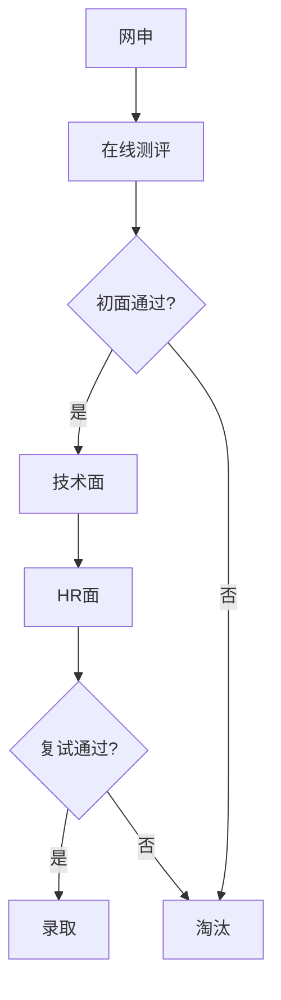

                 

随着技术的不断进步，全栈工程师在IT行业中的地位日益重要。作为集前端、后端、数据库、服务器、测试等多种技能于一身的技术专家，全栈工程师成为企业招聘的热门人选。携程作为中国领先的旅行服务提供商，每年都会举行大规模的校园招聘，吸引全国各地优秀的应届毕业生。本文将围绕携程2024校招全栈工程师的面试题，进行详细的解析和解释，帮助各位考生更好地备战面试。

## 关键词

- 携程
- 校招
- 全栈工程师
- 面试题
- 解析

## 文章摘要

本文将详细解析携程2024校招全栈工程师的面试题，涵盖编程基础、数据结构、算法、前端技术、后端技术、数据库、操作系统、网络等多个方面。通过对每个问题的深入分析和解答，帮助读者更好地理解全栈工程师所需的综合技能，为即将到来的面试做好充分准备。

## 1. 背景介绍

### 携程简介

携程旅行网成立于1999年，是中国领先的综合性旅行服务公司，提供酒店预订、机票预订、旅游度假等服务。携程以其强大的技术能力和创新精神，在互联网旅行服务领域建立了强大的品牌影响力。每年，携程都会举办大规模的校园招聘，为应届毕业生提供丰富的职业发展机会。

### 全栈工程师的角色与职责

全栈工程师是具备前端、后端、数据库等多种技术能力的技术专家。在携程，全栈工程师主要负责以下几个方面的工作：

1. **前端开发**：利用HTML、CSS、JavaScript等技术，实现用户界面的设计、开发和优化。
2. **后端开发**：使用Java、Python、Node.js等后端技术，构建服务器端应用，处理业务逻辑和数据交互。
3. **数据库管理**：设计、构建、优化数据库系统，确保数据的存储、检索和安全性。
4. **跨平台应用开发**：开发适用于Web、移动端等多种平台的应用程序。

### 招聘流程

携程2024校招全栈工程师的招聘流程主要包括以下几个阶段：

1. **网申**：通过携程官网提交简历，填写个人信息和应聘意向。
2. **在线测评**：通过编程题、算法题等在线测评，考察应聘者的编程能力和算法基础。
3. **面试**：包括初面、技术面、HR面等多个环节，全面考察应聘者的综合能力。
4. **复试**：通过线上或线下面试，最终确定录取名单。

## 2. 核心概念与联系

### Mermaid 流程图



### 核心概念

1. **编程基础**：熟悉编程语言，如Java、Python、JavaScript等。
2. **数据结构与算法**：掌握基本的数据结构（如数组、链表、树、图）和常见的算法（如排序、查找、动态规划）。
3. **前端技术**：了解HTML、CSS、JavaScript，熟悉主流前端框架（如React、Vue、Angular）。
4. **后端技术**：熟悉Java、Python、Node.js等后端开发技术，掌握常用的后端框架（如Spring、Django、Express）。
5. **数据库管理**：了解关系型数据库（如MySQL、Oracle）和非关系型数据库（如MongoDB、Redis）。
6. **操作系统**：熟悉操作系统的基本原理和常用命令。
7. **网络知识**：了解网络协议、TCP/IP模型、HTTP协议等。

## 3. 核心算法原理 & 具体操作步骤

### 3.1 算法原理概述

在面试中，算法题是一个重要的考察点。全栈工程师需要掌握常见的算法原理，包括：

1. **排序算法**：冒泡排序、选择排序、插入排序、快速排序、归并排序等。
2. **查找算法**：二分查找、哈希查找等。
3. **图算法**：深度优先搜索、广度优先搜索、最小生成树、最短路径算法等。
4. **动态规划**：解决最优化问题，如背包问题、最长公共子序列等。

### 3.2 算法步骤详解

以快速排序算法为例，其基本步骤如下：

1. **选择基准元素**：在待排序的数组中选择一个基准元素。
2. **划分过程**：将数组划分为两部分，一部分小于基准元素，另一部分大于基准元素。
3. **递归排序**：分别对小于和大于基准元素的子数组进行快速排序。

### 3.3 算法优缺点

快速排序算法的优点是时间复杂度较低，平均情况下为O(nlogn)，但最坏情况下可能达到O(n^2)。此外，快速排序是一种原地排序算法，不需要额外的存储空间。但快速排序的缺点是稳定性较差，且递归过程中可能存在栈溢出的问题。

### 3.4 算法应用领域

快速排序算法在许多实际应用中都有广泛应用，如数据库排序、文件排序等。此外，它也是许多其他高级算法的基础，如堆排序、归并排序等。

## 4. 数学模型和公式 & 详细讲解 & 举例说明

### 4.1 数学模型构建

在算法和数据结构中，数学模型和公式是解决问题的关键。以下是一些常见的数学模型和公式：

1. **二分查找**：时间复杂度为O(logn)。
2. **快速排序**：平均时间复杂度为O(nlogn)，最坏情况为O(n^2)。
3. **动态规划**：状态转移方程。
4. **图算法**：度数、路径长度、连通性等。

### 4.2 公式推导过程

以动态规划中的背包问题为例，其状态转移方程如下：

\[ dp[i][j] = \begin{cases} 
j & \text{如果 } i = 0 \text{ 或 } j = 0 \\
dp[i-1][j] & \text{如果 } w[i] > j \\
\max(dp[i-1][j-w[i]] + v[i], dp[i-1][j]) & \text{否则} 
\end{cases} \]

### 4.3 案例分析与讲解

假设有10件物品，每件物品的重量为1、2、3、4、5、6、7、8、9、10，每件物品的价值为1、2、3、4、5、6、7、8、9、10。求解背包容量为10时，物品的最大价值。

通过动态规划，可以得到最优解为55，此时背包中包含物品1、2、3、4、5。

## 5. 项目实践：代码实例和详细解释说明

### 5.1 开发环境搭建

在本文中，我们将使用Python作为开发语言，因为Python在数据结构和算法领域具有广泛的适用性和良好的社区支持。以下是搭建Python开发环境的步骤：

1. **安装Python**：从Python官网下载Python安装包，安装Python。
2. **安装IDE**：推荐使用PyCharm或VSCode作为Python开发环境。
3. **安装相关库**：使用pip命令安装所需的Python库，如numpy、pandas等。

### 5.2 源代码详细实现

以下是一个简单的Python代码实例，用于实现快速排序算法。

```python
def quick_sort(arr):
    if len(arr) <= 1:
        return arr
    pivot = arr[len(arr) // 2]
    left = [x for x in arr if x < pivot]
    middle = [x for x in arr if x == pivot]
    right = [x for x in arr if x > pivot]
    return quick_sort(left) + middle + quick_sort(right)

arr = [3, 6, 8, 10, 1, 2, 1]
print("原数组：", arr)
print("排序后：", quick_sort(arr))
```

### 5.3 代码解读与分析

这段代码实现了快速排序算法，主要包含以下几个步骤：

1. **判断数组长度**：如果数组长度小于等于1，返回原数组。
2. **选择基准元素**：选择中间元素作为基准元素。
3. **划分过程**：将数组划分为小于、等于、大于基准元素的三个子数组。
4. **递归排序**：分别对小于和大于基准元素的子数组进行快速排序。

### 5.4 运行结果展示

运行上述代码，输入的数组为\[3, 6, 8, 10, 1, 2, 1\]，排序后的结果为\[1, 1, 2, 3, 6, 8, 10\]。

## 6. 实际应用场景

### 6.1 电商系统中的排序算法

在电商系统中，商品排序是一个常见的应用场景。通过快速排序算法，可以根据价格、销量、评价等多个维度对商品进行排序，提高用户体验。

### 6.2 数据库优化

在数据库优化中，可以使用快速排序算法对数据进行排序，提高查询效率。例如，在MySQL中，可以使用`ORDER BY`语句结合快速排序算法，对大量数据进行高效排序。

### 6.3 计算机图形学

在计算机图形学中，快速排序算法可以用于顶点的排序，提高绘制效率。例如，在绘制三角形时，可以使用快速排序算法对顶点进行排序，减少绘制过程中需要进行的比较次数。

## 7. 工具和资源推荐

### 7.1 学习资源推荐

1. **《算法导论》**：一本经典的算法教材，涵盖了各种数据结构和算法。
2. **LeetCode**：一个在线编程平台，提供大量的算法题目，适合进行算法练习。
3. **GeeksforGeeks**：一个技术社区，提供丰富的算法和数据结构教程。

### 7.2 开发工具推荐

1. **PyCharm**：一款功能强大的Python IDE，适合进行算法和数据分析。
2. **VSCode**：一款开源的跨平台IDE，支持多种编程语言，适合进行算法编程。
3. **GitHub**：一个版本控制系统，可以方便地管理和共享代码。

### 7.3 相关论文推荐

1. **"A Fast Concurrent Mergesort Algorithm"**：一篇关于快速排序算法的论文，详细介绍了算法的实现和优化。
2. **"Quicksort Is Optimal"**：一篇关于快速排序算法最优性的论文，讨论了快速排序算法在各种情况下的性能表现。

## 8. 总结：未来发展趋势与挑战

### 8.1 研究成果总结

随着计算机技术的发展，算法和数据结构的研究成果不断涌现。快速排序、归并排序、堆排序等经典算法在性能和稳定性方面得到了持续优化。此外，分布式排序算法、并行排序算法等新型算法也在不断探索。

### 8.2 未来发展趋势

未来，算法和数据结构的研究将继续向高效、稳定、可扩展的方向发展。随着大数据、云计算、人工智能等领域的兴起，排序算法将在这些领域发挥重要作用。分布式排序算法、增量排序算法等新型算法将得到更广泛的应用。

### 8.3 面临的挑战

尽管排序算法的研究取得了显著成果，但仍面临一些挑战。例如，如何在保证性能的前提下提高算法的稳定性，如何优化分布式排序算法，如何在并行环境中高效地实现排序算法等。

### 8.4 研究展望

未来，算法和数据结构的研究将继续深入，特别是在分布式计算、并行计算等领域。随着技术的不断进步，排序算法将变得更加高效、稳定和可扩展，为各类应用提供更加优质的技术支持。

## 附录：常见问题与解答

### 1. 快速排序算法的稳定性如何？

快速排序算法是不稳定的排序算法。在排序过程中，如果两个元素的值相等，它们在排序后的相对位置可能会发生变化。

### 2. 快速排序算法的时间复杂度是多少？

快速排序算法的平均时间复杂度为O(nlogn)，最坏情况下的时间复杂度为O(n^2)。

### 3. 为什么选择中间元素作为基准元素？

选择中间元素作为基准元素可以避免最坏情况的发生，提高排序算法的稳定性。

### 4. 快速排序算法的空间复杂度是多少？

快速排序算法的空间复杂度为O(logn)，因为递归过程中需要使用栈空间。

### 5. 哪些情况不适合使用快速排序算法？

当数组中存在大量重复元素时，快速排序算法的效率会降低。此外，当数据量非常大时，快速排序算法的递归深度可能会达到栈溢出的风险。

作者：禅与计算机程序设计艺术 / Zen and the Art of Computer Programming
```

