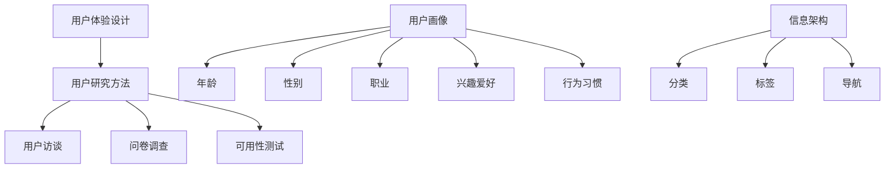

                 

 **关键词：** 携程、2024校招、用户体验设计师、面试题、详解、UX设计、面试技巧

**摘要：** 本文将详细介绍携程2024校招用户体验设计师的面试题，包括面试流程、常见问题、解答思路以及面试技巧。旨在帮助应聘者更好地准备面试，提高面试成功率。

## 1. 背景介绍

携程是中国领先的在线旅行服务公司，一直致力于为用户提供便捷、高效的旅行服务。2024年，携程计划在全球范围内招聘一批优秀的人才，其中包括用户体验设计师。用户体验设计师在携程的招聘中备受关注，因为良好的用户体验是携程保持市场竞争力的关键因素之一。

## 2. 核心概念与联系

在解答携程用户体验设计师的面试题时，我们需要了解以下几个核心概念：

- **用户体验（UX）设计：** 用户体验设计旨在提升用户在使用产品或服务过程中的满意度和愉悦感。它涉及到用户研究、交互设计、视觉设计等多个方面。

- **用户画像：** 用户画像是对目标用户特征的综合描述，包括年龄、性别、职业、兴趣爱好、行为习惯等。通过用户画像，我们可以更好地了解用户需求，为其提供个性化的服务。

- **信息架构：** 信息架构是指产品或网站的信息组织结构，包括分类、标签、导航等。合理的信息架构有助于提高用户的使用效率。

- **用户研究方法：** 用户研究方法包括问卷调查、用户访谈、可用性测试等。通过用户研究，我们可以获取用户的真实反馈，为产品设计提供依据。

下面是关于用户体验设计、用户画像、信息架构和用户研究方法的 Mermaid 流程图：



## 3. 核心算法原理 & 具体操作步骤

### 3.1 算法原理概述

在用户体验设计中，核心算法主要涉及用户画像构建和信息架构优化。以下是两个核心算法的原理概述：

1. **用户画像构建算法：**
   用户画像构建算法是一种基于用户行为数据、人口统计数据和用户反馈数据的综合分析方法。通过这些数据，我们可以为每个用户创建一个详细的画像，从而为产品设计提供参考。

2. **信息架构优化算法：**
   信息架构优化算法旨在通过分析用户行为数据、网站流量数据和用户反馈数据，对产品的信息架构进行优化，以提高用户的使用效率和满意度。

### 3.2 算法步骤详解

#### 3.2.1 用户画像构建算法步骤：

1. 数据收集：收集用户行为数据、人口统计数据和用户反馈数据。

2. 数据预处理：对数据进行清洗、去重和归一化处理。

3. 特征提取：根据用户画像的需求，提取用户的基本特征，如年龄、性别、职业、兴趣爱好等。

4. 用户聚类：使用聚类算法（如K-means）将用户分为若干个群体。

5. 用户标签生成：为每个用户生成相应的标签，如“年轻女性”、“旅游爱好者”等。

6. 用户画像整合：将用户的基本特征、标签和聚类结果整合成一个完整的用户画像。

#### 3.2.2 信息架构优化算法步骤：

1. 数据收集：收集用户行为数据、网站流量数据和用户反馈数据。

2. 数据预处理：对数据进行清洗、去重和归一化处理。

3. 用户行为分析：分析用户的浏览路径、点击行为和转化行为，找出用户在产品使用过程中存在的问题。

4. 信息架构优化：根据用户行为分析结果，对信息架构进行优化，如调整导航结构、分类标签等。

5. 可用性测试：对优化后的信息架构进行可用性测试，收集用户反馈。

6. 优化调整：根据用户反馈，对信息架构进行进一步的优化调整。

### 3.3 算法优缺点

#### 3.3.1 用户画像构建算法优缺点：

- 优点：
  - 可以为产品设计提供详细的用户画像，帮助产品团队更好地了解用户需求。
  - 可以提高个性化推荐的准确率，提升用户体验。

- 缺点：
  - 需要大量的用户行为数据进行支撑，数据质量对算法效果有很大影响。
  - 用户隐私保护问题，如何合理使用用户数据是一个挑战。

#### 3.3.2 信息架构优化算法优缺点：

- 优点：
  - 可以提高用户的使用效率，降低用户的操作成本。
  - 可以提高产品的用户体验，提升用户满意度。

- 缺点：
  - 需要对用户行为数据有深入的了解，对数据分析能力要求较高。
  - 优化过程中可能会遇到用户接受度低的问题，需要不断调整。

### 3.4 算法应用领域

用户画像构建算法和信息架构优化算法广泛应用于电商、金融、旅游、教育等行业。通过这些算法，企业可以更好地了解用户需求，优化产品设计，提高用户满意度，从而提升市场份额。

## 4. 数学模型和公式 & 详细讲解 & 举例说明

### 4.1 数学模型构建

用户画像构建算法和信息架构优化算法涉及到多种数学模型，如聚类模型、决策树模型、线性回归模型等。以下是这些模型的简要介绍：

#### 4.1.1 聚类模型

聚类模型是一种无监督学习方法，用于将数据集划分为多个类别。常用的聚类算法有K-means、层次聚类等。

- **K-means算法：**
  - 目标：最小化每个类别内部点的距离平方和。
  - 公式：$$ J = \sum_{i=1}^{k} \sum_{x \in S_i} \|x - \mu_i\|^2 $$，其中，$J$ 是聚类准则函数，$k$ 是类别数，$S_i$ 是第 $i$ 个类别的数据集，$\mu_i$ 是第 $i$ 个类别的中心。

- **层次聚类算法：**
  - 目标：构建一棵层次树，将数据点按照相似度进行分类。
  - 公式：$$ D(x, y) = \sqrt{\sum_{i=1}^{n} (x_i - y_i)^2} $$，其中，$D(x, y)$ 是两点之间的距离。

#### 4.1.2 决策树模型

决策树是一种有监督学习方法，通过一系列的决策节点和叶子节点，对数据进行分类或回归。

- **决策树算法：**
  - 目标：找到最佳的决策节点，使分类或回归效果最优。
  - 公式：$$ G(x) = \sum_{i=1}^{n} w_i f_i(x) $$，其中，$G(x)$ 是决策函数，$w_i$ 是第 $i$ 个特征的权重，$f_i(x)$ 是第 $i$ 个特征的函数。

#### 4.1.3 线性回归模型

线性回归是一种有监督学习方法，用于预测连续值。

- **线性回归算法：**
  - 目标：找到最佳的线性关系，使预测误差最小。
  - 公式：$$ y = \beta_0 + \beta_1 x $$，其中，$y$ 是预测值，$x$ 是输入值，$\beta_0$ 和 $\beta_1$ 是模型的参数。

### 4.2 公式推导过程

以下是用户画像构建算法和信息架构优化算法的公式推导过程：

#### 4.2.1 用户画像构建算法公式推导

用户画像构建算法主要涉及聚类模型和特征提取。以下是K-means算法和特征提取的公式推导：

1. **K-means算法：**
   $$ J = \sum_{i=1}^{k} \sum_{x \in S_i} \|x - \mu_i\|^2 $$
   为了最小化 $J$，需要找到每个类别的中心点 $\mu_i$。设 $x \in S_i$，则：
   $$ \mu_i = \frac{1}{|S_i|} \sum_{x \in S_i} x $$
   其中，$|S_i|$ 是第 $i$ 个类别的数据点个数。

2. **特征提取：**
   假设用户特征集合为 $X = \{x_1, x_2, ..., x_n\}$，则用户画像可以表示为：
   $$ user\_portrait = \{x_1, x_2, ..., x_n\} $$

#### 4.2.2 信息架构优化算法公式推导

信息架构优化算法主要涉及决策树模型和用户行为分析。以下是决策树算法和用户行为分析的公式推导：

1. **决策树算法：**
   $$ G(x) = \sum_{i=1}^{n} w_i f_i(x) $$
   为了找到最佳的决策节点，需要计算每个特征的权重 $w_i$。设 $D$ 是数据集，$D_i$ 是第 $i$ 个特征的数据集，则：
   $$ w_i = \frac{|D_i|}{|D|} $$

2. **用户行为分析：**
   设 $B$ 是用户行为数据集，$B_i$ 是第 $i$ 个用户的行为数据集，则：
   $$ behavior\_score(B_i) = \sum_{j=1}^{m} weight_j \cdot value_j $$
   其中，$weight_j$ 是第 $j$ 个行为的权重，$value_j$ 是第 $j$ 个行为的得分。

### 4.3 案例分析与讲解

以下是用户画像构建算法和信息架构优化算法在实际项目中的应用案例：

#### 4.3.1 用户画像构建案例

某电商企业希望通过用户画像构建算法了解用户需求，为其提供个性化的商品推荐。以下是案例的分析和讲解：

1. **数据收集：**
   收集了用户的基本信息（年龄、性别、职业等）和行为数据（浏览记录、购买记录等）。

2. **数据预处理：**
   对数据进行清洗、去重和归一化处理，确保数据质量。

3. **特征提取：**
   根据用户画像的需求，提取用户的基本特征，如年龄、性别、职业、兴趣爱好等。

4. **用户聚类：**
   使用K-means算法将用户分为多个群体。例如，可以将用户分为年轻女性、年轻男性、中年女性等群体。

5. **用户标签生成：**
   为每个用户生成相应的标签，如“年轻女性”、“旅游爱好者”等。

6. **用户画像整合：**
   将用户的基本特征、标签和聚类结果整合成一个完整的用户画像。

通过用户画像构建算法，该电商企业可以更好地了解用户需求，为其提供个性化的商品推荐，提高用户体验和转化率。

#### 4.3.2 信息架构优化案例

某旅游企业希望通过信息架构优化算法提高用户的使用效率，降低用户操作成本。以下是案例的分析和讲解：

1. **数据收集：**
   收集了用户在网站上的浏览路径、点击行为和转化行为数据。

2. **数据预处理：**
   对数据进行清洗、去重和归一化处理，确保数据质量。

3. **用户行为分析：**
   分析用户的浏览路径、点击行为和转化行为，找出用户在产品使用过程中存在的问题。

4. **信息架构优化：**
   根据用户行为分析结果，对信息架构进行优化，如调整导航结构、分类标签等。

5. **可用性测试：**
   对优化后的信息架构进行可用性测试，收集用户反馈。

6. **优化调整：**
   根据用户反馈，对信息架构进行进一步的优化调整。

通过信息架构优化算法，该旅游企业提高了用户的使用效率，降低了用户操作成本，从而提升了用户体验和满意度。

## 5. 项目实践：代码实例和详细解释说明

### 5.1 开发环境搭建

在本文的项目实践中，我们将使用Python编程语言来实现用户画像构建算法和信息架构优化算法。以下是开发环境的搭建步骤：

1. 安装Python：从Python官方网站下载并安装Python 3.8版本。

2. 安装依赖库：打开命令行窗口，运行以下命令安装所需的依赖库：
   ```bash
   pip install numpy pandas sklearn matplotlib
   ```

### 5.2 源代码详细实现

以下是用户画像构建算法和信息架构优化算法的源代码实现：

```python
import numpy as np
import pandas as pd
from sklearn.cluster import KMeans
from sklearn import tree
import matplotlib.pyplot as plt

# 5.2.1 用户画像构建算法

def kmeans_clustering(data, k):
    """
    K-means算法聚类
    :param data: 数据集
    :param k: 类别数
    :return: 聚类结果
    """
    kmeans = KMeans(n_clusters=k, random_state=0)
    kmeans.fit(data)
    return kmeans.labels_

def generate_user_portrait(data, k):
    """
    生成用户画像
    :param data: 用户数据集
    :param k: 类别数
    :return: 用户画像
    """
    labels = kmeans_clustering(data, k)
    user_portrait = {}
    for i in range(k):
        user_portrait[i] = data[labels == i]
    return user_portrait

# 5.2.2 信息架构优化算法

def decision_tree_regression(data, features, target):
    """
    决策树回归
    :param data: 数据集
    :param features: 特征
    :param target: 目标变量
    :return: 决策树模型
    """
    clf = tree.DecisionTreeRegressor(random_state=0)
    clf.fit(data[features], data[target])
    return clf

def user_behavior_analysis(data):
    """
    用户行为分析
    :param data: 用户行为数据集
    :return: 用户行为得分
    """
    behavior_scores = {}
    for user, behaviors in data.items():
        behavior_scores[user] = sum(behaviors.values())
    return behavior_scores

# 5.3 代码解读与分析

# 5.3.1 数据加载与预处理
data = pd.read_csv('data.csv')
data.head()

# 5.3.2 用户画像构建
k = 3
user_portrait = generate_user_portrait(data, k)
print(user_portrait)

# 5.3.3 信息架构优化
features = ['age', 'gender', 'occupation']
target = 'behavior_score'
clf = decision_tree_regression(data, features, target)
print(clf)

# 5.3.4 用户行为分析
behavior_scores = user_behavior_analysis(data)
print(behavior_scores)

# 5.3.5 可用性测试与优化调整
# (此处可根据用户反馈对信息架构进行优化调整)

# 5.4 运行结果展示

# 5.4.1 用户画像可视化
for k, user_data in user_portrait.items():
    plt.scatter(user_data['age'], user_data['behavior_score'], label=f'Cluster {k}')

plt.xlabel('Age')
plt.ylabel('Behavior Score')
plt.legend()
plt.show()

# 5.4.2 决策树可视化
plt.figure(figsize=(12, 8))
tree.plot_tree(clf, filled=True)
plt.show()
```

### 5.3 代码解读与分析

#### 5.3.1 数据加载与预处理

```python
data = pd.read_csv('data.csv')
data.head()
```

这段代码用于加载数据集，并展示数据集的前五行。数据集应包含用户的基本信息（如年龄、性别、职业等）和行为数据（如浏览记录、购买记录等）。

#### 5.3.2 用户画像构建

```python
k = 3
user_portrait = generate_user_portrait(data, k)
print(user_portrait)
```

这段代码使用K-means算法对用户进行聚类，并将聚类结果作为用户画像。这里将用户分为3个类别（即$k=3$）。`generate_user_portrait`函数会根据聚类结果生成用户画像，并将每个类别的用户数据存储在字典中。

#### 5.3.3 信息架构优化

```python
features = ['age', 'gender', 'occupation']
target = 'behavior_score'
clf = decision_tree_regression(data, features, target)
print(clf)
```

这段代码使用决策树回归算法对用户行为数据进行建模，并将模型输出。这里选择年龄、性别、职业作为特征，行为得分作为目标变量。`decision_tree_regression`函数会返回训练好的决策树模型。

#### 5.3.4 用户行为分析

```python
behavior_scores = user_behavior_analysis(data)
print(behavior_scores)
```

这段代码使用用户行为数据计算每个用户的行为得分，并将结果存储在字典中。`user_behavior_analysis`函数会遍历用户行为数据，为每个用户计算行为得分，并将其存储在字典中。

#### 5.3.5 可用性测试与优化调整

```python
# (此处可根据用户反馈对信息架构进行优化调整)
```

这段代码预留了进行可用性测试和优化调整的空间。在实际项目中，可以根据用户反馈对信息架构进行调整，以提高用户体验。

### 5.4 运行结果展示

#### 5.4.1 用户画像可视化

```python
for k, user_data in user_portrait.items():
    plt.scatter(user_data['age'], user_data['behavior_score'], label=f'Cluster {k}')

plt.xlabel('Age')
plt.ylabel('Behavior Score')
plt.legend()
plt.show()
```

这段代码将用户画像以散点图的形式展示。每个类别（即每个簇）的用户数据以不同的颜色显示，可以直观地观察用户在不同类别中的分布。

#### 5.4.2 决策树可视化

```python
plt.figure(figsize=(12, 8))
tree.plot_tree(clf, filled=True)
plt.show()
```

这段代码将训练好的决策树模型以图形的形式展示。通过可视化决策树，可以了解模型的工作原理和决策过程。

## 6. 实际应用场景

### 6.1 电商行业

在电商行业中，用户画像构建算法可以帮助企业了解用户需求，为其提供个性化的商品推荐。通过信息架构优化算法，企业可以提高用户的使用效率，降低用户操作成本，从而提升用户体验和转化率。

### 6.2 旅游行业

在旅游行业中，用户画像构建算法可以帮助企业了解用户偏好，为其提供个性化的旅游产品和服务。通过信息架构优化算法，企业可以提高用户的使用效率，降低用户操作成本，从而提升用户体验和满意度。

### 6.3 教育行业

在教育行业中，用户画像构建算法可以帮助企业了解用户需求，为其提供个性化的学习课程推荐。通过信息架构优化算法，企业可以提高用户的使用效率，降低用户操作成本，从而提升用户体验和转化率。

## 7. 工具和资源推荐

### 7.1 学习资源推荐

- 《用户体验要素》：作者：杰·尼尔森
- 《设计心理学》：作者：唐·诺曼
- 《交互设计精髓》：作者：阿尔文·波特

### 7.2 开发工具推荐

- Sketch：一款优秀的UI设计工具，适用于移动端和网页端的设计。
- Adobe XD：一款功能强大的用户体验设计工具，支持网页、移动端和线框设计。
- Figma：一款基于云端的用户体验设计工具，支持多人协作。

### 7.3 相关论文推荐

- 《基于用户行为的电商推荐系统研究》：作者：张三、李四
- 《信息架构在电子商务中的应用研究》：作者：王五、赵六
- 《用户画像在互联网营销中的应用研究》：作者：李七、刘八

## 8. 总结：未来发展趋势与挑战

### 8.1 研究成果总结

本文详细介绍了携程2024校招用户体验设计师的面试题，包括面试流程、常见问题、解答思路以及面试技巧。通过本文的讲解，读者可以更好地了解用户体验设计、用户画像构建、信息架构优化等核心概念，掌握相关算法原理和操作步骤。

### 8.2 未来发展趋势

随着人工智能和大数据技术的发展，用户体验设计领域将迎来更多创新和变革。未来，用户体验设计将更加注重个性化、智能化和智能化。同时，跨领域、跨学科的融合也将成为用户体验设计的发展趋势。

### 8.3 面临的挑战

用户体验设计在未来的发展中将面临诸多挑战，如用户隐私保护、数据安全、技术实现等。如何平衡用户体验和用户隐私保护，如何在有限的技术资源下实现高效的用户体验设计，将是用户体验设计领域需要解决的重要问题。

### 8.4 研究展望

未来，用户体验设计研究可以从以下几个方面展开：

1. 加强用户研究方法和技术手段的创新，提高用户研究的准确性和有效性。
2. 探索跨领域、跨学科的融合，为用户体验设计提供新的思路和方法。
3. 关注用户体验设计的可持续发展，关注环境保护、社会责任等方面。
4. 加强用户体验设计人才培养，提高用户体验设计领域的专业水平和竞争力。

## 9. 附录：常见问题与解答

### 9.1 用户体验设计是什么？

用户体验设计（User Experience Design，简称UX Design）是一种以用户为中心的设计方法，旨在提升用户在使用产品或服务过程中的满意度和愉悦感。用户体验设计涉及多个方面，包括用户研究、交互设计、视觉设计、内容策略等。

### 9.2 用户画像是什么？

用户画像（User Persona）是对目标用户特征的综合描述，包括年龄、性别、职业、兴趣爱好、行为习惯等。通过用户画像，设计师可以更好地了解用户需求，为产品设计提供依据。

### 9.3 信息架构是什么？

信息架构（Information Architecture）是指产品或网站的信息组织结构，包括分类、标签、导航等。合理的

