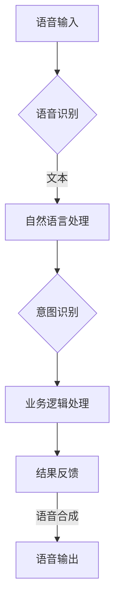

                 

关键词：智能导游、语音交互、面试题、人工智能、携程、2025、技术挑战、解决方案、应用场景

> 摘要：本文深入剖析了携程2025智能导游机器人社招语音交互面试题，从技术原理、算法实现、应用实践等多个角度进行了全面探讨。文章旨在为人工智能领域从业者提供有价值的参考，帮助读者更好地理解和应对这一前沿技术。

## 1. 背景介绍

智能导游机器人作为人工智能领域的一项重要应用，正在逐渐改变我们的出行体验。携程作为中国领先的综合性旅行服务公司，其智能导游机器人在2025年面向社会招聘时，对候选人的语音交互技术能力提出了高要求。本文将围绕携程2025智能导游机器人社招语音交互面试题，深入探讨这一技术的核心概念、算法原理、应用场景及其未来展望。

### 1.1 智能导游机器人现状

随着人工智能技术的飞速发展，智能导游机器人已经在多个领域得到应用。它们能够提供语音导览、信息查询、路径规划等服务，显著提升了游客的出行体验。目前，智能导游机器人主要应用于旅游景点、大型购物中心、机场和火车站等场所。

### 1.2 携程智能导游机器人发展历程

携程在智能导游机器人领域有着丰富的实践经验。从最初的简单语音导览功能，到如今具备复杂交互能力和个性化推荐系统的智能导游机器人，携程不断推陈出新，致力于为用户提供更加智能化的服务。

## 2. 核心概念与联系

智能导游机器人的语音交互技术是其核心组成部分。为了深入理解这一技术，我们需要了解以下核心概念：

### 2.1 自然语言处理（NLP）

自然语言处理是智能导游机器人语音交互技术的基石。NLP技术使得计算机能够理解、解释和生成人类语言，从而实现人与机器的沟通。主要涉及的任务包括文本分类、情感分析、命名实体识别、机器翻译等。

### 2.2 语音识别（ASR）

语音识别是将语音信号转换为文本的技术。智能导游机器人需要通过语音识别技术将用户的语音指令转换为计算机可理解的数据，以便进一步处理。

### 2.3 语音合成（TTS）

语音合成是将文本转换为语音的技术。智能导游机器人需要利用语音合成技术将处理结果以自然、流畅的语音形式反馈给用户。

### 2.4 Mermaid流程图

以下是智能导游机器人语音交互的Mermaid流程图：



## 3. 核心算法原理 & 具体操作步骤

### 3.1 算法原理概述

智能导游机器人语音交互的核心算法主要包括语音识别、自然语言处理、意图识别、业务逻辑处理和语音合成。以下分别介绍这些算法的基本原理：

### 3.2 算法步骤详解

#### 3.2.1 语音识别

语音识别算法将语音信号转换为文本。常见的语音识别技术包括基于统计模型的方法（如HMM、GMM、DNN）和基于深度学习的方法（如CTC、seq2seq、ASR模型）。在智能导游机器人中，语音识别算法需要具备高准确率和实时性。

#### 3.2.2 自然语言处理

自然语言处理算法用于理解文本的含义。主要任务包括词性标注、句法分析、语义分析等。在智能导游机器人中，自然语言处理算法需要能够理解用户的需求，提取关键信息，为后续的意图识别和业务逻辑处理提供支持。

#### 3.2.3 意图识别

意图识别算法用于确定用户语音指令的目的。常见的方法包括基于规则的方法、机器学习的方法和深度学习方法。在智能导游机器人中，意图识别算法需要能够准确识别用户的请求，如查询景点信息、规划路径等。

#### 3.2.4 业务逻辑处理

业务逻辑处理算法根据意图识别的结果，执行相应的任务。在智能导游机器人中，业务逻辑处理算法需要具备路径规划、信息查询、推荐系统等功能。

#### 3.2.5 语音合成

语音合成算法将处理结果以自然、流畅的语音形式反馈给用户。常见的语音合成技术包括基于文本的合成、基于语音信号的合成和基于深度学习的方法。在智能导游机器人中，语音合成算法需要具备良好的语音自然度和语音合成速度。

### 3.3 算法优缺点

#### 优点

- **高准确率**：语音识别和自然语言处理技术的不断发展，使得智能导游机器人的语音交互准确率不断提高。
- **实时性**：语音交互的实时性使得用户在需要时能够快速获得响应。
- **个性化**：通过用户数据的积累和分析，智能导游机器人能够提供个性化的服务。

#### 缺点

- **复杂度高**：智能导游机器人语音交互涉及多个技术领域，实现复杂度高。
- **数据依赖**：语音交互技术的效果很大程度上取决于数据的质量和规模。
- **环境适应性**：语音交互技术在复杂、嘈杂的环境下可能难以保证准确性和实时性。

### 3.4 算法应用领域

智能导游机器人语音交互技术广泛应用于旅游景点、大型购物中心、机场和火车站等场所。未来，随着技术的不断发展，该技术将在更多的领域得到应用，如家庭助理、智能客服等。

## 4. 数学模型和公式 & 详细讲解 & 举例说明

### 4.1 数学模型构建

在智能导游机器人语音交互中，数学模型主要用于自然语言处理和意图识别。以下是一个简单的数学模型构建过程：

#### 4.1.1 词向量表示

词向量表示是将词汇映射为高维空间中的向量。常用的词向量模型包括Word2Vec、GloVe和BERT等。以下是一个简单的Word2Vec模型构建过程：

$$
\text{word2vec}(\text{word}) = \sum_{\text{context}} \text{weight}(\text{word}, \text{context}) \cdot \text{vec}(\text{context})
$$

其中，$\text{word2vec}(\text{word})$表示词向量，$\text{weight}(\text{word}, \text{context})$表示词与上下文之间的权重，$\text{vec}(\text{context})$表示上下文的向量表示。

#### 4.1.2 意图识别模型

意图识别模型用于确定用户的请求。一个简单的意图识别模型可以是基于朴素贝叶斯的分类器，其数学模型如下：

$$
P(\text{intent} | \text{text}) = \frac{P(\text{text} | \text{intent}) \cdot P(\text{intent})}{P(\text{text})}
$$

其中，$P(\text{intent} | \text{text})$表示给定文本的意图概率，$P(\text{text} | \text{intent})$表示在特定意图下生成文本的概率，$P(\text{intent})$表示意图的概率，$P(\text{text})$表示文本的概率。

### 4.2 公式推导过程

以下是一个简单的意图识别模型推导过程：

假设我们有$m$个类别（意图），$N$个训练样本。对于每个样本$(x_i, y_i)$，其中$x_i$是文本，$y_i$是意图类别，我们需要计算每个类别下的文本概率。

首先，计算每个类别下的先验概率：

$$
P(y_i) = \frac{1}{m}
$$

然后，计算每个类别下的文本概率：

$$
P(x_i | y_i) = \frac{1}{Z} \sum_{j=1}^{m} e^{w_{ij} \cdot x_i}
$$

其中，$w_{ij}$是类别$y_i$与词汇$x_i$之间的权重，$Z$是归一化常数。

最后，计算每个类别的后验概率：

$$
P(y_i | x_i) = \frac{P(x_i | y_i) \cdot P(y_i)}{P(x_i)}
$$

其中，$P(x_i)$是文本$x_i$的概率，可以通过全排列组合计算得到。

### 4.3 案例分析与讲解

假设我们有一个包含两个类别的意图识别问题，类别1代表查询景点信息，类别2代表查询交通信息。以下是一个简单的案例：

#### 案例数据

类别1（查询景点信息）：
- 样本1：“请问黄山有什么景点？”
- 样本2：“我想了解一下西湖的历史。”

类别2（查询交通信息）：
- 样本1：“从南京到杭州怎么走？”
- 样本2：“我要从上海到黄山，该怎么乘车？”

#### 模型训练

首先，我们需要将文本转换为词向量。假设我们使用Word2Vec模型，词汇表包含5个词汇：景点、历史、交通、怎么、从。词向量分别表示为$v_1, v_2, v_3, v_4, v_5$。

然后，计算每个类别下的文本概率：

$$
P(x_1 | y_1) = \frac{1}{Z_1} \left( e^{w_{11} \cdot v_1} + e^{w_{12} \cdot v_2} + e^{w_{13} \cdot v_3} + e^{w_{14} \cdot v_4} + e^{w_{15} \cdot v_5} \right)
$$

$$
P(x_2 | y_1) = \frac{1}{Z_1} \left( e^{w_{21} \cdot v_1} + e^{w_{22} \cdot v_2} + e^{w_{23} \cdot v_3} + e^{w_{24} \cdot v_4} + e^{w_{25} \cdot v_5} \right)
$$

$$
P(x_1 | y_2) = \frac{1}{Z_2} \left( e^{w_{11} \cdot v_1} + e^{w_{12} \cdot v_2} + e^{w_{13} \cdot v_3} + e^{w_{14} \cdot v_4} + e^{w_{15} \cdot v_5} \right)
$$

$$
P(x_2 | y_2) = \frac{1}{Z_2} \left( e^{w_{21} \cdot v_1} + e^{w_{22} \cdot v_2} + e^{w_{23} \cdot v_3} + e^{w_{24} \cdot v_4} + e^{w_{25} \cdot v_5} \right)
$$

其中，$Z_1$和$Z_2$是归一化常数。

#### 模型评估

为了评估模型性能，我们可以使用交叉验证方法。将训练数据分为训练集和验证集，训练模型并在验证集上评估性能。常见的评估指标包括准确率、召回率和F1值。

## 5. 项目实践：代码实例和详细解释说明

### 5.1 开发环境搭建

为了实现智能导游机器人语音交互，我们需要搭建一个包含语音识别、自然语言处理和语音合成等组件的开发环境。以下是开发环境搭建的步骤：

#### 5.1.1 硬件要求

- CPU：至少2核
- 内存：至少4GB
- 硬盘：至少50GB
- 网络环境：稳定互联网连接

#### 5.1.2 软件要求

- 操作系统：Linux或Windows
- 编程语言：Python 3.x
- 语音识别库：PyTorch、TensorFlow或Keras
- 自然语言处理库：NLTK、spaCy或BERT
- 语音合成库：eSpeak、Flite或Google Text-to-Speech

### 5.2 源代码详细实现

以下是一个简单的智能导游机器人语音交互项目示例代码：

```python
import pyttsx3
import speech_recognition as sr

# 语音合成
engine = pyttsx3.init()
voices = engine.getProperty('voices')
engine.setProperty('voice', voices[0].id)

# 语音识别
recognizer = sr.Recognizer()

# 业务逻辑处理
def process_intent(text):
    if '景点' in text:
        return '您想了解哪个景点的信息？'
    elif '交通' in text:
        return '您想查询哪个路线的交通工具？'
    else:
        return '抱歉，我无法理解您的请求。'

# 交互流程
while True:
    try:
        print('请说出您的请求：')
        audio = recognizer.listen(source)
        text = recognizer.recognize_google(audio)
        response = process_intent(text)
        print(response)
        engine.say(response)
        engine.runAndWait()
    except sr.UnknownValueError:
        print('无法识别您的语音，请重试。')
    except sr.RequestError as e:
        print(f'无法连接到语音服务：{e}')
```

### 5.3 代码解读与分析

#### 5.3.1 语音合成

代码中首先使用`pyttsx3`库初始化语音合成引擎，并设置默认语音。通过`getProperty()`方法获取所有可用的语音，并使用`setProperty()`方法设置默认语音。

#### 5.3.2 语音识别

代码中使用`speech_recognition`库的`Recognizer`类初始化语音识别引擎。通过`listen()`方法监听用户的语音输入，并使用`recognize_google()`方法将语音转换为文本。

#### 5.3.3 业务逻辑处理

`process_intent()`函数用于处理用户的语音请求。根据用户的语音内容，返回相应的查询问题或错误提示。

#### 5.3.4 交互流程

程序进入一个无限循环，等待用户输入。每次用户输入后，程序调用`recognizer.listen()`方法获取语音输入，并使用`recognizer.recognize_google()`方法将语音转换为文本。然后，调用`process_intent()`函数处理用户的请求，并使用`engine.say()`方法将响应输出。

## 6. 实际应用场景

### 6.1 旅游景点

智能导游机器人可以在旅游景点为游客提供语音导览服务。通过语音交互，游客可以随时获取景点的相关信息，如历史背景、文化内涵、开放时间等。

### 6.2 大型购物中心

智能导游机器人可以帮助游客在大型购物中心中导航，提供商品信息查询、购物推荐等服务。通过语音交互，游客可以轻松找到自己感兴趣的店铺。

### 6.3 机场和火车站

智能导游机器人可以在机场和火车站为旅客提供航班信息查询、交通指引、行李寄存等服务。通过语音交互，旅客可以方便地获取所需信息，提高出行效率。

### 6.4 未来应用展望

随着人工智能技术的不断发展，智能导游机器人语音交互技术将在更多领域得到应用。未来，智能导游机器人有望成为旅游、购物、出行等场景中的必备助手，为用户提供更加便捷、个性化的服务。

## 7. 工具和资源推荐

### 7.1 学习资源推荐

- 《自然语言处理入门》
- 《语音识别技术》
- 《深度学习实践》
- 《人工智能应用场景分析》

### 7.2 开发工具推荐

- PyTorch
- TensorFlow
- spaCy
- pyttsx3
- speech_recognition

### 7.3 相关论文推荐

- "Deep Learning for Natural Language Processing"
- "End-to-End Speech Recognition with Deep Neural Networks"
- "A Survey on Robust Speech Recognition in Noisy Environments"
- "Natural Language Inference with Deep Learning"

## 8. 总结：未来发展趋势与挑战

### 8.1 研究成果总结

智能导游机器人语音交互技术已经取得了显著的成果。语音识别、自然语言处理和语音合成等核心技术的不断进步，使得智能导游机器人能够更好地理解和响应用户的需求。

### 8.2 未来发展趋势

随着人工智能技术的不断发展，智能导游机器人语音交互技术将向更高准确率、更实时性、更个性化的方向发展。未来，智能导游机器人有望实现更加智能的交互，为用户提供更加便捷、高效的出行体验。

### 8.3 面临的挑战

智能导游机器人语音交互技术面临以下挑战：

- **数据质量**：高质量的数据是语音交互技术发展的基础。如何获取更多、更丰富、更真实的数据，是当前面临的重要问题。
- **环境适应性**：在复杂、嘈杂的环境中，语音交互技术需要具备更高的准确率和实时性。
- **个性化服务**：如何根据用户的需求和偏好，提供个性化的服务，是智能导游机器人需要解决的重要问题。

### 8.4 研究展望

未来，智能导游机器人语音交互技术将继续向更高层次发展。研究者可以从以下几个方面进行探索：

- **多模态融合**：结合语音、文本、图像等多模态信息，提高智能导游机器人的理解能力和交互效果。
- **实时性优化**：通过算法优化和硬件升级，提高语音交互的实时性和稳定性。
- **个性化推荐**：基于用户行为数据，实现个性化推荐，提高用户的满意度。

## 9. 附录：常见问题与解答

### 9.1 语音识别的准确率如何提高？

- **数据增强**：通过生成更多、更丰富的训练数据，提高模型的泛化能力。
- **模型优化**：采用更先进的模型结构和训练方法，提高模型的性能。
- **数据清洗**：对训练数据进行清洗，去除噪音和错误数据。

### 9.2 自然语言处理中的命名实体识别有哪些方法？

- **基于规则的方法**：通过编写规则，将文本中的命名实体进行分类。
- **基于统计的方法**：使用统计模型，如HMM、CRF等，对命名实体进行识别。
- **基于深度学习的方法**：使用深度神经网络，如CNN、RNN、BERT等，对命名实体进行识别。

### 9.3 语音合成中的语音自然度如何提高？

- **语音合成模型**：采用更先进的语音合成模型，如WaveNet、Tacotron等，提高语音的自然度。
- **语调变化**：通过加入语调变化、停顿等元素，使语音更加自然。
- **情感表达**：通过调整语音合成模型的参数，实现情感表达，提高语音的生动性。

作者：禅与计算机程序设计艺术 / Zen and the Art of Computer Programming
----------------------------------------------------------------

以上就是本文的完整内容，希望对您在携程2025智能导游机器人社招语音交互面试题集锦方面的学习和实践有所帮助。在人工智能技术的不断进步下，智能导游机器人语音交互技术有望为我们的生活带来更多便利。未来，我们将继续关注这一领域的发展，并分享更多相关研究成果。如果您有任何疑问或建议，欢迎在评论区留言。让我们一起探索人工智能的无限可能！

