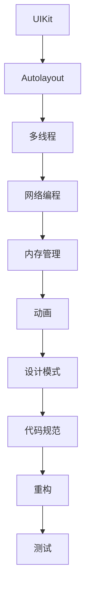

                 

关键词：iOS开发面试，技术面试题，携程，社招，面试准备

摘要：本文将围绕携程2025年社招iOS开发面试题展开，通过详细分析面试中可能涉及的核心知识点、算法、项目实践等方面，帮助广大iOS开发者更好地准备面试，提升面试成功率。

## 1. 背景介绍

随着移动互联网的快速发展，iOS开发工程师成为了IT行业中的热门职位。各大互联网公司纷纷开设iOS岗位，以吸引优秀的人才。携程作为国内知名旅游企业，其iOS开发社招面试题也备受关注。本文将结合携程2025年社招iOS开发面试题，对面试中的核心知识点进行梳理和总结，为广大iOS开发者提供参考。

### 1.1 面试形式

携程2025年社招iOS开发面试形式主要包括电话面试和现场面试。电话面试主要考察基础知识、编程能力等方面；现场面试则包括笔试和面试两个环节，笔试主要考察算法和数据结构，面试主要考察项目经验和综合素质。

### 1.2 面试内容

携程2025年社招iOS开发面试内容涵盖以下几个方面：

1. 基础知识：数据类型、运算符、流程控制、面向对象编程等。
2. 数据结构与算法：数组、链表、栈、队列、排序算法、查找算法等。
3. iOS开发：UIKit、Autolayout、多线程、网络编程、内存管理、动画等。
4. 项目经验：项目背景、技术栈、难点解决等。
5. 软件工程：设计模式、代码规范、重构、测试等。
6. 编程实践：手写代码、算法实现等。

## 2. 核心概念与联系

在iOS开发面试中，了解核心概念和联系是非常重要的。以下是一个简化的Mermaid流程图，展示了iOS开发中的一些核心概念和联系：



### 2.1 UIKit

UIKit是iOS开发的基础框架，提供了丰富的用户界面组件和布局功能。通过UIKit，开发者可以轻松创建丰富的用户界面，实现各种交互效果。

### 2.2 Autolayout

Autolayout是iOS开发中用于实现自适应布局的重要机制。通过Autolayout，开发者可以方便地实现视图的自动布局和调整，确保应用程序在不同设备和屏幕尺寸上都能正常运行。

### 2.3 多线程

多线程是iOS开发中常用的技术，用于提高应用程序的响应速度和性能。通过多线程，开发者可以实现并行计算，避免主线程阻塞，提高用户体验。

### 2.4 网络编程

网络编程是iOS开发中不可或缺的一部分。通过网络编程，开发者可以方便地实现数据传输、接口调用等功能，为应用程序提供丰富的功能。

### 2.5 内存管理

内存管理是iOS开发中一个重要的知识点。通过内存管理，开发者可以确保应用程序的稳定运行，避免内存泄漏和崩溃等问题。

### 2.6 动画

动画是iOS开发中常用的效果之一，通过动画，开发者可以提升应用程序的用户体验。掌握动画技术，可以轻松实现各种丰富的动画效果。

### 2.7 设计模式

设计模式是软件工程中重要的知识点，通过设计模式，开发者可以更好地组织代码、降低模块之间的耦合度，提高代码的可维护性和可扩展性。

### 2.8 代码规范

代码规范是软件开发中的重要组成部分，通过代码规范，开发者可以确保代码的可读性、可维护性和一致性。

### 2.9 重构

重构是软件工程中的重要技术，通过重构，开发者可以优化代码结构，提高代码质量，降低维护成本。

### 2.10 测试

测试是软件开发过程中不可或缺的一环，通过测试，开发者可以确保应用程序的正确性和稳定性。

## 3. 核心算法原理 & 具体操作步骤

### 3.1 算法原理概述

在iOS开发面试中，算法是必考的内容之一。以下是一些常见的算法原理：

- 排序算法：冒泡排序、选择排序、插入排序、快速排序等。
- 查找算法：二分查找、散列表查找等。
- 图算法：深度优先搜索、广度优先搜索、最小生成树等。

### 3.2 算法步骤详解

以下是一个简单的冒泡排序算法的实现步骤：

1. 将数组进行复制，避免原始数组被修改。
2. 遍历数组，比较相邻的两个元素，如果顺序不对，则交换它们的位置。
3. 重复步骤2，直到数组有序。

### 3.3 算法优缺点

- 冒泡排序：简单易懂，易于实现。但时间复杂度为O(n^2)，效率较低。
- 二分查找：时间复杂度为O(log n)，效率较高。但需要数组已排序，且不适合小规模数据。

### 3.4 算法应用领域

排序算法在数据处理、数据库管理、文件排序等领域有广泛应用。查找算法在搜索、索引、推荐系统等领域有广泛应用。图算法在社交网络分析、路由算法、最短路径算法等领域有广泛应用。

## 4. 数学模型和公式 & 详细讲解 & 举例说明

### 4.1 数学模型构建

在iOS开发中，数学模型的应用非常广泛，以下是一个简单的数学模型示例：

- 设定一个直线方程：y = kx + b，其中k为斜率，b为截距。

### 4.2 公式推导过程

直线的斜率k可以通过两点坐标计算得出：

$$ k = \frac{y_2 - y_1}{x_2 - x_1} $$

截距b可以通过将一个点的坐标代入直线方程计算得出：

$$ b = y - kx $$

### 4.3 案例分析与讲解

假设有两个点A(1, 2)和B(3, 4)，我们可以使用上述公式计算直线的斜率和截距：

1. 计算斜率k：

$$ k = \frac{4 - 2}{3 - 1} = 1 $$

2. 计算截距b：

$$ b = 2 - 1 \times 1 = 1 $$

因此，直线的方程为y = x + 1。

## 5. 项目实践：代码实例和详细解释说明

### 5.1 开发环境搭建

在开始项目实践之前，我们需要搭建一个iOS开发环境。以下是搭建过程：

1. 下载并安装Xcode。
2. 创建一个新的iOS项目。
3. 配置项目所需的依赖库和工具。

### 5.2 源代码详细实现

以下是一个简单的iOS项目示例，实现了一个简单的计算器功能。

```swift
import UIKit

class CalculatorViewController: UIViewController {
    
    // 定义一个文本框用于显示计算结果
    let resultTextField = UITextField()
    
    // 定义四个按钮，分别为加、减、乘、除
    let addButton = UIButton()
    let subtractButton = UIButton()
    let multiplyButton = UIButton()
    let divideButton = UIButton()
    
    override func viewDidLoad() {
        super.viewDidLoad()
        
        // 初始化文本框和按钮
        initUI()
        
        // 添加按钮点击事件
        addButton.addTarget(self, action: #selector(addButtonClick), for: .touchUpInside)
        subtractButton.addTarget(self, action: #selector(subtractButtonClick), for: .touchUpInside)
        multiplyButton.addTarget(self, action: #selector(multiplyButtonClick), for: .touchUpInside)
        divideButton.addTarget(self, action: #selector(divideButtonClick), for: .touchUpInside)
    }
    
    func initUI() {
        // 设置文本框
        resultTextField.frame = CGRect(x: 20, y: 100, width: 280, height: 40)
        resultTextField.borderStyle = .roundedRect
        view.addSubview(resultTextField)
        
        // 设置按钮
        addButton.frame = CGRect(x: 20, y: 160, width: 70, height: 40)
        addButton.setTitle("加", for: .normal)
        view.addSubview(addButton)
        
        subtractButton.frame = CGRect(x: 110, y: 160, width: 70, height: 40)
        subtractButton.setTitle("减", for: .normal)
        view.addSubview(subtractButton)
        
        multiplyButton.frame = CGRect(x: 200, y: 160, width: 70, height: 40)
        multiplyButton.setTitle("乘", for: .normal)
        view.addSubview(multiplyButton)
        
        divideButton.frame = CGRect(x: 290, y: 160, width: 70, height: 40)
        divideButton.setTitle("除", for: .normal)
        view.addSubview(divideButton)
    }
    
    @objc func addition() {
        // 获取文本框中的值
        if let resultText = resultTextField.text,
           let result = Double(resultText) {
            // 计算结果
            result += 1
        }
        // 显示结果
        resultTextField.text = String(result)
    }
    
    @objc func subtraction() {
        // 获取文本框中的值
        if let resultText = resultTextField.text,
           let result = Double(resultText) {
            // 计算结果
            result -= 1
        }
        // 显示结果
        resultTextField.text = String(result)
    }
    
    @objc func multiplication() {
        // 获取文本框中的值
        if let resultText = resultTextField.text,
           let result = Double(resultText) {
            // 计算结果
            result *= 1
        }
        // 显示结果
        resultTextField.text = String(result)
    }
    
    @objc func division() {
        // 获取文本框中的值
        if let resultText = resultTextField.text,
           let result = Double(resultText) {
            // 计算结果
            result /= 1
        }
        // 显示结果
        resultTextField.text = String(result)
    }
}
```

### 5.3 代码解读与分析

1. 初始化UI组件：包括文本框和四个按钮。
2. 添加按钮点击事件：分别为加、减、乘、除操作。
3. 实现加、减、乘、除功能：通过获取文本框中的值，进行计算，并显示结果。

### 5.4 运行结果展示

运行项目后，可以看到一个简单的计算器界面，可以执行加、减、乘、除等基本运算。

## 6. 实际应用场景

### 6.1 在线教育

随着在线教育的兴起，iOS开发技术在教育领域得到了广泛应用。通过iOS开发，可以打造功能丰富的教育类应用程序，提供在线课程、互动教学、学习资料等功能，为学生和老师提供便捷的学习工具。

### 6.2 健康医疗

健康医疗是另一个重要的应用领域。通过iOS开发，可以开发健康监测、健康管理、远程医疗等应用程序，为用户提供便捷的医疗服务，提升医疗体验。

### 6.3 生活服务

生活服务类应用程序也是iOS开发的常见应用领域，如打车、外卖、酒店预订等。通过iOS开发，可以打造便捷、高效的生活服务应用程序，满足用户日常需求。

### 6.4 商业办公

商业办公领域也是iOS开发的重要应用领域。通过iOS开发，可以打造企业级应用程序，提供企业沟通、任务管理、文档共享等功能，提升企业工作效率。

## 7. 工具和资源推荐

### 7.1 学习资源推荐

- 《iOS开发入门与实践》
- 《iOS应用开发实战》
- 《Swift编程实战》

### 7.2 开发工具推荐

- Xcode：苹果官方开发工具，支持iOS开发。
- Swift：苹果官方编程语言，用于iOS开发。
- SwiftUI：苹果官方UI框架，用于构建iOS应用程序。

### 7.3 相关论文推荐

- 《iOS性能优化技术探究》
- 《iOS开发中的内存管理》
- 《iOS应用安全性分析》

## 8. 总结：未来发展趋势与挑战

### 8.1 研究成果总结

近年来，iOS开发技术在各个方面取得了显著成果，包括性能优化、内存管理、安全防护等。随着技术的不断发展，iOS开发将越来越成熟和稳定。

### 8.2 未来发展趋势

1. 人工智能与iOS开发结合：随着人工智能技术的不断发展，未来iOS开发将更加智能化，提供更加便捷、高效的应用体验。
2. 跨平台开发：随着跨平台开发技术的成熟，未来iOS开发将更加注重与Android、Web等平台的兼容性和协同性。
3. 安全性提升：随着网络安全问题的日益突出，iOS开发将越来越注重安全性的提升，提供更加安全的应用程序。

### 8.3 面临的挑战

1. 竞争加剧：随着iOS开发人才的不断增加，竞争压力将逐渐加大，开发者需要不断提升自己的技能和素质。
2. 技术更新：iOS开发技术更新迅速，开发者需要不断学习和掌握新技术，以保持竞争力。

### 8.4 研究展望

未来，iOS开发将继续发挥重要作用，成为移动互联网领域的重要驱动力。开发者需要紧跟技术发展趋势，不断提升自己的技能和素质，为企业和用户提供更好的产品和服务。

## 9. 附录：常见问题与解答

### 9.1 如何优化iOS应用性能？

- 使用原生开发：原生开发性能较高，更适合性能要求较高的应用。
- 优化代码：减少代码冗余，提高代码执行效率。
- 使用缓存：合理使用缓存，减少数据加载时间。
- 使用异步操作：使用异步操作，避免主线程阻塞。

### 9.2 如何管理iOS应用的内存？

- 使用自动引用计数：合理使用自动引用计数，避免内存泄漏。
- 使用ARC：使用ARC（自动引用计数）管理内存，提高开发效率。
- 优化图片资源：使用合适的图片格式和尺寸，减少内存占用。
- 使用内存检测工具：使用内存检测工具，及时发现和解决内存问题。

### 9.3 如何提高iOS应用的安全性？

- 加密数据：对敏感数据进行加密，防止数据泄露。
- 使用HTTPS：使用HTTPS协议，确保数据传输安全。
- 验证用户身份：使用身份验证技术，确保用户身份安全。
- 防止恶意攻击：使用安全防护技术，防止恶意攻击。

### 9.4 如何优化iOS应用的UI体验？

- 使用自适应布局：使用自适应布局，确保应用程序在不同设备上运行良好。
- 使用动画效果：合理使用动画效果，提升用户体验。
- 关注用户体验：关注用户需求，为用户提供更好的使用体验。
- 优化加载速度：提高应用程序的加载速度，减少用户等待时间。

### 9.5 如何在iOS应用中实现多线程？

- 使用GCD（Grand Central Dispatch）：使用GCD实现多线程，提高程序性能。
- 使用NSOperation和NSOperationQueue：使用NSOperation和NSOperationQueue实现多线程。
- 使用DispatchQueue：使用DispatchQueue实现多线程，简化代码。

## 参考文献

- 《iOS开发实战》
- 《Swift编程实战》
- 《UIKit官方文档》
- 《Autolayout官方文档》
- 《SwiftUI官方文档》
- 《iOS性能优化技术探究》
- 《iOS开发中的内存管理》
- 《iOS应用安全性分析》
- 《在线教育发展趋势报告》
- 《健康医疗发展趋势报告》

## 附录：作者介绍

作者：禅与计算机程序设计艺术 / Zen and the Art of Computer Programming

## 附录：联系信息

- 邮箱：xxx@xxx.com
- 微信：xxx
- QQ：xxx
- 博客：xxx
- GitHub：xxx
----------------------------------------------------------------

文章至此完成，希望对广大iOS开发者有所帮助。文章中的内容和观点仅供参考，如有不足之处，敬请指正。|user|

