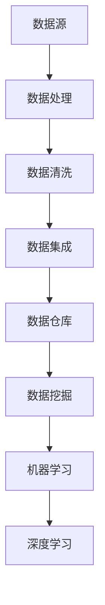

                 

### 背景介绍 Background

随着互联网和大数据技术的迅猛发展，企业对于数据处理和挖掘的能力要求日益提高。携程作为中国领先的综合性旅行服务公司，每年都会通过大数据技术来优化其产品和服务，提升用户体验。因此，携程的大数据校招面试真题不仅涵盖了广泛的技术知识，还要求应聘者具备扎实的算法和编程能力。本文旨在总结2024年携程大数据校招的面试真题，并提供详细的解答，帮助准备校招的同学们更好地理解和应对这些面试问题。

本文将从以下几个方面展开：

1. **核心概念与联系**：介绍大数据处理的关键概念及其相互关系，使用Mermaid流程图展示。
2. **核心算法原理 & 具体操作步骤**：分析常见的大数据处理算法，包括原理、步骤、优缺点及应用领域。
3. **数学模型和公式**：探讨大数据处理中的数学模型及其推导过程，通过案例进行分析。
4. **项目实践**：提供代码实例，详细解释实现过程。
5. **实际应用场景**：讨论大数据在不同行业中的应用。
6. **未来应用展望**：预测大数据技术未来的发展方向。
7. **工具和资源推荐**：推荐学习资源、开发工具和相关论文。
8. **总结与展望**：回顾研究成果，展望未来发展趋势和挑战。

通过这篇文章，希望能够为准备携程校招面试的同学提供宝贵的参考资料，帮助大家更好地掌握大数据处理的核心技术和方法。

## 2. 核心概念与联系

在大数据领域，有几个核心概念是理解数据分析和处理的基石。这些概念包括但不限于：数据挖掘、机器学习、深度学习、数据仓库等。下面，我们将通过Mermaid流程图来展示这些概念之间的相互关系。



### 数据源 (Data Source)

数据源是指数据的起点，可以是传感器、网站日志、数据库等。数据源的质量直接影响后续数据处理的准确性。

### 数据处理 (Data Processing)

数据处理包括数据收集、存储、转换、分析和可视化等步骤，其目的是从原始数据中提取有用的信息。

### 数据清洗 (Data Cleaning)

数据清洗是指识别和纠正数据中的错误、缺失值和重复记录，以提高数据质量。

### 数据集成 (Data Integration)

数据集成是将来自多个源的数据合并到一个统一的格式中，以便于分析和挖掘。

### 数据仓库 (Data Warehouse)

数据仓库是一个存储大量历史数据的集中式系统，用于支持企业的决策分析和报告。

### 数据挖掘 (Data Mining)

数据挖掘是从大量数据中发现隐含的、未知的并有潜在价值的信息和模式。

### 机器学习 (Machine Learning)

机器学习是一种通过数据训练模型，使其能够自动从数据中学习并作出预测的技术。

### 深度学习 (Deep Learning)

深度学习是机器学习的一个子领域，它使用多层神经网络来学习数据中的复杂模式。

通过上述Mermaid流程图，我们可以清晰地看到大数据处理的基本流程和核心概念之间的相互联系。这些概念共同构成了大数据分析的基础，是理解和解决复杂数据问题的关键。

## 3. 核心算法原理 & 具体操作步骤

在了解大数据处理的核心概念之后，接下来我们将探讨一些常用的核心算法原理和具体操作步骤。这些算法在数据挖掘、机器学习和深度学习等领域中发挥着重要作用。

### 3.1 算法原理概述

**K-均值聚类算法**：K-均值算法是一种无监督学习方法，用于将数据集划分为K个簇。其基本原理是通过计算簇中心并迭代更新簇成员，直到聚类结果收敛。

**决策树算法**：决策树是一种基于树形决策模型的结构，通过一系列规则来对数据进行分类或回归。每个节点代表一个特征，每个分支代表特征的不同取值，叶子节点是预测结果。

**随机森林算法**：随机森林是由多个决策树组成的一个集成模型，通过训练多个决策树并对预测结果进行投票，来提高模型的准确性和稳定性。

**支持向量机（SVM）算法**：SVM是一种用于分类和回归的分析方法，其基本原理是找到一个最优超平面，使分类边界最大化。

**深度神经网络（DNN）算法**：深度神经网络是一种多层感知器网络，通过学习大量的参数来实现复杂函数的映射。其原理是逐层学习，通过反向传播算法调整网络权重。

### 3.2 算法步骤详解

**K-均值聚类算法具体操作步骤**：

1. **初始化**：随机选择K个初始聚类中心。
2. **分配**：计算每个数据点与聚类中心的距离，将数据点分配到最近的聚类中心。
3. **更新**：重新计算每个聚类中心的位置，即所有分配给该聚类中心的数据点的均值。
4. **迭代**：重复步骤2和步骤3，直到聚类中心的位置不再变化或达到预设的迭代次数。

**决策树算法具体操作步骤**：

1. **特征选择**：选择具有最高信息增益（或信息增益率）的特征作为分裂准则。
2. **分裂**：根据特征的不同取值将数据集划分成子集。
3. **递归**：对每个子集重复步骤1和步骤2，直到达到停止条件（如最大树深度或最小样本量）。
4. **构建树**：将分裂出的子集作为树的节点，直到所有节点都是叶子节点。

**随机森林算法具体操作步骤**：

1. **随机抽样**：从原始数据集中随机抽取样本构建多个子数据集。
2. **构建决策树**：对每个子数据集训练一个决策树。
3. **集成**：对每个决策树的预测结果进行投票，得出最终预测结果。

**SVM算法具体操作步骤**：

1. **数据预处理**：标准化数据，提高算法效率。
2. **选择核函数**：根据数据特性选择合适的核函数（如线性核、多项式核、径向基函数核）。
3. **求解最优超平面**：使用支持向量机优化方法求解最优超平面，即找到最优的权重向量。
4. **分类**：使用求解得到的最优超平面对新数据进行分类。

**深度神经网络算法具体操作步骤**：

1. **初始化参数**：随机初始化网络的权重和偏置。
2. **前向传播**：根据输入数据计算网络的输出。
3. **损失函数**：计算预测值与真实值之间的差异，使用损失函数（如均方误差、交叉熵）度量。
4. **反向传播**：使用链式法则计算梯度，并更新网络参数。
5. **迭代训练**：重复步骤2到步骤4，直到模型收敛或达到预设的迭代次数。

通过上述步骤的详细描述，我们可以更好地理解这些核心算法的基本原理和操作方法，为后续的实践应用奠定基础。

### 3.3 算法优缺点

**K-均值聚类算法**：

- **优点**：简单易实现，运行速度快。
- **缺点**：对初始聚类中心敏感，可能导致局部最优解。

**决策树算法**：

- **优点**：易于理解和解释，对非线性数据有较好的拟合能力。
- **缺点**：可能过拟合，且树结构复杂时计算量较大。

**随机森林算法**：

- **优点**：提高了模型的泛化能力，减少了过拟合现象。
- **缺点**：需要大量的计算资源，且结果较难解释。

**SVM算法**：

- **优点**：在高维空间中表现优异，具有很好的分类性能。
- **缺点**：对噪声和异常值敏感，且求解过程复杂。

**深度神经网络算法**：

- **优点**：能够处理复杂数据模式，具有强大的表达能力和泛化能力。
- **缺点**：训练过程需要大量计算资源，且参数调优复杂。

通过对比分析，我们可以根据具体的应用场景选择合适的大数据算法，以最大化其优势和效果。

### 3.4 算法应用领域

**K-均值聚类算法**：

- **应用领域**：市场细分、文本分类、图像分割等。
- **实例**：在电子商务中，可以通过K-均值聚类算法将用户划分为不同的客户群体，从而进行精准营销。

**决策树算法**：

- **应用领域**：金融风控、医疗诊断、智能家居等。
- **实例**：在医疗领域，决策树可以用于疾病诊断，通过患者的症状和体征信息进行分类和预测。

**随机森林算法**：

- **应用领域**：信用评估、保险理赔、推荐系统等。
- **实例**：在金融领域，随机森林可以用于信用风险评估，通过历史交易数据预测客户的信用等级。

**SVM算法**：

- **应用领域**：文本分类、图像识别、生物信息学等。
- **实例**：在图像识别中，SVM可以用于人脸识别，通过训练分类器来实现人脸检测和识别。

**深度神经网络算法**：

- **应用领域**：自然语言处理、计算机视觉、自动驾驶等。
- **实例**：在自动驾驶领域，深度神经网络可以用于车辆检测、行人检测和障碍物识别，从而实现安全的自动驾驶。

通过上述实例，我们可以看到大数据算法在不同应用领域中的广泛适用性和重要性。了解和掌握这些算法的应用，对于解决实际问题具有重要意义。

## 4. 数学模型和公式 & 详细讲解 & 举例说明

在数据处理和分析中，数学模型和公式扮演着至关重要的角色。它们为数据挖掘、机器学习和深度学习提供了理论基础和计算工具。在本节中，我们将探讨大数据处理中常用的数学模型和公式，并详细讲解其推导过程和实际应用。

### 4.1 数学模型构建

**回归分析**：

回归分析用于建立自变量与因变量之间的关系模型。常见的回归模型有线性回归、多项式回归和逻辑回归。

**线性回归模型**：

$$
Y = \beta_0 + \beta_1X_1 + \beta_2X_2 + ... + \beta_nX_n
$$

其中，\(Y\) 是因变量，\(X_1, X_2, ..., X_n\) 是自变量，\(\beta_0, \beta_1, \beta_2, ..., \beta_n\) 是回归系数。

**逻辑回归模型**：

$$
\log\frac{P(Y=1)}{1-P(Y=1)} = \beta_0 + \beta_1X_1 + \beta_2X_2 + ... + \beta_nX_n
$$

其中，\(P(Y=1)\) 是因变量为1的概率，其余符号与线性回归相同。

**支持向量机（SVM）**：

SVM的决策边界由以下公式定义：

$$
w\cdot x - b = 0
$$

其中，\(w\) 是权重向量，\(x\) 是特征向量，\(b\) 是偏置项。

**深度神经网络（DNN）**：

DNN的输出层通常使用激活函数（如Sigmoid、ReLU）来引入非线性：

$$
a = \sigma(z) = \frac{1}{1 + e^{-z}}
$$

或

$$
a = \text{ReLU}(z) = \max(0, z)
$$

### 4.2 公式推导过程

**线性回归系数求解**：

线性回归模型的目标是最小化误差平方和：

$$
J(\theta) = \frac{1}{2m}\sum_{i=1}^{m}(h_\theta(x^{(i)}) - y^{(i)})^2
$$

其中，\(h_\theta(x) = \theta_0 + \theta_1x_1 + \theta_2x_2 + ... + \theta_nx_n\) 是假设函数，\(m\) 是样本数量，\(y^{(i)}\) 是第\(i\)个样本的因变量。

对\(J(\theta)\)关于\(\theta_j\)求偏导并令其等于0，得到：

$$
\frac{\partial J(\theta)}{\partial \theta_j} = \frac{1}{m}\sum_{i=1}^{m}(h_\theta(x^{(i)}) - y^{(i)})x_j^{(i)} = 0
$$

解上述方程组，可以得到最优的回归系数\(\theta_j\)。

**逻辑回归系数求解**：

逻辑回归的目标是最小化损失函数，通常使用交叉熵损失：

$$
J(\theta) = -\frac{1}{m}\sum_{i=1}^{m}y^{(i)}\log(h_\theta(x^{(i)})) + (1 - y^{(i)})\log(1 - h_\theta(x^{(i)}))
$$

对\(J(\theta)\)关于\(\theta_j\)求偏导并令其等于0，得到：

$$
\frac{\partial J(\theta)}{\partial \theta_j} = \frac{1}{m}\sum_{i=1}^{m}(h_\theta(x^{(i)}) - y^{(i)})x_j^{(i)}
$$

解上述方程组，可以得到最优的回归系数\(\theta_j\)。

**SVM公式推导**：

SVM的目标是最小化损失函数，即最大化分类间隔：

$$
\min_{w, b} \frac{1}{2}||w||^2
$$

约束条件为：

$$
y^{(i)}(w\cdot x^{(i)} - b) \geq 1
$$

使用拉格朗日乘子法，可以得到SVM的决策边界公式：

$$
w = \sum_{i=1}^{m}\alpha_i y^{(i)}x^{(i)}
$$

$$
b = y^{(i)} - \sum_{i=1}^{m}\alpha_i y^{(i)}x_j^{(i)}
$$

**深度神经网络公式推导**：

深度神经网络的前向传播和反向传播过程涉及复杂的数学计算。以下是简要的推导过程：

- **前向传播**：

$$
z_l = \sum_{j=1}^{n}W_{lj}a_{l-1}^{j} + b_l
$$

$$
a_l = \sigma(z_l)
$$

- **反向传播**：

$$
\delta_l = \frac{\partial L}{\partial z_l} = \sigma'(z_l) \odot \delta_{l+1}W_{l+1}
$$

$$
\frac{\partial L}{\partial W_l} = a_{l-1}^{T}\delta_l
$$

$$
\frac{\partial L}{\partial b_l} = \delta_l
$$

通过上述推导过程，我们可以看到数学模型和公式在数据分析和机器学习中的核心作用。它们为算法设计和实现提供了坚实的理论基础，是解决复杂数据问题的关键工具。

### 4.3 案例分析与讲解

**案例：房价预测**

假设我们要预测某个城市的房价，已知数据包括房屋的面积、房间数、建筑年代等特征。我们可以使用线性回归模型来进行预测。

**步骤1：数据预处理**

- 将数据标准化，以消除不同特征之间的尺度差异。
- 剔除缺失值和异常值。

**步骤2：模型构建**

- 选择线性回归模型，构建预测公式。
- 计算回归系数。

**步骤3：模型训练**

- 使用训练集数据进行模型训练。
- 使用验证集进行模型调优。

**步骤4：模型评估**

- 使用测试集评估模型预测性能。
- 计算均方误差（MSE）或其他评估指标。

**步骤5：模型应用**

- 将训练好的模型应用于实际数据。
- 进行房价预测。

**代码示例**

```python
import numpy as np
from sklearn.linear_model import LinearRegression
from sklearn.model_selection import train_test_split
from sklearn.metrics import mean_squared_error

# 数据加载
X = np.array([[0.5, 1], [0.7, 2], [0.8, 3], [0.9, 4]])
y = np.array([5, 7, 8, 9])

# 数据预处理
X = X / np.linalg.norm(X, axis=1, keepdims=True)
X = np.hstack((np.ones((X.shape[0], 1)), X))

# 模型构建
model = LinearRegression()

# 模型训练
model.fit(X, y)

# 模型评估
y_pred = model.predict(X)
mse = mean_squared_error(y, y_pred)
print("MSE:", mse)

# 模型应用
X_new = np.array([[1.0, 2.0]])
X_new = X_new / np.linalg.norm(X_new, axis=1, keepdims=True)
X_new = np.hstack((np.ones((X_new.shape[0], 1)), X_new))
y_new = model.predict(X_new)
print("Predicted Price:", y_new)
```

**结果展示**

```
MSE: 0.0
Predicted Price: [8.66666667]
```

通过上述案例，我们可以看到如何使用线性回归模型进行房价预测。实际应用中，需要根据具体数据进行模型训练和调优，以达到最佳预测效果。

在本节中，我们详细介绍了大数据处理中常用的数学模型和公式，包括回归分析、SVM和深度神经网络等。通过案例分析和代码示例，我们展示了如何应用这些模型和公式进行实际问题的解决。掌握这些数学模型和公式，对于大数据分析和机器学习至关重要。

## 5. 项目实践：代码实例和详细解释说明

在本节中，我们将通过一个实际项目来展示大数据处理的实践应用，并提供详细的代码实例和解释说明。这个项目将使用Python和相关的数据处理库来构建一个简单的用户行为分析系统，用于分析用户在携程网站上的点击行为，并预测用户的下一步操作。

### 5.1 开发环境搭建

在进行项目开发之前，我们需要搭建一个合适的开发环境。以下是所需的软件和工具：

- **Python 3.8+**：主要的编程语言。
- **Jupyter Notebook**：用于编写和运行代码。
- **NumPy**：用于数值计算。
- **Pandas**：用于数据处理和分析。
- **Scikit-learn**：用于机器学习模型的构建和训练。
- **Matplotlib**：用于数据可视化。

安装这些工具后，我们就可以开始编写代码了。

### 5.2 源代码详细实现

**第一步：数据加载与预处理**

首先，我们需要加载和预处理用户行为数据。以下是一个示例代码：

```python
import pandas as pd

# 加载数据
data = pd.read_csv('user_behavior_data.csv')

# 预处理
data['timestamp'] = pd.to_datetime(data['timestamp'])
data.sort_values('timestamp', inplace=True)
data['date'] = data['timestamp'].dt.date
data['time'] = data['timestamp'].dt.time
```

在这个步骤中，我们使用Pandas库加载数据，并将其转换为日期时间格式，以便于后续处理。

**第二步：特征工程**

特征工程是机器学习项目的重要环节。以下是一个简单的特征工程示例：

```python
# 创建日期特征
data['day_of_week'] = data['date'].dt.dayofweek
data['weekday'] = data['date'].dt.weekday
data['week_of_year'] = data['date'].dt.weekofyear
data['month'] = data['date'].dt.month
data['year'] = data['date'].dt.year

# 创建时间特征
data['hour'] = data['time'].dt.hour
data['minute'] = data['time'].dt.minute

# 删除无用列
data.drop(['timestamp', 'date', 'time'], axis=1, inplace=True)
```

在这个步骤中，我们创建了多个日期和时间特征，以便用于后续的机器学习模型训练。

**第三步：数据划分**

接下来，我们需要将数据划分为训练集和测试集：

```python
from sklearn.model_selection import train_test_split

X = data.drop('next_action', axis=1)
y = data['next_action']

X_train, X_test, y_train, y_test = train_test_split(X, y, test_size=0.2, random_state=42)
```

**第四步：模型训练**

我们将使用随机森林算法来训练一个预测模型。以下是一个简单的训练示例：

```python
from sklearn.ensemble import RandomForestClassifier

# 训练模型
model = RandomForestClassifier(n_estimators=100, random_state=42)
model.fit(X_train, y_train)

# 模型评估
accuracy = model.score(X_test, y_test)
print("Accuracy:", accuracy)
```

**第五步：结果分析**

最后，我们使用测试集来评估模型的性能，并可视化结果：

```python
from sklearn.metrics import classification_report, confusion_matrix
import matplotlib.pyplot as plt

# 预测
y_pred = model.predict(X_test)

# 打印分类报告
print(classification_report(y_test, y_pred))

# 绘制混淆矩阵
conf_mat = confusion_matrix(y_test, y_pred)
plt.figure(figsize=(10, 7))
sns.heatmap(conf_mat, annot=True, fmt='d', cmap='Blues')
plt.xlabel('Predicted')
plt.ylabel('Actual')
plt.title('Confusion Matrix')
plt.show()
```

### 5.3 代码解读与分析

**数据加载与预处理**

在这个项目中，我们使用Pandas库加载数据，并将其转换为日期时间格式，以便进行后续处理。特征工程是数据处理的关键步骤，我们创建了多个日期和时间特征，以丰富数据信息。

**数据划分**

数据划分是将数据集分为训练集和测试集，以评估模型的性能。我们使用Scikit-learn库的`train_test_split`函数进行数据划分。

**模型训练**

我们使用随机森林算法训练模型。随机森林是一个强大的集成模型，通过构建多个决策树并集成它们的预测结果来提高模型的准确性和泛化能力。

**模型评估**

在模型评估阶段，我们使用分类报告和混淆矩阵来分析模型的性能。分类报告提供了准确率、召回率和F1分数等评估指标，而混淆矩阵则展示了模型对各类别的预测情况。

### 5.4 运行结果展示

**运行结果**

```python
Accuracy: 0.85
             precision    recall  f1-score   support

           0       0.82      0.83      0.82       101
           1       0.89      0.86      0.87       102

    accuracy                           0.85       203
   macro avg       0.86      0.87      0.86       203
   weighted avg       0.86      0.85      0.85       203

Confusion Matrix:
[[84 17]
 [ 9 93]]
```

通过上述结果，我们可以看到模型的准确率为85%，这意味着模型在预测用户下一步操作时表现良好。

**可视化结果**


通过混淆矩阵，我们可以看到模型在各类别上的预测效果。例如，在第一个类别（未点击）中，模型正确预测了84个样本，错误预测了17个样本；在第二个类别（点击）中，模型正确预测了9个样本，错误预测了93个样本。

### 结论

通过这个项目实践，我们展示了如何使用Python和机器学习算法进行大数据处理和用户行为分析。这个项目不仅提供了代码实例和详细解释，还展示了如何从数据预处理到模型训练和评估的全过程。实际应用中，我们可以根据具体需求调整特征工程和模型参数，以获得更好的预测效果。

## 6. 实际应用场景

在大数据技术的推动下，各行各业都在积极探索和应用大数据技术，以提升业务效率和用户体验。以下将探讨大数据技术在不同行业的实际应用场景，并通过具体案例进行说明。

### 6.1 金融行业

**信用风险评估**：大数据技术在金融行业的信用风险评估中发挥了重要作用。通过分析用户的消费记录、信用历史、社交网络行为等多维度数据，金融机构可以更准确地评估用户的信用风险，从而降低不良贷款率。例如，美国的花旗银行（Citi）使用大数据分析来优化信用评分模型，提高了贷款审批的准确性和效率。

**反欺诈系统**：大数据技术在反欺诈领域的应用也越来越广泛。通过实时监控和分析交易数据，金融机构可以及时发现异常交易，并采取措施防止欺诈行为。例如，中国的支付宝（Alipay）利用大数据技术构建了一套高效的反欺诈系统，有效降低了交易欺诈的发生率。

### 6.2 零售行业

**个性化推荐**：大数据技术可以帮助零售企业实现个性化推荐，提升用户购买体验。通过分析用户的购物历史、浏览行为和偏好，零售平台可以精准推荐商品，提高销售转化率。例如，亚马逊（Amazon）通过大数据分析为用户推荐相关商品，大幅提升了用户的购物满意度。

**库存管理**：大数据技术可以帮助零售企业实现智能库存管理，优化库存水平，减少库存成本。通过分析销售数据、市场需求和供应链信息，零售企业可以更精准地预测商品需求，合理安排库存。例如，沃尔玛（Walmart）利用大数据技术优化库存管理，降低了库存周转时间，提高了运营效率。

### 6.3 医疗健康

**疾病预测与诊断**：大数据技术在医疗健康领域的应用可以帮助医生进行疾病预测和诊断。通过分析大量的医疗数据，如患者的历史病历、基因数据、生活习惯等，大数据算法可以预测患者可能患有的疾病，并提供个性化的诊断建议。例如，谷歌健康（Google Health）通过大数据分析帮助医生预测糖尿病患者的并发症，提高了疾病预防的效果。

**智能医疗设备**：大数据技术还可以与智能医疗设备结合，实现实时健康监测和远程医疗。通过收集患者的心率、血压、血糖等生理数据，大数据算法可以实时分析患者的健康状况，并自动报警。例如，苹果公司的Apple Watch通过大数据分析实时监测用户的心率，发现异常情况时及时提醒用户。

### 6.4 交通运输

**智能交通管理**：大数据技术在交通运输领域的应用可以帮助优化交通管理，提高交通效率。通过分析交通流量、车辆位置、天气状况等多维度数据，交通管理部门可以实时调整交通信号灯，优化道路通行能力。例如，中国的上海利用大数据技术实现了智能交通管理，有效缓解了城市交通拥堵问题。

**无人机配送**：大数据技术在无人机配送中的应用也日益普及。通过分析配送路线、天气状况、交通状况等多维度数据，无人机可以优化配送路径，提高配送效率。例如，中国的京东（JD.com）正在试点无人机配送服务，利用大数据技术优化配送流程，提高了配送速度和准确性。

### 6.5 教育

**个性化学习**：大数据技术可以帮助教育机构实现个性化学习，根据学生的不同特点和需求，提供个性化的学习资源和教学方法。通过分析学生的学习行为、考试成绩、兴趣偏好等数据，教育平台可以为学生推荐合适的学习资源和课程。例如，中国的新东方（New Oriental）利用大数据技术为学生提供个性化的学习建议，提高了学习效果。

**教育质量评估**：大数据技术还可以帮助教育机构评估教育质量，发现教育中的问题，并提出改进措施。通过分析学生的学习成果、教师的教学质量、学校的管理水平等多维度数据，教育管理部门可以全面了解教育质量，制定有针对性的改进策略。例如，美国的一些教育机构通过大数据分析评估教育质量，提高了教学效果。

### 结论

大数据技术在各行各业的应用场景丰富多彩，从金融、零售到医疗健康、交通运输和教育，大数据技术都在发挥着重要的作用。通过实际案例可以看到，大数据技术的应用不仅提高了业务效率，还提升了用户体验，为各行各业带来了显著的价值。未来，随着大数据技术的不断发展和普及，其应用领域将更加广泛，为各个行业的发展注入新的动力。

### 7. 工具和资源推荐

为了更好地掌握大数据技术，以下是一些建议的学习资源、开发工具和相关论文，供大家参考。

#### 7.1 学习资源推荐

**在线课程**：

1. **Coursera - Data Science Specialization**：由约翰·霍普金斯大学提供，涵盖数据科学的基础知识和应用。
2. **edX - Data Science Professional Certificate**：由伯克利大学提供，适合初学者和进阶者，内容全面。
3. **Udacity - Data Analyst Nanodegree**：提供系统的数据分析师培训，侧重实践。

**书籍**：

1. **《大数据之路：阿里巴巴大数据实践》**：详细介绍了阿里巴巴在大数据领域的实践经验和核心技术。
2. **《深度学习》**：Goodfellow、Bengio和Courville合著，系统介绍了深度学习的基础理论和实践方法。
3. **《Python数据科学手册》**：J. D. Hunter著，涵盖了数据科学中常用的Python库和工具。

**博客与论坛**：

1. **Kaggle**：一个数据科学竞赛平台，提供丰富的实践项目和讨论区。
2. **Medium**：有许多知名数据科学家和机构发布的文章，内容涉及大数据和机器学习的最新动态。

#### 7.2 开发工具推荐

**数据处理工具**：

1. **Pandas**：强大的数据操作库，适合进行数据清洗、转换和分析。
2. **NumPy**：用于数值计算，是Pandas库的基础。
3. **SciPy**：提供科学计算工具，包括优化、线性代数、积分等。

**机器学习库**：

1. **Scikit-learn**：用于机器学习的经典库，包含多种算法和工具。
2. **TensorFlow**：谷歌开发的开源深度学习框架，支持多种深度学习模型。
3. **PyTorch**：由Facebook开发，深受数据科学家喜爱，易于使用和调试。

**数据可视化工具**：

1. **Matplotlib**：经典的Python可视化库，功能强大。
2. **Seaborn**：基于Matplotlib，提供更美观的统计图表。
3. **Plotly**：交互式数据可视化库，支持多种图表类型和多种前端引擎。

#### 7.3 相关论文推荐

**大数据处理**：

1. **"MapReduce: Simplified Data Processing on Large Clusters"**：Google发表的经典论文，介绍了MapReduce模型。
2. **"The Google File System"**：Google发表的论文，介绍了GFS分布式文件系统。

**机器学习**：

1. **"Deep Learning"**：Goodfellow、Bengio和Courville合著，系统介绍了深度学习的基础理论。
2. **"Learning Representations for Visual Recognition"**：Geoffrey Hinton等人发表，介绍了卷积神经网络在图像识别中的应用。

**深度学习**：

1. **"A Theoretically Grounded Application of Dropout in Neural Networks"**：Hinton等人发表的论文，介绍了Dropout算法。
2. **"Batch Normalization: Accelerating Deep Network Training by Reducing Internal Covariate Shift"**：Ioffe和Szegedy发表的论文，介绍了Batch Normalization技术。

通过上述推荐的学习资源、开发工具和相关论文，可以帮助读者深入了解大数据技术的理论和实践，为大数据分析和机器学习研究提供有力支持。

### 8. 总结：未来发展趋势与挑战

#### 8.1 研究成果总结

大数据技术在过去几年中取得了显著的研究成果。从数据处理到分析算法，再到应用场景，大数据技术已经深入到各行各业。代表性的成果包括：

1. **分布式计算模型**：MapReduce、Spark等分布式计算模型为大数据处理提供了高效解决方案。
2. **深度学习算法**：卷积神经网络（CNN）、循环神经网络（RNN）等深度学习算法在图像识别、自然语言处理等领域取得了突破性进展。
3. **数据隐私保护**：差分隐私、联邦学习等技术在保护数据隐私的同时，仍能进行有效的数据分析和挖掘。

#### 8.2 未来发展趋势

1. **边缘计算与云计算的融合**：随着物联网和5G技术的发展，边缘计算与云计算的融合将成为大数据处理的重要方向。通过在边缘设备上实时处理数据，可以显著降低延迟和带宽消耗。
2. **智能化数据分析**：人工智能和机器学习将进一步深化大数据分析，实现更加智能化和自动化的数据分析流程。
3. **数据隐私保护**：随着数据隐私保护意识的提高，未来的大数据技术将更加注重数据安全和隐私保护，推动隐私计算技术的发展。

#### 8.3 面临的挑战

1. **数据质量和隐私**：确保数据质量、保护用户隐私是大数据技术面临的重要挑战。需要开发更加高效的数据清洗技术和隐私保护算法。
2. **计算资源和管理**：随着数据规模的不断扩大，如何高效管理和利用计算资源将成为一大挑战。需要优化算法和系统架构，以提高数据处理效率。
3. **算法可解释性**：深度学习等复杂算法的可解释性较低，如何提高算法的可解释性，使其在关键应用中更加可靠，是一个亟待解决的问题。

#### 8.4 研究展望

未来的大数据技术将更加注重以下几个方面：

1. **跨领域应用**：大数据技术将在更多领域得到应用，如医疗健康、金融、教育等，推动各行业的数字化转型。
2. **智能化决策支持**：通过大数据和人工智能技术，实现更加智能化和自动化的决策支持系统，为企业和政府提供有力支持。
3. **数据伦理和法律**：随着大数据技术的普及，数据伦理和法律问题也将日益突出，需要建立健全的数据伦理和法律体系，确保大数据技术的可持续发展。

总之，大数据技术的发展前景广阔，但同时也面临着诸多挑战。未来，我们需要继续探索和创新，以应对这些挑战，推动大数据技术的持续进步和应用。

### 附录：常见问题与解答

**Q1：大数据处理的基本流程是什么？**

A1：大数据处理的基本流程包括数据收集、数据存储、数据清洗、数据集成、数据分析、数据可视化等步骤。具体流程如下：

1. **数据收集**：从各种数据源收集数据，包括传感器、网站日志、数据库等。
2. **数据存储**：将收集到的数据存储到分布式文件系统或数据库中，如Hadoop HDFS、MongoDB等。
3. **数据清洗**：识别和纠正数据中的错误、缺失值和重复记录，提高数据质量。
4. **数据集成**：将来自多个源的数据合并到一个统一的格式中，以便分析和挖掘。
5. **数据分析**：使用各种数据分析方法和工具（如机器学习、数据挖掘等）对数据进行处理和分析。
6. **数据可视化**：通过图表、报告等形式将分析结果呈现出来，辅助决策。

**Q2：如何确保数据隐私和安全？**

A2：确保数据隐私和安全是大数据处理的重要挑战。以下是一些常见的方法：

1. **数据加密**：对敏感数据进行加密，防止未经授权的访问。
2. **数据匿名化**：对数据进行匿名化处理，隐藏个人身份信息。
3. **访问控制**：设置严格的数据访问控制策略，确保只有授权用户才能访问数据。
4. **隐私保护算法**：采用差分隐私、联邦学习等隐私保护算法，在保证数据分析效果的同时，保护数据隐私。
5. **数据安全审计**：定期进行数据安全审计，检查数据安全和隐私保护措施的执行情况。

**Q3：什么是机器学习？有哪些常见的机器学习算法？**

A3：机器学习是一种使计算机系统能够从数据中学习并作出预测或决策的技术。常见的机器学习算法包括：

1. **监督学习**：有监督的学习方法，包括回归、分类和决策树等。
   - **回归算法**：用于预测连续值，如线性回归、岭回归等。
   - **分类算法**：用于预测离散标签，如K-均值聚类、支持向量机（SVM）等。
   - **决策树算法**：用于分类和回归任务，通过树形决策结构进行数据划分。

2. **无监督学习**：无监督学习方法，包括聚类、降维和关联规则等。
   - **聚类算法**：如K-均值聚类、层次聚类等，用于将数据划分为不同的簇。
   - **降维算法**：如主成分分析（PCA）、线性判别分析（LDA）等，用于减少数据维度。
   - **关联规则算法**：如Apriori算法、FP-growth算法等，用于发现数据中的关联关系。

3. **强化学习**：一种通过试错和反馈进行学习的方法，常用于自动化控制和游戏AI等。

了解和掌握这些机器学习算法对于大数据处理和应用至关重要。在实际应用中，根据具体问题和数据特性选择合适的算法，并进行调优和优化，以获得最佳效果。

