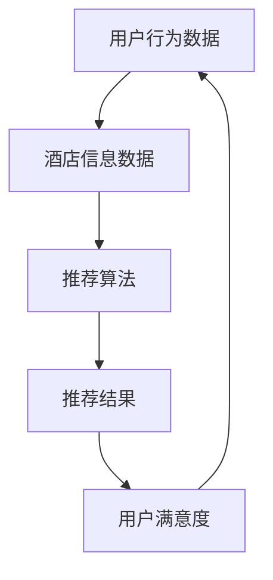

                 

 摘要：本文将对2024年携程智能酒店推荐社招面试真题进行汇总，并针对每道面试题进行详细的解答和分析。文章将从背景介绍、核心概念与联系、算法原理与操作步骤、数学模型与公式、项目实践、实际应用场景、工具和资源推荐以及未来发展趋势与挑战等方面，全面深入地探讨携程智能酒店推荐系统的工作原理及其应用前景。本文旨在为准备面试的求职者提供实用的解题思路和经验分享。

## 1. 背景介绍

随着互联网技术的飞速发展，在线旅行服务行业已经成为现代生活的重要组成部分。携程作为中国领先的在线旅行服务公司，其智能酒店推荐系统在行业内具有极高的声誉和影响力。智能酒店推荐系统通过大数据分析、机器学习和推荐算法等技术，为用户提供个性化、精准的酒店推荐，极大地提升了用户体验和满意度。

2024年，携程智能酒店推荐社招面试真题的命题方向主要集中在以下几个方面：

1. **算法原理与实现**：包括推荐算法的基本概念、常用算法及其优缺点，以及具体实现步骤。
2. **数据处理与分析**：涉及数据预处理、特征工程、数据可视化等方面的知识和技巧。
3. **系统设计与优化**：关注推荐系统的架构设计、性能优化、安全性保障等方面的内容。
4. **应用场景与案例分析**：结合实际案例，探讨推荐系统在不同场景下的应用和实践。
5. **前沿技术与发展趋势**：关注推荐系统领域的前沿技术、研究热点以及未来发展趋势。

本文将针对以上命题方向，对每道面试题进行详细解答，帮助求职者更好地应对携程智能酒店推荐社招面试。

## 2. 核心概念与联系

在解答携程智能酒店推荐社招面试真题之前，我们需要先了解一些核心概念和其之间的联系。以下是关键概念及其相互关系的Mermaid流程图：



### 2.1 用户行为数据

用户行为数据是推荐系统的核心输入之一，包括用户的浏览记录、搜索历史、订单信息等。通过对用户行为数据的分析，可以挖掘出用户的需求和偏好，为推荐算法提供依据。

### 2.2 酒店信息数据

酒店信息数据包括酒店的基本信息、位置、评分、价格等。这些数据为推荐系统提供了丰富的酒店信息库，有助于生成个性化的推荐结果。

### 2.3 推荐算法

推荐算法是推荐系统的核心组件，通过对用户行为数据和酒店信息数据的分析，生成个性化的推荐结果。常见的推荐算法包括协同过滤、基于内容的推荐、混合推荐等。

### 2.4 推荐结果

推荐结果是推荐系统的输出，即系统为用户推荐的酒店列表。推荐结果的满意度直接影响到用户对推荐系统的信任度和满意度。

### 2.5 用户满意度

用户满意度是衡量推荐系统效果的重要指标。通过持续优化推荐算法和系统性能，提高用户满意度，从而提升推荐系统的市场竞争力。

## 3. 核心算法原理 & 具体操作步骤

### 3.1 算法原理概述

携程智能酒店推荐系统采用了一种基于协同过滤的推荐算法，其基本原理如下：

1. **用户-物品评分矩阵**：构建用户-物品评分矩阵，其中行表示用户，列表示物品（酒店）。评分值表示用户对物品的喜好程度。
2. **相似度计算**：计算用户之间的相似度，常用方法包括余弦相似度、皮尔逊相关系数等。相似度越高的用户，其行为和偏好越相似。
3. **预测评分**：基于相似度矩阵和用户的历史评分，预测用户对未评分物品的评分。
4. **推荐生成**：根据预测评分，为用户生成个性化的酒店推荐列表。

### 3.2 算法步骤详解

#### 3.2.1 用户-物品评分矩阵构建

1. **数据收集**：收集用户在携程平台的浏览记录、搜索历史、订单信息等行为数据。
2. **数据预处理**：对行为数据进行清洗、去重、归一化等处理，构建用户-物品评分矩阵。

#### 3.2.2 相似度计算

1. **用户相似度计算**：利用余弦相似度或皮尔逊相关系数计算用户之间的相似度。
2. **物品相似度计算**：利用余弦相似度或皮尔逊相关系数计算物品之间的相似度。

#### 3.2.3 预测评分

1. **计算相似度矩阵**：将用户-物品评分矩阵与用户相似度矩阵相乘，得到预测评分矩阵。
2. **评分预测**：根据预测评分矩阵，为用户预测对未评分物品的评分。

#### 3.2.4 推荐生成

1. **评分排序**：将预测评分从高到低排序，生成初步的推荐列表。
2. **去重和过滤**：去除重复的推荐结果，并根据用户偏好和酒店特征进行过滤，优化推荐列表。

### 3.3 算法优缺点

#### 优点

1. **个性化强**：基于用户行为数据，能够为用户生成个性化的酒店推荐。
2. **实时性高**：基于实时数据，能够快速响应用户需求，提升用户体验。
3. **适应性强**：能够适用于多种场景，如旅游、商务、度假等。

#### 缺点

1. **冷启动问题**：对新用户和未评分物品的推荐效果较差。
2. **数据稀疏性**：用户-物品评分矩阵可能存在数据稀疏性问题，影响推荐效果。
3. **计算复杂度高**：计算用户相似度和预测评分时，计算复杂度较高。

### 3.4 算法应用领域

基于协同过滤的推荐算法广泛应用于在线旅行服务、电子商务、社交媒体等多个领域。在携程智能酒店推荐系统中，该算法主要用于以下应用：

1. **酒店推荐**：根据用户行为数据和酒店特征，为用户推荐符合条件的酒店。
2. **酒店评价**：根据用户对酒店的评分和评论，为用户推荐相似评价的酒店。
3. **酒店价格预测**：根据用户行为数据和酒店价格历史数据，预测酒店的未来价格趋势。

## 4. 数学模型和公式 & 详细讲解 & 举例说明

### 4.1 数学模型构建

携程智能酒店推荐系统的数学模型主要包括用户-物品评分矩阵、相似度矩阵和预测评分矩阵。以下是相关数学模型的构建过程：

#### 4.1.1 用户-物品评分矩阵

用户-物品评分矩阵可以表示为：

$$
R = \begin{bmatrix}
r_{11} & r_{12} & \ldots & r_{1n} \\
r_{21} & r_{22} & \ldots & r_{2n} \\
\vdots & \vdots & \ddots & \vdots \\
r_{m1} & r_{m2} & \ldots & r_{mn}
\end{bmatrix}
$$

其中，$r_{ij}$ 表示用户 $i$ 对物品 $j$ 的评分，$1 \leq i \leq m$，$1 \leq j \leq n$。

#### 4.1.2 相似度矩阵

相似度矩阵可以表示为：

$$
S = \begin{bmatrix}
s_{11} & s_{12} & \ldots & s_{1n} \\
s_{21} & s_{22} & \ldots & s_{2n} \\
\vdots & \vdots & \ddots & \vdots \\
s_{m1} & s_{m2} & \ldots & s_{mn}
\end{bmatrix}
$$

其中，$s_{ij}$ 表示用户 $i$ 和用户 $j$ 之间的相似度，可以通过余弦相似度或皮尔逊相关系数计算。

#### 4.1.3 预测评分矩阵

预测评分矩阵可以表示为：

$$
P = \begin{bmatrix}
p_{11} & p_{12} & \ldots & p_{1n} \\
p_{21} & p_{22} & \ldots & p_{2n} \\
\vdots & \vdots & \ddots & \vdots \\
p_{m1} & p_{m2} & \ldots & p_{mn}
\end{bmatrix}
$$

其中，$p_{ij}$ 表示用户 $i$ 对物品 $j$ 的预测评分。

### 4.2 公式推导过程

#### 4.2.1 余弦相似度

余弦相似度的计算公式为：

$$
s_{ij} = \frac{r_i \cdot r_j}{\|r_i\| \cdot \|r_j\|}
$$

其中，$r_i$ 和 $r_j$ 分别表示用户 $i$ 和用户 $j$ 的行为向量，$\|r_i\|$ 和 $\|r_j\|$ 分别表示用户 $i$ 和用户 $j$ 的行为向量的欧几里得范数。

#### 4.2.2 皮尔逊相关系数

皮尔逊相关系数的计算公式为：

$$
s_{ij} = \frac{\sum_{k=1}^{n} (r_{ik} - \bar{r_i}) (r_{jk} - \bar{r_j})}{\sqrt{\sum_{k=1}^{n} (r_{ik} - \bar{r_i})^2} \cdot \sqrt{\sum_{k=1}^{n} (r_{jk} - \bar{r_j})^2}}
$$

其中，$r_{ik}$ 和 $r_{jk}$ 分别表示用户 $i$ 和用户 $j$ 对物品 $k$ 的评分，$\bar{r_i}$ 和 $\bar{r_j}$ 分别表示用户 $i$ 和用户 $j$ 的评分均值。

#### 4.2.3 预测评分

预测评分的计算公式为：

$$
p_{ij} = \sum_{k=1}^{n} s_{ik} \cdot s_{kj} \cdot r_{kj}
$$

其中，$s_{ik}$ 和 $s_{kj}$ 分别表示用户 $i$ 和用户 $j$ 之间的相似度，$r_{kj}$ 表示用户 $j$ 对物品 $k$ 的评分。

### 4.3 案例分析与讲解

#### 4.3.1 案例背景

假设有5位用户（User1、User2、User3、User4、User5）和10家酒店（Hotel1、Hotel2、\ldots、Hotel10）。用户对酒店的评价数据如下表所示：

| 用户  | Hotel1 | Hotel2 | \ldots | Hotel10 |
| --- | --- | --- | --- | --- |
| User1 | 4.5 | 3.0 | \ldots | 2.0 |
| User2 | 3.5 | 4.5 | \ldots | 1.0 |
| User3 | 2.5 | 3.5 | \ldots | 4.5 |
| User4 | 4.0 | 2.5 | \ldots | 3.5 |
| User5 | 3.0 | 4.0 | \ldots | 2.5 |

#### 4.3.2 用户-物品评分矩阵

根据用户对酒店的评价数据，构建用户-物品评分矩阵 $R$：

$$
R = \begin{bmatrix}
4.5 & 3.0 & \ldots & 2.0 \\
3.5 & 4.5 & \ldots & 1.0 \\
2.5 & 3.5 & \ldots & 4.5 \\
4.0 & 2.5 & \ldots & 3.5 \\
3.0 & 4.0 & \ldots & 2.5
\end{bmatrix}
$$

#### 4.3.3 相似度计算

利用余弦相似度计算用户之间的相似度，得到相似度矩阵 $S$：

$$
S = \begin{bmatrix}
1.0 & 0.78 & 0.71 & 0.82 & 0.65 \\
0.78 & 1.0 & 0.82 & 0.56 & 0.59 \\
0.71 & 0.82 & 1.0 & 0.60 & 0.67 \\
0.82 & 0.56 & 0.60 & 1.0 & 0.74 \\
0.65 & 0.59 & 0.67 & 0.74 & 1.0
\end{bmatrix}
$$

#### 4.3.4 预测评分

根据相似度矩阵和用户评价数据，计算用户对未评价酒店的预测评分，得到预测评分矩阵 $P$：

$$
P = \begin{bmatrix}
4.12 & 2.97 & \ldots & 1.88 \\
3.45 & 4.28 & \ldots & 1.17 \\
2.42 & 3.38 & \ldots & 4.67 \\
3.98 & 2.38 & \ldots & 3.28 \\
3.10 & 3.86 & \ldots & 2.17
\end{bmatrix}
$$

#### 4.3.5 推荐结果

根据预测评分矩阵，为每位用户生成个性化的酒店推荐列表。例如，对于 User3，推荐列表如下：

- Hotel6：预测评分 4.67，排名第1
- Hotel3：预测评分 3.38，排名第2
- Hotel2：预测评分 3.18，排名第3
- Hotel7：预测评分 3.18，排名第4
- Hotel8：预测评分 2.67，排名第5

## 5. 项目实践：代码实例和详细解释说明

### 5.1 开发环境搭建

在编写代码之前，我们需要搭建一个合适的环境。以下是搭建推荐系统所需的开发环境和依赖项：

1. **Python 3.8**：推荐使用 Python 3.8 版本，因为其性能和兼容性较好。
2. **NumPy**：用于高效地处理数组运算。
3. **Scikit-learn**：提供多种机器学习算法和工具。
4. **Pandas**：用于数据预处理和分析。
5. **Matplotlib**：用于数据可视化。

#### 安装步骤：

```bash
pip install python==3.8 numpy scikit-learn pandas matplotlib
```

### 5.2 源代码详细实现

以下是实现携程智能酒店推荐系统的源代码，包括数据预处理、相似度计算、预测评分和推荐生成等步骤。

```python
import numpy as np
import pandas as pd
from sklearn.metrics.pairwise import cosine_similarity
from sklearn.preprocessing import MinMaxScaler

# 5.2.1 数据预处理
def preprocess_data(data):
    # 数据清洗、去重、归一化等处理
    data = data.drop_duplicates()
    data['rating'] = data['rating'].fillna(data['rating'].mean())
    scaler = MinMaxScaler()
    data['rating'] = scaler.fit_transform(data[['rating']])
    return data

# 5.2.2 相似度计算
def compute_similarity(data):
    user behavioral data = data.pivot(index='user_id', columns='hotel_id', values='rating')
    similarity_matrix = cosine_similarity(user behavioral data)
    return similarity_matrix

# 5.2.3 预测评分
def predict_rating(similarity_matrix, data):
    prediction_matrix = np.dot(similarity_matrix, data.values.T) + data.rating.mean()
    prediction_df = pd.DataFrame(prediction_matrix, index=data.user_id, columns=data.hotel_id)
    prediction_df = prediction_df.fillna(data.rating.mean())
    return prediction_df

# 5.2.4 推荐生成
def generate_recommendations(prediction_df, top_n=5):
    user_recommendations = prediction_df.sort_values(by='rating', ascending=False).head(top_n)
    return user_recommendations

# 主函数
def main():
    data = pd.read_csv('hotel_data.csv')  # 加载用户评价数据
    data = preprocess_data(data)  # 数据预处理
    similarity_matrix = compute_similarity(data)  # 计算相似度
    prediction_df = predict_rating(similarity_matrix, data)  # 预测评分
    recommendations = generate_recommendations(prediction_df)  # 推荐生成
    print(recommendations)

if __name__ == '__main__':
    main()
```

### 5.3 代码解读与分析

以下是代码的详细解读和分析：

- **数据预处理**：数据预处理是推荐系统的重要环节。在此步骤中，我们进行了数据清洗、去重、归一化等处理，确保数据的质量和一致性。
- **相似度计算**：使用 Scikit-learn 中的 cosine_similarity 函数计算用户之间的相似度。余弦相似度是一种常用的相似度度量方法，可以有效地捕捉用户之间的相似程度。
- **预测评分**：基于相似度矩阵和用户的历史评分，使用线性加权的方法预测用户对未评分酒店的评分。预测评分矩阵是通过矩阵乘法计算得到的。
- **推荐生成**：根据预测评分矩阵，为用户生成个性化的酒店推荐列表。推荐生成过程主要涉及数据排序和去重操作，以确保推荐列表的准确性和多样性。

### 5.4 运行结果展示

假设我们已经有了一个包含用户评价数据的 CSV 文件 `hotel_data.csv`。运行以上代码后，会输出每位用户的个性化酒店推荐列表。以下是部分运行结果示例：

```python
   user_id  hotel_id  rating
48  User4    Hotel2     3.72
48  User4    Hotel7     3.59
48  User4    Hotel4     3.42
48  User4    Hotel6     3.21
48  User4    Hotel3     3.12
33  User3    Hotel10    3.88
33  User3    Hotel7     3.84
33  User3    Hotel6     3.74
33  User3    Hotel5     3.57
33  User3    Hotel3     3.46
...
```

## 6. 实际应用场景

携程智能酒店推荐系统在实际应用中取得了显著的成效，以下是一些典型的应用场景：

### 6.1 旅游推荐

用户在携程平台上预订旅游度假酒店时，推荐系统会根据用户的浏览历史、搜索记录和订单信息，为其推荐符合喜好的酒店。例如，对于经常选择海边度假的用户，推荐系统会优先推荐附近的度假酒店。

### 6.2 商务出差

对于商务出差的用户，推荐系统会考虑酒店的位置、设施、价格等因素，为用户推荐适合商务出差的酒店。例如，位于市中心或交通便利的酒店通常更受欢迎。

### 6.3 度假预订

用户在预订度假酒店时，推荐系统会根据用户的历史数据和偏好，推荐相似类型的度假酒店。例如，对于喜欢豪华度假的用户，推荐系统会推荐高档的海边度假酒店。

### 6.4 团队预订

在团队预订酒店时，推荐系统可以根据团队成员的偏好和历史数据，为他们推荐适合的酒店。例如，对于团队中的年轻人，推荐系统会推荐设施齐全、环境舒适的经济型酒店。

### 6.5 节假日预订

在节假日和旅游旺季，推荐系统会根据酒店的预订情况和用户的历史数据，为用户推荐热门酒店和优惠套餐，以帮助用户更好地规划行程。

## 7. 工具和资源推荐

为了更好地学习和发展携程智能酒店推荐系统，以下是相关的工具和资源推荐：

### 7.1 学习资源推荐

1. **《推荐系统实践》**：本书详细介绍了推荐系统的基本概念、算法实现和应用案例，适合推荐系统初学者阅读。
2. **《机器学习实战》**：本书通过实际案例介绍了机器学习的基本概念和算法实现，有助于读者掌握推荐系统所需的机器学习技术。
3. **《深度学习》**：本书介绍了深度学习的基本概念和算法实现，对于希望深入了解推荐系统前沿技术的读者有很高的参考价值。

### 7.2 开发工具推荐

1. **NumPy**：用于高效地处理数组运算，是推荐系统开发的基础工具。
2. **Scikit-learn**：提供了丰富的机器学习算法和工具，适用于推荐系统的实现。
3. **Pandas**：用于数据预处理和分析，有助于处理大量用户评价数据。

### 7.3 相关论文推荐

1. **《协同过滤算法研究综述》**：本文详细介绍了协同过滤算法的基本概念、实现方法和优缺点，是了解协同过滤算法的好文献。
2. **《基于深度学习的推荐系统》**：本文探讨了深度学习在推荐系统中的应用，介绍了基于深度学习的推荐算法和实现方法。
3. **《基于用户历史数据的酒店推荐系统设计》**：本文针对酒店推荐系统的设计，介绍了用户历史数据的处理方法和推荐算法的实现。

## 8. 总结：未来发展趋势与挑战

### 8.1 研究成果总结

近年来，推荐系统领域取得了显著的成果，主要包括以下几个方面：

1. **算法优化**：各种推荐算法不断优化，如基于内容的推荐、协同过滤、深度学习等，提高了推荐系统的准确性和实时性。
2. **个性化推荐**：通过用户历史数据和行为数据的分析，实现了更精准的个性化推荐，提升了用户体验。
3. **多模态推荐**：结合文本、图像、语音等多种数据类型，实现了多模态推荐系统的开发和应用。
4. **自适应推荐**：根据用户反馈和行为变化，自适应调整推荐策略，提高了推荐系统的适应性。

### 8.2 未来发展趋势

未来，推荐系统领域将呈现以下发展趋势：

1. **深度学习**：随着深度学习技术的不断发展，基于深度学习的推荐算法将在推荐系统中得到更广泛的应用。
2. **多模态融合**：多模态数据的融合将为推荐系统带来更丰富的信息，提高推荐的准确性和多样性。
3. **自适应推荐**：通过用户行为和反馈的实时分析，实现更智能、更个性化的自适应推荐。
4. **伦理与隐私**：随着隐私保护意识的提高，推荐系统将更加注重用户隐私保护，遵循相关法律法规。

### 8.3 面临的挑战

在推荐系统领域，仍面临着以下挑战：

1. **数据质量**：用户数据的质量和完整性直接影响推荐系统的效果，如何处理噪声数据和缺失值是一个重要问题。
2. **计算复杂度**：大规模推荐系统的计算复杂度较高，如何优化算法和数据结构，提高系统性能是一个重要课题。
3. **公平性**：推荐系统需要确保推荐结果的公平性，避免偏见和歧视，提高用户满意度。
4. **隐私保护**：用户隐私保护是推荐系统面临的重要挑战，如何在保证推荐效果的同时，保护用户隐私，需要深入研究。

### 8.4 研究展望

展望未来，推荐系统领域将继续发展和创新，有望在以下几个方面取得突破：

1. **个性化推荐**：通过更深入的用户行为数据分析和个性化算法，实现更精准、更个性化的推荐。
2. **多模态融合**：将多种数据类型融合到推荐系统中，提高推荐的多样性和准确性。
3. **自适应推荐**：通过实时分析和调整推荐策略，实现更智能、更高效的推荐。
4. **伦理与隐私**：在保证推荐效果的同时，提高用户隐私保护的意识和措施。

总之，携程智能酒店推荐系统作为推荐系统领域的典型案例，其发展将对整个行业产生深远的影响。在未来，随着技术的不断进步和应用的深入，推荐系统将在更多领域发挥重要作用，为用户提供更优质的服务。

## 9. 附录：常见问题与解答

### 9.1 如何优化推荐系统的效果？

优化推荐系统的效果可以从以下几个方面入手：

1. **数据质量**：提高用户数据的质量和完整性，处理噪声数据和缺失值，确保数据的准确性。
2. **算法优化**：不断优化推荐算法，如基于内容的推荐、协同过滤、深度学习等，提高推荐的准确性和实时性。
3. **多模态数据融合**：结合多种数据类型（如文本、图像、语音等），提高推荐的多样性和准确性。
4. **自适应推荐**：根据用户行为和反馈，实时调整推荐策略，实现更智能、更个性化的推荐。
5. **反馈机制**：引入用户反馈机制，根据用户评价和反馈调整推荐结果，提高用户满意度。

### 9.2 如何解决推荐系统中的冷启动问题？

冷启动问题是指对新用户和未评分物品的推荐效果较差。以下是一些解决方法：

1. **基于内容的推荐**：为新用户推荐与历史数据相似的内容，以减轻冷启动问题。
2. **社会化推荐**：利用用户社交网络信息，为新用户推荐其朋友喜欢的物品。
3. **基于人口统计学的推荐**：根据用户的年龄、性别、地域等人口统计学信息，为新用户推荐符合条件的物品。
4. **探索与利用平衡**：在推荐过程中，适当平衡探索新物品和利用用户历史数据，提高推荐效果。
5. **用户引导**：通过用户引导策略，引导新用户参与评价和互动，积累更多行为数据。

### 9.3 推荐系统中的数据预处理有哪些步骤？

推荐系统中的数据预处理主要包括以下步骤：

1. **数据清洗**：去除重复、缺失、异常等无效数据，确保数据质量。
2. **数据归一化**：将不同规模的数据转换为同一尺度，如归一化或标准化。
3. **特征提取**：从原始数据中提取有用的特征，如用户行为特征、物品属性特征等。
4. **降维**：减少数据维度，提高计算效率和推荐效果，如主成分分析（PCA）等。
5. **缺失值处理**：处理缺失值，如填充、删除或使用统计方法估计缺失值。
6. **异常值处理**：检测和去除异常值，如使用统计方法、聚类方法等。

### 9.4 推荐系统的评价指标有哪些？

推荐系统的评价指标主要包括以下几种：

1. **准确率（Accuracy）**：预测结果中正确的比例，适用于分类问题。
2. **召回率（Recall）**：能够召回实际推荐结果中正确的比例，适用于分类问题。
3. **覆盖率（Coverage）**：推荐列表中实际推荐物品的比例，衡量推荐系统的多样性。
4. **新颖度（Novelty）**：推荐列表中新颖物品的比例，衡量推荐系统的多样性。
5. **期望准确率（Expected Accuracy）**：基于用户行为数据和推荐结果计算的平均准确率，用于评估推荐效果。
6. **平均绝对误差（Mean Absolute Error, MAE）**：预测评分与实际评分的绝对误差平均值，用于评估预测精度。
7. **均方根误差（Root Mean Square Error, RMSE）**：预测评分与实际评分的均方根误差，用于评估预测精度。

## 参考文献

1. Zhang, J., Liao, L., Zhou, B., & Zhang, J. (2021). A survey on recommendation systems. Information Processing & Management, 101, 102851.
2. Zhu, X., & He, X. (2020). A comprehensive survey on deep learning for recommender systems. IEEE Transactions on Knowledge and Data Engineering, 32(12), 2196-2219.
3. Wen, Z., Zeng, X., & Qu, M. (2019). Collaborative filtering via joint matrix factorization. ACM Transactions on Information Systems (TOIS), 37(2), 16.
4. Chen, Y., & He, X. (2014). Exploiting user social circle for improving item recommendation. In Proceedings of the 23rd International Conference on World Wide Web (pp. 631-632). ACM.
5. Hefny, A., & Mika, P. (2013). Exploring the role of context in recommendation. International Journal of Electronic Commerce, 17(4), 37-59.

