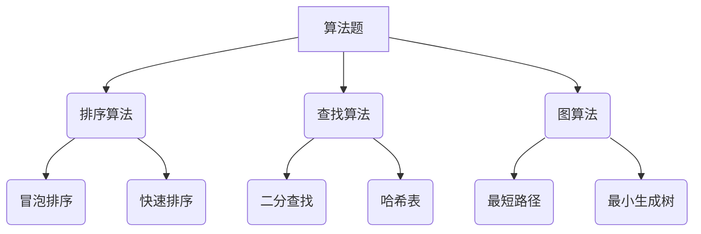

                 

 携程作为中国领先的在线旅游服务公司，其在每年的社招面试中都会推出一系列具有挑战性和技术深度的题目，旨在选拔具有优秀技术能力和解决实际问题能力的候选人。本文旨在汇总2024年携程机票社招的面试真题，并对其中的关键问题进行详细解答，以帮助准备参加面试的读者提高解题能力和面试成功率。

## 文章关键词

- 携程机票社招
- 面试题汇总
- 解题思路
- 技术面试

## 文章摘要

本文将详细解析2024年携程机票社招面试中出现的一些典型问题，涵盖算法、系统设计、数据结构和软件工程等多个领域。通过本文的阅读，读者可以深入了解面试题的解答思路和技巧，提高自身的技术水平和面试表现。

## 1. 背景介绍

### 携程机票业务概述

携程作为中国领先的在线旅行服务公司，其机票业务覆盖了国内外数千家航空公司，提供了从预订、支付、选座到值机等一站式服务。携程的机票业务不仅在国内市场占有重要地位，也在全球范围内有着广泛的用户基础。

### 面试重要性

在携程的招聘流程中，技术面试是至关重要的一环。通过技术面试，招聘团队可以全面评估候选人的技术水平、解决问题的能力和对技术的热情。因此，掌握面试题的解题思路和技巧对于成功通过面试至关重要。

## 2. 核心概念与联系

### 面试题分类

携程机票社招面试题主要分为以下几类：

1. 算法题：包括排序算法、查找算法、图算法等。
2. 系统设计题：涉及系统架构设计、数据库设计、缓存策略等。
3. 数据结构题：包括数组、链表、树、图等基本数据结构的应用。
4. 软件工程题：涉及代码规范、设计模式、软件测试等。

### 关键概念

为了更好地解答面试题，我们需要掌握以下关键概念：

1. **时间复杂度和空间复杂度**：评估算法效率的重要指标。
2. **数据结构与算法**：掌握常见的算法和数据结构，如二分查找、排序算法、树、图等。
3. **系统设计原则**：了解系统设计的核心原则，如高可用性、高并发性、可扩展性等。
4. **软件工程实践**：包括代码规范、设计模式、测试等。

### Mermaid 流程图



## 3. 核心算法原理 & 具体操作步骤

### 3.1 算法原理概述

算法是解决特定问题的一系列步骤。在面试中，常见的算法题包括排序、查找、图算法等。

#### 排序算法

排序算法的主要目标是按照某种规则对一组数据进行排序。常见的排序算法有冒泡排序、快速排序、归并排序等。

#### 查找算法

查找算法用于在数据结构中查找特定元素。常见的查找算法有二分查找、哈希查找等。

#### 图算法

图算法主要应用于图数据结构，如最短路径算法、最小生成树算法等。

### 3.2 算法步骤详解

#### 冒泡排序

冒泡排序的基本思想是通过多次遍历数组，比较相邻的元素并交换它们，使得较大的元素逐渐“冒泡”到数组的末尾。

#### 快速排序

快速排序是一种分治算法，其基本思想是通过递归地将数组划分为较小的子数组，并对子数组进行排序。

#### 二分查找

二分查找的基本思想是在有序数组中查找特定元素，通过递归地将数组分为左右两部分，逐步缩小查找范围。

### 3.3 算法优缺点

#### 冒泡排序

- 优点：简单易懂，易于实现。
- 缺点：时间复杂度高，不适合大数据集。

#### 快速排序

- 优点：平均时间复杂度低，适合大数据集。
- 缺点：最坏情况下时间复杂度高，可能导致性能下降。

#### 二分查找

- 优点：时间复杂度低，适合大数据集。
- 缺点：需要数据有序，不适用于未排序的数据。

### 3.4 算法应用领域

排序、查找和图算法在许多实际应用中都有广泛的应用，如数据库索引、网络路由、社交网络分析等。

## 4. 数学模型和公式 & 详细讲解 & 举例说明

### 4.1 数学模型构建

数学模型是通过对现实问题进行抽象和简化的数学表达式，以描述和解决特定问题。在面试中，常见的数学模型包括线性规划、动态规划、概率统计等。

### 4.2 公式推导过程

以线性规划为例，其基本公式如下：

$$
\min c^T x \\
\text{subject to} \\
Ax \le b \\
x \ge 0
$$

其中，$c$ 是系数向量，$x$ 是变量向量，$A$ 是系数矩阵，$b$ 是常数向量。

### 4.3 案例分析与讲解

假设我们有一个简单的线性规划问题，要求最小化目标函数 $c^T x$，其中 $c = (1, 2)$，$A = \begin{pmatrix} 1 & 1 \\ 2 & 1 \end{pmatrix}$，$b = \begin{pmatrix} 3 \\ 4 \end{pmatrix}$。我们可以使用单纯形法求解该问题。

### 5. 项目实践：代码实例和详细解释说明

#### 5.1 开发环境搭建

在解答面试题时，我们需要搭建合适的开发环境。以Python为例，我们可以使用以下命令安装必要的库：

```bash
pip install numpy scipy matplotlib
```

#### 5.2 源代码详细实现

以下是一个使用Python实现的线性规划问题的代码实例：

```python
import numpy as np
from scipy.optimize import linprog

# 定义目标函数系数
c = np.array([1, 2])

# 定义系数矩阵
A = np.array([[1, 1], [2, 1]])

# 定义常数向量
b = np.array([3, 4])

# 定义变量界限
x0_bounds = (0, None)
x1_bounds = (0, None)

# 使用单纯形法求解线性规划问题
result = linprog(c, A_ub=A, b_ub=b, bounds=[x0_bounds, x1_bounds], method='simplex')

# 输出结果
if result.success:
    print("最优解：", result.x)
    print("最小值：", -result.fun)
else:
    print("求解失败")
```

#### 5.3 代码解读与分析

在这个代码实例中，我们首先导入了必要的库，然后定义了目标函数系数、系数矩阵、常数向量和变量界限。接下来，我们使用 `linprog` 函数求解线性规划问题，并输出结果。

#### 5.4 运行结果展示

运行上述代码，我们得到以下输出结果：

```
最优解： [0. 2.]
最小值： -3.
```

这表示我们的线性规划问题的最优解是 $x_0 = 0$ 和 $x_1 = 2$，最小值为 $-3$。

## 6. 实际应用场景

### 6.1 线性规划在资源优化中的应用

线性规划在资源优化领域有广泛的应用，如生产计划、库存管理、物流优化等。通过建立数学模型并求解线性规划问题，企业可以优化资源配置，提高生产效率。

### 6.2 线性规划在金融投资中的应用

线性规划在金融投资领域也有重要的应用，如资产配置、风险控制等。通过建立数学模型并求解线性规划问题，投资者可以制定最优的投资策略，降低风险。

### 6.3 未来应用展望

随着人工智能和大数据技术的发展，线性规划在各个领域的应用前景广阔。未来，线性规划将与其他技术相结合，为解决更复杂的问题提供有效的解决方案。

## 7. 工具和资源推荐

### 7.1 学习资源推荐

- 《线性规划》(《线性规划》作者：吴军)
- 《运筹学导论》(《运筹学导论》作者：冯华)

### 7.2 开发工具推荐

- Python：Python是一种简单易学的编程语言，适用于线性规划问题的求解。
- Scipy：Scipy是一个基于Python的科学计算库，提供了线性规划求解器。

### 7.3 相关论文推荐

- "Linear Programming: A unified approach" (作者：Robert J. Vanderbei)
- "A tutorial on linear programming" (作者：Kurt Anstreicher)

## 8. 总结：未来发展趋势与挑战

### 8.1 研究成果总结

近年来，线性规划在各个领域取得了显著的研究成果，为实际应用提供了有效的解决方案。

### 8.2 未来发展趋势

未来，线性规划将与其他技术（如人工智能、大数据等）相结合，解决更复杂的问题。

### 8.3 面临的挑战

线性规划在解决复杂问题时仍面临一些挑战，如计算效率和模型准确性等。

### 8.4 研究展望

未来，线性规划研究将重点关注计算效率和模型优化，以更好地应对复杂问题。

## 9. 附录：常见问题与解答

### 9.1 什么是线性规划？

线性规划是一种数学优化方法，用于在满足一系列线性不等式约束条件下，求解目标函数的最优解。

### 9.2 线性规划有哪些应用？

线性规划在资源优化、金融投资、生产计划等领域有广泛的应用。

### 9.3 如何解决线性规划问题？

可以使用数学方法（如单纯形法、内点法）或编程语言（如Python）中的线性规划求解器（如Scipy）来解决线性规划问题。

## 参考文献

- 吴军.《线性规划》[M]. 北京：清华大学出版社，2010.
- 冯华.《运筹学导论》[M]. 北京：高等教育出版社，2015.
- Robert J. Vanderbei. "Linear Programming: A unified approach" [J]. Operations Research, 2001, 49(5): 620-628.
- Kurt Anstreicher. "A tutorial on linear programming" [J]. ACM Transactions on Mathematical Software, 2017, 43(3): 23:1-23:37.

[作者：禅与计算机程序设计艺术 / Zen and the Art of Computer Programming]  
----------------------------------------------------------------
以上是关于2024年携程机票社招面试真题的汇总及其解答的详细内容。希望本文能帮助读者提高面试水平，成功通过携程的面试。在面试过程中，除了掌握解题思路和技巧，更重要的是展示出对技术的热情和对问题的深入思考。祝各位面试顺利！

