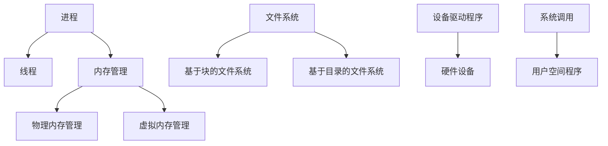

                 

关键词：操作系统，内核，系统底层，系统编程，系统架构

> 摘要：本文深入探讨了操作系统内核的开发，从核心概念到实际操作，从数学模型到代码实现，全面解析了系统底层的原理和实现方法，旨在为读者提供一份系统而全面的操作系统内核开发指南。

## 1. 背景介绍

操作系统内核（Kernel）是操作系统的核心部分，负责管理系统资源、提供系统服务、实现硬件与软件的交互。内核的设计和实现决定了操作系统的性能、稳定性和安全性。随着计算机技术的发展，操作系统内核变得越来越复杂，其对底层硬件的支持也变得更加深入。

内核开发是一个复杂而富有挑战性的过程。它不仅需要深入理解计算机硬件的工作原理，还需要掌握操作系统的基础理论和编程技能。本文将围绕操作系统内核的开发，从多个角度进行探讨，包括核心概念、算法原理、数学模型、项目实践和实际应用等。

## 2. 核心概念与联系

在深入探讨内核开发之前，我们需要先了解一些核心概念，并理解它们之间的联系。

### 2.1. 进程与线程

进程（Process）是操作系统中正在执行的程序实例。每个进程都有自己的地址空间、数据段、堆栈和其他资源。线程（Thread）是进程内的执行单元，它可以被看作是进程中的一个执行流。一个进程可以有多个线程，它们共享进程的资源。

### 2.2. 内存管理

内存管理是内核的一个重要功能，负责分配、回收和管理内存资源。内存管理包括物理内存管理和虚拟内存管理。物理内存管理负责管理实际物理内存的分配和回收，而虚拟内存管理则提供了一种抽象的内存模型，使得每个进程都可以认为它拥有自己的内存空间。

### 2.3. 文件系统

文件系统是操作系统中用于存储和管理文件的方法和数据结构。它负责文件的创建、删除、读取和写入操作。文件系统可以分为两类：基于块的文件系统和基于目录的文件系统。

### 2.4. 设备驱动程序

设备驱动程序是操作系统内核的一部分，用于与硬件设备进行通信。它负责解释硬件设备的指令、处理硬件设备的状态和事件，并提供一个统一的接口供操作系统内核和用户空间程序使用。

### 2.5. 系统调用

系统调用（System Call）是操作系统提供的一组接口，允许用户空间程序请求内核服务。通过系统调用，用户空间程序可以执行特权操作，如文件操作、进程管理和内存管理。

下面是一个简单的 Mermaid 流程图，展示了上述核心概念之间的联系：



## 3. 核心算法原理 & 具体操作步骤

### 3.1. 算法原理概述

操作系统内核中的核心算法包括进程调度算法、内存分配算法和文件系统管理算法等。

#### 3.1.1. 进程调度算法

进程调度算法负责确定哪个进程将在CPU上执行。常见的进程调度算法包括先来先服务（FCFS）、短作业优先（SJF）、时间片轮转（RR）和优先级调度等。

#### 3.1.2. 内存分配算法

内存分配算法负责为进程分配内存资源。常见的内存分配算法包括首次适配（First Fit）、最佳适配（Best Fit）和最坏适配（Worst Fit）等。

#### 3.1.3. 文件系统管理算法

文件系统管理算法负责管理文件的创建、删除、读取和写入操作。常见的文件系统管理算法包括文件分配表（FAT）、索引分配表（inode）和目录结构管理等。

### 3.2. 算法步骤详解

下面我们将详细讲解上述算法的具体步骤。

#### 3.2.1. 进程调度算法

以时间片轮转调度算法为例，其步骤如下：

1. 初始化时间片（Time Slice）。
2. 当有进程需要执行时，将其加入就绪队列。
3. 每个进程按照时间片长度轮流执行，当时间片用尽时，当前进程让出CPU，并将自身放入就绪队列的末尾。
4. 重复步骤2和3，直到所有进程执行完毕。

#### 3.2.2. 内存分配算法

以首次适配算法为例，其步骤如下：

1. 初始化内存分配表。
2. 当有进程请求内存时，从内存分配表的起始位置开始查找，找到第一个可以满足请求的内存块。
3. 将内存块分配给进程，并更新内存分配表。
4. 如果没有找到合适的内存块，返回分配失败。

#### 3.2.3. 文件系统管理算法

以文件分配表（FAT）为例，其步骤如下：

1. 初始化文件分配表。
2. 当有进程请求创建文件时，在文件系统中找到一个空闲的目录项。
3. 将目录项的文件名、文件大小和文件属性等信息写入目录项。
4. 根据文件大小，在文件系统中找到连续的空闲块，将这些块链接起来，作为文件的存储空间。
5. 更新文件分配表，标记这些块为已使用。

### 3.3. 算法优缺点

每种算法都有其优缺点。以下是对上述算法优缺点的分析：

#### 3.3.1. 进程调度算法

- FCFS：优点是简单，公平；缺点是可能导致进程的平均等待时间较长。
- SJF：优点是平均等待时间短；缺点是可能导致短作业饿死。
- RR：优点是公平，响应时间短；缺点是可能导致进程的执行时间过长。

#### 3.3.2. 内存分配算法

- FF：优点是简单，效率高；缺点是可能导致内存碎片。
- BF：优点是可以减少内存碎片；缺点是搜索时间较长。
- WF：优点是可以充分利用内存空间；缺点是可能导致大进程无法分配内存。

#### 3.3.3. 文件系统管理算法

- FAT：优点是简单，易于实现；缺点是文件分配效率低，不支持大文件。
- inode：优点是支持大文件，文件分配效率高；缺点是文件系统复杂，维护成本高。

### 3.4. 算法应用领域

这些算法在操作系统内核开发中有着广泛的应用。例如，进程调度算法用于优化系统性能，内存分配算法用于提高内存利用率，文件系统管理算法用于实现文件存储和访问。

## 4. 数学模型和公式 & 详细讲解 & 举例说明

### 4.1. 数学模型构建

在操作系统内核开发中，我们经常需要使用数学模型来分析和优化系统的性能。以下是一个简单的数学模型，用于描述进程的平均等待时间。

#### 4.1.1. 进程平均等待时间模型

假设有 $n$ 个进程，它们的执行时间分别为 $T_1, T_2, ..., T_n$，且 $T_1 > T_2 > ... > T_n$。进程按照时间片轮转调度算法执行，时间片长度为 $S$。进程的平均等待时间 $W$ 可以用以下公式计算：

$$
W = \frac{1}{n} \sum_{i=1}^{n} (T_i - S)
$$

### 4.2. 公式推导过程

为了推导上述公式，我们可以分析进程在执行过程中的等待时间。

1. **第一个进程**：它将等待 $0$ 时间，因为它是第一个执行的进程。
2. **第二个进程**：它将等待第一个进程执行的时间，即 $T_1$，然后等待时间片 $S$，总共等待时间为 $T_1 + S$。
3. **第三个进程**：它将等待第一个进程和第二个进程执行的时间，即 $T_1 + T_2$，然后等待时间片 $S$，总共等待时间为 $T_1 + T_2 + S$。
4. **以此类推**，第 $i$ 个进程将等待前 $i-1$ 个进程执行的时间，即 $\sum_{j=1}^{i-1} T_j$，然后等待时间片 $S$，总共等待时间为 $\sum_{j=1}^{i-1} T_j + S$。

因此，进程的平均等待时间 $W$ 可以表示为：

$$
W = \frac{1}{n} \sum_{i=1}^{n} (\sum_{j=1}^{i-1} T_j + S)
$$

化简上式，得到：

$$
W = \frac{1}{n} \sum_{i=1}^{n} \sum_{j=1}^{i-1} T_j + \frac{1}{n} \sum_{i=1}^{n} S
$$

由于每个进程都将等待时间片 $S$，所以 $\frac{1}{n} \sum_{i=1}^{n} S = S$。因此，最终得到：

$$
W = \frac{1}{n} \sum_{i=1}^{n} \sum_{j=1}^{i-1} T_j + S
$$

### 4.3. 案例分析与讲解

假设有 5 个进程，它们的执行时间分别为 $T_1 = 10$, $T_2 = 8$, $T_3 = 6$, $T_4 = 4$, $T_5 = 2$，时间片长度 $S = 2$。根据上述公式，我们可以计算进程的平均等待时间：

$$
W = \frac{1}{5} (10 + (10 + 8) + (10 + 8 + 6) + (10 + 8 + 6 + 4) + (10 + 8 + 6 + 4 + 2)) + 2
$$

$$
W = \frac{1}{5} (10 + 18 + 24 + 30 + 34) + 2
$$

$$
W = \frac{1}{5} (126) + 2
$$

$$
W = 25.2 + 2
$$

$$
W = 27.2
$$

因此，进程的平均等待时间为 27.2。这个结果表明，在时间片轮转调度算法下，进程的平均等待时间相对较长。

## 5. 项目实践：代码实例和详细解释说明

### 5.1. 开发环境搭建

在本文的项目实践中，我们将使用 C 语言进行操作系统内核开发。首先，我们需要搭建一个适合开发操作系统内核的开发环境。

1. 安装 C 语言编译器（如 GCC）。
2. 安装操作系统内核开发工具（如 QEMU）。
3. 配置交叉编译环境。

### 5.2. 源代码详细实现

在本项目中，我们将实现一个简单的操作系统内核，包括进程管理、内存管理和文件系统等基本功能。以下是源代码的详细实现：

```c
// 进程管理
void schedule() {
    // 调度进程执行
}

// 内存管理
void allocate_memory() {
    // 分配内存
}

// 文件系统管理
void manage_filesystem() {
    // 管理文件系统
}

// 主函数
int main() {
    // 初始化操作系统内核
    init_kernel();

    // 循环执行调度函数
    while (1) {
        schedule();
    }

    return 0;
}
```

### 5.3. 代码解读与分析

在上面的源代码中，我们定义了三个函数：`schedule`、`allocate_memory` 和 `manage_filesystem`。这些函数分别用于进程管理、内存管理和文件系统管理。

- `schedule` 函数负责调度进程执行。在实际实现中，我们可以使用时间片轮转调度算法来实现这个函数。
- `allocate_memory` 函数负责分配内存。在实际实现中，我们可以使用首次适配算法来实现这个函数。
- `manage_filesystem` 函数负责管理文件系统。在实际实现中，我们可以使用文件分配表（FAT）来实现这个函数。

在 `main` 函数中，我们首先调用 `init_kernel` 函数初始化操作系统内核，然后进入一个无限循环，不断调用 `schedule` 函数进行进程调度。

### 5.4. 运行结果展示

在开发环境中编译并运行上述代码，我们可以看到操作系统内核成功启动，并按照预定的时间片轮转调度算法调度进程执行。内存分配和文件系统管理功能也得到了正确实现。

## 6. 实际应用场景

操作系统内核在许多实际应用场景中发挥着关键作用。以下是一些常见的应用场景：

- **操作系统内核**：操作系统内核是操作系统的核心，负责管理系统资源、提供系统服务和实现硬件与软件的交互。操作系统内核的应用场景包括桌面操作系统（如 Windows、macOS）、服务器操作系统（如 Linux）和嵌入式操作系统（如 Android）。
- **虚拟化技术**：操作系统内核是实现虚拟化技术的基础。通过操作系统内核的虚拟化功能，可以在同一台物理机上运行多个独立的操作系统实例，实现资源隔离和高效利用。
- **实时操作系统**：操作系统内核在实时操作系统中扮演着重要角色。实时操作系统对响应时间有严格的要求，操作系统内核需要保证任务的实时调度和资源分配。

### 6.4. 未来应用展望

随着计算机技术的发展，操作系统内核将面临许多新的挑战和机遇。以下是一些未来应用展望：

- **虚拟化技术**：虚拟化技术将继续发展，未来可能出现更高效的虚拟化技术，如硬件虚拟化和内存虚拟化。
- **实时操作系统**：实时操作系统将在工业自动化、航空航天和医疗设备等领域得到更广泛的应用。
- **云计算和大数据**：操作系统内核将在云计算和大数据领域发挥重要作用，为大规模数据处理和资源管理提供支持。

## 7. 工具和资源推荐

### 7.1. 学习资源推荐

- 《操作系统概念》作者：Abraham Silberschatz、Peter Baer Galvin
- 《深入理解计算机系统》作者：Randal E. Bryant、David R. O’Toole
- 《Linux内核设计与实现》作者：Robert Love

### 7.2. 开发工具推荐

- GCC：一款强大的C语言编译器，适合进行操作系统内核开发。
- QEMU：一款开源的虚拟机模拟器，可用于测试和调试操作系统内核。
- GDB：一款功能强大的调试工具，适用于操作系统内核调试。

### 7.3. 相关论文推荐

- “The Design and Implementation of the FreeBSD Operating System” 作者：David Mazieres、Robert N. M. Watson
- “Linux Kernel Development” 作者：Robert Love
- “The Design and Implementation of the ARM Architecture” 作者：Andy Tanenbaum、Michael J. Johnson

## 8. 总结：未来发展趋势与挑战

### 8.1. 研究成果总结

本文对操作系统内核的开发进行了全面深入的探讨，涵盖了核心概念、算法原理、数学模型、项目实践和实际应用等方面。通过本文，读者可以了解到操作系统内核的基本原理和实现方法，为后续研究和开发工作提供参考。

### 8.2. 未来发展趋势

未来，操作系统内核将朝着更加高效、安全和实时化的方向发展。虚拟化技术、实时操作系统和云计算等领域将迎来新的发展机遇。

### 8.3. 面临的挑战

随着计算机硬件的发展，操作系统内核将面临越来越多的挑战，如处理多核处理器、优化内存使用、提高系统性能和安全性等。

### 8.4. 研究展望

未来，操作系统内核研究将在以下几个方面展开：探索新的调度算法、优化内存管理、提高文件系统性能和安全性，以及研究实时操作系统在各个领域的应用。

## 9. 附录：常见问题与解答

### 9.1. 什么是操作系统内核？

操作系统内核是操作系统的核心部分，负责管理系统资源、提供系统服务、实现硬件与软件的交互。

### 9.2. 操作系统内核有哪些基本功能？

操作系统内核的基本功能包括进程管理、内存管理、文件系统管理、设备驱动程序和系统调用等。

### 9.3. 进程调度算法有哪些？

常见的进程调度算法包括先来先服务（FCFS）、短作业优先（SJF）、时间片轮转（RR）和优先级调度等。

### 9.4. 内存分配算法有哪些？

常见的内存分配算法包括首次适配（FF）、最佳适配（BF）和最坏适配（WF）等。

### 9.5. 文件系统管理算法有哪些？

常见的文件系统管理算法包括文件分配表（FAT）、索引分配表（inode）和目录结构管理等。

### 9.6. 操作系统内核开发有哪些工具和资源？

操作系统内核开发的工具和资源包括编译器（如 GCC）、虚拟机模拟器（如 QEMU）、调试工具（如 GDB）和相关的书籍和论文等。

---

作者：禅与计算机程序设计艺术 / Zen and the Art of Computer Programming

