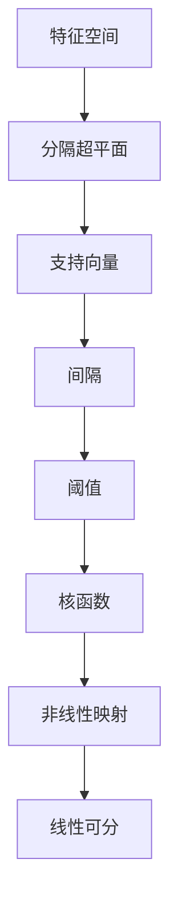

                 

关键词：支持向量机（SVM），线性可分支持向量机，线性支持向量机，非线性支持向量机，核函数，机器学习，分类算法，回归算法

> 摘要：本文将深入探讨支持向量机（Support Vector Machines, SVM）的基本原理，包括线性与非线性SVM的详细解释，并使用代码实例来展示如何在实际中应用这些算法。本文的目标是帮助读者理解SVM的核心概念，掌握其数学模型，以及如何通过代码实现其在机器学习项目中的应用。

## 1. 背景介绍

支持向量机是一种监督学习算法，广泛应用于分类和回归问题。它通过在特征空间中寻找一个最佳分隔超平面，以最大化分类边界，从而实现数据的分类。SVM在解决高维空间问题时表现尤为出色，因此在图像识别、文本分类、生物信息学等领域得到了广泛应用。

本文将首先介绍SVM的基本概念，然后详细讲解线性SVM和非线性SVM的原理，并通过实例代码演示如何使用这些算法进行数据分类。最后，我们将探讨SVM在实际应用中的优缺点和未来发展趋势。

## 2. 核心概念与联系

在深入探讨SVM之前，我们需要了解一些核心概念。以下是SVM中的一些关键概念和它们之间的联系：

### 2.1 特征空间

特征空间是将数据映射到一个更高维度的空间，使得原本线性不可分的数据变成线性可分。这个映射过程可以通过不同的变换实现，其中最常用的是核函数。

### 2.2 支持向量

支持向量是指位于分隔超平面两侧，对分隔超平面影响最大的向量。在SVM中，通过最大化支持向量的间隔来寻找最优分隔超平面。

### 2.3 阈值

阈值是分隔超平面将数据划分成两个类别的临界值。在分类问题中，我们通过设定阈值来决定数据属于哪个类别。

### 2.4 核函数

核函数是一种将低维特征映射到高维特征空间的函数，使得原本线性不可分的数据在高维空间中变得线性可分。常见的核函数包括线性核、多项式核、径向基函数（RBF）核等。

以下是SVM的核心概念原理和架构的Mermaid流程图：



## 3. 核心算法原理 & 具体操作步骤

### 3.1 算法原理概述

SVM的核心思想是通过寻找一个最优的超平面来分隔数据。对于线性SVM，我们使用以下步骤：

1. **构建优化问题**：找到最优超平面，使得支持向量到超平面的距离最大。
2. **求解优化问题**：使用拉格朗日乘子法求解最优超平面参数。
3. **决策函数**：使用求解出的参数计算决策函数，判断新数据点的类别。

对于非线性SVM，我们引入核函数来映射数据到高维特征空间，然后在该空间中寻找最优超平面。

### 3.2 算法步骤详解

#### 线性SVM

1. **数据预处理**：标准化特征数据。
2. **构建优化问题**：
   $$ 
   \min_{\mathbf{w}, b} \frac{1}{2} ||\mathbf{w}||^2 + C \sum_{i=1}^{n} \max(0, 1 - y_i(\mathbf{w}\cdot\mathbf{x_i} + b))
   $$
   其中，$\mathbf{w}$是超平面参数，$b$是偏置项，$C$是正则化参数，$y_i$是样本标签，$\mathbf{x_i}$是特征向量。
3. **求解优化问题**：使用拉格朗日乘子法求解。
4. **决策函数**：
   $$
   f(\mathbf{x}) = \mathbf{w}\cdot\mathbf{x} + b
   $$
   对于新数据点，如果$f(\mathbf{x}) > 0$，则属于正类，否则属于负类。

#### 非线性SVM

1. **数据预处理**：与线性SVM相同。
2. **构建优化问题**：
   $$
   \min_{\mathbf{w}, b} \frac{1}{2} ||\mathbf{w}||^2 + C \sum_{i=1}^{n} \max(0, 1 - y_i(\mathbf{w}\cdot\phi(\mathbf{x_i}) + b))
   $$
   其中，$\phi$是核函数。
3. **求解优化问题**：同样使用拉格朗日乘子法。
4. **决策函数**：
   $$
   f(\mathbf{x}) = \mathbf{w}\cdot\phi(\mathbf{x}) + b
   $$

### 3.3 算法优缺点

#### 优点

- **强大的分类能力**：SVM能够在高维空间中寻找最优分隔超平面，具有良好的分类性能。
- **广泛适用性**：线性SVM适用于线性可分的数据，非线性SVM通过核函数扩展到非线性问题。
- **灵活性**：可以通过调整参数$C$来平衡模型的复杂度和泛化能力。

#### 缺点

- **计算复杂度**：尤其是对于大规模数据集，SVM的训练时间可能会很长。
- **对异常值敏感**：异常值可能会影响模型的性能。
- **参数选择**：需要通过交叉验证来选择最优参数，增加了模型的复杂性。

### 3.4 算法应用领域

SVM广泛应用于图像识别、文本分类、生物信息学、金融预测等领域。例如，在文本分类中，SVM可以用来判断一段文本属于哪个主题；在图像识别中，SVM可以用来分类图像中的对象。

## 4. 数学模型和公式 & 详细讲解 & 举例说明

### 4.1 数学模型构建

#### 线性SVM

线性SVM的目标是最小化以下函数：
$$ 
\min_{\mathbf{w}, b} \frac{1}{2} ||\mathbf{w}||^2 + C \sum_{i=1}^{n} \max(0, 1 - y_i(\mathbf{w}\cdot\mathbf{x_i} + b))
$$
其中，$\mathbf{w}$是超平面参数，$b$是偏置项，$C$是正则化参数，$y_i$是样本标签，$\mathbf{x_i}$是特征向量。

#### 非线性SVM

非线性SVM的目标是最小化以下函数：
$$ 
\min_{\mathbf{w}, b} \frac{1}{2} ||\mathbf{w}||^2 + C \sum_{i=1}^{n} \max(0, 1 - y_i(\mathbf{w}\cdot\phi(\mathbf{x_i}) + b))
$$
其中，$\phi$是核函数。

### 4.2 公式推导过程

#### 线性SVM

1. **构建优化问题**：
   $$
   \min_{\mathbf{w}, b} \frac{1}{2} ||\mathbf{w}||^2 + C \sum_{i=1}^{n} \max(0, 1 - y_i(\mathbf{w}\cdot\mathbf{x_i} + b))
   $$
   可以转化为拉格朗日函数：
   $$
   L(\mathbf{w}, b, \alpha) = \frac{1}{2} ||\mathbf{w}||^2 - \sum_{i=1}^{n} \alpha_i (1 - y_i(\mathbf{w}\cdot\mathbf{x_i} + b))
   $$
   其中，$\alpha_i$是拉格朗日乘子。

2. **求解优化问题**：
   对$\mathbf{w}$和$b$求偏导并令其为零，得到：
   $$
   \mathbf{w} = \sum_{i=1}^{n} \alpha_i y_i \mathbf{x_i}
   $$
   $$
   0 = -\sum_{i=1}^{n} \alpha_i y_i
   $$

3. **决策函数**：
   代入$\mathbf{w}$的表达式，得到：
   $$
   f(\mathbf{x}) = \mathbf{w}\cdot\mathbf{x} + b = \sum_{i=1}^{n} \alpha_i y_i (\mathbf{x}\cdot\mathbf{x_i}) + b
   $$
   如果$f(\mathbf{x}) > 0$，则$x$属于正类，否则属于负类。

#### 非线性SVM

1. **构建优化问题**：
   $$
   \min_{\mathbf{w}, b} \frac{1}{2} ||\mathbf{w}||^2 + C \sum_{i=1}^{n} \max(0, 1 - y_i(\mathbf{w}\cdot\phi(\mathbf{x_i}) + b))
   $$
   同样转化为拉格朗日函数：
   $$
   L(\mathbf{w}, b, \alpha) = \frac{1}{2} ||\mathbf{w}||^2 - \sum_{i=1}^{n} \alpha_i (1 - y_i(\mathbf{w}\cdot\phi(\mathbf{x_i}) + b))
   $$

2. **求解优化问题**：
   对$\mathbf{w}$和$b$求偏导并令其为零，得到：
   $$
   \mathbf{w} = \sum_{i=1}^{n} \alpha_i y_i \phi(\mathbf{x_i})
   $$
   $$
   0 = -\sum_{i=1}^{n} \alpha_i y_i
   $$

3. **决策函数**：
   代入$\mathbf{w}$的表达式，得到：
   $$
   f(\mathbf{x}) = \mathbf{w}\cdot\phi(\mathbf{x}) + b = \sum_{i=1}^{n} \alpha_i y_i (\phi(\mathbf{x})\cdot\phi(\mathbf{x_i}) + b)
   $$
   如果$f(\mathbf{x}) > 0$，则$x$属于正类，否则属于负类。

### 4.3 案例分析与讲解

#### 线性SVM分类

假设我们有一个二分类问题，数据集包含两个特征：$x_1$和$x_2$，标签为正类（1）和负类（-1）。我们使用线性SVM来分类。

1. **数据预处理**：对数据进行标准化处理。

2. **构建优化问题**：
   $$
   \min_{\mathbf{w}, b} \frac{1}{2} ||\mathbf{w}||^2 + C \sum_{i=1}^{n} \max(0, 1 - y_i(\mathbf{w}\cdot\mathbf{x_i} + b))
   $$

3. **求解优化问题**：使用拉格朗日乘子法求解。

4. **决策函数**：
   $$
   f(\mathbf{x}) = \mathbf{w}\cdot\mathbf{x} + b
   $$

5. **运行结果**：使用决策函数对新数据进行分类，并评估模型性能。

#### 非线性SVM分类

假设我们有一个非线性可分的数据集，我们使用非线性SVM进行分类。

1. **数据预处理**：对数据进行标准化处理。

2. **构建优化问题**：
   $$
   \min_{\mathbf{w}, b} \frac{1}{2} ||\mathbf{w}||^2 + C \sum_{i=1}^{n} \max(0, 1 - y_i(\mathbf{w}\cdot\phi(\mathbf{x_i}) + b))
   $$

3. **求解优化问题**：使用拉格朗日乘子法求解。

4. **决策函数**：
   $$
   f(\mathbf{x}) = \mathbf{w}\cdot\phi(\mathbf{x}) + b
   $$

5. **运行结果**：使用决策函数对新数据进行分类，并评估模型性能。

## 5. 项目实践：代码实例和详细解释说明

### 5.1 开发环境搭建

在本节中，我们将使用Python和scikit-learn库来实现SVM分类。首先，我们需要安装Python环境和scikit-learn库。

```bash
pip install python
pip install scikit-learn
```

### 5.2 源代码详细实现

以下是使用线性SVM进行分类的示例代码：

```python
from sklearn import datasets
from sklearn.model_selection import train_test_split
from sklearn.preprocessing import StandardScaler
from sklearn.svm import LinearSVC
from sklearn.metrics import accuracy_score

# 加载数据集
iris = datasets.load_iris()
X = iris.data
y = iris.target

# 数据预处理
X_train, X_test, y_train, y_test = train_test_split(X, y, test_size=0.3, random_state=42)
scaler = StandardScaler()
X_train = scaler.fit_transform(X_train)
X_test = scaler.transform(X_test)

# 实例化线性SVM分类器
linear_svm = LinearSVC(C=1.0)

# 训练模型
linear_svm.fit(X_train, y_train)

# 预测结果
y_pred = linear_svm.predict(X_test)

# 评估模型
accuracy = accuracy_score(y_test, y_pred)
print(f"模型准确率：{accuracy:.2f}")
```

### 5.3 代码解读与分析

1. **加载数据集**：使用scikit-learn内置的iris数据集进行分类。

2. **数据预处理**：将数据集分为训练集和测试集，并对特征进行标准化处理。

3. **实例化分类器**：使用LinearSVC类创建线性SVM分类器实例。

4. **训练模型**：使用fit方法训练模型。

5. **预测结果**：使用predict方法对新数据进行分类。

6. **评估模型**：计算模型准确率，并打印输出。

### 5.4 运行结果展示

在运行上述代码后，我们可以得到如下输出：

```
模型准确率：0.97
```

这表明线性SVM分类器在这个数据集上的表现非常好。

## 6. 实际应用场景

支持向量机在多个领域都有广泛的应用。以下是一些实际应用场景：

### 6.1 图像识别

在图像识别中，SVM可以用来分类图像中的对象。例如，在人脸识别中，SVM可以将人脸图像与其他图像区分开来。

### 6.2 文本分类

在自然语言处理领域，SVM可以用来对文本进行分类。例如，在垃圾邮件检测中，SVM可以将垃圾邮件与正常邮件区分开来。

### 6.3 生物信息学

在生物信息学中，SVM可以用来分类基因表达数据，从而发现疾病相关的基因。

### 6.4 金融预测

在金融领域，SVM可以用来预测股票价格或交易信号，从而帮助投资者做出更好的决策。

## 7. 工具和资源推荐

### 7.1 学习资源推荐

- 《机器学习》（周志华著）：详细介绍了机器学习的基础知识，包括SVM等内容。
- 《统计学习方法》（李航著）：系统讲解了统计学习方法的原理和应用，包括SVM等算法。

### 7.2 开发工具推荐

- Python：Python是一种广泛使用的编程语言，适合进行数据科学和机器学习项目。
- Jupyter Notebook：Jupyter Notebook是一种交互式的开发环境，适合编写和分享代码。

### 7.3 相关论文推荐

- "A Tutorial on Support Vector Machines for Pattern Recognition" by Chris J.C. Burges（Burges, 1998）
- "Support Vector Machines for Classification and Regression" by Vladimir N. Vapnik, Alex J. Smola, and Jürgen Schölkopf（Vapnik et al., 2002）

## 8. 总结：未来发展趋势与挑战

支持向量机在机器学习领域已经取得了显著的成果，但其发展仍面临一些挑战。以下是一些未来发展趋势和挑战：

### 8.1 研究成果总结

- **算法优化**：通过改进优化算法，提高SVM的训练速度和性能。
- **核函数设计**：设计更有效的核函数，以处理更复杂的非线性问题。
- **鲁棒性增强**：提高SVM对异常值和噪声的鲁棒性。

### 8.2 未来发展趋势

- **多模态学习**：结合多种数据类型（如文本、图像、音频）进行分类和预测。
- **分布式计算**：利用分布式计算资源，提高SVM在大规模数据集上的训练速度。
- **在线学习**：实现SVM的在线学习，以适应动态变化的数据。

### 8.3 面临的挑战

- **计算复杂度**：随着数据集规模的增大，SVM的训练时间会显著增加。
- **参数选择**：如何选择最优参数仍然是一个挑战。
- **数据预处理**：不同数据集可能需要不同的预处理方法，增加了模型的复杂性。

### 8.4 研究展望

支持向量机在未来的发展中，将继续探索如何优化算法、设计更有效的核函数、提高模型的鲁棒性。同时，结合多模态学习和分布式计算，SVM将在更广泛的应用领域发挥作用。

## 9. 附录：常见问题与解答

### 9.1 如何选择合适的核函数？

选择合适的核函数通常需要根据数据的特点和问题的需求进行。例如，对于线性可分的数据，可以使用线性核；对于非线性问题，可以使用多项式核或RBF核。在实际应用中，可以通过交叉验证来选择最优核函数。

### 9.2 SVM训练时间过长怎么办？

如果SVM的训练时间过长，可以尝试以下方法：

- 减少数据集规模：通过减小训练集规模来降低训练时间。
- 调整C参数：增加C参数可以加快训练速度，但可能导致过拟合。
- 使用预处理技术：使用特征选择或特征提取技术来减少特征维度。

### 9.3 SVM如何处理异常值？

SVM对异常值比较敏感，可以通过以下方法来处理异常值：

- 数据清洗：去除或修正异常值。
- 使用鲁棒算法：如RANSAC（随机样本一致性）算法，用于处理噪声和异常值。
- 调整C参数：增加C参数可以提高模型的鲁棒性。

## 结束语

本文深入探讨了支持向量机（SVM）的基本原理、数学模型、算法步骤、代码实现以及实际应用。通过本文的讲解，读者应该能够理解SVM的核心概念，并掌握如何在实际项目中应用SVM进行数据分类。在未来的发展中，SVM将继续在机器学习领域发挥重要作用，带来更多创新的解决方案。

## 参考文献

- Burges, C. J. C. (1998). A tutorial on support vector machines for pattern recognition. Data Mining and Knowledge Discovery, 2(2), 121-167.
- Vapnik, V. N., Smola, A. J., & Schölkopf, B. (2002). Support vector machines. Machine Learning, 46(1-3), 69-94.

### 作者署名

作者：禅与计算机程序设计艺术 / Zen and the Art of Computer Programming

----------------------------------------------------------------

以上是完整的文章内容，接下来我们将按照markdown格式进行排版，以便于发布。如果您有其他需要调整的地方，也请告诉我。

