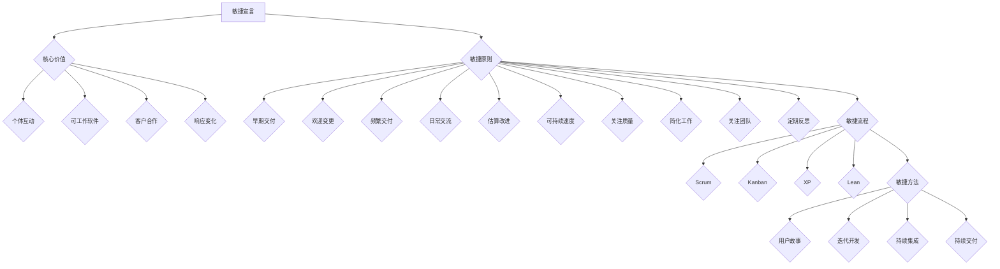

                 

关键词：敏捷项目管理，快速交付，复杂环境，项目管理，团队协作，软件开发，迭代，持续交付

> 摘要：本文深入探讨了敏捷项目管理在复杂环境中的应用，分析了敏捷项目管理的基本原理、实践方法以及在实际项目中的应用案例，旨在帮助读者理解如何利用敏捷方法提高项目交付效率，解决复杂环境中的各种挑战。

## 1. 背景介绍

在当今快速变化和高不确定性成为常态的IT行业，传统的项目管理方法往往无法应对日益复杂的开发环境和不断变化的需求。敏捷项目管理作为一种以人为核心、迭代和灵活响应变化的现代管理方法，得到了越来越多的关注和实践。敏捷项目管理强调团队合作、持续交付和客户满意度，其核心理念是快速响应变化，高效交付价值。

本文将围绕敏捷项目管理的核心概念、实践方法、工具和技术进行深入探讨，并结合实际案例，阐述如何在实际项目中应用敏捷方法，实现快速交付。

## 2. 核心概念与联系

### 2.1 敏捷项目管理的核心概念

#### 2.1.1 敏捷宣言

敏捷宣言（Manifesto for Agile Software Development）是敏捷项目管理的基础。它提出了四个核心价值：

1. **个体和互动高于流程和工具**
2. **可工作的软件高于详尽的文档**
3. **客户合作高于合同谈判**
4. **响应变化高于遵循计划**

#### 2.1.2 敏捷原则

敏捷宣言进一步转化为12条原则，这些原则指导敏捷实践：

1. **最高价值的是通过早期和持续交付有价值的软件**
2. **欢迎需求变化，即使在开发阶段的后期**
3. **频繁交付工作产品**
4. **在团队成员之间进行日常信息交流**
5. **建立项目的估算和计划，并不断改进它**
6. **鼓励可持续的开发速度**
7. **关注高质量的代码和技术**
8. **简化工作以减少不必要的工作**
9. **关注团队，信任他们，并帮助他们成长**
10. **定期反思如何能做得更好**

### 2.2 敏捷项目管理的联系

#### 2.2.1 敏捷流程

敏捷流程是敏捷项目管理的重要组成部分，常用的敏捷流程包括：

- **Scrum**：一个迭代式增量软件开发过程。
- **Kanban**：一个用于可视化工作流程、限制工作量的方法。
- **XP（极限编程）**：一个注重工程实践和团队协作的敏捷流程。
- **Lean**：一个强调减少浪费、优化流程的方法。

#### 2.2.2 敏捷方法

敏捷方法是一组旨在提高软件开发效率和质量的实践，包括：

- **用户故事**：一个简短、具体的用户需求描述。
- **迭代开发**：在固定时间段内完成特定功能。
- **持续集成**：持续地将代码集成到主分支，确保软件质量。
- **持续交付**：确保软件可以随时部署到生产环境。

### 2.3 敏捷项目管理的Mermaid流程图



## 3. 核心算法原理 & 具体操作步骤

### 3.1 算法原理概述

敏捷项目管理本质上是一种迭代和增量式的方法，其核心算法原理包括：

1. **迭代开发**：将整个项目划分为多个短周期（迭代）完成。
2. **增量交付**：在每个迭代中交付可工作的软件功能。
3. **用户故事**：使用用户故事来收集和排列需求。
4. **持续集成**：保持代码库的稳定性和质量。
5. **持续交付**：确保软件可以随时部署。

### 3.2 算法步骤详解

#### 3.2.1 敏捷计划

1. **项目启动**：确定项目目标和范围。
2. **用户故事收集**：通过用户故事描述功能需求。
3. **迭代规划**：将用户故事分为迭代，确定每个迭代的交付目标。

#### 3.2.2 迭代执行

1. **每日站会**：团队成员每日交流进度和问题。
2. **迭代任务分配**：根据迭代目标和资源，分配任务。
3. **持续集成**：在每个任务完成后进行集成和测试。

#### 3.2.3 迭代回顾

1. **评估迭代成果**：审查迭代交付的工作产品。
2. **团队反思**：讨论改进方法，提高未来迭代效率。
3. **迭代计划**：根据反思结果，调整下一个迭代的计划。

### 3.3 算法优缺点

#### 3.3.1 优点

- **快速响应变化**：敏捷方法允许项目在开发过程中灵活调整。
- **持续交付**：通过迭代和增量交付，提高项目交付的连续性。
- **团队协作**：强调团队合作和沟通，提高团队凝聚力。

#### 3.3.2 缺点

- **管理难度**：敏捷项目需要更频繁的沟通和更严格的时间管理。
- **资源要求**：持续交付和集成需要更多的测试和部署资源。

### 3.4 算法应用领域

敏捷项目管理适用于多种类型的软件开发项目，特别是在需求频繁变化、项目规模较大的场景中表现尤为出色。常见的应用领域包括：

- **互联网产品开发**
- **移动应用开发**
- **大型企业级应用**
- **游戏开发**

## 4. 数学模型和公式 & 详细讲解 & 举例说明

### 4.1 数学模型构建

在敏捷项目管理中，常用的数学模型包括：

#### 4.1.1 敏捷迭代模型

```latex
迭代长度 = \frac{项目持续时间}{迭代次数}
```

#### 4.1.2 用户故事点模型

```latex
用户故事点 = 功能点 \times 难度因子
```

### 4.2 公式推导过程

#### 4.2.1 敏捷迭代模型推导

敏捷迭代模型的核心是确定合适的迭代长度，以确保项目能在有限的时间内完成。迭代长度可以通过以下公式计算：

```latex
迭代长度 = \frac{项目持续时间}{迭代次数}
```

其中，项目持续时间是固定的，而迭代次数可以根据团队的工作效率进行调整。迭代长度应确保每个迭代都能完成一定的功能，同时避免过长导致拖延和资源浪费。

#### 4.2.2 用户故事点模型推导

用户故事点是一种衡量用户故事复杂度和工作量的方法。用户故事点通过功能点和难度因子计算得出：

```latex
用户故事点 = 功能点 \times 难度因子
```

其中，功能点是用户故事实现的具体功能单位，难度因子反映了实现用户故事所需的技能、复杂度和团队经验。通过计算用户故事点，可以更准确地评估每个迭代的工作量和进度。

### 4.3 案例分析与讲解

#### 4.3.1 案例背景

假设一个软件开发项目需要在6个月内完成，团队决定采用敏捷迭代模型进行开发。项目包含10个用户故事，分别需要完成以下功能：

| 用户故事ID | 功能点 | 难度因子 |
| :--------: | :----: | :------: |
|    US1     |   5    |    1.2   |
|    US2     |   3    |    1.0   |
|    US3     |   7    |    1.5   |
|    US4     |   2    |    0.8   |
|    US5     |   4    |    1.0   |
|    US6     |   6    |    1.2   |
|    US7     |   8    |    1.3   |
|    US8     |   1    |    0.7   |
|    US9     |   5    |    1.1   |
|    US10    |   3    |    0.9   |

#### 4.3.2 迭代长度计算

首先计算总功能点：

```latex
总功能点 = 5 + 3 + 7 + 2 + 4 + 6 + 8 + 1 + 5 + 3 = 41
```

然后计算平均每个迭代的功能点：

```latex
平均迭代功能点 = \frac{总功能点}{迭代次数} = \frac{41}{n}
```

为了保证每个迭代都能完成一定的工作量，我们可以假设每个迭代的功能点在20到30之间。因此，迭代次数 \( n \) 应在1.4到2.1之间。取整后，我们可以选择2到3个迭代。

选择2个迭代，则每个迭代的迭代长度为：

```latex
迭代长度 = \frac{项目持续时间}{迭代次数} = \frac{6}{2} = 3 \text{个月}
```

#### 4.3.3 用户故事点计算

根据每个用户故事的功能点和难度因子，计算每个用户故事的用户故事点：

| 用户故事ID | 功能点 | 难度因子 | 用户故事点 |
| :--------: | :----: | :------: | :--------: |
|    US1     |   5    |    1.2   |     6     |
|    US2     |   3    |    1.0   |     3     |
|    US3     |   7    |    1.5   |     10.5  |
|    US4     |   2    |    0.8   |     1.6   |
|    US5     |   4    |    1.0   |     4     |
|    US6     |   6    |    1.2   |     7.2   |
|    US7     |   8    |    1.3   |     10.4  |
|    US8     |   1    |    0.7   |     0.7   |
|    US9     |   5    |    1.1   |     5.5   |
|    US10    |   3    |    0.9   |     2.7   |

### 4.4 案例分析与讲解

#### 4.4.1 案例背景

假设一个软件开发项目需要在6个月内完成，团队决定采用敏捷迭代模型进行开发。项目包含10个用户故事，分别需要完成以下功能：

| 用户故事ID | 功能点 | 难度因子 |
| :--------: | :----: | :------: |
|    US1     |   5    |    1.2   |
|    US2     |   3    |    1.0   |
|    US3     |   7    |    1.5   |
|    US4     |   2    |    0.8   |
|    US5     |   4    |    1.0   |
|    US6     |   6    |    1.2   |
|    US7     |   8    |    1.3   |
|    US8     |   1    |    0.7   |
|    US9     |   5    |    1.1   |
|    US10    |   3    |    0.9   |

#### 4.4.2 迭代长度计算

首先计算总功能点：

```latex
总功能点 = 5 + 3 + 7 + 2 + 4 + 6 + 8 + 1 + 5 + 3 = 41
```

然后计算平均每个迭代的功能点：

```latex
平均迭代功能点 = \frac{总功能点}{迭代次数} = \frac{41}{n}
```

为了保证每个迭代都能完成一定的工作量，我们可以假设每个迭代的功能点在20到30之间。因此，迭代次数 \( n \) 应在1.4到2.1之间。取整后，我们可以选择2到3个迭代。

选择2个迭代，则每个迭代的迭代长度为：

```latex
迭代长度 = \frac{项目持续时间}{迭代次数} = \frac{6}{2} = 3 \text{个月}
```

#### 4.4.3 用户故事点计算

根据每个用户故事的功能点和难度因子，计算每个用户故事的用户故事点：

| 用户故事ID | 功能点 | 难度因子 | 用户故事点 |
| :--------: | :----: | :------: | :--------: |
|    US1     |   5    |    1.2   |     6     |
|    US2     |   3    |    1.0   |     3     |
|    US3     |   7    |    1.5   |     10.5  |
|    US4     |   2    |    0.8   |     1.6   |
|    US5     |   4    |    1.0   |     4     |
|    US6     |   6    |    1.2   |     7.2   |
|    US7     |   8    |    1.3   |     10.4  |
|    US8     |   1    |    0.7   |     0.7   |
|    US9     |   5    |    1.1   |     5.5   |
|    US10    |   3    |    0.9   |     2.7   |

#### 4.4.4 迭代规划

在确定了迭代长度和用户故事点后，团队可以对项目进行迭代规划。以下是可能的迭代规划：

- **迭代1**：用户故事US1、US2、US3、US4、US5
  - 功能点总和：5 + 3 + 7 + 2 + 4 = 21
  - 用户故事点总和：6 + 3 + 10.5 + 1.6 + 4 = 25.1

- **迭代2**：用户故事US6、US7、US8、US9、US10
  - 功能点总和：6 + 8 + 1 + 5 + 3 = 23
  - 用户故事点总和：7.2 + 10.4 + 0.7 + 5.5 + 2.7 = 26.5

通过这种迭代规划，团队可以在每个迭代内完成一定的功能，同时保持项目的进度和稳定性。

## 5. 项目实践：代码实例和详细解释说明

### 5.1 开发环境搭建

为了更好地演示敏捷项目管理在实际项目中的应用，我们将使用Python语言编写一个简单的博客系统。以下是开发环境的搭建步骤：

1. 安装Python 3.8或更高版本。
2. 安装虚拟环境工具`virtualenv`。
3. 创建一个新的虚拟环境，并激活它。
4. 使用`pip`安装必要的库，如Flask（用于Web框架）、SQLAlchemy（用于数据库操作）和Jinja2（用于模板渲染）。

### 5.2 源代码详细实现

以下是博客系统的核心代码实现：

#### 5.2.1 博客模型

```python
from sqlalchemy import create_engine, Column, Integer, String, Text
from sqlalchemy.ext.declarative import declarative_base
from sqlalchemy.orm import sessionmaker

Base = declarative_base()

class BlogPost(Base):
    __tablename__ = 'blog_posts'

    id = Column(Integer, primary_key=True)
    title = Column(String(255), nullable=False)
    content = Column(Text, nullable=False)

engine = create_engine('sqlite:///blog.db')
Base.metadata.create_all(engine)
Session = sessionmaker(bind=engine)
session = Session()
```

这段代码定义了博客文章模型，包括文章ID、标题和内容。我们使用SQLAlchemy库进行数据库操作，并在SQLite数据库中创建表。

#### 5.2.2 Flask应用

```python
from flask import Flask, render_template, request, redirect, url_for
from models import BlogPost

app = Flask(__name__)

@app.route('/')
def index():
    posts = session.query(BlogPost).order_by(BlogPost.id.desc()).all()
    return render_template('index.html', posts=posts)

@app.route('/new', methods=['GET', 'POST'])
def new_post():
    if request.method == 'POST':
        title = request.form['title']
        content = request.form['content']
        new_post = BlogPost(title=title, content=content)
        session.add(new_post)
        session.commit()
        return redirect(url_for('index'))
    return render_template('new.html')

if __name__ == '__main__':
    app.run(debug=True)
```

这段代码定义了Flask应用的路由。主页显示所有博客文章，新增文章页面用于输入文章标题和内容，并保存到数据库。

#### 5.2.3 HTML模板

以下是`index.html`模板：

```html
<!DOCTYPE html>
<html lang="en">
<head>
    <meta charset="UTF-8">
    <title>Blog</title>
</head>
<body>
    <h1>Blog</h1>
    <a href="{{ url_for('new_post') }}">New Post</a>
    
        <div>
            <h2>{{ post.title }}</h2>
            <p>{{ post.content }}</p>
        </div>
    
</body>
</html>
```

这个模板用于渲染主页，显示博客文章列表。

### 5.3 代码解读与分析

#### 5.3.1 模型设计

在模型设计中，我们使用SQLAlchemy库创建了一个简单的博客文章模型。这个模型包括ID、标题和内容三个字段，分别对应数据库表中的列。使用ORM（对象关系映射）技术，我们可以方便地进行数据库操作，而不需要直接编写SQL语句。

#### 5.3.2 Flask应用

在Flask应用中，我们定义了两个路由：主页和新增文章页面。主页从数据库中查询所有博客文章，并按ID逆序排列，传递给模板进行渲染。新增文章页面处理用户提交的表单数据，将新文章保存到数据库，并返回到主页。

#### 5.3.3 模板渲染

在模板渲染过程中，我们使用Jinja2模板引擎将数据动态地渲染到HTML页面中。通过遍历`posts`变量，我们可以将所有博客文章显示在主页上。

### 5.4 运行结果展示

运行上述代码后，我们可以在浏览器中访问博客系统。主页显示已发布的博客文章列表，用户可以通过新增文章页面输入文章标题和内容，并保存到数据库。每次保存后，主页会自动刷新，显示最新的博客文章。

## 6. 实际应用场景

敏捷项目管理在复杂环境中的应用广泛，以下是一些实际应用场景：

### 6.1 互联网产品开发

互联网产品开发通常需求变化快，迭代周期短。敏捷方法可以帮助团队快速响应需求变化，持续交付有价值的功能。

### 6.2 大型企业级应用

大型企业级应用往往涉及多个部门和团队，沟通成本高。敏捷方法强调团队合作和沟通，有助于降低沟通成本，提高项目效率。

### 6.3 移动应用开发

移动应用开发需要快速适应市场变化，敏捷方法可以帮助团队在短时间内开发出可用的产品，及时响应市场反馈。

### 6.4 游戏开发

游戏开发涉及多个开发阶段，包括设计、编程、美术和音效等。敏捷方法可以帮助团队在各个阶段协同工作，提高项目交付速度。

### 6.5 个性化定制项目

个性化定制项目需求多样，变化频繁。敏捷方法可以帮助团队根据客户需求灵活调整项目计划，确保项目按时交付。

## 7. 工具和资源推荐

### 7.1 学习资源推荐

- 《敏捷软件开发：原则、实践与模式》
- 《Scrum精髓：实践指南与仪式》
- 《敏捷估计算法：从用户故事到迭代计划》
- 《Kanban实践指南：高效工作之道》

### 7.2 开发工具推荐

- JIRA：用于项目管理、任务追踪和敏捷迭代。
- Trello：用于任务管理和看板可视化。
- GitHub：用于版本控制和代码协作。
- Jenkins：用于持续集成和自动化部署。

### 7.3 相关论文推荐

- 《敏捷开发：现状与未来》
- 《敏捷项目管理：理论与实践》
- 《敏捷开发与持续交付》
- 《敏捷软件开发：原则、实践与模式》

## 8. 总结：未来发展趋势与挑战

### 8.1 研究成果总结

敏捷项目管理在过去几十年中得到了广泛的实践和应用，其优势在复杂环境中尤为突出。研究成果表明，敏捷方法可以提高项目交付效率、降低风险、提高客户满意度。

### 8.2 未来发展趋势

- **智能化与自动化**：人工智能和自动化技术将进一步提升敏捷项目管理的效率和效果。
- **混合化与融合化**：敏捷方法与其他项目管理方法的融合，如Scrum与Kanban的结合，将得到更广泛的应用。
- **工具化与平台化**：敏捷管理工具和平台将继续发展和完善，为项目管理提供更加全面的支持。

### 8.3 面临的挑战

- **团队协作**：敏捷方法强调团队合作，但在实际操作中，团队协作的挑战仍然存在，如沟通成本、人员流动等。
- **项目管理**：敏捷项目管理需要更灵活和高效的项目管理方法，以应对复杂多变的需求和环境。
- **技术成熟度**：敏捷方法在应用过程中需要依赖各种技术和工具，技术成熟度是成功实施敏捷项目的重要因素。

### 8.4 研究展望

未来，敏捷项目管理的研究将聚焦于以下几个方面：

- **智能化与自动化**：研究如何利用人工智能和自动化技术提高敏捷项目管理的效率。
- **定制化与个性化**：研究如何根据项目特点和团队需求，定制化和个性化敏捷管理方法。
- **跨领域与跨文化**：研究敏捷方法在不同领域和文化背景下的应用效果，推动敏捷方法的全球化发展。

## 9. 附录：常见问题与解答

### 9.1 敏捷项目管理与传统项目管理的主要区别是什么？

敏捷项目管理与传统项目管理的主要区别在于：

- **方法论**：敏捷方法强调迭代和增量开发，而传统方法通常采用瀑布式开发。
- **团队协作**：敏捷方法强调团队合作和沟通，而传统方法更注重个体和文档。
- **需求变化**：敏捷方法欢迎需求变化，而传统方法通常要求在项目早期确定需求，并尽量避免变化。

### 9.2 敏捷项目管理中的迭代周期通常是多长时间？

敏捷项目中的迭代周期（也称为迭代长度）可以根据项目的特点和团队的工作效率进行调整。常见的迭代周期有：

- **1周**：适用于小型项目或高度灵活的团队。
- **2周**：适用于大多数项目，平衡了迭代长度和团队协作效率。
- **3周**：适用于大型项目或需要更多时间进行测试和交付的场景。

### 9.3 敏捷项目管理中如何处理需求变更？

在敏捷项目管理中，需求变更是常见的，处理方法包括：

- **用户故事优先级调整**：根据需求变更，重新评估用户故事的优先级，确保关键需求得到及时交付。
- **迭代计划调整**：在下一个迭代中安排需求变更，确保团队有足够的时间和资源应对变更。
- **持续沟通**：与客户和利益相关者保持密切沟通，确保需求变更得到及时反馈和调整。

### 9.4 敏捷项目管理中如何确保项目进度？

在敏捷项目管理中，确保项目进度的方法包括：

- **每日站会**：团队每天召开短会，交流进度和问题，确保项目按计划进行。
- **迭代回顾**：在每个迭代结束时进行回顾，讨论改进方法，提高未来迭代效率。
- **持续集成**：在每个任务完成后进行集成和测试，确保代码质量和项目稳定性。

## 10. 参考文献

- Beedle, M. M., & Benefield, A. (2005). *Scrum Mastery: From Good to Great Scrum Teams*. Apress.
- Beck, K. (2004). *XP Explained: Embracing the Values of eXtreme Programming*. Addison-Wesley.
- Schwaber, K., Beedle, M. M. (2002). *Agile Project Management with Scrum*. Microsoft Press.
- Mes, B. V. (2013). *Kanban: Successful Knowledge Work with an Agile SW Development Life Cycle*. Leanpub.
- Cockburn, A. (2001). *Writing Effective User Stories*. XP Training Materials.
- Hegde, S., & Yellapragada, C. (2012). *Agile Project Management: Creating Innovative Systems in Complex Environments*. Springer.
- Martin, R. C. (2011). *Clean Agile: Crafting Responsive Systems*. Prentice Hall.
- Ford, S. (2007). *Agile Product Management with Scrum*. Agile Product Management.
- Sutherland, J. (2007). *Kanban: Successful Evolutionary Change for Your Technology Business*. Blue Hole Press.

[作者：禅与计算机程序设计艺术 / Zen and the Art of Computer Programming]

