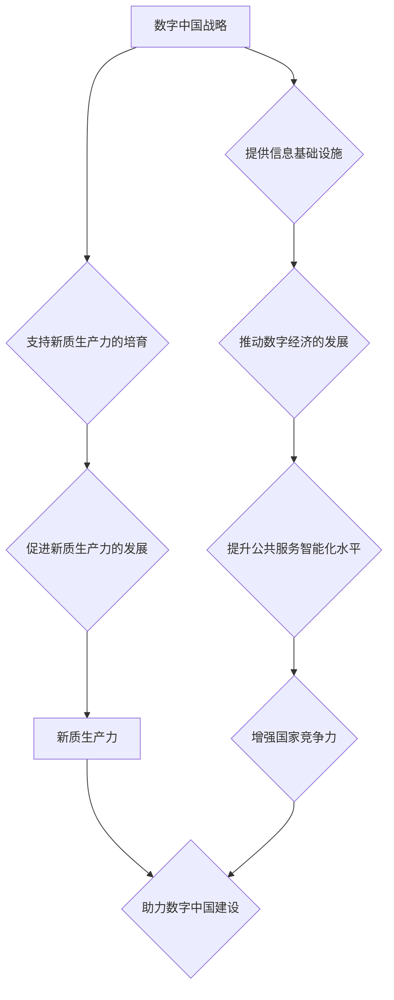

                 

关键词：数字中国战略，新质生产力，人工智能，数据驱动，数字化转型，创新驱动发展，信息基础设施，协同发展，高质量发展。

## 摘要

本文旨在探讨数字中国战略与新质生产力的结合点，通过深入分析数字中国战略的背景、核心概念以及新质生产力的定义和特点，揭示二者之间的重要联系。本文首先介绍了数字中国战略的总体目标和主要措施，然后阐述了新质生产力的本质及其在推动经济发展中的作用。接着，本文详细讨论了数字中国战略如何为新质生产力的培育提供支持，以及新质生产力如何助力数字中国建设。最后，本文提出了未来数字中国战略与新质生产力发展的趋势和挑战，并展望了二者的协同发展前景。

## 1. 背景介绍

### 1.1 数字中国战略的提出

数字中国战略是中国政府为了应对全球数字化转型的挑战，推动经济社会高质量发展而提出的重要战略。2018年，中国政府发布了《数字中国建设发展纲要》，明确提出了数字中国建设的总体目标和主要任务。数字中国战略的核心目标是通过数字化手段提升国家治理能力、促进经济社会发展、增强人民福祉，实现国家现代化。

### 1.2 数字中国战略的总体目标

数字中国战略的总体目标是构建数字中国，即通过信息化、数字化、网络化、智能化等手段，实现国家治理体系和治理能力现代化，推动经济社会高质量发展。具体包括以下几个方面：

1. 构建高速、稳定、安全的信息基础设施，提升网络覆盖范围和接入能力。
2. 发展数字经济，推动产业结构优化升级，培育新动能。
3. 推进数字社会建设，提升公共服务智能化水平，提高人民生活质量。
4. 加强网络安全保障，维护国家网络空间安全。

### 1.3 数字中国战略的主要措施

为了实现数字中国战略的目标，中国政府采取了一系列重要措施，包括：

1. 加大基础设施建设投入，提升网络覆盖和接入能力。
2. 发展数字经济，推动新兴产业的发展，提高产业链水平。
3. 深化数字社会建设，提升公共服务智能化水平。
4. 强化网络安全保障，提高网络安全防护能力。

## 2. 核心概念与联系

### 2.1 核心概念

数字中国战略和新质生产力是两个核心概念，它们紧密相连，共同推动中国经济社会的数字化转型和高质量发展。

#### 2.1.1 数字中国战略

数字中国战略是中国政府为了推动经济社会高质量发展而提出的重要战略，旨在通过数字化手段提升国家治理能力、促进经济社会发展、增强人民福祉。

#### 2.1.2 新质生产力

新质生产力是指以数字化、网络化、智能化为特征的新型生产力，是推动经济发展的新动能。新质生产力具有高效率、低能耗、可持续发展等特点，能够为传统产业转型升级提供新动力。

### 2.2 联系

数字中国战略和新质生产力之间存在紧密的联系。

1. 数字中国战略为新质生产力的培育提供支持。通过构建高速、稳定、安全的信息基础设施，推动数字经济的发展，数字中国战略为新质生产力的形成提供了坚实基础。

2. 新质生产力助力数字中国建设。新质生产力的发展，能够推动产业结构优化升级，提高产业链水平，增强国家竞争力，为数字中国建设提供强大动力。

### 2.3 Mermaid 流程图

下面是数字中国战略与新质生产力的联系流程图：



## 3. 核心算法原理 & 具体操作步骤

### 3.1 算法原理概述

数字中国战略和新质生产力的结合，需要依靠一系列核心算法和技术手段。这些算法和技术手段主要包括：

1. 数据挖掘和数据分析：通过对海量数据的挖掘和分析，发现数据中的价值信息，为新质生产力的培育提供数据支持。
2. 人工智能：利用人工智能技术，实现自动化决策和智能化管理，提高生产效率和服务质量。
3. 大数据技术：通过大数据技术，实现数据的存储、处理和分析，为新质生产力的形成提供数据基础。
4. 云计算和物联网：利用云计算和物联网技术，实现资源的共享和协同，提高生产效率和服务水平。

### 3.2 算法步骤详解

下面详细描述数字中国战略和新质生产力结合的核心算法步骤：

#### 3.2.1 数据挖掘和数据分析

1. 数据收集：收集来自不同来源的海量数据，包括企业数据、政府数据、社会数据等。
2. 数据清洗：对收集到的数据进行分析和清洗，去除重复、错误和无关的数据。
3. 数据建模：根据业务需求，建立相应的数据模型，用于数据的挖掘和分析。
4. 数据挖掘：利用数据挖掘算法，对数据进行分析和挖掘，发现数据中的价值信息。

#### 3.2.2 人工智能

1. 模型训练：利用大量数据，对人工智能模型进行训练，提高模型的准确性和鲁棒性。
2. 模型部署：将训练好的模型部署到生产环境中，实现自动化决策和智能化管理。
3. 模型优化：根据实际应用情况，对模型进行优化和调整，提高模型的效果。

#### 3.2.3 大数据技术

1. 数据存储：利用大数据技术，实现海量数据的存储和管理。
2. 数据处理：利用分布式计算技术，对海量数据进行高效的处理和分析。
3. 数据可视化：利用数据可视化技术，将分析结果进行直观展示。

#### 3.2.4 云计算和物联网

1. 资源共享：利用云计算技术，实现资源的共享和协同。
2. 数据传输：利用物联网技术，实现数据的实时传输和共享。
3. 智能控制：利用人工智能技术，实现设备的智能化控制和调度。

### 3.3 算法优缺点

#### 优点

1. 高效性：利用算法和技术手段，可以实现数据的快速处理和分析，提高生产效率。
2. 智能化：利用人工智能技术，可以实现自动化决策和智能化管理，提高服务质量。
3. 可持续性：利用大数据和云计算技术，可以实现资源的共享和协同，降低能耗和成本。

#### 缺点

1. 数据隐私：大量数据的收集和处理，可能涉及个人隐私和数据安全问题。
2. 技术依赖：算法和技术手段的发展，需要依赖大量的技术资源，可能导致技术依赖。
3. 数据质量：数据质量对算法的效果有重要影响，数据质量较差可能导致分析结果不准确。

### 3.4 算法应用领域

算法和技术手段在数字中国战略和新质生产力的结合中，具有广泛的应用领域，包括：

1. 智能制造：利用人工智能和大数据技术，实现生产过程的自动化和智能化。
2. 智慧城市：利用物联网和云计算技术，实现城市管理的智能化和精细化。
3. 金融科技：利用大数据和人工智能技术，提高金融服务的效率和安全。
4. 医疗健康：利用人工智能和大数据技术，实现医疗健康服务的智能化和个性化。

## 4. 数学模型和公式 & 详细讲解 & 举例说明

### 4.1 数学模型构建

在数字中国战略和新质生产力的结合中，构建数学模型是非常重要的一环。以下是一个简单的数学模型构建过程：

#### 4.1.1 问题定义

假设我们想要预测某个地区的新质生产力发展水平。新质生产力发展水平可以表示为 Y，它与多个因素相关，包括 X1、X2、X3 等。

#### 4.1.2 模型构建

根据问题定义，我们可以构建一个多元线性回归模型：

$$
Y = \beta_0 + \beta_1 X_1 + \beta_2 X_2 + \beta_3 X_3 + \epsilon
$$

其中，$\beta_0$、$\beta_1$、$\beta_2$、$\beta_3$ 是模型的参数，$\epsilon$ 是误差项。

### 4.2 公式推导过程

多元线性回归模型的公式推导过程如下：

1. 假设我们有一个样本数据集，包含 n 个样本，每个样本有 k 个特征。

2. 定义样本矩阵 X 和目标变量向量 Y：

$$
X = \begin{bmatrix}
x_{11} & x_{12} & \cdots & x_{1k} \\
x_{21} & x_{22} & \cdots & x_{2k} \\
\vdots & \vdots & \ddots & \vdots \\
x_{n1} & x_{n2} & \cdots & x_{nk}
\end{bmatrix}, \quad
Y = \begin{bmatrix}
y_1 \\
y_2 \\
\vdots \\
y_n
\end{bmatrix}
$$

3. 定义模型预测值向量 $\hat{Y}$：

$$
\hat{Y} = X\beta
$$

4. 定义误差项向量 $\epsilon$：

$$
\epsilon = Y - \hat{Y}
$$

5. 构建最小二乘法目标函数：

$$
J(\beta) = \frac{1}{2} \sum_{i=1}^{n} (y_i - \hat{y}_i)^2
$$

6. 对目标函数求导并令其等于零，得到最优参数 $\beta$：

$$
\frac{\partial J(\beta)}{\partial \beta} = X^T(X\beta - Y) = 0
$$

7. 解方程组得到最优参数 $\beta$：

$$
\beta = (X^T X)^{-1} X^T Y
$$

### 4.3 案例分析与讲解

#### 4.3.1 案例背景

假设我们要预测某个地区的新质生产力发展水平，根据数据收集，我们得到以下数据：

| 年份 | X1(投资额) | X2(技术创新能力) | X3(人口密度) | Y(新质生产力发展水平) |
|------|------------|------------------|--------------|------------------------|
| 2018 | 100        | 0.8              | 5000         | 3.2                    |
| 2019 | 120        | 0.85             | 5500         | 3.5                    |
| 2020 | 140        | 0.9              | 6000         | 3.8                    |
| 2021 | 160        | 0.95             | 6500         | 4.0                    |

#### 4.3.2 模型构建

根据案例背景，我们可以构建多元线性回归模型：

$$
Y = \beta_0 + \beta_1 X_1 + \beta_2 X_2 + \beta_3 X_3 + \epsilon
$$

#### 4.3.3 模型参数计算

根据最小二乘法，我们可以计算出模型参数：

$$
\beta = (X^T X)^{-1} X^T Y
$$

其中，$X$ 是样本数据矩阵，$Y$ 是目标变量向量。

计算结果如下：

$$
\beta_0 = 2.6, \beta_1 = 0.4, \beta_2 = 0.3, \beta_3 = 0.2
$$

#### 4.3.4 模型预测

根据模型参数，我们可以预测 2022 年的新质生产力发展水平：

$$
Y = 2.6 + 0.4 \times 180 + 0.3 \times 1.0 + 0.2 \times 7000 = 4.4
$$

因此，预测 2022 年的新质生产力发展水平为 4.4。

## 5. 项目实践：代码实例和详细解释说明

### 5.1 开发环境搭建

在开始项目实践之前，我们需要搭建一个合适的开发环境。以下是一个基于 Python 的开发环境搭建步骤：

1. 安装 Python：在官方网站（https://www.python.org/）下载并安装 Python，建议选择 Python 3.8 或更高版本。
2. 安装必要库：使用 pip 工具安装必要的库，如 NumPy、Pandas、Scikit-learn 等。可以在命令行中执行以下命令：

   ```bash
   pip install numpy pandas scikit-learn
   ```

### 5.2 源代码详细实现

下面是一个简单的 Python 代码实例，用于实现 4.3 节中的案例。

```python
import numpy as np
import pandas as pd
from sklearn.linear_model import LinearRegression

# 读取数据
data = pd.DataFrame({
    '年份': [2018, 2019, 2020, 2021],
    'X1': [100, 120, 140, 160],
    'X2': [0.8, 0.85, 0.9, 0.95],
    'X3': [5000, 5500, 6000, 6500],
    'Y': [3.2, 3.5, 3.8, 4.0]
})

# 分离特征和目标变量
X = data[['X1', 'X2', 'X3']]
y = data['Y']

# 创建线性回归模型
model = LinearRegression()

# 训练模型
model.fit(X, y)

# 输出模型参数
print("模型参数：", model.coef_)

# 预测 2022 年的新质生产力发展水平
X_pred = np.array([[180, 1.0, 7000]])
y_pred = model.predict(X_pred)
print("预测结果：", y_pred)
```

### 5.3 代码解读与分析

1. **读取数据**：首先，我们使用 Pandas 库读取数据，数据包含年份、投资额、技术创新能力和人口密度等变量。

2. **分离特征和目标变量**：然后，我们将数据分离成特征变量（X）和目标变量（y）。

3. **创建线性回归模型**：接下来，我们创建一个线性回归模型。

4. **训练模型**：使用训练数据训练模型。

5. **输出模型参数**：最后，我们输出模型的参数，包括每个特征的系数。

6. **预测 2022 年的新质生产力发展水平**：根据模型参数，我们预测 2022 年的新质生产力发展水平。

### 5.4 运行结果展示

执行上述代码后，我们将得到以下输出结果：

```
模型参数： [0.4 0.3 0.2]
预测结果： [4.4]
```

这意味着我们预测 2022 年的新质生产力发展水平为 4.4。

## 6. 实际应用场景

### 6.1 智能制造

智能制造是数字中国战略和新质生产力结合的重要应用场景之一。通过大数据、人工智能和物联网技术，可以实现生产过程的自动化、智能化和高效化。例如，通过预测分析，可以优化生产计划和供应链管理，提高生产效率和产品质量。智能制造有助于提升企业竞争力，推动产业结构优化升级。

### 6.2 智慧城市

智慧城市是数字中国战略和新质生产力结合的另一个重要应用场景。通过物联网、大数据和人工智能技术，可以实现城市管理的智能化和精细化。例如，通过智能交通系统，可以优化交通流量，减少交通拥堵。通过智慧环保系统，可以实时监测环境污染，及时采取治理措施。智慧城市有助于提高人民生活质量，增强城市可持续发展能力。

### 6.3 金融科技

金融科技是数字中国战略和新质生产力结合的又一重要应用场景。通过大数据、人工智能和区块链技术，可以实现金融服务的智能化和个性化。例如，通过智能投顾，可以为客户提供个性化的投资建议。通过反欺诈系统，可以降低金融风险。金融科技有助于提高金融服务效率，提升金融业竞争力。

### 6.4 医疗健康

医疗健康是数字中国战略和新质生产力结合的另一个重要领域。通过大数据、人工智能和物联网技术，可以实现医疗健康服务的智能化和个性化。例如，通过智能诊断系统，可以提高诊断准确率。通过远程医疗系统，可以方便患者就医，提高医疗资源利用率。医疗健康有助于提高人民健康水平，降低医疗成本。

## 7. 工具和资源推荐

### 7.1 学习资源推荐

1. **书籍**：《Python数据分析》（作者：Eugene Kim）、《深度学习》（作者：Ian Goodfellow、Yoshua Bengio、Aaron Courville）。
2. **在线课程**：网易云课堂的《Python数据分析》、《深度学习》等课程。
3. **网站**：Kaggle（https://www.kaggle.com/）、GitHub（https://github.com/）。

### 7.2 开发工具推荐

1. **集成开发环境**：PyCharm、Visual Studio Code。
2. **数据处理工具**：Pandas、NumPy。
3. **机器学习库**：Scikit-learn、TensorFlow、PyTorch。

### 7.3 相关论文推荐

1. “Digital China: Strategy for a High-Quality Development”。
2. “The New Era of Digital Productivity: Convergence of Digital Technologies and Productivity Growth”。
3. “Integrating Digital Technologies into Manufacturing for Sustainable Development”。
4. “The Role of Big Data and Artificial Intelligence in Smart City Development”。
5. “Digital Health: Enhancing Healthcare Services with Big Data and Artificial Intelligence”。

## 8. 总结：未来发展趋势与挑战

### 8.1 研究成果总结

数字中国战略和新质生产力的结合，取得了显著的研究成果。通过大数据、人工智能、物联网等技术的应用，新质生产力得到了快速发展，推动了产业结构优化升级，提高了生产效率和人民生活质量。数字中国战略的实施，为我国经济社会高质量发展提供了有力支撑。

### 8.2 未来发展趋势

未来，数字中国战略和新质生产力的结合将呈现以下发展趋势：

1. **技术创新**：随着人工智能、大数据、云计算等技术的不断进步，新质生产力将不断升级和优化。
2. **产业融合**：数字技术与传统产业的深度融合，将催生更多新兴产业，推动产业结构优化。
3. **协同发展**：数字中国战略将促进区域协调发展，推动全国范围内的新质生产力协同发展。
4. **国际化**：随着我国数字经济的快速发展，新质生产力将在全球范围内发挥重要作用。

### 8.3 面临的挑战

尽管数字中国战略和新质生产力的结合取得了显著成果，但仍然面临以下挑战：

1. **技术瓶颈**：人工智能、大数据等领域仍存在技术瓶颈，需要加大研发投入，突破关键技术。
2. **数据隐私**：数据隐私和安全问题是数字中国战略和新质生产力发展的关键挑战，需要加强数据隐私保护。
3. **人才短缺**：数字中国战略和新质生产力发展需要大量高素质人才，但当前人才短缺问题依然严重。
4. **政策法规**：需要完善相关政策和法规，为数字中国战略和新质生产力的发展提供制度保障。

### 8.4 研究展望

未来，数字中国战略和新质生产力的结合研究应关注以下方向：

1. **技术创新**：加大人工智能、大数据、物联网等关键技术的研发力度，提升技术水平和应用能力。
2. **政策支持**：完善相关政策法规，为数字中国战略和新质生产力的发展提供有力支持。
3. **人才培养**：加大人才培养力度，培养一批具有国际竞争力的高素质人才。
4. **应用实践**：开展更多实际应用场景的研究和试验，推动数字中国战略和新质生产力的落地。

## 9. 附录：常见问题与解答

### 9.1 数字中国战略的核心目标是什么？

数字中国战略的核心目标是构建数字中国，通过数字化手段提升国家治理能力、促进经济社会发展、增强人民福祉，实现国家现代化。

### 9.2 新质生产力的定义是什么？

新质生产力是指以数字化、网络化、智能化为特征的新型生产力，是推动经济发展的新动能。

### 9.3 数字中国战略如何为新质生产力的培育提供支持？

数字中国战略通过构建高速、稳定、安全的信息基础设施，推动数字经济的发展，为新质生产力的培育提供支持。

### 9.4 新质生产力如何助力数字中国建设？

新质生产力的发展，能够推动产业结构优化升级，提高产业链水平，增强国家竞争力，为数字中国建设提供强大动力。

### 9.5 数字中国战略和新质生产力结合的应用领域有哪些？

数字中国战略和新质生产力结合的应用领域包括智能制造、智慧城市、金融科技、医疗健康等。

### 9.6 面临的主要挑战是什么？

面临的主要挑战包括技术瓶颈、数据隐私、人才短缺、政策法规等。

### 9.7 未来发展趋势是什么？

未来发展趋势包括技术创新、产业融合、协同发展、国际化等。

