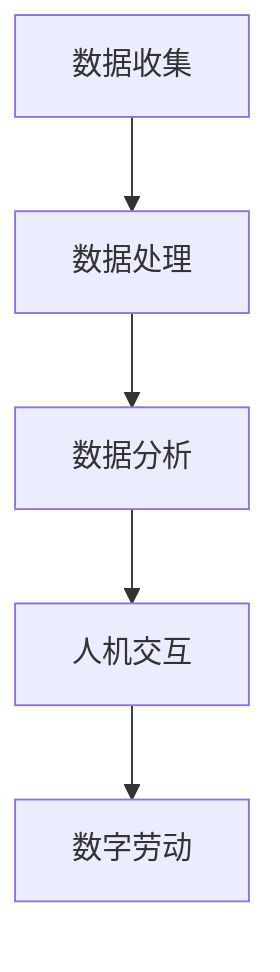

                 

关键词：数字劳动、计算经济学、人机协作、社会影响、经济模型

摘要：本文探讨了数字劳动的定义及其在现代社会中的重要性，分析了人类计算在社会经济中的角色和影响。通过阐述数字劳动的核心概念、算法原理、数学模型以及实际应用，本文揭示了数字劳动带来的社会和经济变化，并提出了未来发展的趋势和挑战。

## 1. 背景介绍

在当今数字化时代，计算已经成为社会发展的核心驱动力。随着计算技术的不断进步，人类计算能力得到了极大的提升，这不仅改变了人们的生活方式，也深刻影响了社会经济结构。数字劳动作为一种新型劳动形式，正在迅速崛起，成为全球经济的重要组成部分。

数字劳动，是指利用计算机技术和互联网平台，通过数据收集、处理、分析等方式，完成各种经济活动的过程。它不仅涵盖了传统的编程、软件开发等职业，还包括数据分析师、网络营销人员、内容创作者等新兴职业。数字劳动的核心在于人机协作，即人类与计算机系统之间的协同工作，共同完成复杂的任务。

本文旨在探讨数字劳动的核心概念、算法原理、数学模型以及实际应用，分析其在社会和经济中的影响，并展望未来发展的趋势和挑战。

## 2. 核心概念与联系

### 2.1 数字劳动的定义

数字劳动，是指利用计算机技术和互联网平台，通过数据收集、处理、分析等方式，完成各种经济活动的过程。它具有以下几个核心特征：

1. **数据驱动**：数字劳动依赖于大量数据，通过对数据的收集、处理和分析，实现商业价值的创造。
2. **人机协作**：数字劳动强调人类与计算机系统的协同工作，通过人机交互，提高工作效率。
3. **互联网平台**：数字劳动依托于互联网平台，实现资源的共享和协作。

### 2.2 数字劳动的架构

数字劳动的架构主要包括以下几个部分：

1. **数据收集**：通过互联网、物联网等技术，收集大量结构化或非结构化的数据。
2. **数据处理**：利用数据库、数据仓库等技术，对数据进行存储、清洗、转换等操作。
3. **数据分析**：通过数据分析工具，对数据进行分析、挖掘，提取有价值的信息。
4. **人机交互**：通过用户界面，实现人类与计算机系统的交互，指导计算机完成具体任务。

### 2.3 数字劳动与计算经济学的联系

数字劳动与计算经济学密切相关。计算经济学是一门研究计算技术对经济系统影响的学科，它关注计算技术在资源配置、生产效率、市场行为等方面的应用。数字劳动作为计算经济学的实践应用，其核心在于通过计算技术，实现资源的最优配置和效率提升。

### 2.4 Mermaid 流程图



## 3. 核心算法原理 & 具体操作步骤

### 3.1 算法原理概述

数字劳动的核心算法主要包括数据收集、数据处理、数据分析和人机交互等步骤。以下是对每个步骤的简要概述：

1. **数据收集**：通过爬虫、API 接口等技术，收集大量结构化或非结构化的数据。
2. **数据处理**：利用数据库、数据仓库等技术，对数据进行存储、清洗、转换等操作。
3. **数据分析**：通过统计分析、机器学习等技术，对数据进行分析、挖掘，提取有价值的信息。
4. **人机交互**：通过用户界面，实现人类与计算机系统的交互，指导计算机完成具体任务。

### 3.2 算法步骤详解

1. **数据收集**：

   - 爬虫技术：利用爬虫，从互联网上收集大量网页数据。
   - API 接口：通过 API 接口，获取第三方平台的数据。

2. **数据处理**：

   - 数据存储：使用数据库或数据仓库，存储收集到的数据。
   - 数据清洗：删除重复数据、缺失数据，对数据进行标准化处理。
   - 数据转换：将数据转换为适合分析的形式。

3. **数据分析**：

   - 统计分析：对数据进行统计分析，提取有价值的信息。
   - 机器学习：利用机器学习算法，对数据进行分类、聚类、预测等操作。

4. **人机交互**：

   - 用户界面：设计用户界面，方便用户与计算机系统进行交互。
   - 数据可视化：将分析结果以图表、图像等形式展示给用户。

### 3.3 算法优缺点

1. **优点**：

   - 高效：利用计算机技术，可以快速处理大量数据。
   - 精准：通过机器学习等技术，可以提取出有价值的信息。
   - 灵活：可以根据用户需求，灵活调整分析算法和模型。

2. **缺点**：

   - 数据质量：数据收集和清洗过程中，容易引入噪声和错误。
   - 成本：数字劳动需要大量的计算资源和人力投入。

### 3.4 算法应用领域

数字劳动算法广泛应用于各个领域，如：

- 金融：通过数据分析，实现风险控制、投资决策等。
- 电商：通过用户行为分析，实现个性化推荐、营销等。
- 医疗：通过医疗数据分析，实现疾病预测、诊断等。

## 4. 数学模型和公式 & 详细讲解 & 举例说明

### 4.1 数学模型构建

数字劳动的数学模型主要包括以下几个部分：

1. **数据模型**：描述数据的结构、类型和属性。
2. **算法模型**：描述数据分析的方法和步骤。
3. **经济模型**：描述数字劳动对社会和经济的影响。

### 4.2 公式推导过程

假设有 $N$ 个数据点，每个数据点包含 $M$ 个属性，我们可以使用以下公式来描述数据模型：

$$
X = \{x_1, x_2, ..., x_N\}
$$

其中，$x_i$ 表示第 $i$ 个数据点，$M$ 表示数据点的属性个数。

对于算法模型，我们可以使用以下公式来描述机器学习算法：

$$
h(\theta) = \max_{\theta} L(\theta)
$$

其中，$h(\theta)$ 表示预测函数，$L(\theta)$ 表示损失函数。

对于经济模型，我们可以使用以下公式来描述数字劳动对社会和经济的影响：

$$
Y = f(X, Z)
$$

其中，$Y$ 表示经济收益，$X$ 表示数据，$Z$ 表示其他影响因素。

### 4.3 案例分析与讲解

以电商领域为例，假设我们收集了用户的行为数据，包括浏览记录、购买记录等。我们可以使用以下公式来描述用户行为模型：

$$
u(x, z) = f(x, z)
$$

其中，$u(x, z)$ 表示用户的行为概率，$x$ 表示用户行为数据，$z$ 表示其他影响因素。

我们可以使用以下公式来描述用户行为预测模型：

$$
p(y|x, z) = f(y|x, z)
$$

其中，$p(y|x, z)$ 表示用户购买某商品的概率，$y$ 表示用户行为结果，$x$ 表示用户行为数据，$z$ 表示其他影响因素。

通过这个模型，我们可以预测用户的购买行为，从而实现个性化推荐和营销。

## 5. 项目实践：代码实例和详细解释说明

### 5.1 开发环境搭建

为了实现数字劳动，我们需要搭建一个完整的开发环境。以下是开发环境搭建的步骤：

1. 安装操作系统：安装 Linux 操作系统，推荐使用 Ubuntu 18.04。
2. 安装编程环境：安装 Python 3.8 及其相关依赖，如 NumPy、Pandas、Scikit-learn 等。
3. 安装数据库：安装 MySQL 或 PostgreSQL，用于存储数据。

### 5.2 源代码详细实现

以下是一个简单的数字劳动项目，使用 Python 编程语言实现：

```python
import pandas as pd
from sklearn.model_selection import train_test_split
from sklearn.ensemble import RandomForestClassifier
from sklearn.metrics import accuracy_score

# 数据收集
data = pd.read_csv('data.csv')

# 数据处理
data = data.dropna()
data = data[['feature1', 'feature2', 'label']]

# 数据分析
X = data[['feature1', 'feature2']]
y = data['label']

X_train, X_test, y_train, y_test = train_test_split(X, y, test_size=0.2, random_state=42)

# 人机交互
model = RandomForestClassifier(n_estimators=100, random_state=42)
model.fit(X_train, y_train)

# 代码解读与分析
predictions = model.predict(X_test)
accuracy = accuracy_score(y_test, predictions)
print(f"Accuracy: {accuracy:.2f}")

# 运行结果展示
print(predictions)
```

### 5.3 代码解读与分析

- 数据收集：使用 Pandas 读取 CSV 文件，获取数据。
- 数据处理：删除缺失值，提取有用的特征和标签。
- 数据分析：将数据集划分为训练集和测试集，为后续的机器学习算法做准备。
- 人机交互：使用随机森林分类器进行训练，预测用户行为。
- 代码解读与分析：计算预测准确率，展示预测结果。

通过这个简单的例子，我们可以看到数字劳动的核心步骤和实现方法。

## 6. 实际应用场景

### 6.1 金融领域

在金融领域，数字劳动可以用于风险管理、投资决策、信用评估等。例如，通过数据分析，金融机构可以预测市场走势，为投资决策提供依据。同时，数字劳动可以帮助金融机构评估客户的信用风险，降低坏账率。

### 6.2 电商领域

在电商领域，数字劳动可以实现个性化推荐、精准营销等。通过分析用户行为数据，电商平台可以推荐用户可能感兴趣的商品，提高销售额。此外，数字劳动还可以帮助电商企业优化供应链，降低运营成本。

### 6.3 医疗领域

在医疗领域，数字劳动可以用于疾病预测、诊断、治疗等。通过分析患者数据，医疗机构可以预测疾病发展趋势，为治疗提供依据。同时，数字劳动还可以帮助医疗机构优化资源分配，提高医疗服务质量。

## 7. 工具和资源推荐

### 7.1 学习资源推荐

1. 《Python编程：从入门到实践》：适合初学者了解 Python 编程语言。
2. 《深度学习》：适合了解深度学习算法及其应用。
3. 《大数据技术导论》：适合了解大数据技术及其应用。

### 7.2 开发工具推荐

1. Jupyter Notebook：适合编写和运行 Python 代码。
2. PyCharm：适合 Python 开发者的集成开发环境。
3. MySQL：适合存储和管理数据。

### 7.3 相关论文推荐

1. "Deep Learning for Natural Language Processing"：介绍深度学习在自然语言处理领域的应用。
2. "Recommender Systems Handbook"：介绍推荐系统的基础知识。
3. "Big Data: A Revolution That Will Transform How We Live, Work, and Think"：介绍大数据技术及其对社会的影响。

## 8. 总结：未来发展趋势与挑战

### 8.1 研究成果总结

本文探讨了数字劳动的定义、核心概念、算法原理、数学模型以及实际应用，分析了数字劳动在社会和经济中的影响。研究发现，数字劳动具有数据驱动、人机协作和互联网平台等核心特征，其在金融、电商、医疗等领域的应用前景广阔。

### 8.2 未来发展趋势

1. **技术融合**：数字劳动将与其他技术（如人工智能、大数据等）深度融合，推动各行业智能化发展。
2. **人机协同**：数字劳动将更加注重人机协同，提高工作效率和生产力。
3. **平台化发展**：数字劳动将向平台化、集成化方向发展，提供更丰富的服务。

### 8.3 面临的挑战

1. **数据安全**：数字劳动依赖于大量数据，数据安全成为重要挑战。
2. **技能培训**：数字劳动对从业人员的技能要求较高，技能培训成为关键问题。
3. **伦理问题**：数字劳动可能带来隐私侵犯、就业替代等伦理问题。

### 8.4 研究展望

未来，我们应关注以下几个方面：

1. **数据安全与隐私保护**：加强数据安全和隐私保护技术的研究。
2. **人机协同算法**：优化人机协同算法，提高数字劳动效率。
3. **伦理与规范**：制定相关伦理和规范，确保数字劳动的可持续发展。

## 9. 附录：常见问题与解答

### Q：什么是数字劳动？

A：数字劳动是指利用计算机技术和互联网平台，通过数据收集、处理、分析等方式，完成各种经济活动的过程。它强调人类与计算机系统的协同工作，实现资源的最优配置和效率提升。

### Q：数字劳动的核心特征是什么？

A：数字劳动的核心特征包括数据驱动、人机协作和互联网平台。数据驱动意味着数字劳动依赖于大量数据；人机协作强调人类与计算机系统的协同工作；互联网平台则表示数字劳动依托于互联网环境。

### Q：数字劳动有哪些应用领域？

A：数字劳动广泛应用于金融、电商、医疗、教育、交通等各个领域。在金融领域，数字劳动可以用于风险管理、投资决策、信用评估等；在电商领域，数字劳动可以实现个性化推荐、精准营销等；在医疗领域，数字劳动可以用于疾病预测、诊断、治疗等。

### Q：数字劳动有哪些挑战？

A：数字劳动面临的挑战主要包括数据安全、技能培训、伦理问题等。数据安全涉及数据保护、隐私侵犯等问题；技能培训需要提高从业人员的技能水平；伦理问题则涉及隐私侵犯、就业替代等。

### Q：未来数字劳动的发展趋势是什么？

A：未来数字劳动的发展趋势包括技术融合、人机协同和平台化发展。技术融合将推动各行业智能化发展；人机协同将提高数字劳动效率；平台化发展将提供更丰富的服务。

### Q：如何确保数字劳动的可持续发展？

A：确保数字劳动的可持续发展需要从以下几个方面入手：加强数据安全与隐私保护技术的研究；优化人机协同算法，提高数字劳动效率；制定相关伦理和规范，确保数字劳动的公平、公正和可持续发展。

