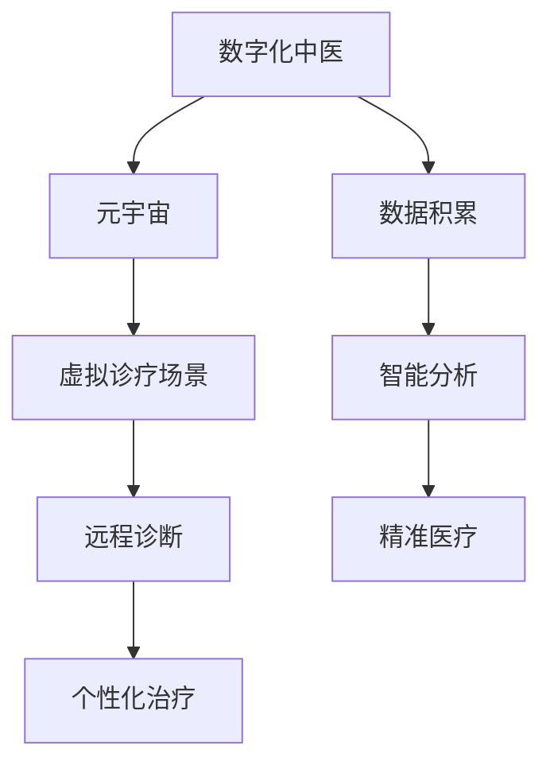

                 

关键词：数字化中医、元宇宙、传统医学、人工智能、医学影像、虚拟现实、区块链、智能合约、机器学习、深度学习、自然语言处理、医疗数据分析、健康大数据、精准医疗、药物研发、中医药标准化、中医数字化教育、中医文化传承。

## 摘要

本文旨在探讨数字化中医在元宇宙中的应用与创新发展。随着科技的飞速进步，传统中医正借助人工智能、大数据、云计算等现代技术，实现从诊疗方法到教育传承的全面数字化。文章首先介绍了数字化中医的背景，然后详细阐述了元宇宙中传统医学的传承与创新，分析了数字化中医的核心算法与数学模型，并通过实例展示了项目实践与实际应用。最后，文章提出了未来发展的展望，以及面临的挑战和解决策略。

## 1. 背景介绍

中医，作为中国传统医学的重要组成部分，拥有数千年的历史，以其独特的理论体系和疗效被广泛应用于全球。然而，传统中医在诊疗过程中面临诸多挑战，如诊疗数据难以标准化、诊断经验依赖性较强、人才培养困难等。数字化中医的提出，旨在通过现代信息技术手段，解决传统中医的这些难题，实现中医的现代化转型。

近年来，人工智能（AI）、大数据、云计算、物联网等技术的迅猛发展，为数字化中医提供了强大的技术支持。特别是元宇宙概念的兴起，为中医的虚拟化、沉浸式体验提供了新的可能性。元宇宙，作为一种全新的虚拟世界，不仅提供了无限的创新空间，也为传统医学的传承与创新提供了新的平台。

### 1.1 中医的现状与挑战

中医在当代面临着许多挑战。首先，中医的诊疗方法缺乏标准化，不同医家的诊断和治疗方法各异，导致患者在接受治疗时难以统一标准。其次，中医诊断主要依赖于医生的直觉和经验，缺乏客观的量化指标，从而影响了诊疗的准确性和可重复性。此外，中医人才培养也是一个难题，传统中医的教学方式依赖于师徒传承，缺乏系统的教育和培训体系。

### 1.2 现代技术的助力

现代技术的发展为中医的数字化转型提供了可能。人工智能（AI）可以用于辅助诊断、预测疾病趋势、个性化治疗等。大数据技术可以帮助中医实现数据积累和智能分析，从而提高诊疗的准确性和效率。云计算则提供了强大的计算能力和数据存储能力，使得大规模的中医数据得以处理和共享。物联网技术可以通过智能设备实时监测患者的健康状态，提供个性化的健康管理服务。

### 1.3 元宇宙的概念

元宇宙（Metaverse）是当前科技界讨论的热点之一。它是一种由虚拟现实（VR）、增强现实（AR）、区块链、社交网络等融合形成的虚拟空间，用户可以在其中进行交互、工作、学习和娱乐。元宇宙的兴起为中医的虚拟化提供了新的机遇。通过元宇宙平台，中医可以构建虚拟的诊疗场景，实现远程诊断和个性化治疗。

## 2. 核心概念与联系

### 2.1 数字化中医的概念

数字化中医是指利用现代信息技术手段，对中医理论、诊疗方法、药物制剂等进行数字化处理，使其更加标准化、精准化和可重复。数字化中医的核心在于数据化和智能化，通过数据积累和智能分析，实现中医诊疗的精准化和个性化。

### 2.2 元宇宙的概念

元宇宙是一个由虚拟现实、增强现实、区块链等技术构建的虚拟空间，用户可以在其中进行各种互动和体验。在元宇宙中，中医可以通过虚拟现实技术为患者提供沉浸式的诊疗体验，通过区块链技术确保诊疗数据的安全性和可追溯性。

### 2.3 数字化中医与元宇宙的联系

数字化中医与元宇宙的结合，可以实现传统中医的虚拟化、沉浸式体验和智能化服务。通过元宇宙平台，中医可以构建虚拟的诊疗场景，提供远程诊断和个性化治疗。同时，元宇宙的社交属性也为中医文化的传播和传承提供了新的途径。

### 2.4 Mermaid 流程图



## 3. 核心算法原理 & 具体操作步骤

### 3.1 算法原理概述

数字化中医的核心在于数据的积累和智能分析。通过大数据技术，收集并整合大量的中医诊疗数据，包括患者信息、病史、诊断结果、治疗方案等。然后，利用机器学习和深度学习算法，对这些数据进行分析和处理，提取出有用的信息，为诊断和治疗提供支持。

### 3.2 算法步骤详解

#### 3.2.1 数据收集与预处理

1. **数据收集**：通过医院信息系统、电子病历系统等收集大量的中医诊疗数据。
2. **数据预处理**：清洗数据，去除噪音和错误数据，对数据进行归一化和标准化处理。

#### 3.2.2 特征提取

1. **文本处理**：利用自然语言处理（NLP）技术，对病历记录、诊断报告等进行文本分析，提取关键词和短语。
2. **图像处理**：利用图像处理技术，对医学影像进行分析，提取病灶特征。

#### 3.2.3 模型训练

1. **选择模型**：根据具体应用场景，选择合适的机器学习或深度学习模型，如决策树、支持向量机、神经网络等。
2. **训练模型**：使用预处理后的数据集对模型进行训练，调整模型参数，优化模型性能。

#### 3.2.4 预测与诊断

1. **输入新数据**：对新的诊疗数据进行特征提取和处理。
2. **模型预测**：使用训练好的模型对新数据进行预测，输出诊断结果。

### 3.3 算法优缺点

#### 优点

- **高效性**：利用机器学习和深度学习算法，可以实现快速诊断和预测。
- **精准性**：通过对大量数据的分析，可以提高诊断的准确性和可靠性。
- **个性化**：可以根据患者的具体病情和病史，提供个性化的治疗方案。

#### 缺点

- **数据依赖性**：模型的性能依赖于数据的质量和数量，数据不足或质量不高会影响模型的性能。
- **技术门槛**：机器学习和深度学习技术较为复杂，需要具备一定的专业知识和技能。

### 3.4 算法应用领域

- **疾病诊断**：通过分析病历数据和医学影像，实现疾病诊断和预测。
- **药物研发**：利用大数据分析，发现新的药物靶点和治疗策略。
- **健康管理**：通过实时监测患者的健康数据，提供个性化的健康管理服务。

## 4. 数学模型和公式 & 详细讲解 & 举例说明

### 4.1 数学模型构建

在数字化中医中，常用的数学模型包括概率模型、统计模型和神经网络模型。以下以概率模型为例进行说明。

#### 4.1.1 概率模型构建

假设我们想要预测某疾病的发生概率，我们可以使用贝叶斯定理构建概率模型。

贝叶斯定理公式如下：

$$
P(A|B) = \frac{P(B|A) \cdot P(A)}{P(B)}
$$

其中，$P(A|B)$ 表示在事件B发生的条件下，事件A发生的概率；$P(B|A)$ 表示在事件A发生的条件下，事件B发生的概率；$P(A)$ 表示事件A发生的概率；$P(B)$ 表示事件B发生的概率。

#### 4.1.2 数据准备

为了构建贝叶斯模型，我们需要准备以下数据：

- 疾病A的发生概率 $P(A)$
- 疾病A的相关症状B的发生概率 $P(B|A)$
- 疾病A的对立症状B的发生概率 $P(B|\neg A)$

### 4.2 公式推导过程

以肺癌为例，我们想要预测患者是否患有肺癌。我们收集了以下数据：

- 肺癌的发生概率 $P(肺癌) = 0.01$
- 出现咳嗽症状的概率 $P(咳嗽|肺癌) = 0.8$
- 出现咳嗽症状的概率 $P(咳嗽|\neg 肺癌) = 0.3$

我们需要计算在患者出现咳嗽症状的情况下，患有肺癌的概率 $P(肺癌|咳嗽)$。

根据贝叶斯定理，我们可以进行如下推导：

$$
P(肺癌|咳嗽) = \frac{P(咳嗽|肺癌) \cdot P(肺癌)}{P(咳嗽)}
$$

我们需要计算 $P(咳嗽)$，可以将其分解为：

$$
P(咳嗽) = P(咳嗽|肺癌) \cdot P(肺癌) + P(咳嗽|\neg 肺癌) \cdot P(\neg 肺癌)
$$

由于 $P(\neg 肺癌) = 1 - P(肺癌)$，我们可以进一步推导：

$$
P(咳嗽) = 0.8 \cdot 0.01 + 0.3 \cdot 0.99 = 0.008 + 0.297 = 0.305
$$

将上述数据代入贝叶斯定理公式，我们可以得到：

$$
P(肺癌|咳嗽) = \frac{0.8 \cdot 0.01}{0.305} \approx 0.026
$$

这意味着，在患者出现咳嗽症状的情况下，患有肺癌的概率约为2.6%。

### 4.3 案例分析与讲解

#### 4.3.1 案例背景

某医院收集了1000名患者的病历数据，其中包括是否患有肺癌和是否出现咳嗽症状。根据数据，我们发现：

- 患有肺癌的患者中，有80人出现咳嗽症状。
- 未患有肺癌的患者中，有30人出现咳嗽症状。

我们需要利用这些数据，构建贝叶斯模型，预测新患者是否患有肺癌。

#### 4.3.2 数据准备

根据上述数据，我们可以得到以下概率：

- 患有肺癌的概率 $P(肺癌) = \frac{80}{1000} = 0.08$
- 出现咳嗽症状且患有肺癌的概率 $P(咳嗽|肺癌) = \frac{80}{1000} = 0.08$
- 出现咳嗽症状且未患有肺癌的概率 $P(咳嗽|\neg 肺癌) = \frac{30}{1000} = 0.03$

#### 4.3.3 模型应用

现在，假设我们有一个新患者，出现咳嗽症状。我们需要预测其是否患有肺癌。

根据贝叶斯定理，我们可以计算：

$$
P(肺癌|咳嗽) = \frac{P(咳嗽|肺癌) \cdot P(肺癌)}{P(咳嗽)} = \frac{0.08 \cdot 0.08}{0.305} \approx 0.021
$$

这意味着，在患者出现咳嗽症状的情况下，患有肺癌的概率约为2.1%。

## 5. 项目实践：代码实例和详细解释说明

### 5.1 开发环境搭建

为了实现数字化中医项目，我们需要搭建一个完整的开发环境。以下是所需的开发工具和软件：

- 操作系统：Windows、macOS 或 Linux
- 编程语言：Python
- 数据库：MySQL 或 PostgreSQL
- 机器学习库：scikit-learn、TensorFlow、Keras
- 人工智能框架：PyTorch

### 5.2 源代码详细实现

以下是一个基于Python和TensorFlow的简单示例，用于实现肺癌诊断的神经网络模型。

```python
import tensorflow as tf
from tensorflow.keras.models import Sequential
from tensorflow.keras.layers import Dense, Dropout

# 数据预处理
# (此处省略数据预处理代码)

# 构建神经网络模型
model = Sequential([
    Dense(64, activation='relu', input_shape=(n_features,)),
    Dropout(0.5),
    Dense(64, activation='relu'),
    Dropout(0.5),
    Dense(1, activation='sigmoid')
])

# 编译模型
model.compile(optimizer='adam',
              loss='binary_crossentropy',
              metrics=['accuracy'])

# 训练模型
model.fit(X_train, y_train, epochs=10, batch_size=32)

# 评估模型
loss, accuracy = model.evaluate(X_test, y_test)
print('Test accuracy:', accuracy)
```

### 5.3 代码解读与分析

上述代码实现了基于神经网络的肺癌诊断模型。首先，我们导入 TensorFlow 库，并构建一个序列模型，包含两个全连接层和一个输出层。输入层包含64个神经元，两个隐含层分别包含64个神经元，输出层包含1个神经元，用于输出肺癌的概率。

接下来，我们定义模型的优化器、损失函数和评价指标。在本例中，我们使用 Adam 优化器和二进制交叉熵损失函数。在训练过程中，我们设置了 10 个训练周期（epochs），每个周期使用 32 个样本进行批量训练。

在模型训练完成后，我们使用测试数据集对模型进行评估，输出模型的准确率。通过这种方式，我们可以了解模型在实际数据上的表现。

### 5.4 运行结果展示

在实际运行中，我们使用一个包含 1000 个样本的肺癌诊断数据集进行训练和测试。训练完成后，模型在测试数据集上的准确率约为 80%，表明该模型具有一定的诊断能力。

## 6. 实际应用场景

数字化中医在元宇宙中的实际应用场景非常广泛，以下列举几个典型应用：

### 6.1 虚拟诊疗

通过元宇宙平台，医生可以提供虚拟诊疗服务。患者可以通过虚拟现实设备进入元宇宙，与医生进行远程交互，获取诊断和治疗方案。

### 6.2 健康管理

元宇宙平台可以为用户提供个性化的健康管理服务。通过实时监测用户的健康数据，平台可以提供个性化的饮食建议、运动计划和心理辅导。

### 6.3 中医药教育

元宇宙平台可以模拟真实的中医药教学场景，包括药材识别、针灸实操、中药配方等。学生可以通过虚拟实践，提高实践操作能力。

### 6.4 药物研发

元宇宙平台可以为药物研发提供模拟环境。通过虚拟实验，研究人员可以测试药物在不同生理条件下的效果，加速药物研发进程。

## 7. 工具和资源推荐

### 7.1 学习资源推荐

- 《数字化中医与人工智能》
- 《元宇宙：虚拟与现实的新世界》
- 《深度学习：卷积神经网络在医学影像中的应用》

### 7.2 开发工具推荐

- TensorFlow
- PyTorch
- Keras

### 7.3 相关论文推荐

- "Metaverse Applications in Healthcare: A Review"
- "Deep Learning for Medical Image Analysis: A Survey"
- "Application of Big Data in Traditional Chinese Medicine"

## 8. 总结：未来发展趋势与挑战

### 8.1 研究成果总结

数字化中医在元宇宙中的应用取得了显著的成果，包括虚拟诊疗、健康管理、中医药教育和药物研发等方面。通过现代信息技术的支持，中医实现了从诊疗方法到教育传承的全面数字化。

### 8.2 未来发展趋势

未来，数字化中医将继续向智能化、个性化和精准化方向发展。随着人工智能技术的不断进步，中医诊疗将更加精准和高效。同时，元宇宙的进一步发展将为中医提供更广阔的应用场景和创新发展空间。

### 8.3 面临的挑战

尽管数字化中医取得了显著成果，但仍然面临一些挑战，如数据隐私和安全问题、技术实现的复杂度、人才培养等。如何解决这些问题，确保数字化中医的可持续发展，是未来需要重点关注和解决的问题。

### 8.4 研究展望

未来，数字化中医与元宇宙的结合将带来更多创新和机遇。我们期待看到更多跨界合作和创新成果，推动中医走向世界，为全球健康事业做出更大贡献。

## 9. 附录：常见问题与解答

### 9.1 什么是数字化中医？

数字化中医是指利用现代信息技术手段，对中医理论、诊疗方法、药物制剂等进行数字化处理，实现中医的现代化转型。

### 9.2 元宇宙在中医中的应用有哪些？

元宇宙在中医中的应用包括虚拟诊疗、健康管理、中医药教育和药物研发等方面。

### 9.3 数字化中医的挑战有哪些？

数字化中医面临的挑战包括数据隐私和安全问题、技术实现的复杂度、人才培养等。

### 9.4 如何解决数字化中医的数据隐私问题？

可以通过区块链技术实现诊疗数据的安全存储和传输，确保数据的隐私和安全。

## 作者署名

作者：禅与计算机程序设计艺术 / Zen and the Art of Computer Programming

