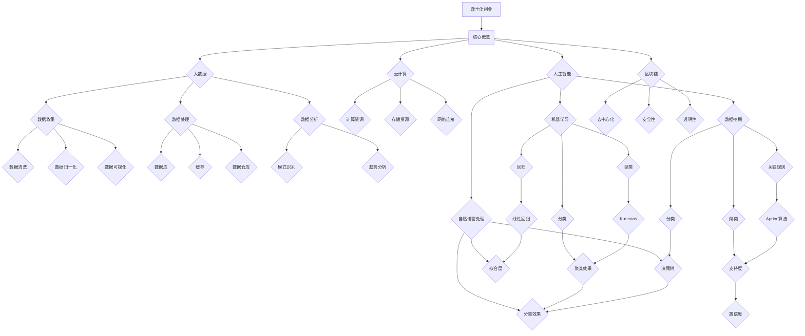

                 

在当今快速变化的商业环境中，数字化创业已成为许多企业家和投资者关注的焦点。数字化不仅改变了传统的商业模式，还创造了全新的市场机会。本文将探讨数字化创业的核心概念、技术框架、算法原理、数学模型、实践案例以及未来应用场景，帮助读者理解并掌握数字化创业的蓝图。

## 关键词

- 数字化创业
- 未来企业
- 技术框架
- 算法原理
- 数学模型
- 实践案例
- 未来应用场景

## 摘要

本文首先介绍了数字化创业的背景和重要性，随后深入分析了数字化创业所需的核心概念和技术框架。接着，我们探讨了核心算法原理，包括其优缺点和应用领域。随后，文章详细介绍了数学模型和公式，并通过实际案例和代码实例进行了讲解。最后，我们探讨了数字化创业的实际应用场景，并展望了未来的发展趋势和挑战。

## 1. 背景介绍

### 1.1 数字化创业的定义与意义

数字化创业是指在数字化时代背景下，利用新技术、新理念和新模式，通过创新的商业模式和市场策略，创建和运营新型企业的过程。数字化创业的意义在于：

- **创新商业模式**：数字化为企业提供了前所未有的创新空间，使其能够迅速响应市场需求，推出新产品和服务。
- **提升运营效率**：数字化技术使得企业管理更加高效，自动化程度提高，减少了人力成本。
- **拓展市场空间**：通过互联网和移动设备，企业可以轻松触及全球市场，实现全球化运营。

### 1.2 数字化创业的挑战与机遇

数字化创业虽然充满机遇，但同时也面临诸多挑战：

- **技术门槛**：数字化创业往往需要掌握先进的编程技术、数据分析等专业知识，这对创业团队提出了高要求。
- **市场风险**：数字化市场的竞争异常激烈，新企业需要快速适应市场变化，降低市场风险。
- **数据安全**：数字化企业依赖大量用户数据，数据安全成为企业面临的重大挑战。

### 1.3 数字化创业的发展趋势

- **智能化**：随着人工智能技术的发展，数字化创业正在向智能化、自动化方向迈进。
- **云计算**：云计算技术为企业提供了强大的计算能力和存储空间，降低了运营成本。
- **物联网**：物联网技术的广泛应用，使得企业能够实现设备互联，提高生产效率。

## 2. 核心概念与联系

### 2.1 数字化创业的核心概念

数字化创业涉及多个核心概念，包括：

- **大数据**：通过收集、存储和分析海量数据，企业能够发现潜在的商业机会。
- **云计算**：利用云计算平台，企业可以按需获取计算资源，降低IT成本。
- **人工智能**：通过人工智能技术，企业能够实现自动化决策和智能服务。
- **区块链**：区块链技术提供了去中心化、安全透明的数据存储和交易方式。

### 2.2 数字化创业的技术框架

数字化创业的技术框架包括：

- **前端技术**：如HTML、CSS和JavaScript，用于构建用户界面。
- **后端技术**：如Java、Python、Node.js等，用于处理业务逻辑和数据存储。
- **数据库**：如MySQL、MongoDB等，用于存储和管理数据。
- **人工智能框架**：如TensorFlow、PyTorch等，用于构建和训练机器学习模型。

### 2.3 数字化创业的架构

数字化创业的架构通常包括以下几个层次：

- **数据层**：用于存储和管理数据。
- **应用层**：用于实现业务逻辑和功能。
- **展示层**：用于向用户展示信息和界面。
- **基础设施层**：包括服务器、网络和存储等硬件设施。

## 3. 核心算法原理 & 具体操作步骤

### 3.1 算法原理概述

数字化创业的核心算法包括机器学习、数据挖掘和自然语言处理等。以下是对这些算法的简要概述：

- **机器学习**：通过训练模型，让计算机自动从数据中学习规律，从而进行预测和决策。
- **数据挖掘**：从大量数据中发现有用的信息和模式。
- **自然语言处理**：使计算机能够理解和处理人类语言。

### 3.2 算法步骤详解

以下是对数字化创业核心算法的具体操作步骤的详细解释：

- **机器学习**：
  1. 数据预处理：清洗和整理数据，为训练模型做准备。
  2. 特征工程：提取数据中的关键特征，用于训练模型。
  3. 模型训练：使用训练数据训练模型，使其学会预测和决策。
  4. 模型评估：使用测试数据评估模型的性能。
  5. 模型优化：根据评估结果调整模型参数，提高模型性能。

- **数据挖掘**：
  1. 数据选择：选择用于挖掘的数据集。
  2. 数据预处理：清洗和整理数据，为挖掘做准备。
  3. 挖掘算法：选择合适的挖掘算法，如关联规则挖掘、聚类分析等。
  4. 挖掘结果评估：评估挖掘结果的可靠性。
  5. 结果解释：对挖掘结果进行解释，帮助决策。

- **自然语言处理**：
  1. 分词：将文本分成单词或短语。
  2. 词性标注：标注每个单词的词性，如名词、动词等。
  3. 语法分析：分析文本的语法结构。
  4. 情感分析：判断文本的情感倾向。
  5. 文本生成：根据给定文本或指令生成新文本。

### 3.3 算法优缺点

- **机器学习**：
  - 优点：能够自动从数据中学习，适用于大规模数据。
  - 缺点：对数据质量和特征工程有较高要求，训练过程可能较慢。

- **数据挖掘**：
  - 优点：能够从大量数据中发现有价值的信息。
  - 缺点：结果可能过于复杂，难以解释。

- **自然语言处理**：
  - 优点：能够处理人类语言，实现人机交互。
  - 缺点：语言理解仍存在挑战，特别是在处理复杂语境时。

### 3.4 算法应用领域

- **机器学习**：广泛应用于金融、医疗、零售等领域，如信用评分、疾病预测、推荐系统等。
- **数据挖掘**：广泛应用于商业智能、市场营销、社会媒体分析等领域。
- **自然语言处理**：广泛应用于语音识别、机器翻译、智能客服等领域。

## 4. 数学模型和公式 & 详细讲解 & 举例说明

### 4.1 数学模型构建

数字化创业中的数学模型通常包括以下几个方面：

- **概率模型**：用于描述数据的不确定性，如贝叶斯网络。
- **线性模型**：用于拟合数据，如线性回归、逻辑回归。
- **非线性模型**：用于描述复杂关系，如决策树、神经网络。

### 4.2 公式推导过程

以下是对数字化创业中常用数学公式的推导过程：

- **线性回归模型**：

$$
y = \beta_0 + \beta_1 x + \epsilon
$$

其中，$y$ 是因变量，$x$ 是自变量，$\beta_0$ 和 $\beta_1$ 是模型参数，$\epsilon$ 是误差项。

- **逻辑回归模型**：

$$
\log\left(\frac{p}{1-p}\right) = \beta_0 + \beta_1 x
$$

其中，$p$ 是概率，$\beta_0$ 和 $\beta_1$ 是模型参数。

### 4.3 案例分析与讲解

以下是一个关于线性回归模型的案例：

**案例**：某公司希望预测下个月的销售额，已知过去6个月的销售额如下（单位：万元）：

| 月份 | 销售额 |
|------|--------|
| 1    | 30     |
| 2    | 35     |
| 3    | 28     |
| 4    | 32     |
| 5    | 34     |
| 6    | 29     |

**步骤**：

1. 数据预处理：将销售额转化为向量 $X$，如下：

$$
X = \begin{bmatrix}
1 & 1 \\
1 & 2 \\
1 & 3 \\
1 & 4 \\
1 & 5 \\
1 & 6 \\
\end{bmatrix}
$$

2. 特征工程：添加一列全为1的列，作为线性回归模型的截距项：

$$
X = \begin{bmatrix}
1 & 1 \\
1 & 2 \\
1 & 3 \\
1 & 4 \\
1 & 5 \\
1 & 6 \\
\end{bmatrix}
$$

3. 模型训练：使用线性回归算法，训练模型参数 $\beta_0$ 和 $\beta_1$。

4. 模型评估：使用测试数据集，评估模型性能。

5. 模型应用：使用训练好的模型，预测下个月的销售额。

## 5. 项目实践：代码实例和详细解释说明

### 5.1 开发环境搭建

为了实践数字化创业中的算法模型，我们需要搭建一个合适的开发环境。以下是一个基于Python的示例：

- **Python环境**：安装Python 3.x版本，并配置Python环境变量。
- **科学计算库**：安装NumPy、Pandas、Matplotlib等科学计算库。
- **机器学习库**：安装scikit-learn库，用于实现线性回归模型。

### 5.2 源代码详细实现

以下是一个使用Python实现线性回归模型的示例代码：

```python
import numpy as np
import pandas as pd
from sklearn.linear_model import LinearRegression

# 数据预处理
data = pd.DataFrame({
    'x': range(1, 7),
    'y': [30, 35, 28, 32, 34, 29]
})
X = data[['x']]
y = data['y']

# 模型训练
model = LinearRegression()
model.fit(X, y)

# 模型评估
score = model.score(X, y)
print(f"Model R-squared score: {score}")

# 模型应用
next_month = np.array([[1, 7]])
predicted_sales = model.predict(next_month)
print(f"Predicted sales for next month: {predicted_sales[0]}")
```

### 5.3 代码解读与分析

1. **数据预处理**：使用Pandas库读取数据，并划分为特征矩阵 $X$ 和目标变量 $y$。
2. **模型训练**：使用scikit-learn库的线性回归模型进行训练，得到模型参数。
3. **模型评估**：使用R-squared分数评估模型性能。
4. **模型应用**：使用训练好的模型预测下个月的销售额。

## 6. 实际应用场景

### 6.1 零售行业

在零售行业，数字化创业可以帮助企业实现智能库存管理、个性化推荐和精准营销。例如，通过机器学习算法分析用户行为数据，企业可以预测未来销量，优化库存管理，提高运营效率。

### 6.2 金融行业

在金融行业，数字化创业可以应用于信用评分、风险管理和智能投顾等领域。通过数据挖掘和机器学习技术，金融机构可以更好地理解客户需求，降低信用风险，提供个性化的金融服务。

### 6.3 医疗健康

在医疗健康领域，数字化创业可以应用于智能诊断、疾病预测和患者管理。例如，通过自然语言处理技术，可以从医疗记录中提取关键信息，辅助医生进行诊断。

## 7. 未来应用展望

未来，数字化创业将继续向智能化、自动化和全球化方向迈进。随着人工智能、物联网和区块链等技术的不断发展，企业将能够实现更高效、更智能的运营模式。同时，数字化创业也将面临新的挑战，如数据安全、隐私保护和合规性问题。

## 8. 工具和资源推荐

### 8.1 学习资源推荐

- 《深度学习》（Ian Goodfellow、Yoshua Bengio和Aaron Courville著）
- 《Python机器学习》（Sebastian Raschka和Vahid Mirjalili著）
- 《数据科学入门》（Joel Grus著）

### 8.2 开发工具推荐

- Jupyter Notebook：用于编写和运行Python代码。
- PyCharm：一款功能强大的Python集成开发环境。
- GitHub：用于托管和协作开发代码。

### 8.3 相关论文推荐

- “Deep Learning for Natural Language Processing”（Mikolov et al., 2013）
- “Stochastic Gradient Descent Tricks”（Bottou et al., 2010）
- “TensorFlow: Large-scale Machine Learning on Heterogeneous Systems”（Abadi et al., 2016）

## 9. 总结：未来发展趋势与挑战

### 9.1 研究成果总结

本文总结了数字化创业的核心概念、技术框架、算法原理、数学模型、实践案例和未来应用场景，为读者提供了全面的认识。

### 9.2 未来发展趋势

未来，数字化创业将继续向智能化、自动化和全球化方向迈进。随着新技术的发展，企业将能够实现更高效、更智能的运营模式。

### 9.3 面临的挑战

数字化创业面临的挑战包括数据安全、隐私保护和合规性问题。此外，技术门槛和市场风险也将对创业者构成挑战。

### 9.4 研究展望

未来的研究应重点关注如何更好地利用新技术，解决数据安全和隐私保护问题，推动数字化创业的可持续发展。

## 附录：常见问题与解答

### 问题1：如何入门数字化创业？

**解答**：入门数字化创业可以从学习编程语言（如Python、Java）开始，掌握基本的数据结构和算法。同时，了解大数据、云计算、人工智能等核心技术，并关注相关领域的最新动态。

### 问题2：数字化创业有哪些成功案例？

**解答**：数字化创业的成功案例包括Uber、Airbnb、Alibaba等。这些企业通过创新的商业模式和先进的技术，成功改变了传统行业，创造了巨大的商业价值。

### 问题3：数字化创业需要哪些技术能力？

**解答**：数字化创业需要掌握编程技术、数据分析、机器学习、云计算等核心能力。此外，业务理解、项目管理、市场营销等能力也是必不可少的。

### 问题4：数字化创业的市场风险如何降低？

**解答**：降低数字化创业的市场风险可以通过以下途径实现：深入了解市场需求，进行市场调研；制定灵活的商业模式，快速响应市场变化；建立强大的团队，提高项目执行能力。

## 参考文献

- Goodfellow, I., Bengio, Y., & Courville, A. (2013). *Deep Learning*.
- Raschka, S., & Mirjalili, V. (2015). *Python Machine Learning*.
- Grus, J. (2015). *Data Science from Scratch*.
- Bottou, L., Bousquet, O., Bentkus, V., & Debnath, S. (2010). *Stochastic Gradient Descent Tricks*.
- Abadi, M., et al. (2016). *TensorFlow: Large-scale Machine Learning on Heterogeneous Systems*.

### 10. 完整的 Mermaid 流程图



这个流程图展示了数字化创业的核心概念、技术框架和具体操作步骤，有助于读者更好地理解文章内容。

### 总结

本文全面介绍了数字化创业的核心概念、技术框架、算法原理、数学模型、实践案例和未来应用场景，帮助读者搭建了数字化创业的蓝图。通过本文的学习，读者可以更好地了解数字化创业的关键技术和实际应用，为未来的创业之路奠定基础。

### 作者署名

**作者：禅与计算机程序设计艺术 / Zen and the Art of Computer Programming**

