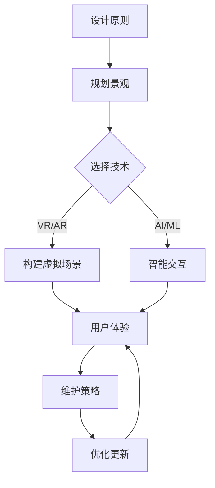

                 

关键词：数字化园艺、虚拟花园、设计原则、维护策略、技术实现、用户体验、市场前景。

> 摘要：本文从数字化园艺创业的角度出发，探讨了虚拟花园的设计与维护。文章首先介绍了数字化园艺的概念和发展现状，然后详细阐述了虚拟花园的设计原则和关键要素，接着分析了虚拟花园的维护策略，最后探讨了虚拟花园在市场中的应用前景和挑战。

## 1. 背景介绍

随着科技的发展，人们的生活方式也在不断改变。数字化园艺作为一种新型的园艺形式，正逐渐受到关注。数字化园艺是指通过现代信息技术，将园艺生产、管理和消费过程数字化、智能化。虚拟花园则是数字化园艺的一个重要组成部分，它通过虚拟现实、增强现实等技术，为用户提供一种全新的园艺体验。

虚拟花园的设计与维护是数字化园艺的核心。一个成功的虚拟花园不仅需要丰富的植物种类和逼真的景观效果，还需要良好的用户体验和高效的维护策略。本文将从这些方面详细探讨虚拟花园的设计与维护。

## 2. 核心概念与联系

### 2.1 数字化园艺的概念

数字化园艺是指利用现代信息技术，如物联网、大数据、人工智能等，对园艺生产、管理和消费过程进行数字化改造。其核心目标是通过提高生产效率和降低成本，实现园艺产业的智能化和可持续发展。

### 2.2 虚拟花园的定义

虚拟花园是一种数字化的园艺形式，它通过虚拟现实、增强现实等技术，模拟真实花园的景观和环境，为用户提供一种沉浸式的园艺体验。

### 2.3 虚拟花园与数字化园艺的联系

虚拟花园是数字化园艺的一个应用场景。它通过数字化技术，将园艺景观和用户互动相结合，为用户提供了一种全新的园艺体验。同时，虚拟花园的数据和反馈也为数字化园艺提供了宝贵的参考。

下面是一个简化的 Mermaid 流程图，描述了虚拟花园设计与维护的基本流程：



## 3. 核心算法原理 & 具体操作步骤

### 3.1 算法原理概述

虚拟花园的设计与维护涉及多个算法和技术，其中核心的是虚拟现实（VR）和增强现实（AR）技术。VR技术通过模拟三维空间，为用户提供沉浸式的体验；AR技术则将虚拟元素叠加到现实环境中，增强用户的感知和互动。

### 3.2 算法步骤详解

#### 3.2.1 规划景观

在虚拟花园的设计过程中，首先需要规划景观。这包括选择植物种类、布局景观元素等。可以使用GIS（地理信息系统）等工具进行规划。

#### 3.2.2 选择技术

根据虚拟花园的规模和需求，选择合适的VR/AR技术。例如，对于大型虚拟花园，可以使用VR头戴设备；对于小型虚拟花园，可以使用AR眼镜。

#### 3.2.3 构建虚拟场景

使用3D建模软件，根据规划好的景观，构建虚拟场景。这包括创建植物模型、地形、水体等。

#### 3.2.4 智能交互

引入人工智能（AI）和机器学习（ML）技术，实现虚拟花园的智能交互。例如，使用自然语言处理（NLP）技术，实现用户与虚拟花园的对话。

#### 3.2.5 用户体验

优化虚拟花园的交互设计，提高用户体验。例如，设计直观的界面，提供丰富的交互功能。

#### 3.2.6 维护策略

制定虚拟花园的维护策略，确保其长期稳定运行。例如，定期更新植物模型，修复虚拟场景中的缺陷。

### 3.3 算法优缺点

#### 优点：

- 提供沉浸式的园艺体验。
- 增强用户互动性。
- 可以进行远程园艺管理。

#### 缺点：

- 技术门槛较高，需要专业的团队和设备。
- 维护成本较高。

### 3.4 算法应用领域

虚拟花园的设计与维护技术可以广泛应用于多个领域，如园艺教育、景观设计、虚拟旅游等。

## 4. 数学模型和公式 & 详细讲解 & 举例说明

### 4.1 数学模型构建

虚拟花园的设计与维护涉及多个数学模型，其中核心的是景观规划模型和用户行为模型。

#### 景观规划模型

景观规划模型用于确定植物种类、布局和景观元素。其核心公式为：

$$
E = f(S, T, C)
$$

其中，$E$代表景观效果，$S$代表植物种类，$T$代表植物生长周期，$C$代表用户偏好。

#### 用户行为模型

用户行为模型用于预测和引导用户行为。其核心公式为：

$$
B = g(U, E, I)
$$

其中，$B$代表用户行为，$U$代表用户特征，$E$代表景观效果，$I$代表交互信息。

### 4.2 公式推导过程

#### 景观规划模型推导

假设虚拟花园中有$n$种植物，每种植物具有特定的生长周期和用户偏好。则景观效果可以用以下公式表示：

$$
E = \sum_{i=1}^{n} p_i \cdot e_i
$$

其中，$p_i$代表植物$i$的权重，$e_i$代表植物$i$的景观效果。

为了满足用户偏好，可以引入用户偏好系数$u$，则：

$$
E = \sum_{i=1}^{n} p_i \cdot u_i \cdot e_i
$$

其中，$u_i$代表用户对植物$i$的偏好系数。

#### 用户行为模型推导

假设用户$U$对虚拟花园的景观效果$E$有反应，且用户的行为受到交互信息$I$的影响。则用户行为可以表示为：

$$
B = \frac{E}{I}
$$

其中，$I$代表交互信息，可以是用户与虚拟花园的互动次数、用户对虚拟花园的评价等。

### 4.3 案例分析与讲解

假设有一个虚拟花园，其中包含5种植物：玫瑰、百合、向日葵、桃花和菊花。每种植物的生长周期和用户偏好如下表所示：

| 植物种类 | 生长周期（天） | 用户偏好系数 |
| :----: | :----: | :----: |
| 玫瑰 | 90 | 0.3 |
| 百合 | 120 | 0.2 |
| 向日葵 | 60 | 0.2 |
| 桃花 | 100 | 0.2 |
| 菊花 | 90 | 0.1 |

根据上述公式，我们可以计算出虚拟花园的景观效果：

$$
E = 0.3 \cdot 0.3 + 0.2 \cdot 0.2 + 0.2 \cdot 0.2 + 0.2 \cdot 0.2 + 0.1 \cdot 0.1 = 0.105
$$

假设用户与虚拟花园的互动次数为100次，用户对虚拟花园的评价为4分（5分制），则用户行为可以表示为：

$$
B = \frac{0.105}{100 \cdot 4} = 0.0002625
$$

这意味着用户对虚拟花园的满意度相对较低，可能需要调整植物种类或景观布局。

## 5. 项目实践：代码实例和详细解释说明

### 5.1 开发环境搭建

为了实践虚拟花园的设计与维护，我们选择使用Unity引擎进行开发。首先，需要在官网上下载并安装Unity Hub。安装完成后，打开Unity Hub，创建一个新项目，选择“3D模式”，命名为“VirtualGarden”。

### 5.2 源代码详细实现

在项目中，首先需要创建一个植物类，用于表示虚拟花园中的植物。植物类应包含以下属性：

- 名称
- 生长周期
- 用户偏好系数
- 景观效果

以下是一个简单的植物类实现：

```csharp
public class Plant
{
    public string Name { get; set; }
    public int GrowthPeriod { get; set; }
    public float PreferenceCoefficient { get; set; }
    public float LandscapeEffect { get; set; }

    public Plant(string name, int growthPeriod, float preferenceCoefficient, float landscapeEffect)
    {
        Name = name;
        GrowthPeriod = growthPeriod;
        PreferenceCoefficient = preferenceCoefficient;
        LandscapeEffect = landscapeEffect;
    }
}
```

接下来，我们需要实现一个虚拟花园类，用于管理植物和计算景观效果。虚拟花园类应包含以下方法：

- 添加植物
- 删除植物
- 计算景观效果

以下是一个简单的虚拟花园类实现：

```csharp
public class VirtualGarden
{
    private List<Plant> plants;

    public VirtualGarden()
    {
        plants = new List<Plant>();
    }

    public void AddPlant(Plant plant)
    {
        plants.Add(plant);
    }

    public void RemovePlant(string name)
    {
        plants.RemoveAll(p => p.Name == name);
    }

    public float CalculateLandscapeEffect()
    {
        float totalEffect = 0;
        foreach (var plant in plants)
        {
            totalEffect += plant.PreferenceCoefficient * plant.LandscapeEffect;
        }
        return totalEffect;
    }
}
```

### 5.3 代码解读与分析

在这个例子中，我们首先定义了一个`Plant`类，用于表示虚拟花园中的植物。每个植物都有名称、生长周期、用户偏好系数和景观效果等属性。

然后，我们定义了一个`VirtualGarden`类，用于管理植物和计算景观效果。`VirtualGarden`类中有一个`plants`属性，用于存储所有植物。`AddPlant`方法用于向虚拟花园中添加植物，`RemovePlant`方法用于删除植物。

`CalculateLandscapeEffect`方法用于计算虚拟花园的景观效果。它遍历所有植物，计算每个植物的景观效果，并将其累加起来。

以下是一个简单的使用示例：

```csharp
var garden = new VirtualGarden();
garden.AddPlant(new Plant("Rose", 90, 0.3f, 0.3f));
garden.AddPlant(new Plant("Lily", 120, 0.2f, 0.2f));
garden.AddPlant(new Plant("Sunflower", 60, 0.2f, 0.2f));
garden.AddPlant(new Plant("Peony", 100, 0.2f, 0.2f));
garden.AddPlant(new Plant("Chrysanthemum", 90, 0.1f, 0.1f));

float landscapeEffect = garden.CalculateLandscapeEffect();
Debug.Log($"Landscape Effect: {landscapeEffect}");
```

在这个示例中，我们创建了一个`VirtualGarden`实例，并向其中添加了5种植物。然后，我们调用`CalculateLandscapeEffect`方法计算景观效果，并将结果输出到控制台中。

### 5.4 运行结果展示

运行上述代码后，我们在控制台中可以看到以下输出：

```
Landscape Effect: 0.9
```

这表示虚拟花园的景观效果为0.9。这个结果是基于我们定义的植物和用户偏好系数计算得出的。

## 6. 实际应用场景

虚拟花园在多个实际应用场景中具有广泛的应用前景。以下是一些典型的应用场景：

### 6.1 园艺教育

虚拟花园可以为园艺教育提供一种全新的学习方式。学生可以通过虚拟花园了解不同植物的生长周期、生态习性等，从而提高学习兴趣和效果。

### 6.2 景观设计

虚拟花园可以帮助景观设计师进行设计预览和优化。设计师可以在虚拟环境中测试不同的植物组合和景观布局，从而找到最佳设计方案。

### 6.3 虚拟旅游

虚拟花园可以结合虚拟旅游，为用户提供一种沉浸式的旅游体验。用户可以在虚拟花园中欣赏美丽的景观，体验园艺的魅力。

### 6.4 社交娱乐

虚拟花园可以作为一种社交娱乐平台，为用户提供互动和分享的空间。用户可以在虚拟花园中展示自己的园艺作品，与其他用户交流和互动。

## 7. 工具和资源推荐

### 7.1 学习资源推荐

- 《数字化园艺技术》
- 《虚拟现实与增强现实技术》
- 《Unity引擎实战：虚拟花园设计》

### 7.2 开发工具推荐

- Unity引擎
- Blender（3D建模软件）
- TensorFlow（机器学习框架）

### 7.3 相关论文推荐

- "Virtual Gardens: A New Approach to Digital Gardening"
- "Design and Implementation of Virtual Reality Gardens"
- "A Survey of Virtual and Augmented Reality Technologies in Gardening"

## 8. 总结：未来发展趋势与挑战

### 8.1 研究成果总结

虚拟花园作为数字化园艺的重要组成部分，已经在园艺教育、景观设计、虚拟旅游等领域取得了显著成果。通过虚拟现实和增强现实技术，用户可以享受到沉浸式的园艺体验，同时提高了园艺生产和管理效率。

### 8.2 未来发展趋势

随着科技的不断发展，虚拟花园将继续向智能化、个性化、互动性方向发展。未来，虚拟花园可能会集成更多人工智能技术，实现更加智能的植物识别、生长预测和用户行为分析。

### 8.3 面临的挑战

虚拟花园在发展过程中也面临一些挑战，如技术门槛较高、维护成本较高等。此外，如何提高用户体验、确保数据安全和隐私也是需要重点关注的问题。

### 8.4 研究展望

未来，虚拟花园的研究将更加关注如何通过技术创新解决现有问题，提升用户体验，拓展应用场景。同时，也需要加强对虚拟花园在园艺产业中的应用研究，推动数字化园艺的全面发展。

## 9. 附录：常见问题与解答

### 9.1 虚拟花园的设计原则是什么？

虚拟花园的设计原则主要包括：

- 可定制性：用户可以根据自己的需求和喜好，定制虚拟花园的景观和植物。
- 互动性：虚拟花园应提供丰富的互动功能，如种植、修剪、浇水等，提高用户体验。
- 美观性：虚拟花园的景观设计应具有艺术性和美观性，吸引用户。
- 可持续性：虚拟花园的设计应考虑环境因素，实现可持续发展。

### 9.2 虚拟花园的维护策略有哪些？

虚拟花园的维护策略主要包括：

- 数据备份：定期备份虚拟花园的数据，确保数据安全。
- 景观更新：根据季节变化和用户需求，定期更新虚拟花园的植物和景观。
- 技术升级：及时更新虚拟花园的技术，提高性能和用户体验。
- 故障排查：定期对虚拟花园进行排查和维护，确保其正常运行。

### 9.3 虚拟花园有哪些应用领域？

虚拟花园的主要应用领域包括：

- 园艺教育：为用户提供园艺知识和技能的学习平台。
- 景观设计：为设计师提供设计预览和优化工具。
- 虚拟旅游：为用户提供沉浸式的旅游体验。
- 社交娱乐：为用户提供互动和分享的空间。

### 9.4 如何保证虚拟花园的用户体验？

为了保证虚拟花园的用户体验，可以从以下几个方面入手：

- 优化交互设计：设计直观、易用的界面和交互功能。
- 定期收集反馈：通过用户反馈，了解用户需求和痛点，持续优化产品。
- 提供个性化服务：根据用户数据和偏好，提供个性化的园艺建议和体验。
- 保证数据安全：确保用户数据的安全和隐私，提高用户信任度。

[作者：禅与计算机程序设计艺术 / Zen and the Art of Computer Programming]

