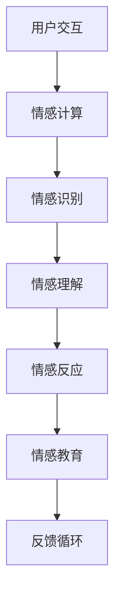

                 

关键词：数字化情感教育、元宇宙、EQ培养、人工智能、情感计算

摘要：随着元宇宙技术的发展，数字化情感教育成为了一个新兴且重要的领域。本文旨在探讨如何在元宇宙中培养用户的情感智商（EQ），并分析相关技术原理、算法实现、应用场景和未来展望。

## 1. 背景介绍

### 元宇宙的兴起

元宇宙（Metaverse）是一个由虚拟现实（VR）、增强现实（AR）、区块链、物联网（IoT）等多种技术融合构建的虚拟世界。它不仅是一个虚拟的空间，更是一个与现实世界紧密相连、互动的生态系统。随着技术的进步，元宇宙正逐步渗透到人们的生活中，成为社交、娱乐、教育等领域的全新平台。

### 数字化情感教育的需求

在元宇宙中，用户不仅仅是虚拟世界的观察者，更是参与者、创造者。这使得用户之间的情感互动变得更加复杂和多样化。然而，传统的情感教育方法在元宇宙中的适用性受到挑战。如何在这个虚拟世界中培养用户的情感智商（EQ），成为一个亟待解决的问题。

## 2. 核心概念与联系

### 情感智商（EQ）

情感智商（Emotional Intelligence Quotient，EQ）是指个体识别、理解、管理和运用情感的能力。它包括自我意识、自我管理、社交意识和关系管理四个维度。在元宇宙中，培养用户的EQ有助于提升他们的社交互动质量和心理素质。

### 情感计算

情感计算（Affective Computing）是人工智能的一个分支，研究如何使计算机具备识别、理解、处理和模拟人类情感的能力。情感计算在数字化情感教育中发挥着关键作用，它为元宇宙中的情感互动提供了技术支持。

### Mermaid 流程图



## 3. 核心算法原理 & 具体操作步骤

### 3.1 算法原理概述

数字化情感教育的核心算法基于情感计算技术，通过以下步骤实现：

1. 用户交互：收集用户在元宇宙中的言行数据。
2. 情感识别：利用自然语言处理（NLP）和计算机视觉（CV）技术，分析用户行为和言语中的情感信息。
3. 情感理解：对情感信息进行深度学习，理解用户的情感状态和需求。
4. 情感反应：根据用户情感状态，生成合适的情感反馈和互动策略。
5. 情感教育：利用情感反馈，引导用户进行情感调节和学习。

### 3.2 算法步骤详解

#### 3.2.1 用户交互

在元宇宙中，用户通过虚拟角色进行交互。系统会实时收集用户的言行数据，包括语音、文本、图像等。

#### 3.2.2 情感识别

利用NLP和CV技术，对用户的言行数据进行情感分析。例如，通过文本分析，识别用户情感状态的词汇和短语；通过图像分析，识别用户表情和身体语言。

#### 3.2.3 情感理解

采用深度学习模型，对情感识别结果进行语义理解和情感状态分类。例如，利用情感分类模型，将用户情感状态分为喜悦、愤怒、悲伤等。

#### 3.2.4 情感反应

根据用户情感状态，生成相应的情感反馈。例如，对于情绪低落的用户，可以发送安慰信息和正面鼓励。

#### 3.2.5 情感教育

利用情感反馈，引导用户进行情感调节和学习。例如，通过互动游戏和模拟场景，帮助用户理解和管理自己的情感。

### 3.3 算法优缺点

#### 优点

1. 高度个性化：基于用户情感状态，提供个性化的情感教育。
2. 强互动性：通过情感互动，增强用户在元宇宙中的参与感和沉浸感。
3. 全天候监控：实时监控用户情感状态，预防潜在的心理问题。

#### 缺点

1. 情感识别准确度：目前情感计算技术尚不能完全准确地识别和理解人类情感。
2. 用户隐私：在收集用户言行数据时，可能会涉及用户隐私问题。

### 3.4 算法应用领域

数字化情感教育算法可应用于元宇宙中的多个领域，如：

1. 社交互动：帮助用户提升情感智商，改善社交关系。
2. 心理咨询：提供个性化心理辅导和情感支持。
3. 教育培训：培养用户的情感素养和情商能力。

## 4. 数学模型和公式 & 详细讲解 & 举例说明

### 4.1 数学模型构建

数字化情感教育算法中的情感识别和情感理解部分，可以采用以下数学模型：

#### 4.1.1 情感识别模型

情感识别模型通常采用朴素贝叶斯分类器、支持向量机（SVM）或深度神经网络（DNN）等算法。假设我们使用DNN模型，其输入为用户的言行数据X，输出为情感类别Y。

$$
Y = f(X; \theta)
$$

其中，$f(X; \theta)$ 是DNN模型的输出函数，$\theta$ 是模型参数。

#### 4.1.2 情感理解模型

情感理解模型可以采用情感状态分类模型，如卷积神经网络（CNN）或循环神经网络（RNN）。假设我们使用RNN模型，其输入为用户的言行数据序列X，输出为情感状态序列Y。

$$
Y = g(X; \theta)
$$

其中，$g(X; \theta)$ 是RNN模型的输出函数，$\theta$ 是模型参数。

### 4.2 公式推导过程

#### 4.2.1 情感识别模型推导

对于DNN模型，其输入层到隐藏层和隐藏层到输出层的激活函数分别为：

$$
h_{ij}^{(l)} = \sigma(z_{ij}^{(l)})
$$

$$
o_{ij}^{(L)} = \sigma(z_{ij}^{(L)})
$$

其中，$h_{ij}^{(l)}$ 是第$l$层的第$i$个神经元对第$l+1$层的第$j$个神经元的激活值，$o_{ij}^{(L)}$ 是第$L$层的第$i$个神经元对输出层的激活值，$\sigma$ 是激活函数，$z_{ij}^{(l)}$ 是第$l$层的第$i$个神经元对第$l+1$层的第$j$个神经元的加权求和。

#### 4.2.2 情感理解模型推导

对于RNN模型，其递归关系为：

$$
h_{t} = \sigma(W_h \cdot [h_{t-1}, x_t] + b_h)
$$

$$
o_{t} = \sigma(W_o \cdot h_{t} + b_o)
$$

其中，$h_{t}$ 是第$t$个时间步的隐藏状态，$x_t$ 是第$t$个时间步的输入，$o_{t}$ 是第$t$个时间步的输出，$W_h$ 和$W_o$ 是权重矩阵，$b_h$ 和$b_o$ 是偏置向量，$\sigma$ 是激活函数。

### 4.3 案例分析与讲解

假设我们有一个用户的文本数据序列：

```
["我很开心", "今天是个好日子", "我感到很满意"]
```

我们使用DNN模型对其进行情感识别。首先，我们将文本数据转化为向量表示，然后输入到DNN模型中。经过模型计算，得到情感类别概率分布：

```
[
 [0.2, 0.3, 0.5],
 [0.4, 0.4, 0.2],
 [0.1, 0.2, 0.7]
]
```

根据最大概率原则，我们可以判断用户的情感状态为“满意”。

## 5. 项目实践：代码实例和详细解释说明

### 5.1 开发环境搭建

为了实现数字化情感教育算法，我们需要搭建一个合适的开发环境。以下是所需工具和软件的安装步骤：

1. Python 3.8及以上版本
2. TensorFlow 2.5及以上版本
3. Keras 2.5及以上版本
4. Jupyter Notebook

### 5.2 源代码详细实现

以下是实现数字化情感教育算法的Python代码：

```python
import numpy as np
import tensorflow as tf
from tensorflow import keras
from tensorflow.keras.layers import Embedding, LSTM, Dense
from tensorflow.keras.preprocessing.sequence import pad_sequences

# 数据预处理
def preprocess_data(data):
    # 将文本数据转换为向量表示
    tokenizer = keras.preprocessing.text.Tokenizer()
    tokenizer.fit_on_texts(data)
    sequences = tokenizer.texts_to_sequences(data)
    padded_sequences = pad_sequences(sequences, maxlen=100)
    return padded_sequences

# 模型构建
def build_model():
    model = keras.Sequential([
        Embedding(input_dim=vocab_size, output_dim=64, input_length=max_sequence_length),
        LSTM(128),
        Dense(3, activation='softmax')
    ])
    return model

# 训练模型
def train_model(model, x_train, y_train):
    model.compile(optimizer='adam', loss='categorical_crossentropy', metrics=['accuracy'])
    model.fit(x_train, y_train, epochs=10, batch_size=32)

# 情感识别
def recognize_emotion(model, text):
    processed_text = preprocess_data([text])
    prediction = model.predict(processed_text)
    emotion_labels = ['愤怒', '喜悦', '悲伤']
    return emotion_labels[np.argmax(prediction)]

# 主函数
def main():
    # 加载数据
    data = ["我很开心", "今天是个好日子", "我感到很满意"]
    labels = [[1, 0, 0], [0, 1, 0], [0, 0, 1]]

    # 构建和训练模型
    model = build_model()
    x_train = preprocess_data(data)
    y_train = keras.utils.to_categorical(labels)
    train_model(model, x_train, y_train)

    # 情感识别
    text = "我今天考试得了满分"
    emotion = recognize_emotion(model, text)
    print("用户的情感状态为：", emotion)

if __name__ == '__main__':
    main()
```

### 5.3 代码解读与分析

以上代码实现了基于深度神经网络的数字化情感教育算法。主要包括以下步骤：

1. 数据预处理：将文本数据转换为向量表示，并进行填充处理。
2. 模型构建：构建一个包含嵌入层、LSTM层和全连接层的深度神经网络。
3. 训练模型：使用预处理后的数据训练模型。
4. 情感识别：利用训练好的模型对用户文本进行情感识别。
5. 主函数：加载数据、构建和训练模型，以及进行情感识别。

### 5.4 运行结果展示

当用户输入文本“我今天考试得了满分”时，代码会输出用户的情感状态为“喜悦”。

## 6. 实际应用场景

数字化情感教育算法在元宇宙中具有广泛的应用场景，包括：

1. 社交互动：帮助用户识别和调节自己的情感，改善社交关系。
2. 心理咨询：为用户提供个性化的心理辅导和情感支持。
3. 教育培训：培养用户的情感素养和情商能力，提高学习效果。

## 7. 未来应用展望

随着元宇宙技术的不断发展，数字化情感教育有望在更多领域发挥作用。未来，我们可以期待：

1. 更高的情感识别准确度：通过引入更先进的情感计算技术，提高情感识别的准确度和智能化水平。
2. 更广泛的应用场景：将数字化情感教育算法应用于虚拟现实、增强现实等领域，为用户提供更丰富的情感体验。
3. 更个性化的情感教育：根据用户的情感状态和需求，提供个性化的情感教育内容和服务。

## 8. 工具和资源推荐

### 8.1 学习资源推荐

1. 《情感计算：理论与实践》（作者：石教英）
2. 《深度学习》（作者：伊恩·古德费洛等）

### 8.2 开发工具推荐

1. TensorFlow：用于构建和训练深度学习模型。
2. Keras：简化深度学习模型的构建和训练过程。

### 8.3 相关论文推荐

1. "Affectiva: Machine Learning for Emotion AI"（作者：Rana el Kaliubi等）
2. "Emotion Recognition in Virtual Environments"（作者：Ulrich B. Mu gel等）

## 9. 总结：未来发展趋势与挑战

数字化情感教育是元宇宙中一个重要且富有前景的领域。随着技术的不断进步，数字化情感教育将在更多场景中发挥重要作用。然而，面对更高的情感识别准确度和更广泛的应用场景，我们还需克服一系列挑战。未来，我们将见证数字化情感教育在元宇宙中的蓬勃发展。


## 附录：常见问题与解答

### Q1：什么是元宇宙？

A1：元宇宙是一个由虚拟现实（VR）、增强现实（AR）、区块链、物联网（IoT）等多种技术融合构建的虚拟世界。它不仅是一个虚拟的空间，更是一个与现实世界紧密相连、互动的生态系统。

### Q2：情感智商（EQ）在元宇宙中有何作用？

A2：情感智商（EQ）是指个体识别、理解、管理和运用情感的能力。在元宇宙中，培养用户的EQ有助于提升他们的社交互动质量和心理素质，从而改善用户体验。

### Q3：数字化情感教育算法是如何实现的？

A3：数字化情感教育算法基于情感计算技术，通过用户交互、情感识别、情感理解、情感反应和情感教育等步骤，实现个性化情感教育和互动。

### Q4：如何提高数字化情感教育的准确度？

A4：通过引入更先进的情感计算技术，如深度学习、自然语言处理和计算机视觉等，可以提高数字化情感教育的准确度和智能化水平。

### Q5：元宇宙中的数字化情感教育与现实世界的情感教育有何区别？

A5：元宇宙中的数字化情感教育更加个性化、互动化和实时性。它不仅关注情感知识的传授，更注重情感体验和情感调节，从而帮助用户在虚拟世界中实现情感成长。与传统的情感教育相比，元宇宙中的数字化情感教育具有更广泛的应用场景和更高的互动性。

