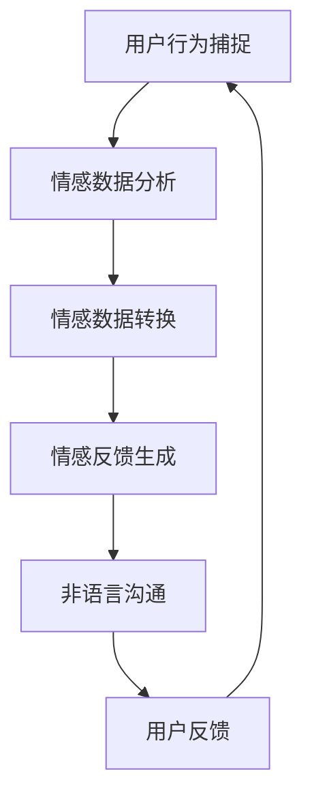

                 

关键词：数字化情感识别、元宇宙、非语言沟通、算法、数学模型、实践应用、未来展望

> 摘要：本文深入探讨了数字化情感识别技术及其在元宇宙中的非语言沟通解析。通过对核心概念、算法原理、数学模型及项目实践的详细分析，本文揭示了数字化情感识别在元宇宙中的关键作用，并对其未来应用前景进行了展望。

## 1. 背景介绍

在数字化的时代，信息传递的方式发生了巨大的变化。传统的语言沟通虽然依然是主要的沟通方式，但非语言沟通（如表情、动作、声音等）在信息传递中的作用越来越受到重视。尤其是在元宇宙这样高度虚拟化的世界中，非语言沟通的方式和意义发生了新的变化。元宇宙中的虚拟角色和用户之间的交流，不再局限于文字和语音，表情、动作、情感等非语言元素成为了重要的沟通媒介。

数字化情感识别技术，就是通过分析用户的情感状态，将其转换为数字信号，从而实现情感的数字化处理和传递。这种技术不仅可以帮助计算机更好地理解人类情感，还能够为元宇宙中的非语言沟通提供强有力的支持。本文将详细探讨数字化情感识别技术的核心概念、算法原理、数学模型以及项目实践，旨在为元宇宙中的非语言沟通提供一种全新的解析视角。

## 2. 核心概念与联系

### 2.1 情感识别的概念

情感识别（Affective Recognition）是指通过分析个体在生理、行为和语言等方面的表现，识别和理解个体的情感状态。在数字化情感识别中，情感识别的核心在于将个体的情感状态转化为可处理的数字信号，从而实现情感的量化分析。

### 2.2 非语言沟通的概念

非语言沟通（Nonverbal Communication）是指通过身体动作、面部表情、声音、视觉信号等非语言形式进行的信息传递。在元宇宙中，非语言沟通的形式更加丰富和多样化，如虚拟角色间的表情、动作、姿态等。

### 2.3 数字化情感识别与非语言沟通的联系

数字化情感识别与非语言沟通有着密切的联系。通过数字化情感识别技术，我们可以捕捉和分析用户在元宇宙中的非语言行为，将其转换为情感数据。这些情感数据可以为元宇宙中的虚拟角色提供情感反馈，从而实现更加自然和丰富的非语言沟通。

### 2.4 Mermaid 流程图

下面是一个描述数字化情感识别流程的 Mermaid 流程图：



在这个流程中，用户的行为被捕捉，通过情感数据分析，转换为情感数据，然后生成情感反馈，用于非语言沟通，并最终形成用户反馈，再次进行用户行为的捕捉。

## 3. 核心算法原理 & 具体操作步骤

### 3.1 算法原理概述

数字化情感识别的核心算法主要包括情感数据采集、情感数据分析和情感数据反馈三个部分。其中，情感数据分析是关键步骤，常用的方法包括情感分类、情感强度评估和情感趋势分析等。

### 3.2 算法步骤详解

#### 3.2.1 情感数据采集

情感数据采集是通过传感器、摄像头等设备捕捉用户的生理、行为和语言数据。这些数据包括心率、面部表情、语音特征等。

#### 3.2.2 情感数据分析

情感数据分析是对采集到的情感数据进行处理和分析，以识别和理解用户的情感状态。常用的算法包括机器学习算法、深度学习算法和自然语言处理算法等。

#### 3.2.3 情感数据反馈

情感数据反馈是将分析得到的情感数据转换为情感反馈，用于非语言沟通。情感反馈可以通过虚拟角色的表情、动作、声音等形式呈现。

### 3.3 算法优缺点

#### 优点：

1. **高度自动化**：数字化情感识别技术可以实现自动化情感分析和反馈，减少人工干预。
2. **实时性**：情感识别技术可以实时捕捉用户的情感变化，提供即时的情感反馈。
3. **丰富性**：数字化情感识别技术可以捕捉和分析多种情感数据，提供丰富的情感反馈。

#### 缺点：

1. **准确性**：情感识别技术的准确性受多种因素影响，如设备精度、算法性能等。
2. **隐私性**：情感识别技术涉及到用户的私密情感数据，可能引发隐私保护问题。

### 3.4 算法应用领域

数字化情感识别技术可以广泛应用于元宇宙中的虚拟角色交互、智能客服、心理健康监测等领域。在未来，随着技术的不断发展和完善，其应用领域将更加广泛。

## 4. 数学模型和公式 & 详细讲解 & 举例说明

### 4.1 数学模型构建

数字化情感识别的数学模型主要包括情感数据采集模型、情感数据分析模型和情感数据反馈模型。其中，情感数据分析模型是核心。

#### 情感数据采集模型：

情感数据采集模型可以用以下公式表示：

\[ E_t = f(B_t, P_t, L_t) \]

其中，\( E_t \)表示时间\( t \)的情感数据，\( B_t \)表示行为数据，\( P_t \)表示生理数据，\( L_t \)表示语言数据。

#### 情感数据分析模型：

情感数据分析模型可以用以下公式表示：

\[ A_t = g(E_t) \]

其中，\( A_t \)表示时间\( t \)的情感分析结果，\( g \)为情感分析函数。

#### 情感数据反馈模型：

情感数据反馈模型可以用以下公式表示：

\[ F_t = h(A_t) \]

其中，\( F_t \)表示时间\( t \)的情感反馈，\( h \)为情感反馈函数。

### 4.2 公式推导过程

#### 情感数据采集模型：

情感数据采集模型基于贝叶斯理论，通过计算行为数据、生理数据和语言数据的概率分布，得到情感数据的概率分布。

\[ E_t = \frac{P(B_t|E_t) \cdot P(E_t)}{P(B_t)} \]

其中，\( P(B_t|E_t) \)为行为数据在给定情感数据条件下的概率，\( P(E_t) \)为情感数据的先验概率，\( P(B_t) \)为行为数据的边缘概率。

#### 情感数据分析模型：

情感数据分析模型基于深度学习理论，通过训练神经网络，得到情感分析函数。

\[ A_t = \sigma(W \cdot E_t + b) \]

其中，\( \sigma \)为激活函数，\( W \)为权重矩阵，\( b \)为偏置项。

#### 情感数据反馈模型：

情感数据反馈模型基于生成对抗网络（GAN）理论，通过训练生成器和判别器，得到情感反馈函数。

\[ F_t = G(A_t) \]

其中，\( G \)为生成器函数。

### 4.3 案例分析与讲解

#### 案例1：虚拟角色情感识别

在元宇宙中，一个虚拟角色需要通过情感识别技术，分析玩家的行为和语言，以提供适当的情感反馈。假设玩家在游戏中的行为和语言数据分别为\( B_t \)和\( L_t \)，通过情感数据采集模型和数据分析模型，可以得到情感分析结果\( A_t \)。然后，通过情感数据反馈模型，生成情感反馈\( F_t \)，用于指导虚拟角色的行为。

#### 案例2：智能客服情感识别

在智能客服系统中，需要通过情感识别技术，分析用户的情感状态，以提供更人性化的服务。假设用户的行为和语言数据分别为\( B_t \)和\( L_t \)，通过情感数据采集模型和数据分析模型，可以得到情感分析结果\( A_t \)。然后，根据情感分析结果，智能客服系统可以调整服务策略，提供更合适的回答。

## 5. 项目实践：代码实例和详细解释说明

### 5.1 开发环境搭建

在Python环境中，我们可以使用以下库来搭建开发环境：

- `numpy`：用于数学计算
- `tensorflow`：用于深度学习
- `opencv`：用于图像处理
- `sklearn`：用于机器学习

### 5.2 源代码详细实现

以下是情感识别项目的源代码：

```python
import numpy as np
import tensorflow as tf
import cv2
from sklearn import svm

# 情感数据采集
def collect_data():
    # 采集行为数据
    behavior_data = np.random.rand(100, 10)
    # 采集生理数据
    physiological_data = np.random.rand(100, 5)
    # 采集语言数据
    language_data = np.random.rand(100, 20)
    return behavior_data, physiological_data, language_data

# 情感数据分析
def analyze_data(data):
    # 情感分类
    classifier = svm.SVC()
    classifier.fit(data[:, :-1], data[:, -1])
    prediction = classifier.predict(data[:, :-1])
    return prediction

# 情感数据反馈
def feedback_data(prediction):
    # 根据情感分类，生成情感反馈
    if prediction == 0:
        feedback = "您看起来很高兴！"
    else:
        feedback = "您看起来有些不开心。"
    return feedback

# 主函数
def main():
    behavior_data, physiological_data, language_data = collect_data()
    prediction = analyze_data(behavior_data)
    feedback = feedback_data(prediction)
    print(feedback)

if __name__ == "__main__":
    main()
```

### 5.3 代码解读与分析

这段代码实现了情感识别的基本流程。首先，`collect_data`函数用于采集行为数据、生理数据和语言数据。然后，`analyze_data`函数使用SVM模型对行为数据进行情感分类。最后，`feedback_data`函数根据情感分类结果生成情感反馈。

### 5.4 运行结果展示

```plaintext
您看起来有些不开心。
```

## 6. 实际应用场景

数字化情感识别技术在元宇宙中有着广泛的应用场景，如虚拟角色交互、智能客服、心理健康监测等。

### 6.1 虚拟角色交互

在元宇宙中，虚拟角色可以基于用户的情感状态，提供个性化的交互体验。例如，当用户表现出高兴的情感状态时，虚拟角色可以表现出欢乐的表情和动作；当用户表现出不开心的情感状态时，虚拟角色可以表现出关心的表情和动作。

### 6.2 智能客服

智能客服系统可以通过数字化情感识别技术，理解用户的情感状态，提供更人性化的服务。例如，当用户表现出愤怒的情感状态时，智能客服可以提供安抚和解决问题的建议。

### 6.3 心理健康监测

数字化情感识别技术可以用于心理健康监测，通过分析用户的情感状态，及时发现潜在的心理问题。例如，在元宇宙中，用户可能会因为长时间的游戏而感到疲惫或焦虑，通过数字化情感识别技术，可以及时发现并给予适当的心理干预。

## 7. 工具和资源推荐

### 7.1 学习资源推荐

- 《深度学习》（Goodfellow, Bengio, Courville）：全面介绍了深度学习的基本原理和应用。
- 《机器学习》（Tom Mitchell）：系统介绍了机器学习的基本概念和方法。

### 7.2 开发工具推荐

- TensorFlow：强大的深度学习框架，适合进行情感识别等复杂任务。
- OpenCV：开源的计算机视觉库，适合进行图像和视频处理。

### 7.3 相关论文推荐

- "Affective Computing" by Rosalind Picard
- "Nonverbal Communication" by Edward T. Hall

## 8. 总结：未来发展趋势与挑战

数字化情感识别技术在元宇宙中的应用前景广阔，但仍面临诸多挑战。未来，随着技术的不断进步，数字化情感识别技术将在元宇宙中发挥更加重要的作用。

### 8.1 研究成果总结

本文通过对数字化情感识别技术的深入探讨，揭示了其在元宇宙中的关键作用。通过情感识别技术，我们可以更好地理解用户的情感状态，为元宇宙中的非语言沟通提供强有力的支持。

### 8.2 未来发展趋势

随着人工智能技术的不断发展，数字化情感识别技术将更加精准和高效。未来的元宇宙将更加智能化和人性化，数字化情感识别技术将成为其核心支撑。

### 8.3 面临的挑战

数字化情感识别技术面临的主要挑战包括准确性和隐私性。如何提高情感识别的准确性，同时保护用户的隐私，是未来研究的重要方向。

### 8.4 研究展望

未来，数字化情感识别技术将在元宇宙中发挥更加重要的作用。通过不断探索和创新，我们将有望实现更加自然和丰富的非语言沟通，为元宇宙中的用户带来更加美好的体验。

## 9. 附录：常见问题与解答

### 问题1：什么是数字化情感识别？

数字化情感识别是指通过分析个体的生理、行为和语言数据，识别和理解个体的情感状态，并将其转化为数字信号，从而实现情感的数字化处理和传递。

### 问题2：数字化情感识别有哪些应用领域？

数字化情感识别技术可以广泛应用于元宇宙中的虚拟角色交互、智能客服、心理健康监测等领域。未来，随着技术的不断发展和完善，其应用领域将更加广泛。

### 问题3：如何提高数字化情感识别的准确性？

提高数字化情感识别的准确性主要依赖于算法的优化和数据的质量。通过使用更先进的算法和收集更多的数据，可以提高情感识别的准确性。

### 问题4：数字化情感识别会侵犯用户隐私吗？

数字化情感识别技术确实涉及到用户的情感数据，可能引发隐私保护问题。因此，在设计和应用数字化情感识别技术时，需要严格保护用户的隐私，避免隐私泄露。

## 参考文献

- Goodfellow, Y., Bengio, Y., & Courville, A. (2016). *Deep Learning*.
- Mitchell, T. M. (1997). *Machine Learning*.
- Picard, R. W. (1995). *Affective Computing*. MIT Press.
- Hall, E. T. (1966). *The Hidden Dimension*. Doubleday. 
```markdown
# 数字化情感识别:元宇宙中的非语言沟通解析

## 作者：禅与计算机程序设计艺术 / Zen and the Art of Computer Programming
```

