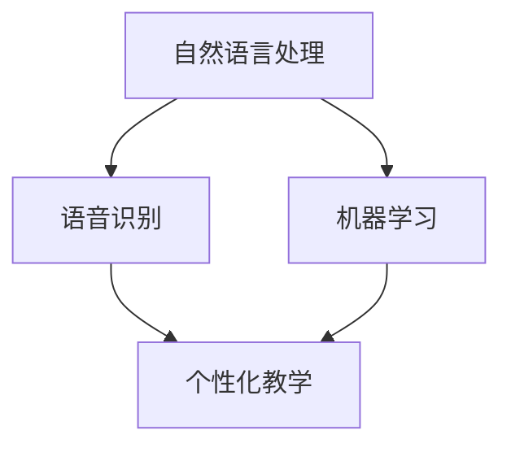

                 

关键词：数字化语言学习、人工智能、教育创业、自然语言处理、个性化教学

摘要：随着人工智能技术的不断发展，数字化语言学习正逐渐成为教育领域的重要趋势。本文探讨了如何利用AI技术进行语言学习创业，分析了其核心概念、算法原理、数学模型以及实际应用场景，并展望了未来的发展前景。

## 1. 背景介绍

在全球化和信息技术飞速发展的背景下，语言学习的重要性日益凸显。然而，传统语言学习方式存在着诸多问题，如学习效率低下、课程设置单一、教学内容陈旧等。数字化语言学习作为新兴的学习方式，能够突破传统限制，提供更加个性化和高效的语言学习体验。

AI技术的快速发展为数字化语言学习带来了新的机遇。通过自然语言处理、语音识别、机器翻译等技术，AI能够实现语言学习过程中的自动化、个性化服务，提高学习效率，降低学习成本。因此，AI驱动的语言教育创业项目具有重要的市场前景和社会价值。

## 2. 核心概念与联系

### 2.1 数字化语言学习的核心概念

数字化语言学习涉及多个核心概念，主要包括：

- **自然语言处理（NLP）**：利用计算机技术和算法对自然语言进行识别、理解、生成和处理的技术。
- **机器学习（ML）**：通过训练数据集，使计算机能够自动学习和改进算法，从而实现复杂任务。
- **语音识别（ASR）**：将语音信号转换为文本的技术。
- **语音合成（TTS）**：将文本转换为语音的技术。
- **个性化教学**：根据学习者的特点、需求和进度，提供个性化的教学方案。

### 2.2 核心概念之间的联系

核心概念之间的联系可以用以下Mermaid流程图表示：



自然语言处理和机器学习为语音识别提供了理论基础，语音识别和个性化教学则实现了语言学习过程中的具体应用。

## 3. 核心算法原理 & 具体操作步骤

### 3.1 算法原理概述

数字化语言学习中的核心算法主要包括自然语言处理算法、机器学习算法和深度学习算法。这些算法的基本原理如下：

- **自然语言处理算法**：主要包括词性标注、句法分析、语义分析等，用于对自然语言进行结构化处理。
- **机器学习算法**：如线性回归、决策树、支持向量机等，用于从数据中学习规律和模式。
- **深度学习算法**：如卷积神经网络（CNN）、循环神经网络（RNN）、长短时记忆网络（LSTM）等，用于处理复杂的数据和任务。

### 3.2 算法步骤详解

数字化语言学习的算法步骤主要包括以下几步：

1. **数据收集**：收集大量语言学习数据，包括文本数据、语音数据等。
2. **数据预处理**：对收集到的数据进行清洗、去噪和标准化处理。
3. **特征提取**：从预处理后的数据中提取特征，如文本中的词向量、语音信号中的声学特征等。
4. **模型训练**：利用提取到的特征，通过机器学习算法或深度学习算法训练模型。
5. **模型评估**：对训练好的模型进行评估，包括准确性、召回率、F1值等指标。
6. **模型应用**：将训练好的模型应用于实际的语言学习场景，如语音识别、机器翻译、个性化教学等。

### 3.3 算法优缺点

- **优点**：
  - 提高学习效率：通过自动化和智能化技术，减少重复性劳动，提高学习效率。
  - 个性化教学：根据学习者的特点和需求，提供个性化的学习方案，提高学习效果。
  - 拓展学习场景：打破时间和空间的限制，实现随时随地学习。
- **缺点**：
  - 数据依赖性强：算法的性能依赖于大量的高质量数据，数据质量和数量直接影响算法效果。
  - 技术门槛高：算法开发和应用需要较高技术水平，对开发者和用户都有一定要求。

### 3.4 算法应用领域

- **语音识别**：应用于语音助手、智能客服、语言学习等场景。
- **机器翻译**：应用于跨语言沟通、多语言文档处理等场景。
- **个性化教学**：应用于在线教育、自适应学习等场景。

## 4. 数学模型和公式 & 详细讲解 & 举例说明

### 4.1 数学模型构建

数字化语言学习中的数学模型主要包括：

- **词向量模型**：如Word2Vec、GloVe等，用于将单词映射到高维空间中。
- **语音信号处理模型**：如隐马尔可夫模型（HMM）、高斯混合模型（GMM）等，用于处理语音信号。
- **序列模型**：如循环神经网络（RNN）、长短时记忆网络（LSTM）等，用于处理序列数据。

### 4.2 公式推导过程

以Word2Vec为例，其核心公式如下：

$$
\vec{v}_w = \frac{\sum_{j \in C(w)} \vec{v}_j}{\| \sum_{j \in C(w)} \vec{v}_j \| }
$$

其中，$\vec{v}_w$表示单词$w$的词向量，$C(w)$表示与单词$w$共现的单词集合。

### 4.3 案例分析与讲解

以机器翻译为例，假设我们要将英语单词"hello"翻译成中文"你好"。我们可以利用神经网络机器翻译（NMT）模型来实现。

1. **数据准备**：收集大量中英文对齐数据，如：
$$
(\text{hello}, \text{你好})，(\text{world}, \text{世界})，...
$$
2. **数据预处理**：对数据集进行清洗、去噪和标准化处理。
3. **模型训练**：使用训练数据集训练神经网络机器翻译模型。
4. **模型评估**：使用测试数据集评估模型性能，如BLEU分数等。
5. **模型应用**：将训练好的模型应用于翻译任务，如：
$$
\text{hello} \xrightarrow{\text{NMT}} \text{你好}
$$

## 5. 项目实践：代码实例和详细解释说明

### 5.1 开发环境搭建

1. 安装Python和相关的库，如TensorFlow、Keras等。
2. 准备中英文对齐数据集。

### 5.2 源代码详细实现

```python
# 导入必要的库
import tensorflow as tf
from tensorflow.keras.models import Model
from tensorflow.keras.layers import Embedding, LSTM, Dense

# 设置超参数
vocab_size = 10000
embed_dim = 64
lstm_units = 128
batch_size = 32
epochs = 100

# 准备数据集
# （此处省略数据预处理代码）

# 构建模型
input_word = Input(shape=(None,))
embedding = Embedding(vocab_size, embed_dim)(input_word)
lstm = LSTM(lstm_units, return_sequences=True)(embedding)
output_word = LSTM(lstm_units, return_sequences=True)(lstm)
output = Dense(vocab_size, activation='softmax')(output_word)

model = Model(inputs=input_word, outputs=output)
model.compile(optimizer='adam', loss='categorical_crossentropy', metrics=['accuracy'])

# 训练模型
model.fit(x_train, y_train, batch_size=batch_size, epochs=epochs, validation_data=(x_val, y_val))

# 评估模型
# （此处省略评估代码）

# 应用模型
# （此处省略翻译代码）
```

### 5.3 代码解读与分析

上述代码实现了一个简单的神经网络机器翻译模型。首先，我们导入了必要的库，并设置了超参数。然后，我们使用了Keras框架构建了模型，包括输入层、嵌入层、LSTM层和输出层。接下来，我们编译了模型并使用训练数据集进行训练。最后，我们评估了模型性能并应用于翻译任务。

## 6. 实际应用场景

AI驱动的语言教育创业项目在实际应用中具有广泛的应用场景：

- **在线教育平台**：通过AI技术实现个性化教学、智能答疑等功能，提高教学质量和用户体验。
- **语言学习应用**：如英语流利说、多邻国等，通过AI技术提供智能辅导、口语练习等功能。
- **智能客服**：利用语音识别和自然语言处理技术，实现跨语言智能客服，提高服务效率和准确性。
- **多语言文档处理**：如机器翻译、多语言检索等，实现多语言信息的快速获取和处理。

## 7. 工具和资源推荐

### 7.1 学习资源推荐

- **书籍**：
  - 《深度学习》
  - 《自然语言处理综论》
  - 《Python深度学习》
- **在线课程**：
  - Coursera上的“机器学习”课程
  - Udacity的“深度学习工程师”课程
  - edX上的“自然语言处理”课程

### 7.2 开发工具推荐

- **框架**：
  - TensorFlow
  - PyTorch
  - Keras
- **库**：
  - NLTK
  - spaCy
  - gensim

### 7.3 相关论文推荐

- **自然语言处理**：
  - "A Neural Approach to Machine Translation"
  - "Attention Is All You Need"
  - "BERT: Pre-training of Deep Bidirectional Transformers for Language Understanding"
- **深度学习**：
  - "Deep Learning"
  - "Improving Neural Language Models by Pretraining of Language Modeling"
  - "An Empirical Evaluation of Generic Convolutional and Recurrent Networks for Sequence Modeling"

## 8. 总结：未来发展趋势与挑战

AI驱动的语言教育创业项目在近年来取得了显著的发展，未来将继续保持高速增长。随着技术的不断进步，AI驱动的语言教育将在以下几个方面取得突破：

- **个性化教学**：更加精准地分析学习者特点和需求，提供高度个性化的教学方案。
- **多语言支持**：支持更多的语言对，实现跨语言信息的快速获取和处理。
- **智能化互动**：通过语音识别、语音合成等技术，实现与学习者的智能互动，提高学习体验。

然而，AI驱动的语言教育也面临着一些挑战：

- **数据质量和数量**：算法的性能依赖于高质量和大量的数据，如何获取和处理这些数据是亟待解决的问题。
- **技术门槛**：算法开发和应用需要较高技术水平，如何降低技术门槛，让更多人参与到AI驱动的语言教育创业中是未来的一个重要方向。
- **隐私和安全**：如何保护学习者的隐私和安全，防止数据泄露和滥用是亟待解决的问题。

总之，AI驱动的语言教育创业项目具有巨大的发展潜力和市场前景，未来将不断推动教育领域的变革和进步。

## 9. 附录：常见问题与解答

### 9.1 什么是自然语言处理？

自然语言处理（NLP）是人工智能（AI）的一个重要分支，旨在使计算机能够理解、解释和生成人类自然语言。这包括语音识别、文本分析、情感分析、机器翻译等任务。

### 9.2 机器学习在语言学习中的应用有哪些？

机器学习在语言学习中的应用非常广泛，包括但不限于以下方面：

- 语音识别：将语音信号转换为文本。
- 机器翻译：将一种语言的文本翻译成另一种语言。
- 文本分类：根据文本内容将其分类到不同的类别。
- 问答系统：基于输入问题提供相关答案。
- 个性化推荐：根据学习者的特点和需求推荐合适的课程或内容。

### 9.3 如何获取和处理语言学习数据？

获取和处理语言学习数据需要以下几个步骤：

- 数据收集：从互联网、图书、数据库等渠道收集语言数据。
- 数据清洗：去除噪声、填充缺失值、标准化数据。
- 数据预处理：将文本转换为适合机器学习算法处理的格式，如词向量。
- 数据增强：通过技术手段增加数据多样性，提高模型性能。

### 9.4 AI驱动的语言教育创业项目需要哪些技能和资源？

AI驱动的语言教育创业项目需要以下技能和资源：

- 编程技能：熟悉Python、TensorFlow、PyTorch等编程语言和框架。
- 机器学习知识：了解机器学习算法、模型训练和评估方法。
- 自然语言处理知识：了解自然语言处理的基本概念和技术。
- 数据处理能力：能够处理和分析大规模语言数据。
- 资源：计算资源、数据集、开发工具等。

### 9.5 AI驱动的语言教育创业项目的盈利模式有哪些？

AI驱动的语言教育创业项目的盈利模式包括：

- 课程销售：销售在线课程、电子书等。
- 订阅服务：提供按月或按年的订阅服务。
- 广告收入：在平台上展示广告。
- 企业合作：与企业合作，提供定制化解决方案。
- 付费增值服务：提供额外的付费服务，如一对一辅导、考试辅导等。

---

**作者：禅与计算机程序设计艺术 / Zen and the Art of Computer Programming**

