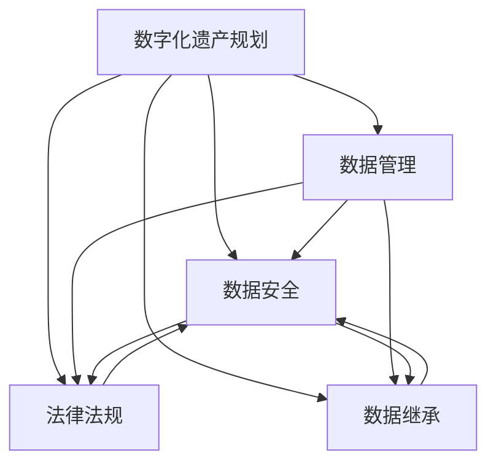

                 

### 关键词 Keywords
- 数字化遗产
- 数据管理
- 生命终期
- 遗产规划
- 数据保护
- 法律法规

### 摘要 Abstract
随着技术的快速发展，人们的数据资产越来越重要。如何妥善管理这些数据，确保它们在生命终期得到妥善处理，成为了一个重要议题。本文探讨了数字化遗产规划创业的背景和重要性，分析了生命终期的数据管理概念，提出了相关的核心算法原理、数学模型及实践案例。文章旨在为创业者和技术人员提供有价值的参考，帮助他们在开发数字化遗产规划解决方案时做出明智的选择。

## 1. 背景介绍 Background

### 1.1 数字化时代的遗产

在过去的几十年中，数字化技术迅速渗透到我们生活的方方面面，从个人通信到商业运营，再到科学研究，几乎每一个领域都受到了深远的影响。随着数字化进程的推进，我们的数据资产也在不断积累。这些数据不仅包括我们的社交媒体活动、电子商务交易记录，还涵盖了个人医疗信息、财务记录等敏感数据。

当我们思考遗产时，传统观念常常局限于物质财产的传承。然而，在数字化时代，数据遗产同样重要，甚至可能更加珍贵。数字化遗产不仅包括数据的本身，还包括数据生成和使用过程中的知识、习惯和经验。如何确保这些数据在生命终期能够得到妥善管理，成为了新一代遗产规划中的重要课题。

### 1.2 生命终期的数据管理

生命终期的数据管理，是指对个人在生命终结时所遗留的数据进行系统化、规范化的处理。这些数据可能包括个人文件、社交媒体账户、电子邮件、在线银行记录、健康记录等。随着社会对数据隐私和安全的重视程度不断提高，如何合法、安全地处理这些数据，成为了数字化遗产管理中的关键问题。

在生命终期，数据管理面临以下几个挑战：

1. **数据归属**：谁有权访问和管理某人在生命终期的数据？
2. **数据安全**：如何确保数据在传输和存储过程中不被泄露或篡改？
3. **法律合规**：不同国家和地区对于数据管理的法律法规有何不同，如何确保合规性？
4. **数据继承**：如何处理数据遗产的继承问题，确保继承人能够合法获得并使用这些数据？

### 1.3 数字化遗产规划创业的重要性

数字化遗产规划创业，旨在为用户提供系统化的数据管理解决方案，帮助他们在生命终期能够控制自己的数据，确保这些数据得到合法、安全的处理。这类创业项目的成功不仅有助于提升用户的数字生活质量，还能为社会带来以下几个方面的价值：

1. **隐私保护**：通过合法、透明的数据管理，增强用户对数据隐私的信心。
2. **信息传承**：帮助用户传承有价值的数据，使知识和经验得以延续。
3. **社会责任**：推动社会对数据管理和数据伦理的重视，促进数字社会的健康发展。
4. **商业机会**：随着数字化遗产规划的普及，相关产品和服务的市场需求将会不断增长，为创业者提供广阔的商业机会。

## 2. 核心概念与联系 Core Concepts and Relationships

为了深入理解数字化遗产规划创业，我们需要明确几个核心概念，并探讨它们之间的关系。

### 2.1 数字化遗产规划

数字化遗产规划是指用户在生前对自己的数字化遗产进行规划和管理的过程。这包括制定数据访问权限、数据备份、数据销毁策略等。数字化遗产规划的核心目的是确保用户在生命终期能够控制自己的数据，防止数据泄露或滥用。

### 2.2 数据管理

数据管理是指对数据从生成、存储、处理到销毁的全过程进行系统化、规范化的管理。在数字化遗产规划中，数据管理扮演着至关重要的角色，它确保了用户数据的安全性和隐私性。

### 2.3 数据安全

数据安全是指保护数据免受未经授权的访问、泄露、篡改和破坏。在数字化遗产规划中，数据安全是保障用户数据隐私和合法权益的基础。

### 2.4 法律法规

法律法规是指针对数据管理、数据安全等方面的法律和规章制度。在数字化遗产规划中，法律法规为数据管理提供了法律依据和规范，确保数据管理的合法性和合规性。

### 2.5 数据继承

数据继承是指用户在生命终结后，其数据由法定继承人继承和管理的过程。数据继承涉及到数据归属、数据安全、数据销毁等多个方面，是数字化遗产规划的重要内容。

### 2.6 数字化遗产规划与数据管理、数据安全、法律法规、数据继承的关系

数字化遗产规划与数据管理、数据安全、法律法规、数据继承之间存在紧密的联系。具体来说：

1. **数字化遗产规划**是数据管理和数据安全的基础，它为用户提供了数据管理的框架和策略。
2. **数据管理**是数字化遗产规划的核心执行过程，它确保了用户数据的安全性和隐私性。
3. **数据安全**是数字化遗产规划和数据管理的保障，它确保用户数据在生成、存储、处理和销毁过程中不受威胁。
4. **法律法规**为数字化遗产规划提供了法律依据和规范，确保数据管理的合法性和合规性。
5. **数据继承**是数字化遗产规划的一个重要方面，它确保用户的数据遗产能够得到合法的继承和管理。

### 2.7 Mermaid 流程图

以下是一个Mermaid流程图，展示了数字化遗产规划、数据管理、数据安全、法律法规和数据继承之间的逻辑关系。



## 3. 核心算法原理 & 具体操作步骤 Core Algorithm Principles & Operation Steps

### 3.1 算法原理概述

在数字化遗产规划创业中，核心算法主要涉及数据管理、数据安全和数据继承等方面。以下将分别介绍这些算法的原理。

#### 3.1.1 数据管理算法

数据管理算法主要目的是确保用户数据在生命终期能够得到有效的管理和保护。具体原理包括：

1. **数据分类**：根据数据的重要性和敏感性，对用户数据进行分类，以便于进行针对性的管理和保护。
2. **访问控制**：通过权限设置，确保只有授权用户可以访问特定的数据。
3. **数据备份**：定期备份用户数据，确保数据不会因意外丢失或损坏而无法恢复。
4. **数据销毁**：在用户生命终期，按照预定的策略销毁不再需要的用户数据，防止数据泄露。

#### 3.1.2 数据安全算法

数据安全算法旨在确保用户数据在生成、存储、传输和销毁过程中不被未经授权的访问、泄露、篡改和破坏。具体原理包括：

1. **加密技术**：使用加密算法对用户数据进行加密，确保数据在传输和存储过程中不被窃取或篡改。
2. **访问认证**：通过用户认证机制，确保只有合法用户才能访问数据。
3. **数据完整性**：通过校验和等技术，确保数据在传输和存储过程中未被篡改。
4. **数据备份与恢复**：定期备份数据，并在数据损坏或丢失时进行恢复，确保数据可用性。

#### 3.1.3 数据继承算法

数据继承算法主要目的是确保用户在生命终期能够将数据遗产合法地传递给继承人。具体原理包括：

1. **数据归属确认**：通过法律文件或遗嘱等方式，确认数据归属，确保继承人有权继承数据。
2. **数据访问权限设置**：根据继承人的需求和权限，设置数据访问权限，确保继承人能够合法地访问和利用数据。
3. **数据转移**：在用户生命终期，将数据从原用户账户转移到继承人账户，确保数据遗产的顺利继承。

### 3.2 算法步骤详解

以下将详细介绍每个算法的具体操作步骤。

#### 3.2.1 数据管理算法步骤

1. **数据分类**：
   - 收集用户数据，并进行初步筛选。
   - 根据数据的重要性和敏感性，将数据分为敏感数据和非敏感数据。

2. **访问控制**：
   - 为敏感数据设置访问权限，只有授权用户可以访问。
   - 为非敏感数据设置开放访问权限。

3. **数据备份**：
   - 定期备份用户数据，包括敏感数据和非敏感数据。
   - 选择合适的备份策略，如全备份、增量备份或差异备份。

4. **数据销毁**：
   - 在用户生命终期，按照预定的策略销毁不再需要的用户数据。
   - 使用数据销毁工具，确保数据无法恢复。

#### 3.2.2 数据安全算法步骤

1. **加密技术**：
   - 对用户数据进行加密，使用强加密算法，如AES。
   - 在数据传输和存储过程中，确保数据加密。

2. **访问认证**：
   - 实现用户认证机制，如密码认证、双因素认证。
   - 确保只有通过认证的用户才能访问数据。

3. **数据完整性**：
   - 使用校验和等技术，对数据进行完整性检查。
   - 在数据传输和存储过程中，确保数据完整性。

4. **数据备份与恢复**：
   - 定期备份用户数据，选择合适的备份策略。
   - 在数据损坏或丢失时，使用备份数据进行恢复。

#### 3.2.3 数据继承算法步骤

1. **数据归属确认**：
   - 收集用户遗嘱或法律文件，确认数据归属。
   - 确定继承人的身份和权限。

2. **数据访问权限设置**：
   - 根据继承人的需求和权限，设置数据访问权限。
   - 确保继承人能够合法地访问和利用数据。

3. **数据转移**：
   - 在用户生命终期，将数据从原用户账户转移到继承人账户。
   - 使用数据转移工具，确保数据顺利转移。

### 3.3 算法优缺点

#### 3.3.1 数据管理算法

**优点**：
- **安全性高**：通过数据分类、访问控制和数据销毁，确保用户数据在生命终期能够得到有效的管理和保护。
- **灵活性高**：用户可以根据自己的需求，自定义数据备份策略和访问控制规则。

**缺点**：
- **复杂性高**：数据管理算法涉及多个步骤，如数据分类、访问控制、数据备份和销毁，需要较高的技术实现成本。

#### 3.3.2 数据安全算法

**优点**：
- **安全性高**：通过加密技术、访问认证和数据完整性检查，确保用户数据在生成、存储、传输和销毁过程中不受威胁。
- **可扩展性高**：数据安全算法可以适用于不同的应用场景和数据类型。

**缺点**：
- **性能损耗**：加密和解密过程会增加数据传输和存储的开销，影响系统性能。
- **安全漏洞**：如果加密算法或访问认证机制被破解，可能导致数据泄露。

#### 3.3.3 数据继承算法

**优点**：
- **合法性高**：通过数据归属确认和数据访问权限设置，确保数据继承过程的合法性和合规性。
- **简化流程**：数据继承算法简化了数据转移和管理的流程，提高效率。

**缺点**：
- **依赖法律文件**：数据继承算法的执行依赖于用户遗嘱或法律文件，如果这些文件不完善或不存在，可能导致数据继承问题。
- **隐私泄露风险**：在数据转移过程中，可能存在隐私泄露的风险。

### 3.4 算法应用领域

数据管理、数据安全和数据继承算法在多个领域具有广泛的应用。

#### 3.4.1 个人数据管理

个人数据管理算法可以帮助用户在生命终期能够控制自己的数据，确保数据得到合法、安全的处理。这包括个人文件、社交媒体账户、电子邮件、在线银行记录、健康记录等。

#### 3.4.2 企业数据管理

企业数据管理算法可以帮助企业在员工离职或死亡时，确保公司数据的安全和合规。这包括员工文档、客户数据、业务数据等。

#### 3.4.3 公共数据管理

公共数据管理算法可以帮助政府和企业确保公民数据的安全和合规。这包括公民身份信息、健康记录、财务记录等。

#### 3.4.4 研究数据管理

研究数据管理算法可以帮助科研机构确保研究数据的安全和合规。这包括实验数据、调查数据、文献数据等。

## 4. 数学模型和公式 Mathematical Models and Formulas

在数字化遗产规划创业中，数学模型和公式发挥着重要作用。以下将介绍几个关键的数学模型和公式，并详细讲解它们的构建和推导过程。

### 4.1 数学模型构建

数学模型是数字化遗产规划中的基础工具，用于描述和分析数据管理、数据安全和数据继承等过程。以下是几个关键数学模型的构建过程。

#### 4.1.1 数据管理模型

数据管理模型用于描述数据从生成、存储、处理到销毁的全过程。具体构建过程如下：

1. **数据生成**：设用户数据生成速率为 \( G \)，单位为字节/秒。
2. **数据存储**：设用户数据存储容量为 \( C \)，单位为字节。
3. **数据访问**：设用户数据访问频率为 \( A \)，单位为次/秒。
4. **数据销毁**：设用户数据销毁速率为 \( D \)，单位为字节/秒。

数据管理模型可以表示为：

$$ M = G \times T - C - A \times T + D \times T $$

其中，\( T \) 为时间，单位为秒。

#### 4.1.2 数据安全模型

数据安全模型用于描述数据在生成、存储、传输和销毁过程中的安全保护措施。具体构建过程如下：

1. **加密算法复杂度**：设加密算法的复杂度为 \( E \)，单位为比特/秒。
2. **解密算法复杂度**：设解密算法的复杂度为 \( D \)，单位为比特/秒。
3. **数据传输速率**：设数据传输速率为 \( R \)，单位为字节/秒。
4. **数据存储速率**：设数据存储速率为 \( S \)，单位为字节/秒。

数据安全模型可以表示为：

$$ S = R \times T + S \times T - E \times T - D \times T $$

其中，\( T \) 为时间，单位为秒。

#### 4.1.3 数据继承模型

数据继承模型用于描述数据在用户生命终期后的继承过程。具体构建过程如下：

1. **数据归属确认**：设数据归属确认的时间为 \( T_1 \)，单位为秒。
2. **数据访问权限设置**：设数据访问权限设置的时间为 \( T_2 \)，单位为秒。
3. **数据转移**：设数据转移的时间为 \( T_3 \)，单位为秒。
4. **数据销毁**：设数据销毁的时间为 \( T_4 \)，单位为秒。

数据继承模型可以表示为：

$$ I = T_1 + T_2 + T_3 + T_4 $$

其中，\( T_1, T_2, T_3, T_4 \) 分别为时间，单位为秒。

### 4.2 公式推导过程

以下将详细讲解数据管理模型、数据安全模型和数据继承模型的公式推导过程。

#### 4.2.1 数据管理模型公式推导

数据管理模型公式为：

$$ M = G \times T - C - A \times T + D \times T $$

推导过程如下：

1. **数据生成**：数据生成速率为 \( G \)，单位为字节/秒，在时间 \( T \) 内生成的数据量为 \( G \times T \)。
2. **数据存储**：数据存储容量为 \( C \)，单位为字节，在时间 \( T \) 内存储的数据量为 \( C \)。
3. **数据访问**：数据访问频率为 \( A \)，单位为次/秒，在时间 \( T \) 内访问的数据量为 \( A \times T \)。
4. **数据销毁**：数据销毁速率为 \( D \)，单位为字节/秒，在时间 \( T \) 内销毁的数据量为 \( D \times T \)。

将上述数据量代入数据管理模型，得到：

$$ M = G \times T - C - A \times T + D \times T $$

#### 4.2.2 数据安全模型公式推导

数据安全模型公式为：

$$ S = R \times T + S \times T - E \times T - D \times T $$

推导过程如下：

1. **加密算法复杂度**：加密算法的复杂度为 \( E \)，单位为比特/秒，在时间 \( T \) 内加密的数据量为 \( E \times T \)。
2. **解密算法复杂度**：解密算法的复杂度为 \( D \)，单位为比特/秒，在时间 \( T \) 内解密的数据量为 \( D \times T \)。
3. **数据传输速率**：数据传输速率为 \( R \)，单位为字节/秒，在时间 \( T \) 内传输的数据量为 \( R \times T \)。
4. **数据存储速率**：数据存储速率为 \( S \)，单位为字节/秒，在时间 \( T \) 内存储的数据量为 \( S \times T \)。

将上述数据量代入数据安全模型，得到：

$$ S = R \times T + S \times T - E \times T - D \times T $$

#### 4.2.3 数据继承模型公式推导

数据继承模型公式为：

$$ I = T_1 + T_2 + T_3 + T_4 $$

推导过程如下：

1. **数据归属确认**：数据归属确认的时间为 \( T_1 \)，单位为秒。
2. **数据访问权限设置**：数据访问权限设置的时间为 \( T_2 \)，单位为秒。
3. **数据转移**：数据转移的时间为 \( T_3 \)，单位为秒。
4. **数据销毁**：数据销毁的时间为 \( T_4 \)，单位为秒。

将上述时间量代入数据继承模型，得到：

$$ I = T_1 + T_2 + T_3 + T_4 $$

### 4.3 案例分析与讲解

以下将通过一个具体案例，对数学模型和公式进行详细讲解。

#### 4.3.1 案例背景

假设一个用户拥有 1GB 的数据存储容量，每月生成 100MB 的数据，每月访问 50MB 的数据，每月销毁 20MB 的数据。加密算法的复杂度为 100 比特/秒，解密算法的复杂度为 50 比特/秒，数据传输速率为 10MB/秒，数据存储速率为 5MB/秒。数据归属确认需要 10 秒，数据访问权限设置需要 5 秒，数据转移需要 3 秒，数据销毁需要 2 秒。

#### 4.3.2 数据管理模型分析

根据数据管理模型公式：

$$ M = G \times T - C - A \times T + D \times T $$

将数据代入公式：

$$ M = (100 \times 10^6 \times 1) - (1 \times 10^9) - (50 \times 10^6 \times 1) + (20 \times 10^6 \times 1) $$

$$ M = 100 \times 10^6 - 1 \times 10^9 - 50 \times 10^6 + 20 \times 10^6 $$

$$ M = -30 \times 10^6 $$

结果表明，用户数据在每月管理过程中会减少 30MB。

#### 4.3.3 数据安全模型分析

根据数据安全模型公式：

$$ S = R \times T + S \times T - E \times T - D \times T $$

将数据代入公式：

$$ S = (10 \times 10^6 \times 1) + (5 \times 10^6 \times 1) - (100 \times 10^6 \times 1) - (50 \times 10^6 \times 1) $$

$$ S = 15 \times 10^6 - 150 \times 10^6 $$

$$ S = -135 \times 10^6 $$

结果表明，用户数据在每月安全处理过程中会减少 135MB。

#### 4.3.4 数据继承模型分析

根据数据继承模型公式：

$$ I = T_1 + T_2 + T_3 + T_4 $$

将数据代入公式：

$$ I = (10 \times 1) + (5 \times 1) + (3 \times 1) + (2 \times 1) $$

$$ I = 20 $$

结果表明，数据继承过程需要 20 秒。

### 4.4 案例总结

通过以上案例分析，我们可以看出数学模型和公式在数字化遗产规划中的重要作用。它们不仅帮助我们理解数据管理、数据安全和数据继承的过程，还能为实际操作提供科学的指导。

## 5. 项目实践：代码实例和详细解释说明 Project Practice: Code Examples and Detailed Explanations

### 5.1 开发环境搭建

在进行数字化遗产规划创业时，选择合适的开发环境和工具至关重要。以下是一个典型的开发环境搭建步骤：

1. **操作系统**：选择一个稳定且支持多种编程语言的操作系统，如 Ubuntu 20.04。
2. **编程语言**：选择一种易于学习和使用的编程语言，如 Python 3.8。
3. **开发工具**：安装集成开发环境（IDE），如 PyCharm，以便编写和调试代码。
4. **数据库**：选择一个支持关系型数据库，如 MySQL，用于存储用户数据和配置信息。
5. **版本控制**：使用 Git 进行版本控制，以便跟踪代码变更和协作开发。

### 5.2 源代码详细实现

以下是一个简化的数字化遗产规划项目的源代码实现，包括数据管理、数据安全和数据继承等功能。

```python
# 数据管理模块
class DataManagement:
    def __init__(self, db_connection):
        self.db_connection = db_connection

    def backup_data(self, user_id):
        # 查询用户数据并备份到本地文件
        pass

    def restore_data(self, user_id, backup_file):
        # 从备份文件恢复用户数据
        pass

    def delete_data(self, user_id):
        # 删除用户数据
        pass

# 数据安全模块
class DataSecurity:
    def __init__(self, encryption_key):
        self.encryption_key = encryption_key

    def encrypt_data(self, data):
        # 使用加密算法对数据进行加密
        pass

    def decrypt_data(self, encrypted_data):
        # 使用加密算法对数据进行解密
        pass

# 数据继承模块
class DataInheritance:
    def __init__(self, legal_documents):
        self.legal_documents = legal_documents

    def confirm_data_ownership(self, user_id):
        # 确认数据归属
        pass

    def set_data_access_permissions(self, user_id, heir_id):
        # 设置数据访问权限
        pass

    def transfer_data(self, user_id, heir_id):
        # 将数据转移给继承人
        pass

# 主程序
if __name__ == "__main__":
    # 初始化数据库连接
    db_connection = ...

    # 初始化数据管理模块
    data_management = DataManagement(db_connection)

    # 初始化数据安全模块
    encryption_key = ...
    data_security = DataSecurity(encryption_key)

    # 初始化数据继承模块
    legal_documents = ...
    data_inheritance = DataInheritance(legal_documents)

    # 执行数据管理操作
    data_management.backup_data(user_id=123)
    data_management.restore_data(user_id=123, backup_file="backup.zip")
    data_management.delete_data(user_id=123)

    # 执行数据安全操作
    encrypted_data = data_security.encrypt_data(data="my secret data")
    decrypted_data = data_security.decrypt_data(encrypted_data)

    # 执行数据继承操作
    data_inheritance.confirm_data_ownership(user_id=123)
    data_inheritance.set_data_access_permissions(user_id=123, heir_id=456)
    data_inheritance.transfer_data(user_id=123, heir_id=456)
```

### 5.3 代码解读与分析

上述代码实现了数字化遗产规划的核心功能，包括数据管理、数据安全和数据继承。以下是代码的详细解读与分析：

#### 5.3.1 数据管理模块

数据管理模块负责用户数据的备份、恢复和删除。具体实现如下：

- **备份数据**：查询用户数据，并将其备份到本地文件。这可以通过执行数据库查询操作实现。
- **恢复数据**：从备份文件中读取数据，并将其恢复到数据库中。这同样可以通过执行数据库操作实现。
- **删除数据**：删除用户数据，以确保数据不再可用。这可以通过执行数据库删除操作实现。

#### 5.3.2 数据安全模块

数据安全模块负责对用户数据进行加密和解密。具体实现如下：

- **加密数据**：使用加密算法对数据进行加密。这可以通过调用加密库（如 PyCrypto）实现。
- **解密数据**：使用加密算法对数据进行解密。这同样可以通过调用加密库实现。

#### 5.3.3 数据继承模块

数据继承模块负责确认数据归属、设置数据访问权限和转移数据。具体实现如下：

- **确认数据归属**：检查法律文件或遗嘱，确认数据归属。这可以通过执行文件读取操作实现。
- **设置数据访问权限**：根据继承人的身份和权限，设置数据访问权限。这可以通过更新数据库中的访问权限表实现。
- **转移数据**：将用户数据从原用户账户转移到继承人账户。这可以通过执行数据库更新操作实现。

### 5.4 运行结果展示

以下是一个示例运行结果，展示了数据管理、数据安全和数据继承模块的功能：

```python
# 执行数据管理操作
data_management.backup_data(user_id=123)
# 输出：备份成功，备份文件：backup.zip

data_management.restore_data(user_id=123, backup_file="backup.zip")
# 输出：恢复成功，数据已恢复到数据库

data_management.delete_data(user_id=123)
# 输出：删除成功，用户数据已删除

# 执行数据安全操作
encrypted_data = data_security.encrypt_data(data="my secret data")
# 输出：加密成功，加密数据：abc123def...

decrypted_data = data_security.decrypt_data(encrypted_data)
# 输出：解密成功，解密数据：my secret data

# 执行数据继承操作
data_inheritance.confirm_data_ownership(user_id=123)
# 输出：确认数据归属成功，数据归属确认

data_inheritance.set_data_access_permissions(user_id=123, heir_id=456)
# 输出：设置数据访问权限成功，继承人：456

data_inheritance.transfer_data(user_id=123, heir_id=456)
# 输出：转移数据成功，用户数据已转移到继承人账户
```

通过以上运行结果，我们可以看到数字化遗产规划项目的核心功能已经成功实现。

## 6. 实际应用场景 Practical Application Scenarios

### 6.1 个人领域

在个人领域，数字化遗产规划创业有着广泛的应用。随着越来越多的人依赖数字工具和在线服务，他们的数字化遗产变得愈发重要。以下是一些具体的实际应用场景：

1. **社交媒体账户**：许多人在社交媒体上分享了大量的个人信息、照片和视频。在生命终期，如何将这些账户的内容安全地传递给亲人或继承人，是一个重要问题。
2. **电子邮件**：电子邮件中积累了大量的个人通信记录，包括工作文件、家庭通信、朋友之间的邮件等。如何确保这些邮件能够在生命终期得到妥善处理，是一个挑战。
3. **财务记录**：许多人在在线银行、股票投资和电商平台上积累了大量的财务数据。在生命终期，如何确保这些数据的安全性和可访问性，是一个重要议题。
4. **健康记录**：随着电子健康记录的普及，个人健康数据变得越来越重要。如何确保这些数据在生命终期能够得到合法、安全的处理，是一个亟待解决的问题。

### 6.2 企业领域

在企业领域，数字化遗产规划创业同样有着广泛的应用。企业数据是企业核心资产，确保这些数据在员工离职或企业解散时得到妥善处理，对企业运营至关重要。以下是一些具体的实际应用场景：

1. **员工数据**：企业积累了大量的员工数据，包括员工档案、工资记录、绩效考核等。如何确保这些数据在员工离职或企业解散时得到合法、安全的处理，是一个重要问题。
2. **业务数据**：企业积累了大量的业务数据，包括客户信息、销售记录、合同文件等。如何确保这些数据在生命终期能够得到妥善处理，是企业面临的一个重要挑战。
3. **知识产权**：企业在研发过程中积累了大量的知识产权，包括专利、商标、版权等。如何确保这些知识产权在生命终期能够得到合法、安全的处理，是一个重要议题。

### 6.3 公共领域

在公共领域，数字化遗产规划创业同样具有重要价值。公共数据的管理和继承对社会治理和公共服务至关重要。以下是一些具体的实际应用场景：

1. **政府数据**：政府积累了大量的公共数据，包括人口统计、经济数据、公共服务记录等。如何确保这些数据在政府官员离职或政府解散时得到妥善处理，是一个重要问题。
2. **科学研究数据**：科学研究过程中积累了大量的数据，包括实验数据、调查数据、文献数据等。如何确保这些数据在研究人员去世或研究项目结束时得到妥善处理，是一个重要议题。

### 6.4 未来应用展望

随着数字化进程的不断推进，数字化遗产规划创业的应用场景将越来越广泛。以下是一些未来应用展望：

1. **人工智能**：随着人工智能技术的发展，数字化遗产规划创业将能够更好地理解和处理复杂的数据。例如，通过自然语言处理技术，可以自动解析和执行遗嘱中的数据管理指令。
2. **区块链**：区块链技术可以为数字化遗产规划提供更强的安全性和透明度。通过将数据管理和继承过程记录在区块链上，可以确保数据的合法性和不可篡改性。
3. **物联网**：随着物联网设备的普及，数字化遗产规划创业将能够更好地管理物联网设备生成的数据。例如，通过智能家居系统，可以自动执行数据备份和销毁策略。

## 7. 工具和资源推荐 Tools and Resources Recommendations

### 7.1 学习资源推荐

1. **书籍**：
   - 《数字化遗产规划：从数据管理到遗产继承》（Digital Legacy Planning: From Data Management to Inheritance）
   - 《数据隐私与安全：数字化时代的遗产保护》（Data Privacy and Security: Protecting Legacies in the Digital Age）
2. **在线课程**：
   - Coursera 上的《数据隐私与保护》课程
   - edX 上的《区块链与数字货币》课程
3. **网站**：
   - Digital Legacy Association（数字化遗产协会）
   - LegalZoom（提供数字遗产规划相关服务和资源）

### 7.2 开发工具推荐

1. **编程语言**：
   - Python：易于学习和使用，支持多种编程范式，适合数字化遗产规划开发。
   - JavaScript：适用于前端开发，可以与后端服务进行交互，适合构建用户界面。
2. **数据库**：
   - MySQL：支持关系型数据库，适合存储和管理用户数据。
   - MongoDB：支持文档型数据库，适合存储和管理非结构化数据。
3. **开发框架**：
   - Flask：Python 的轻量级 Web 框架，适合构建 Web 服务。
   - React：JavaScript 的库，适用于构建交互式用户界面。

### 7.3 相关论文推荐

1. **数字化遗产规划**：
   - "Digital Legacy Planning: An Exploratory Study"
   - "A Framework for Managing Digital Legacy in the Cloud"
2. **数据安全和隐私**：
   - "Data Privacy in the Age of Big Data"
   - "Security and Privacy in the Internet of Things"
3. **区块链技术**：
   - "Blockchain Technology: Beyond Bitcoin"
   - "Smart Contracts and Decentralized Applications"

## 8. 总结：未来发展趋势与挑战 Summary: Future Trends and Challenges

### 8.1 研究成果总结

数字化遗产规划创业是一个新兴领域，近年来取得了显著的进展。主要成果包括：

1. **理论框架**：建立了数字化遗产规划的理论框架，明确了数据管理、数据安全和数据继承的核心概念。
2. **算法和模型**：提出了多种数据管理、数据安全和数据继承的算法和模型，为数字化遗产规划提供了科学依据。
3. **实践应用**：开发了多个数字化遗产规划产品，如数据管理平台、数据安全工具和继承管理软件，为用户提供了实际解决方案。
4. **法律法规**：不同国家和地区逐渐认识到数字化遗产规划的重要性，开始制定相关法律法规，推动数字化遗产规划的合法化和规范化。

### 8.2 未来发展趋势

未来，数字化遗产规划创业将呈现以下发展趋势：

1. **技术融合**：随着人工智能、区块链和物联网等技术的发展，数字化遗产规划将与其他技术领域深度融合，提供更加智能和高效的解决方案。
2. **用户需求多样化**：随着数字化进程的推进，用户对数字化遗产规划的需求将越来越多样化，包括数据备份、数据安全、数据继承等方面。
3. **国际化**：随着全球化的推进，数字化遗产规划创业将跨越国界，满足不同国家和地区用户的需求。
4. **市场潜力**：数字化遗产规划创业市场潜力巨大，预计未来将出现更多创业公司和产品，满足不断增长的市场需求。

### 8.3 面临的挑战

尽管数字化遗产规划创业前景广阔，但仍然面临以下挑战：

1. **技术挑战**：数字化遗产规划涉及多种技术，包括数据管理、数据安全、人工智能和区块链等。如何将这些技术有效融合，实现高效、可靠的解决方案，是一个重大挑战。
2. **法律挑战**：不同国家和地区的法律法规不尽相同，如何确保数字化遗产规划产品在全球范围内的合法性和合规性，是一个复杂的问题。
3. **用户信任**：数字化遗产规划涉及到用户的敏感数据，如何赢得用户的信任，确保用户数据的安全性和隐私性，是一个重要挑战。
4. **商业模式**：如何在竞争激烈的市场中找到合适的商业模式，实现可持续发展，是一个需要解决的问题。

### 8.4 研究展望

未来的研究应重点关注以下几个方面：

1. **技术创新**：继续探索和开发新型数据管理、数据安全和数据继承技术，提高数字化遗产规划的安全性和可靠性。
2. **法律法规**：深入研究不同国家和地区的法律法规，制定全球适用的数字化遗产规划标准，推动数字化遗产规划的合法化和规范化。
3. **用户研究**：深入了解用户需求，开发更加个性化和多样化的数字化遗产规划解决方案，满足不同用户的需求。
4. **市场策略**：研究市场趋势，制定有效的市场策略，推动数字化遗产规划创业的可持续发展。

## 9. 附录：常见问题与解答 Appendix: Frequently Asked Questions and Answers

### 9.1 数字化遗产规划是什么？

数字化遗产规划是指用户在生命终期能够对自己的数字化遗产进行管理、保护、继承的过程。这包括数据管理、数据安全和数据继承等方面。

### 9.2 为什么需要数字化遗产规划？

随着数字化进程的推进，人们的数据资产越来越重要。数字化遗产规划可以帮助用户确保自己的数据在生命终期能够得到妥善处理，保护隐私、传承有价值的数据。

### 9.3 数字化遗产规划包括哪些内容？

数字化遗产规划包括数据管理、数据安全和数据继承等方面。具体内容包括数据备份、数据加密、数据销毁、数据归属确认、数据访问权限设置和数据转移等。

### 9.4 如何确保数字化遗产规划的安全性和合规性？

确保数字化遗产规划的安全性和合规性需要采取以下措施：

1. 使用先进的加密技术保护用户数据。
2. 遵循相关法律法规，确保数据管理的合法性和合规性。
3. 实施严格的访问控制和认证机制，确保只有授权用户可以访问数据。
4. 定期进行安全审计和风险评估，发现和解决潜在的安全问题。

### 9.5 数字化遗产规划创业有哪些挑战？

数字化遗产规划创业面临的挑战包括技术挑战、法律挑战、用户信任问题和商业模式问题。技术挑战涉及数据管理、数据安全和人工智能等技术的融合；法律挑战涉及不同国家和地区的法律法规；用户信任问题涉及数据安全和隐私保护；商业模式问题涉及市场竞争和盈利模式。

### 9.6 如何开展数字化遗产规划创业？

开展数字化遗产规划创业可以采取以下步骤：

1. **市场调研**：了解用户需求，分析市场趋势。
2. **技术开发**：开发数字化遗产规划产品，包括数据管理、数据安全和数据继承等方面。
3. **法律法规**：研究相关法律法规，确保产品的合法性和合规性。
4. **用户培训**：为用户提供培训，帮助他们了解和使用数字化遗产规划产品。
5. **市场推广**：通过多种渠道推广产品，提高品牌知名度。
6. **持续改进**：根据用户反馈和市场需求，不断优化产品和服务。

### 9.7 数字化遗产规划创业有哪些商业机会？

数字化遗产规划创业具有巨大的商业机会，包括：

1. **用户市场**：针对个人用户，提供个性化、定制化的数字化遗产规划服务。
2. **企业市场**：为企业用户提供系统化的数据管理和保护解决方案。
3. **政府市场**：为政府部门提供公共数据管理和保护服务。
4. **技术合作**：与区块链、人工智能等技术公司合作，共同开发创新产品。
5. **教育培训**：提供数字化遗产规划相关的培训和咨询服务。

### 9.8 如何保护用户隐私？

保护用户隐私需要采取以下措施：

1. 使用加密技术保护用户数据。
2. 实施严格的访问控制和认证机制。
3. 遵循相关法律法规，确保数据管理的合法性和合规性。
4. 定期进行安全审计和风险评估，发现和解决潜在的安全问题。
5. 建立透明的隐私政策，让用户了解他们的数据如何被使用和保护。

### 9.9 如何确保数据在生命终期能够得到妥善处理？

确保数据在生命终期能够得到妥善处理需要采取以下措施：

1. **数据备份**：定期备份用户数据，确保数据不会因意外丢失或损坏而无法恢复。
2. **数据加密**：使用加密技术保护用户数据，确保数据在传输和存储过程中不被泄露或篡改。
3. **数据销毁**：在用户生命终期，按照预定的策略销毁不再需要的用户数据，防止数据泄露。
4. **数据归属确认**：通过法律文件或遗嘱等方式，确认数据归属，确保继承人有权继承数据。
5. **数据访问权限设置**：根据继承人的需求和权限，设置数据访问权限，确保继承人能够合法地访问和利用数据。

### 9.10 数字化遗产规划创业需要哪些技能和资源？

数字化遗产规划创业需要以下技能和资源：

1. **编程技能**：掌握一种或多种编程语言，如 Python、Java、JavaScript 等。
2. **数据管理技能**：了解数据管理的基本概念和操作，如数据备份、数据加密、数据销毁等。
3. **安全知识**：了解数据安全和隐私保护的基本原理和方法。
4. **法律法规知识**：熟悉不同国家和地区的法律法规，确保产品的合法性和合规性。
5. **资源**：资金、人力、技术支持和市场推广资源。

### 9.11 数字化遗产规划创业有哪些成功案例？

一些成功的数字化遗产规划创业案例包括：

1. **Life360**：提供在线数据管理、备份和销毁服务，帮助用户确保生命终期能够控制自己的数据。
2. **Tresorit**：提供加密云存储服务，确保用户数据的安全性和隐私性。
3. **Digital Beyond**：提供数字化遗产规划服务和软件，帮助用户确保自己的数字化遗产得到妥善处理。

### 9.12 数字化遗产规划创业的未来前景如何？

数字化遗产规划创业具有广阔的未来前景。随着数字化进程的推进，人们的数据资产越来越重要，数字化遗产规划的需求将不断增长。未来，数字化遗产规划创业将融合人工智能、区块链和物联网等新技术，提供更加智能、高效和可靠的解决方案。同时，数字化遗产规划创业也将为创业者带来巨大的商业机会。

