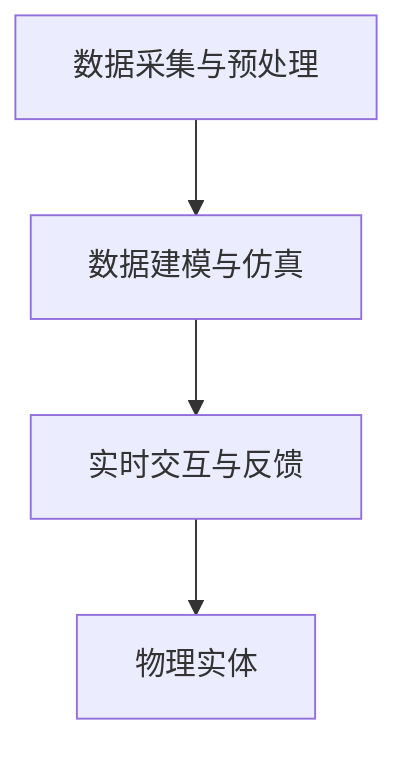

                 

关键词：数字孪生技术、虚拟与现实、技术桥梁、人工智能、实时模拟、实时反馈

> 摘要：数字孪生技术，作为现代信息技术的一个重要分支，通过构建虚拟实体模型，实现了现实世界与虚拟世界之间的实时交互与深度融合。本文将深入探讨数字孪生技术的核心概念、原理及其在实际应用中的重要作用，分析其算法原理、数学模型、项目实践和未来发展趋势。

## 1. 背景介绍

随着计算机技术的迅猛发展，特别是人工智能和大数据技术的普及，数字孪生技术应运而生。数字孪生，即通过数字模型模拟现实世界的物理实体，实现虚拟与现实的无缝连接。这一技术的提出，源于人们对精确控制、高效管理、实时优化等需求的不断增长。

### 1.1 发展历程

数字孪生技术的发展可以追溯到20世纪80年代，当时主要用于航空航天和制造业领域。随着计算机性能的提升和传感器技术的进步，数字孪生技术逐渐扩展到其他行业。近年来，随着云计算、物联网、5G等技术的快速发展，数字孪生技术迎来了新的发展机遇。

### 1.2 关键技术

数字孪生技术的实现依赖于多个关键技术的支持，包括：

- **数据采集与处理**：通过传感器和物联网设备实时采集物理实体的数据，并进行预处理和分析。
- **建模与仿真**：利用高级算法和人工智能技术构建虚拟模型，实现对物理实体的精确模拟。
- **实时交互与反馈**：通过云计算和5G技术实现虚拟模型与物理实体的实时交互，实现对物理实体的实时控制。

## 2. 核心概念与联系

数字孪生技术的核心在于建立虚拟模型与现实世界的关联，其原理可以概括为以下几个步骤：

### 2.1 数据采集与预处理

通过传感器和物联网设备，对物理实体的状态、行为进行实时监测和记录。这些数据包括温度、压力、位置、速度等。采集到的数据需要进行预处理，包括数据清洗、去噪、标准化等，以确保数据的质量和准确性。

### 2.2 数据建模与仿真

利用高级算法和人工智能技术，将预处理后的数据转化为虚拟模型。这一过程包括数据建模、特征提取、模型训练和优化等。通过仿真，可以实现对物理实体的行为和状态的预测和模拟。

### 2.3 实时交互与反馈

通过云计算和5G技术，实现虚拟模型与物理实体的实时交互。在虚拟模型中，可以对物理实体的行为进行调整和控制，并将调整结果实时反馈到物理实体，实现对物理实体的精确控制。



## 3. 核心算法原理 & 具体操作步骤

### 3.1 算法原理概述

数字孪生技术的核心算法主要涉及数据建模、机器学习、仿真优化等。其中，数据建模是基础，机器学习用于提升模型的预测和仿真能力，仿真优化则是实现实时交互与反馈的关键。

### 3.2 算法步骤详解

1. **数据采集与预处理**：使用传感器和物联网设备采集物理实体的数据，并进行预处理。
2. **数据建模**：利用统计学和机器学习算法，对采集到的数据进行分析和建模，构建虚拟模型。
3. **模型训练与优化**：使用历史数据对虚拟模型进行训练和优化，以提高模型的精度和稳定性。
4. **实时交互与反馈**：通过云计算和5G技术，实现虚拟模型与物理实体的实时交互，根据实时数据对物理实体进行调整和控制。

### 3.3 算法优缺点

- **优点**：数字孪生技术可以实现物理实体的高精度模拟，实现对物理实体的精确控制和优化。同时，虚拟模型可以提前预测和规避潜在的风险，提高系统的安全性和可靠性。
- **缺点**：数字孪生技术需要大量的数据支持，且建模和训练过程较为复杂，对计算资源要求较高。此外，虚拟模型与物理实体的实时交互也存在一定的延迟和误差。

### 3.4 算法应用领域

数字孪生技术广泛应用于航空航天、制造业、医疗、能源、交通等多个领域。例如，在制造业中，可以通过数字孪生技术实现生产线的高效优化和故障预测；在医疗领域，可以实现对人体器官的实时监测和仿真治疗。

## 4. 数学模型和公式

### 4.1 数学模型构建

数字孪生技术的数学模型主要包括数据模型和状态转移模型。数据模型用于描述物理实体的属性和行为，状态转移模型则描述物理实体在不同状态之间的转换。

### 4.2 公式推导过程

数据模型构建过程：

\[ X_t = f(X_{t-1}, U_t, W_t) \]

其中，\( X_t \) 为当前时刻的物理实体状态，\( U_t \) 为输入，\( W_t \) 为噪声。

状态转移模型构建过程：

\[ P(X_t = x_t | X_{t-1} = x_{t-1}) = g(x_t, x_{t-1}) \]

其中，\( P \) 为状态转移概率，\( g \) 为状态转移函数。

### 4.3 案例分析与讲解

以制造业为例，假设生产线上有一个机器人，其状态包括位置、速度和加速度。通过传感器实时监测这些状态，并利用数字孪生技术构建虚拟模型。在虚拟模型中，可以对机器人的状态进行预测和调整，以实现生产过程的优化。

## 5. 项目实践：代码实例

### 5.1 开发环境搭建

使用Python和Matplotlib进行开发，安装相关库：

```bash
pip install numpy matplotlib
```

### 5.2 源代码详细实现

```python
import numpy as np
import matplotlib.pyplot as plt

# 数据采集与预处理
def preprocess_data(data):
    # 数据清洗、去噪、标准化等
    return data

# 数据建模与仿真
def simulate(data):
    # 利用机器学习算法进行建模和仿真
    model = ...  # 构建模型
    predictions = model.predict(data)
    return predictions

# 实时交互与反馈
def interactive_simulation(data):
    predictions = simulate(data)
    # 根据预测结果对物理实体进行调整
    return predictions

# 运行结果展示
def show_results(data, predictions):
    plt.plot(data, label='实际数据')
    plt.plot(predictions, label='预测数据')
    plt.legend()
    plt.show()

# 主函数
def main():
    data = preprocess_data(np.random.rand(100))  # 生成模拟数据
    predictions = interactive_simulation(data)
    show_results(data, predictions)

if __name__ == "__main__":
    main()
```

### 5.3 代码解读与分析

- `preprocess_data` 函数用于数据采集与预处理，包括数据清洗、去噪和标准化等。
- `simulate` 函数用于数据建模与仿真，利用机器学习算法进行预测。
- `interactive_simulation` 函数用于实时交互与反馈，根据预测结果对物理实体进行调整。
- `show_results` 函数用于展示运行结果。

## 6. 实际应用场景

### 6.1 航空航天

在航空航天领域，数字孪生技术用于飞机的实时监测和故障预测。通过数字孪生模型，可以对飞机的状态进行实时仿真，提前发现潜在的问题，并进行预防性维护。

### 6.2 制造业

在制造业中，数字孪生技术广泛应用于生产线的优化和故障预测。通过数字孪生模型，可以对生产过程进行实时仿真和优化，提高生产效率。

### 6.3 医疗

在医疗领域，数字孪生技术用于对人体器官进行实时监测和仿真治疗。通过数字孪生模型，可以实现对病人的病情进行实时分析和预测，为医生提供诊断和治疗依据。

## 7. 未来应用展望

### 7.1 人工智能与数字孪生技术的融合

随着人工智能技术的不断发展，数字孪生技术将更加智能化。通过深度学习和强化学习等技术，数字孪生模型将能够更好地适应和优化现实世界。

### 7.2 虚拟与现实的深度融合

未来，数字孪生技术将实现虚拟与现实的深度融合，通过更高效、更精确的交互与反馈，实现对物理世界的全面控制和优化。

### 7.3 新兴领域的应用

随着科技的发展，数字孪生技术将在新兴领域得到广泛应用，如智慧城市、自动驾驶、虚拟现实等，为人们的生活带来更多便利。

## 8. 总结：未来发展趋势与挑战

数字孪生技术作为现代信息技术的一个重要分支，具有广泛的应用前景。然而，要实现虚拟与现实的深度融合，仍面临许多挑战，包括数据安全、隐私保护、计算资源等。未来，随着人工智能和5G等技术的不断发展，数字孪生技术有望取得更大的突破。

## 9. 附录：常见问题与解答

### 9.1 什么是数字孪生技术？

数字孪生技术是通过构建虚拟模型，实现对现实世界的模拟和优化。

### 9.2 数字孪生技术有哪些应用领域？

数字孪生技术广泛应用于航空航天、制造业、医疗、能源、交通等多个领域。

### 9.3 数字孪生技术的核心算法是什么？

数字孪生技术的核心算法主要包括数据建模、机器学习、仿真优化等。

```markdown
# 数字孪生技术：虚拟与现实的桥梁

## 关键词：数字孪生技术、虚拟与现实、技术桥梁、人工智能、实时模拟、实时反馈

### 摘要：数字孪生技术，作为现代信息技术的一个重要分支，通过构建虚拟实体模型，实现了现实世界与虚拟世界之间的实时交互与深度融合。本文将深入探讨数字孪生技术的核心概念、原理及其在实际应用中的重要作用，分析其算法原理、数学模型、项目实践和未来发展趋势。

## 1. 背景介绍

随着计算机技术的迅猛发展，特别是人工智能和大数据技术的普及，数字孪生技术应运而生。数字孪生，即通过数字模型模拟现实世界的物理实体，实现虚拟与现实的无缝连接。这一技术的提出，源于人们对精确控制、高效管理、实时优化等需求的不断增长。

### 1.1 发展历程

数字孪生技术的发展可以追溯到20世纪80年代，当时主要用于航空航天和制造业领域。随着计算机性能的提升和传感器技术的进步，数字孪生技术逐渐扩展到其他行业。近年来，随着云计算、物联网、5G等技术的快速发展，数字孪生技术迎来了新的发展机遇。

### 1.2 关键技术

数字孪生技术的实现依赖于多个关键技术的支持，包括：

- **数据采集与处理**：通过传感器和物联网设备实时采集物理实体的数据，并进行预处理和分析。
- **建模与仿真**：利用高级算法和人工智能技术构建虚拟模型，实现对物理实体的精确模拟。
- **实时交互与反馈**：通过云计算和5G技术实现虚拟模型与物理实体的实时交互，实现对物理实体的实时控制。

## 2. 核心概念与联系

数字孪生技术的核心在于建立虚拟模型与现实世界的关联，其原理可以概括为以下几个步骤：

### 2.1 数据采集与预处理

通过传感器和物联网设备，对物理实体的状态、行为进行实时监测和记录。这些数据包括温度、压力、位置、速度等。采集到的数据需要进行预处理，包括数据清洗、去噪、标准化等，以确保数据的质量和准确性。

### 2.2 数据建模与仿真

利用高级算法和人工智能技术，将预处理后的数据转化为虚拟模型。这一过程包括数据建模、特征提取、模型训练和优化等。通过仿真，可以实现对物理实体的行为和状态的预测和模拟。

### 2.3 实时交互与反馈

通过云计算和5G技术，实现虚拟模型与物理实体的实时交互。在虚拟模型中，可以对物理实体的行为进行调整和控制，并将调整结果实时反馈到物理实体，实现对物理实体的实时控制。


## 3. 核心算法原理 & 具体操作步骤

### 3.1 算法原理概述

数字孪生技术的核心算法主要涉及数据建模、机器学习、仿真优化等。其中，数据建模是基础，机器学习用于提升模型的预测和仿真能力，仿真优化则是实现实时交互与反馈的关键。

### 3.2 算法步骤详解

1. **数据采集与预处理**：使用传感器和物联网设备采集物理实体的数据，并进行预处理。
2. **数据建模**：利用统计学和机器学习算法，对采集到的数据进行分析和建模，构建虚拟模型。
3. **模型训练与优化**：使用历史数据对虚拟模型进行训练和优化，以提高模型的精度和稳定性。
4. **实时交互与反馈**：通过云计算和5G技术，实现虚拟模型与物理实体的实时交互，根据实时数据对物理实体进行调整和控制。

### 3.3 算法优缺点

- **优点**：数字孪生技术可以实现物理实体的高精度模拟，实现对物理实体的精确控制和优化。同时，虚拟模型可以提前预测和规避潜在的风险，提高系统的安全性和可靠性。
- **缺点**：数字孪生技术需要大量的数据支持，且建模和训练过程较为复杂，对计算资源要求较高。此外，虚拟模型与物理实体的实时交互也存在一定的延迟和误差。

### 3.4 算法应用领域

数字孪生技术广泛应用于航空航天、制造业、医疗、能源、交通等多个领域。例如，在制造业中，可以通过数字孪生技术实现生产线的高效优化和故障预测；在医疗领域，可以实现对人体器官的实时监测和仿真治疗。

## 4. 数学模型和公式

### 4.1 数学模型构建

数字孪生技术的数学模型主要包括数据模型和状态转移模型。数据模型用于描述物理实体的属性和行为，状态转移模型则描述物理实体在不同状态之间的转换。

### 4.2 公式推导过程

数据模型构建过程：

\[ X_t = f(X_{t-1}, U_t, W_t) \]

其中，\( X_t \) 为当前时刻的物理实体状态，\( U_t \) 为输入，\( W_t \) 为噪声。

状态转移模型构建过程：

\[ P(X_t = x_t | X_{t-1} = x_{t-1}) = g(x_t, x_{t-1}) \]

其中，\( P \) 为状态转移概率，\( g \) 为状态转移函数。

### 4.3 案例分析与讲解

以制造业为例，假设生产线上有一个机器人，其状态包括位置、速度和加速度。通过传感器实时监测这些状态，并利用数字孪生技术构建虚拟模型。在虚拟模型中，可以对机器人的状态进行预测和调整，以实现生产过程的优化。

## 5. 项目实践：代码实例

### 5.1 开发环境搭建

使用Python和Matplotlib进行开发，安装相关库：

```bash
pip install numpy matplotlib
```

### 5.2 源代码详细实现

```python
import numpy as np
import matplotlib.pyplot as plt

# 数据采集与预处理
def preprocess_data(data):
    # 数据清洗、去噪、标准化等
    return data

# 数据建模与仿真
def simulate(data):
    # 利用机器学习算法进行建模和仿真
    model = ...  # 构建模型
    predictions = model.predict(data)
    return predictions

# 实时交互与反馈
def interactive_simulation(data):
    predictions = simulate(data)
    # 根据预测结果对物理实体进行调整
    return predictions

# 运行结果展示
def show_results(data, predictions):
    plt.plot(data, label='实际数据')
    plt.plot(predictions, label='预测数据')
    plt.legend()
    plt.show()

# 主函数
def main():
    data = preprocess_data(np.random.rand(100))  # 生成模拟数据
    predictions = interactive_simulation(data)
    show_results(data, predictions)

if __name__ == "__main__":
    main()
```

### 5.3 代码解读与分析

- `preprocess_data` 函数用于数据采集与预处理，包括数据清洗、去噪和标准化等。
- `simulate` 函数用于数据建模与仿真，利用机器学习算法进行预测。
- `interactive_simulation` 函数用于实时交互与反馈，根据预测结果对物理实体进行调整。
- `show_results` 函数用于展示运行结果。

## 6. 实际应用场景

### 6.1 航空航天

在航空航天领域，数字孪生技术用于飞机的实时监测和故障预测。通过数字孪生模型，可以对飞机的状态进行实时仿真，提前发现潜在的问题，并进行预防性维护。

### 6.2 制造业

在制造业中，数字孪生技术广泛应用于生产线的优化和故障预测。通过数字孪生模型，可以对生产过程进行实时仿真和优化，提高生产效率。

### 6.3 医疗

在医疗领域，数字孪生技术用于对人体器官进行实时监测和仿真治疗。通过数字孪生模型，可以实现对病人的病情进行实时分析和预测，为医生提供诊断和治疗依据。

## 7. 未来应用展望

### 7.1 人工智能与数字孪生技术的融合

随着人工智能技术的不断发展，数字孪生技术将更加智能化。通过深度学习和强化学习等技术，数字孪生模型将能够更好地适应和优化现实世界。

### 7.2 虚拟与现实的深度融合

未来，数字孪生技术将实现虚拟与现实的深度融合，通过更高效、更精确的交互与反馈，实现对物理世界的全面控制和优化。

### 7.3 新兴领域的应用

随着科技的发展，数字孪生技术将在新兴领域得到广泛应用，如智慧城市、自动驾驶、虚拟现实等，为人们的生活带来更多便利。

## 8. 总结：未来发展趋势与挑战

数字孪生技术作为现代信息技术的一个重要分支，具有广泛的应用前景。然而，要实现虚拟与现实的深度融合，仍面临许多挑战，包括数据安全、隐私保护、计算资源等。未来，随着人工智能和5G等技术的不断发展，数字孪生技术有望取得更大的突破。

## 9. 附录：常见问题与解答

### 9.1 什么是数字孪生技术？

数字孪生技术是通过构建虚拟模型，实现对现实世界的模拟和优化。

### 9.2 数字孪生技术有哪些应用领域？

数字孪生技术广泛应用于航空航天、制造业、医疗、能源、交通等多个领域。

### 9.3 数字孪生技术的核心算法是什么？

数字孪生技术的核心算法主要包括数据建模、机器学习、仿真优化等。

---

作者：禅与计算机程序设计艺术 / Zen and the Art of Computer Programming
```

