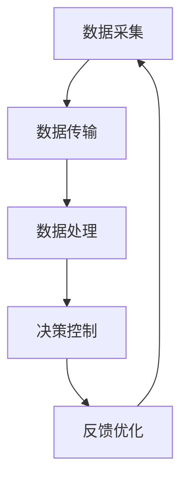

                 

 关键词：数字化实体、物理实体、自动化、未来趋势、技术创新

> 摘要：本文将探讨数字实体与物理实体的融合，以及自动化技术的发展趋势。通过分析现有技术框架和应用场景，本文旨在揭示这一领域的核心概念、算法原理，以及未来可能面临的挑战和机遇。

## 1. 背景介绍

随着信息技术和智能制造的迅速发展，数字实体与物理实体的融合已经成为当前研究和应用的热点。数字实体，即信息化的虚拟存在，如数据、算法、软件等；物理实体，即现实世界的物质形态，如机器、设备、产品等。二者的融合不仅能够提高生产效率，还能极大地提升产品和服务质量。

近年来，物联网（IoT）、人工智能（AI）、大数据等技术的飞速进步，为数字实体与物理实体的深度融合提供了强有力的技术支撑。例如，智能家居、智能工厂、自动驾驶等领域，都在积极探索自动化技术，以实现更加高效、智能的运营模式。

## 2. 核心概念与联系

### 2.1 数字实体与物理实体的概念

数字实体：在信息技术领域，数字实体指的是以数字形式存在的信息、数据和算法。这些实体通过计算机和通信技术进行存储、传输和处理。

物理实体：物理实体是现实世界中具有物理形态的物质。它们可以通过物理传感器进行感知和操作，如机器人、汽车、家电等。

### 2.2 融合框架

数字实体与物理实体的融合框架主要包括以下几个方面：

1. **数据采集与传输**：通过传感器、摄像头等设备采集物理实体的状态数据，并将这些数据传输到数字实体进行处理。

2. **数据处理与存储**：利用云计算、边缘计算等技术对采集到的数据进行分析和处理，形成有价值的信息。

3. **决策与控制**：基于处理得到的信息，利用算法和模型对物理实体进行决策和控制，实现自动化操作。

4. **反馈与优化**：物理实体的操作结果会反馈到数字实体中，用于调整算法和模型，以实现持续的优化。

### 2.3 Mermaid 流程图

下面是一个简化的数字实体与物理实体融合的 Mermaid 流程图：



## 3. 核心算法原理 & 具体操作步骤

### 3.1 算法原理概述

数字实体与物理实体的自动化涉及多种算法，如机器学习、深度学习、模糊控制等。以下是几种常见算法的原理概述：

1. **机器学习**：通过训练数据集，使算法能够自动识别模式和规律，从而对新的数据做出预测。

2. **深度学习**：基于多层神经网络，通过反向传播算法优化权重，实现对复杂数据的处理和识别。

3. **模糊控制**：利用模糊逻辑处理不确定性和模糊性，实现对物理实体的控制。

### 3.2 算法步骤详解

以机器学习算法为例，其具体步骤如下：

1. **数据预处理**：清洗和整理数据，确保数据质量。

2. **特征提取**：从原始数据中提取出有用的特征信息。

3. **模型训练**：选择合适的模型，使用训练数据集进行训练。

4. **模型评估**：使用测试数据集对模型进行评估，调整模型参数。

5. **模型应用**：将训练好的模型应用到实际场景中，进行预测和控制。

### 3.3 算法优缺点

每种算法都有其优缺点，适用于不同的场景：

1. **机器学习**：适用于复杂数据的处理，但需要大量训练数据和计算资源。

2. **深度学习**：处理能力强大，但模型复杂，训练时间长。

3. **模糊控制**：处理不确定性和模糊性能力强，但对精确控制能力有限。

### 3.4 算法应用领域

自动化算法广泛应用于各个领域，如：

1. **智能制造**：通过机器学习和深度学习算法，实现生产过程的自动化和智能化。

2. **智能交通**：通过深度学习算法，实现车辆的自适应控制和交通流量预测。

3. **智能家居**：通过模糊控制算法，实现家电的自动化控制。

## 4. 数学模型和公式 & 详细讲解 & 举例说明

### 4.1 数学模型构建

在自动化过程中，数学模型起着至关重要的作用。以下是几个常见的数学模型：

1. **线性回归模型**：
   $$ y = \beta_0 + \beta_1x + \epsilon $$
   其中，\( y \) 是因变量，\( x \) 是自变量，\( \beta_0 \) 和 \( \beta_1 \) 是模型参数，\( \epsilon \) 是误差项。

2. **神经网络模型**：
   $$ a_{i}^{(l)} = \sigma(z_{i}^{(l)}) $$
   其中，\( a_{i}^{(l)} \) 是第 \( l \) 层的第 \( i \) 个激活值，\( z_{i}^{(l)} \) 是第 \( l \) 层的第 \( i \) 个节点输入，\( \sigma \) 是激活函数。

### 4.2 公式推导过程

以线性回归模型为例，推导过程如下：

1. **最小二乘法**：
   $$ \min_{\beta} \sum_{i=1}^{n}(y_i - \beta_0 - \beta_1x_i)^2 $$
   其中，\( n \) 是数据点的数量。

2. **梯度下降法**：
   $$ \beta_0 := \beta_0 - \alpha \frac{\partial}{\partial \beta_0} L(\beta) $$
   $$ \beta_1 := \beta_1 - \alpha \frac{\partial}{\partial \beta_1} L(\beta) $$
   其中，\( \alpha \) 是学习率，\( L(\beta) \) 是损失函数。

### 4.3 案例分析与讲解

以自动驾驶为例，分析自动驾驶中使用的数学模型和算法。

1. **状态估计**：使用卡尔曼滤波器对车辆状态进行估计，公式如下：
   $$ x_{k} = F_{k-1}x_{k-1} + B_{k-1}u_{k-1} + w_{k-1} $$
   $$ P_{k} = F_{k-1}P_{k-1}F_{k-1}^T + Q_{k-1} $$
   其中，\( x_{k} \) 是状态向量，\( P_{k} \) 是状态协方差矩阵，\( F_{k-1} \) 是状态转移矩阵，\( B_{k-1} \) 是控制输入矩阵，\( u_{k-1} \) 是控制向量，\( w_{k-1} \) 是过程噪声。

2. **路径规划**：使用深度强化学习算法，根据环境状态和车辆位置，规划最佳行驶路径。

## 5. 项目实践：代码实例和详细解释说明

### 5.1 开发环境搭建

1. **安装Python环境**：在计算机上安装Python，版本建议为3.8及以上。

2. **安装依赖库**：使用pip命令安装必要的依赖库，如numpy、scikit-learn、tensorflow等。

### 5.2 源代码详细实现

以下是一个简单的线性回归模型实现：

```python
import numpy as np
from sklearn.linear_model import LinearRegression

# 数据预处理
X = np.array([0, 1, 2, 3, 4]).reshape(-1, 1)
y = np.array([0, 1, 1, 3, 2])

# 模型训练
model = LinearRegression()
model.fit(X, y)

# 模型评估
score = model.score(X, y)
print(f'Model Score: {score}')

# 模型应用
new_data = np.array([5]).reshape(-1, 1)
prediction = model.predict(new_data)
print(f'Prediction: {prediction}')
```

### 5.3 代码解读与分析

1. **数据预处理**：将输入数据进行reshape操作，使其符合线性回归模型的输入要求。

2. **模型训练**：使用scikit-learn库中的LinearRegression类进行模型训练。

3. **模型评估**：使用score方法评估模型在训练数据上的表现。

4. **模型应用**：使用训练好的模型对新的数据进行预测。

### 5.4 运行结果展示

1. **模型评估结果**：打印模型在训练数据上的评估分数。

2. **预测结果**：打印对新的输入数据的预测结果。

## 6. 实际应用场景

数字实体与物理实体的自动化技术已经广泛应用于各个领域，以下是一些典型的应用场景：

1. **智能制造**：通过自动化技术，实现生产线的无人化作业，提高生产效率。

2. **智能交通**：通过自动驾驶技术，减少交通事故，提高交通效率。

3. **智能家居**：通过自动化技术，实现家电的智能控制，提高生活质量。

## 7. 未来应用展望

随着技术的不断发展，数字实体与物理实体的自动化有望在更多领域得到应用。未来，我们将看到更加智能、高效的自动化系统，为我们的生活和工作带来更多便利。

## 8. 工具和资源推荐

### 8.1 学习资源推荐

1. **《深度学习》**：由Ian Goodfellow、Yoshua Bengio和Aaron Courville合著，是深度学习领域的经典教材。

2. **《Python机器学习》**：由Sebastian Raschka和Vahid Mirjalili合著，详细介绍了机器学习在Python中的实现。

### 8.2 开发工具推荐

1. **TensorFlow**：Google开发的开源机器学习框架，适用于深度学习和机器学习项目的开发。

2. **scikit-learn**：Python中最常用的机器学习库之一，提供了丰富的机器学习算法和工具。

### 8.3 相关论文推荐

1. **“Deep Learning for Autonomous Driving”**：详细介绍了深度学习在自动驾驶中的应用。

2. **“Internet of Things: A Survey”**：对物联网技术进行了全面的综述。

## 9. 总结：未来发展趋势与挑战

### 9.1 研究成果总结

数字实体与物理实体的自动化技术已经取得了显著的成果，涵盖了智能制造、智能交通、智能家居等多个领域。

### 9.2 未来发展趋势

随着人工智能、物联网等技术的发展，数字实体与物理实体的自动化将更加智能化、高效化。

### 9.3 面临的挑战

1. **数据安全与隐私**：自动化过程中涉及大量数据传输和处理，数据安全和隐私保护是一个重要挑战。

2. **算法透明性与可解释性**：深度学习等算法的复杂性使得其透明性和可解释性成为一个亟待解决的问题。

### 9.4 研究展望

未来，我们需要在算法优化、数据处理、系统安全等方面进行深入研究，以实现数字实体与物理实体的更加高效、智能的融合。

## 10. 附录：常见问题与解答

### 10.1 如何实现自动化控制？

自动化控制通常涉及传感器、控制器和执行器。传感器用于感知物理实体的状态，控制器根据传感器数据执行算法进行决策，执行器根据控制器的决策进行物理操作。

### 10.2 自动化技术有哪些优点？

自动化技术的优点包括提高生产效率、降低人力成本、减少错误和提升产品质量等。

### 10.3 自动化技术有哪些缺点？

自动化技术的缺点包括初期投资成本高、维护复杂度大、对专业技能要求高等。

### 10.4 自动化技术会取代人类吗？

自动化技术并不会完全取代人类，而是与人类协同工作，提高生产效率和智能化水平。

### 10.5 自动化技术有哪些应用领域？

自动化技术的应用领域非常广泛，包括智能制造、智能交通、智能家居、医疗健康等。

### 10.6 自动化技术的未来发展有哪些趋势？

自动化技术的未来发展将更加智能化、高效化，涉及人工智能、物联网、大数据等新兴技术。

