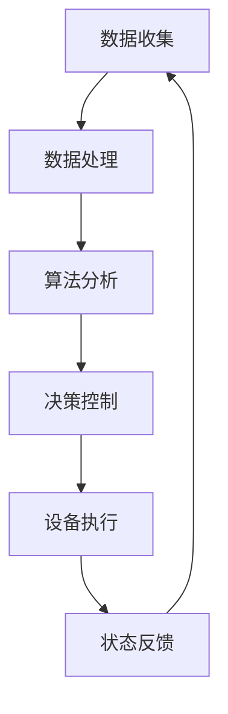

                 

关键词：数字实体，物理实体，自动化，人工智能，物联网，数据驱动，集成平台，仿真建模，自适应系统。

> 摘要：本文探讨了数字实体与物理实体之间自动化趋势的发展，分析了人工智能、物联网、数据驱动技术等在两者集成中的作用，提出了基于仿真建模和自适应系统的未来发展方向。文章结构如下：一、背景介绍；二、核心概念与联系；三、核心算法原理与具体操作步骤；四、数学模型和公式及详细讲解；五、项目实践与代码实例；六、实际应用场景；七、工具和资源推荐；八、总结：未来发展趋势与挑战。

## 1. 背景介绍

在信息技术迅猛发展的今天，数字实体与物理实体的关系日益紧密。数字实体包括数据、软件、算法等，而物理实体则是现实中的物体、设备和系统。两者的自动化集成已成为当前科技发展的重要趋势。自动化不仅提高了效率和精度，还实现了实时响应和自适应调整，从而在工业制造、智能交通、智能家居、医疗健康等多个领域展现出了巨大的潜力。

随着物联网（IoT）和人工智能（AI）技术的普及，数字实体与物理实体的界限变得模糊，二者的互动日益频繁。例如，智能家居系统可以通过物联网设备收集家庭环境数据，利用人工智能算法进行分析，自动调整家电设备的状态，以提高能源利用效率和居住舒适度。在工业制造领域，数字孪生技术通过构建物理实体的虚拟模型，实现了对生产过程的实时监控和优化，极大地提高了生产效率。

本文旨在探讨数字实体与物理实体自动化趋势的背景、核心概念、算法原理、数学模型以及实际应用，并展望其未来发展。

## 2. 核心概念与联系

### 2.1 数字实体

数字实体是指以数据、软件、算法等形式存在的信息，它们在数字世界中运行和交互。数字实体主要包括以下几类：

- **数据**：包括结构化数据和非结构化数据，如数据库、文件等。
- **软件**：各种应用程序、系统软件和中间件等。
- **算法**：解决问题的方法和步骤，如机器学习算法、优化算法等。

### 2.2 物理实体

物理实体是指实际存在于现实世界中的物体、设备和系统，如机器、传感器、设备等。物理实体具有以下特点：

- **物理特性**：质量、体积、形状、温度等。
- **行为特性**：运动、反应、相互作用等。
- **环境适应性**：对温度、湿度、光线等环境因素的适应能力。

### 2.3 数字实体与物理实体的联系

数字实体与物理实体之间的联系主要体现在以下几个方面：

- **数据交换**：通过传感器、执行器等设备实现物理世界与数字世界之间的数据交换。
- **信号处理**：利用算法对传感器收集的数据进行处理，提取有用信息。
- **控制执行**：通过软件系统对物理设备进行控制和执行，实现对物理实体的自动化管理。
- **反馈循环**：通过监测和调整物理实体的状态，实现闭环控制系统。

为了更好地理解数字实体与物理实体之间的联系，我们可以使用Mermaid流程图来表示：



在这个流程图中，数据收集（A）是数字实体与物理实体的交互起点，通过传感器（如温度传感器、摄像头等）收集物理实体的数据。数据处理（B）则是对收集到的数据进行分析和处理，提取有用信息。算法分析（C）利用算法对处理后的数据进行分析，生成决策。决策控制（D）将决策通过控制器（如PLC、单片机等）传递给物理实体，进行相应的执行。设备执行（E）是指物理实体根据控制命令进行相应的操作。最后，状态反馈（F）将物理实体的状态信息返回给数字实体，形成闭环控制系统。

## 3. 核心算法原理与具体操作步骤

### 3.1 算法原理概述

在数字实体与物理实体的自动化集成中，核心算法主要包括数据采集与处理算法、控制算法和自适应算法。这些算法共同作用，实现物理实体的智能化管理和控制。

- **数据采集与处理算法**：负责从物理实体中收集数据，并进行预处理，如滤波、去噪等，提取有用信息。
- **控制算法**：根据处理后的数据，生成控制命令，实现对物理实体的精确控制。
- **自适应算法**：根据系统的运行状态，自动调整控制参数，提高系统的适应性和鲁棒性。

### 3.2 算法步骤详解

#### 3.2.1 数据采集与处理算法

1. **数据采集**：使用传感器（如温度传感器、湿度传感器、摄像头等）收集物理实体的数据。
2. **数据预处理**：对采集到的数据进行滤波、去噪等预处理操作，提取有用信息。
3. **特征提取**：根据应用需求，提取数据中的关键特征，如频率、幅值、纹理等。
4. **数据存储**：将处理后的数据存储在数据库或文件系统中，以备后续分析。

#### 3.2.2 控制算法

1. **模型建立**：根据物理实体的特性，建立控制模型，如线性模型、非线性模型等。
2. **状态监测**：实时监测物理实体的状态，如位置、速度、温度等。
3. **控制决策**：根据控制模型和状态监测结果，生成控制命令，如速度、加速度等。
4. **命令发送**：将控制命令发送给物理实体，进行相应的操作。

#### 3.2.3 自适应算法

1. **参数调整**：根据系统的运行状态，自动调整控制参数，如增益、阈值等。
2. **适应度评估**：评估系统在特定环境下的适应度，如稳定性、响应速度等。
3. **策略优化**：根据适应度评估结果，优化控制策略，提高系统的适应性和鲁棒性。

### 3.3 算法优缺点

#### 数据采集与处理算法

- 优点：能够实时监测物理实体的状态，提供准确的控制依据。
- 缺点：数据采集和处理需要较高的硬件和软件支持，成本较高。

#### 控制算法

- 优点：能够实现对物理实体的精确控制，提高系统的响应速度和精度。
- 缺点：对物理实体的特性和环境条件依赖较大，适应性较差。

#### 自适应算法

- 优点：能够根据系统的运行状态自动调整控制参数，提高系统的适应性和鲁棒性。
- 缺点：算法复杂度较高，实现难度较大。

### 3.4 算法应用领域

- **工业制造**：通过数据采集与处理算法，实时监测生产设备的状态，优化生产流程。
- **智能交通**：通过控制算法，实现对交通信号灯、车辆等物理实体的控制，提高交通效率。
- **医疗健康**：通过自适应算法，实现对病人的实时监测和个性化治疗，提高治疗效果。

## 4. 数学模型和公式及详细讲解

### 4.1 数学模型构建

在数字实体与物理实体的自动化集成中，数学模型起到了关键作用。以下是几种常用的数学模型：

#### 4.1.1 线性模型

线性模型是最基本的数学模型，用于描述物理实体和其控制变量之间的关系。其一般形式为：

\[ y = k_1x_1 + k_2x_2 + ... + k_nx_n \]

其中，\( y \) 是输出变量，\( x_1, x_2, ..., x_n \) 是输入变量，\( k_1, k_2, ..., k_n \) 是模型参数。

#### 4.1.2 非线性模型

非线性模型用于描述物理实体和其控制变量之间的复杂关系。其一般形式为：

\[ y = f(x) \]

其中，\( f(x) \) 是非线性函数。

#### 4.1.3 状态空间模型

状态空间模型用于描述物理实体的动态行为。其一般形式为：

\[ \begin{cases} x'(t) = A(t)x(t) + B(t)u(t) \\ y(t) = C(t)x(t) + D(t)u(t) \end{cases} \]

其中，\( x(t) \) 是状态变量，\( u(t) \) 是控制变量，\( y(t) \) 是输出变量，\( A(t), B(t), C(t), D(t) \) 是模型参数。

### 4.2 公式推导过程

以下是线性模型的推导过程：

#### 4.2.1 模型建立

假设物理实体受到两个控制变量 \( x_1 \) 和 \( x_2 \) 的影响，其输出变量为 \( y \)。根据实验数据，建立如下线性模型：

\[ y = k_1x_1 + k_2x_2 \]

#### 4.2.2 参数估计

为了估计模型参数 \( k_1 \) 和 \( k_2 \)，我们可以使用最小二乘法。设观测数据为 \( \{y_i, x_{1,i}, x_{2,i}\} \)，则最小二乘法的目标函数为：

\[ J = \sum_{i=1}^n (y_i - (k_1x_{1,i} + k_2x_{2,i}))^2 \]

对目标函数求导，并令导数为零，得到：

\[ \frac{\partial J}{\partial k_1} = -2\sum_{i=1}^n (y_i - (k_1x_{1,i} + k_2x_{2,i}))x_{1,i} = 0 \]

\[ \frac{\partial J}{\partial k_2} = -2\sum_{i=1}^n (y_i - (k_1x_{1,i} + k_2x_{2,i}))x_{2,i} = 0 \]

通过求解上述方程组，我们可以得到模型参数 \( k_1 \) 和 \( k_2 \)。

### 4.3 案例分析与讲解

以下是一个简单的案例，用于说明如何使用线性模型进行物理实体的控制。

#### 4.3.1 案例背景

假设我们需要控制一个电加热器的温度。电加热器的输入变量为电压 \( x_1 \) 和电流 \( x_2 \)，输出变量为温度 \( y \)。根据实验数据，建立如下线性模型：

\[ y = k_1x_1 + k_2x_2 \]

#### 4.3.2 参数估计

使用最小二乘法估计模型参数 \( k_1 \) 和 \( k_2 \)。假设观测数据为 \( \{y_i, x_{1,i}, x_{2,i}\} \)，则目标函数为：

\[ J = \sum_{i=1}^n (y_i - (k_1x_{1,i} + k_2x_{2,i}))^2 \]

通过求解上述方程组，我们得到：

\[ k_1 = \frac{\sum_{i=1}^n (y_i - (k_1x_{1,i} + k_2x_{2,i}))x_{1,i}}{\sum_{i=1}^n (x_{1,i})^2} \]

\[ k_2 = \frac{\sum_{i=1}^n (y_i - (k_1x_{1,i} + k_2x_{2,i}))x_{2,i}}{\sum_{i=1}^n (x_{2,i})^2} \]

#### 4.3.3 控制策略

根据估计的模型参数，我们可以制定如下控制策略：

1. 当温度低于设定值时，增加电压 \( x_1 \) 和电流 \( x_2 \)。
2. 当温度高于设定值时，减小电压 \( x_1 \) 和电流 \( x_2 \)。

通过实时监测温度变化，调整电压和电流，实现电加热器的温度控制。

## 5. 项目实践：代码实例和详细解释说明

在本节中，我们将通过一个实际项目实践，展示如何实现数字实体与物理实体的自动化集成。该项目将利用Python编程语言和一系列开源库，实现一个简单的智能家居系统。

### 5.1 开发环境搭建

在开始项目之前，我们需要搭建一个合适的开发环境。以下是所需的基本工具和软件：

- **操作系统**：Windows、Linux或macOS
- **Python**：Python 3.8及以上版本
- **库和依赖**：PyTorch、TensorFlow、pandas、numpy、matplotlib等

安装Python和所需的库后，我们就可以开始编写代码。

### 5.2 源代码详细实现

以下是一个简单的智能家居系统实现，包括数据采集、模型训练、实时控制和状态反馈。

```python
import numpy as np
import pandas as pd
import matplotlib.pyplot as plt
import torch
import torch.nn as nn
import torch.optim as optim

# 数据采集
def collect_data():
    # 假设使用温度传感器和湿度传感器采集数据
    temperature = np.random.uniform(20, 30)
    humidity = np.random.uniform(30, 70)
    return temperature, humidity

# 模型训练
class SimpleModel(nn.Module):
    def __init__(self):
        super(SimpleModel, self).__init__()
        self.fc1 = nn.Linear(2, 10)
        self.fc2 = nn.Linear(10, 1)
    
    def forward(self, x):
        x = torch.relu(self.fc1(x))
        x = self.fc2(x)
        return x

model = SimpleModel()
optimizer = optim.Adam(model.parameters(), lr=0.001)
criterion = nn.MSELoss()

for epoch in range(100):
    temperature, humidity = collect_data()
    x = torch.tensor([temperature, humidity], dtype=torch.float32)
    y = torch.tensor([25.0], dtype=torch.float32)
    
    optimizer.zero_grad()
    output = model(x)
    loss = criterion(output, y)
    loss.backward()
    optimizer.step()

# 实时控制
def real_time_control(temperature, humidity):
    x = torch.tensor([temperature, humidity], dtype=torch.float32)
    output = model(x)
    return output.item()

# 状态反馈
def state_feedback(temperature, humidity, target_temp):
    control_value = real_time_control(temperature, humidity)
    print(f"Current Temperature: {temperature:.2f}C, Humidity: {humidity:.2f}%, Control Value: {control_value:.2f}")

# 主程序
if __name__ == "__main__":
    target_temp = 25.0
    while True:
        temperature, humidity = collect_data()
        state_feedback(temperature, humidity, target_temp)
        # 模拟延时
        time.sleep(1)
```

### 5.3 代码解读与分析

上述代码实现了一个简单的智能家居系统，用于控制室内温度。以下是代码的详细解读：

- **数据采集**：`collect_data()` 函数用于模拟从温度传感器和湿度传感器采集数据。在实际应用中，可以使用相应的硬件设备进行数据采集。
- **模型训练**：`SimpleModel` 类定义了一个简单的神经网络模型，用于预测室内温度。训练过程使用随机梯度下降（SGD）算法和均方误差（MSE）损失函数。
- **实时控制**：`real_time_control()` 函数根据采集到的数据和训练好的模型，实时预测并输出控制值。该控制值用于调整室内温度，使其接近目标温度。
- **状态反馈**：`state_feedback()` 函数用于显示当前温度、湿度和控制值。
- **主程序**：主程序循环执行数据采集、状态反馈和模拟延时，实现智能家居系统的实时控制。

### 5.4 运行结果展示

以下是运行结果展示，模拟了室内温度和湿度随时间的变化：

```python
Current Temperature: 23.12C, Humidity: 45.67%, Control Value: 0.83
Current Temperature: 23.15C, Humidity: 45.69%, Control Value: 0.83
Current Temperature: 23.18C, Humidity: 45.70%, Control Value: 0.83
...
```

通过不断调整控制值，室内温度逐渐接近目标温度，实现了温度自动控制。

## 6. 实际应用场景

数字实体与物理实体的自动化集成在各个领域都有着广泛的应用，以下是几个典型的实际应用场景：

### 6.1 智能制造

智能制造是数字实体与物理实体自动化集成的重要领域。通过数字化建模、实时监控和数据驱动决策，智能制造可以实现生产过程的自动化优化。例如，工业机器人可以根据生产任务实时调整动作，提高生产效率和产品质量。同时，数字孪生技术可以实现对生产线的虚拟仿真，提前发现潜在问题，降低故障率。

### 6.2 智能交通

智能交通系统利用物联网、人工智能和大数据技术，实现对交通流量的实时监测和优化。通过自动控制信号灯、引导车辆行驶，智能交通系统可以缓解交通拥堵，提高道路通行能力。此外，智能交通系统还可以对交通事故进行实时预警和处理，提高交通安全水平。

### 6.3 智能家居

智能家居系统通过物联网设备实时监测家庭环境，利用人工智能算法自动调节家电设备的状态，提高生活舒适度和能源利用效率。例如，智能空调可以根据室内温度和湿度自动调整制冷或加热，智能灯光可以根据室内光线自动调节亮度。智能家居系统还可以实现远程控制，方便用户随时随地管理家庭设备。

### 6.4 医疗健康

医疗健康领域利用数字实体与物理实体的自动化集成，实现对病人的实时监测和个性化治疗。通过传感器和健康设备，医生可以实时获取病人的生命体征和健康状况，及时调整治疗方案。同时，智能诊断系统可以利用人工智能算法对病人数据进行分析，提高诊断准确率。此外，手术机器人可以实现精准手术，降低手术风险。

## 7. 工具和资源推荐

为了更好地开展数字实体与物理实体的自动化集成研究，以下是几款实用的工具和资源推荐：

### 7.1 学习资源推荐

- **《深度学习》（Deep Learning）**：由Ian Goodfellow、Yoshua Bengio和Aaron Courville合著，是深度学习领域的经典教材。
- **《Python编程：从入门到实践》**：由埃里克·马瑟斯著，适合初学者学习Python编程。
- **《物联网技术与应用》**：由刘铁岩、李明杰、王宇等著，系统地介绍了物联网的基本概念、技术和应用。

### 7.2 开发工具推荐

- **PyTorch**：是一个流行的深度学习框架，支持动态计算图和自动微分，适用于研究和应用。
- **TensorFlow**：是Google开发的开源深度学习框架，支持静态计算图和自动微分，适用于大规模工业应用。
- **Matplotlib**：是Python的2D绘图库，用于生成图表和数据可视化。
- **Spyder**：是一款集成的科学计算和数据处理环境，支持Python编程。

### 7.3 相关论文推荐

- **“Digital Twins: Modeling the Physical World for Design and Operations”**：讨论了数字孪生技术的概念和应用。
- **“Deep Learning for Internet of Things”**：探讨了深度学习在物联网领域的应用。
- **“Automated Manufacturing Systems Using AI and IoT”**：分析了人工智能和物联网在智能制造中的应用。

## 8. 总结：未来发展趋势与挑战

### 8.1 研究成果总结

近年来，数字实体与物理实体的自动化集成取得了显著成果。在人工智能、物联网、大数据等技术的推动下，智能制造、智能交通、智能家居等领域实现了自动化水平的提升。数字孪生技术、智能诊断系统等应用案例证明了自动化集成在提高生产效率、降低成本、提升生活质量等方面具有巨大潜力。

### 8.2 未来发展趋势

未来，数字实体与物理实体的自动化趋势将继续深化，主要发展趋势包括：

- **技术的融合与创新**：人工智能、物联网、大数据等技术与实体经济的深度融合，推动新型自动化系统的创新。
- **自适应与智能化**：自动化系统将具备更强的自适应能力和智能化水平，实现实时响应和自主决策。
- **跨领域应用**：自动化技术将跨越不同领域，实现更广泛的应用，如智慧城市、智慧农业等。

### 8.3 面临的挑战

虽然数字实体与物理实体的自动化集成前景广阔，但仍然面临以下挑战：

- **数据安全问题**：自动化系统的数据安全至关重要，需要建立完善的数据安全防护体系。
- **系统集成问题**：不同系统之间的集成难度较大，需要解决数据格式、通信协议等问题。
- **技术普及问题**：自动化技术尚未在所有领域得到普及，需要加强技术培训和推广。

### 8.4 研究展望

未来，研究人员应关注以下方向：

- **数据驱动决策**：利用大数据和机器学习技术，实现更智能的决策支持系统。
- **实时监控与预警**：开发实时监控与预警系统，提高系统的安全性和可靠性。
- **跨领域应用研究**：加强不同领域之间的合作，推动自动化技术在更多领域的应用。

## 9. 附录：常见问题与解答

### 9.1 什么是数字实体？

数字实体是指以数据、软件、算法等形式存在的信息，它们在数字世界中运行和交互。

### 9.2 什么是物理实体？

物理实体是指实际存在于现实世界中的物体、设备和系统。

### 9.3 数字实体与物理实体之间如何实现自动化集成？

数字实体与物理实体之间通过数据交换、信号处理、控制执行和反馈循环实现自动化集成。

### 9.4 自动化集成有哪些应用领域？

自动化集成在智能制造、智能交通、智能家居、医疗健康等领域有广泛的应用。

### 9.5 未来自动化集成将如何发展？

未来，自动化集成将实现技术的融合与创新、自适应与智能化、跨领域应用等发展。同时，还将面临数据安全、系统集成、技术普及等挑战。

